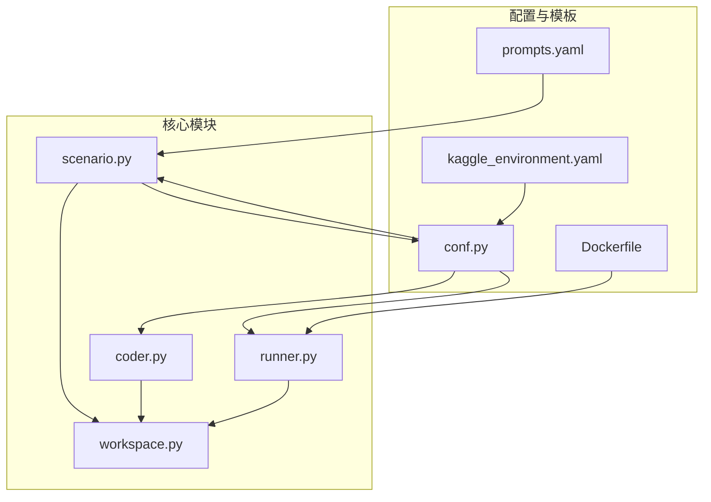
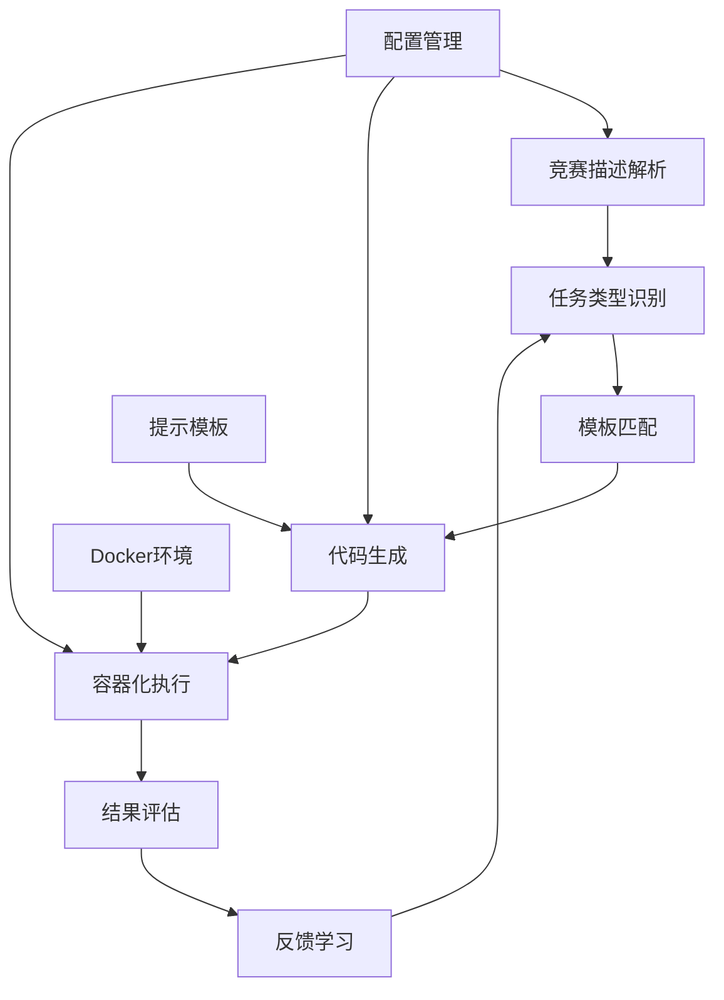
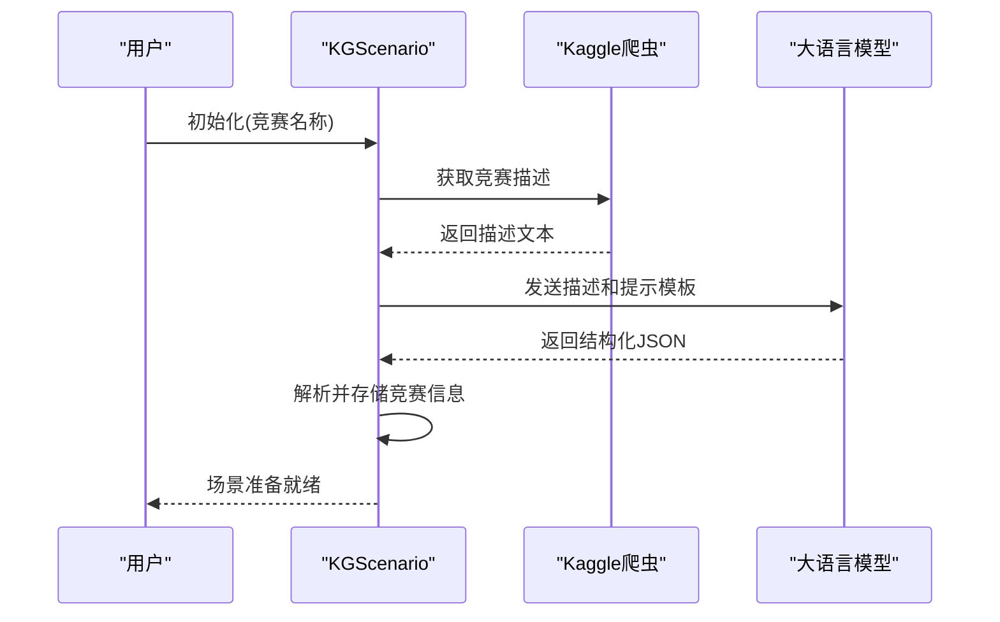
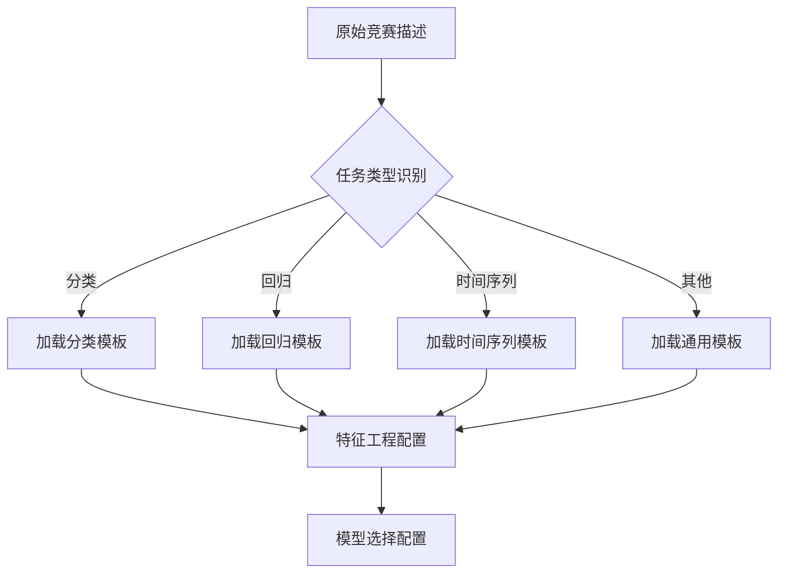
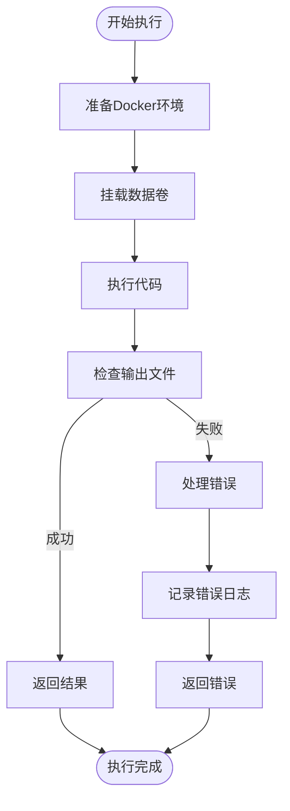
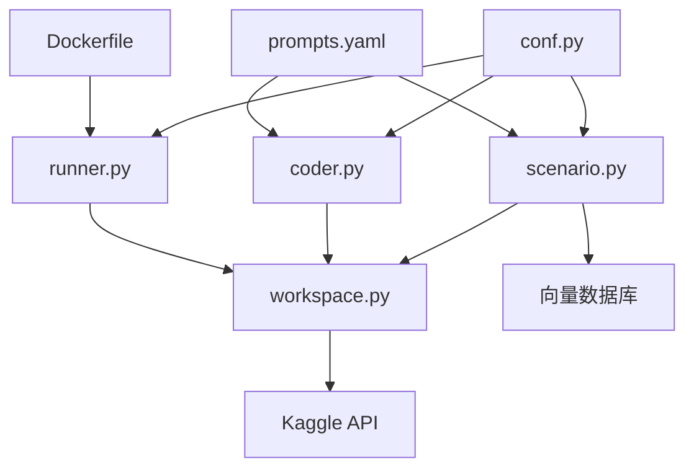

# Kaggle竞赛场景API

<cite>
**本文档引用的文件**
- [scenario.py](file://rdagent/scenarios/kaggle/experiment/scenario.py)
- [workspace.py](file://rdagent/scenarios/kaggle/experiment/workspace.py)
- [conf.py](file://rdagent/app/kaggle/conf.py)
- [prompts.yaml](file://rdagent/scenarios/kaggle/experiment/prompts.yaml)
- [coder.py](file://rdagent/scenarios/kaggle/developer/coder.py)
- [runner.py](file://rdagent/scenarios/kaggle/developer/runner.py)
- [Dockerfile](file://rdagent/scenarios/kaggle/docker/kaggle_docker/Dockerfile)
- [kaggle_environment.yaml](file://rdagent/scenarios/data_science/sing_docker/kaggle_environment.yaml)
</cite>

## 目录
1. [简介](#简介)
2. [项目结构](#项目结构)
3. [核心组件](#核心组件)
4. [架构概述](#架构概述)
5. [详细组件分析](#详细组件分析)
6. [依赖分析](#依赖分析)
7. [性能考虑](#性能考虑)
8. [故障排除指南](#故障排除指南)
9. [结论](#结论)

## 简介
本文档详细说明了Kaggle竞赛场景（KaggleScenario）的API设计与实现。该系统专为自动化Kaggle竞赛任务而构建，提供从实验初始化、代码生成与执行到结果提交的完整解决方案。文档重点介绍系统如何通过模板匹配机制识别任务类型，利用Docker容器化环境执行代码，并通过Kaggle API进行交互。同时，文档还涵盖了工作区管理、提交文件生成以及提示模板的自定义方法，为扩展支持新的竞赛类型和评估指标提供了指导。

## 项目结构
Kaggle竞赛场景的项目结构围绕核心功能模块组织，主要包括场景定义、开发者组件、工作区管理和配置文件。系统通过分层架构实现了任务初始化、代码生成、执行和反馈的自动化流程。



**图示来源**
- [scenario.py](file://rdagent/scenarios/kaggle/experiment/scenario.py)
- [workspace.py](file://rdagent/scenarios/kaggle/experiment/workspace.py)
- [coder.py](file://rdagent/scenarios/kaggle/developer/coder.py)
- [runner.py](file://rdagent/scenarios/kaggle/developer/runner.py)

**本节来源**
- [scenario.py](file://rdagent/scenarios/kaggle/experiment/scenario.py)
- [workspace.py](file://rdagent/scenarios/kaggle/experiment/workspace.py)

## 核心组件
Kaggle竞赛场景的核心组件包括KGScenario、KGFBWorkspace、KGFactorCoSTEER和KGModelRunner等类，它们共同构成了自动化竞赛解决方案的基础。KGScenario负责竞赛任务的初始化和环境配置，KGFBWorkspace管理实验工作区的文件和执行，KGFactorCoSTEER和KGModelCoSTEER分别处理特征工程和模型代码的生成，而KGFactorRunner和KGModelRunner则负责代码的执行和结果评估。

**本节来源**
- [scenario.py](file://rdagent/scenarios/kaggle/experiment/scenario.py)
- [workspace.py](file://rdagent/scenarios/kaggle/experiment/workspace.py)
- [coder.py](file://rdagent/scenarios/kaggle/developer/coder.py)
- [runner.py](file://rdagent/scenarios/kaggle/developer/runner.py)

## 架构概述
Kaggle竞赛场景采用模块化架构，将任务处理流程分解为独立的组件，通过清晰的接口进行通信。系统从竞赛描述解析开始，经过任务类型识别、模板匹配、代码生成、容器化执行到结果反馈，形成一个完整的自动化循环。



**图示来源**
- [scenario.py](file://rdagent/scenarios/kaggle/experiment/scenario.py)
- [workspace.py](file://rdagent/scenarios/kaggle/experiment/workspace.py)
- [conf.py](file://rdagent/app/kaggle/conf.py)

## 详细组件分析

### Kaggle场景初始化
Kaggle场景初始化流程从竞赛名称开始，系统首先下载相关数据，然后通过自然语言处理技术解析竞赛描述，提取关键信息如任务类型、目标变量、特征描述和提交规范。这一过程由KGScenario类的`__init__`方法驱动，调用`crawl_descriptions`函数获取竞赛详情，并通过LLM（大语言模型）分析生成结构化信息。



**图示来源**
- [scenario.py](file://rdagent/scenarios/kaggle/experiment/scenario.py#L42-L100)
- [prompts.yaml](file://rdagent/scenarios/kaggle/experiment/prompts.yaml#L1-L50)

#### 任务类型识别与模板匹配
系统通过分析竞赛描述来识别任务类型（如分类、回归、时间序列预测等），并根据任务类型选择相应的处理模板。这一机制确保了系统能够适应不同类型的Kaggle竞赛，从简单的表格数据预测到复杂的图像识别任务。



**图示来源**
- [scenario.py](file://rdagent/scenarios/kaggle/experiment/scenario.py#L100-L150)
- [prompts.yaml](file://rdagent/scenarios/kaggle/experiment/prompts.yaml#L50-L100)

### 代码生成与执行接口
coder与runner组件构成了Kaggle环境下的代码生成与执行核心。coder组件负责根据任务需求生成Python代码，而runner组件则在隔离的Docker环境中执行这些代码，确保了执行的安全性和一致性。

#### coder组件分析
coder组件基于CoSTEER框架实现，通过模板化提示（prompts）引导大语言模型生成符合规范的代码。KGFactorCoSTEER和KGModelCoSTEER分别处理特征工程和模型代码的生成，确保生成的代码能够无缝集成到现有的工作流中。

```mermaid
classDiagram
class KGFactorCoSTEER {
+develop(exp : KGFactorExperiment) KGFactorExperiment
-generate_feature_code(task : Task) str
-validate_code(code : str) bool
}
class KGModelCoSTEER {
+develop(exp : KGModelExperiment) KGModelExperiment
-generate_model_code(task : Task) str
-validate_code(code : str) bool
}
class Developer {
<<abstract>>
+develop(exp : Experiment) Experiment
}
KGFactorCoSTEER --|> Developer
KGModelCoSTEER --|> Developer
KGFactorCoSTEER --> "1" "prompts.yaml"
KGModelCoSTEER --> "1" "prompts.yaml"
```

**图示来源**
- [coder.py](file://rdagent/scenarios/kaggle/developer/coder.py)
- [prompts.yaml](file://rdagent/scenarios/kaggle/experiment/prompts.yaml)

#### runner组件分析
runner组件负责在Docker容器中执行生成的代码，通过KGDockerEnv类管理容器的生命周期。执行过程中，系统会将本地数据卷挂载到容器中，确保代码能够访问竞赛数据，并将执行结果保存到指定位置。



**图示来源**
- [runner.py](file://rdagent/scenarios/kaggle/developer/runner.py#L50-L100)
- [workspace.py](file://rdagent/scenarios/kaggle/experiment/workspace.py#L50-L80)

### 工作区管理
工作区管理是Kaggle竞赛场景的核心功能之一，KGFBWorkspace类负责管理实验的所有文件和状态。系统通过模板文件夹初始化工作区，注入必要的代码文件，并在执行过程中动态更新工作区内容。

**本节来源**
- [workspace.py](file://rdagent/scenarios/kaggle/experiment/workspace.py)

### 提交文件生成
系统在执行完成后自动生成符合Kaggle竞赛要求的提交文件（submission.csv），并通过验证确保文件格式正确。这一过程由工作区的execute方法驱动，在Docker容器中完成。

**本节来源**
- [workspace.py](file://rdagent/scenarios/kaggle/experiment/workspace.py#L80-L97)

### Kaggle API交互
虽然当前实现主要通过本地Docker环境模拟Kaggle执行环境，但系统设计支持与真实Kaggle API的交互。通过配置auto_submit参数，系统可以在本地验证成功后自动将结果提交到Kaggle平台。

**本节来源**
- [conf.py](file://rdagent/app/kaggle/conf.py#L30-L40)

## 依赖分析
Kaggle竞赛场景的依赖关系清晰地展示了各组件之间的交互模式。系统通过配置文件集中管理依赖，确保了组件间的松耦合和高内聚。



**图示来源**
- [conf.py](file://rdagent/app/kaggle/conf.py)
- [scenario.py](file://rdagent/scenarios/kaggle/experiment/scenario.py)
- [coder.py](file://rdagent/scenarios/kaggle/developer/coder.py)
- [runner.py](file://rdagent/scenarios/kaggle/developer/runner.py)

## 性能考虑
系统在设计时充分考虑了性能优化，通过缓存机制避免重复计算，利用Docker容器的快速启动特性提高执行效率，并通过并行化处理多个实验来加速迭代过程。此外，系统还实现了超时控制和资源限制，防止单个实验占用过多计算资源。

## 故障排除指南
当系统遇到执行失败时，会抛出相应的异常（如CoderError、RunnerError等），并记录详细的错误日志。用户可以通过检查日志文件和执行输出来诊断问题，常见的故障包括代码格式错误、运行时异常和输出文件缺失等。

**本节来源**
- [runner.py](file://rdagent/scenarios/kaggle/developer/runner.py#L100-L131)
- [core/exception.py](file://rdagent/core/exception.py)

## 结论
Kaggle竞赛场景API提供了一个完整的自动化解决方案，从竞赛初始化到结果提交的各个环节都实现了高度自动化。通过模块化设计和清晰的接口定义，系统不仅能够高效处理现有的Kaggle竞赛任务，还具备良好的扩展性，可以轻松适应新的竞赛类型和评估指标。未来的工作可以集中在优化提示模板、增强错误恢复能力和支持更多类型的机器学习任务上。