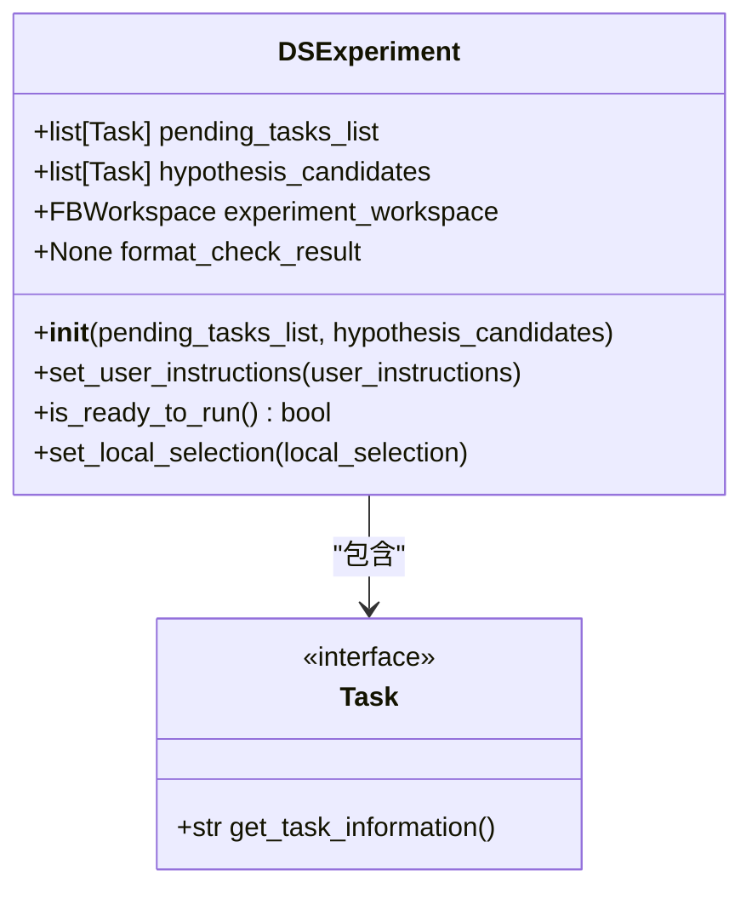
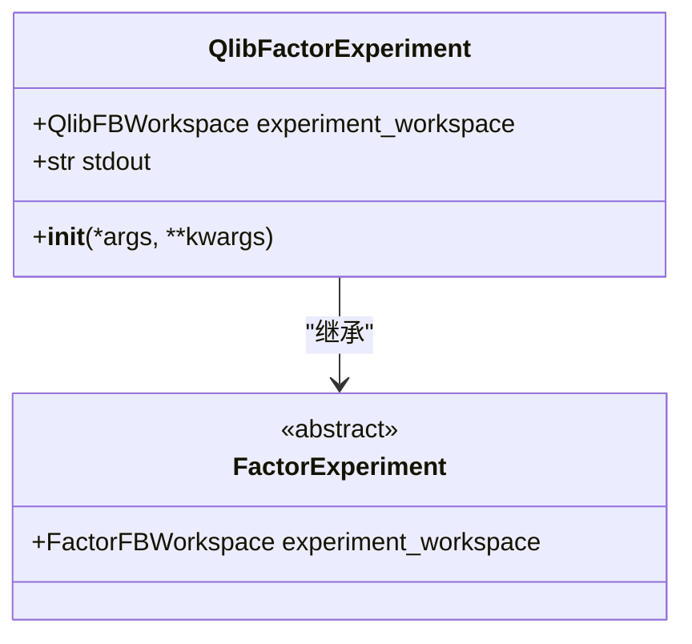
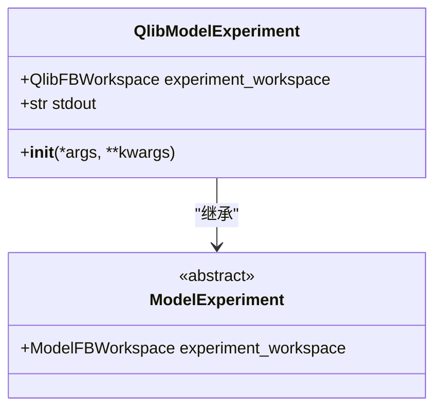
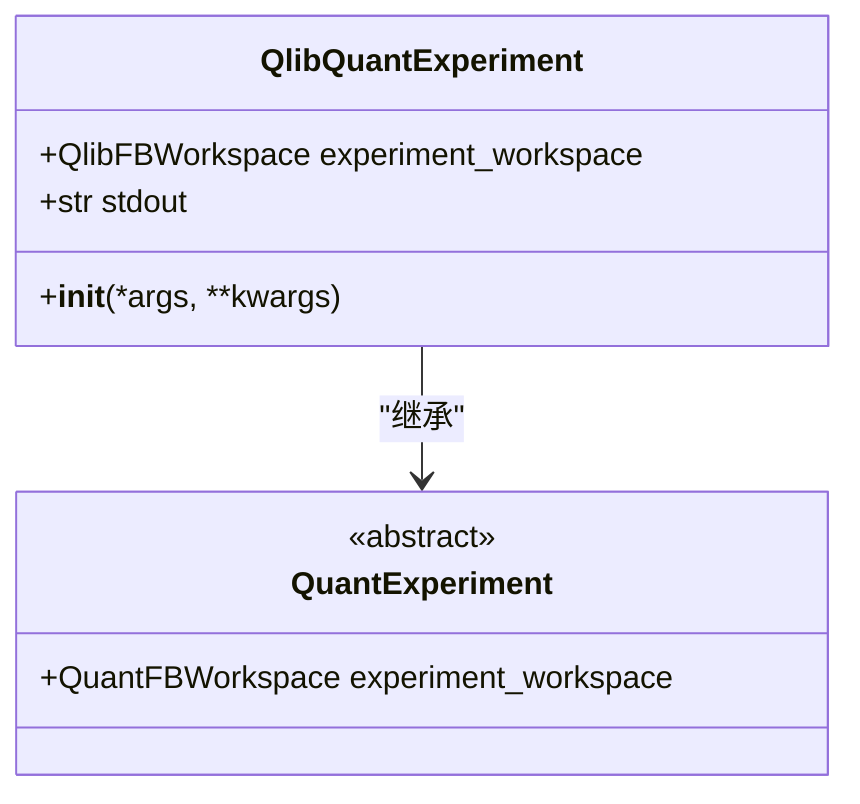
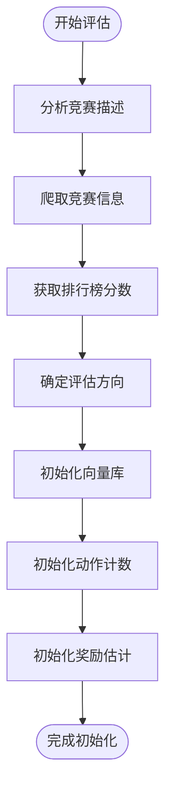
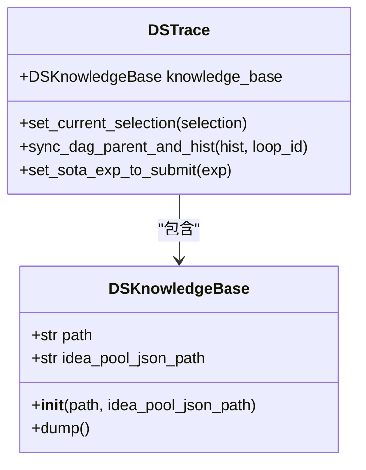
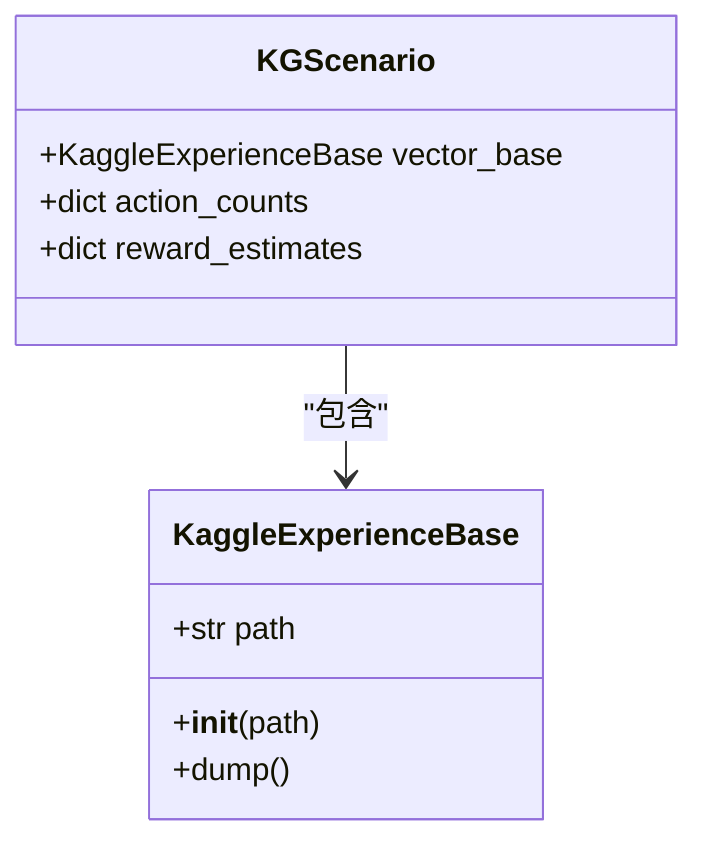
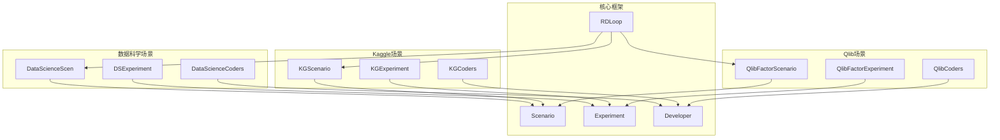

# 应用场景API

<cite>
**本文档中引用的文件**   
- [DataScienceScenario](file://rdagent\scenarios\data_science\scen\__init__.py)
- [QlibScenario](file://rdagent\scenarios\qlib\experiment\factor_experiment.py)
- [KaggleScenario](file://rdagent\scenarios\kaggle\experiment\scenario.py)
- [GeneralModelScenario](file://rdagent\scenarios\general_model\scenario.py)
- [data_science.conf](file://rdagent\app\data_science\conf.py)
- [kaggle.conf](file://rdagent\app\kaggle\conf.py)
- [qlib_rd_loop.conf](file://rdagent\app\qlib_rd_loop\conf.py)
- [experiment.py](file://rdagent\scenarios\data_science\experiment\experiment.py)
- [loop.py](file://rdagent\scenarios\data_science\loop.py)
</cite>

## 目录
1. [引言](#引言)
2. [场景初始化与配置](#场景初始化与配置)
3. [实验类型与管理接口](#实验类型与管理接口)
4. [评估方法与反馈机制](#评估方法与反馈机制)
5. [知识积累模式](#知识积累模式)
6. [场景集成与差异分析](#场景集成与差异分析)

## 引言
本文档详细说明了RD-Agent框架中各个应用场景的API设计，包括DataScienceScenario、QlibScenario、KaggleScenario和GeneralModelScenario。文档涵盖了这些场景的初始化参数、配置文件结构、执行入口以及特有的实验类型创建与管理接口。同时，文档还说明了各场景特定的评估方法、反馈机制和知识积累模式，并提供了配置示例和代码片段，展示如何定制化各场景的行为。

## 场景初始化与配置

### DataScienceScenario
DataScienceScenario是数据科学场景的基础实现，支持Kaggle竞赛等数据科学任务。该场景通过`DataScienceScen`类实现，其初始化需要指定竞赛名称。

**初始化参数**:
- `competition`: 竞赛名称，用于定位数据和配置

**配置文件结构**:
通过`DataScienceBasePropSetting`类定义，主要配置项包括：
- `scen`: 场景类，可设置为`rdagent.scenarios.data_science.scen.KaggleScen`或`rdagent.scenarios.data_science.scen.DataScienceScen`
- `hypothesis_gen`: 假设生成类，如`rdagent.scenarios.data_science.proposal.exp_gen.router.ParallelMultiTraceExpGen`
- `interactor`: 交互器类，如`rdagent.components.interactor.SkipInteractor`
- `summarizer`: 总结器类，如`rdagent.scenarios.data_science.dev.feedback.DSExperiment2Feedback`
- `debug_timeout`和`full_timeout`: 调试和完整运行的超时设置
- `enable_knowledge_base`: 是否启用知识库

**执行入口**:
通过`DataScienceRDLoop`类实现，该类继承自`RDLoop`，提供了完整的研发循环。

**Section sources**
- [DataScienceScenario](file://rdagent\scenarios\data_science\scen\__init__.py#L1-L290)
- [data_science.conf](file://rdagent\app\data_science\conf.py#L1-L207)
- [loop.py](file://rdagent\scenarios\data_science\loop.py#L1-L384)

### QlibScenario
QlibScenario是量化投资场景的实现，包括因子实验、模型实验和量化实验三种类型。

**初始化参数**:
- 无特定参数，通过配置文件设置

**配置文件结构**:
通过`FactorBasePropSetting`、`ModelBasePropSetting`和`QuantBasePropSetting`类定义，主要配置项包括：
- `scen`: 场景类，如`rdagent.scenarios.qlib.experiment.factor_experiment.QlibFactorScenario`
- `hypothesis_gen`: 假设生成类，如`rdagent.scenarios.qlib.proposal.factor_proposal.QlibFactorHypothesisGen`
- `hypothesis2experiment`: 假设到实验的转换类
- `coder`: 编码器类
- `runner`: 运行器类
- `summarizer`: 总结器类

**执行入口**:
通过`QLibRDLoop`类实现，根据配置选择不同的场景类型。

**Section sources**
- [QlibScenario](file://rdagent\scenarios\qlib\experiment\factor_experiment.py#L1-L91)
- [qlib_rd_loop.conf](file://rdagent\app\qlib_rd_loop\conf.py#L1-L121)

### KaggleScenario
KaggleScenario是Kaggle竞赛场景的实现，专门针对Kaggle平台的竞赛任务。

**初始化参数**:
- `competition`: 竞赛名称

**配置文件结构**:
通过`KaggleBasePropSetting`类定义，主要配置项包括：
- `scen`: 场景类，设置为`rdagent.scenarios.kaggle.experiment.scenario.KGScenario`
- `hypothesis_gen`: 假设生成类，如`rdagent.scenarios.kaggle.proposal.proposal.KGHypothesisGen`
- `feature_coder`和`model_coder`: 特征和模型编码器类
- `summarizer`: 总结器类
- `if_using_vector_rag`和`if_using_graph_rag`: 是否启用向量和图RAG

**执行入口**:
通过`KaggleRDLoop`类实现，集成在数据科学循环中。

**Section sources**
- [KaggleScenario](file://rdagent\scenarios\kaggle\experiment\scenario.py#L1-L282)
- [kaggle.conf](file://rdagent\app\kaggle\conf.py#L1-L97)

### GeneralModelScenario
GeneralModelScenario是通用模型场景的实现，适用于一般性的模型开发任务。

**初始化参数**:
- 无参数

**配置文件结构**:
通过`GeneralModelScenario`类实现，主要配置项通过模板文件定义：
- `general_model_background`: 场景背景
- `general_model_output_format`: 输出格式
- `general_model_interface`: 接口规范
- `general_model_simulator`: 模拟器描述

**执行入口**:
通过`GeneralModelLoop`类实现，提供基本的研发循环。

**Section sources**
- [GeneralModelScenario](file://rdagent\scenarios\general_model\scenario.py#L1-L56)

## 实验类型与管理接口

### 数据科学实验
数据科学实验通过`DSExperiment`类实现，支持多种组件类型：



**Diagram sources**
- [experiment.py](file://rdagent\scenarios\data_science\experiment\experiment.py#L1-L44)

支持的组件类型包括：
- DataLoadSpec: 数据加载规范
- FeatureEng: 特征工程
- Model: 模型
- Ensemble: 集成学习
- Workflow: 工作流
- Pipeline: 管道

### 因子实验
因子实验通过`QlibFactorExperiment`类实现，专门用于量化投资中的因子开发。



**Diagram sources**
- [factor_experiment.py](file://rdagent\scenarios\qlib\experiment\factor_experiment.py#L1-L91)

### 模型实验
模型实验通过`QlibModelExperiment`类实现，用于量化投资中的模型开发。



**Diagram sources**
- [model_experiment.py](file://rdagent\scenarios\qlib\experiment\model_experiment.py#L1-L81)

### 量化实验
量化实验通过`QlibQuantExperiment`类实现，结合因子和模型进行综合量化策略开发。



**Diagram sources**
- [quant_experiment.py](file://rdagent\scenarios\qlib\experiment\quant_experiment.py#L1-L58)

## 评估方法与反馈机制

### 数据科学场景评估
数据科学场景的评估通过`DSExperiment2Feedback`类实现，提供实验反馈。

**反馈机制特点**:
- 基于实验结果生成反馈
- 支持多轮迭代优化
- 集成在`DataScienceRDLoop`的反馈阶段

```mermaid
sequenceDiagram
participant Loop as DataScienceRDLoop
participant ExpGen as DSProposalV2ExpGen
participant Coder as DataScienceCoders
participant Runner as DSCoSTEERRunner
participant Feedback as DSExperiment2Feedback
Loop->>ExpGen : direct_exp_gen()
ExpGen-->>Loop : 返回实验
Loop->>Coder : coding()
Coder-->>Loop : 返回编码后实验
Loop->>Runner : running()
Runner-->>Loop : 返回运行后实验
Loop->>Feedback : feedback()
Feedback-->>Loop : 返回反馈
Loop->>Loop : record()
```

**Diagram sources**
- [loop.py](file://rdagent\scenarios\data_science\loop.py#L1-L384)
- [feedback.py](file://rdagent\scenarios\data_science\dev\feedback.py#L1-L10)

### Kaggle场景评估
Kaggle场景的评估通过`KGExperiment2Feedback`类实现，专门针对Kaggle竞赛的评估需求。

**评估特点**:
- 基于Kaggle排行榜分数
- 支持UCB算法决策
- 集成向量和图RAG



**Diagram sources**
- [scenario.py](file://rdagent\scenarios\kaggle\experiment\scenario.py#L1-L282)
- [feedback.py](file://rdagent\scenarios\kaggle\developer\feedback.py#L1-L50)

### Qlib场景评估
Qlib场景的评估通过`QlibFactorExperiment2Feedback`和`QlibModelExperiment2Feedback`类实现。

**评估特点**:
- 分别针对因子和模型的评估
- 集成在`QLibRDLoop`中
- 支持多轮演化

## 知识积累模式

### 数据科学场景知识积累
数据科学场景通过`DSKnowledgeBase`类实现知识积累，支持v1版本的知识库。

**知识积累特点**:
- 基于MCTS调度器
- 支持跨轨迹多样性注入
- 可配置知识库路径



**Diagram sources**
- [idea_pool.py](file://rdagent\scenarios\data_science\proposal\exp_gen\idea_pool.py#L1-L100)
- [trace_scheduler.py](file://rdagent\scenarios\data_science\proposal\exp_gen\trace_scheduler.py#L1-L50)

### Kaggle场景知识积累
Kaggle场景通过`KaggleExperienceBase`类实现知识积累，支持向量和图RAG。

**知识积累特点**:
- 向量库基于Pickle存储
- 图RAG支持高级知识检索
- 可配置RAG路径



**Diagram sources**
- [vector_base.py](file://rdagent\scenarios\kaggle\knowledge_management\vector_base.py#L1-L50)
- [scenario.py](file://rdagent\scenarios\kaggle\experiment\scenario.py#L1-L282)

## 场景集成与差异分析

### 场景集成点
所有场景都集成在核心框架中，通过统一的接口进行交互。



**Diagram sources**
- [core.py](file://rdagent\core\scenario.py#L1-L65)
- [loop.py](file://rdagent\scenarios\data_science\loop.py#L1-L384)

### 场景共性
各场景的共性包括：
- 都继承自`Scenario`基类
- 都实现`get_scenario_all_desc`方法
- 都有类似的配置结构
- 都集成在`RDLoop`中
- 都支持假设生成、编码、运行和反馈的完整循环

### 场景差异
各场景的主要差异：

| 特性 | DataScienceScenario | KaggleScenario | QlibScenario | GeneralModelScenario |
|------|-------------------|---------------|------------|-------------------|
| 主要用途 | 通用数据科学任务 | Kaggle竞赛 | 量化投资 | 通用模型开发 |
| 初始化参数 | competition | competition | 无 | 无 |
| 特有组件 | 数据加载、特征工程 | 特征处理、模型调优 | 因子、模型 | 通用模型 |
| 评估方式 | 自定义评估 | Kaggle排行榜 | 量化指标 | 自定义评估 |
| 知识积累 | MCTS、跨轨迹多样性 | 向量RAG、图RAG | 基础知识库 | 无 |
| 执行环境 | 通用Python环境 | Kaggle环境 | Qlib环境 | 通用环境 |

**Section sources**
- [scenario.py](file://rdagent\core\scenario.py#L1-L65)
- [data_science\scen\__init__.py](file://rdagent\scenarios\data_science\scen\__init__.py#L1-L290)
- [kaggle\experiment\scenario.py](file://rdagent\scenarios\kaggle\experiment\scenario.py#L1-L282)
- [qlib\experiment\factor_experiment.py](file://rdagent\scenarios\qlib\experiment\factor_experiment.py#L1-L91)
- [general_model\scenario.py](file://rdagent\scenarios\general_model\scenario.py#L1-L56)