# 数据科学场景API文档

<cite>
**本文档引用的文件**
- [loop.py](file://rdagent/scenarios/data_science/loop.py)
- [base.py](file://rdagent/scenarios/data_science/proposal/exp_gen/base.py)
- [proposal.py](file://rdagent/scenarios/data_science/proposal/exp_gen/proposal.py)
- [experiment.py](file://rdagent/scenarios/data_science/experiment/experiment.py)
- [idea_pool.py](file://rdagent/scenarios/data_science/proposal/exp_gen/idea_pool.py)
- [diversity_strategy.py](file://rdagent/scenarios/data_science/proposal/exp_gen/diversity_strategy.py)
- [merge.py](file://rdagent/scenarios/data_science/proposal/exp_gen/merge.py)
- [conf.py](file://rdagent/app/data_science/conf.py)
- [scen/__init__.py](file://rdagent/scenarios/data_science/scen/__init__.py)
- [ds_costeer.py](file://rdagent/components/coder/data_science/share/ds_costeer.py)
- [knowledge_management.py](file://rdagent/components/coder/CoSTEER/knowledge_management.py)
</cite>

## 目录
1. [简介](#简介)
2. [项目结构](#项目结构)
3. [核心组件](#核心组件)
4. [架构概览](#架构概览)
5. [详细组件分析](#详细组件分析)
6. [依赖关系分析](#依赖关系分析)
7. [性能考虑](#性能考虑)
8. [故障排除指南](#故障排除指南)
9. [结论](#结论)

## 简介

数据科学场景（DataScienceScenario）是R&D-Agent框架中的核心模块，专门用于自动化数据科学任务的探索和优化。该场景提供了完整的端到端解决方案，从数据加载、特征工程、模型构建到集成策略的全流程自动化处理。

该系统基于CoSTEER框架构建，集成了知识管理系统和智能评估组件，支持多线程并行探索、智能提案生成、多样性注入策略和自动合并机制。通过模块化的架构设计，用户可以轻松定制数据科学自动化流程，实现高效的实验管理和结果优化。

## 项目结构

数据科学场景采用分层架构设计，主要包含以下核心目录结构：

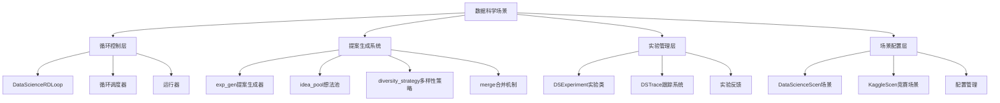

**图表来源**
- [loop.py](file://rdagent/scenarios/data_science/loop.py#L1-L50)
- [base.py](file://rdagent/scenarios/data_science/proposal/exp_gen/base.py#L1-L50)

**章节来源**
- [loop.py](file://rdagent/scenarios/data_science/loop.py#L1-L100)
- [base.py](file://rdagent/scenarios/data_science/proposal/exp_gen/base.py#L1-L100)

## 核心组件

### DataScienceRDLoop - 主循环控制器

DataScienceRDLoop是整个数据科学场景的核心控制器，负责协调各个子系统的协同工作。它继承自RDLoop基类，提供了完整的实验循环管理功能。

#### 初始化流程

```mermaid
sequenceDiagram
participant Config as 配置系统
participant Loop as DataScienceRDLoop
participant ExpGen as 提案生成器
participant Coders as 编码器集合
participant Runner as 运行器
Config->>Loop : 加载配置参数
Loop->>Loop : 初始化场景对象
Loop->>ExpGen : 创建提案生成器实例
Loop->>Coders : 初始化各组件编码器
Loop->>Runner : 创建运行器实例
Loop->>Loop : 构建知识库跟踪系统
```

**图表来源**
- [loop.py](file://rdagent/scenarios/data_science/loop.py#L85-L120)

#### 核心配置参数

| 参数名称 | 类型 | 默认值 | 描述 |
|---------|------|--------|------|
| scen | str | "rdagent.scenarios.data_science.scen.KaggleScen" | 场景类路径 |
| hypothesis_gen | str | "rdagent.scenarios.data_science.proposal.exp_gen.router.ParallelMultiTraceExpGen" | 提案生成策略 |
| interactor | str | "rdagent.components.interactor.SkipInteractor" | 交互器类型 |
| trace_scheduler | str | "rdagent.scenarios.data_science.proposal.exp_gen.trace_scheduler.RoundRobinScheduler" | 跟踪调度器 |
| summarizer | str | "rdagent.scenarios.data_science.dev.feedback.DSExperiment2Feedback" | 总结器类型 |

**章节来源**
- [loop.py](file://rdagent/scenarios/data_science/loop.py#L85-L120)
- [conf.py](file://rdagent/app/data_science/conf.py#L10-L50)

### 提案生成系统（exp_gen）

提案生成系统是数据科学场景的核心创新之一，通过智能算法生成高质量的实验提案。

#### idea_pool - 想法池系统

idea_pool提供了基于知识图谱的想法存储和检索机制：

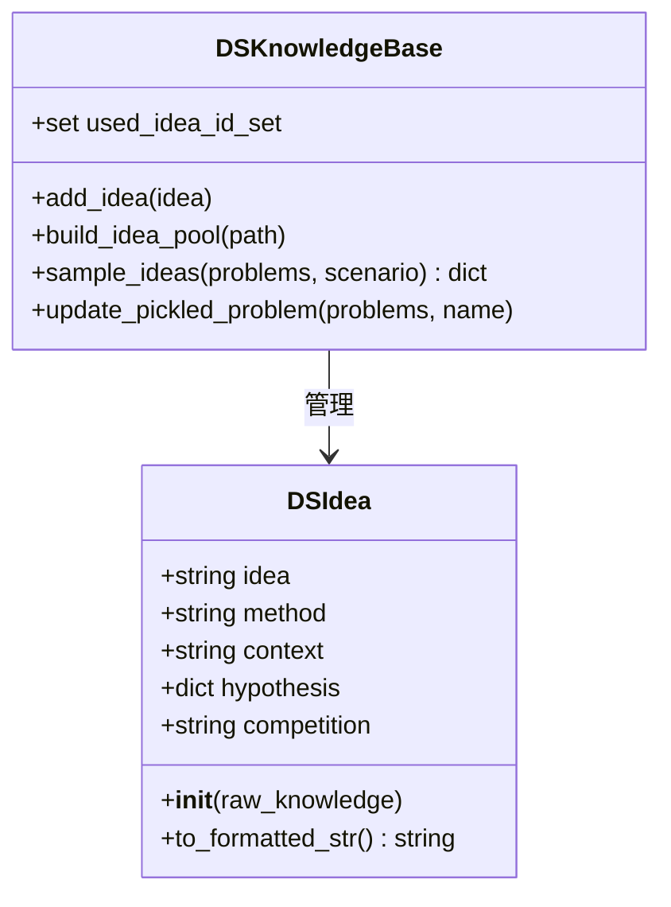

**图表来源**
- [idea_pool.py](file://rdagent/scenarios/data_science/proposal/exp_gen/idea_pool.py#L15-L50)

#### diversity_strategy - 多样性策略

系统提供了三种多样性注入策略：

| 策略名称 | 触发条件 | 适用场景 |
|---------|----------|----------|
| AlwaysInjectStrategy | 始终注入 | 需要最大多样性时 |
| InjectAtRootStrategy | 新建根节点时 | 控制多样性注入时机 |
| InjectUntilSOTAGainedStrategy | 未获得SOTA前 | 平衡探索与利用 |

**章节来源**
- [diversity_strategy.py](file://rdagent/scenarios/data_science/proposal/exp_gen/diversity_strategy.py#L1-L69)

#### merge - 合并机制

合并机制支持多种合并策略，实现不同实验路径的智能整合：

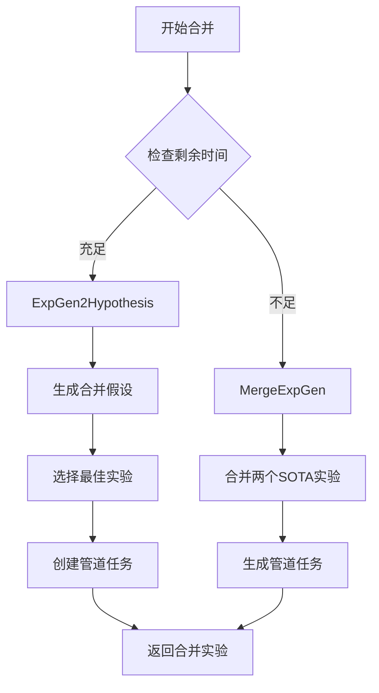

**图表来源**
- [merge.py](file://rdagent/scenarios/data_science/proposal/exp_gen/merge.py#L15-L50)

**章节来源**
- [merge.py](file://rdagent/scenarios/data_science/proposal/exp_gen/merge.py#L1-L100)

### 实验创建与生命周期管理

#### DSExperiment - 实验类

DSExperiment是数据科学场景中的核心实验类，封装了完整的实验生命周期管理：

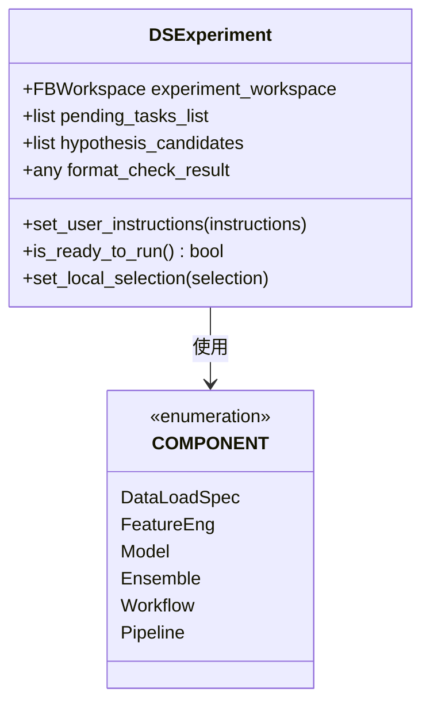

**图表来源**
- [experiment.py](file://rdagent/scenarios/data_science/experiment/experiment.py#L10-L40)

#### 实验生命周期

实验从创建到完成经历以下阶段：

1. **初始化阶段**：设置实验参数和待处理任务列表
2. **编码阶段**：根据任务类型调用相应的编码器
3. **运行阶段**：执行实验代码并收集结果
4. **反馈阶段**：生成实验反馈和总结
5. **记录阶段**：更新跟踪历史和知识库

**章节来源**
- [experiment.py](file://rdagent/scenarios/data_science/experiment/experiment.py#L1-L44)

## 架构概览

数据科学场景采用分层架构设计，确保各组件间的松耦合和高内聚：

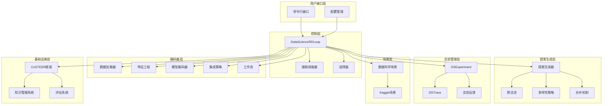

**图表来源**
- [loop.py](file://rdagent/scenarios/data_science/loop.py#L85-L120)
- [base.py](file://rdagent/scenarios/data_science/proposal/exp_gen/base.py#L1-L50)

## 详细组件分析

### 场景配置系统

#### DataScienceScen - 基础场景类

DataScienceScen提供了通用的数据科学场景配置和管理功能：

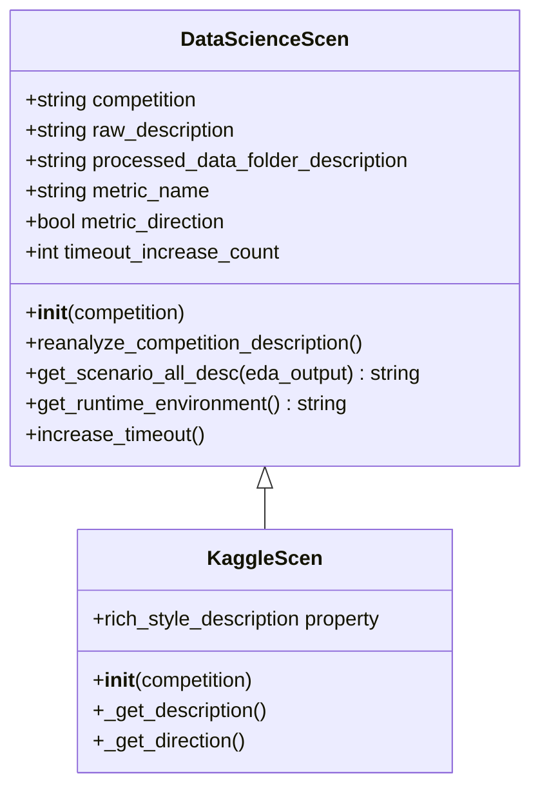

**图表来源**
- [scen/__init__.py](file://rdagent/scenarios/data_science/scen/__init__.py#L20-L80)

#### 场景分析流程

场景分析通过LLM自动解析竞赛描述，提取关键信息：

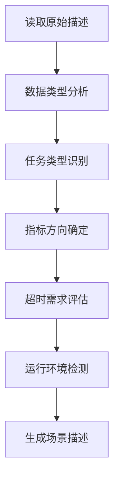

**图表来源**
- [scen/__init__.py](file://rdagent/scenarios/data_science/scen/__init__.py#L80-L150)

**章节来源**
- [scen/__init__.py](file://rdagent/scenarios/data_science/scen/__init__.py#L1-L200)

### CoSTEER框架集成

#### 知识管理系统

CoSTEER框架提供了强大的知识管理能力，支持智能查询和学习：

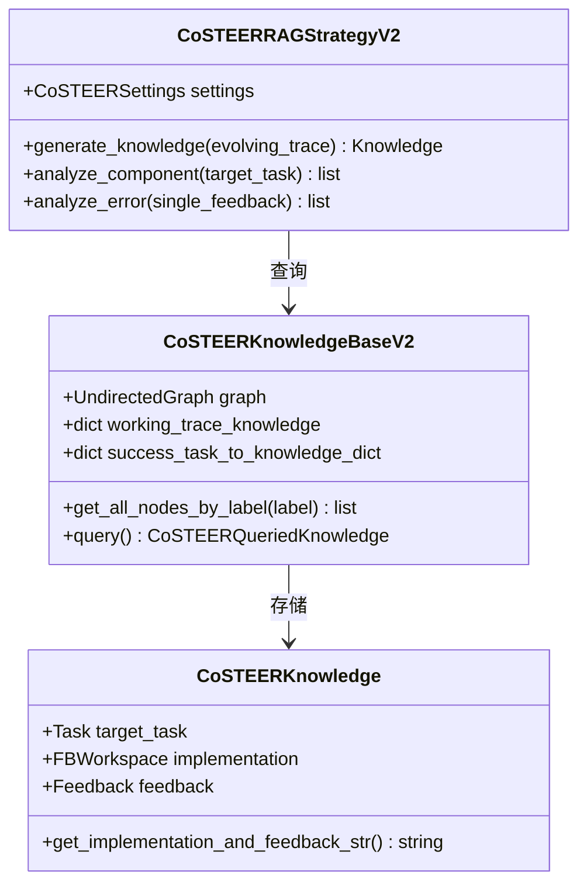

**图表来源**
- [knowledge_management.py](file://rdagent/components/coder/CoSTEER/knowledge_management.py#L25-L100)

#### DSCoSTEER - 数据科学专用CoSTEER

DSCoSTEER为数据科学场景提供了专门的CoSTEER实现：

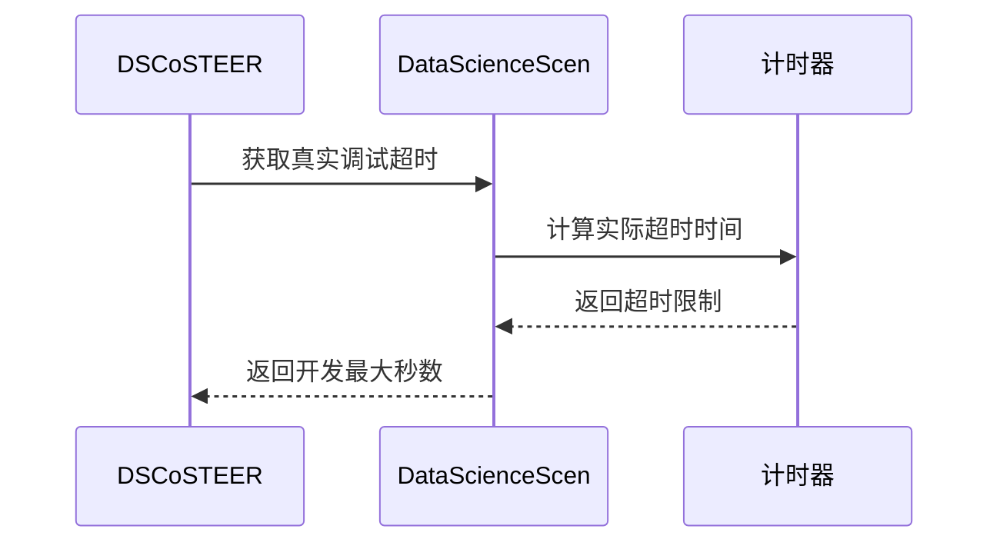

**图表来源**
- [ds_costeer.py](file://rdagent/components/coder/data_science/share/ds_costeer.py#L1-L10)

**章节来源**
- [ds_costeer.py](file://rdagent/components/coder/data_science/share/ds_costeer.py#L1-L10)
- [knowledge_management.py](file://rdagent/components/coder/CoSTEER/knowledge_management.py#L1-L100)

### 评估组件集成

评估组件负责对实验结果进行质量评估和反馈生成：

#### 实验反馈系统

实验反馈系统提供多层次的评估机制：

| 评估维度 | 描述 | 应用场景 |
|---------|------|----------|
| 决策评估 | 判断实验是否成功 | 实验终止决策 |
| 异常分析 | 分析失败原因 | 错误修复指导 |
| 性能评估 | 量化实验效果 | 排名和比较 |
| 知识提取 | 从成功实验中学习 | 知识库更新 |

#### 自动化评估流程

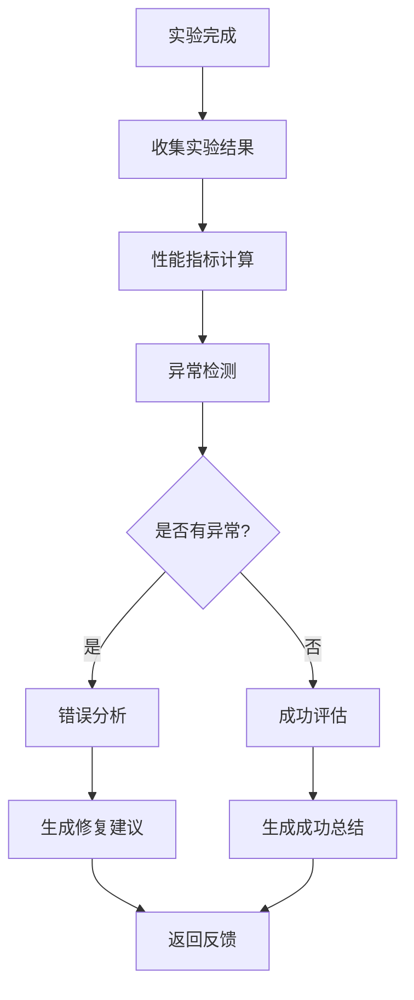

**章节来源**
- [base.py](file://rdagent/scenarios/data_science/proposal/exp_gen/base.py#L200-L300)

## 依赖关系分析

数据科学场景的依赖关系复杂但设计合理，确保了系统的可维护性和扩展性：

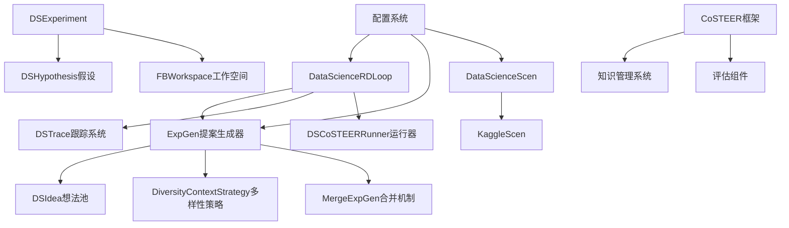

**图表来源**
- [loop.py](file://rdagent/scenarios/data_science/loop.py#L85-L120)
- [base.py](file://rdagent/scenarios/data_science/proposal/exp_gen/base.py#L1-L50)

**章节来源**
- [loop.py](file://rdagent/scenarios/data_science/loop.py#L1-L100)

## 性能考虑

### 并行处理优化

数据科学场景支持多线程并行探索，通过以下机制提升性能：

1. **跟踪调度器**：智能分配资源给不同的实验分支
2. **选择器机制**：基于性能指标选择最有潜力的实验
3. **超时管理**：动态调整实验超时时间以平衡质量和效率

### 内存管理

系统实现了智能的内存管理策略：

- **工作空间清理**：定期清理不必要的文件以节省空间
- **知识库压缩**：对大型知识库进行定期压缩
- **缓存机制**：智能缓存频繁访问的数据

### 计算资源优化

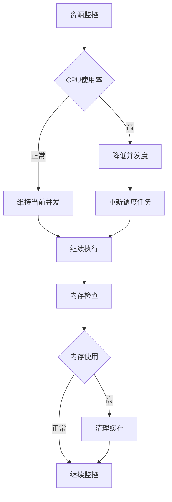

## 故障排除指南

### 常见配置错误

#### 1. 场景配置错误

**问题症状**：无法找到指定的竞赛数据或场景类

**解决方案**：
- 检查`scen`配置项是否正确指向场景类
- 确认数据文件夹结构是否符合要求
- 验证竞赛名称拼写是否正确

#### 2. 超时配置不当

**问题症状**：实验频繁超时或执行时间过长

**解决方案**：
- 调整`debug_timeout`和`full_timeout`参数
- 启用`allow_longer_timeout`选项
- 检查`coder_longer_timeout_multiplier_upper`设置

#### 3. 知识库配置问题

**问题症状**：知识库加载失败或查询结果不准确

**解决方案**：
- 检查`knowledge_base_path`路径是否存在
- 验证`idea_pool_json_path`格式是否正确
- 确认向量数据库连接状态

### 调试方法

#### 1. 日志分析

启用详细日志记录来诊断问题：

```python
# 在配置中启用详细日志
DS_RD_SETTING.enable_log_archive = True
DS_RD_SETTING.log_archive_path = "./logs"
```

#### 2. 实验回放

使用实验回放功能重现问题：

```python
# 加载之前的实验状态
session = DataScienceRDLoop.load("./previous_session")
```

#### 3. 组件隔离测试

单独测试各个组件的功能：

```python
# 测试提案生成器
exp_gen = DSProposalV2ExpGen(scen)
experiment = exp_gen.gen(trace)
```

### 性能调优

#### 1. 并发度调整

根据硬件资源调整并发度：

| 硬件配置 | 推荐并发度 | 注意事项 |
|---------|-----------|----------|
| 4核CPU | 2-3 | 预留系统资源 |
| 8核CPU | 4-6 | 平衡CPU和内存 |
| 16核CPU | 8-12 | 充分利用资源 |

#### 2. 内存优化

监控内存使用情况并进行优化：

```python
# 定期清理工作空间
clean_workspace(experiment.experiment_workspace.workspace_path)
```

#### 3. 网络优化

对于需要网络访问的场景：

- 配置代理服务器
- 设置合理的重试次数
- 实现断线重连机制

**章节来源**
- [conf.py](file://rdagent/app/data_science/conf.py#L150-L207)

## 结论

数据科学场景（DataScienceScenario）作为R&D-Agent框架的核心模块，提供了完整而强大的数据科学自动化解决方案。通过模块化的架构设计、智能的提案生成系统、完善的知识管理系统和灵活的配置机制，该场景能够有效支持各种数据科学任务的自动化探索和优化。

### 主要优势

1. **完整性**：覆盖数据科学项目的全生命周期
2. **智能化**：基于LLM的智能提案生成和多样性策略
3. **可扩展性**：模块化设计便于功能扩展和定制
4. **可靠性**：完善的错误处理和恢复机制
5. **高效性**：并行处理和智能资源管理

### 应用前景

数据科学场景不仅适用于Kaggle竞赛，还可以扩展到企业级的数据科学项目中，为数据科学家提供强大的自动化工具，显著提升研发效率和实验质量。

通过持续的优化和功能增强，数据科学场景将成为数据科学领域自动化研究的重要基础设施，推动人工智能在数据科学领域的广泛应用和发展。