# 通用模型场景API文档

<cite>
**本文档中引用的文件**
- [scenario.py](file://rdagent/scenarios/general_model/scenario.py)
- [general_model.py](file://rdagent/app/general_model/general_model.py)
- [prompts.yaml](file://rdagent/scenarios/general_model/prompts.yaml)
- [task_loader.py](file://rdagent/components/coder/model_coder/task_loader.py)
- [document_reader.py](file://rdagent/components/document_reader/document_reader.py)
- [model.py](file://rdagent/components/coder/model_coder/model.py)
- [cli.py](file://rdagent/app/cli.py)
</cite>

## 目录
1. [简介](#简介)
2. [项目结构](#项目结构)
3. [核心组件](#核心组件)
4. [架构概览](#架构概览)
5. [详细组件分析](#详细组件分析)
6. [配置文件示例](#配置文件示例)
7. [使用指南](#使用指南)
8. [与其他场景的对比](#与其他场景的对比)
9. [最佳实践](#最佳实践)
10. [扩展性分析](#扩展性分析)
11. [故障排除指南](#故障排除指南)
12. [总结](#总结)

## 简介

通用模型场景（GeneralModelScenario）是RD-Agent框架中的一个轻量级场景，专为快速原型验证和模型开发而设计。该场景采用极简主义设计理念，通过最小化配置启动端到端的模型训练与评估循环，特别适用于学术论文模型提取、快速实验探索和原型验证等场景。

### 设计目标

- **轻量级设计**：最小化配置要求，快速启动模型开发流程
- **快速原型验证**：支持从学术论文自动提取模型并实现
- **灵活的模型类型**：支持Tabular、TimeSeries和Graph三种模型架构
- **自动化程度高**：集成文档解析、模型提取和代码生成流程

## 项目结构

通用模型场景的核心文件组织结构如下：

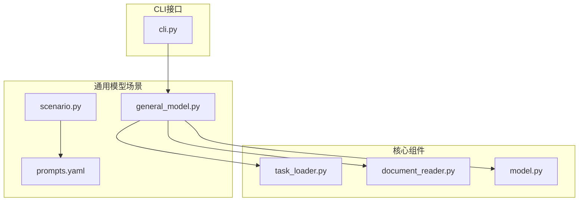

**图表来源**
- [general_model.py](file://rdagent/app/general_model/general_model.py#L1-L46)
- [scenario.py](file://rdagent/scenarios/general_model/scenario.py#L1-L56)

**章节来源**
- [general_model.py](file://rdagent/app/general_model/general_model.py#L1-L46)
- [scenario.py](file://rdagent/scenarios/general_model/scenario.py#L1-L56)

## 核心组件

### GeneralModelScenario类

GeneralModelScenario是通用模型场景的核心类，继承自基础Scenario类，提供了以下关键功能：

#### 主要属性
- **background**: 场景背景描述，说明通用模型框架的设计理念
- **interface**: 模型接口规范，定义PyTorch模型的标准格式
- **output_format**: 输出格式要求，确保模型输出符合预期
- **simulator**: 模拟器描述，说明模型测试环境
- **rich_style_description**: 丰富的场景描述，提供详细的使用指导

#### 核心方法
- **get_scenario_all_desc()**: 返回完整的场景描述信息
- **get_runtime_environment()**: 获取运行时环境配置

### 模型提取与实现流程

通用模型场景通过以下流程实现从学术论文到可执行模型的转换：

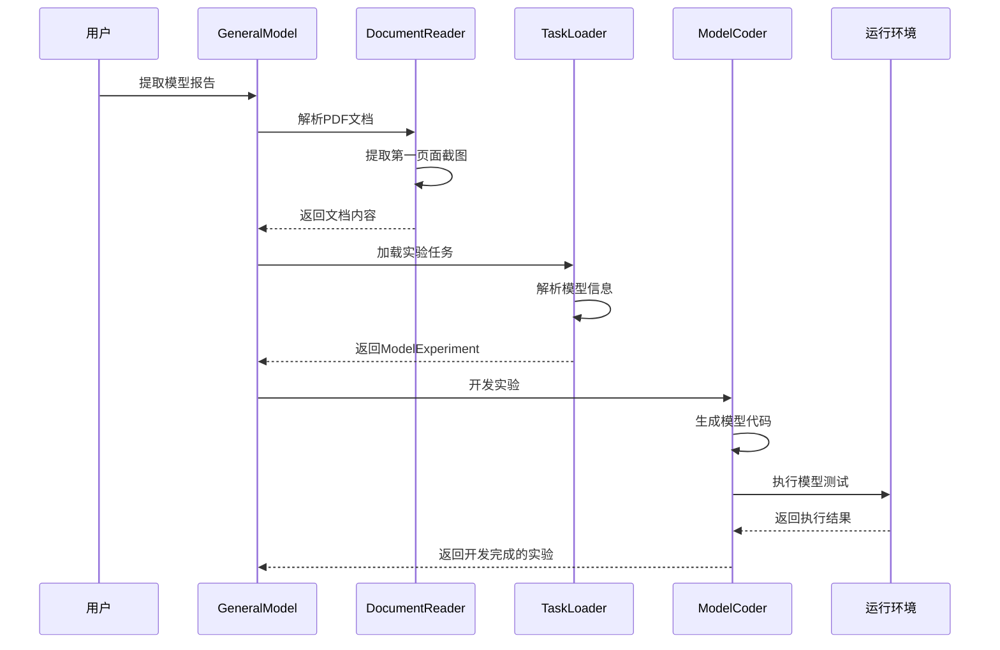

**图表来源**
- [general_model.py](file://rdagent/app/general_model/general_model.py#L20-L45)
- [document_reader.py](file://rdagent/components/document_reader/document_reader.py#L110-L122)
- [task_loader.py](file://rdagent/components/coder/model_coder/task_loader.py#L110-L129)

**章节来源**
- [general_model.py](file://rdagent/app/general_model/general_model.py#L20-L45)
- [scenario.py](file://rdagent/scenarios/general_model/scenario.py#L7-L56)

## 架构概览

通用模型场景采用分层架构设计，从文档解析到模型实现形成完整的流水线：

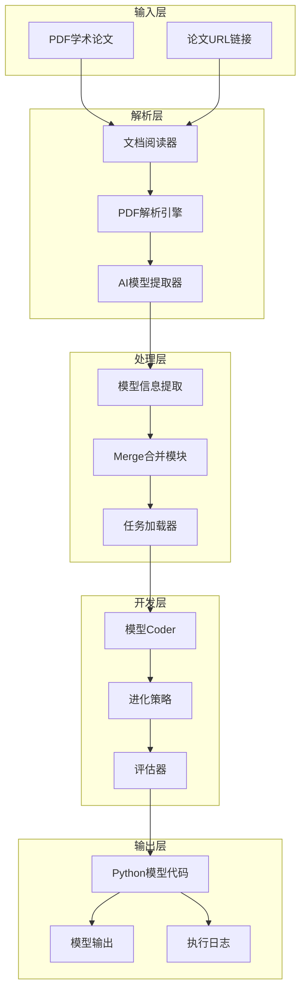

**图表来源**
- [document_reader.py](file://rdagent/components/document_reader/document_reader.py#L20-L122)
- [task_loader.py](file://rdagent/components/coder/model_coder/task_loader.py#L20-L129)
- [model.py](file://rdagent/components/coder/model_coder/model.py#L1-L164)

## 详细组件分析

### 文档解析组件

#### DocumentReader模块
负责从PDF文档中提取模型信息，支持多种文档格式和解析方式：

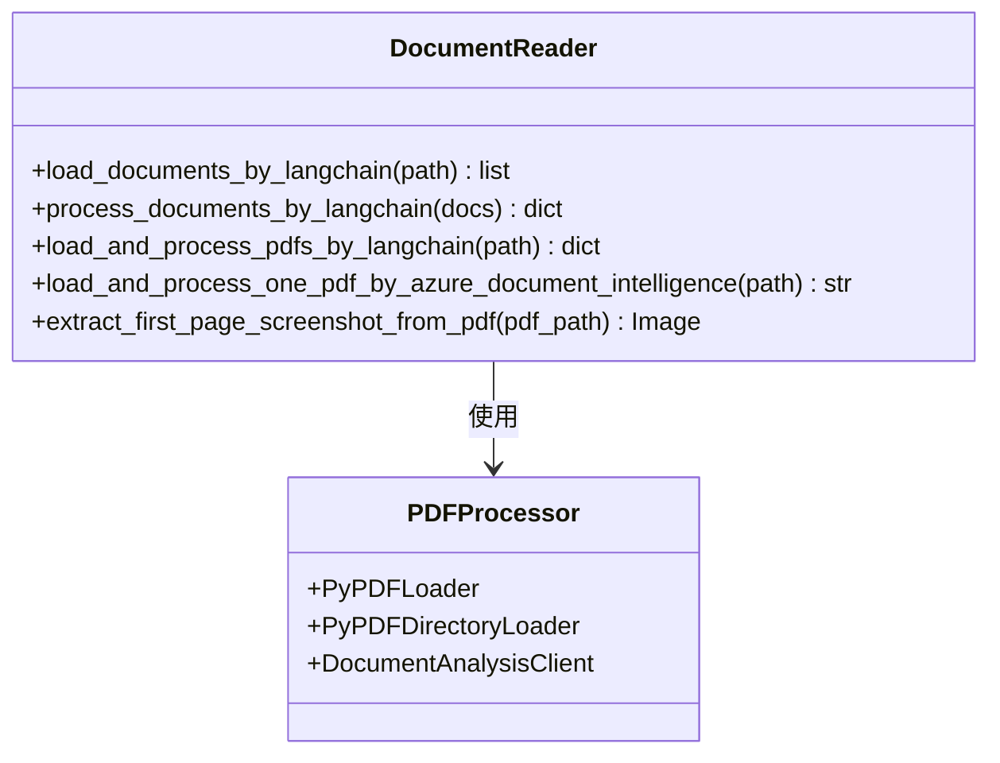

**图表来源**
- [document_reader.py](file://rdagent/components/document_reader/document_reader.py#L20-L122)

#### 模型信息提取算法
采用多轮重试机制确保模型信息提取的准确性：

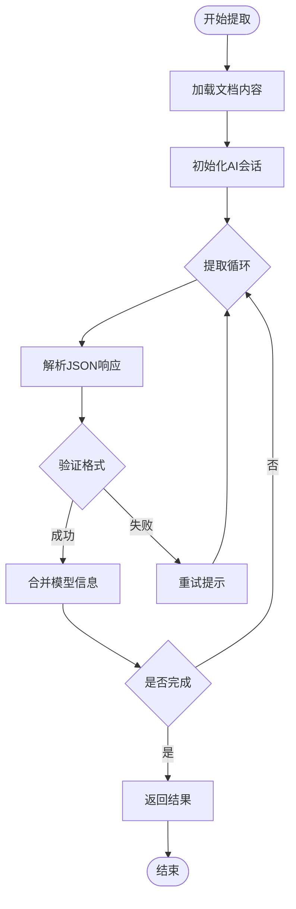

**图表来源**
- [task_loader.py](file://rdagent/components/coder/model_coder/task_loader.py#L20-L80)

**章节来源**
- [document_reader.py](file://rdagent/components/document_reader/document_reader.py#L20-L122)
- [task_loader.py](file://rdagent/components/coder/model_coder/task_loader.py#L20-L129)

### 模型任务管理

#### ModelTask类
定义了模型任务的基本结构和属性：

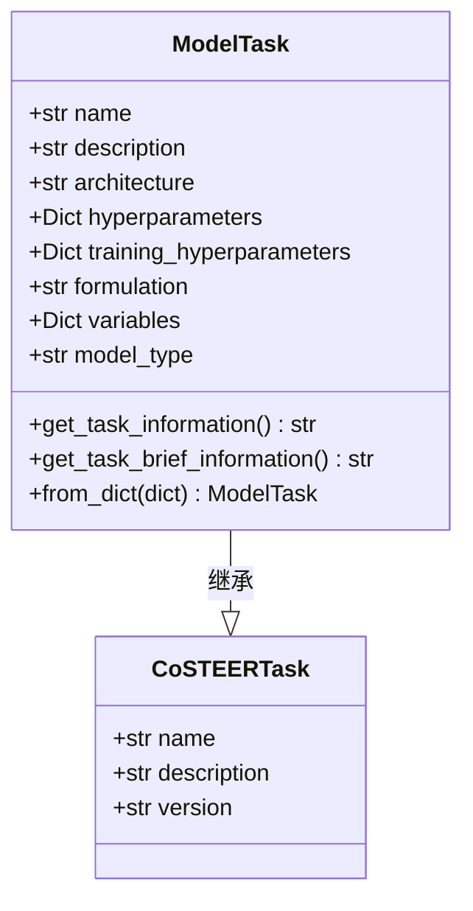

**图表来源**
- [model.py](file://rdagent/components/coder/model_coder/model.py#L15-L60)

#### ModelFBWorkspace类
管理模型的工作空间和执行环境：

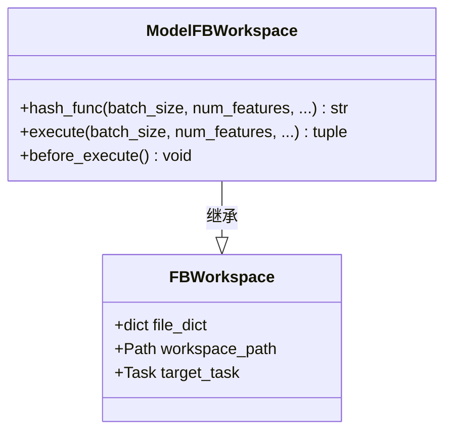

**图表来源**
- [model.py](file://rdagent/components/coder/model_coder/model.py#L65-L164)

**章节来源**
- [model.py](file://rdagent/components/coder/model_coder/model.py#L15-L164)

### 命令行接口

#### CLI命令注册
通用模型场景通过Typer框架提供命令行接口：

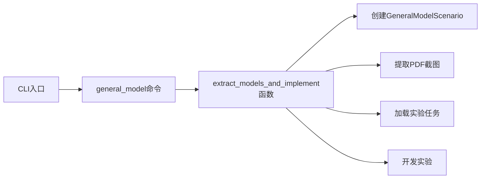

**图表来源**
- [cli.py](file://rdagent/app/cli.py#L20-L87)

**章节来源**
- [cli.py](file://rdagent/app/cli.py#L20-L87)
- [general_model.py](file://rdagent/app/general_model/general_model.py#L20-L45)

## 配置文件示例

### 基本配置结构

通用模型场景的配置主要通过prompts.yaml文件定义，包含以下核心部分：

#### 场景背景配置
```yaml
general_model_background: |
  The general model is a flexible and comprehensive framework...
```

#### 接口规范配置
```yaml
general_model_interface: |
  Your python code should follow the interface to better interact with the user's system...
```

#### 输出格式配置
```yaml
general_model_output_format: |
  Your output should be a tensor with shape (batch_size, 1)...
```

### 模型类型配置

支持三种主要的模型类型：

| 模型类型 | 输入形状 | 初始化方式 | 适用场景 |
|---------|----------|------------|----------|
| Tabular | (batch_size, num_features) | `model_cls(num_features=num_features)` | 表格数据建模 |
| TimeSeries | (batch_size, num_features, num_timesteps) | `model_cls(num_features=num_features, num_timesteps=num_timesteps)` | 时间序列预测 |
| Graph | node_feature, edge_index | `model_cls(num_features=num_features)` | 图神经网络 |

### 超参数配置示例

```yaml
hyperparameters:
  learning_rate: "2e-4"
  batch_size: "256"
  weight_decay: "0.0001"
  early_stop: "10"

training_hyperparameters:
  n_epochs: "100"
  lr: "2e-4"
  batch_size: "256"
  weight_decay: "0.0001"
```

## 使用指南

### 基本使用流程

1. **准备论文材料**
   - 准备包含模型信息的PDF学术论文
   - 确保论文中包含清晰的模型架构和参数描述

2. **执行模型提取**
   ```bash
   rdagent general_model --report_file_path /path/to/paper.pdf
   ```

3. **查看生成结果**
   - 检查生成的Python模型代码
   - 验证模型输出格式是否正确
   - 分析执行日志中的错误信息

### 支持的论文格式

通用模型场景支持以下类型的学术论文：
- ArXiv预印本论文
- 学术期刊文章
- 会议论文
- 技术报告

### 自动化工作流

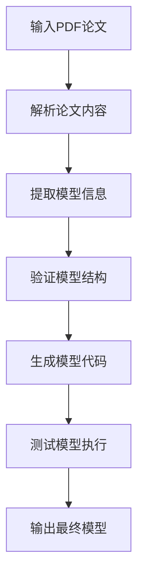

**章节来源**
- [general_model.py](file://rdagent/app/general_model/general_model.py#L20-L45)
- [prompts.yaml](file://rdagent/scenarios/general_model/prompts.yaml#L1-L90)

## 与其他场景的对比

### 与QLib场景对比

| 特性 | 通用模型场景 | QLib场景 | 数据科学场景 |
|------|-------------|----------|--------------|
| 复杂度 | 轻量级 | 中等复杂度 | 高复杂度 |
| 配置要求 | 最小化 | 中等 | 复杂 |
| 训练周期 | 快速原型 | 标准训练 | 完整生命周期 |
| 数据依赖 | 文档解析 | 实际数据集 | 多种数据源 |
| 适用场景 | 快速验证 | 生产部署 | 全面分析 |

### 性能特征对比

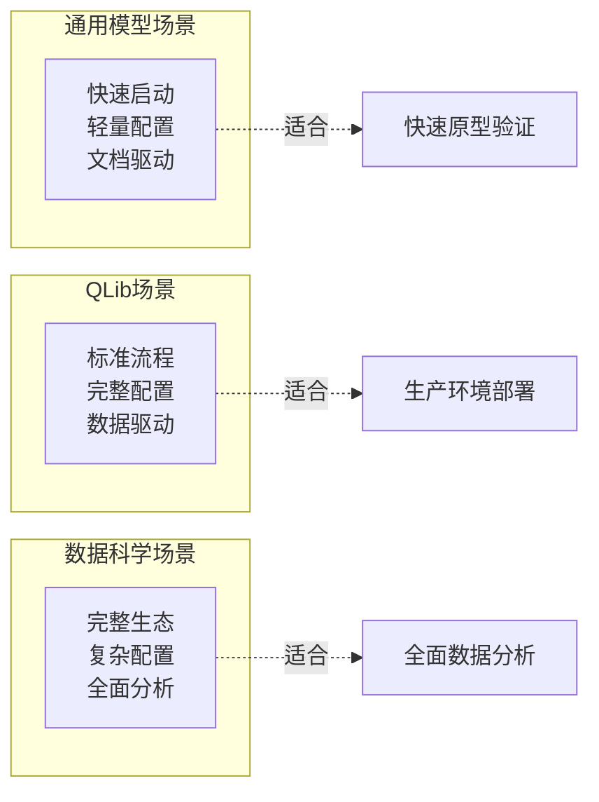

### 选择建议

- **选择通用模型场景**：当需要快速从学术论文提取模型进行验证时
- **选择QLib场景**：当需要在真实金融市场数据上进行模型开发时
- **选择数据科学场景**：当需要进行全面的数据分析和模型比较时

## 最佳实践

### 快速迭代策略

1. **渐进式验证**
   - 从简单的模型架构开始
   - 逐步增加复杂度
   - 及时调整超参数

2. **文档质量要求**
   - 确保论文中的模型描述清晰
   - 包含完整的超参数信息
   - 提供明确的输入输出规格

3. **测试策略**
   - 使用小批量数据进行初步测试
   - 验证模型输出的形状和范围
   - 检查梯度流动情况

### 实验探索技巧

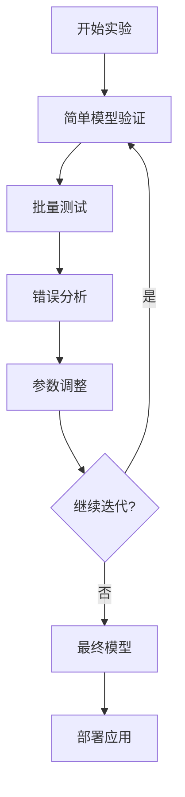

### 性能优化建议

1. **内存管理**
   - 控制批次大小避免内存溢出
   - 使用混合精度训练
   - 及时释放不需要的中间变量

2. **计算效率**
   - 利用GPU加速计算
   - 并行处理多个模型变体
   - 缓存重复计算的结果

3. **代码质量**
   - 遵循PEP8编码规范
   - 添加适当的注释和文档
   - 实现异常处理机制

## 扩展性分析

### 自定义模型类集成

通用模型场景支持通过以下方式集成自定义模型：

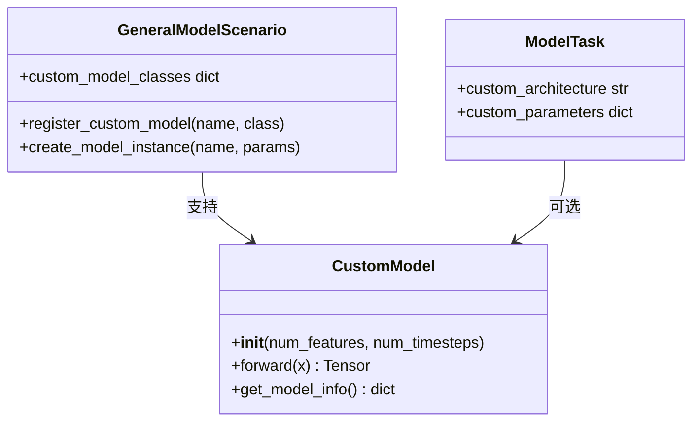

### 自定义数据加载器

支持集成自定义的数据处理管道：

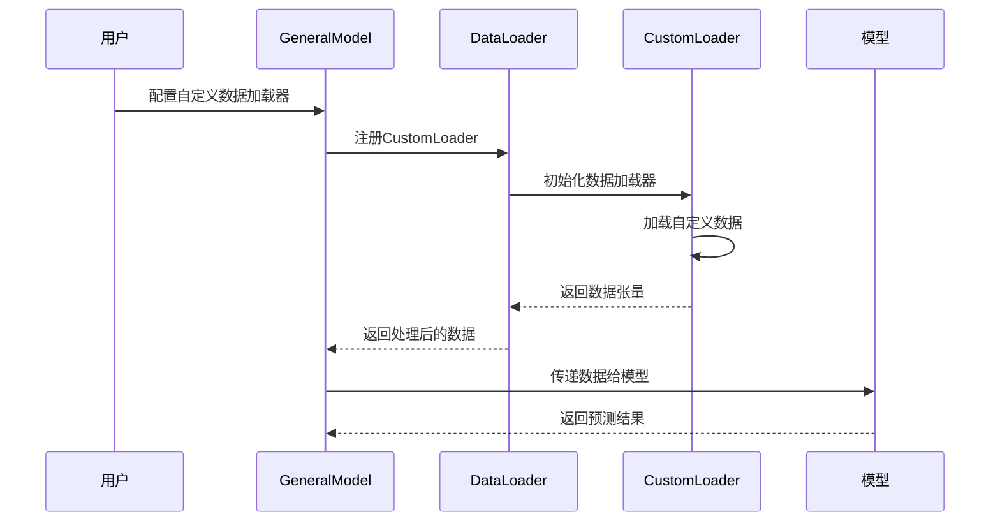

### 插件系统扩展

通用模型场景可以通过插件系统支持更多功能：

- **自定义评估指标**
- **特殊数据格式支持**
- **定制化训练策略**
- **特定领域知识集成**

### 生态系统集成

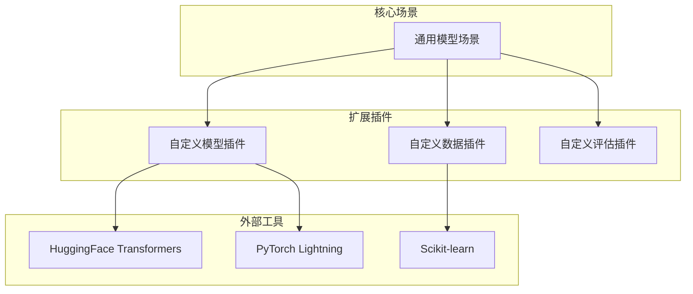

## 故障排除指南

### 常见问题及解决方案

#### 文档解析问题

**问题**：PDF文档无法正确解析
**解决方案**：
1. 检查PDF文件完整性
2. 确认文档语言支持
3. 尝试不同的解析引擎

**问题**：模型信息提取失败
**解决方案**：
1. 增加重试次数
2. 检查AI模型配置
3. 验证文档内容格式

#### 模型生成问题

**问题**：生成的模型代码有语法错误
**解决方案**：
1. 检查接口规范遵循情况
2. 验证输入输出形状匹配
3. 确认必要的导入语句

**问题**：模型执行失败
**解决方案**：
1. 检查环境配置
2. 验证依赖包安装
3. 查看详细的错误日志

#### 性能问题

**问题**：处理速度过慢
**解决方案**：
1. 减少并发进程数
2. 优化内存使用
3. 使用缓存机制

**问题**：内存占用过高
**解决方案**：
1. 调整批次大小
2. 启用梯度检查点
3. 使用混合精度训练

### 调试技巧

1. **启用详细日志**
   ```bash
   rdagent general_model --report_file_path paper.pdf --debug
   ```

2. **分步调试**
   - 单独测试文档解析
   - 验证模型信息提取
   - 测试代码生成过程

3. **环境隔离**
   - 使用Docker容器
   - 创建独立的conda环境
   - 清理临时文件

**章节来源**
- [general_model.py](file://rdagent/app/general_model/general_model.py#L20-L45)
- [model.py](file://rdagent/components/coder/model_coder/model.py#L100-L164)

## 总结

通用模型场景（GeneralModelScenario）作为RD-Agent框架中的轻量级组件，为快速原型验证和模型开发提供了简洁而强大的解决方案。其核心优势包括：

### 主要特点
- **极简设计**：最小化配置要求，快速启动开发流程
- **自动化程度高**：从学术论文自动提取模型信息并生成可执行代码
- **灵活性强**：支持多种模型类型和自定义扩展
- **易于集成**：与现有RD-Agent生态系统无缝对接

### 应用价值
- **学术研究**：快速验证新提出的模型架构
- **原型开发**：在概念验证阶段快速迭代
- **教育用途**：帮助学生理解模型实现细节
- **研究辅助**：自动化处理大量学术文献中的模型信息

### 发展方向
通用模型场景将继续朝着更智能、更高效的模型提取和生成方向发展，同时保持其轻量级和易用性的核心优势。未来可能的改进包括：
- 更智能的文档解析算法
- 更丰富的模型类型支持
- 更完善的错误处理机制
- 更好的用户体验设计

通过合理使用通用模型场景，研究人员和开发者可以显著提高模型开发效率，专注于创新和优化，而不是繁琐的基础设置工作。