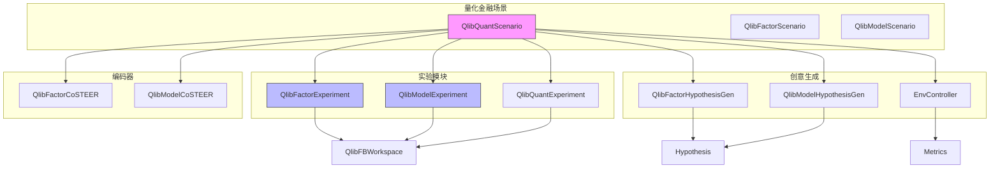
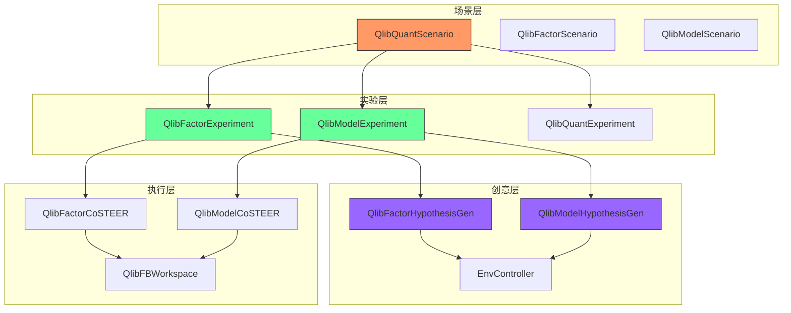
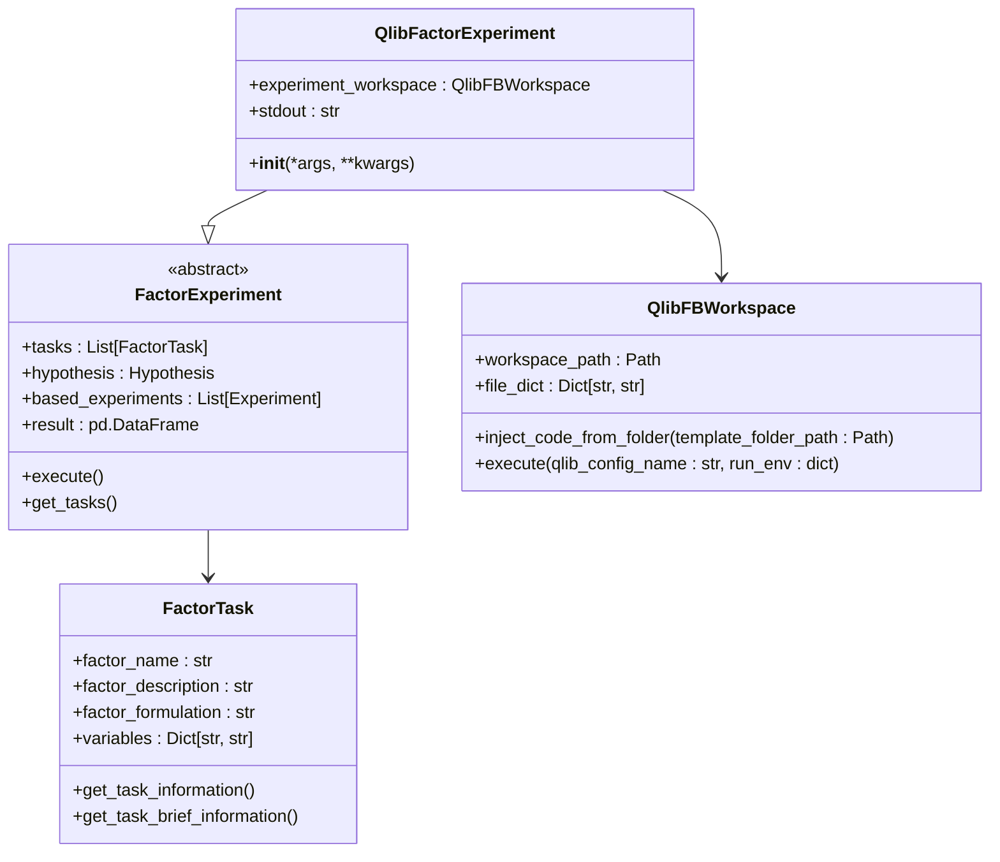
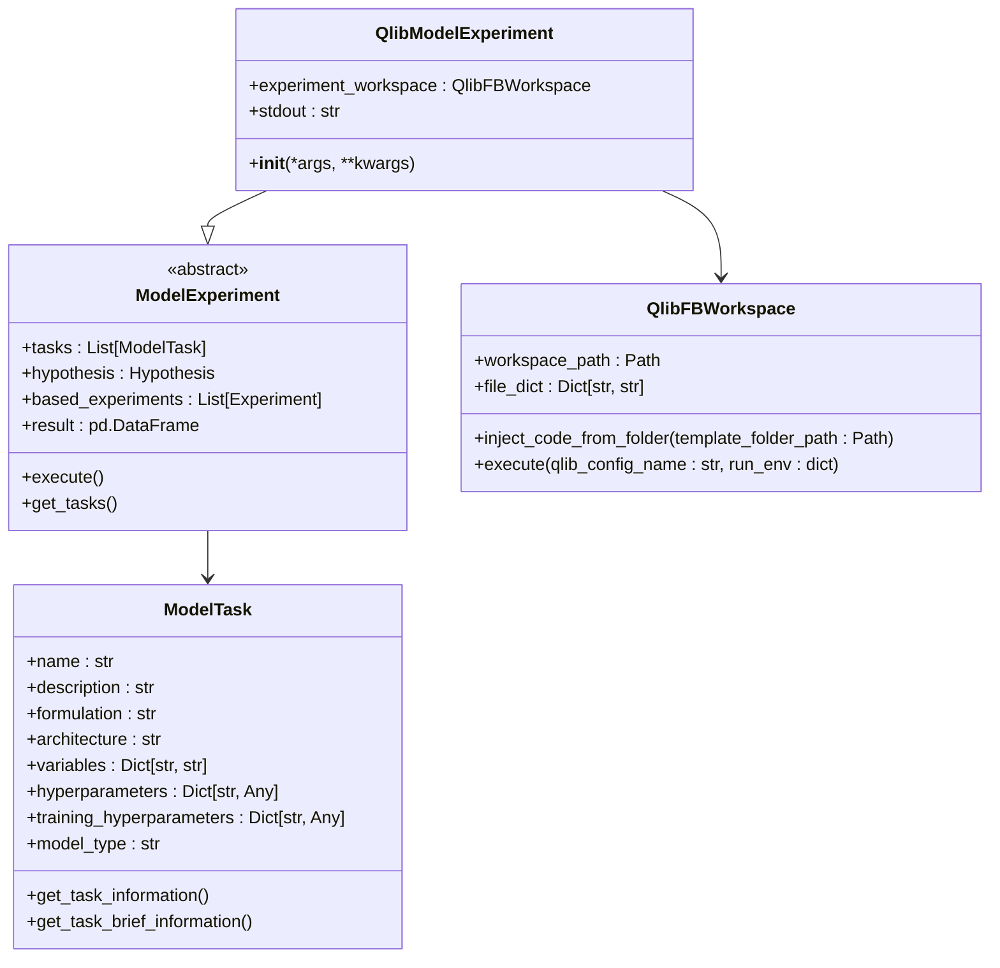
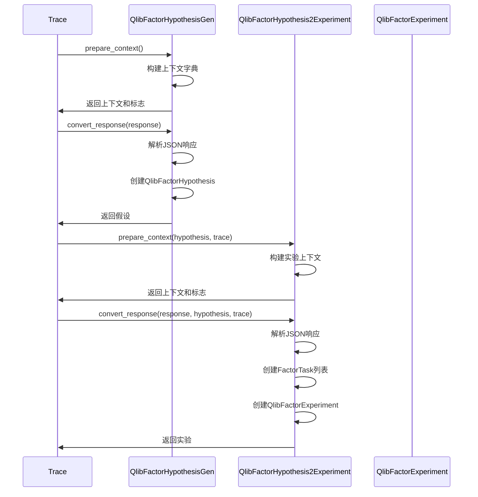
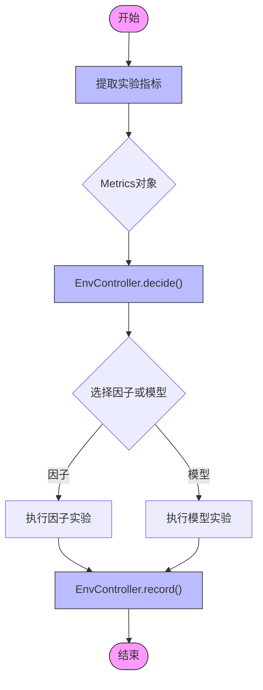
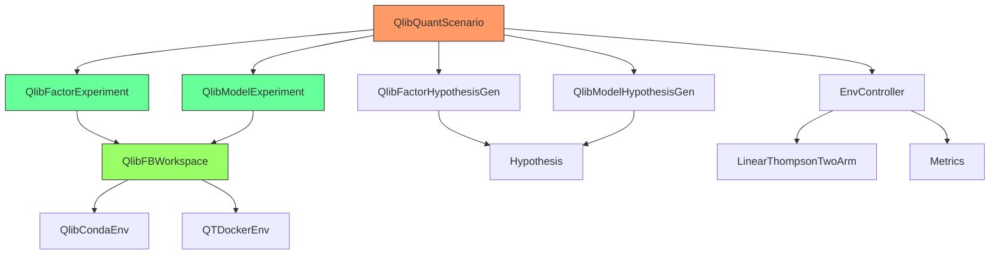

# 量化金融场景API

<cite>
**本文档引用的文件**  
- [factor_experiment.py](file://rdagent/scenarios/qlib/experiment/factor_experiment.py)
- [model_experiment.py](file://rdagent/scenarios/qlib/experiment/model_experiment.py)
- [quant_experiment.py](file://rdagent/scenarios/qlib/experiment/quant_experiment.py)
- [factor_proposal.py](file://rdagent/scenarios/qlib/proposal/factor_proposal.py)
- [model_proposal.py](file://rdagent/scenarios/qlib/proposal/model_proposal.py)
- [bandit.py](file://rdagent/scenarios/qlib/proposal/bandit.py)
- [workspace.py](file://rdagent/scenarios/qlib/experiment/workspace.py)
- [utils.py](file://rdagent/scenarios/qlib/experiment/utils.py)
- [prompts.yaml](file://rdagent/scenarios/qlib/prompts.yaml)
- [factor_coder.py](file://rdagent/scenarios/qlib/developer/factor_coder.py)
- [model_coder.py](file://rdagent/scenarios/qlib/developer/model_coder.py)
- [factor_template/conf_baseline.yaml](file://rdagent/scenarios/qlib/experiment/factor_template/conf_baseline.yaml)
- [model_template/conf_baseline_factors_model.yaml](file://rdagent/scenarios/qlib/experiment/model_template/conf_baseline_factors_model.yaml)
</cite>

## 目录
1. [引言](#引言)
2. [项目结构](#项目结构)
3. [核心组件](#核心组件)
4. [架构概述](#架构概述)
5. [详细组件分析](#详细组件分析)
6. [依赖分析](#依赖分析)
7. [性能考虑](#性能考虑)
8. [故障排除指南](#故障排除指南)
9. [结论](#结论)

## 引言

本文档旨在为量化金融场景（QlibScenario）提供全面的API文档，详细说明因子实验（FactorExperiment）和模型实验（ModelExperiment）的创建、配置与执行接口。文档将深入解析factor_coder和model_coder的代码生成逻辑及其与Qlib框架的集成方式，解释factor_proposal和model_proposal中基于多臂赌博机（bandit）等策略的创意生成机制。通过配置示例展示如何定义因子模板、模型结构以及联合优化流程，并说明该场景特有的知识积累模式（如因子有效性反馈）和评估指标。此外，文档还将包含与Qlib数据接口、回测系统对接的技术细节，并提供典型错误处理和性能优化建议。

## 项目结构

量化金融场景的项目结构遵循模块化设计原则，主要分为以下几个核心模块：

- **scenarios/qlib/experiment**: 包含因子实验和模型实验的核心实现
- **scenarios/qlib/proposal**: 包含因子和模型的创意生成机制
- **scenarios/qlib/developer**: 包含开发者工具和编码器
- **scenarios/qlib/experiment/template**: 包含实验模板配置文件
- **components/coder**: 包含通用的编码器组件
- **core**: 包含核心框架和基础类

**图示来源**
- [quant_experiment.py](file://rdagent/scenarios/qlib/experiment/quant_experiment.py#L30-L200)
- [factor_experiment.py](file://rdagent/scenarios/qlib/experiment/factor_experiment.py#L10-L90)
- [model_experiment.py](file://rdagent/scenarios/qlib/experiment/model_experiment.py#L10-L80)

**本节来源**
- [quant_experiment.py](file://rdagent/scenarios/qlib/experiment/quant_experiment.py#L1-L203)
- [factor_experiment.py](file://rdagent/scenarios/qlib/experiment/factor_experiment.py#L1-L91)
- [model_experiment.py](file://rdagent/scenarios/qlib/experiment/model_experiment.py#L1-L83)

## 核心组件

量化金融场景的核心组件包括因子实验、模型实验、创意生成器和编码器。这些组件协同工作，实现从创意生成到代码实现再到回测评估的完整闭环。

因子实验（QlibFactorExperiment）和模型实验（QlibModelExperiment）继承自通用的实验基类，分别针对因子和模型的特性进行了定制化实现。创意生成器（QlibFactorHypothesisGen和QlibModelHypothesisGen）负责生成新的研究假设，而编码器（QlibFactorCoSTEER和QlibModelCoSTEER）则负责将假设转化为可执行的代码。

**本节来源**
- [factor_experiment.py](file://rdagent/scenarios/qlib/experiment/factor_experiment.py#L10-L90)
- [model_experiment.py](file://rdagent/scenarios/qlib/experiment/model_experiment.py#L10-L80)
- [factor_proposal.py](file://rdagent/scenarios/qlib/proposal/factor_proposal.py#L1-L130)
- [model_proposal.py](file://rdagent/scenarios/qlib/proposal/model_proposal.py#L1-L150)

## 架构概述

量化金融场景的整体架构采用分层设计，从上到下分为场景层、实验层、创意层和执行层。场景层定义了整个量化研究的背景和约束条件，实验层负责具体的因子和模型实验，创意层生成新的研究方向，执行层则完成代码生成和回测验证。

**图示来源**
- [quant_experiment.py](file://rdagent/scenarios/qlib/experiment/quant_experiment.py#L30-L200)
- [factor_experiment.py](file://rdagent/scenarios/qlib/experiment/factor_experiment.py#L10-L90)
- [model_experiment.py](file://rdagent/scenarios/qlib/experiment/model_experiment.py#L10-L80)
- [factor_proposal.py](file://rdagent/scenarios/qlib/proposal/factor_proposal.py#L1-L130)
- [model_proposal.py](file://rdagent/scenarios/qlib/proposal/model_proposal.py#L1-L150)

## 详细组件分析

### 因子实验分析

因子实验（QlibFactorExperiment）是量化金融场景中的核心组件之一，负责因子的生成、实现和回测。它继承自FactorExperiment基类，并通过QlibFBWorkspace与Qlib框架进行集成。

**图示来源**
- [factor_experiment.py](file://rdagent/scenarios/qlib/experiment/factor_experiment.py#L10-L90)
- [workspace.py](file://rdagent/scenarios/qlib/experiment/workspace.py#L1-L60)
- [factor_coder.py](file://rdagent/components/coder/factor_coder/factor.py#L1-L80)

**本节来源**
- [factor_experiment.py](file://rdagent/scenarios/qlib/experiment/factor_experiment.py#L1-L91)
- [workspace.py](file://rdagent/scenarios/qlib/experiment/workspace.py#L1-L60)

### 模型实验分析

模型实验（QlibModelExperiment）与因子实验类似，但专注于模型的生成和优化。它继承自ModelExperiment基类，并同样通过QlibFBWorkspace与Qlib框架集成。

**图示来源**
- [model_experiment.py](file://rdagent/scenarios/qlib/experiment/model_experiment.py#L10-L80)
- [workspace.py](file://rdagent/scenarios/qlib/experiment/workspace.py#L1-L60)
- [model_coder.py](file://rdagent/components/coder/model_coder/model.py#L1-L80)

**本节来源**
- [model_experiment.py](file://rdagent/scenarios/qlib/experiment/model_experiment.py#L1-L83)
- [workspace.py](file://rdagent/scenarios/qlib/experiment/workspace.py#L1-L60)

### 创意生成机制分析

创意生成机制是量化金融场景的核心创新点，通过QlibFactorHypothesisGen和QlibModelHypothesisGen实现。这些组件基于历史实验结果和反馈，生成新的研究假设。

**图示来源**
- [factor_proposal.py](file://rdagent/scenarios/qlib/proposal/factor_proposal.py#L1-L130)
- [model_proposal.py](file://rdagent/scenarios/qlib/proposal/model_proposal.py#L1-L150)

**本节来源**
- [factor_proposal.py](file://rdagent/scenarios/qlib/proposal/factor_proposal.py#L1-L133)
- [model_proposal.py](file://rdagent/scenarios/qlib/proposal/model_proposal.py#L1-L160)

### 多臂赌博机策略分析

多臂赌博机（Bandit）策略用于在因子和模型之间进行智能决策，通过EnvController和LinearThompsonTwoArm实现。该策略基于实验结果的多维指标，动态调整探索方向。

**图示来源**
- [bandit.py](file://rdagent/scenarios/qlib/proposal/bandit.py#L1-L110)
- [factor_proposal.py](file://rdagent/scenarios/qlib/proposal/factor_proposal.py#L1-L130)
- [model_proposal.py](file://rdagent/scenarios/qlib/proposal/model_proposal.py#L1-L150)

**本节来源**
- [bandit.py](file://rdagent/scenarios/qlib/proposal/bandit.py#L1-L110)

## 依赖分析

量化金融场景的组件之间存在复杂的依赖关系，主要依赖链如下：

**图示来源**
- [quant_experiment.py](file://rdagent/scenarios/qlib/experiment/quant_experiment.py#L1-L203)
- [factor_experiment.py](file://rdagent/scenarios/qlib/experiment/factor_experiment.py#L1-L91)
- [model_experiment.py](file://rdagent/scenarios/qlib/experiment/model_experiment.py#L1-L83)
- [workspace.py](file://rdagent/scenarios/qlib/experiment/workspace.py#L1-L60)
- [bandit.py](file://rdagent/scenarios/qlib/proposal/bandit.py#L1-L110)

**本节来源**
- [quant_experiment.py](file://rdagent/scenarios/qlib/experiment/quant_experiment.py#L1-L203)
- [factor_experiment.py](file://rdagent/scenarios/qlib/experiment/factor_experiment.py#L1-L91)
- [model_experiment.py](file://rdagent/scenarios/qlib/experiment/model_experiment.py#L1-L83)
- [workspace.py](file://rdagent/scenarios/qlib/experiment/workspace.py#L1-L60)
- [bandit.py](file://rdagent/scenarios/qlib/proposal/bandit.py#L1-L110)

## 性能考虑

量化金融场景的性能主要受以下几个因素影响：

1. **环境配置**: 通过MODEL_COSTEER_SETTINGS.env_type配置环境类型，支持docker和conda两种模式
2. **数据处理**: 使用HDF5格式存储大规模金融数据，通过pandas进行高效读取
3. **并行执行**: 利用QTDockerEnv和QlibCondaEnv实现环境隔离和并行执行
4. **内存管理**: 通过workspace_path管理实验工作空间，避免内存泄漏

最佳实践建议：
- 使用docker环境以获得更好的隔离性和可重复性
- 合理设置batch_size和n_epochs以平衡训练速度和模型性能
- 定期清理workspace_path下的临时文件
- 使用SSD存储以提高HDF5文件的读写速度

**本节来源**
- [workspace.py](file://rdagent/scenarios/qlib/experiment/workspace.py#L1-L60)
- [utils.py](file://rdagent/scenarios/qlib/experiment/utils.py#L1-L183)
- [bandit.py](file://rdagent/scenarios/qlib/proposal/bandit.py#L1-L110)

## 故障排除指南

### 常见错误及解决方案

1. **环境准备失败**
   - 错误信息: "Unknown env_type"
   - 解决方案: 检查MODEL_COSTEER_SETTINGS.env_type配置，确保为"docker"或"conda"

2. **数据文件缺失**
   - 错误信息: "No result file found"
   - 解决方案: 确保generate_data_folder_from_qlib()已正确执行

3. **JSON解析错误**
   - 错误信息: "Error extracting metrics"
   - 解决方案: 检查实验结果的JSON格式，确保符合预期结构

4. **回测失败**
   - 错误信息: "File qlib_res.csv does not exist"
   - 解决方案: 检查Qlib配置文件和数据路径，确保qrun命令能正确执行

### 调试技巧

1. **日志分析**: 使用rdagent_logger记录详细的执行日志
2. **逐步调试**: 通过Trace对象分析实验历史和反馈
3. **环境验证**: 使用get_runtime_environment()验证环境配置
4. **指标监控**: 通过Metrics对象监控关键性能指标

**本节来源**
- [workspace.py](file://rdagent/scenarios/qlib/experiment/workspace.py#L1-L60)
- [utils.py](file://rdagent/scenarios/qlib/experiment/utils.py#L1-L183)
- [bandit.py](file://rdagent/scenarios/qlib/proposal/bandit.py#L1-L110)

## 结论

量化金融场景（QlibScenario）提供了一个完整的自动化量化研究框架，通过因子实验、模型实验、创意生成和智能决策的有机结合，实现了从假设生成到代码实现再到回测验证的完整闭环。该框架的核心优势在于：

1. **模块化设计**: 各组件职责清晰，易于扩展和维护
2. **智能决策**: 基于多臂赌博机策略的智能探索方向选择
3. **知识积累**: 通过实验历史和反馈实现知识的持续积累
4. **无缝集成**: 与Qlib框架深度集成，支持复杂的量化回测

未来发展方向包括：
- 引入更先进的创意生成算法
- 支持更多类型的金融数据和模型
- 增强多目标优化能力
- 提供更丰富的可视化分析工具

该框架为量化金融研究提供了一个强大的自动化工具，有望显著提高研究效率和投资回报。