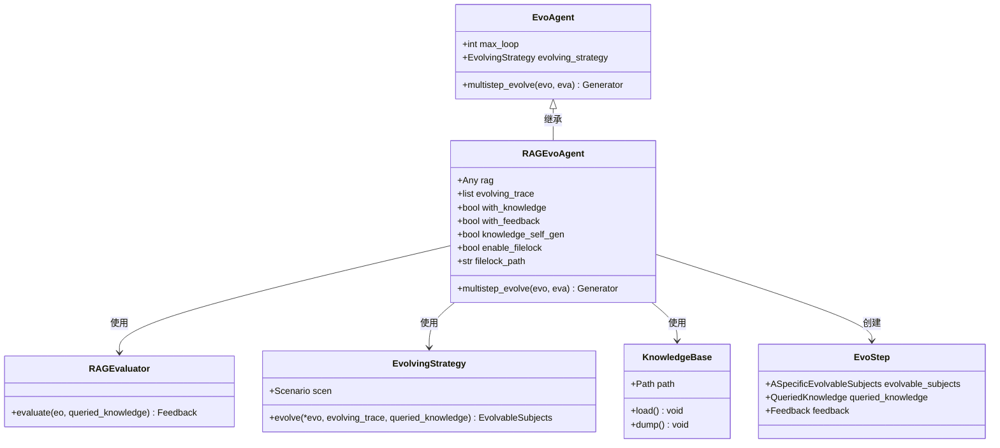
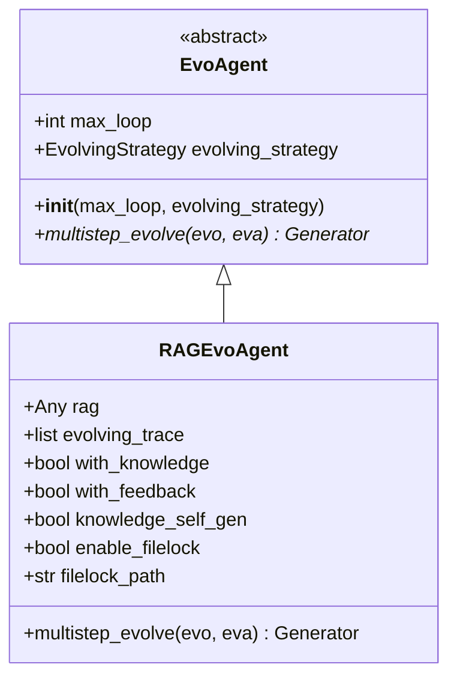
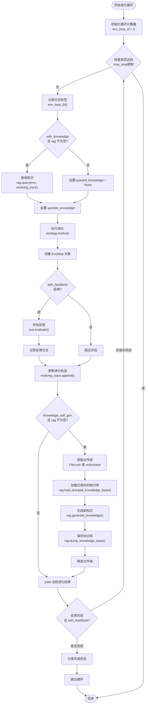
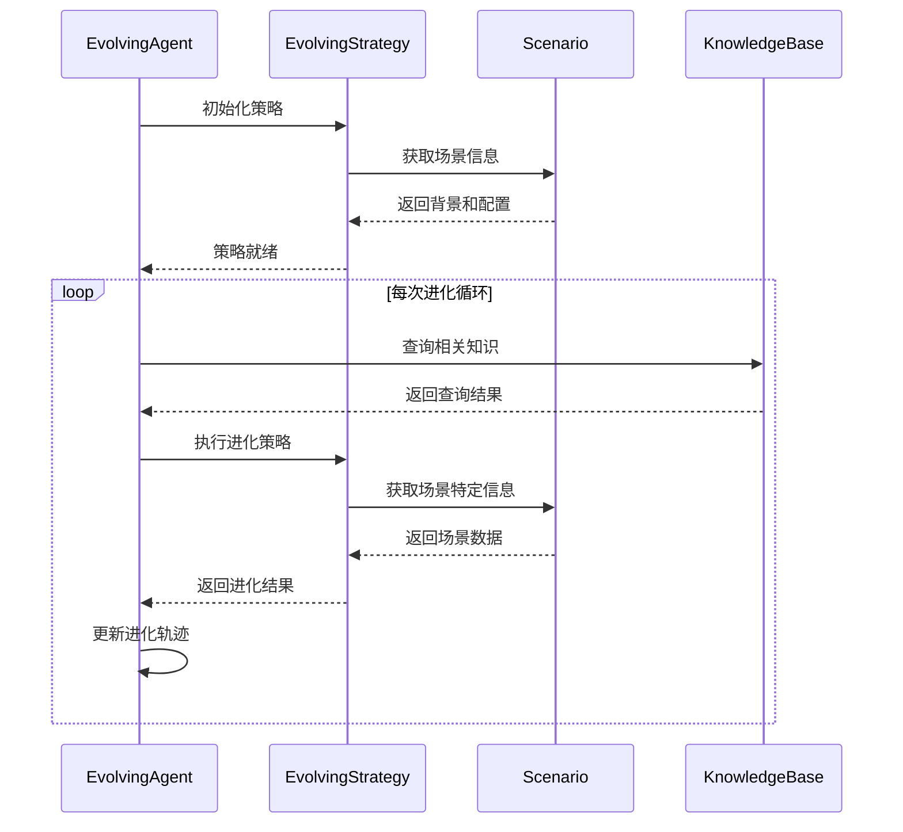
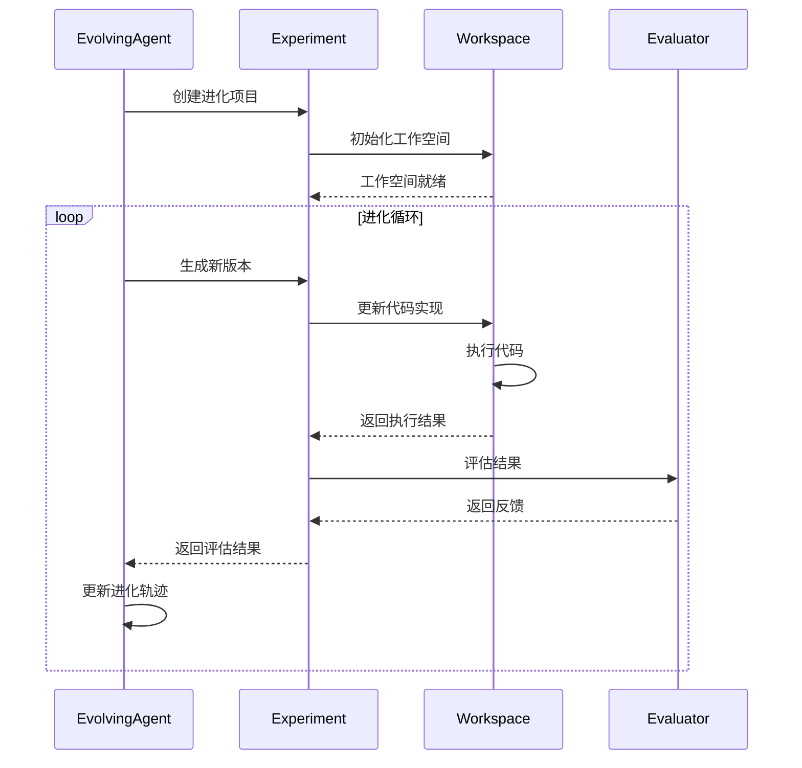
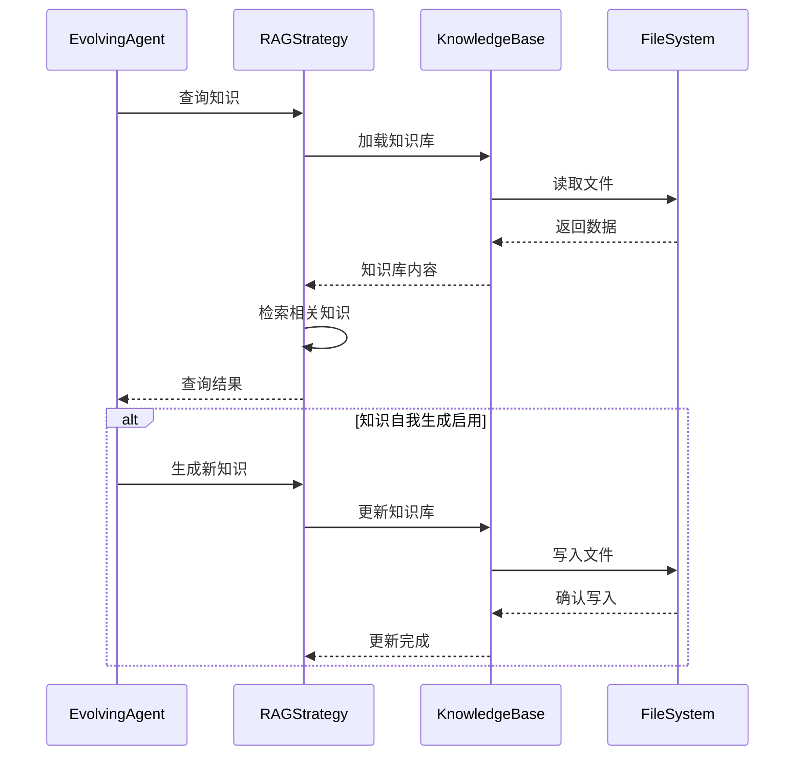

# EvolvingAgent API 详细文档

<cite>
**本文档中引用的文件**
- [evolving_agent.py](file://rdagent/core/evolving_agent.py)
- [evolving_framework.py](file://rdagent/core/evolving_framework.py)
- [scenario.py](file://rdagent/core/scenario.py)
- [knowledge_base.py](file://rdagent/core/knowledge_base.py)
- [experiment.py](file://rdagent/core/experiment.py)
- [evaluation.py](file://rdagent/core/evaluation.py)
- [__init__.py](file://rdagent/components/coder/CoSTEER/__init__.py)
- [ds_costeer.py](file://rdagent/components/coder/data_science/share/ds_costeer.py)
</cite>

## 目录
1. [简介](#简介)
2. [类架构概览](#类架构概览)
3. [核心类详细分析](#核心类详细分析)
4. [构造函数参数详解](#构造函数参数详解)
5. [run()方法执行流程](#run方法执行流程)
6. [公共方法详细说明](#公共方法详细说明)
7. [使用示例](#使用示例)
8. [组件交互模式](#组件交互模式)
9. [线程安全性和异步执行](#线程安全性和异步执行)
10. [故障排除指南](#故障排除指南)
11. [总结](#总结)

## 简介

EvolvingAgent是RD-Agent框架中的核心进化代理类，负责自动化研发流程的执行。它实现了基于检索增强生成（RAG）的智能进化算法，通过多轮迭代优化解决方案，不断学习和改进。该类采用泛型设计，支持不同类型的研发任务和策略。

## 类架构概览



**图表来源**
- [evolving_agent.py](file://rdagent/core/evolving_agent.py#L15-L116)
- [evolving_framework.py](file://rdagent/core/evolving_framework.py#L58-L127)

## 核心类详细分析

### EvoAgent基类

EvoAgent是一个抽象基类，定义了进化代理的基本接口和行为模式。



**图表来源**
- [evolving_agent.py](file://rdagent/core/evolving_agent.py#L15-L42)

### RAGEvoAgent核心实现

RAGEvoAgent是EvoAgent的具体实现，提供了完整的进化算法执行逻辑。

**节来源**
- [evolving_agent.py](file://rdagent/core/evolving_agent.py#L44-L116)

## 构造函数参数详解

### RAGEvoAgent.__init__() 方法

```python
def __init__(
    self,
    max_loop: int,
    evolving_strategy: EvolvingStrategy,
    rag: Any,
    *,
    with_knowledge: bool = False,
    with_feedback: bool = True,
    knowledge_self_gen: bool = False,
    enable_filelock: bool = False,
    filelock_path: str | None = None,
) -> None
```

#### 参数详细说明

| 参数名 | 类型 | 默认值 | 描述 |
|--------|------|--------|------|
| `max_loop` | `int` | 必需 | 最大进化循环次数，控制算法终止条件 |
| `evolving_strategy` | `EvolvingStrategy` | 必需 | 进化策略对象，定义具体的进化算法 |
| `rag` | `Any` | 必需 | 检索增强生成系统，提供知识查询和生成能力 |
| `with_knowledge` | `bool` | `False` | 是否启用知识查询功能 |
| `with_feedback` | `bool` | `True` | 是否启用反馈评估机制 |
| `knowledge_self_gen` | `bool` | `False` | 是否允许知识自我生成和更新 |
| `enable_filelock` | `bool` | `False` | 是否启用文件锁保护知识库并发访问 |
| `filelock_path` | `str \| None` | `None` | 文件锁路径，当启用文件锁时必需 |

#### 参数验证和约束

- `max_loop`必须为正整数，表示最大迭代次数
- `evolving_strategy`必须是有效的EvolvingStrategy实例
- `rag`可以是任何支持query方法的对象，通常为RAGStrategy实现
- 当`enable_filelock=True`时，`filelock_path`必须提供有效路径
- `knowledge_self_gen=True`时，需要确保`rag`支持知识生成功能

**节来源**
- [evolving_agent.py](file://rdagent/core/evolving_agent.py#L44-L68)

## run()方法执行流程

### multistep_evolve() 方法详解

`multistep_evolve()`方法是EvolvingAgent的核心执行方法，实现了完整的进化循环。



**图表来源**
- [evolving_agent.py](file://rdagent/core/evolving_agent.py#L70-L116)

### 执行流程详细步骤

1. **初始化阶段**
   - 设置循环计数器和日志标签
   - 初始化进化轨迹列表

2. **知识查询阶段**
   - 根据配置决定是否启用知识查询
   - 调用RAG系统查询相关知识

3. **进化计算阶段**
   - 使用进化策略生成新的解决方案
   - 包装进化结果为EvoStep对象

4. **反馈评估阶段**
   - 根据配置决定是否进行反馈评估
   - 记录评估结果到进化轨迹

5. **知识库更新阶段**
   - 在允许的情况下更新知识库
   - 支持并发访问保护

6. **结果产出阶段**
   - 生成当前进化结果供外部使用
   - 检查是否满足终止条件

**节来源**
- [evolving_agent.py](file://rdagent/core/evolving_agent.py#L70-L116)

## 公共方法详细说明

### multistep_evolve() 方法

#### 方法签名
```python
def multistep_evolve(
    self,
    evo: ASpecificEvolvableSubjects,
    eva: RAGEvaluator | Feedback,
) -> Generator[ASpecificEvolvableSubjects, None, None]
```

#### 参数说明

| 参数名 | 类型 | 描述 |
|--------|------|------|
| `evo` | `ASpecificEvolvableSubjects` | 初始进化目标对象 |
| `eva` | `RAGEvaluator \| Feedback` | 评估器或初始反馈 |

#### 返回值
- **类型**: `Generator[ASpecificEvolvableSubjects, None, None]`
- **描述**: 生成器对象，每次迭代产生一个进化后的解决方案

#### 异常处理
- **TypeError**: 当输入参数类型不匹配时抛出
- **RuntimeError**: 当进化过程中遇到不可恢复错误时抛出
- **ValueError**: 当配置参数无效时抛出

#### 使用示例
```python
# 基本使用方式
for evolved_solution in evolve_agent.multistep_evolve(initial_subject, evaluator):
    # 处理每一轮的进化结果
    process_evolution_result(evolved_solution)
```

### 属性说明

#### evolving_trace
- **类型**: `list[EvoStep[ASpecificEvolvableSubjects]]`
- **描述**: 进化轨迹记录，包含每轮进化的结果、知识查询和反馈信息
- **用途**: 用于跟踪进化历史和调试分析

#### with_knowledge
- **类型**: `bool`
- **描述**: 控制是否启用知识查询功能
- **影响**: 影响进化过程中的知识利用和性能

#### with_feedback
- **类型**: `bool`
- **描述**: 控制是否启用反馈评估机制
- **影响**: 影响进化终止条件和结果质量

#### knowledge_self_gen
- **类型**: `bool`
- **描述**: 控制是否允许知识库自我更新
- **影响**: 影响知识库的动态演进能力

**节来源**
- [evolving_agent.py](file://rdagent/core/evolving_agent.py#L15-L116)

## 使用示例

### 基础实例化和使用

以下展示了如何创建和使用RAGEvoAgent的基本示例：

```python
# 1. 导入必要的模块
from rdagent.core.evolving_agent import RAGEvoAgent
from rdagent.core.evolving_framework import EvolvingStrategy
from rdagent.core.scenario import Scenario

# 2. 创建场景和策略
scenario = MyScenario()  # 自定义场景实现
strategy = MyEvolvingStrategy(scenario)  # 自定义策略实现
rag_system = MyRAGSystem()  # 自定义RAG系统

# 3. 实例化EvolveAgent
evolve_agent = RAGEvoAgent(
    max_loop=10,
    evolving_strategy=strategy,
    rag=rag_system,
    with_knowledge=True,
    with_feedback=True,
    knowledge_self_gen=False
)

# 4. 开始进化过程
initial_subject = create_initial_subject()  # 创建初始进化目标
evaluator = MyEvaluator()  # 创建评估器

for evolved_solution in evolve_agent.multistep_evolve(initial_subject, evaluator):
    # 处理每一轮的进化结果
    print(f"第 {len(evolve_agent.evolving_trace)} 轮进化完成")
    print(f"当前最佳解: {evolved_solution}")
    
    # 可以在这里添加自定义处理逻辑
    if should_stop(evolved_solution):
        print("满足停止条件，提前终止")
        break
```

### 高级配置示例

```python
# 配置复杂的进化环境
from filelock import FileLock

# 启用知识库自我更新和并发保护
evolve_agent = RAGEvoAgent(
    max_loop=20,
    evolving_strategy=strategy,
    rag=rag_system,
    with_knowledge=True,
    with_feedback=True,
    knowledge_self_gen=True,  # 启用知识自我生成
    enable_filelock=True,     # 启用文件锁保护
    filelock_path="./knowledge_lock.lock"  # 设置锁文件路径
)

# 并行处理多个进化任务
import asyncio
from concurrent.futures import ProcessPoolExecutor

async def parallel_evolution():
    tasks = []
    for i in range(5):  # 并行运行5个独立的进化任务
        task = asyncio.create_task(
            run_single_evolution(initial_subjects[i], evaluator)
        )
        tasks.append(task)
    
    results = await asyncio.gather(*tasks)
    return results
```

### CoSTEER集成示例

```python
# 使用CoSTEER进行数据科学项目开发
from rdagent.components.coder.CoSTEER import CoSTEER
from rdagent.components.coder.CoSTEER.config import CoSTEERSettings

# 配置CoSTEER设置
settings = CoSTEERSettings(
    max_loop=15,
    knowledge_base_path="./knowledge_base.pkl",
    enable_filelock=True,
    filelock_path="./costeer_lock.lock"
)

# 创建CoSTEER实例
costeer = CoSTEER(
    settings=settings,
    eva=my_evaluator,
    es=my_strategy,
    evolving_version=2,
    with_knowledge=True,
    knowledge_self_gen=True
)

# 开发实验
experiment = create_experiment()  # 创建实验对象
developed_experiment = costeer.develop(experiment)

print(f"开发完成，获得 {len(developed_experiment.sub_workspace_list)} 个子工作空间")
```

**节来源**
- [__init__.py](file://rdagent/components/coder/CoSTEER/__init__.py#L98-L128)
- [ds_costeer.py](file://rdagent/components/coder/data_science/share/ds_costeer.py#L1-L10)

## 组件交互模式

### 与Scenario的交互



**图表来源**
- [evolving_agent.py](file://rdagent/core/evolving_agent.py#L75-L85)
- [evolving_framework.py](file://rdagent/core/evolving_framework.py#L75-L85)

### 与Experiment的交互



**图表来源**
- [experiment.py](file://rdagent/core/experiment.py#L100-L150)
- [evolving_agent.py](file://rdagent/core/evolving_agent.py#L85-L95)

### 与KnowledgeBase的交互



**图表来源**
- [knowledge_base.py](file://rdagent/core/knowledge_base.py#L8-L27)
- [evolving_agent.py](file://rdagent/core/evolving_agent.py#L100-L110)

**节来源**
- [evolving_agent.py](file://rdagent/core/evolving_agent.py#L70-L116)
- [evolving_framework.py](file://rdagent/core/evolving_framework.py#L58-L127)

## 线程安全性和异步执行

### 线程安全性分析

EvolvingAgent在设计上考虑了多种并发场景：

#### 文件锁保护机制
```python
# 知识库并发访问保护
with FileLock(self.filelock_path) if self.enable_filelock else nullcontext():
    self.rag.load_dumped_knowledge_base()
    self.rag.generate_knowledge(self.evolving_trace)
    self.rag.dump_knowledge_base()
```

#### 线程安全特性
- **状态隔离**: 每个EvolveAgent实例维护独立的状态
- **无共享可变状态**: 除了知识库外，其他状态都是只读的
- **原子操作**: 关键操作如知识库更新使用文件锁保护

#### 并发限制
- 单个EvolveAgent实例不是线程安全的
- 多个实例可以并行运行
- 知识库级别的并发访问需要额外保护

### 异步执行能力

虽然EvolveAgent本身不是异步实现，但可以通过以下方式支持异步执行：

```python
import asyncio
from concurrent.futures import ThreadPoolExecutor

class AsyncEvolvingAgent:
    def __init__(self, sync_agent: RAGEvoAgent):
        self.agent = sync_agent
        self.executor = ThreadPoolExecutor(max_workers=4)
    
    async def evolve_async(self, initial_subject, evaluator):
        loop = asyncio.get_event_loop()
        return await loop.run_in_executor(
            self.executor, 
            lambda: list(self.agent.multistep_evolve(initial_subject, evaluator))
        )
```

### 性能优化建议

1. **批量处理**: 将多个进化任务合并处理
2. **缓存策略**: 缓存频繁查询的知识
3. **资源管理**: 合理配置max_loop避免过度计算
4. **内存优化**: 定期清理不需要的进化轨迹

**节来源**
- [evolving_agent.py](file://rdagent/core/evolving_agent.py#L100-L110)

## 故障排除指南

### 常见问题和解决方案

#### 1. 知识库加载失败
**症状**: `KnowledgeBase path is not set, dump failed.`警告
**原因**: 知识库路径未正确配置
**解决方案**: 
```python
# 确保正确设置知识库路径
evolve_agent = RAGEvoAgent(
    max_loop=10,
    evolving_strategy=strategy,
    rag=rag_system,
    knowledge_self_gen=True,
    filelock_path="./knowledge_lock.lock"  # 必须提供
)
```

#### 2. 文件锁冲突
**症状**: 并发访问时出现锁等待或死锁
**原因**: 多个进程同时访问同一知识库
**解决方案**:
```python
# 使用不同的锁文件路径
evolve_agent = RAGEvoAgent(
    max_loop=10,
    evolving_strategy=strategy,
    rag=rag_system,
    enable_filelock=True,
    filelock_path=f"./knowledge_lock_{os.getpid()}.lock"  # 使用进程ID区分
)
```

#### 3. 进化循环卡住
**症状**: 进化过程长时间无进展
**原因**: 反馈条件过于严格或策略失效
**解决方案**:
```python
# 添加超时机制
import signal
import threading

class TimeoutHandler:
    def __init__(self, timeout_seconds):
        self.timeout_seconds = timeout_seconds
        self.timer = None
        
    def start_timer(self):
        self.timer = threading.Timer(self.timeout_seconds, self.timeout_handler)
        self.timer.start()
        
    def timeout_handler(self):
        # 实现超时处理逻辑
        pass
```

#### 4. 内存泄漏
**症状**: 长时间运行后内存占用持续增长
**原因**: 进化轨迹积累过多
**解决方案**:
```python
# 定期清理进化轨迹
def clean_old_history(agent, max_history=100):
    if len(agent.evolving_trace) > max_history:
        agent.evolving_trace = agent.evolving_trace[-max_history:]
```

### 调试技巧

#### 启用详细日志
```python
import logging
from rdagent.log import rdagent_logger as logger

# 设置日志级别
logger.setLevel(logging.DEBUG)

# 监控进化轨迹
for i, step in enumerate(evolve_agent.evolving_trace):
    print(f"Step {i}: Knowledge={step.queried_knowledge}, Feedback={step.feedback}")
```

#### 性能监控
```python
import time
from functools import wraps

def monitor_performance(func):
    @wraps(func)
    def wrapper(*args, **kwargs):
        start_time = time.time()
        result = func(*args, **kwargs)
        end_time = time.time()
        print(f"{func.__name__} took {end_time - start_time:.2f} seconds")
        return result
    return wrapper
```

**节来源**
- [evolving_agent.py](file://rdagent/core/evolving_agent.py#L100-L110)
- [knowledge_base.py](file://rdagent/core/knowledge_base.py#L20-L27)

## 总结

EvolvingAgent是RD-Agent框架中的核心进化代理，具有以下关键特性：

### 主要优势
1. **模块化设计**: 基于泛型和组合的设计，易于扩展和定制
2. **智能进化**: 结合RAG技术和进化算法，实现智能化解决方案生成
3. **灵活配置**: 提供丰富的配置选项，适应不同应用场景
4. **可扩展性**: 支持自定义策略、评估器和知识库实现

### 应用场景
- 自动化软件开发
- 数据科学项目优化
- 算法研究和实验
- 智能系统设计

### 最佳实践
1. **合理配置参数**: 根据具体任务调整max_loop和功能开关
2. **监控进化过程**: 定期检查进化轨迹和性能指标
3. **资源管理**: 注意内存和文件系统的使用效率
4. **错误处理**: 实现完善的异常处理和恢复机制

通过深入理解和正确使用EvolvingAgent，开发者可以构建强大的自动化研发系统，显著提升开发效率和代码质量。