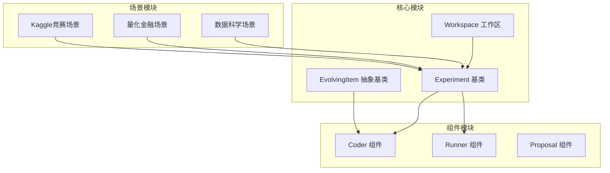
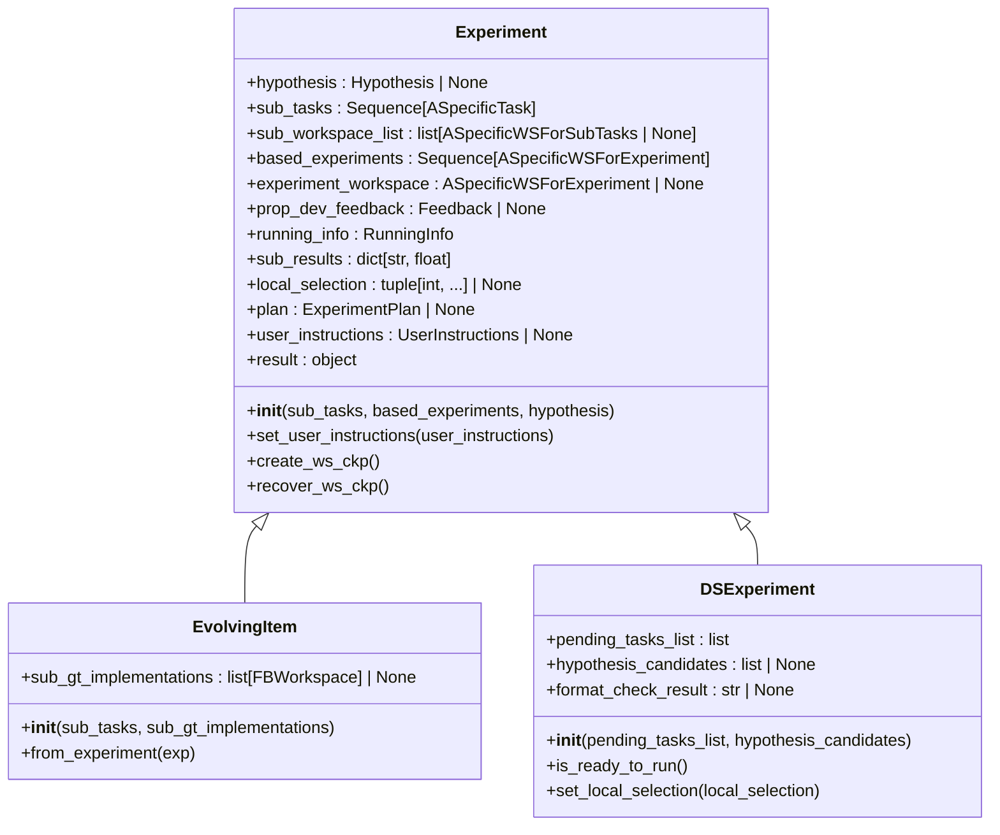
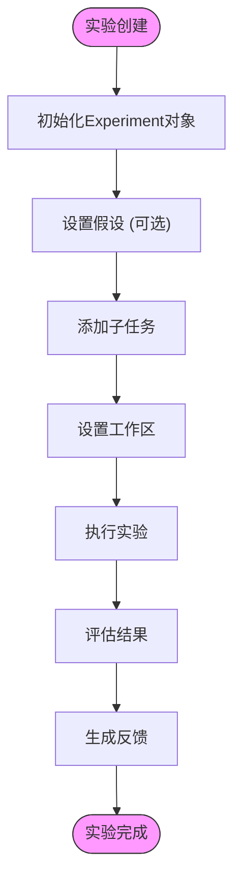
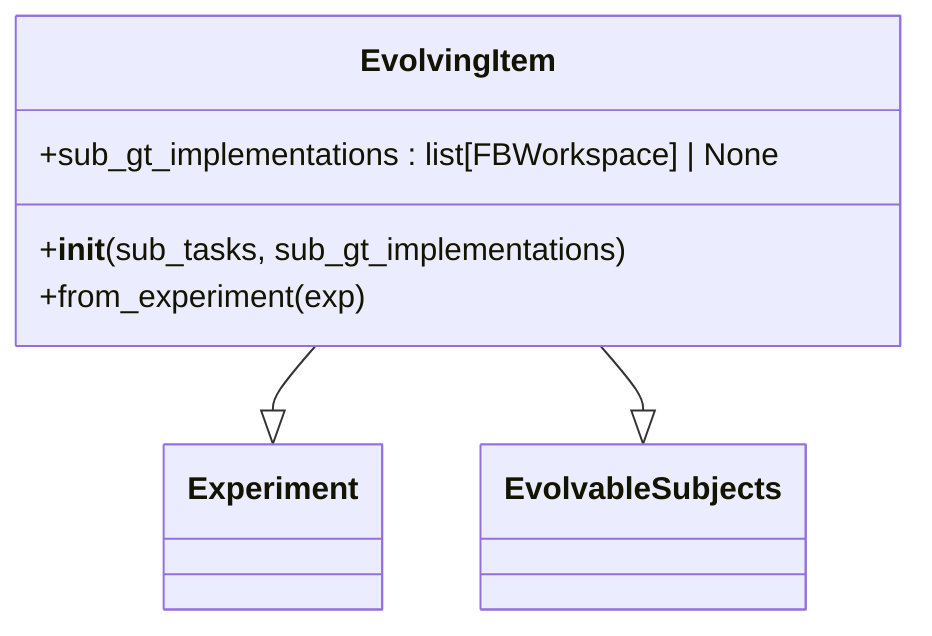
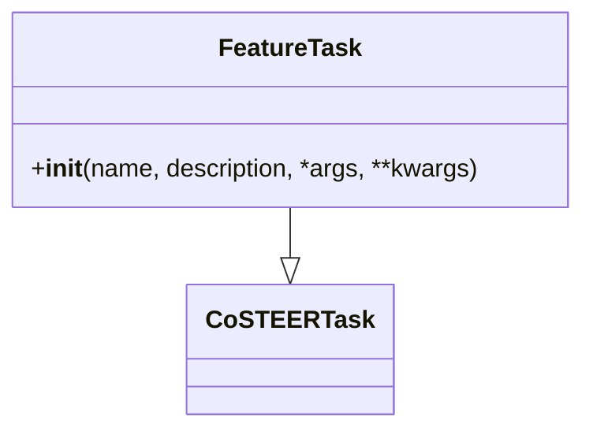
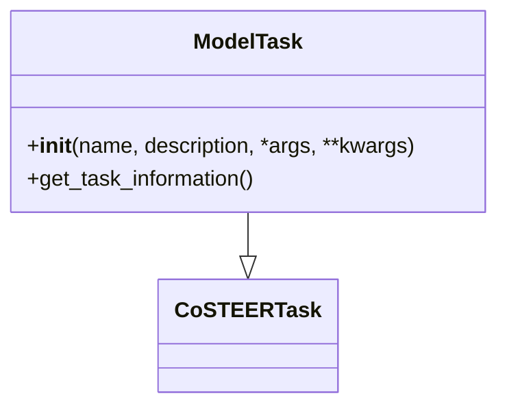
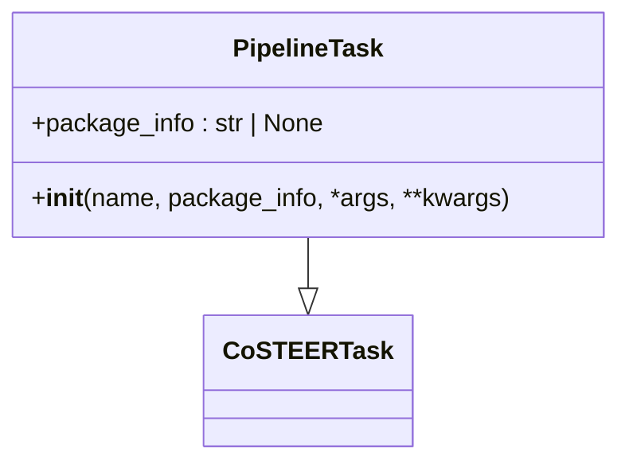
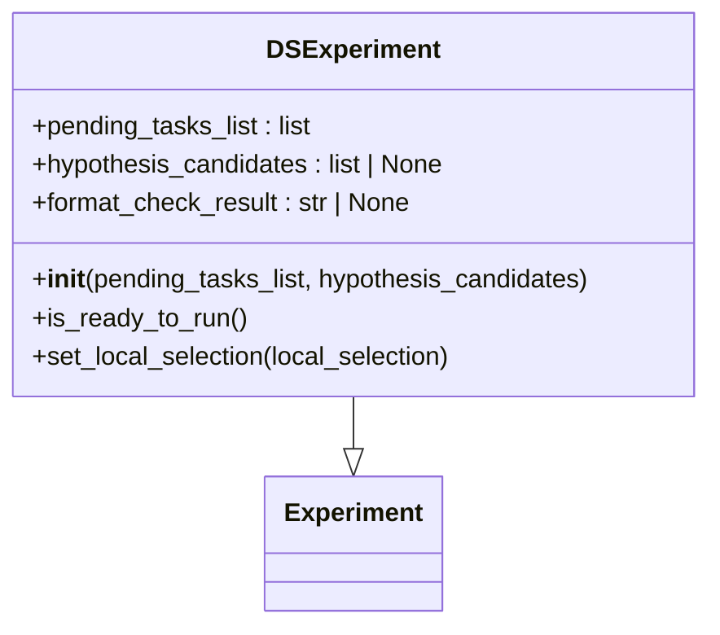
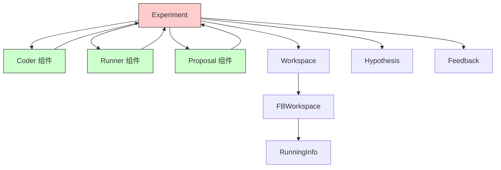

# Experiment API

<cite>
**本文档中引用的文件**  
- [experiment.py](file://rdagent/core/experiment.py)
- [evolvable_subjects.py](file://rdagent/components/coder/CoSTEER/evolvable_subjects.py)
- [DSExperiment.py](file://rdagent/scenarios/data_science/experiment/experiment.py)
- [feature.py](file://rdagent/components/coder/data_science/feature/exp.py)
- [model.py](file://rdagent/components/coder/data_science/model/exp.py)
- [pipeline.py](file://rdagent/components/coder/data_science/pipeline/exp.py)
- [runner.py](file://rdagent/scenarios/data_science/dev/runner/__init__.py)
- [coder.py](file://rdagent/components/coder/data_science/pipeline/__init__.py)
</cite>

## 目录
1. [简介](#简介)
2. [项目结构](#项目结构)
3. [核心组件](#核心组件)
4. [架构概述](#架构概述)
5. [详细组件分析](#详细组件分析)
6. [依赖分析](#依赖分析)
7. [性能考虑](#性能考虑)
8. [故障排除指南](#故障排除指南)
9. [结论](#结论)

## 简介
本API文档详细描述了RD-Agent框架中的实验系统，包括Experiment基类、EvolvingItem抽象基类及其在特征、模型、因子等领域的具体实现。文档涵盖了实验的生命周期管理、状态属性、序列化机制以及与Coder和Runner组件的协作模式。

## 项目结构
实验系统主要分布在core和components目录中，形成了分层的架构设计。

**图源**
- [experiment.py](file://rdagent/core/experiment.py#L378-L468)
- [evolvable_subjects.py](file://rdagent/components/coder/CoSTEER/evolvable_subjects.py#L5-L31)

## 核心组件
核心组件包括Experiment基类和EvolvingItem抽象基类，它们构成了实验系统的骨架，管理着实验的生命周期、状态和执行流程。

**节源**
- [experiment.py](file://rdagent/core/experiment.py#L378-L468)
- [evolvable_subjects.py](file://rdagent/components/coder/CoSTEER/evolvable_subjects.py#L5-L31)

## 架构概述
实验系统采用分层架构，从基础的Experiment类到具体的场景实现，形成了完整的实验管理框架。

**图源**
- [experiment.py](file://rdagent/core/experiment.py#L378-L468)
- [evolvable_subjects.py](file://rdagent/components/coder/CoSTEER/evolvable_subjects.py#L5-L31)
- [experiment.py](file://rdagent/scenarios/data_science/experiment/experiment.py#L0-L43)

## 详细组件分析
### Experiment基类分析
Experiment类是所有实验的基类，定义了实验的基本结构和生命周期方法。

#### 状态属性
Experiment类包含多个关键状态属性，用于管理实验的完整状态：

- **hypothesis**: 实验基于的假设，可选
- **sub_tasks**: 实验包含的子任务序列
- **sub_workspace_list**: 子任务工作区列表，None表示未实现或被跳过
- **based_experiments**: 基于的先前实验序列
- **experiment_workspace**: 实验工作区，用于存储整体实现
- **prop_dev_feedback**: 开发者反馈，用于组件间信息传递
- **running_info**: 运行信息，包含结果和运行时间
- **sub_results**: 子结果字典
- **local_selection**: 本地选择元组，用于并行多轨迹支持
- **plan**: 实验计划，存储实验规划信息
- **user_instructions**: 用户指令，用于指导实验执行

#### 生命周期方法
Experiment类提供了完整的生命周期管理方法：

- **__init__**: 初始化实验，设置基本属性
- **set_user_instructions**: 设置用户指令并传播到相关组件
- **create_ws_ckp**: 创建工作区检查点
- **recover_ws_ckp**: 从检查点恢复工作区

**图源**
- [experiment.py](file://rdagent/core/experiment.py#L378-L468)

**节源**
- [experiment.py](file://rdagent/core/experiment.py#L378-L468)

### EvolvingItem抽象基类分析
EvolvingItem是EvolvingItem抽象基类的具体实现，用于因子实现的中间项管理。

#### 类结构

#### 实现细节
EvolvingItem类的主要功能包括：

1. **初始化**: 接收子任务和可选的GT实现，进行长度验证
2. **工厂方法**: 提供from_experiment类方法，从现有实验创建EvolvingItem实例
3. **继承关系**: 同时继承Experiment和EvolvableSubjects，结合了实验管理和可进化主体的特性

**图源**
- [evolvable_subjects.py](file://rdagent/components/coder/CoSTEER/evolvable_subjects.py#L5-L31)

**节源**
- [evolvable_subjects.py](file://rdagent/components/coder/CoSTEER/evolvable_subjects.py#L5-L31)

### 具体实现分析
#### 特征领域实现
特征领域的实验实现主要在data_science/feature模块中。

**图源**
- [exp.py](file://rdagent/components/coder/data_science/feature/exp.py#L0-L13)

#### 模型领域实现
模型领域的实验实现主要在data_science/model模块中。

**图源**
- [exp.py](file://rdagent/components/coder/data_science/model/exp.py#L0-L21)

#### 流水线领域实现
流水线领域的实验实现主要在data_science/pipeline模块中。

**图源**
- [exp.py](file://rdagent/components/coder/data_science/pipeline/exp.py#L0-L8)

### DSExperiment分析
DSExperiment是数据科学场景下的具体实验实现。

#### 类结构

#### 关键方法
- **is_ready_to_run**: 检查实验是否准备好运行，主要检查main.py文件是否存在
- **set_local_selection**: 设置本地选择，用于并行多轨迹支持

**图源**
- [experiment.py](file://rdagent/scenarios/data_science/experiment/experiment.py#L0-L43)

**节源**
- [experiment.py](file://rdagent/scenarios/data_science/experiment/experiment.py#L0-L43)

## 依赖分析
实验系统与其他组件有着紧密的依赖关系，形成了完整的研发工作流。

**图源**
- [experiment.py](file://rdagent/core/experiment.py#L378-L468)
- [__init__.py](file://rdagent/components/coder/data_science/pipeline/__init__.py#L0-L44)
- [__init__.py](file://rdagent/scenarios/data_science/dev/runner/__init__.py#L134-L225)

**节源**
- [experiment.py](file://rdagent/core/experiment.py#L378-L468)
- [__init__.py](file://rdagent/components/coder/data_science/pipeline/__init__.py#L0-L44)
- [__init__.py](file://rdagent/scenarios/data_science/dev/runner/__init__.py#L134-L225)

## 性能考虑
实验系统的性能主要体现在以下几个方面：

1. **检查点机制**: 通过create_ws_ckp和recover_ws_ckp方法实现工作区的快速保存和恢复
2. **缓存策略**: Runner组件使用缓存机制避免重复计算
3. **并行支持**: 通过local_selection属性支持并行多轨迹实验
4. **内存管理**: 在恢复检查点后立即清除ws_ckp以减少内存占用

## 故障排除指南
### 常见问题
1. **工作区恢复失败**: 可能是由于工作区被多次恢复，系统会抛出RuntimeError
2. **结果文件缺失**: 如果scores.csv文件未生成，系统会抛出RunnerError
3. **任务信息不一致**: 确保子任务和GT实现的长度一致

### 调试建议
1. 检查工作区路径是否存在
2. 验证代码注入是否正确
3. 确认执行环境配置正确
4. 检查日志输出中的错误信息

**节源**
- [experiment.py](file://rdagent/core/experiment.py#L378-L468)
- [__init__.py](file://rdagent/scenarios/data_science/dev/runner/__init__.py#L134-L225)

## 结论
Experiment API提供了一套完整的实验管理系统，通过基类和抽象基类的设计，实现了灵活的实验架构。系统支持多种场景的实验需求，具有良好的扩展性和可维护性。与Coder和Runner组件的紧密协作，使得实验的创建、执行和评估形成了完整的闭环。