# KnowledgeBase API 参考文档

<cite>
**本文档中引用的文件**
- [knowledge_base.py](file://rdagent/core/knowledge_base.py)
- [evolving_framework.py](file://rdagent/core/evolving_framework.py)
- [vector_base.py](file://rdagent/components/knowledge_management/vector_base.py)
- [graph.py](file://rdagent/components/knowledge_management/graph.py)
- [knowledge_management.py](file://rdagent/components/coder/CoSTEER/knowledge_management.py)
- [kaggle_vector_base.py](file://rdagent/scenarios/kaggle/knowledge_management/vector_base.py)
</cite>

## 目录
1. [简介](#简介)
2. [核心架构](#核心架构)
3. [KnowledgeBase 基础类](#knowledgebase-基础类)
4. [知识条目数据结构](#知识条目数据结构)
5. [核心操作方法](#核心操作方法)
6. [向量检索机制](#向量检索机制)
7. [图谱查询机制](#图谱查询机制)
8. [混合检索系统](#混合检索系统)
9. [版本管理与一致性](#版本管理与一致性)
10. [性能优化指南](#性能优化指南)
11. [使用示例](#使用示例)
12. [故障排除](#故障排除)

## 简介

KnowledgeBase 是 RD-Agent 框架中的核心知识管理系统，提供了完整的知识存储、检索和管理功能。该系统支持向量检索、图谱查询以及两者的混合检索模式，为智能体提供丰富的上下文知识。

## 核心架构


**图表来源**
- [knowledge_base.py](file://rdagent/core/knowledge_base.py#L7-L26)
- [evolving_framework.py](file://rdagent/core/evolving_framework.py#L25-L30)
- [vector_base.py](file://rdagent/components/knowledge_management/vector_base.py#L15-L208)
- [graph.py](file://rdagent/components/knowledge_management/graph.py#L50-L497)

## KnowledgeBase 基础类

### 类定义

KnowledgeBase 是所有知识管理系统的基类，提供基本的持久化功能。


**图表来源**
- [knowledge_base.py](file://rdagent/core/knowledge_base.py#L7-L26)

### 初始化参数

| 参数 | 类型 | 默认值 | 描述 |
|------|------|--------|------|
| `path` | `str \| Path \| None` | `None` | 知识库持久化路径，如果为None则不启用持久化 |

### 核心方法

#### `__init__(path: str | Path | None)`
构造函数，初始化知识库实例。

**参数规范：**
- `path`: 可选的文件路径，用于知识库的持久化存储

**行为特征：**
- 如果提供了有效路径，则自动调用 `load()` 方法加载现有知识库
- 支持相对路径和绝对路径
- 路径不存在时不会抛出异常，仅跳过加载

#### `load()`
从指定路径加载知识库状态。

**行为特征：**
- 检查路径是否存在且可访问
- 使用 pickle 序列化格式加载数据
- 支持字典格式和对象格式的知识库
- 忽略 `path` 字段以避免循环引用

#### `dump()`
将当前知识库状态保存到指定路径。

**行为特征：**
- 创建必要的父目录
- 使用 pickle 序列化保存整个对象状态
- 如果未设置路径则记录警告并跳过保存

**章节来源**
- [knowledge_base.py](file://rdagent/core/knowledge_base.py#L7-L26)

## 知识条目数据结构

### KnowledgeMetaData 类

KnowledgeMetaData 是知识条目的核心数据结构，支持语义嵌入和分块处理。


**图表来源**
- [vector_base.py](file://rdagent/components/knowledge_management/vector_base.py#L15-L76)

### 元数据字段详解

| 字段名 | 类型 | 描述 | 默认值 |
|--------|------|------|--------|
| `label` | `str` | 知识条目标签，用于分类和过滤 | `None` |
| `content` | `str` | 知识内容主体 | `""` |
| `id` | `str` | 唯一标识符，基于内容生成UUID | 自动生成 |
| `embedding` | `Any` | 向量嵌入表示，用于相似性计算 | `None` |
| `trunks` | `List[str]` | 内容分块列表 | `[]` |
| `trunks_embedding` | `List[Any]` | 分块对应的嵌入向量 | `[]` |

### 知识条目生命周期


**图表来源**
- [vector_base.py](file://rdagent/components/knowledge_management/vector_base.py#L15-L76)

**章节来源**
- [vector_base.py](file://rdagent/components/knowledge_management/vector_base.py#L15-L76)

## 核心操作方法

### add_knowledge() 方法族

#### VectorBase.add() 方法


**图表来源**
- [vector_base.py](file://rdagent/components/knowledge_management/vector_base.py#L77-L134)

#### 方法签名与参数

| 方法 | 参数 | 类型 | 描述 |
|------|------|------|------|
| `add` | `document` | `Union[Document, List[Document]]` | 单个或多个文档对象 |

**参数规范：**
- `document`: 可以是单个 `Document` 对象或文档列表
- 支持批量添加多个知识条目
- 自动处理嵌入向量生成
- 支持内容分块和分块嵌入

#### 实现细节

1. **单文档处理**：为每个文档创建唯一ID
2. **嵌入生成**：调用 APIBackend 生成向量表示
3. **分块处理**：对长内容进行分块处理
4. **数据存储**：将文档信息添加到向量数据库

### retrieve_knowledge() 方法族

#### VectorBase.search() 方法


**图表来源**
- [vector_base.py](file://rdagent/components/knowledge_management/vector_base.py#L147-L208)

#### 方法签名与参数

| 方法 | 参数 | 类型 | 描述 |
|------|------|------|------|
| `search` | `content` | `str` | 查询内容 |
| `search` | `topk_k` | `int \| None` | 返回的最相似结果数量 |
| `search` | `similarity_threshold` | `float` | 最小相似度阈值 |
| `search` | `constraint_labels` | `List[str] \| None` | 标签约束条件 |

**参数规范：**
- `content`: 查询文本内容
- `topk_k`: 可选参数，限制返回结果数量
- `similarity_threshold`: 相似度阈值，默认为0
- `constraint_labels`: 标签过滤器，可选

#### 返回值结构

| 返回值 | 类型 | 描述 |
|--------|------|------|
| `documents` | `List[Document]` | 相似度最高的文档列表 |
| `scores` | `List[float]` | 对应的相似度分数 |

### update_knowledge() 方法族

#### Graph.update_success_task() 方法


**图表来源**
- [knowledge_management.py](file://rdagent/components/coder/CoSTEER/knowledge_management.py#L780-L820)

**章节来源**
- [vector_base.py](file://rdagent/components/knowledge_management/vector_base.py#L77-L208)
- [knowledge_management.py](file://rdagent/components/coder/CoSTEER/knowledge_management.py#L780-L820)

## 向量检索机制

### PDVectorBase 实现

PDVectorBase 是基于 Pandas 的向量存储实现，提供高效的向量检索功能。

```mermaid
classDiagram
class PDVectorBase {
+DataFrame vector_df
+__init__(path : Union[str, Path])
+shape() Tuple[int, int]
+add(document : Union[Document, List[Document]])
+search(content : str, topk_k : int, similarity_threshold : float, constraint_labels : List[str]) Tuple[List[Document], List]
}
class VectorDataFrame {
+str id
+str label
+str content
+str trunk
+Any embedding
}
PDVectorBase --> VectorDataFrame : "manages"
note for PDVectorBase "使用Pandas DataFrame存储向量\n支持高效的数据查询和过滤\n提供内存和磁盘两种存储方式"
```



**图表来源**
- [vector_base.py](file://rdagent/components/knowledge_management/vector_base.py#L85-L208)

### 向量检索流程


**图表来源**
- [vector_base.py](file://rdagent/components/knowledge_management/vector_base.py#L147-L208)

### 性能特性

| 特性 | 描述 | 优化策略 |
|------|------|----------|
| **内存效率** | 使用Pandas DataFrame存储 | 列式存储，压缩算法 |
| **查询速度** | O(n)相似度计算 | 向量化操作，NumPy优化 |
| **扩展性** | 支持大规模数据集 | 分块处理，流式加载 |
| **精度控制** | 可调节相似度阈值 | 动态阈值调整 |

**章节来源**
- [vector_base.py](file://rdagent/components/knowledge_management/vector_base.py#L85-L208)

## 图谱查询机制

### UndirectedGraph 实现

UndirectedGraph 提供基于图结构的知识查询，支持语义连接和路径推理。


**图表来源**
- [graph.py](file://rdagent/components/knowledge_management/graph.py#L50-L497)

### 图谱查询算法


**图表来源**
- [graph.py](file://rdagent/components/knowledge_management/graph.py#L339-L497)

### 查询方法详解

| 方法 | 参数 | 描述 | 返回值 |
|------|------|------|--------|
| `semantic_search` | `node: UndirectedNode \| str` | 基于语义相似性的搜索 | `List[UndirectedNode]` |
| `query_by_content` | `content: str \| List[str]` | 基于内容的图谱查询 | `List[UndirectedNode]` |
| `query_by_node` | `node: UndirectedNode` | 基于节点连接的查询 | `List[UndirectedNode]` |
| `get_nodes_within_steps` | `steps: int` | 获取指定步数内的节点 | `List[UndirectedNode]` |

**章节来源**
- [graph.py](file://rdagent/components/knowledge_management/graph.py#L50-L497)

## 混合检索系统

### 检索策略组合

RD-Agent 的混合检索系统结合了向量检索和图谱查询的优势，提供更精确和全面的知识检索。


**图表来源**
- [knowledge_management.py](file://rdagent/components/coder/CoSTEER/knowledge_management.py#L833-L909)

### 检索策略配置

| 策略类型 | 参数 | 描述 | 默认值 |
|----------|------|------|--------|
| **向量检索** | `similarity_threshold` | 相似度阈值 | 0.0 |
| **向量检索** | `topk_k` | 结果数量限制 | None |
| **图谱检索** | `step` | 遍历步数 | 1 |
| **图谱检索** | `constraint_labels` | 标签约束 | None |
| **融合权重** | `knowledge_sampler` | 知识采样率 | 1.0 |

### 检索结果融合


**图表来源**
- [knowledge_management.py](file://rdagent/components/coder/CoSTEER/knowledge_management.py#L833-L909)

**章节来源**
- [knowledge_management.py](file://rdagent/components/coder/CoSTEER/knowledge_management.py#L833-L909)

## 版本管理与一致性

### EvolvingKnowledgeBase 架构

EvolvingKnowledgeBase 提供了版本化的知识管理系统，支持知识的演进和一致性保证。


**图表来源**
- [evolving_framework.py](file://rdagent/core/evolving_framework.py#L25-L30)
- [knowledge_management.py](file://rdagent/components/coder/CoSTEER/knowledge_management.py#L110-L200)

### 版本兼容性管理

| 版本 | 主要特性 | 数据结构 | 兼容性 |
|------|----------|----------|--------|
| V1 | 基础知识追踪 | `implementation_trace`, `success_task_info_set` | 不支持V2 |
| V2 | 图谱增强 | `UndirectedGraph`, `error_analysis` | 不支持V1 |

### 一致性保证机制


**图表来源**
- [knowledge_management.py](file://rdagent/components/coder/CoSTEER/knowledge_management.py#L60-L90)

**章节来源**
- [evolving_framework.py](file://rdagent/core/evolving_framework.py#L25-L30)
- [knowledge_management.py](file://rdagent/components/coder/CoSTEER/knowledge_management.py#L110-L200)

## 性能优化指南

### 索引配置优化

#### 向量索引优化

| 优化策略 | 实现方法 | 性能提升 |
|----------|----------|----------|
| **分块大小** | `chunk_size: int = 1000` | 减少单次API调用次数 |
| **重叠设置** | `overlap: int = 0` | 平衡精度和性能 |
| **批处理** | `batch_size: int = 16` | 减少网络开销 |
| **缓存策略** | 嵌入向量缓存 | 避免重复计算 |

#### 图谱索引优化


### 查询优化技巧

#### 向量检索优化

1. **相似度阈值调优**
   ```python
   # 推荐阈值范围
   thresholds = [0.1, 0.3, 0.5, 0.7, 0.9]
   ```

2. **Top-K 选择策略**
   ```python
   # 动态调整结果数量
   topk_candidates = [5, 10, 20, 50]
   ```

3. **标签约束优化**
   ```python
   # 使用具体标签而非通配符
   constraint_labels = ["model", "feature", "data"]
   ```

#### 图谱查询优化

1. **步数限制**
   ```python
   # 控制搜索深度
   max_steps = 2  # 避免过深搜索
   ```

2. **连接性过滤**
   ```python
   # 应用合理的距离约束
   constraint_distance = 0.5
   ```

3. **并行处理**
   ```python
   # 并行执行多个查询分支
   parallel_queries = True
   ```

### 内存管理优化

| 组件 | 优化策略 | 内存节省 |
|------|----------|----------|
| **向量存储** | 压缩存储格式 | 40-60% |
| **图谱缓存** | LRU淘汰策略 | 30-50% |
| **嵌入缓存** | 按需加载 | 20-40% |
| **查询结果** | 流式处理 | 50-70% |

**章节来源**
- [vector_base.py](file://rdagent/components/knowledge_management/vector_base.py#L147-L208)
- [graph.py](file://rdagent/components/knowledge_management/graph.py#L339-L497)

## 使用示例

### 基础知识库操作

#### 创建和初始化知识库

```python
# 基础知识库创建
kb = KnowledgeBase(path="./knowledge_base.pkl")

# 向量知识库创建
vector_kb = PDVectorBase(path="./vector_base.pkl")

# 图谱知识库创建
graph_kb = UndirectedGraph(path="./graph_base.pkl")
```

#### 添加知识条目

```python
# 创建知识条目
doc = Document(
    content="机器学习模型评估指标包括准确率、召回率、F1分数等。",
    label="machine_learning",
    identity="unique_id_123"
)

# 添加单个知识
vector_kb.add(doc)

# 批量添加知识
docs = [
    Document(content="...", label="ml"),
    Document(content="...", label="dl")
]
vector_kb.add(docs)
```

#### 检索知识条目

```python
# 向量检索
results, scores = vector_kb.search(
    content="模型评估指标",
    topk_k=5,
    similarity_threshold=0.3
)

# 图谱语义搜索
similar_nodes = graph_kb.semantic_search(
    node="深度学习模型",
    similarity_threshold=0.7,
    topk_k=10
)

# 图谱内容查询
related_nodes = graph_kb.query_by_content(
    content="神经网络训练",
    topk_k=5,
    step=2
)
```

### 自定义组件集成

#### 在CoSTEER中使用知识库

```python
class CustomRAGStrategy(RAGStrategy):
    def __init__(self, settings: CoSTEERSettings):
        super().__init__(
            dump_knowledge_base_path="./custom_knowledge.pkl"
        )
        self.settings = settings
    
    def generate_knowledge(self, evolving_trace):
        # 从演化轨迹生成新知识
        for trace in evolving_trace:
            # 分析失败尝试
            if trace.feedback.is_failure():
                error_analysis = self.analyze_error(trace.feedback)
                # 添加到知识库
                self.knowledgebase.add_error_knowledge(error_analysis)
        
        # 保存知识库
        self.dump_knowledge_base()
    
    def query(self, evo, evolving_trace):
        # 查询相关知识
        queried_knowledge = self.knowledgebase.query(
            evo=evo,
            evolving_trace=evolving_trace,
            settings=self.settings
        )
        return queried_knowledge
```

#### Kaggle场景知识库使用

```python
# Kaggle经验知识库
kaggle_kb = KaggleExperienceBase(
    vector_df_path="./kaggle_vector.pkl",
    kaggle_experience_path="./experience_data.json"
)

# 加载经验数据
kaggle_kb.load_kaggle_experience("./experience_data.json")

# 添加实验反馈
kaggle_kb.add_experience_to_vector_base(experiment_feedback)

# 搜索相关经验
results, similarities = kaggle_kb.search_experience(
    target="图像分类",
    query="特征工程最佳实践",
    topk_k=3
)
```

### 高级查询示例

#### 混合检索查询

```python
def advanced_query(knowledgebase, query_content):
    # 向量语义搜索
    vector_results, _ = knowledgebase.vector_base.search(
        content=query_content,
        topk_k=10,
        similarity_threshold=0.5
    )
    
    # 图谱连接查询
    graph_results = knowledgebase.graph.query_by_content(
        content=query_content,
        topk_k=5,
        step=2,
        constraint_labels=["model", "data"]
    )
    
    # 结果融合
    combined_results = fuse_results(vector_results, graph_results)
    return combined_results
```

#### 条件过滤查询

```python
def filtered_query(knowledgebase, query, filters):
    # 应用标签过滤
    if filters.get("labels"):
        constraint_labels = filters["labels"]
    else:
        constraint_labels = None
    
    # 应用相似度阈值
    threshold = filters.get("similarity_threshold", 0.3)
    
    # 执行查询
    results, scores = knowledgebase.vector_base.search(
        content=query,
        topk_k=filters.get("topk", 10),
        similarity_threshold=threshold,
        constraint_labels=constraint_labels
    )
    
    return results
```

**章节来源**
- [knowledge_management.py](file://rdagent/components/coder/CoSTEER/knowledge_management.py#L60-L90)
- [kaggle_vector_base.py](file://rdagent/scenarios/kaggle/knowledge_management/vector_base.py#L120-L200)

## 故障排除

### 常见问题与解决方案

#### 加载问题

| 问题 | 症状 | 解决方案 |
|------|------|----------|
| **文件不存在** | `FileNotFoundError` | 检查路径正确性，确保文件存在 |
| **权限不足** | `PermissionError` | 检查文件读写权限 |
| **序列化损坏** | `pickle.UnpicklingError` | 重新生成知识库文件 |

#### 性能问题

| 问题 | 症状 | 解决方案 |
|------|------|----------|
| **查询缓慢** | 响应时间超过1秒 | 调整相似度阈值，减少结果数量 |
| **内存占用高** | 内存使用率超过80% | 启用LRU缓存，定期清理 |
| **向量计算慢** | 嵌入生成耗时过长 | 使用批处理，优化API调用 |

#### 数据一致性问题


### 调试工具

#### 知识库状态检查

```python
def debug_knowledge_base(kb):
    """调试知识库状态"""
    print(f"知识库类型: {type(kb).__name__}")
    print(f"持久化路径: {kb.path}")
    
    if hasattr(kb, 'vector_df'):
        print(f"向量数据库形状: {kb.vector_df.shape}")
        print(f"唯一ID数量: {kb.vector_df['id'].nunique()}")
        print(f"标签分布: {kb.vector_df['label'].value_counts()}")
    
    if hasattr(kb, 'nodes'):
        print(f"图谱节点数量: {len(kb.nodes)}")
        print(f"平均度数: {sum(len(node.neighbors) for node in kb.nodes.values()) / len(kb.nodes)}")
```

#### 查询性能监控

```python
import time
from functools import wraps

def monitor_performance(func):
    @wraps(func)
    def wrapper(*args, **kwargs):
        start_time = time.time()
        result = func(*args, **kwargs)
        end_time = time.time()
        
        print(f"{func.__name__} 耗时: {end_time - start_time:.3f}秒")
        return result
    return wrapper

# 使用装饰器监控查询
@monitor_performance
def monitored_search(kb, query):
    return kb.search(query)
```

### 最佳实践建议

1. **定期备份**：重要知识库定期备份到云端
2. **监控告警**：设置性能指标监控和告警
3. **版本控制**：对知识库变更进行版本控制
4. **测试验证**：定期运行查询测试确保功能正常
5. **容量规划**：根据数据增长趋势规划存储容量

**章节来源**
- [knowledge_base.py](file://rdagent/core/knowledge_base.py#L15-L26)
- [vector_base.py](file://rdagent/components/knowledge_management/vector_base.py#L147-L208)