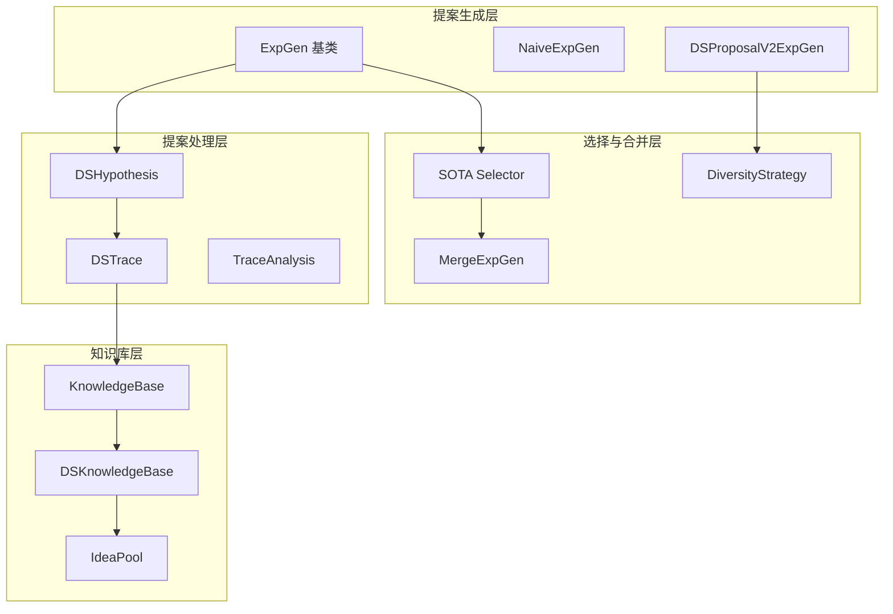
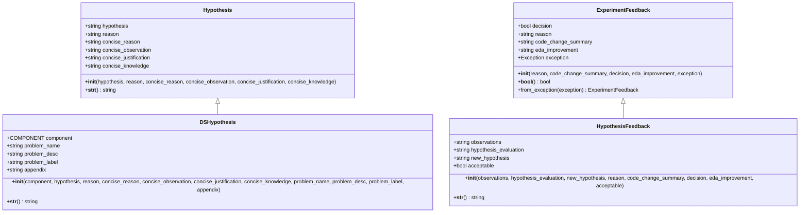
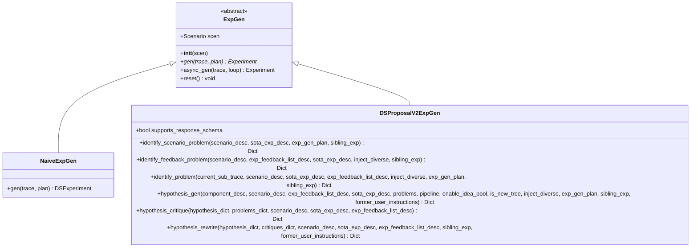
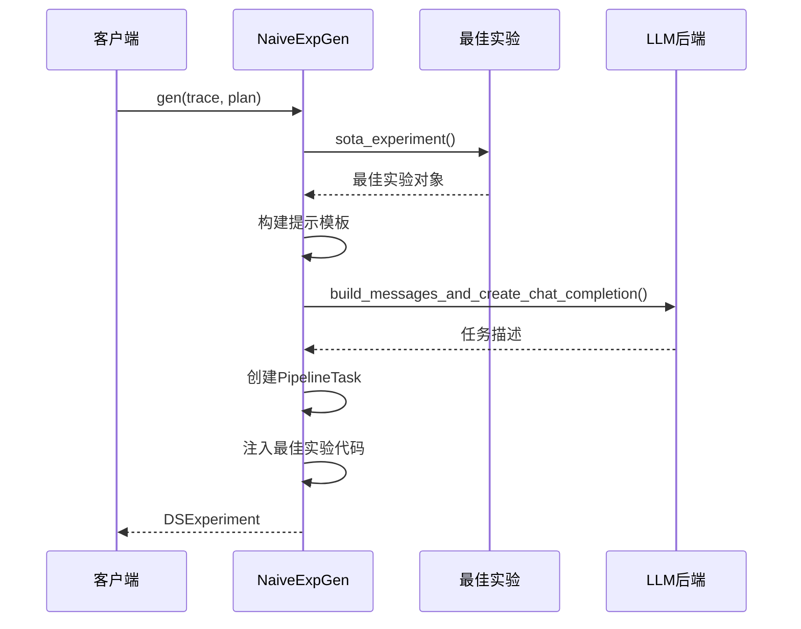
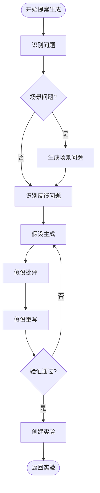
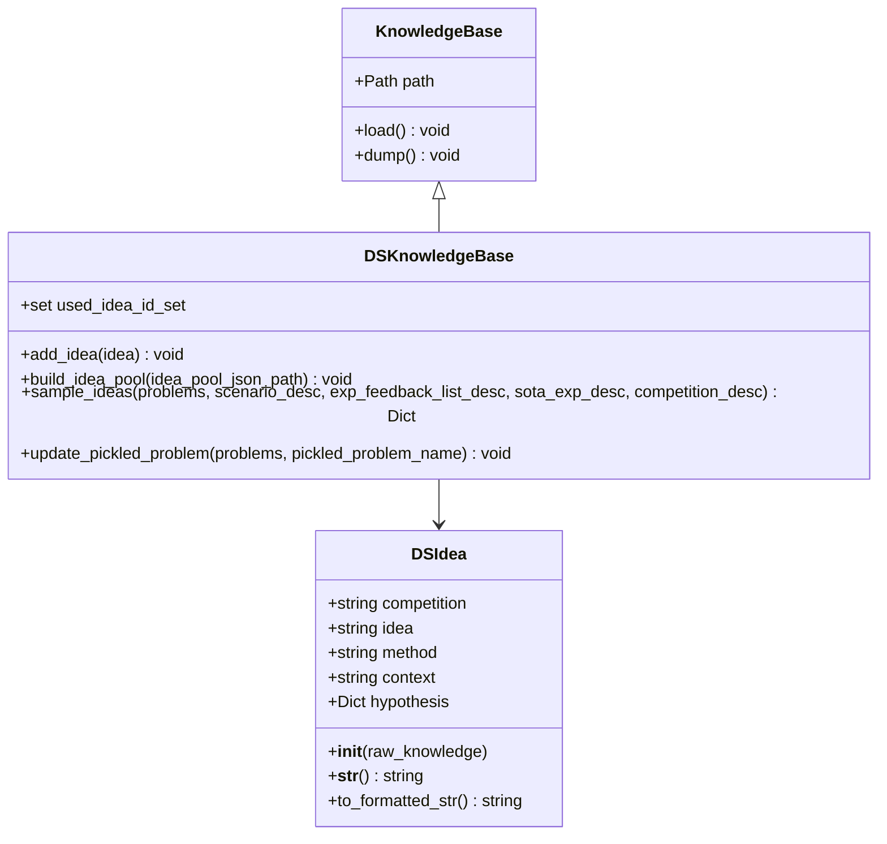
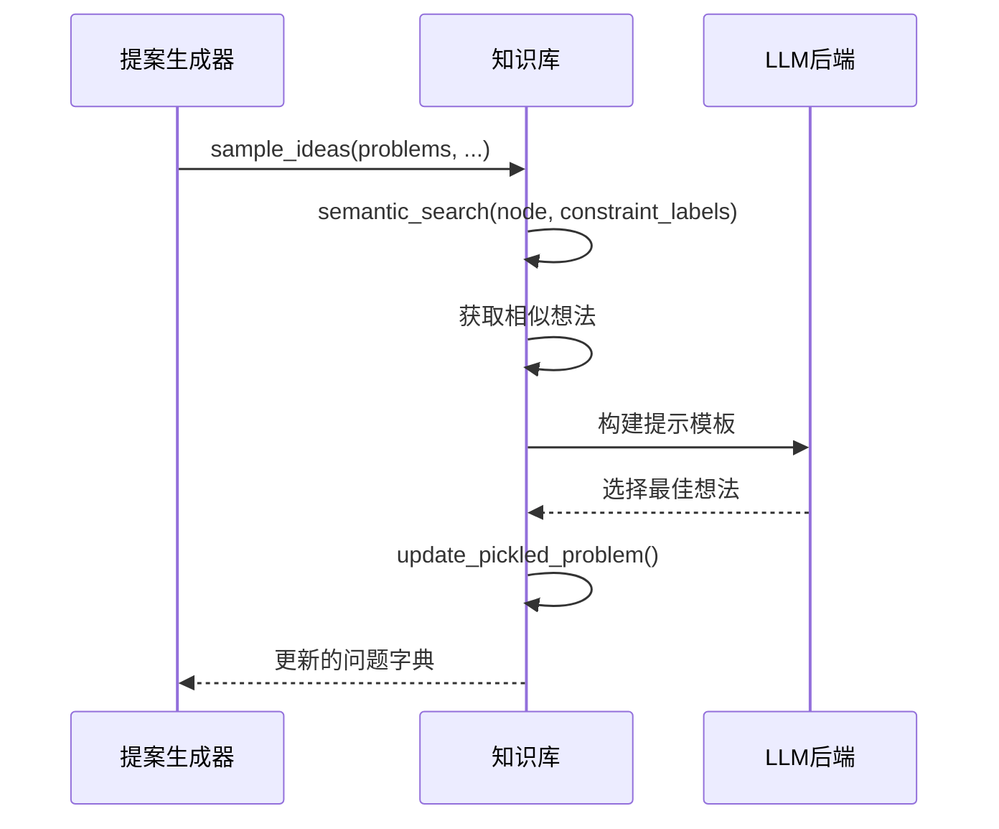
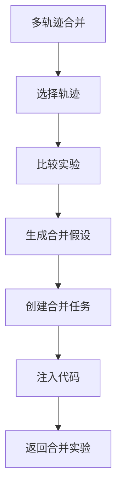
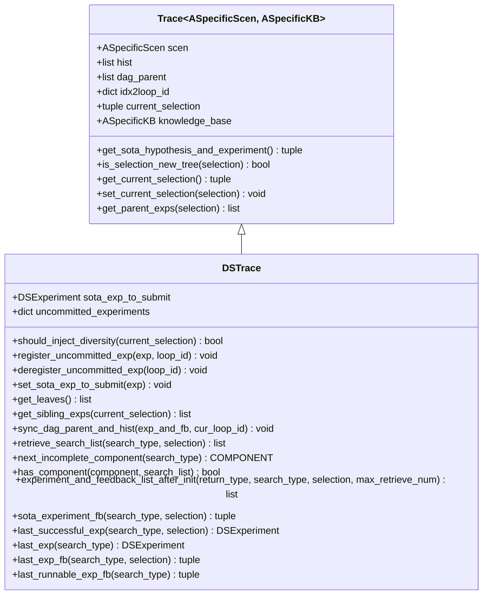
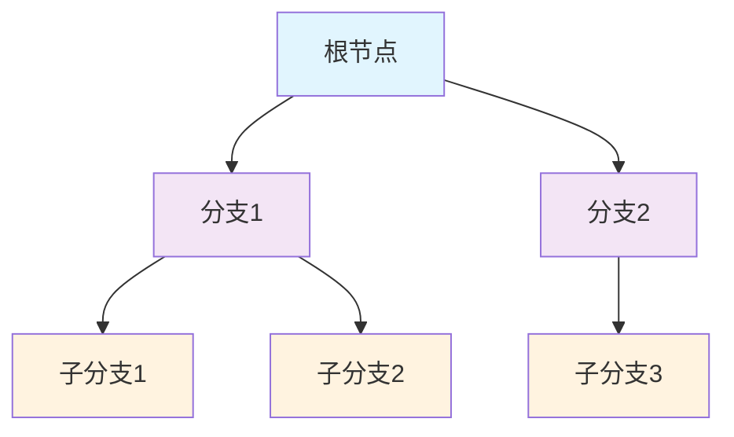

# Proposal API 文档

<cite>
**本文档引用的文件**
- [core/proposal.py](file://rdagent/core/proposal.py)
- [scenarios/data_science/proposal/exp_gen/base.py](file://rdagent/scenarios/data_science/proposal/exp_gen/base.py)
- [scenarios/data_science/proposal/exp_gen/naive.py](file://rdagent/scenarios/data_science/proposal/exp_gen/naive.py)
- [scenarios/data_science/proposal/exp_gen/diversity_strategy.py](file://rdagent/scenarios/data_science/proposal/exp_gen/diversity_strategy.py)
- [scenarios/data_science/proposal/exp_gen/idea_pool.py](file://rdagent/scenarios/data_science/proposal/exp_gen/idea_pool.py)
- [scenarios/data_science/proposal/exp_gen/proposal.py](file://rdagent/scenarios/data_science/proposal/exp_gen/proposal.py)
- [scenarios/data_science/proposal/exp_gen/select/submit.py](file://rdagent/scenarios/data_science/proposal/exp_gen/select/submit.py)
- [scenarios/data_science/proposal/exp_gen/utils.py](file://rdagent/scenarios/data_science/proposal/exp_gen/utils.py)
- [scenarios/data_science/proposal/exp_gen/merge.py](file://rdagent/scenarios/data_science/proposal/exp_gen/merge.py)
- [core/knowledge_base.py](file://rdagent/core/knowledge_base.py)
</cite>

## 目录
1. [简介](#简介)
2. [核心架构](#核心架构)
3. [Proposal 类详解](#proposal-类详解)
4. [BaseProposalModel 抽象类](#baseproposalmodel-抽象类)
5. [提案生成策略](#提案生成策略)
6. [知识库交互机制](#知识库交互机制)
7. [提案选择与合并](#提案选择与合并)
8. [多轮迭代演化](#多轮迭代演化)
9. [扩展指南](#扩展指南)
10. [最佳实践](#最佳实践)

## 简介

Proposal系统是RD-Agent框架的核心组件，负责生成、评估、选择和合并实验提案。该系统采用基于LLM的智能提案生成机制，支持多种策略组合，并通过知识库进行经验积累和传承。

### 主要特性

- **智能提案生成**：基于场景描述和历史反馈生成创新性实验方案
- **多样化策略**：支持naive、diversity等多种提案生成策略
- **知识库集成**：通过知识库存储和检索历史经验
- **多轮演化**：支持提案的迭代优化和合并
- **灵活选择**：提供多种实验选择策略

## 核心架构



**图表来源**
- [core/proposal.py](file://rdagent/core/proposal.py#L294-L333)
- [scenarios/data_science/proposal/exp_gen/base.py](file://rdagent/scenarios/data_science/proposal/exp_gen/base.py#L12-L51)
- [scenarios/data_science/proposal/exp_gen/idea_pool.py](file://rdagent/scenarios/data_science/proposal/exp_gen/idea_pool.py#L54-L86)

## Proposal 类详解

### Hypothesis 基础类

Hypothesis类是所有提案的基础抽象，包含提案的核心属性：



**图表来源**
- [core/proposal.py](file://rdagent/core/proposal.py#L18-L38)
- [scenarios/data_science/proposal/exp_gen/base.py](file://rdagent/scenarios/data_science/proposal/exp_gen/base.py#L12-L51)

### DSHypothesis 属性详解

| 属性名 | 类型 | 描述 | 必需 |
|--------|------|------|------|
| hypothesis | str | 提案的核心假设陈述 | 是 |
| reason | str | 提案生成的原因和背景 | 是 |
| concise_reason | str | 简洁版本的原因说明 | 否 |
| concise_observation | str | 简洁的观察结果 | 否 |
| concise_justification | str | 简洁的合理性说明 | 否 |
| concise_knowledge | str | 简洁的知识点总结 | 否 |
| component | COMPONENT | 关联的组件类型 | 是 |
| problem_name | str | 目标问题名称 | 否 |
| problem_desc | str | 问题描述 | 否 |
| problem_label | str | 问题标签（SCENARIO_PROBLEM/FEEDBACK_PROBLEM） | 否 |
| appendix | str | 附加信息 | 否 |

**章节来源**
- [scenarios/data_science/proposal/exp_gen/base.py](file://rdagent/scenarios/data_science/proposal/exp_gen/base.py#L12-L51)

## BaseProposalModel 抽象类

### ExpGen 基类

ExpGen是所有提案生成器的抽象基类，定义了提案生成的标准接口：



**图表来源**
- [core/proposal.py](file://rdagent/core/proposal.py#L294-L333)
- [scenarios/data_science/proposal/exp_gen/naive.py](file://rdagent/scenarios/data_science/proposal/exp_gen/naive.py#L13-L56)
- [scenarios/data_science/proposal/exp_gen/proposal.py](file://rdagent/scenarios/data_science/proposal/exp_gen/proposal.py#L519-L799)

### 实现要求

子类必须实现以下方法：

| 方法名 | 参数 | 返回值 | 描述 |
|--------|------|--------|------|
| gen | trace: Trace, plan: ExperimentPlan \| None | Experiment | 生成实验提案的主要方法 |
| async_gen | trace: Trace, loop: LoopBase | Experiment | 异步生成实验提案 |
| reset | 无 | void | 重置提案生成器状态 |

**章节来源**
- [core/proposal.py](file://rdagent/core/proposal.py#L294-L333)

## 提案生成策略

### Naive 策略

Naive策略是最基础的提案生成方式，直接基于当前最佳实验和场景描述生成新提案：



**图表来源**
- [scenarios/data_science/proposal/exp_gen/naive.py](file://rdagent/scenarios/data_science/proposal/exp_gen/naive.py#L13-L56)

### V2 策略（推荐）

V2策略采用更复杂的多阶段生成过程：



**图表来源**
- [scenarios/data_science/proposal/exp_gen/proposal.py](file://rdagent/scenarios/data_science/proposal/exp_gen/proposal.py#L519-L799)

### 多样性策略

系统支持多种多样性注入策略：

| 策略类 | 描述 | 触发条件 |
|--------|------|----------|
| AlwaysInjectStrategy | 总是注入多样性上下文 | 每次生成时 |
| InjectAtRootStrategy | 仅在创建新根节点时注入 | 新分支开始时 |
| InjectUntilSOTAGainedStrategy | 直到获得SOTA为止注入 | 当前分支未产生成功实验 |

**章节来源**
- [scenarios/data_science/proposal/exp_gen/diversity_strategy.py](file://rdagent/scenarios/data_science/proposal/exp_gen/diversity_strategy.py#L8-L68)

## 知识库交互机制

### DSKnowledgeBase 结构



**图表来源**
- [core/knowledge_base.py](file://rdagent/core/knowledge_base.py#L8-L27)
- [scenarios/data_science/proposal/exp_gen/idea_pool.py](file://rdagent/scenarios/data_science/proposal/exp_gen/idea_pool.py#L54-L185)

### 知识库使用流程



**图表来源**
- [scenarios/data_science/proposal/exp_gen/idea_pool.py](file://rdagent/scenarios/data_science/proposal/exp_gen/idea_pool.py#L125-L185)

**章节来源**
- [scenarios/data_science/proposal/exp_gen/idea_pool.py](file://rdagent/scenarios/data_science/proposal/exp_gen/idea_pool.py#L54-L185)

## 提案选择与合并

### SOTA 选择策略

系统提供多种SOTA实验选择策略：

| 策略类 | 特点 | 适用场景 |
|--------|------|----------|
| GlobalSOTASelector | 全局最优选择 | 简单场景，计算资源充足 |
| AutoSOTAexpSelector | LLM辅助选择 | 复杂场景，需要智能决策 |
| BestValidSelector | 基于性能排序 | 需要快速筛选候选实验 |
| ValidationSelector | 验证后选择 | 对结果准确性要求极高 |

### 合并机制



**图表来源**
- [scenarios/data_science/proposal/exp_gen/merge.py](file://rdagent/scenarios/data_science/proposal/exp_gen/merge.py#L18-L122)

**章节来源**
- [scenarios/data_science/proposal/exp_gen/select/submit.py](file://rdagent/scenarios/data_science/proposal/exp_gen/select/submit.py#L30-L200)
- [scenarios/data_science/proposal/exp_gen/merge.py](file://rdagent/scenarios/data_science/proposal/exp_gen/merge.py#L18-L447)

## 多轮迭代演化

### DSTrace 跟踪机制

DSTrace类管理提案的完整演化历史：



**图表来源**
- [core/proposal.py](file://rdagent/core/proposal.py#L88-L292)
- [scenarios/data_science/proposal/exp_gen/base.py](file://rdagent/scenarios/data_science/proposal/exp_gen/base.py#L54-L347)

### 演化路径管理



**章节来源**
- [scenarios/data_science/proposal/exp_gen/base.py](file://rdagent/scenarios/data_science/proposal/exp_gen/base.py#L54-L347)

## 扩展指南

### 自定义提案生成器

创建自定义提案生成器的步骤：

1. **继承 ExpGen 基类**
2. **实现 gen 方法**
3. **处理异常情况**
4. **集成知识库**

```python
# 示例：自定义提案生成器
class CustomExpGen(ExpGen):
    def gen(self, trace: DSTrace, plan: DSExperimentPlan | None = None) -> DSExperiment:
        # 实现自定义逻辑
        pass
```

### 添加新的多样性策略

```python
# 示例：自定义多样性策略
class CustomDiversityStrategy(DiversityContextStrategy):
    def should_inject(self, trace: DSTrace, local_selection: tuple[int, ...]) -> bool:
        # 实现自定义逻辑
        pass
```

### 集成新的知识库

```python
# 示例：自定义知识库
class CustomKnowledgeBase(KnowledgeBase):
    def add_custom_entry(self, entry: Any) -> None:
        # 实现自定义知识库操作
        pass
```

**章节来源**
- [core/proposal.py](file://rdagent/core/proposal.py#L294-L333)
- [scenarios/data_science/proposal/exp_gen/diversity_strategy.py](file://rdagent/scenarios/data_science/proposal/exp_gen/diversity_strategy.py#L8-L68)

## 最佳实践

### 提案质量优化

1. **明确问题定义**：确保每个提案都针对具体问题
2. **合理利用知识库**：充分利用历史经验和最佳实践
3. **多样性保证**：避免过度依赖单一策略
4. **渐进式改进**：从简单策略开始，逐步增加复杂度

### 性能优化建议

1. **缓存机制**：合理使用API调用缓存
2. **异步处理**：对于耗时操作使用异步模式
3. **资源管理**：控制并发数量和内存使用
4. **错误处理**：实现完善的异常处理机制

### 调试和监控

1. **日志记录**：详细记录提案生成过程
2. **指标跟踪**：监控提案质量和成功率
3. **可视化**：使用图表展示演化路径
4. **回滚机制**：提供失败时的恢复选项

### 集成注意事项

1. **配置管理**：合理设置各种参数阈值
2. **版本兼容**：确保向后兼容性
3. **测试覆盖**：编写充分的单元测试
4. **文档维护**：及时更新API文档

通过遵循这些最佳实践，可以最大化Proposal系统的效能，实现高质量的实验提案生成和优化。