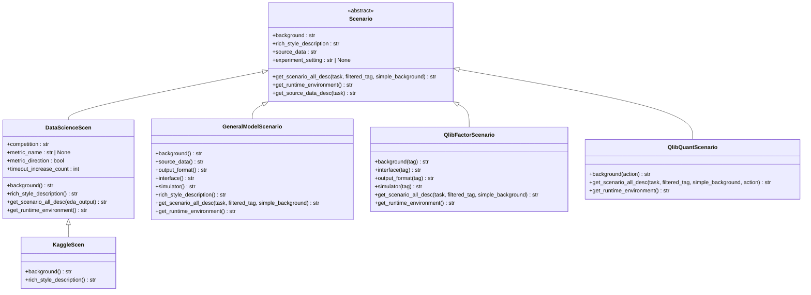

# Scenario API

<cite>
**本文档中引用的文件**  
- [scenario.py](file://rdagent/core/scenario.py)
- [DataScienceScen.py](file://rdagent/scenarios/data_science/scen/__init__.py)
- [GeneralModelScenario.py](file://rdagent/scenarios/general_model/scenario.py)
- [KaggleScen.py](file://rdagent/scenarios/data_science/scen/__init__.py)
- [QlibFactorScenario.py](file://rdagent/scenarios/qlib/experiment/factor_experiment.py)
- [QlibQuantScenario.py](file://rdagent/scenarios/qlib/experiment/quant_experiment.py)
</cite>

## 目录
1. [简介](#简介)
2. [核心契约接口](#核心契约接口)
3. [子类必须实现的核心方法](#子类必须实现的核心方法)
4. [调用时序](#调用时序)
5. [具体场景实现](#具体场景实现)
6. [场景注册与动态加载](#场景注册与动态加载)
7. [类继承关系图](#类继承关系图)

## 简介
Scenario抽象基类是RD-Agent框架中的核心组件，用于定义不同应用场景的契约接口。它为数据科学、量化金融等不同领域提供了统一的抽象层，通过继承机制实现定制化行为。该基类定义了场景相关的背景信息、数据描述、运行环境等核心属性，并通过工厂方法模式提供组件获取机制。

**Section sources**
- [scenario.py](file://rdagent/core/scenario.py#L5-L63)

## 核心契约接口
Scenario基类定义了多个工厂方法和属性，用于获取场景相关的组件和信息。

### get_scenario_classes()
此方法用于获取与当前场景关联的所有组件类。虽然在基类中未直接定义，但通过继承体系在具体场景中实现。

### get_coder()
获取与场景关联的代码生成器。在具体场景实现中，会根据场景特点返回相应的coder实例。

### get_runner()
获取与场景关联的执行器。不同场景可能需要不同的执行环境和策略。

### 核心属性规范
- **background**: 场景背景信息，必须由子类实现
- **rich_style_description**: 富文本风格的场景描述，必须由子类实现
- **get_scenario_all_desc()**: 获取场景的完整描述信息
- **get_runtime_environment()**: 获取运行时环境信息
- **source_data**: 数据源描述，通过get_source_data_desc()方法获取

**Section sources**
- [scenario.py](file://rdagent/core/scenario.py#L5-L63)

## 子类必须实现的核心方法
所有继承Scenario的子类必须实现以下抽象方法：

### background
```python
@property
@abstractmethod
def background(self) -> str:
    """背景信息"""
```
返回场景的背景描述信息，通常包含领域知识、问题定义等内容。

### rich_style_description
```python
@property
@abstractmethod
def rich_style_description(self) -> str:
    """富文本风格描述"""
```
返回用于展示的富文本风格场景描述。

### get_scenario_all_desc()
```python
@abstractmethod
def get_scenario_all_desc(
    self,
    task: Task | None = None,
    filtered_tag: str | None = None,
    simple_background: bool | None = None,
) -> str:
    """
    组合所有描述信息
    场景描述根据执行的任务而变化。
    """
```
组合所有描述信息，生成完整的场景描述。

### get_runtime_environment()
```python
@abstractmethod
def get_runtime_environment(self) -> str:
    """
    获取运行时环境信息
    """
```
返回场景的运行时环境信息，包括依赖库、硬件要求等。

**Section sources**
- [scenario.py](file://rdagent/core/scenario.py#L5-L63)

## 调用时序
Scenario类的调用时序遵循以下流程：

1. 实例化场景对象
2. 获取背景信息（background）
3. 获取运行时环境（get_runtime_environment）
4. 获取数据描述（get_source_data_desc）
5. 生成完整场景描述（get_scenario_all_desc）

在具体应用中，这些方法会被框架的不同组件按需调用，以获取场景相关信息。

**Section sources**
- [scenario.py](file://rdagent/core/scenario.py#L5-L63)

## 具体场景实现
### 数据科学场景（DataScienceScen）
数据科学场景通过继承Scenario实现，针对Kaggle等数据科学竞赛进行优化。

```python
class DataScienceScen(Scenario):
    """数据科学场景"""
    
    def __init__(self, competition: str) -> None:
        # 初始化竞赛相关信息
        self.competition = competition
        # 分析竞赛描述
        self._analysis_competition_description()
    
    @property
    def background(self) -> str:
        # 基于竞赛信息生成背景描述
        return background_prompt
    
    @property
    def rich_style_description(self) -> str:
        # 返回富文本描述
        return T(".prompts:rich_style_description").r(
            name="数据科学",
            competition=self.competition,
        )
```

### 量化金融场景
量化金融场景包括因子场景和量化场景，分别处理因子开发和量化策略。

```python
class QlibFactorScenario(Scenario):
    """Qlib因子场景"""
    
    def get_scenario_all_desc(self) -> str:
        # 包含因子开发相关的描述信息
        return f"""背景:
{self.background}
可使用的源数据:
{self.get_source_data_desc()}
代码接口:
{self.interface}
输出格式:
{self.output_format}
模拟器:
{self.simulator}
"""

class QlibQuantScenario(Scenario):
    """Qlib量化场景"""
    
    def __init__(self) -> None:
        super().__init__()
        # 初始化量化场景特定信息
        self._source_data = deepcopy(get_data_folder_intro())
```

**Section sources**
- [DataScienceScen.py](file://rdagent/scenarios/data_science/scen/__init__.py#L1-L289)
- [QlibFactorScenario.py](file://rdagent/scenarios/qlib/experiment/factor_experiment.py#L33-L89)
- [QlibQuantScenario.py](file://rdagent/scenarios/qlib/experiment/quant_experiment.py#L33-L58)

## 场景注册与动态加载
场景的注册和动态加载通过继承体系和配置文件实现。

### 注册机制
场景通过继承Scenario基类自动注册到框架中。具体场景在初始化时会加载相应的配置和模板。

### 动态加载原理
1. 通过import_class动态导入场景类
2. 根据配置文件中的设置实例化具体场景
3. 加载场景相关的提示模板和配置

```python
# 示例：动态加载场景
from rdagent.utils import import_class

# 从配置中获取场景类名
scenario_class_name = PROP_SETTING.scenario_class
# 动态导入并实例化
scenario = import_class(scenario_class_name)()
```

场景相关的提示模板通过T(".prompts:xxx")方式加载，支持从不同位置查找模板文件。

**Section sources**
- [scenario.py](file://rdagent/core/scenario.py#L5-L63)
- [DataScienceScen.py](file://rdagent/scenarios/data_science/scen/__init__.py#L1-L289)

## 类继承关系图


**Diagram sources**
- [scenario.py](file://rdagent/core/scenario.py#L5-L63)
- [DataScienceScen.py](file://rdagent/scenarios/data_science/scen/__init__.py#L1-L289)
- [GeneralModelScenario.py](file://rdagent/scenarios/general_model/scenario.py#L1-L55)
- [QlibFactorScenario.py](file://rdagent/scenarios/qlib/experiment/factor_experiment.py#L33-L89)
- [QlibQuantScenario.py](file://rdagent/scenarios/qlib/experiment/quant_experiment.py#L33-L58)