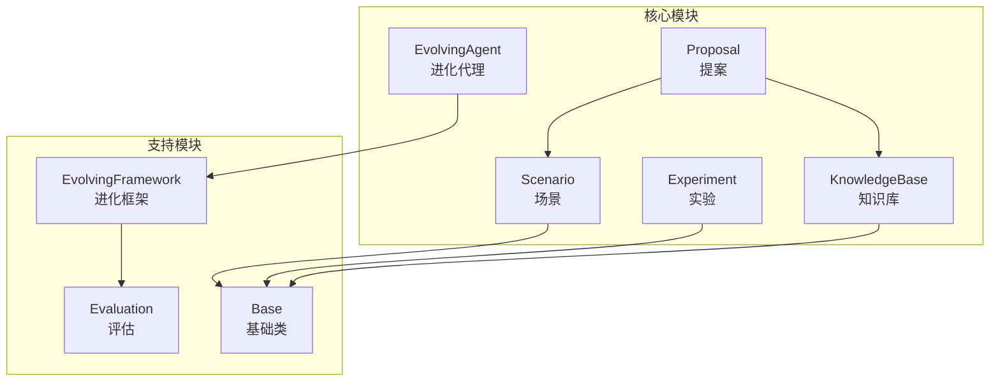
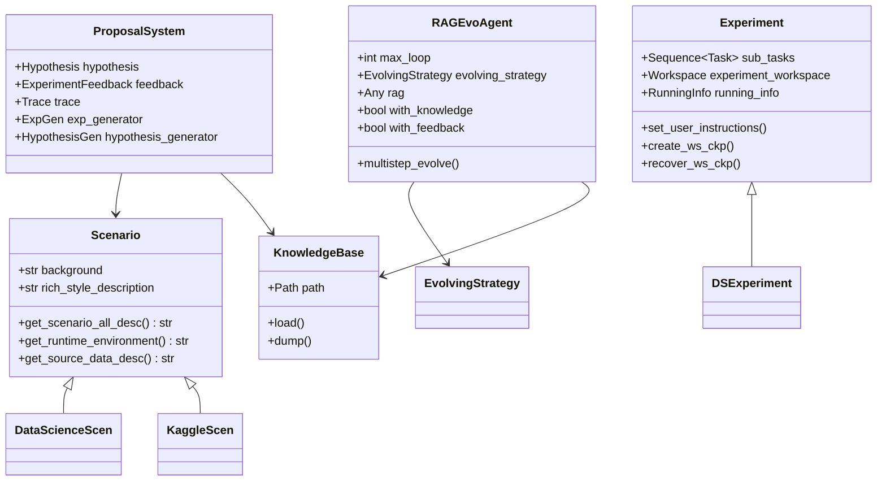
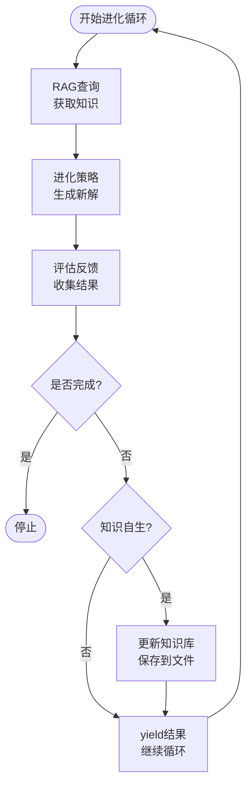
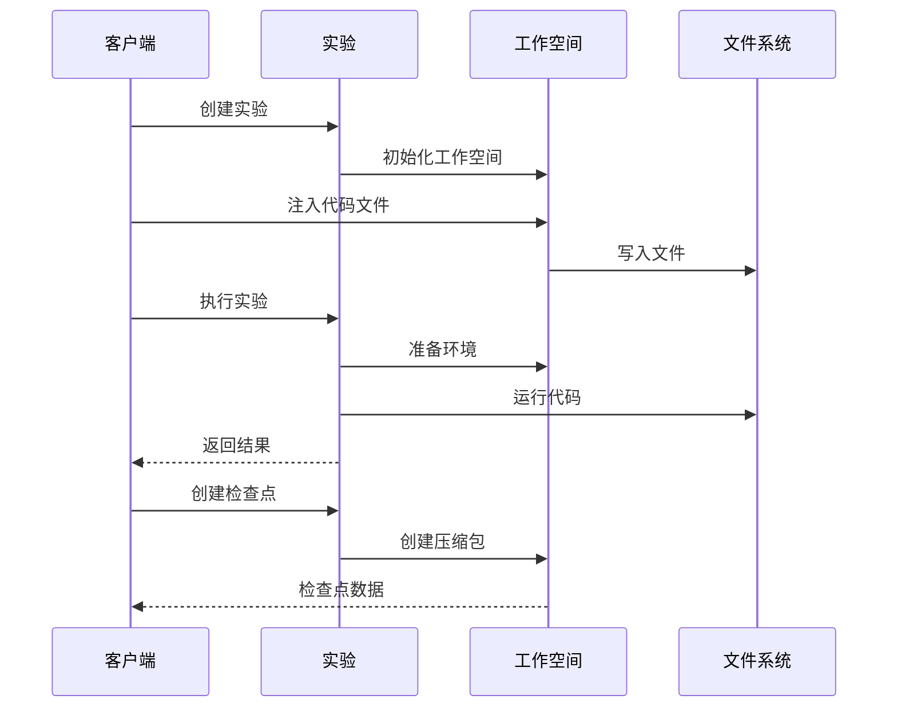
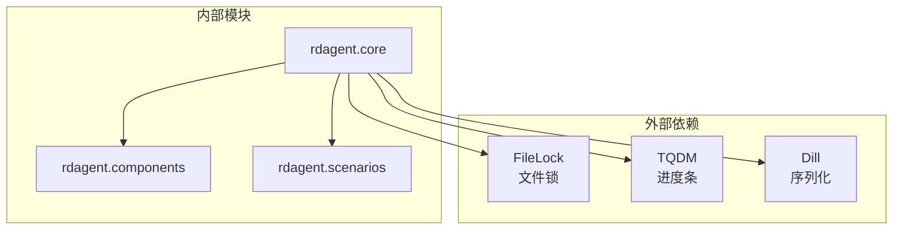

# 核心模块API参考文档

<cite>
**本文档中引用的文件**
- [evolving_agent.py](file://rdagent/core/evolving_agent.py)
- [scenario.py](file://rdagent/core/scenario.py)
- [experiment.py](file://rdagent/core/experiment.py)
- [proposal.py](file://rdagent/core/proposal.py)
- [knowledge_base.py](file://rdagent/core/knowledge_base.py)
- [evolving_framework.py](file://rdagent/core/evolving_framework.py)
- [evaluation.py](file://rdagent/core/evaluation.py)
- [scen/__init__.py](file://rdagent/scenarios/data_science/scen/__init__.py)
- [experiment.py](file://rdagent/scenarios/data_science/experiment/experiment.py)
</cite>

## 目录
1. [简介](#简介)
2. [项目结构](#项目结构)
3. [核心组件](#核心组件)
4. [架构概览](#架构概览)
5. [详细组件分析](#详细组件分析)
6. [依赖关系分析](#依赖关系分析)
7. [性能考虑](#性能考虑)
8. [故障排除指南](#故障排除指南)
9. [结论](#结论)

## 简介

rdagent.core模块是RD-Agent框架的核心基础模块，提供了智能代理系统的基础架构。该模块包含五个关键组件：EvolvingAgent（进化代理）、Scenario（场景）、Experiment（实验）、Proposal（提案）和KnowledgeBase（知识库）。这些组件协同工作，为自动化科学计算任务提供了完整的解决方案框架。

## 项目结构

**图表来源**
- [evolving_agent.py](file://rdagent/core/evolving_agent.py#L1-L116)
- [scenario.py](file://rdagent/core/scenario.py#L1-L65)
- [experiment.py](file://rdagent/core/experiment.py#L1-L483)
- [proposal.py](file://rdagent/core/proposal.py#L1-L390)
- [knowledge_base.py](file://rdagent/core/knowledge_base.py#L1-L28)

## 核心组件

### EvolvingAgent类

EvolvingAgent是系统的核心代理类，负责执行迭代进化过程。它采用泛型设计，支持不同类型的具体实现。

#### 构造函数参数

| 参数名 | 类型 | 默认值 | 描述 |
|--------|------|--------|------|
| `max_loop` | `int` | 必需 | 最大进化循环次数 |
| `evolving_strategy` | `EvolvingStrategy` | 必需 | 进化策略实例 |

#### multistep_evolve方法

**签名**: `multistep_evolve(self, evo: ASpecificEvolvableSubjects, eva: ASpecificEvaluator \| Feedback) -> Generator[ASpecificEvolvableSubjects, None, None]`

**功能**: 执行多步骤进化过程，返回生成器对象用于进程控制和日志记录。

**参数**:
- `evo`: 可进化的主体对象
- `eva`: 评估器或反馈对象

**返回值**: 生成器，yield不同阶段的进化主体对象

**异常**: 无特定异常抛出，但可能因底层实现而抛出

**调用示例路径**: [evolving_agent.py](file://rdagent/core/evolving_agent.py#L25-L35)

### Scenario抽象基类

Scenario定义了任务场景的基本接口，为不同类型的科学计算任务提供统一的描述框架。

#### 属性和方法

| 方法/属性 | 返回类型 | 描述 |
|-----------|----------|------|
| `background` | `str` | 场景背景信息 |
| `get_source_data_desc` | `str` | 数据源描述 |
| `source_data` | `str` | 数据源便捷访问属性 |
| `rich_style_description` | `str` | 富文本风格描述 |
| `get_scenario_all_desc` | `str` | 完整场景描述 |
| `get_runtime_environment` | `str` | 运行时环境信息 |
| `experiment_setting` | `str \| None` | 实验设置 |

**调用示例路径**: [scenario.py](file://rdagent/core/scenario.py#L5-L64)

### Experiment类

Experiment类管理实验的完整生命周期，包括任务组织、工作空间管理和结果跟踪。

#### 构造函数参数

| 参数名 | 类型 | 默认值 | 描述 |
|--------|------|--------|------|
| `sub_tasks` | `Sequence[ASpecificTask]` | 必需 | 子任务列表 |
| `based_experiments` | `Sequence[ASpecificWSForExperiment]` | `[]` | 基础实验列表 |
| `hypothesis` | `Hypothesis \| None` | `None` | 实验假设 |

#### 状态管理方法

| 方法名 | 功能描述 |
|--------|----------|
| `set_user_instructions` | 设置用户指令 |
| `create_ws_ckp` | 创建工作空间检查点 |
| `recover_ws_ckp` | 恢复工作空间检查点 |

**调用示例路径**: [experiment.py](file://rdagent/core/experiment.py#L350-L482)

### Proposal系统

Proposal系统提供了从概念到实现的完整转换框架，包含多个专门的组件。

#### Hypothesis类

**构造函数参数**:

| 参数名 | 类型 | 描述 |
|--------|------|------|
| `hypothesis` | `str` | 假设内容 |
| `reason` | `str` | 原因说明 |
| `concise_reason` | `str` | 简洁原因 |
| `concise_observation` | `str` | 简洁观察 |
| `concise_justification` | `str` | 简洁论证 |
| `concise_knowledge` | `str` | 简洁知识 |

**调用示例路径**: [proposal.py](file://rdagent/core/proposal.py#L18-L35)

#### Trace类

Trace类维护实验的历史轨迹，支持复杂的父子关系管理。

**核心功能**:
- 历史记录管理
- DAG结构支持
- 父子关系追踪
- 当前选择状态管理

**调用示例路径**: [proposal.py](file://rdagent/core/proposal.py#L110-L200)

### KnowledgeBase知识库

KnowledgeBase提供了简单而有效的知识存储和检索机制。

#### 核心方法

| 方法名 | 功能描述 |
|--------|----------|
| `load` | 从文件加载知识 |
| `dump` | 将知识保存到文件 |

**调用示例路径**: [knowledge_base.py](file://rdagent/core/knowledge_base.py#L8-L27)

## 架构概览

**图表来源**
- [scenario.py](file://rdagent/core/scenario.py#L5-L64)
- [experiment.py](file://rdagent/core/experiment.py#L350-L482)
- [evolving_agent.py](file://rdagent/core/evolving_agent.py#L45-L116)
- [proposal.py](file://rdagent/core/proposal.py#L110-L200)

## 详细组件分析

### EvolvingAgent详细分析

RAGEvoAgent是EvolutionAgent的具体实现，提供了完整的进化代理功能。

#### 关键特性

1. **RAG集成**: 支持检索增强生成（Retrieval-Augmented Generation）
2. **知识自我演化**: 支持知识库的自动更新
3. **文件锁支持**: 多进程安全的知识库操作
4. **进度跟踪**: 使用tqdm进行进度显示

#### 执行流程

**图表来源**
- [evolving_agent.py](file://rdagent/core/evolving_agent.py#L60-L116)

**节来源**
- [evolving_agent.py](file://rdagent/core/evolving_agent.py#L45-L116)

### Scenario子类实现要求

#### DataScienceScen实现

DataScienceScen提供了数据科学竞赛场景的具体实现。

##### 核心功能

| 功能模块 | 描述 |
|----------|------|
| 数据准备 | 自动下载和预处理竞赛数据 |
| 任务分析 | 分析竞赛描述和数据特征 |
| 超时管理 | 动态调整编码和运行超时 |
| 环境检测 | 验证运行时环境配置 |

##### 关键方法实现

- `_get_description()`: 获取竞赛描述信息
- `_analysis_competition_description()`: 分析竞赛特征
- `real_full_timeout()`: 计算实际运行超时
- `increase_timeout()`: 增加超时倍数

**节来源**
- [scen/__init__.py](file://rdagent/scenarios/data_science/scen/__init__.py#L20-L289)

### Experiment生命周期管理

#### 工作空间管理

Experiment类通过Workspace接口管理实验的工作空间，支持以下功能：

1. **检查点创建**: `create_ws_ckp()`
2. **状态恢复**: `recover_ws_ckp()`
3. **代码注入**: 动态添加或修改代码文件
4. **环境准备**: 准备实验所需的运行环境

#### 并发控制

**图表来源**
- [experiment.py](file://rdagent/core/experiment.py#L200-L350)

**节来源**
- [experiment.py](file://rdagent/core/experiment.py#L350-L482)

### Proposal系统组件

#### ExpGen生成器

ExpGen是提案生成的核心组件，支持同步和异步两种生成模式。

##### 同步生成

**方法签名**: `gen(self, trace: Trace, plan: ExperimentPlan \| None = None) -> Experiment`

##### 异步生成

**方法签名**: `async_gen(self, trace: Trace, loop: LoopBase) -> Experiment`

**并发控制**: 支持最大并行度限制，当未完成循环数量超过限制时会等待。

**节来源**
- [proposal.py](file://rdagent/core/proposal.py#L320-L365)

#### 知识库扩展

KnowledgeBase支持多种扩展实现：

1. **向量知识库**: 基于嵌入向量的相似性检索
2. **图知识库**: 基于图结构的关系推理
3. **混合知识库**: 结合多种知识表示方式

**节来源**
- [knowledge_base.py](file://rdagent/core/knowledge_base.py#L1-L28)

## 依赖关系分析

**图表来源**
- [evolving_agent.py](file://rdagent/core/evolving_agent.py#L1-L10)
- [knowledge_base.py](file://rdagent/core/knowledge_base.py#L1-L5)

### 组件耦合分析

| 组件对 | 耦合类型 | 说明 |
|--------|----------|------|
| EvolvingAgent ↔ Scenario | 弱耦合 | 通过接口交互 |
| Experiment ↔ Workspace | 强耦合 | 生命周期紧密绑定 |
| Proposal ↔ KnowledgeBase | 中等耦合 | 知识共享和检索 |
| Scenario ↔ DataScienceScen | 继承耦合 | 特化实现 |

**节来源**
- [evolving_agent.py](file://rdagent/core/evolving_agent.py#L1-L116)
- [experiment.py](file://rdagent/core/experiment.py#L1-L483)

## 性能考虑

### 线程安全性

1. **文件锁支持**: RAGEvoAgent支持`enable_filelock`参数，在多进程环境中使用文件锁保护知识库
2. **知识库并发**: 通过`load_dumped_knowledge_base`和`dump_knowledge_base`方法支持并发访问
3. **异步支持**: Proposal系统提供异步生成接口，支持高并发处理

### 内存优化

1. **检查点机制**: Workspace提供内存检查点功能，避免大文件占用过多内存
2. **懒加载**: KnowledgeBase支持延迟加载，只在需要时读取数据
3. **流式处理**: 支持大型数据集的流式处理，减少内存峰值

### 性能监控

1. **进度跟踪**: 使用TQDM显示进化进度
2. **时间统计**: Experiment类包含运行时间统计
3. **资源监控**: 支持超时控制和资源限制

## 故障排除指南

### 常见问题及解决方案

#### 知识库加载失败

**症状**: KnowledgeBase初始化时无法加载数据
**原因**: 文件路径不存在或权限不足
**解决方案**: 
- 检查文件路径是否存在
- 确认文件读写权限
- 验证pickle文件格式正确性

#### 进化循环卡死

**症状**: RAGEvoAgent在进化过程中停止响应
**原因**: 可能是评估器返回无效反馈或进化策略死循环
**解决方案**:
- 检查评估器实现
- 验证进化策略逻辑
- 设置合理的max_loop值

#### 并发冲突

**症状**: 多进程环境下知识库损坏
**原因**: 缺少适当的并发控制
**解决方案**:
- 启用`enable_filelock`参数
- 正确设置`filelock_path`
- 实现适当的重试机制

**节来源**
- [evolving_agent.py](file://rdagent/core/evolving_agent.py#L95-L116)
- [knowledge_base.py](file://rdagent/core/knowledge_base.py#L15-L27)

## 结论

rdagent.core模块提供了一个强大而灵活的框架，用于构建智能科学计算代理系统。通过EvolvingAgent的进化能力、Scenario的场景抽象、Experiment的生命周期管理、Proposal的智能生成和KnowledgeBase的知识存储，该模块为自动化科学计算任务提供了完整的解决方案。

### 主要优势

1. **模块化设计**: 各组件职责清晰，易于扩展和维护
2. **泛型支持**: 提供类型安全的泛型接口
3. **并发友好**: 支持多进程和异步操作
4. **可扩展性**: 易于添加新的场景、实验类型和知识表示

### 最佳实践建议

1. **合理设置超时**: 根据任务复杂度设置合适的max_loop值
2. **实现检查点**: 在长时间运行的任务中定期创建检查点
3. **并发控制**: 在多进程环境中启用文件锁保护
4. **错误处理**: 实现完善的异常处理和恢复机制

该模块为RD-Agent框架奠定了坚实的基础，支持从简单的数据分析到复杂的机器学习模型开发等各种科学计算任务。