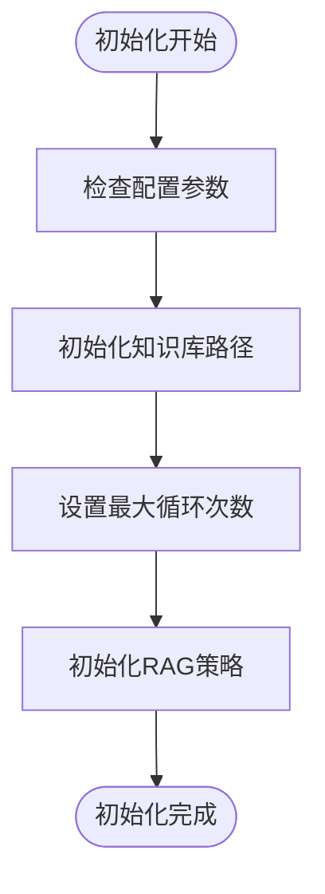
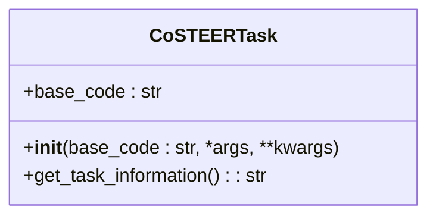
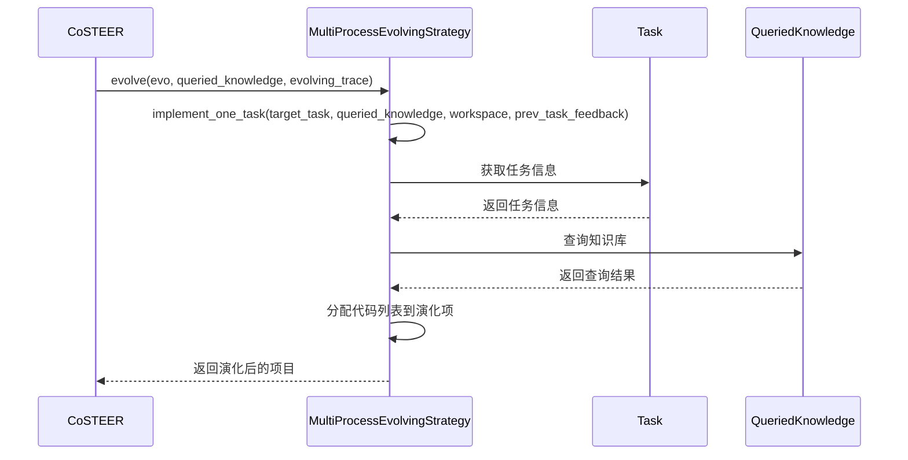
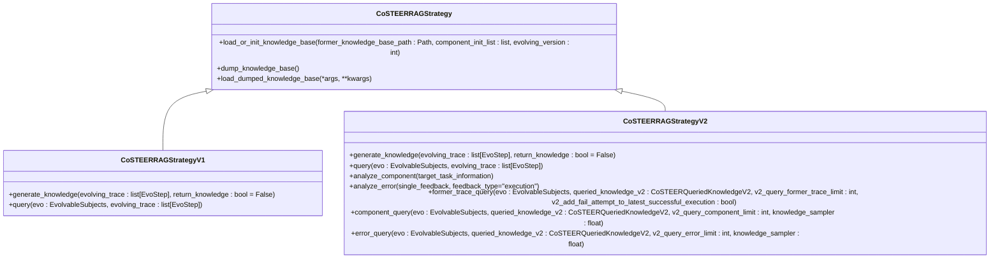
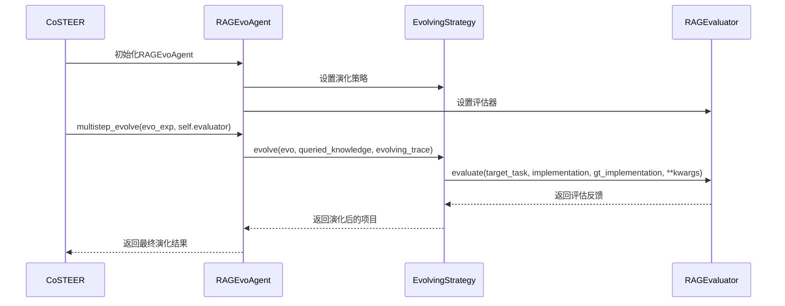
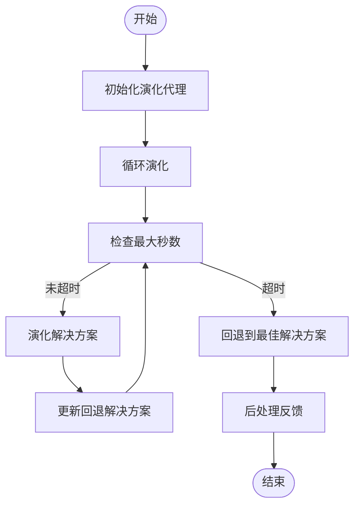

# CoSTEER框架API

<cite>
**本文档引用的文件**
- [__init__.py](file://rdagent/components/coder/CoSTEER/__init__.py)
- [task.py](file://rdagent/components/coder/CoSTEER/task.py)
- [evolving_strategy.py](file://rdagent/components/coder/CoSTEER/evolving_strategy.py)
- [knowledge_management.py](file://rdagent/components/coder/CoSTEER/knowledge_management.py)
- [config.py](file://rdagent/components/coder/CoSTEER/config.py)
- [evaluators.py](file://rdagent/components/coder/CoSTEER/evaluators.py)
- [evolvable_subjects.py](file://rdagent/components/coder/CoSTEER/evolvable_subjects.py)
- [prompts.yaml](file://rdagent/components/coder/CoSTEER/prompts.yaml)
- [ds_costeer.py](file://rdagent/components/coder/data_science/share/ds_costeer.py)
- [model_coder/__init__.py](file://rdagent/components/coder/model_coder/__init__.py)
- [factor_coder/__init__.py](file://rdagent/components/coder/factor_coder/__init__.py)
</cite>

## 目录
1. [简介](#简介)
2. [核心组件](#核心组件)
3. [初始化流程](#初始化流程)
4. [任务建模机制](#任务建模机制)
5. [演化策略实现](#演化策略实现)
6. [知识管理模块](#知识管理模块)
7. [配置文件参数](#配置文件参数)
8. [实际调用示例](#实际调用示例)
9. [与EvolvingAgent的协作关系](#与evolvingagent的协作关系)
10. [生命周期管理](#生命周期管理)

## 简介
CoSTEER是一个代码生成与进化框架，旨在通过迭代优化和知识积累来提升代码生成的质量。该框架通过结合任务建模、演化策略和知识管理等机制，实现了对复杂编程任务的自动化处理。本文档详细说明了CoSTEER框架的公共接口，包括其核心类`CoSTEER`的初始化流程、任务建模机制、演化策略实现以及知识管理模块的功能。

## 核心组件
CoSTEER框架的核心组件包括`CoSTEER`类、任务建模机制、演化策略和知识管理模块。这些组件共同协作，实现了从任务定义到代码生成的完整流程。

**Section sources**
- [__init__.py](file://rdagent/components/coder/CoSTEER/__init__.py#L1-L176)
- [task.py](file://rdagent/components/coder/CoSTEER/task.py#L1-L10)
- [evolving_strategy.py](file://rdagent/components/coder/CoSTEER/evolving_strategy.py#L1-L134)

## 初始化流程
`CoSTEER`类的初始化流程涉及多个关键参数的设置，包括配置、评估器、演化策略等。初始化过程中，`CoSTEER`会根据提供的参数创建相应的实例，并设置必要的属性。



**Diagram sources**
- [__init__.py](file://rdagent/components/coder/CoSTEER/__init__.py#L15-L50)

**Section sources**
- [__init__.py](file://rdagent/components/coder/CoSTEER/__init__.py#L15-L50)

## 任务建模机制
CoSTEER框架通过`CoSTEERTask`类来建模任务。每个任务包含任务信息和基础代码，框架通过这些信息来指导代码生成过程。



**Diagram sources**
- [task.py](file://rdagent/components/coder/CoSTEER/task.py#L1-L10)

**Section sources**
- [task.py](file://rdagent/components/coder/CoSTEER/task.py#L1-L10)

## 演化策略实现
CoSTEER框架的演化策略由`MultiProcessEvolvingStrategy`类实现。该策略通过多进程并行处理任务，提高了代码生成的效率。



**Diagram sources**
- [evolving_strategy.py](file://rdagent/components/coder/CoSTEER/evolving_strategy.py#L1-L134)

**Section sources**
- [evolving_strategy.py](file://rdagent/components/coder/CoSTEER/evolving_strategy.py#L1-L134)

## 知识管理模块
CoSTEER框架的知识管理模块通过`CoSTEERRAGStrategyV1`和`CoSTEERRAGStrategyV2`类实现。这些类负责加载、生成和查询知识库，支持跨实验的知识积累与复用。



**Diagram sources**
- [knowledge_management.py](file://rdagent/components/coder/CoSTEER/knowledge_management.py#L1-L799)

**Section sources**
- [knowledge_management.py](file://rdagent/components/coder/CoSTEER/knowledge_management.py#L1-L799)

## 配置文件参数
CoSTEER框架的配置文件`config.py`中定义了多个关键参数，这些参数控制着框架的行为和性能。

| 参数名 | 类型 | 默认值 | 描述 |
| --- | --- | --- | --- |
| coder_use_cache | bool | False | 是否使用缓存 |
| max_loop | int | 10 | 最大任务实现循环次数 |
| fail_task_trial_limit | int | 20 | 失败任务尝试限制 |
| v1_query_former_trace_limit | int | 3 | V1查询前序轨迹限制 |
| v1_query_similar_success_limit | int | 3 | V1查询相似成功限制 |
| v2_query_component_limit | int | 1 | V2查询组件限制 |
| v2_query_error_limit | int | 1 | V2查询错误限制 |
| v2_query_former_trace_limit | int | 3 | V2查询前序轨迹限制 |
| v2_add_fail_attempt_to_latest_successful_execution | bool | False | 是否将失败尝试添加到最新成功执行中 |
| v2_error_summary | bool | False | 是否启用错误摘要 |
| v2_knowledge_sampler | float | 1.0 | 知识采样率 |
| knowledge_base_path | Union[str, None] | None | 知识库路径 |
| new_knowledge_base_path | Union[str, None] | None | 新知识库路径 |
| enable_filelock | bool | False | 是否启用文件锁 |
| filelock_path | Union[str, None] | None | 文件锁路径 |
| max_seconds_multiplier | int | 10^6 | 最大秒数乘数 |

**Section sources**
- [config.py](file://rdagent/components/coder/CoSTEER/config.py#L1-L42)

## 实际调用示例
以下是一个实际调用CoSTEER框架的示例，展示了如何定义演化任务、配置提示模板并集成到Scenario中执行。

```python
from rdagent.components.coder.CoSTEER import CoSTEER
from rdagent.components.coder.CoSTEER.config import CoSTEER_SETTINGS
from rdagent.components.coder.model_coder.evaluators import ModelCoSTEEREvaluator
from rdagent.components.coder.model_coder.evolving_strategy import ModelMultiProcessEvolvingStrategy
from rdagent.core.scenario import Scenario

class ModelCoSTEER(CoSTEER):
    def __init__(
        self,
        scen: Scenario,
        *args,
        **kwargs,
    ) -> None:
        eva = CoSTEERMultiEvaluator(ModelCoSTEEREvaluator(scen=scen), scen=scen)
        es = ModelMultiProcessEvolvingStrategy(scen=scen, settings=CoSTEER_SETTINGS)

        super().__init__(*args, settings=CoSTEER_SETTINGS, eva=eva, es=es, evolving_version=2, scen=scen, **kwargs)
```

**Section sources**
- [model_coder/__init__.py](file://rdagent/components/coder/model_coder/__init__.py#L1-L20)

## 与EvolvingAgent的协作关系
CoSTEER框架与`EvolvingAgent`紧密协作，通过`RAGEvoAgent`类实现多步演化。`EvolvingAgent`负责管理演化过程中的反馈和知识，确保每次迭代都能基于最新的信息进行优化。



**Diagram sources**
- [__init__.py](file://rdagent/components/coder/CoSTEER/__init__.py#L1-L176)
- [evolving_strategy.py](file://rdagent/components/coder/CoSTEER/evolving_strategy.py#L1-L134)

**Section sources**
- [__init__.py](file://rdagent/components/coder/CoSTEER/__init__.py#L1-L176)
- [evolving_strategy.py](file://rdagent/components/coder/CoSTEER/evolving_strategy.py#L1-L134)

## 生命周期管理
CoSTEER框架的生命周期管理涉及从任务初始化到最终代码生成的全过程。框架通过`develop`方法管理整个演化过程，确保在达到最大循环次数或时间限制时停止演化。



**Diagram sources**
- [__init__.py](file://rdagent/components/coder/CoSTEER/__init__.py#L52-L176)

**Section sources**
- [__init__.py](file://rdagent/components/coder/CoSTEER/__init__.py#L52-L176)