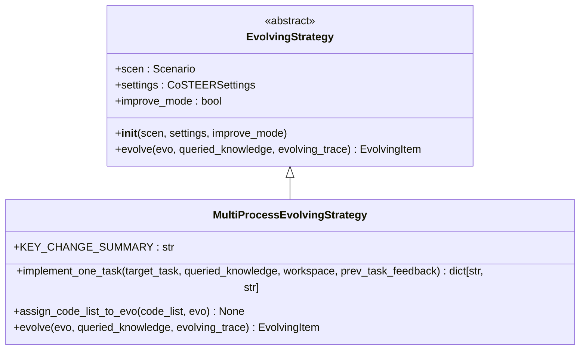
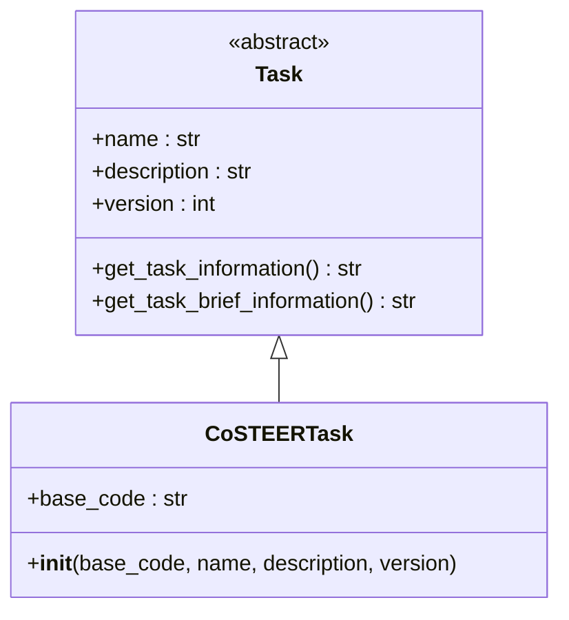
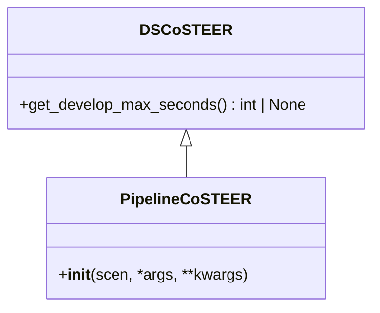
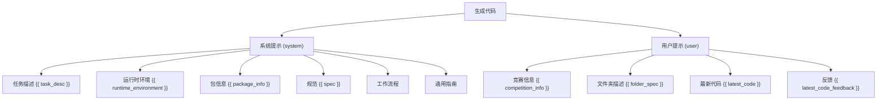
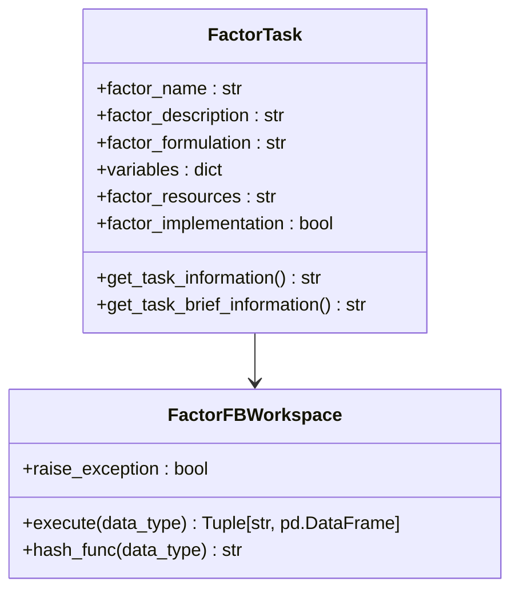
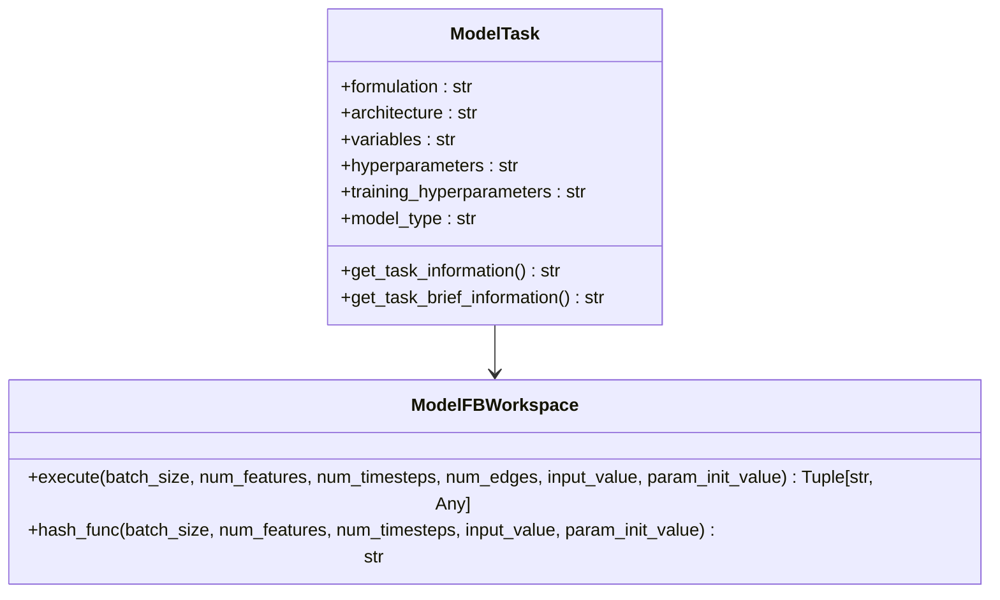
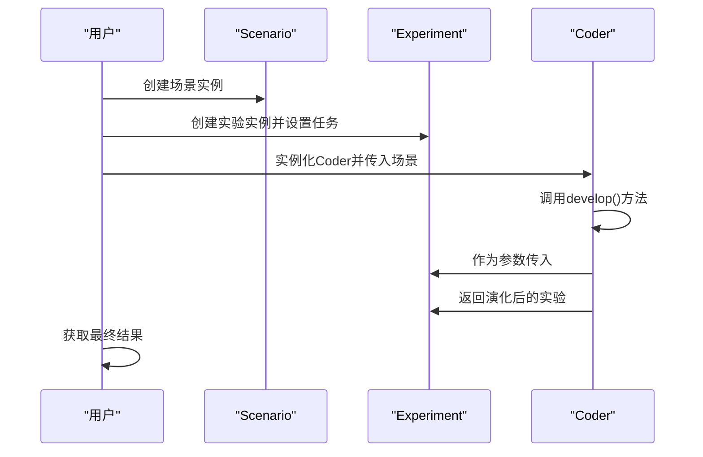

# Coder组件API

<cite>
**本文档引用的文件**
- [CoSTEER/\_\_init\_\_.py](file://rdagent\components\coder\CoSTEER\__init__.py)
- [CoSTEER/evolving_strategy.py](file://rdagent\components\coder\CoSTEER\evolving_strategy.py)
- [CoSTEER/task.py](file://rdagent\components\coder\CoSTEER\task.py)
- [data_science/pipeline/\_\_init\_\_.py](file://rdagent\components\coder\data_science\pipeline\__init__.py)
- [data_science/share/ds_costeer.py](file://rdagent\components\coder\data_science\share\ds_costeer.py)
- [factor_coder/factor.py](file://rdagent\components\coder\factor_coder\factor.py)
- [model_coder/model.py](file://rdagent\components\coder\model_coder\model.py)
- [factor_coder/prompts.yaml](file://rdagent\components\coder\factor_coder\prompts.yaml)
- [model_coder/prompts.yaml](file://rdagent\components\coder\model_coder\prompts.yaml)
- [factor_coder/factor_execution_template.txt](file://rdagent\components\coder\factor_coder\factor_execution_template.txt)
- [model_coder/model_execute_template_v1.txt](file://rdagent\components\coder\model_coder\model_execute_template_v1.txt)
- [model_coder/model_execute_template_v2.txt](file://rdagent\components\coder\model_coder\model_execute_template_v2.txt)
- [data_science/pipeline/prompts.yaml](file://rdagent\components\coder\data_science\pipeline\prompts.yaml)
</cite>

## 目录
1. [引言](#引言)
2. [核心基类与接口](#核心基类与接口)
3. [CoSTEER框架](#costeer框架)
4. [数据科学Coder](#数据科学coder)
5. [因子Coder](#因子coder)
6. [模型Coder](#模型coder)
7. [实际调用示例](#实际调用示例)

## 引言
本文档详细说明了RD-Agent框架中Coder组件族的公共接口。该组件族基于CoSTEER框架，为不同场景（如数据科学、量化金融）提供代码生成能力。文档将深入解析基类定义、执行流程、生命周期管理以及各Coder在特定场景下的特殊实现机制。

## 核心基类与接口

### Coder基类定义
所有Coder组件均继承自`rdagent.components.coder.base.Coder`的抽象基类，其核心接口定义在`rdagent.core.developer.Developer`中。该基类通过`develop()`方法定义了代码生成的统一入口。

**Section sources**
- [CoSTEER/\_\_init\_\_.py](file://rdagent\components\coder\CoSTEER\__init__.py#L1-L177)

### 抽象方法与生命周期
`Coder`基类的生命周期由`develop()`方法驱动，该方法接收一个`Experiment`对象并返回一个经过演化的`Experiment`对象。`develop()`方法内部调用`evolve_agent.multistep_evolve()`，通过多步演化策略生成和优化代码。

```mermaid
flowchart TD
Start([开始 develop()]) --> Init["初始化演化项\n(EvolvingItem)"]
Init --> CreateAgent["创建演化代理\n(RAGEvoAgent)"]
CreateAgent --> EvolveLoop["演化循环"]
EvolveLoop --> CheckFeedback["检查反馈\n(should_use_new_evo)"]
CheckFeedback --> |是| UpdateFallback["更新回退方案"]
CheckFeedback --> |否| ContinueLoop
UpdateFallback --> ContinueLoop
ContinueLoop --> CheckTime["检查时间限制"]
CheckTime --> |超时| BreakLoop["跳出循环"]
CheckTime --> |未超时| EvolveLoop
BreakLoop --> ApplyFallback["应用回退方案"]
ApplyFallback --> PostProcess["后处理反馈\n(_exp_postprocess_by_feedback)"]
PostProcess --> Return["返回演化后的实验"]
```

**Diagram sources**
- [CoSTEER/\_\_init\_\_.py](file://rdagent\components\coder\CoSTEER\__init__.py#L1-L177)

**Section sources**
- [CoSTEER/\_\_init\_\_.py](file://rdagent\components\coder\CoSTEER\__init__.py#L1-L177)

## CoSTEER框架

### 演化策略 (evolving_strategy.py)
CoSTEER框架的核心是其演化策略，由`MultiProcessEvolvingStrategy`类实现。该策略通过`evolve()`方法协调多个子任务的演化过程。

`evolve()`方法首先确定需要演化的任务，然后并行调用`implement_one_task()`方法生成新代码，最后通过`assign_code_list_to_evo()`方法将生成的代码应用到演化项中。



**Diagram sources**
- [CoSTEER/evolving_strategy.py](file://rdagent\components\coder\CoSTEER\evolving_strategy.py#L1-L135)

**Section sources**
- [CoSTEER/evolving_strategy.py](file://rdagent\components\coder\CoSTEER\evolving_strategy.py#L1-L135)

### 任务建模 (task.py)
CoSTEER框架通过`CoSTEERTask`类对任务进行建模。该类继承自`rdagent.core.experiment.Task`，并提供了`get_task_information()`等方法来获取任务的详细信息。



**Diagram sources**
- [CoSTEER/task.py](file://rdagent\components\coder\CoSTEER\task.py#L1-L10)

**Section sources**
- [CoSTEER/task.py](file://rdagent\components\coder\CoSTEER\task.py#L1-L10)

### 知识管理集成机制
CoSTEER框架集成了知识管理机制，通过`CoSTEERRAGStrategyV1`和`CoSTEERRAGStrategyV2`策略来查询和利用历史知识。在`CoSTEER`类的`__init__`方法中，根据`evolving_version`参数选择相应的RAG策略。

## 数据科学Coder

### 子模块代码生成逻辑
数据科学Coder包含多个子模块，如`pipeline`、`feature`、`model`等。每个子模块都有一个对应的`CoSTEER`实现，如`PipelineCoSTEER`。

`PipelineCoSTEER`类继承自`DSCoSTEER`，并在`__init__`方法中配置了特定的评估器和演化策略。



**Diagram sources**
- [data_science/share/ds_costeer.py](file://rdagent\components\coder\data_science\share\ds_costeer.py#L1-L10)
- [data_science/pipeline/\_\_init\_\_.py](file://rdagent\components\coder\data_science\pipeline\__init__.py#L1-L166)

**Section sources**
- [data_science/share/ds_costeer.py](file://rdagent\components\coder\data_science\share\ds_costeer.py#L1-L10)
- [data_science/pipeline/\_\_init\_\_.py](file://rdagent\components\coder\data_science\pipeline\__init__.py#L1-L166)

### 提示模板 (prompts.yaml) 结构
数据科学Coder的提示模板定义了代码生成的系统提示和用户提示。系统提示包含了任务描述、运行时环境、包信息、规范等，而用户提示则包含了竞赛信息、数据文件夹描述和之前的代码。



**Diagram sources**
- [data_science/pipeline/prompts.yaml](file://rdagent\components\coder\data_science\pipeline\prompts.yaml#L1-L348)

**Section sources**
- [data_science/pipeline/prompts.yaml](file://rdagent\components\coder\data_science\pipeline\prompts.yaml#L1-L348)

## 因子Coder

### 特殊实现
因子Coder通过`FactorTask`和`FactorFBWorkspace`类实现其特殊功能。

`FactorTask`类定义了因子任务的属性，如`factor_name`、`factor_description`和`factor_formulation`。

`FactorFBWorkspace`类负责执行因子代码。它通过`execute()`方法将代码写入文件，并使用`factor_execution_template.txt`模板来执行代码。



**Diagram sources**
- [factor_coder/factor.py](file://rdagent\components\coder\factor_coder\factor.py#L1-L232)

**Section sources**
- [factor_coder/factor.py](file://rdagent\components\coder\factor_coder\factor.py#L1-L232)

### 因子执行模板 (factor_execution_template.txt)
`factor_execution_template.txt`是一个Python脚本模板，用于执行生成的因子代码。它导入`feature_engineering_cls`类，使用验证数据进行拟合和转换，并将结果保存到`result.h5`文件中。

```python
import os
import numpy as np
import pandas as pd
from factor import feature_engineering_cls

if os.path.exists("X_valid.pkl"):
    valid_df = pd.read_pickle("X_valid.pkl").head(1000)
else:
    raise FileNotFoundError("No valid data found.")

cls = feature_engineering_cls()
cls.fit(valid_df)
new_feat = cls.transform(valid_df)
new_feat.to_hdf("result.h5", key="data", mode="w")
```

**Diagram sources**
- [factor_coder/factor_execution_template.txt](file://rdagent\components\coder\factor_coder\factor_execution_template.txt#L1-L16)

## 模型Coder

### 特殊实现
模型Coder通过`ModelTask`和`ModelFBWorkspace`类实现其特殊功能。

`ModelTask`类定义了模型任务的属性，如`architecture`、`hyperparameters`和`model_type`。

`ModelFBWorkspace`类负责执行模型代码。它通过`execute()`方法将代码写入文件，并使用`model_execute_template_v*.txt`模板来执行代码。



**Diagram sources**
- [model_coder/model.py](file://rdagent\components\coder\model_coder\model.py#L1-L164)

**Section sources**
- [model_coder/model.py](file://rdagent\components\coder\model_coder\model.py#L1-L164)

### 模型执行模板 (model_execute_template_v*.txt)
模型Coder提供了两个版本的执行模板：

- `model_execute_template_v1.txt`：用于Qlib场景，通过`model_cls`类初始化模型并执行。
- `model_execute_template_v2.txt`：用于Kaggle场景，通过`fit`和`predict`函数执行模型。

**Diagram sources**
- [model_coder/model_execute_template_v1.txt](file://rdagent\components\coder\model_coder\model_execute_template_v1.txt#L1-L45)
- [model_coder/model_execute_template_v2.txt](file://rdagent\components\coder\model_coder\model_execute_template_v2.txt#L1-L25)

## 实际调用示例

### 配置与实例化
以下示例展示了如何配置和实例化不同类型的Coder：

```python
# 实例化因子Coder
factor_coder = FactorCoSTEER(scen=QlibFactorScenario())

# 实例化模型Coder
model_coder = ModelCoSTEER(scen=QlibModelScenario())

# 实例化数据科学Pipeline Coder
pipeline_coder = PipelineCoSTEER(scen=DataScienceScenario())
```

### 与Scenario和Experiment的集成
Coder组件与`Scenario`和`Experiment`紧密集成。`Scenario`提供了场景相关的配置和描述，而`Experiment`则封装了具体的任务和工作空间。



**Diagram sources**
- [CoSTEER/\_\_init\_\_.py](file://rdagent\components\coder\CoSTEER\__init__.py#L1-L177)
- [data_science/pipeline/\_\_init\_\_.py](file://rdagent\components\coder\data_science\pipeline\__init__.py#L1-L166)
- [factor_coder/factor.py](file://rdagent\components\coder\factor_coder\factor.py#L1-L232)
- [model_coder/model.py](file://rdagent\components\coder\model_coder\model.py#L1-L164)

**Section sources**
- [CoSTEER/\_\_init\_\_.py](file://rdagent\components\coder\CoSTEER\__init__.py#L1-L177)
- [data_science/pipeline/\_\_init\_\_.py](file://rdagent\components\coder\data_science\pipeline\__init__.py#L1-L166)
- [factor_coder/factor.py](file://rdagent\components\coder\factor_coder\factor.py#L1-L232)
- [model_coder/model.py](file://rdagent\components\coder\model_coder\model.py#L1-L164)