# 因子Coder API 详细文档

<cite>
**本文档引用的文件**
- [factor.py](file://rdagent/app/qlib_rd_loop/factor.py)
- [evolving_strategy.py](file://rdagent/components/coder/factor_coder/evolving_strategy.py)
- [factor_execution_template.txt](file://rdagent/components/coder/factor_coder/factor_execution_template.txt)
- [prompts.yaml](file://rdagent/components/coder/factor_coder/prompts.yaml)
- [factor.py](file://rdagent/components/coder/factor_coder/factor.py)
- [factor_proposal.py](file://rdagent/scenarios/qlib/proposal/factor_proposal.py)
- [conf.py](file://rdagent/app/qlib_rd_loop/conf.py)
- [config.py](file://rdagent/components/coder/factor_coder/config.py)
- [factor_experiment.py](file://rdagent/scenarios/qlib/experiment/factor_experiment.py)
- [factor_runner.py](file://rdagent/scenarios/qlib/developer/factor_runner.py)
- [factor_coder.py](file://rdagent/scenarios/qlib/developer/factor_coder.py)
</cite>

## 目录
1. [简介](#简介)
2. [系统架构概览](#系统架构概览)
3. [核心组件分析](#核心组件分析)
4. [因子表达式构造逻辑](#因子表达式构造逻辑)
5. [演化策略实现](#演化策略实现)
6. [代码模板注入机制](#代码模板注入机制)
7. [提示工程与LLM交互](#提示工程与llm交互)
8. [因子生成任务配置](#因子生成任务配置)
9. [执行与评估闭环](#执行与评估闭环)
10. [与FactorProposal和FactorRunner集成](#与factorproposal和factorrunner集成)
11. [实际调用示例](#实际调用示例)
12. [总结](#总结)

## 简介

因子Coder是基于Qlib框架的量化金融因子自动化生成系统，专门设计用于在量化投资场景下自动生成Alpha因子代码。该系统通过结合提示工程（Prompt Engineering）、演化策略（Evolving Strategy）和代码模板注入机制，实现了从因子概念到可执行代码的完整自动化流程。

系统的核心目标是：
- 基于自然语言描述自动生成符合Alpha因子规范的Python代码
- 通过迭代优化确保生成的因子具有统计显著性和市场有效性
- 提供完整的因子开发、测试和部署流水线
- 支持复杂的金融数据处理和因子计算逻辑

## 系统架构概览

因子Coder系统采用分层架构设计，主要包含以下核心层次：

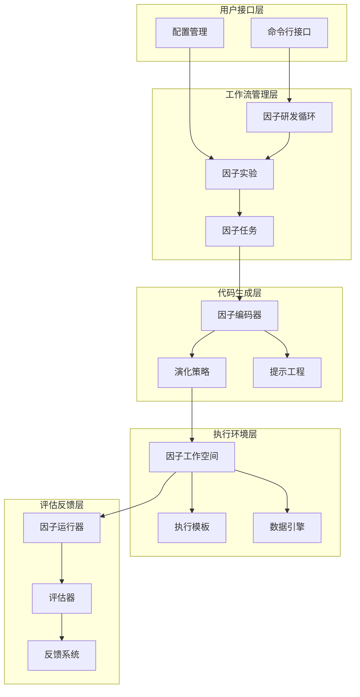

**图表来源**
- [factor.py](file://rdagent/app/qlib_rd_loop/factor.py#L1-L61)
- [factor_experiment.py](file://rdagent/scenarios/qlib/experiment/factor_experiment.py#L1-L91)
- [evolving_strategy.py](file://rdagent/components/coder/factor_coder/evolving_strategy.py#L1-L174)

## 核心组件分析

### FactorRDLoop - 因子研发循环

FactorRDLoop是系统的核心控制器，继承自通用的RDLoop类，专门负责因子研发的迭代流程。

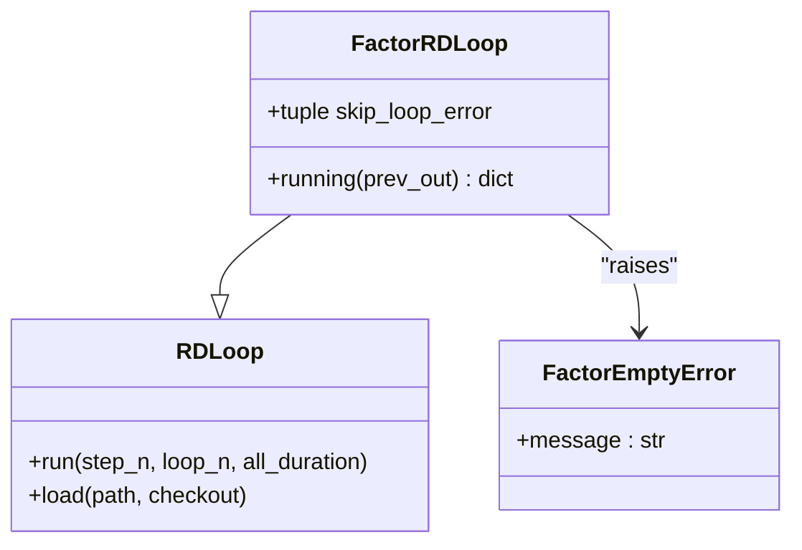

**图表来源**
- [factor.py](file://rdagent/app/qlib_rd_loop/factor.py#L15-L30)

**章节来源**
- [factor.py](file://rdagent/app/qlib_rd_loop/factor.py#L1-L61)

### FactorTask - 因子任务定义

FactorTask封装了单个因子的所有相关信息，包括名称、描述、公式和变量定义。

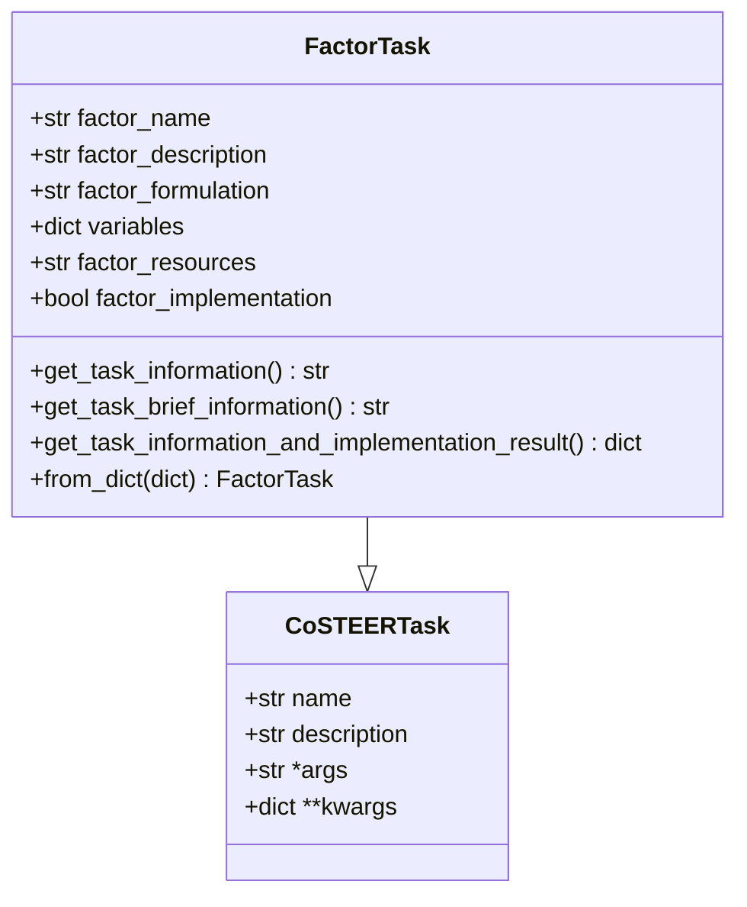

**图表来源**
- [factor.py](file://rdagent/components/coder/factor_coder/factor.py#L15-L76)

**章节来源**
- [factor.py](file://rdagent/components/coder/factor_coder/factor.py#L15-L76)

### FactorFBWorkspace - 因子工作空间

FactorFBWorkspace负责因子代码的执行环境管理，包括数据准备、代码执行和结果输出。

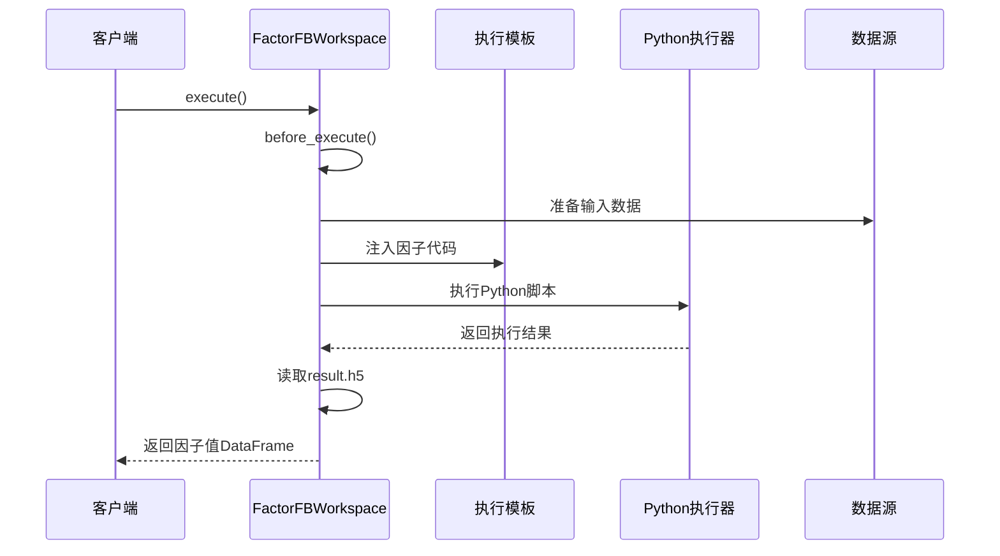

**图表来源**
- [factor.py](file://rdagent/components/coder/factor_coder/factor.py#L89-L226)

**章节来源**
- [factor.py](file://rdagent/components/coder/factor_coder/factor.py#L76-L231)

## 因子表达式构造逻辑

### 因子表达式结构

因子表达式是系统的核心抽象，包含了因子的完整数学描述和实现信息：

| 组件 | 类型 | 描述 | 示例 |
|------|------|------|------|
| factor_name | str | 因子唯一标识符 | "Momentum_1M" |
| factor_description | str | 因子功能描述 | "基于过去1个月收益率的动量因子" |
| factor_formulation | str | 数学公式表达式 | "$M_t = \frac{P_t}{P_{t-20}} - 1$" |
| variables | dict | 变量定义映射 | {"price": "收盘价序列", "period": "回望期"} |
| factor_resources | str | 资源引用路径 | "data/fundamental/" |

### 表达式验证机制

系统通过多层次验证确保因子表达式的正确性：

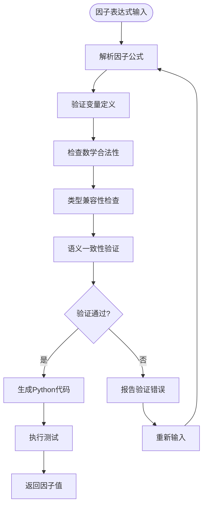

**章节来源**
- [factor.py](file://rdagent/components/coder/factor_coder/factor.py#L50-L76)

## 演化策略实现

### 多进程演化策略

FactorMultiProcessEvolvingStrategy是系统的核心演化算法，基于CoSTEER框架实现智能代码生成。

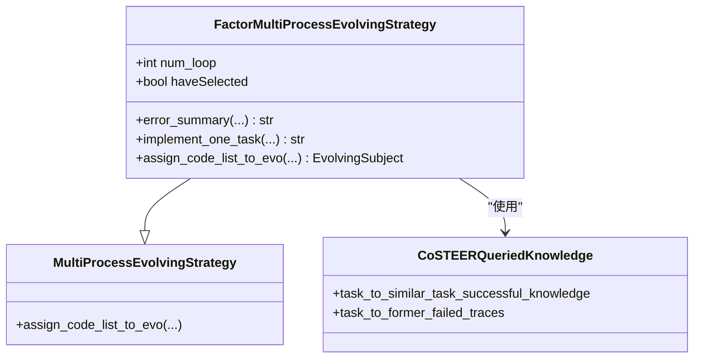

**图表来源**
- [evolving_strategy.py](file://rdagent/components/coder/factor_coder/evolving_strategy.py#L15-L174)

### 智能代码生成流程

演化策略通过以下步骤实现智能代码生成：

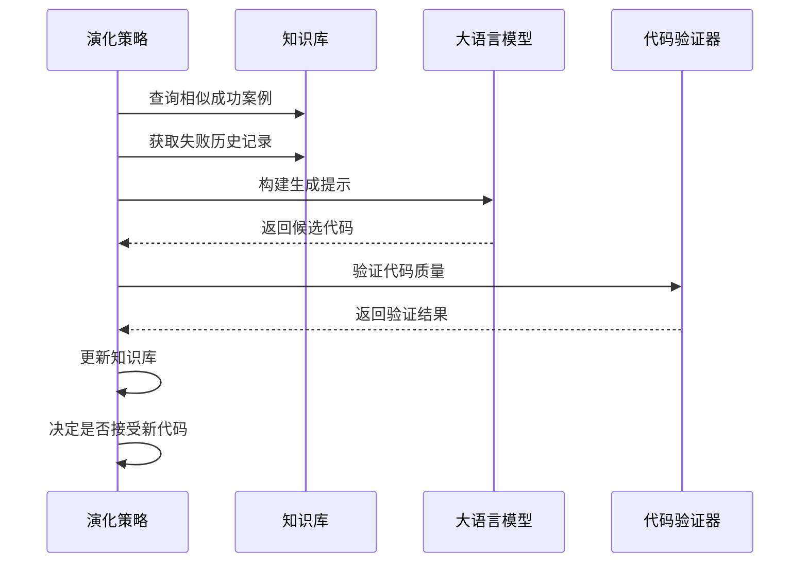

**图表来源**
- [evolving_strategy.py](file://rdagent/components/coder/factor_coder/evolving_strategy.py#L50-L150)

**章节来源**
- [evolving_strategy.py](file://rdagent/components/coder/factor_coder/evolving_strategy.py#L15-L174)

## 代码模板注入机制

### 执行模板结构

factor_execution_template.txt定义了因子代码的标准执行框架：

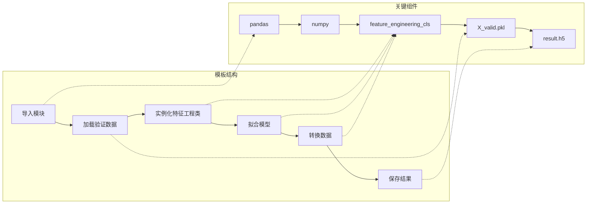

**图表来源**
- [factor_execution_template.txt](file://rdagent/components/coder/factor_coder/factor_execution_template.txt#L1-L16)

### 模板注入过程

模板注入通过以下机制实现动态代码生成：

| 步骤 | 操作 | 目的 |
|------|------|------|
| 1 | 读取模板内容 | 获取标准执行框架 |
| 2 | 注入因子代码 | 将用户生成的因子代码嵌入模板 |
| 3 | 创建临时脚本 | 在工作空间中生成可执行脚本 |
| 4 | 设置执行环境 | 配置Python路径和依赖 |
| 5 | 执行代码 | 运行完整的因子计算流程 |
| 6 | 收集结果 | 从HDF5文件提取因子值 |

**章节来源**
- [factor.py](file://rdagent/components/coder/factor_coder/factor.py#L159-L165)

## 提示工程与LLM交互

### 提示模板系统

系统通过prompts.yaml文件管理所有提示模板，支持多种场景的代码生成需求。

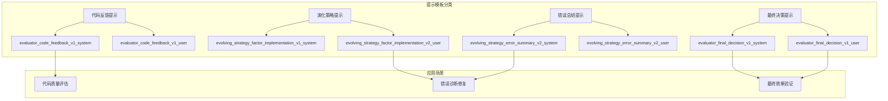

**图表来源**
- [prompts.yaml](file://rdagent/components/coder/factor_coder/prompts.yaml#L1-L210)

### 提示工程最佳实践

系统采用以下提示工程原则：

| 原则 | 实现方式 | 效果 |
|------|----------|------|
| 明确指令 | 结构化JSON输出格式 | 减少LLM误解 |
| 上下文丰富 | 包含历史反馈和相似案例 | 提高代码质量 |
| 错误导向 | 专注于关键问题而非细节 | 加快修复速度 |
| 渐进复杂度 | 从简单到复杂的逐步指导 | 降低学习曲线 |

**章节来源**
- [prompts.yaml](file://rdagent/components/coder/factor_coder/prompts.yaml#L1-L210)

## 因子生成任务配置

### 配置参数详解

系统通过FactorCoSTEERSettings类管理所有配置参数：

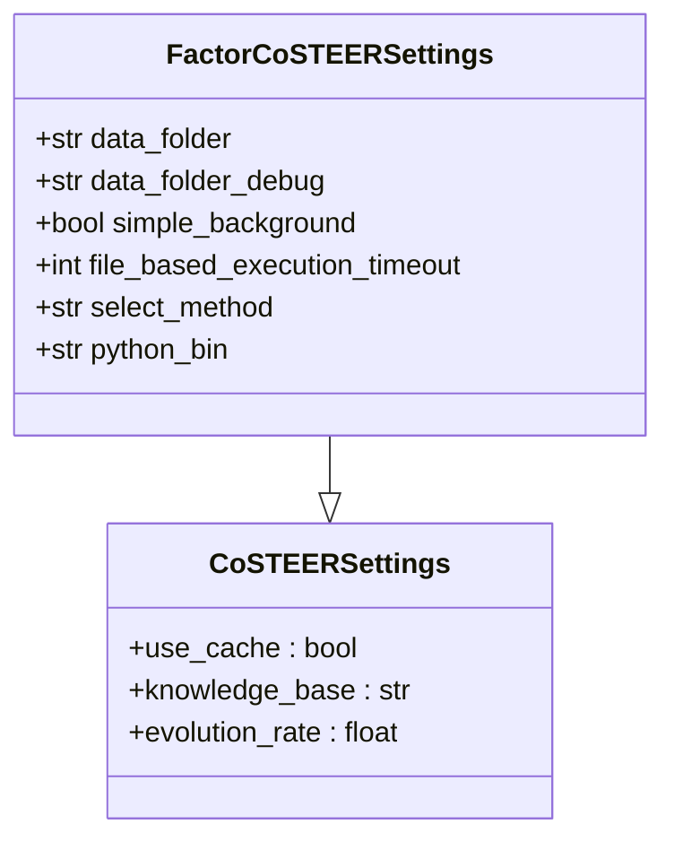

**图表来源**
- [config.py](file://rdagent/components/coder/factor_coder/config.py#L8-L49)

### 环境配置函数

get_factor_env函数提供了灵活的环境配置能力：

| 参数 | 类型 | 默认值 | 描述 |
|------|------|--------|------|
| conf_type | Optional[str] | None | 配置类型选择 |
| extra_volumes | dict | {} | 额外挂载卷 |
| running_timeout_period | int | 600 | 运行超时时间 |
| enable_cache | Optional[bool] | None | 是否启用缓存 |

**章节来源**
- [config.py](file://rdagent/components/coder/factor_coder/config.py#L25-L49)

## 执行与评估闭环

### 完整执行流程

系统实现了从因子生成到效果评估的完整闭环：

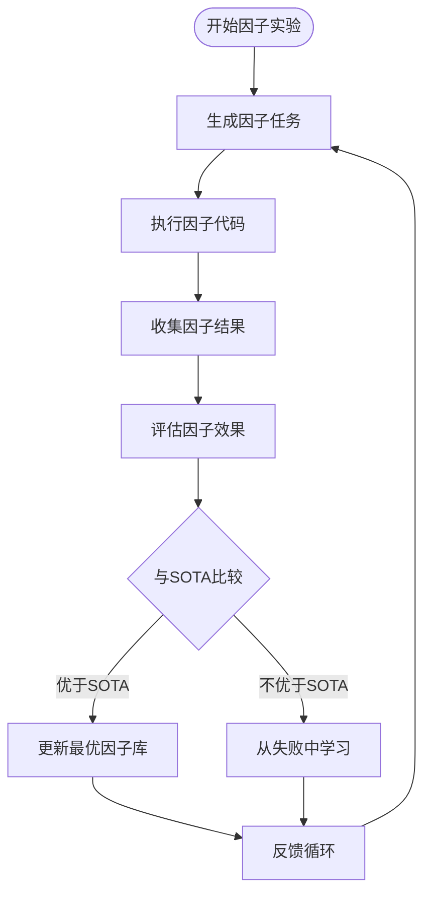

**图表来源**
- [factor_runner.py](file://rdagent/scenarios/qlib/developer/factor_runner.py#L60-L184)

### 因子效果评估指标

系统使用多维度指标评估因子性能：

| 指标类别 | 具体指标 | 计算方法 | 重要性 |
|----------|----------|----------|--------|
| 统计指标 | IC值 | 信息系数 | 核心 |
| 收益指标 | 年化收益 | 时间加权回报率 | 关键 |
| 风险指标 | 最大回撤 | 最大亏损幅度 | 重要 |
| 稳定性指标 | Rank IC | 排序信息系数 | 辅助 |

**章节来源**
- [factor_runner.py](file://rdagent/scenarios/qlib/developer/factor_runner.py#L34-L184)

## 与FactorProposal和FactorRunner集成

### FactorProposal集成

FactorProposal负责从研究论文和报告中提取因子概念：

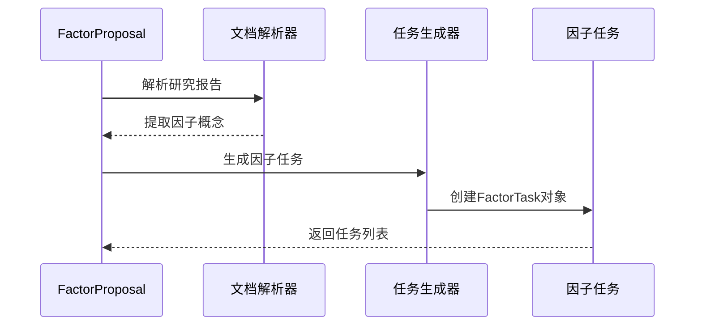

**图表来源**
- [factor_proposal.py](file://rdagent/scenarios/qlib/proposal/factor_proposal.py#L1-L133)

### FactorRunner集成

FactorRunner负责执行因子实验并提供反馈：

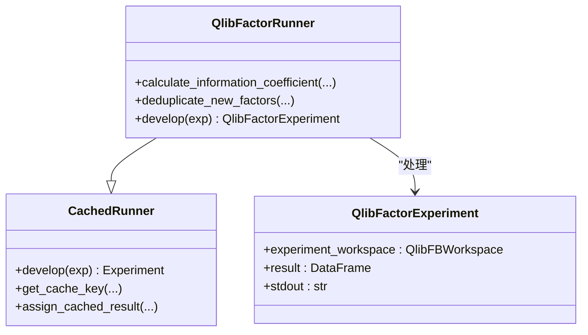

**图表来源**
- [factor_runner.py](file://rdagent/scenarios/qlib/developer/factor_runner.py#L34-L184)

**章节来源**
- [factor_proposal.py](file://rdagent/scenarios/qlib/proposal/factor_proposal.py#L1-L133)
- [factor_runner.py](file://rdagent/scenarios/qlib/developer/factor_runner.py#L34-L184)

## 实际调用示例

### 基础因子生成调用

以下是使用因子Coder生成Alpha因子的基本流程：

```bash
# 启动因子生成循环
python rdagent/app/qlib_rd_loop/factor.py \
    --step_n 1 \
    --loop_n 5 \
    --all_duration "2h"
```

### 高级配置调用

```bash
# 使用特定配置路径启动
python rdagent/app/qlib_rd_loop/factor.py \
    --path "/path/to/session/1/0_propose" \
    --checkout \
    --checkout_path "/custom/path"
```

### 环境变量配置

系统支持通过环境变量进行配置：

| 环境变量 | 默认值 | 描述 |
|----------|--------|------|
| FACTOR_CoSTEER_data_folder | git_ignore_folder/factor_implementation_source_data | 数据文件夹路径 |
| FACTOR_CoSTEER_python_bin | python | Python可执行文件路径 |
| FACTOR_CoSTEER_file_based_execution_timeout | 3600 | 执行超时时间（秒） |

**章节来源**
- [factor.py](file://rdagent/app/qlib_rd_loop/factor.py#L32-L61)

## 总结

因子Coder API是一个功能完备的量化金融因子自动化生成系统，具有以下核心特性：

### 技术优势

1. **智能化代码生成**：基于CoSTEER框架的多进程演化策略，能够智能生成高质量因子代码
2. **完善的评估体系**：提供多维度的因子效果评估和反馈机制
3. **灵活的配置管理**：支持多种环境配置和参数调优
4. **标准化的执行流程**：从因子概念到可执行代码的完整自动化流程

### 应用价值

- **提高因子开发效率**：大幅减少人工编写因子代码的时间成本
- **保证代码质量**：通过迭代优化确保生成的因子具有统计显著性
- **支持复杂金融场景**：能够处理多维度、多层次的因子计算需求
- **促进量化研究创新**：为量化研究员提供强大的工具支持

### 发展方向

未来系统可以在以下方面进一步优化：
- 增强对复杂金融模型的支持
- 扩展多资产类别的因子生成能力
- 优化大规模因子库的管理机制
- 加强与主流量化平台的集成

因子Coder API为量化金融领域的自动化因子开发提供了强有力的技术支撑，是推动量化研究智能化发展的重要工具。