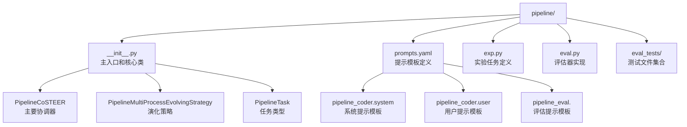
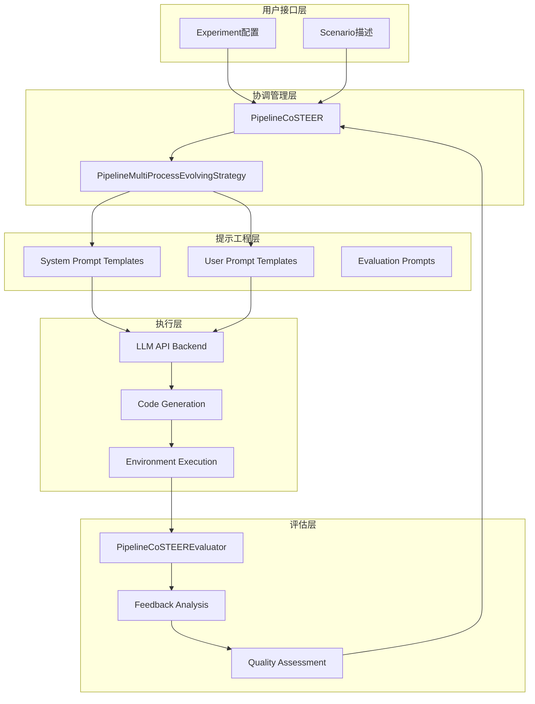
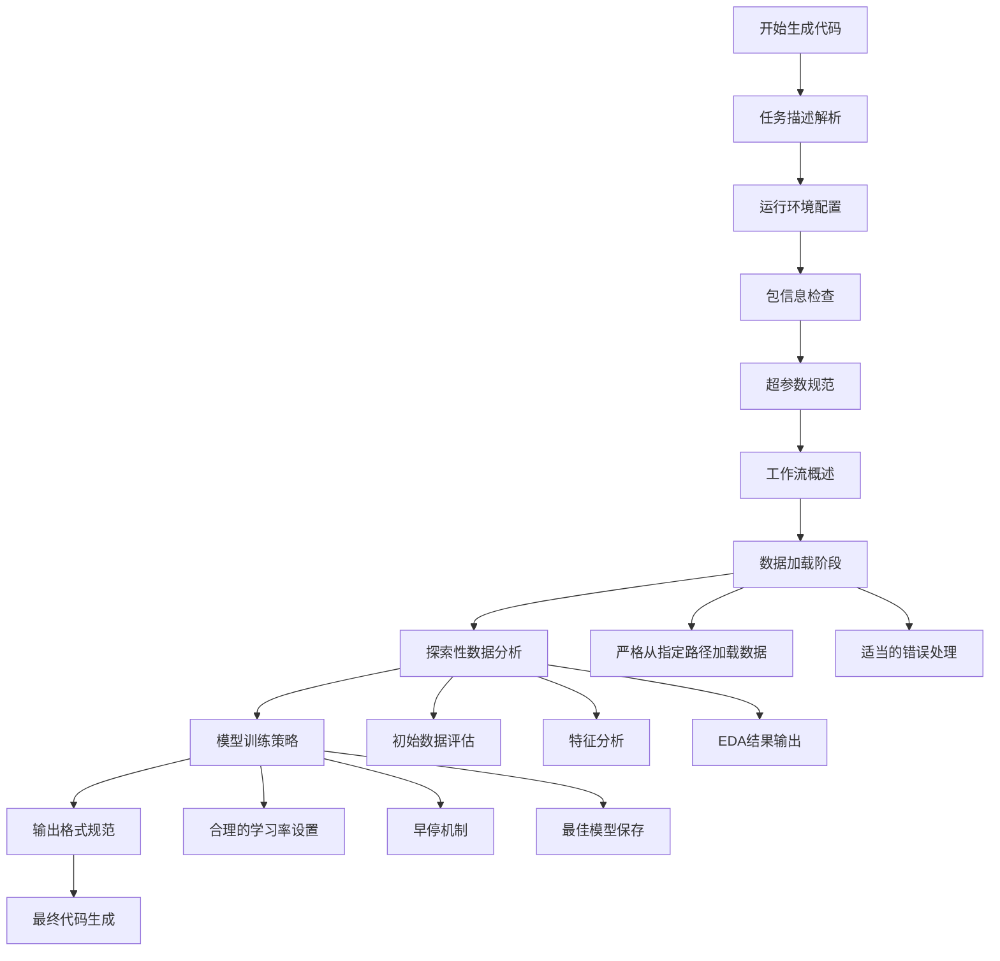
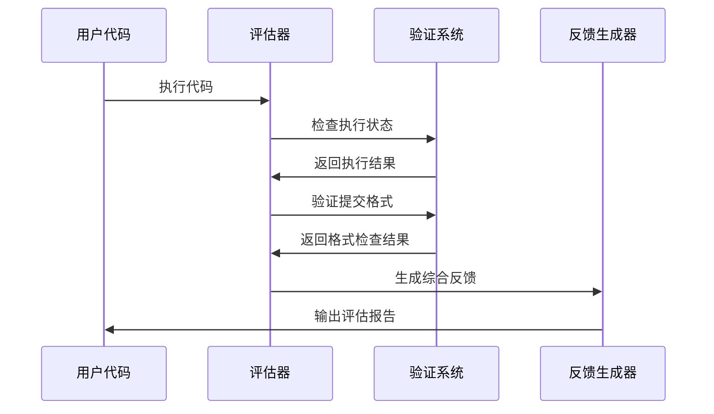
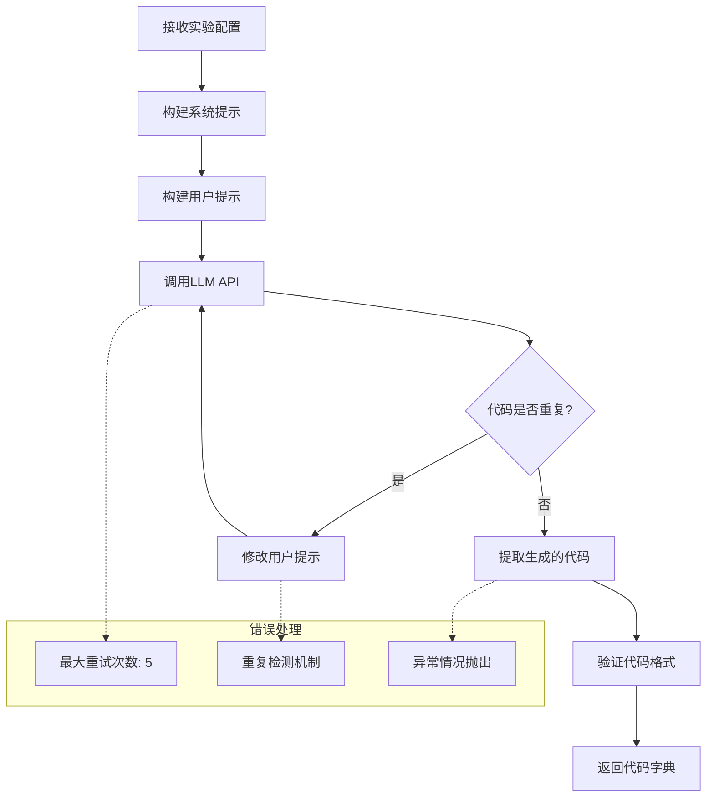
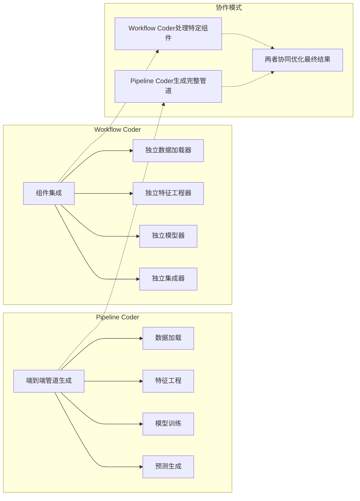
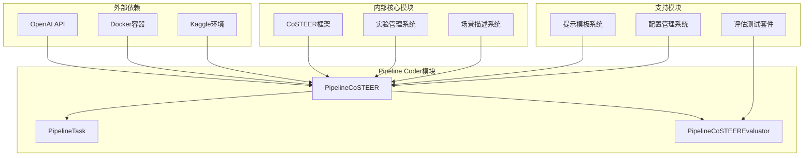
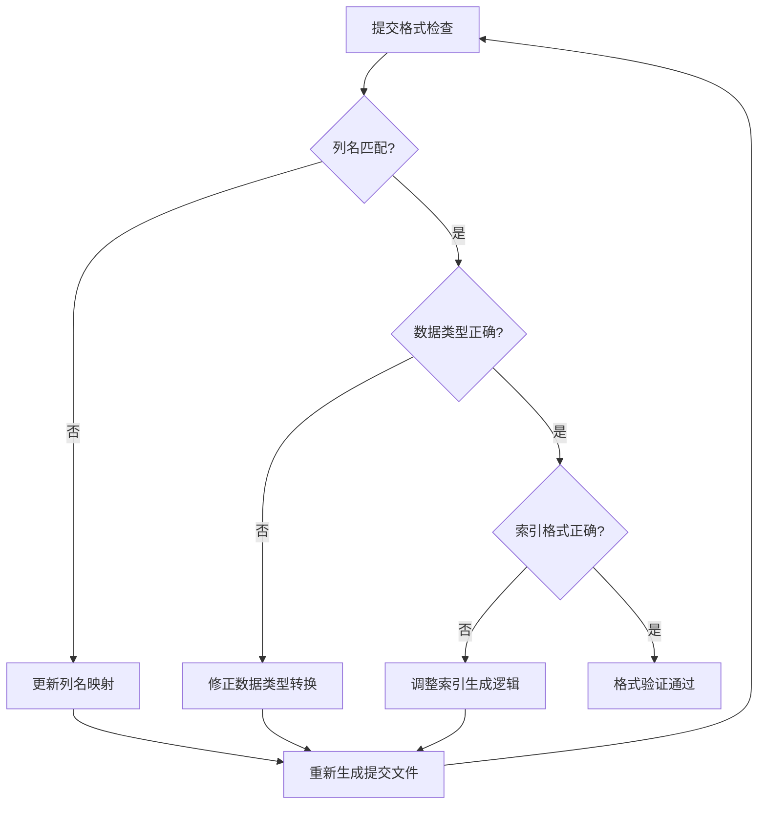

# Pipeline Coder API 文档

<cite>
**本文档中引用的文件**
- [__init__.py](file://rdagent/components/coder/data_science/pipeline/__init__.py)
- [prompts.yaml](file://rdagent/components/coder/data_science/pipeline/prompts.yaml)
- [exp.py](file://rdagent/components/coder/data_science/pipeline/exp.py)
- [eval.py](file://rdagent/components/coder/data_science/pipeline/eval.py)
- [ds_costeer.py](file://rdagent/components/coder/data_science/share/ds_costeer.py)
- [workflow/__init__.py](file://rdagent/components/coder/data_science/workflow/__init__.py)
- [conf.py](file://rdagent/components/coder/data_science/conf.py)
- [submission_format_test.txt](file://rdagent/components/coder/data_science/pipeline/eval_tests/submission_format_test.txt)
</cite>

## 目录
1. [简介](#简介)
2. [项目结构](#项目结构)
3. [核心组件](#核心组件)
4. [架构概览](#架构概览)
5. [详细组件分析](#详细组件分析)
6. [依赖关系分析](#依赖关系分析)
7. [性能考虑](#性能考虑)
8. [故障排除指南](#故障排除指南)
9. [结论](#结论)

## 简介

Pipeline Coder是数据科学领域的一个高级自动化代码生成器，专门用于生成端到端的数据科学工作流脚本。它继承自`Coder`基类，通过`coding()`方法实现智能代码生成，能够根据实验配置（Experiment）自动生成符合Kaggle提交规范的Python脚本。

该系统采用CoSTEER框架，结合了先进的提示工程技术和多进程演化策略，能够在复杂的竞赛环境中生成高质量的数据科学解决方案。Pipeline Coder不仅关注代码的功能正确性，还特别强调代码的可调试性、迭代友好性和与现有工作流的兼容性。

## 项目结构

Pipeline Coder模块位于`rdagent/components/coder/data_science/pipeline/`目录下，包含以下核心文件：



**图表来源**
- [__init__.py](file://rdagent/components/coder/data_science/pipeline/__init__.py#L1-L166)
- [prompts.yaml](file://rdagent/components/coder/data_science/pipeline/prompts.yaml#L1-L348)

**章节来源**
- [__init__.py](file://rdagent/components/coder/data_science/pipeline/__init__.py#L1-L166)
- [exp.py](file://rdagent/components/coder/data_science/pipeline/exp.py#L1-L9)

## 核心组件

### PipelineCoSTEER 类

`PipelineCoSTEER`是Pipeline Coder的核心协调器，继承自`DSCoSTEER`基类，负责整个代码生成流程的管理和调度。

#### 主要特性：
- **多进程演化策略**：支持并行执行多个子任务
- **智能知识管理**：利用过往成功和失败的经验优化当前生成
- **动态环境配置**：根据竞赛需求自动调整运行环境
- **迭代反馈机制**：通过评估器提供持续改进指导

#### 核心方法：
- `__init__()`: 初始化协调器，配置评估器和演化策略
- `develop()`: 启动完整的开发流程
- `get_develop_max_seconds()`: 计算最大开发时间限制

### PipelineMultiProcessEvolvingStrategy 类

这是Pipeline Coder的演化策略实现，负责具体的代码生成过程。

#### 关键功能：
- **任务实现**：为指定任务生成代码解决方案
- **知识查询**：检索相似任务的成功经验和失败教训
- **代码分配**：将生成的代码分配到相应的演化项目
- **重复避免**：确保不会生成重复的代码版本

### PipelineTask 类

`PipelineTask`扩展了`CoSTEERTask`，专门用于表示数据科学管道任务。

#### 属性和方法：
- `package_info`: 包信息字符串，包含所需的包名和版本
- `get_task_information()`: 获取任务的详细信息描述

**章节来源**
- [__init__.py](file://rdagent/components/coder/data_science/pipeline/__init__.py#L15-L166)
- [exp.py](file://rdagent/components/coder/data_science/pipeline/exp.py#L5-L9)

## 架构概览

Pipeline Coder采用分层架构设计，结合了CoSTEER框架的先进理念：



**图表来源**
- [__init__.py](file://rdagent/components/coder/data_science/pipeline/__init__.py#L15-L166)
- [prompts.yaml](file://rdagent/components/coder/data_science/pipeline/prompts.yaml#L1-L348)

## 详细组件分析

### 提示模板系统

Pipeline Coder使用精心设计的YAML格式提示模板，定义了完整的代码生成指导原则。

#### 系统提示模板（System Prompt）

系统提示模板包含了全面的代码生成指导方针：



**图表来源**
- [prompts.yaml](file://rdagent/components/coder/data_science/pipeline/prompts.yaml#L1-L348)

#### 用户提示模板（User Prompt）

用户提示模板提供了具体的上下文信息和历史反馈：

| 组件 | 描述 | 用途 |
|------|------|------|
| 竞赛信息 | 当前竞赛的详细描述 | 帮助理解任务背景和目标 |
| 数据文件夹描述 | 输入数据的结构说明 | 指导正确的数据加载路径 |
| 前序代码 | 之前的代码实现 | 分析改进点和错误修复 |
| 反馈信息 | 上次尝试的评估结果 | 针对性地解决具体问题 |

#### 评估提示模板（Evaluation Prompt）

评估模板负责对生成的代码进行全面的质量检查：



**图表来源**
- [eval.py](file://rdagent/components/coder/data_science/pipeline/eval.py#L150-L348)

**章节来源**
- [prompts.yaml](file://rdagent/components/coder/data_science/pipeline/prompts.yaml#L1-L348)
- [eval.py](file://rdagent/components/coder/data_science/pipeline/eval.py#L150-L348)

### 代码生成流程

Pipeline Coder的代码生成遵循严格的步骤序列：



**图表来源**
- [__init__.py](file://rdagent/components/coder/data_science/pipeline/__init__.py#L85-L110)

### 评估和反馈机制

Pipeline Coder实现了多层次的评估体系：

#### 执行成功性检查
- **语法正确性**：确保代码可以正常编译和执行
- **依赖完整性**：验证所有必需的包都可用
- **资源限制**：检查是否在规定时间内完成

#### 竞赛对齐性验证
- **评估规则遵守**：确认符合竞赛的评分标准
- **验证策略一致性**：确保验证和测试阶段使用相同的方法
- **数据分割合理性**：检查训练/验证分割的正确性

#### 提交文件格式检查
- **列名匹配**：验证输出文件的列名与样本提交一致
- **数据类型正确**：确保数值和分类变量的数据类型正确
- **索引格式**：检查索引格式是否符合要求

**章节来源**
- [eval.py](file://rdagent/components/coder/data_science/pipeline/eval.py#L150-L348)

### 与Workflow Coder的协作关系

Pipeline Coder与Workflow Coder形成互补的工作流：



**图表来源**
- [workflow/__init__.py](file://rdagent/components/coder/data_science/workflow/__init__.py#L25-L132)
- [__init__.py](file://rdagent/components/coder/data_science/pipeline/__init__.py#L15-L166)

**章节来源**
- [workflow/__init__.py](file://rdagent/components/coder/data_science/workflow/__init__.py#L25-L132)

## 依赖关系分析

Pipeline Coder的依赖关系体现了其作为数据科学工具链核心组件的地位：



**图表来源**
- [__init__.py](file://rdagent/components/coder/data_science/pipeline/__init__.py#L15-L40)
- [conf.py](file://rdagent/components/coder/data_science/conf.py#L30-L87)

### 关键依赖说明

| 依赖项 | 版本要求 | 用途 | 替代方案 |
|--------|----------|------|----------|
| OpenAI API | 最新稳定版 | 代码生成核心 | 其他LLM服务 |
| Docker | 20.10+ | 运行环境隔离 | 本地环境 |
| Pandas | 1.3+ | 数据处理 | NumPy + 自定义函数 |
| Scikit-learn | 1.0+ | 机器学习算法 | 其他ML库 |

**章节来源**
- [__init__.py](file://rdagent/components/coder/data_science/pipeline/__init__.py#L15-L40)
- [conf.py](file://rdagent/components/coder/data_science/conf.py#L30-L87)

## 性能考虑

Pipeline Coder在设计时充分考虑了性能优化：

### 并行处理能力
- **多进程演化策略**：同时处理多个子任务，显著提升效率
- **异步API调用**：减少等待时间，提高响应速度
- **缓存机制**：重用成功的代码片段和配置

### 资源管理
- **内存优化**：及时清理临时文件和中间结果
- **时间控制**：设置合理的超时限制，防止无限循环
- **并发限制**：控制同时运行的任务数量，避免资源耗尽

### 代码质量保证
- **重复检测**：避免生成相同的代码变体
- **渐进式改进**：基于反馈逐步优化代码质量
- **测试驱动**：内置完整的测试套件验证代码正确性

## 故障排除指南

### 常见问题及解决方案

#### 格式错误处理

当遇到提交格式错误时，Pipeline Coder会进行以下检查：



**图表来源**
- [submission_format_test.txt](file://rdagent/components/coder/data_science/pipeline/eval_tests/submission_format_test.txt#L1-L95)

#### 代码片段拼接逻辑

Pipeline Coder使用智能的代码拼接策略：

| 拼接场景 | 处理方式 | 注意事项 |
|----------|----------|----------|
| 新增功能 | 在适当位置插入新代码块 | 保持逻辑连贯性 |
| 修改现有功能 | 替换对应代码段 | 确保向后兼容 |
| 删除功能 | 完全移除相关代码 | 清理依赖引用 |
| 重构代码 | 保持功能不变 | 更新测试用例 |

#### 与Kaggle提交规范的兼容性

Pipeline Coder严格遵循Kaggle提交规范：

- **文件命名**：必须生成`submission.csv`文件
- **列格式**：第一列为索引列，后续为预测值列
- **数据类型**：数值型预测值使用浮点数格式
- **索引要求**：索引必须与测试集匹配
- **文件大小**：确保文件大小在允许范围内

**章节来源**
- [submission_format_test.txt](file://rdagent/components/coder/data_science/pipeline/eval_tests/submission_format_test.txt#L1-L95)

### 调试和监控

#### 调试模式支持
Pipeline Coder提供专门的调试模式，允许使用少量数据快速验证代码：

```python
# 调试模式示例配置
if args.debug:
    sample_size = int(0.1 * len(train_dataset))  # 10%数据用于调试
    debug_time = measure_training_time()         # 测量训练时间
    estimated_time = debug_time * 10           # 估算完整运行时间
```

#### 性能监控指标
- **代码生成时间**：记录每次代码生成的耗时
- **执行成功率**：跟踪代码执行的成功率
- **错误类型统计**：分析常见错误模式
- **资源使用情况**：监控内存和CPU使用

## 结论

Pipeline Coder代表了数据科学自动化领域的重大进展，通过创新的CoSTEER框架和精心设计的提示工程系统，实现了高质量端到端数据科学工作流的自动化生成。

### 主要优势

1. **全面的代码生成能力**：从数据加载到模型部署的完整管道
2. **智能的知识管理**：利用历史经验优化当前生成
3. **严格的规范遵循**：确保生成的代码符合竞赛要求
4. **强大的评估机制**：提供全面的质量保证
5. **灵活的协作模式**：与其他组件无缝集成

### 应用前景

Pipeline Coder不仅适用于Kaggle竞赛，还可以扩展到：
- 企业级数据科学项目
- 学术研究工作流
- 自动化机器学习平台
- 教育培训场景

随着人工智能技术的不断发展，Pipeline Coder将继续演进，为数据科学领域的自动化和智能化做出更大贡献。