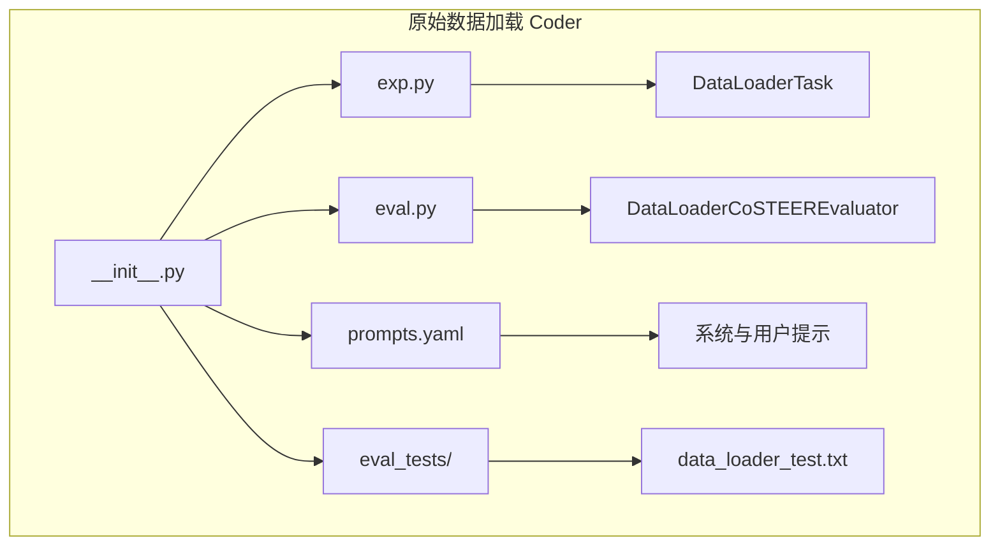
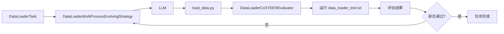
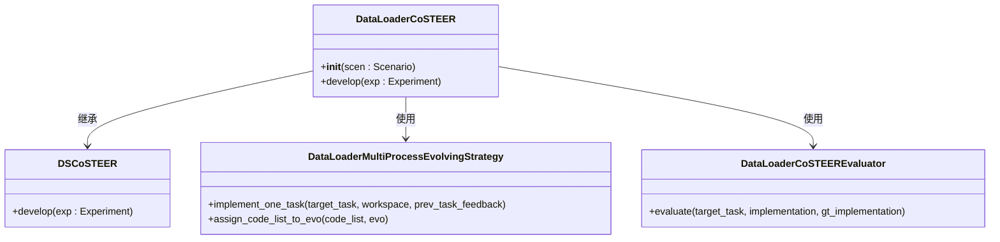
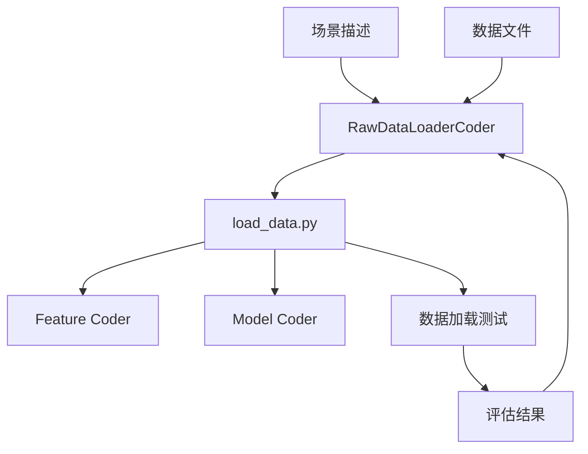

# 原始数据加载 Coder API

<cite>
**本文档引用的文件**  
- [raw_data_loader/__init__.py](file://rdagent/components/coder/data_science/raw_data_loader/__init__.py)
- [raw_data_loader/prompts.yaml](file://rdagent/components/coder/data_science/raw_data_loader/prompts.yaml)
- [raw_data_loader/eval.py](file://rdagent/components/coder/data_science/raw_data_loader/eval.py)
- [raw_data_loader/exp.py](file://rdagent/components/coder/data_science/raw_data_loader/exp.py)
- [raw_data_loader/README.md](file://rdagent/components/coder/data_science/raw_data_loader/README.md)
- [scenarios/kaggle/tpl_ex/aerial-cactus-identification/load_data.py](file://rdagent/scenarios/kaggle/tpl_ex/aerial-cactus-identification/load_data.py)
- [scenarios/data_science/debug/data.py](file://rdagent/scenarios/data_science/debug/data.py)
- [components/coder/data_science/conf.py](file://rdagent/components/coder/data_science/conf.py)
- [app/data_science/conf.py](file://rdagent/app/data_science/conf.py)
</cite>

## 目录
1. [简介](#简介)
2. [项目结构](#项目结构)
3. [核心组件](#核心组件)
4. [架构概述](#架构概述)
5. [详细组件分析](#详细组件分析)
6. [依赖分析](#依赖分析)
7. [性能考虑](#性能考虑)
8. [故障排除指南](#故障排除指南)
9. [结论](#结论)

## 简介
`RawDataLoaderCoder` 是 RD-Agent 系统中负责为数据科学任务（特别是 Kaggle 竞赛）生成原始数据加载、清洗和预处理代码的核心组件。该组件基于 CoSTEER 框架，通过大语言模型（LLM）自动生成符合特定竞赛要求的数据加载器。其主要目标是根据数据源描述，创建一个标准化的 `load_data` 函数，该函数返回训练特征 `X`、训练标签 `y`、测试特征 `X_test` 和测试 ID `test_ids`。

本文档详细说明了 `RawDataLoaderCoder` 的公共接口，重点分析了其 `coding()` 方法（在代码中体现为 `implement_one_task()`）的实现细节，包括对 CSV、HDF5 等多种文件格式的解析逻辑、缺失值处理和类型转换策略。同时，本文档解释了 `prompts.yaml` 中数据加载模板的设计原则和可配置项，并结合示例展示了如何为不同数据集生成定制化加载器，以及它如何作为工作流的起点与其他模块（如特征编码器）协同工作。

## 项目结构
`RawDataLoaderCoder` 的代码位于 `rdagent/components/coder/data_science/raw_data_loader/` 目录下，其结构遵循 CoSTEER 框架的通用模式。



**Diagram sources**
- [raw_data_loader/__init__.py](file://rdagent/components/coder/data_science/raw_data_loader/__init__.py)
- [raw_data_loader/exp.py](file://rdagent/components/coder/data_science/raw_data_loader/exp.py)
- [raw_data_loader/eval.py](file://rdagent/components/coder/data_science/raw_data_loader/eval.py)

**Section sources**
- [raw_data_loader/__init__.py](file://rdagent/components/coder/data_science/raw_data_loader/__init__.py)

## 核心组件
`RawDataLoaderCoder` 的核心功能由 `DataLoaderCoSTEER` 类及其关联的策略和评估器实现。`DataLoaderTask` 定义了数据加载任务的抽象，`DataLoaderMultiProcessEvolvingStrategy` 负责生成代码，而 `DataLoaderCoSTEEREvaluator` 则负责验证生成的代码是否正确。

**Section sources**
- [raw_data_loader/__init__.py](file://rdagent/components/coder/data_science/raw_data_loader/__init__.py)
- [raw_data_loader/exp.py](file://rdagent/components/coder/data_science/raw_data_loader/exp.py)
- [raw_data_loader/eval.py](file://rdagent/components/coder/data_science/raw_data_loader/eval.py)

## 架构概述
`RawDataLoaderCoder` 遵循 CoSTEER 的“提出-任务-执行-评估”循环。它接收一个 `DataLoaderTask`，利用 LLM 根据 `prompts.yaml` 中的模板生成 `load_data.py` 代码，然后通过运行测试脚本来评估代码的正确性。如果评估失败，它会将反馈信息连同之前的失败尝试和成功案例一起提供给 LLM，以指导下一次迭代。



**Diagram sources**
- [raw_data_loader/__init__.py](file://rdagent/components/coder/data_science/raw_data_loader/__init__.py)
- [raw_data_loader/eval.py](file://rdagent/components/coder/data_science/raw_data_loader/eval.py)

## 详细组件分析

### DataLoaderCoSTEER 类分析
`DataLoaderCoSTEER` 是 `RawDataLoaderCoder` 的主类，它继承自 `DSCoSTEER`，并配置了特定于数据加载任务的演化策略和评估器。

#### 类图


**Diagram sources**
- [raw_data_loader/__init__.py](file://rdagent/components/coder/data_science/raw_data_loader/__init__.py)

**Section sources**
- [raw_data_loader/__init__.py](file://rdagent/components/coder/data_science/raw_data_loader/__init__.py)

### coding() 方法实现细节
`coding()` 方法的逻辑在 `DataLoaderMultiProcessEvolvingStrategy.implement_one_task()` 中实现。该方法的核心是通过 LLM 生成代码，其流程如下：

1.  **获取上下文信息**：从场景（`scen`）中获取竞赛信息（`competition_info`）、数据文件夹描述（`data_folder_info`）和任务描述（`data_loader_task_info`）。
2.  **检索知识**：查询与当前任务相似的成功实现案例和之前失败的尝试，作为 LLM 的上下文。
3.  **生成规范（可选）**：如果启用了规范生成（`spec_enabled`），LLM 会首先生成 `spec/data_loader.md` 文件，其中包含 `load_data` 函数的接口定义和详细说明。
4.  **生成代码**：LLM 根据系统提示、用户提示、代码规范、竞赛信息和文件夹描述，生成 `load_data.py` 文件的内容。系统提示中明确要求使用 `joblib.Memory` 进行缓存，并在返回数据前添加探索性数据分析（EDA）部分。
5.  **确保代码新颖性**：系统会检查新生成的代码是否与工作区中已有的代码不同，以避免重复。

**Section sources**
- [raw_data_loader/__init__.py](file://rdagent/components/coder/data_science/raw_data_loader/__init__.py)

### 文件格式解析、缺失值处理和类型转换
文件格式解析能力主要由 `GenericDataHandler` 类提供，该类根据文件扩展名自动选择正确的 pandas 方法。

```mermaid
flowchart TD
Start([开始加载文件]) --> CheckSuffix{检查文件后缀}
CheckSuffix --> |".csv"| ReadCSV[pd.read_csv]
CheckSuffix --> |".pkl"| ReadPickle[pd.read_pickle]
CheckSuffix --> |".parquet"| ReadParquet[pd.read_parquet]
CheckSuffix --> |".h5", ".hdf", ".hdf5"| ReadHDF[pd.read_hdf key="data"]
CheckSuffix --> |".jsonl"| ReadJSONL[pd.read_json lines=True]
CheckSuffix --> |".bson"| ReadBSON[使用 bson 库]
CheckSuffix --> |其他| Error[抛出 ValueError]
ReadCSV --> ReturnDF[返回 DataFrame]
ReadPickle --> ReturnDF
ReadParquet --> ReturnDF
ReadHDF --> ReturnDF
ReadJSONL --> ReturnDF
ReadBSON --> ReturnDF
Error --> ReturnDF
ReturnDF --> End([结束])
```

**Diagram sources**
- [scenarios/data_science/debug/data.py](file://rdagent/scenarios/data_science/debug/data.py)

**Section sources**
- [scenarios/data_science/debug/data.py](file://rdagent/scenarios/data_science/debug/data.py)

关于缺失值处理和类型转换，`RawDataLoaderCoder` 本身不强制执行具体的清洗逻辑。这些决策被推迟到后续的特征工程（Feature Engineering）阶段。然而，`prompts.yaml` 中的规范模板会指导 LLM 在数据加载阶段进行基本的类型推断和结构检查，确保返回的数据类型（`DT`）与后续步骤（如特征工程和模型构建）的期望保持一致。最终的清洗和转换逻辑由 `Feature Coder` 模块负责。

## 依赖分析
`RawDataLoaderCoder` 与其他模块有明确的依赖关系，它既是上游模块的消费者，也是下游模块的生产者。



**Diagram sources**
- [raw_data_loader/__init__.py](file://rdagent/components/coder/data_science/raw_data_loader/__init__.py)
- [raw_data_loader/eval.py](file://rdagent/components/coder/data_science/raw_data_loader/eval.py)

**Section sources**
- [raw_data_loader/__init__.py](file://rdagent/components/coder/data_science/raw_data_loader/__init__.py)
- [raw_data_loader/eval.py](file://rdagent/components/coder/data_science/raw_data_loader/eval.py)

## 性能考虑
为了处理大规模数据集，`RawDataLoaderCoder` 采用了以下性能优化策略：

1.  **缓存机制**：生成的 `load_data` 函数被 `joblib.Memory` 装饰器包裹。这意味着当函数首次运行时，其结果会被序列化并缓存到磁盘；后续调用相同参数的函数时，将直接从缓存中读取结果，避免了重复的 I/O 操作，极大地提升了效率。
2.  **数据采样**：在开发和调试阶段，系统会使用 `DataSampler` 和 `DataReducer` 对大型数据集进行采样，以减少单次迭代的运行时间，加快开发周期。
3.  **并行执行**：`DataLoaderMultiProcessEvolvingStrategy` 的命名表明其支持多进程演化策略，允许并行处理多个任务或尝试，充分利用计算资源。

**Section sources**
- [raw_data_loader/__init__.py](file://rdagent/components/coder/data_science/raw_data_loader/__init__.py)
- [scenarios/data_science/debug/data.py](file://rdagent/scenarios/data_science/debug/data.py)

## 故障排除指南
当 `RawDataLoaderCoder` 生成的代码失败时，主要通过 `DataLoaderCoSTEEREvaluator` 提供的反馈信息进行排查。

1.  **检查 EDA 输出**：评估器会检查代码是否生成了符合要求的 EDA 输出（以 `=== Start of EDA part ===` 和 `=== End of EDA part ===` 包围）。如果缺少 EDA 输出，代码将被拒绝。
2.  **分析测试日志**：评估器会捕获 `data_loader_test.py` 脚本的输出和错误信息。常见的失败原因包括：
    *   **数据路径错误**：代码未从 `` 正确加载数据。
    *   **数据不匹配**：`X` 和 `y` 的长度不一致，或 `X` 和 `X_test` 的特征宽度不一致。
    *   **返回值为 None 或空**：`load_data` 函数返回了 `None` 或空的数据集。
3.  **查看 LLM 反馈**：评估器会调用 LLM 来分析错误，并生成详细的 `execution`、`return_checking` 和 `code` 评估报告，指出代码中的具体问题。

**Section sources**
- [raw_data_loader/eval.py](file://rdagent/components/coder/data_science/raw_data_loader/eval.py)

## 结论
`RawDataLoaderCoder` 是一个强大且自动化的组件，它通过 LLM 驱动的 CoSTEER 框架，为数据科学工作流提供了可靠的起点。它能够根据多样化的数据源描述，生成包含文件解析、缓存和 EDA 功能的标准化数据加载代码。其与 `Feature Coder` 等模块的清晰输入依赖关系，确保了整个机器学习流水线的连贯性和可维护性。通过内置的缓存和采样机制，该组件在处理大规模数据集时也表现出良好的性能。