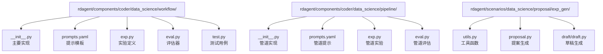
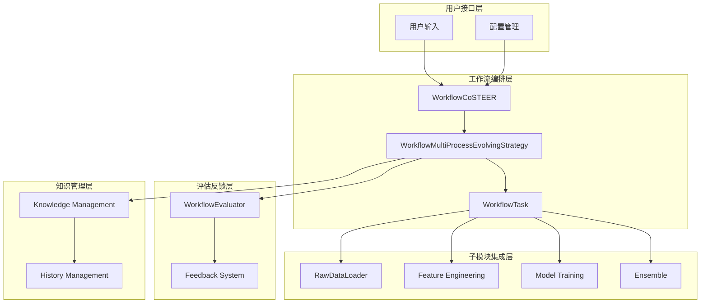
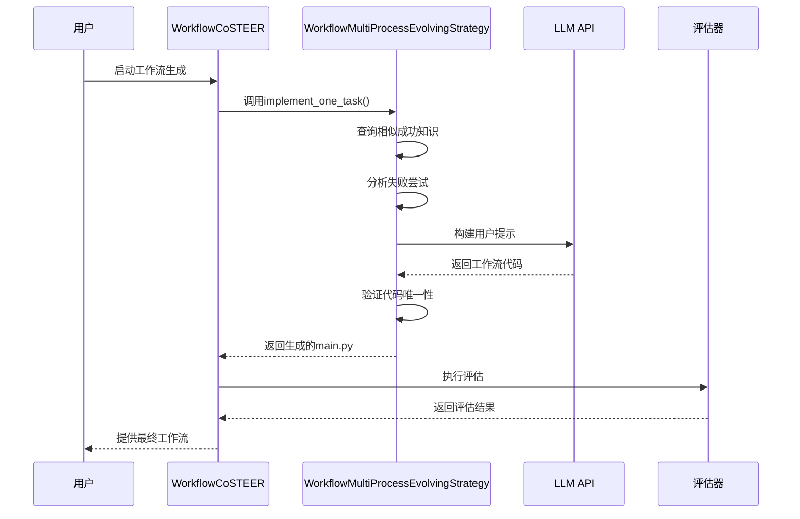
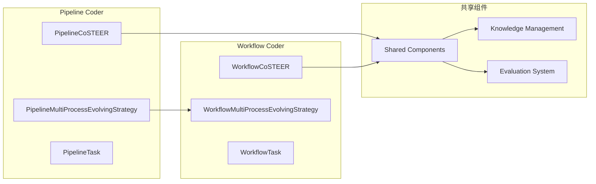
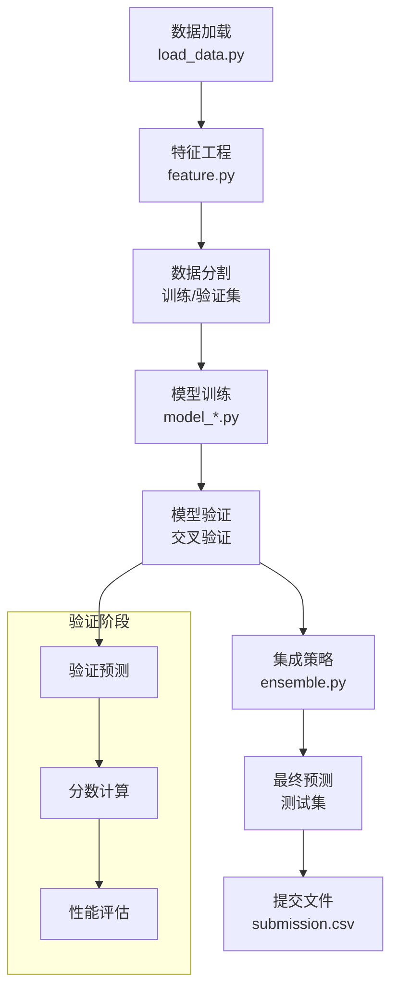
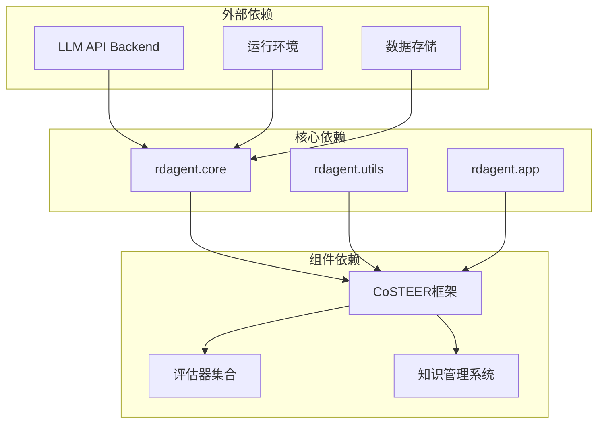
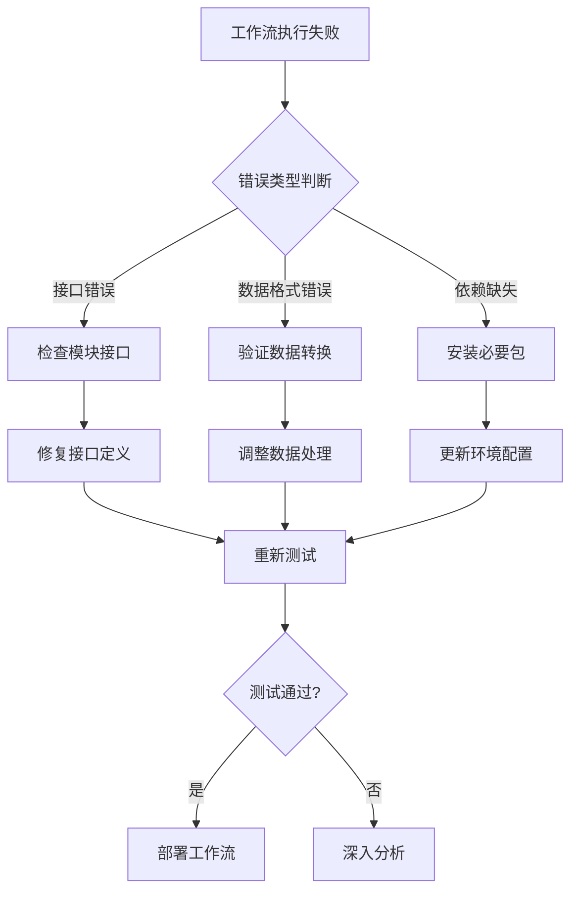
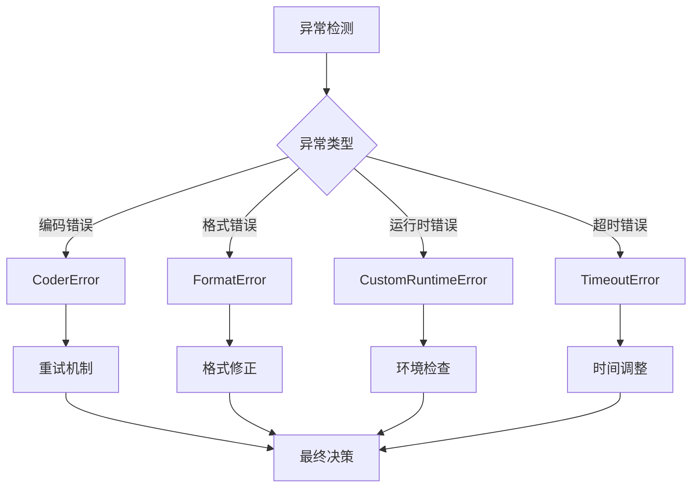

# 工作流编排 Coder API

<cite>
**本文档中引用的文件**
- [rdagent/components/coder/data_science/workflow/__init__.py](file://rdagent/components/coder/data_science/workflow/__init__.py)
- [rdagent/components/coder/data_science/workflow/prompts.yaml](file://rdagent/components/coder/data_science/workflow/prompts.yaml)
- [rdagent/components/coder/data_science/workflow/exp.py](file://rdagent/components/coder/data_science/workflow/exp.py)
- [rdagent/components/coder/data_science/workflow/eval.py](file://rdagent/components/coder/data_science/workflow/eval.py)
- [rdagent/components/coder/data_science/pipeline/__init__.py](file://rdagent/components/coder/data_science/pipeline/__init__.py)
- [rdagent/components/coder/data_science/pipeline/prompts.yaml](file://rdagent/components/coder/data_science/pipeline/prompts.yaml)
- [rdagent/scenarios/data_science/proposal/exp_gen/utils.py](file://rdagent/scenarios/data_science/proposal/exp_gen/utils.py)
- [rdagent/components/coder/data_science/share/doc.py](file://rdagent/components/coder/data_science/share/doc.py)
- [rdagent/scenarios/kaggle/tpl_ex/aerial-cactus-identification/main.py](file://rdagent/scenarios/kaggle/tpl_ex/aerial-cactus-identification/main.py)
- [rdagent/scenarios/kaggle/tpl_ex/aerial-cactus-identification/load_data.py](file://rdagent/scenarios/kaggle/tpl_ex/aerial-cactus-identification/load_data.py)
- [rdagent/scenarios/kaggle/tpl_ex/aerial-cactus-identification/feature.py](file://rdagent/scenarios/kaggle/tpl_ex/aerial-cactus-identification/feature.py)
- [rdagent/scenarios/kaggle/tpl_ex/aerial-cactus-identification/model01.py](file://rdagent/scenarios/kaggle/tpl_ex/aerial-cactus-identification/model01.py)
</cite>

## 目录
1. [简介](#简介)
2. [项目结构](#项目结构)
3. [核心组件](#核心组件)
4. [架构概览](#架构概览)
5. [详细组件分析](#详细组件分析)
6. [依赖关系分析](#依赖关系分析)
7. [性能考虑](#性能考虑)
8. [故障排除指南](#故障排除指南)
9. [结论](#结论)

## 简介

工作流编排Coder（Workflow Coder）是RD-Agent框架中的核心组件，负责将RawDataLoader、Feature、Model和Ensemble等子模块生成的代码片段整合成一个完整的可执行机器学习流水线。该系统通过智能协调各子模块的输出，确保模块间的接口一致性，并生成端到端的训练、验证和预测脚本。

WorkflowCoder类继承自DSCoSTEER基类，采用CoSTEER（Collaborative Software Engineering with Large Language Models and Reinforcement Learning）框架，实现了智能化的工作流生成和优化机制。

## 项目结构

工作流编排Coder的核心文件组织结构如下：

**图表来源**
- [rdagent/components/coder/data_science/workflow/__init__.py](file://rdagent/components/coder/data_science/workflow/__init__.py#L1-L133)
- [rdagent/components/coder/data_science/pipeline/__init__.py](file://rdagent/components/coder/data_science/pipeline/__init__.py#L1-L166)

**章节来源**
- [rdagent/components/coder/data_science/workflow/__init__.py](file://rdagent/components/coder/data_science/workflow/__init__.py#L1-L133)
- [rdagent/components/coder/data_science/pipeline/__init__.py](file://rdagent/components/coder/data_science/pipeline/__init__.py#L1-L166)

## 核心组件

### WorkflowCoSTEER类

WorkflowCoSTEER是工作流编排的核心类，负责协调整个工作流程的生成过程。它继承自DSCoSTEER基类，集成了多进程进化策略和综合评估机制。

主要特性：
- **多进程进化策略**：支持并行处理多个工作流任务
- **综合评估机制**：结合多个评估器进行全方位质量检查
- **知识管理集成**：利用历史成功案例和失败经验优化生成质量

### WorkflowMultiProcessEvolvingStrategy类

该类实现了工作流的多进程进化策略，负责具体的工作流代码生成过程。

核心功能：
- **相似成功知识查询**：从历史成功案例中提取最佳实践
- **失败尝试分析**：分析过往失败原因，避免重复错误
- **代码生成迭代**：通过多次迭代生成高质量的工作流代码

### WorkflowTask类

WorkflowTask是工作流任务的具体实现，继承自CoSTEERTask基类。

**章节来源**
- [rdagent/components/coder/data_science/workflow/__init__.py](file://rdagent/components/coder/data_science/workflow/__init__.py#L88-L133)
- [rdagent/components/coder/data_science/workflow/exp.py](file://rdagent/components/coder/data_science/workflow/exp.py#L1-L15)

## 架构概览

工作流编排系统采用分层架构设计，确保各组件间的松耦合和高内聚：

**图表来源**
- [rdagent/components/coder/data_science/workflow/__init__.py](file://rdagent/components/coder/data_science/workflow/__init__.py#L88-L133)
- [rdagent/components/coder/data_science/workflow/eval.py](file://rdagent/components/coder/data_science/workflow/eval.py#L20-L159)

## 详细组件分析

### coding()方法详解

WorkflowCoder的核心功能体现在coding()方法中，该方法协调各子模块输出，构建完整的机器学习流水线。

#### 方法调用流程

**图表来源**
- [rdagent/components/coder/data_science/workflow/__init__.py](file://rdagent/components/coder/data_science/workflow/__init__.py#L25-L90)

#### 模块间接口一致性保证

WorkflowCoder通过以下机制确保模块间接口的一致性：

1. **标准化输入输出格式**：要求所有子模块遵循统一的数据格式规范
2. **类型检查机制**：验证各模块间传递的数据类型正确性
3. **接口契约验证**：确保函数签名和返回值符合预期
4. **运行时兼容性检查**：在生成代码中添加兼容性验证逻辑

### prompts.yaml模板系统

工作流编排系统使用结构化的提示模板来指导LLM生成高质量的工作流代码。

#### 系统提示模板结构

系统提示模板包含以下关键部分：

| 组件 | 功能 | 描述 |
|------|------|------|
| 任务描述 | 任务理解 | 明确工作流的具体目标和要求 |
| 竞赛信息 | 上下文提供 | 提供比赛背景和数据集信息 |
| 相关信息 | 历史参考 | 包含成功案例和失败经验 |
| 指导原则 | 行为规范 | 定义代码生成的标准和限制 |
| 输出格式 | 结果规范 | 规定生成代码的格式要求 |

#### 用户提示模板结构

用户提示模板整合了各个子模块的代码输出：

| 输入源 | 文件位置 | 用途 |
|--------|----------|------|
| 数据加载代码 | load_data.py | 数据准备和预处理 |
| 特征工程代码 | feature.py | 特征提取和变换 |
| 模型代码 | model_*.py | 多个模型实现 |
| 集成代码 | ensemble.py | 模型融合策略 |
| 最新代码 | main.py | 当前工作流状态 |
| 反馈信息 | latest_code_feedback | 错误修正指导 |

**章节来源**
- [rdagent/components/coder/data_science/workflow/prompts.yaml](file://rdagent/components/coder/data_science/workflow/prompts.yaml#L1-L138)

### Pipeline Coder协同机制

Pipeline Coder与Workflow Coder形成协同工作机制，共同完成端到端的机器学习流水线构建。

#### 协同架构

**图表来源**
- [rdagent/components/coder/data_science/pipeline/__init__.py](file://rdagent/components/coder/data_science/pipeline/__init__.py#L42-L166)
- [rdagent/components/coder/data_science/workflow/__init__.py](file://rdagent/components/coder/data_science/workflow/__init__.py#L88-L133)

#### 协同优势

1. **分工明确**：Pipeline Coder专注于单个模型的完整实现，Workflow Coder负责多模型集成
2. **资源共享**：两个系统共享知识库和评估标准
3. **互补性强**：Pipeline的深度优化能力与Workflow的广度集成能力相结合
4. **质量保证**：双重评估机制确保整体质量

**章节来源**
- [rdagent/components/coder/data_science/pipeline/__init__.py](file://rdagent/components/coder/data_science/pipeline/__init__.py#L42-L166)

### 示例：端到端脚本生成

基于Aerial Cactus识别竞赛的模板，展示工作流编排的实际应用：

#### 典型工作流结构

**图表来源**
- [rdagent/scenarios/kaggle/tpl_ex/aerial-cactus-identification/main.py](file://rdagent/scenarios/kaggle/tpl_ex/aerial-cactus-identification/main.py#L1-L38)

#### 关键集成点

1. **数据流传递**：确保数据在各阶段间的正确传递
2. **参数共享**：特征工程参数在训练和测试阶段的复用
3. **模型选择**：根据验证结果选择最优模型
4. **集成策略**：多种模型的权重分配和组合

**章节来源**
- [rdagent/scenarios/kaggle/tpl_ex/aerial-cactus-identification/main.py](file://rdagent/scenarios/kaggle/tpl_ex/aerial-cactus-identification/main.py#L1-L38)
- [rdagent/scenarios/kaggle/tpl_ex/aerial-cactus-identification/load_data.py](file://rdagent/scenarios/kaggle/tpl_ex/aerial-cactus-identification/load_data.py#L1-L83)
- [rdagent/scenarios/kaggle/tpl_ex/aerial-cactus-identification/feature.py](file://rdagent/scenarios/kaggle/tpl_ex/aerial-cactus-identification/feature.py#L1-L56)
- [rdagent/scenarios/kaggle/tpl_ex/aerial-cactus-identification/model01.py](file://rdagent/scenarios/kaggle/tpl_ex/aerial-cactus-identification/model01.py#L1-L166)

## 依赖关系分析

工作流编排系统的依赖关系体现了模块化设计的优势：

**图表来源**
- [rdagent/components/coder/data_science/workflow/__init__.py](file://rdagent/components/coder/data_science/workflow/__init__.py#L1-L20)

### 模块间耦合度分析

| 组件对 | 耦合类型 | 耦合强度 | 优化建议 |
|--------|----------|----------|----------|
| WorkflowCoder ↔ CoSTEER | 继承关系 | 弱耦合 | 保持现有设计 |
| WorkflowCoder ↔ 子模块 | 接口调用 | 中等耦合 | 标准化接口 |
| 评估器 ↔ 工作流 | 事件驱动 | 弱耦合 | 松散耦合设计 |
| 知识管理 ↔ 生成器 | 数据交换 | 中等耦合 | 缓存机制优化 |

**章节来源**
- [rdagent/components/coder/data_science/workflow/__init__.py](file://rdagent/components/coder/data_science/workflow/__init__.py#L1-L20)

## 性能考虑

### 代码生成效率优化

1. **迭代次数控制**：设置最大重试次数（默认5次）平衡质量和效率
2. **缓存机制**：利用历史成功案例减少重复计算
3. **并行处理**：多进程策略提高生成速度
4. **增量更新**：只修改必要的代码部分

### 内存使用优化

1. **流式处理**：大数据集的分批处理
2. **及时释放**：不再需要的对象及时清理
3. **内存监控**：实时监控内存使用情况
4. **垃圾回收**：主动触发Python垃圾回收机制

### 时间复杂度分析

| 操作 | 时间复杂度 | 空间复杂度 | 优化策略 |
|------|------------|------------|----------|
| 代码生成 | O(n) | O(1) | 并行处理 |
| 知识查询 | O(log n) | O(k) | 索引优化 |
| 评估执行 | O(m) | O(1) | 流水线处理 |
| 反馈分析 | O(n) | O(n) | 分批处理 |

## 故障排除指南

### 常见问题及解决方案

#### 工作流执行失败

**问题症状**：
- 生成的代码无法正常运行
- 模块间接口不匹配
- 数据格式转换错误

**诊断步骤**：
1. 检查子模块输出格式是否符合预期
2. 验证数据类型和形状的一致性
3. 分析错误日志中的具体问题
4. 对比成功案例的差异

**解决方案**：

#### 模块间依赖冲突

**冲突类型**：
1. **版本冲突**：不同模块使用不同版本的依赖包
2. **命名冲突**：函数或变量名重复
3. **接口冲突**：数据格式不兼容
4. **资源冲突**：内存或计算资源竞争

**解决策略**：
- **版本管理**：使用虚拟环境隔离依赖
- **命名空间**：采用模块特定的命名约定
- **适配器模式**：在接口间添加转换层
- **资源调度**：合理分配计算资源

#### 调试工作流执行失败的实用技巧

1. **逐步验证**：逐个模块单独测试
2. **日志分析**：详细记录执行过程
3. **断点调试**：在关键节点设置检查点
4. **单元测试**：为每个模块编写测试用例
5. **可视化分析**：使用图表展示数据流向

**章节来源**
- [rdagent/components/coder/data_science/workflow/eval.py](file://rdagent/components/coder/data_science/workflow/eval.py#L20-L159)

### 错误处理机制

系统内置了完善的错误处理机制：

**图表来源**
- [rdagent/core/exception.py](file://rdagent/core/exception.py#L1-L65)

## 结论

工作流编排Coder作为RD-Agent框架的核心组件，成功实现了机器学习流水线的自动化生成。通过智能协调RawDataLoader、Feature、Model和Ensemble等子模块，该系统能够生成高质量、可执行的端到端脚本。

### 主要优势

1. **智能化集成**：利用LLM的强大推理能力实现智能工作流生成
2. **模块化设计**：清晰的模块边界和标准化接口
3. **知识积累**：持续学习和优化的机制
4. **质量保证**：多重评估和反馈循环
5. **扩展性强**：支持新的子模块和评估标准

### 技术创新

- **CoSTEER框架集成**：结合强化学习和协作软件工程
- **多模态提示模板**：结构化指导LLM生成高质量代码
- **协同工作机制**：Pipeline Coder与Workflow Coder的完美配合
- **智能错误恢复**：基于历史经验的自动纠错机制

### 应用前景

工作流编排Coder为机器学习项目的自动化提供了强有力的支持，特别适用于：
- 快速原型开发
- 大规模模型实验
- 团队协作开发
- 生产环境部署

随着技术的不断发展，该系统将在机器学习工程化领域发挥越来越重要的作用，推动AI项目的标准化和规模化发展。