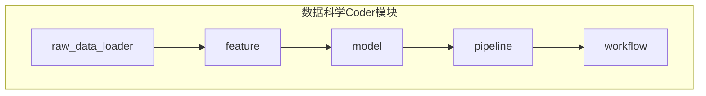
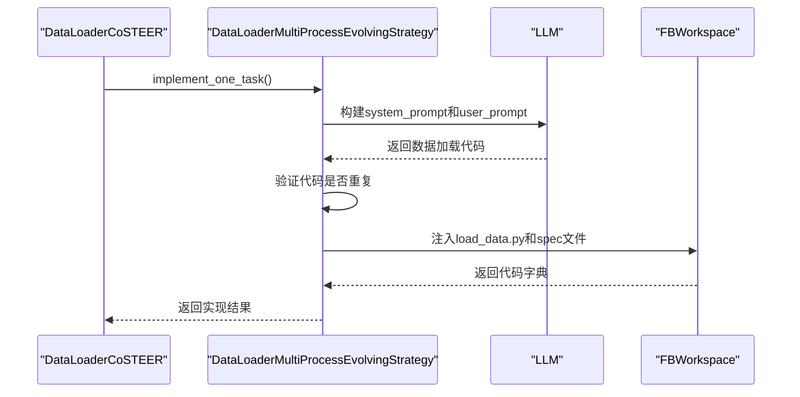
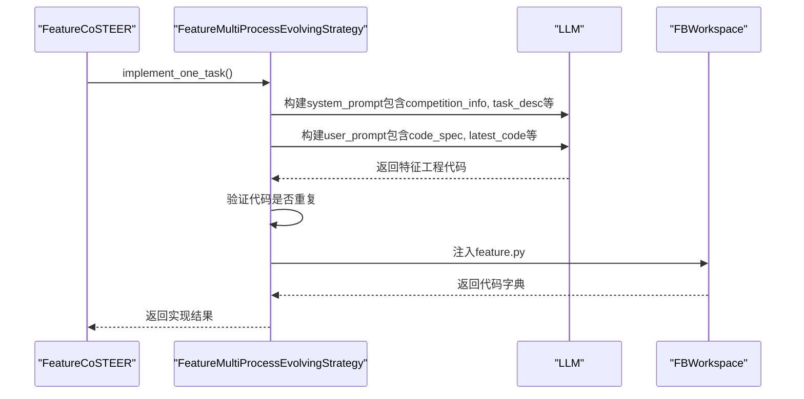
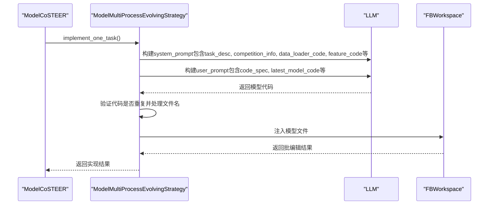
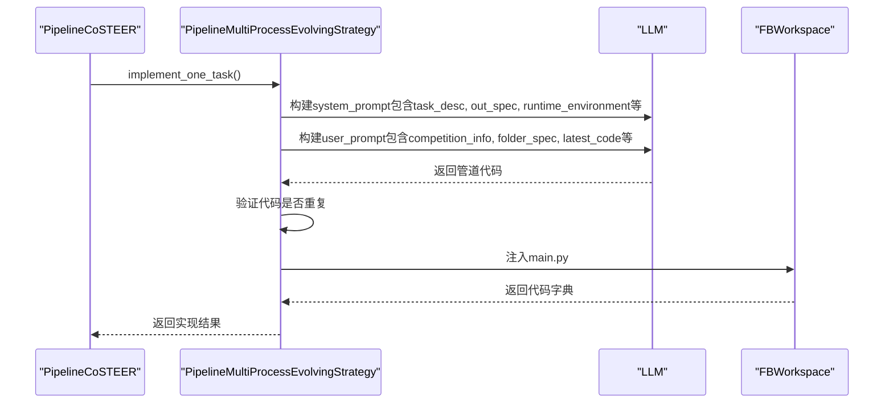
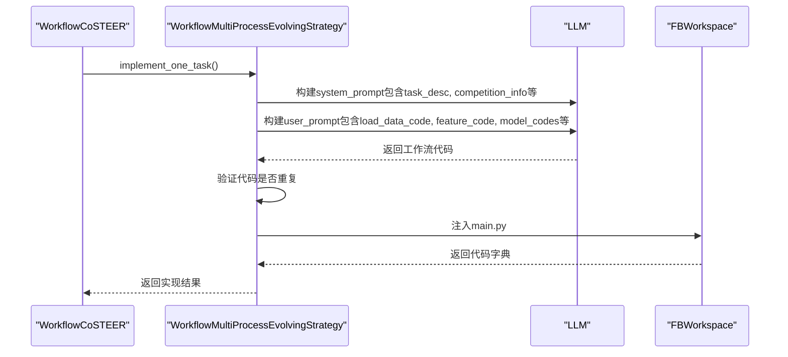
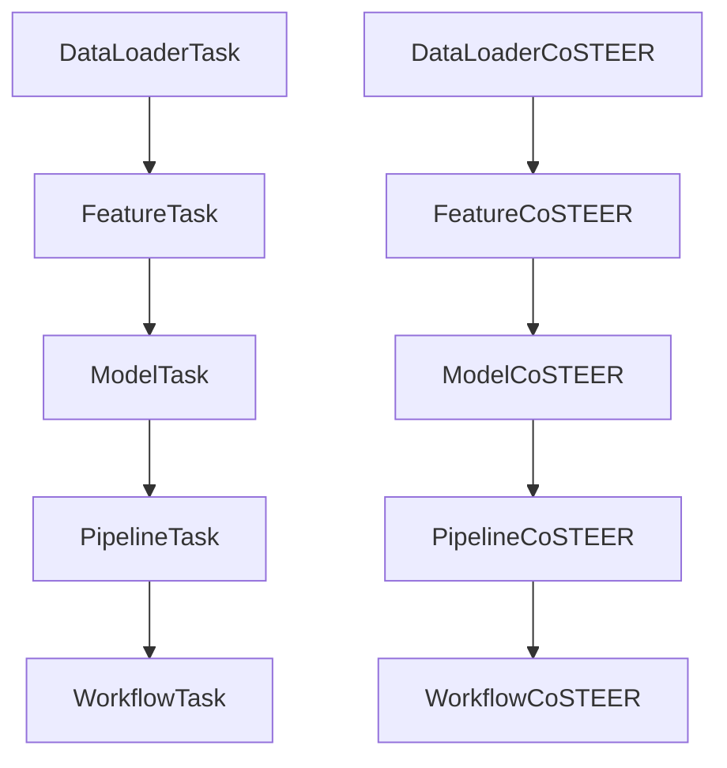

# 数据科学Coder API

<cite>
**本文档引用的文件**  
- [pipeline/__init__.py](file://rdagent/components/coder/data_science/pipeline/__init__.py)
- [feature/__init__.py](file://rdagent/components/coder/data_science/feature/__init__.py)
- [model/__init__.py](file://rdagent/components/coder/data_science/model/__init__.py)
- [raw_data_loader/__init__.py](file://rdagent/components/coder/data_science/raw_data_loader/__init__.py)
- [workflow/__init__.py](file://rdagent/components/coder/data_science/workflow/__init__.py)
- [conf.py](file://rdagent/components/coder/data_science/conf.py)
- [ds_costeer.py](file://rdagent/components/coder/data_science/share/ds_costeer.py)
- [pipeline/exp.py](file://rdagent/components/coder/data_science/pipeline/exp.py)
- [feature/exp.py](file://rdagent/components/coder/data_science/feature/exp.py)
- [model/exp.py](file://rdagent/components/coder/data_science/model/exp.py)
- [raw_data_loader/exp.py](file://rdagent/components/coder/data_science/raw_data_loader/exp.py)
- [workflow/exp.py](file://rdagent/components/coder/data_science/workflow/exp.py)
</cite>

## 目录
1. [引言](#引言)
2. [项目结构](#项目结构)
3. [核心组件](#核心组件)
4. [架构概述](#架构概述)
5. [详细组件分析](#详细组件分析)
6. [依赖分析](#依赖分析)
7. [性能考虑](#性能考虑)
8. [故障排除指南](#故障排除指南)
9. [结论](#结论)

## 引言
本文档详细描述了RD-Agent框架中数据科学场景下的Coder子模块公共接口。这些模块包括pipeline、feature、model、raw_data_loader和workflow，它们共同构成了一个自动化数据科学实验生成系统。每个模块都实现了特定的数据科学任务，从数据加载到特征工程、模型构建、集成策略和工作流编排。系统采用CoSTEER框架进行迭代式代码生成与优化，并通过LLM驱动的提示模板来指导代码生成过程。

## 项目结构
数据科学Coder模块位于`rdagent/components/coder/data_science/`目录下，包含多个子模块：pipeline、feature、model、raw_data_loader和workflow。每个子模块都有独立的实现逻辑，但共享相同的基类和架构模式。这些模块通过继承`DSCoSTEER`类并实现特定的`MultiProcessEvolvingStrategy`来完成各自的任务。

**图示来源**
- [pipeline/__init__.py](file://rdagent/components/coder/data_science/pipeline/__init__.py)
- [feature/__init__.py](file://rdagent/components/coder/data_science/feature/__init__.py)
- [model/__init__.py](file://rdagent/components/coder/data_science/model/__init__.py)
- [raw_data_loader/__init__.py](file://rdagent/components/coder/data_science/raw_data_loader/__init__.py)
- [workflow/__init__.py](file://rdagent/components/coder/data_science/workflow/__init__.py)

**本节来源**
- [pipeline/__init__.py](file://rdagent/components/coder/data_science/pipeline/__init__.py)
- [feature/__init__.py](file://rdagent/components/coder/data_science/feature/__init__.py)
- [model/__init__.py](file://rdagent/components/coder/data_science/model/__init__.py)

## 核心组件
数据科学Coder系统的核心组件包括五个主要模块：raw_data_loader、feature、model、pipeline和workflow。这些模块分别负责数据加载、特征工程、模型构建、管道生成和工作流集成。每个模块都基于CoSTEER框架实现，具有统一的接口设计和演化策略。

**本节来源**
- [pipeline/__init__.py](file://rdagent/components/coder/data_science/pipeline/__init__.py)
- [feature/__init__.py](file://rdagent/components/coder/data_science/feature/__init__.py)
- [model/__init__.py](file://rdagent/components/coder/data_science/model/__init__.py)
- [raw_data_loader/__init__.py](file://rdagent/components/coder/data_science/raw_data_loader/__init__.py)
- [workflow/__init__.py](file://rdagent/components/coder/data_science/workflow/__init__.py)

## 架构概述
整个数据科学Coder系统采用分层架构设计，各模块之间存在明确的依赖关系和职责划分。系统从原始数据加载开始，依次经过特征工程、模型构建、管道生成，最终形成完整的工作流。每个阶段都由对应的Coder模块负责生成和优化代码。

```mermaid
classDiagram
class DSCoSTEER {
+scen : Scenario
+settings : DSCoderCoSTEERSettings
+eva : CoSTEERMultiEvaluator
+es : MultiProcessEvolvingStrategy
+develop(exp) : Experiment
}
class MultiProcessEvolvingStrategy {
+scen : Scenario
+settings : DSCoderCoSTEERSettings
+implement_one_task(target_task, queried_knowledge, workspace, prev_task_feedback) : dict[str, str]
+assign_code_list_to_evo(code_list, evo) : evo
}
class CoSTEERTask {
+name : str
+description : str
+get_task_information() : str
}
DSCoSTEER <|-- PipelineCoSTEER
DSCoSTEER <|-- FeatureCoSTEER
DSCoSTEER <|-- ModelCoSTEER
DSCoSTEER <|-- DataLoaderCoSTEER
DSCoSTEER <|-- WorkflowCoSTEER
MultiProcessEvolvingStrategy <|-- PipelineMultiProcessEvolvingStrategy
MultiProcessEvolvingStrategy <|-- FeatureMultiProcessEvolvingStrategy
MultiProcessEvolvingStrategy <|-- ModelMultiProcessEvolvingStrategy
MultiProcessEvolvingStrategy <|-- DataLoaderMultiProcessEvolvingStrategy
MultiProcessEvolvingStrategy <|-- WorkflowMultiProcessEvolvingStrategy
CoSTEERTask <|-- PipelineTask
CoSTEERTask <|-- FeatureTask
CoSTEERTask <|-- ModelTask
CoSTEERTask <|-- DataLoaderTask
CoSTEERTask <|-- WorkflowTask
```

**图示来源**
- [pipeline/__init__.py](file://rdagent/components/coder/data_science/pipeline/__init__.py)
- [feature/__init__.py](file://rdagent/components/coder/data_science/feature/__init__.py)
- [model/__init__.py](file://rdagent/components/coder/data_science/model/__init__.py)
- [raw_data_loader/__init__.py](file://rdagent/components/coder/data_science/raw_data_loader/__init__.py)
- [workflow/__init__.py](file://rdagent/components/coder/data_science/workflow/__init__.py)
- [conf.py](file://rdagent/components/coder/data_science/conf.py)
- [ds_costeer.py](file://rdagent/components/coder/data_science/share/ds_costeer.py)

## 详细组件分析

### raw_data_loader模块分析
raw_data_loader模块负责生成数据加载代码和相关规范文档。该模块在生成数据加载代码的同时，还会生成其他组件的规范文档（如feature、model等），为后续模块提供指导。

**图示来源**
- [raw_data_loader/__init__.py](file://rdagent/components/coder/data_science/raw_data_loader/__init__.py)
- [raw_data_loader/exp.py](file://rdagent/components/coder/data_science/raw_data_loader/exp.py)

**本节来源**
- [raw_data_loader/__init__.py](file://rdagent/components/coder/data_science/raw_data_loader/__init__.py)
- [raw_data_loader/exp.py](file://rdagent/components/coder/data_science/raw_data_loader/exp.py)

### feature模块分析
feature模块负责特征工程代码的生成。它依赖于已生成的数据加载代码，并根据任务描述和规范生成特征提取代码。

**图示来源**
- [feature/__init__.py](file://rdagent/components/coder/data_science/feature/__init__.py)
- [feature/exp.py](file://rdagent/components/coder/data_science/feature/exp.py)

**本节来源**
- [feature/__init__.py](file://rdagent/components/coder/data_science/feature/__init__.py)
- [feature/exp.py](file://rdagent/components/coder/data_science/feature/exp.py)

### model模块分析
model模块负责模型构建代码的生成。它依赖于数据加载和特征工程代码，并生成具体的机器学习模型实现。

**图示来源**
- [model/__init__.py](file://rdagent/components/coder/data_science/model/__init__.py)
- [model/exp.py](file://rdagent/components/coder/data_science/model/exp.py)

**本节来源**
- [model/__init__.py](file://rdagent/components/coder/data_science/model/__init__.py)
- [model/exp.py](file://rdagent/components/coder/data_science/model/exp.py)

### pipeline模块分析
pipeline模块负责生成端到端的机器学习管道代码。它整合了前面各阶段的输出，生成最终的提交代码。

**图示来源**
- [pipeline/__init__.py](file://rdagent/components/coder/data_science/pipeline/__init__.py)
- [pipeline/exp.py](file://rdagent/components/coder/data_science/pipeline/exp.py)

**本节来源**
- [pipeline/__init__.py](file://rdagent/components/coder/data_science/pipeline/__init__.py)
- [pipeline/exp.py](file://rdagent/components/coder/data_science/pipeline/exp.py)

### workflow模块分析
workflow模块负责工作流的集成和编排。它将各个独立的组件整合成一个完整的工作流。

**图示来源**
- [workflow/__init__.py](file://rdagent/components/coder/data_science/workflow/__init__.py)
- [workflow/exp.py](file://rdagent/components/coder/data_science/workflow/exp.py)

**本节来源**
- [workflow/__init__.py](file://rdagent/components/coder/data_science/workflow/__init__.py)
- [workflow/exp.py](file://rdagent/components/coder/data_science/workflow/exp.py)

## 依赖分析
各Coder模块之间存在明确的依赖关系，形成了一个有向无环图（DAG）。这种依赖关系反映了数据科学工作流的自然顺序：从数据加载开始，经过特征工程和模型构建，最终形成完整的管道和工作流。

**图示来源**
- [pipeline/__init__.py](file://rdagent/components/coder/data_science/pipeline/__init__.py)
- [feature/__init__.py](file://rdagent/components/coder/data_science/feature/__init__.py)
- [model/__init__.py](file://rdagent/components/coder/data_science/model/__init__.py)
- [raw_data_loader/__init__.py](file://rdagent/components/coder/data_science/raw_data_loader/__init__.py)
- [workflow/__init__.py](file://rdagent/components/coder/data_science/workflow/__init__.py)

**本节来源**
- [pipeline/__init__.py](file://rdagent/components/coder/data_science/pipeline/__init__.py)
- [feature/__init__.py](file://rdagent/components/coder/data_science/feature/__init__.py)
- [model/__init__.py](file://rdagent/components/coder/data_science/model/__init__.py)
- [raw_data_loader/__init__.py](file://rdagent/components/coder/data_science/raw_data_loader/__init__.py)
- [workflow/__init__.py](file://rdagent/components/coder/data_science/workflow/__init__.py)

## 性能考虑
系统在设计时考虑了多个性能优化点。首先，通过`max_loop`参数限制了最大迭代次数，防止无限循环。其次，使用`get_develop_max_seconds`方法根据场景的调试超时设置开发时间限制。此外，系统还支持缓存机制和知识查询，避免重复工作。环境配置方面，系统支持Docker和Conda两种环境类型，可以根据需要选择最适合的执行环境。

## 故障排除指南
当系统遇到问题时，可以检查以下几个方面：首先确认配置文件中的`spec_enabled`设置是否正确；其次检查LLM调用是否成功，可以通过查看日志中的错误信息来定位问题；最后确保所有依赖模块都已经正确生成并注入到工作空间中。对于代码重复问题，系统内置了检测机制，如果连续五次生成相同的代码，将会抛出CoderError异常。

**本节来源**
- [pipeline/__init__.py](file://rdagent/components/coder/data_science/pipeline/__init__.py)
- [feature/__init__.py](file://rdagent/components/coder/data_science/feature/__init__.py)
- [model/__init__.py](file://rdagent/components/coder/data_science/model/__init__.py)
- [raw_data_loader/__init__.py](file://rdagent/components/coder/data_science/raw_data_loader/__init__.py)
- [workflow/__init__.py](file://rdagent/components/coder/data_science/workflow/__init__.py)

## 结论
本文档详细描述了RD-Agent框架中数据科学Coder模块的架构和实现。通过分析五个核心模块（pipeline、feature、model、raw_data_loader和workflow），我们了解了它们的抽象基类继承关系、`coding()`方法的具体实现逻辑以及对应的提示模板结构。这些模块通过清晰的职责划分和协作机制，共同完成了从数据加载到工作流编排的完整数据科学任务。系统采用CoSTEER框架进行迭代式代码生成与优化，结合LLM驱动的提示模板，能够自动生成符合Kaggle或通用数据科学任务要求的Python脚本。