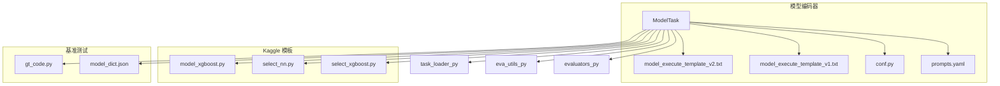
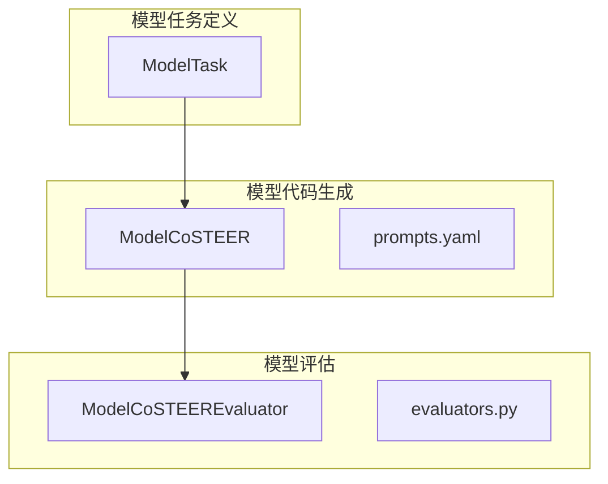
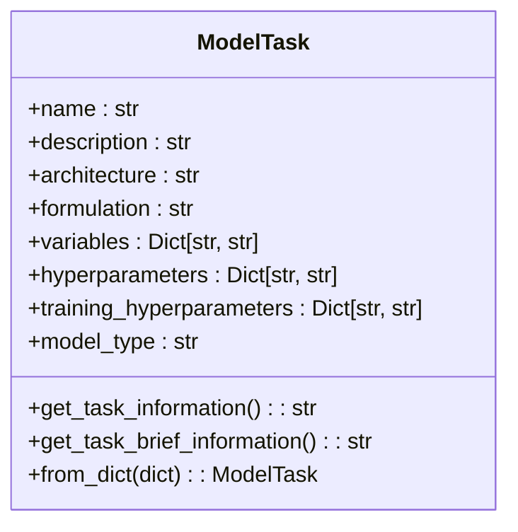
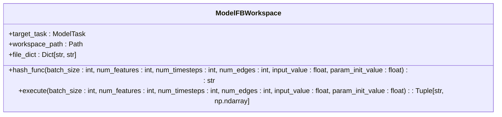
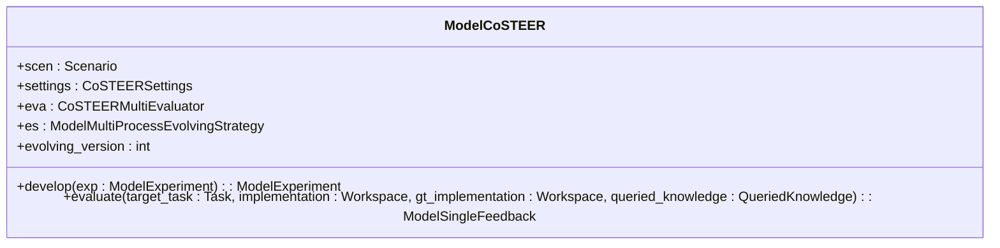
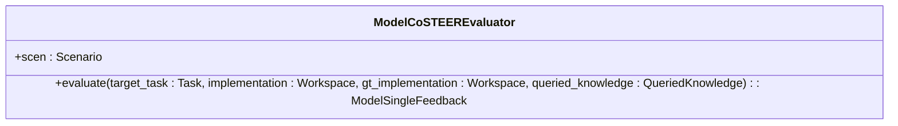
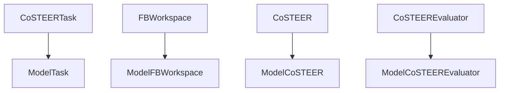

# 模型构建 Coder API

<cite>
**本文档中引用的文件**  
- [model.py](file://rdagent/components/coder/model_coder/model.py)
- [prompts.yaml](file://rdagent/components/coder/model_coder/prompts.yaml)
- [conf.py](file://rdagent/components/coder/model_coder/conf.py)
- [model_execute_template_v1.txt](file://rdagent/components/coder/model_coder/model_execute_template_v1.txt)
- [model_execute_template_v2.txt](file://rdagent/components/coder/model_coder/model_execute_template_v2.txt)
- [evaluators.py](file://rdagent/components/coder/model_coder/evaluators.py)
- [eva_utils.py](file://rdagent/components/coder/model_coder/eva_utils.py)
- [task_loader.py](file://rdagent/components/coder/model_coder/task_loader.py)
- [select_xgboost.py](file://rdagent/scenarios/kaggle/experiment/templates/playground-series-s4e9/model/select_xgboost.py)
- [select_nn.py](file://rdagent/scenarios/kaggle/experiment/templates/digit-recognizer/model/select_nn.py)
- [model_xgboost.py](file://rdagent/scenarios/kaggle/experiment/templates/sf-crime/model/model_xgboost.py)
- [model_dict.json](file://rdagent/components/coder/model_coder/benchmark/model_dict.json)
- [gt_code.py](file://rdagent/components/coder/model_coder/gt_code.py)
</cite>

## 目录
1. [简介](#简介)
2. [项目结构](#项目结构)
3. [核心组件](#核心组件)
4. [架构概述](#架构概述)
5. [详细组件分析](#详细组件分析)
6. [依赖分析](#依赖分析)
7. [性能考虑](#性能考虑)
8. [故障排除指南](#故障排除指南)
9. [结论](#结论)

## 简介
本文档全面阐述了`ModelCoder`类的接口设计及其在自动化机器学习实验中的作用。`ModelCoder`通过`coding()`方法将实验中的模型假设转化为可执行的训练与评估代码，支持多种算法如XGBoost、LightGBM和神经网络。文档详细解析了`prompts.yaml`中定义的模型架构描述、超参数配置和训练循环模板的结构，并展示了如何生成不同算法的实现代码。此外，还说明了模型选择逻辑（如`select_xgboost.py`）的集成方式、错误处理机制（如模型收敛失败）、与特征输出的接口兼容性，以及支持的评估指标扩展方法。

## 项目结构
本项目采用模块化设计，主要分为以下几个部分：
- `components/coder/model_coder`：包含模型编码器的核心逻辑，包括模型任务定义、执行模板、提示配置等。
- `scenarios/kaggle/experiment/templates`：提供Kaggle竞赛模板，包含不同算法的模型和选择逻辑示例。
- `components/coder/model_coder/benchmark`：包含基准测试数据和评估脚本，用于验证模型实现的正确性。

**图示来源**
- [model.py](file://rdagent/components/coder/model_coder/model.py#L1-L164)
- [prompts.yaml](file://rdagent/components/coder/model_coder/prompts.yaml#L1-L156)
- [conf.py](file://rdagent/components/coder/model_coder/conf.py#L1-L39)
- [model_execute_template_v1.txt](file://rdagent/components/coder/model_coder/model_execute_template_v1.txt#L1-L45)
- [model_execute_template_v2.txt](file://rdagent/components/coder/model_coder/model_execute_template_v2.txt#L1-L25)
- [evaluators.py](file://rdagent/components/coder/model_coder/evaluators.py#L1-L105)
- [eva_utils.py](file://rdagent/components/coder/model_coder/eva_utils.py#L1-L108)
- [task_loader.py](file://rdagent/components/coder/model_coder/task_loader.py#L1-L129)
- [select_xgboost.py](file://rdagent/scenarios/kaggle/experiment/templates/playground-series-s4e9/model/select_xgboost.py#L1-L13)
- [select_nn.py](file://rdagent/scenarios/kaggle/experiment/templates/digit-recognizer/model/select_nn.py#L1-L13)
- [model_xgboost.py](file://rdagent/scenarios/kaggle/experiment/templates/sf-crime/model/model_xgboost.py#L1-L37)
- [model_dict.json](file://rdagent/components/coder/model_coder/benchmark/model_dict.json#L1-L80)
- [gt_code.py](file://rdagent/components/coder/model_coder/gt_code.py#L1-L137)

**节来源**
- [model.py](file://rdagent/components/coder/model_coder/model.py#L1-L164)
- [prompts.yaml](file://rdagent/components/coder/model_coder/prompts.yaml#L1-L156)
- [conf.py](file://rdagent/components/coder/model_coder/conf.py#L1-L39)
- [model_execute_template_v1.txt](file://rdagent/components/coder/model_coder/model_execute_template_v1.txt#L1-L45)
- [model_execute_template_v2.txt](file://rdagent/components/coder/model_coder/model_execute_template_v2.txt#L1-L25)
- [evaluators.py](file://rdagent/components/coder/model_coder/evaluators.py#L1-L105)
- [eva_utils.py](file://rdagent/components/coder/model_coder/eva_utils.py#L1-L108)
- [task_loader.py](file://rdagent/components/coder/model_coder/task_loader.py#L1-L129)
- [select_xgboost.py](file://rdagent/scenarios/kaggle/experiment/templates/playground-series-s4e9/model/select_xgboost.py#L1-L13)
- [select_nn.py](file://rdagent/scenarios/kaggle/experiment/templates/digit-recognizer/model/select_nn.py#L1-L13)
- [model_xgboost.py](file://rdagent/scenarios/kaggle/experiment/templates/sf-crime/model/model_xgboost.py#L1-L37)
- [model_dict.json](file://rdagent/components/coder/model_coder/benchmark/model_dict.json#L1-L80)
- [gt_code.py](file://rdagent/components/coder/model_coder/gt_code.py#L1-L137)

## 核心组件
`ModelCoder`的核心组件包括`ModelTask`、`ModelFBWorkspace`、`ModelCoSTEER`和`ModelCoSTEEREvaluator`。`ModelTask`定义了模型任务的基本信息，如名称、描述、架构、超参数等。`ModelFBWorkspace`负责模型代码的执行和反馈收集。`ModelCoSTEER`是模型编码器的主要类，负责协调模型任务的生成和执行。`ModelCoSTEEREvaluator`则负责评估模型实现的正确性。

**节来源**
- [model.py](file://rdagent/components/coder/model_coder/model.py#L1-L164)
- [evaluators.py](file://rdagent/components/coder/model_coder/evaluators.py#L1-L105)

## 架构概述
`ModelCoder`的架构分为三个主要部分：模型任务定义、模型代码生成和模型评估。模型任务定义通过`ModelTask`类完成，包含模型的名称、描述、架构、超参数等信息。模型代码生成通过`ModelCoSTEER`类完成，利用`prompts.yaml`中的提示模板生成具体的模型代码。模型评估通过`ModelCoSTEEREvaluator`类完成，利用`evaluators.py`中的评估逻辑验证模型实现的正确性。

**图示来源**
- [model.py](file://rdagent/components/coder/model_coder/model.py#L1-L164)
- [prompts.yaml](file://rdagent/components/coder/model_coder/prompts.yaml#L1-L156)
- [evaluators.py](file://rdagent/components/coder/model_coder/evaluators.py#L1-L105)

**节来源**
- [model.py](file://rdagent/components/coder/model_coder/model.py#L1-L164)
- [prompts.yaml](file://rdagent/components/coder/model_coder/prompts.yaml#L1-L156)
- [evaluators.py](file://rdagent/components/coder/model_coder/evaluators.py#L1-L105)

## 详细组件分析
### ModelTask 分析
`ModelTask`类定义了模型任务的基本信息，包括名称、描述、架构、超参数等。这些信息用于生成具体的模型代码。

**图示来源**
- [model.py](file://rdagent/components/coder/model_coder/model.py#L1-L164)

**节来源**
- [model.py](file://rdagent/components/coder/model_coder/model.py#L1-L164)

### ModelFBWorkspace 分析
`ModelFBWorkspace`类负责模型代码的执行和反馈收集。它通过`execute`方法运行模型代码，并返回执行反馈和模型输出。

**图示来源**
- [model.py](file://rdagent/components/coder/model_coder/model.py#L1-L164)

**节来源**
- [model.py](file://rdagent/components/coder/model_coder/model.py#L1-L164)

### ModelCoSTEER 分析
`ModelCoSTEER`类是模型编码器的主要类，负责协调模型任务的生成和执行。它通过`develop`方法生成模型代码，并通过`evaluate`方法评估模型实现的正确性。

**图示来源**
- [model.py](file://rdagent/components/coder/model_coder/__init__.py#L1-L22)
- [evaluators.py](file://rdagent/components/coder/model_coder/evaluators.py#L1-L105)

**节来源**
- [model.py](file://rdagent/components/coder/model_coder/__init__.py#L1-L22)
- [evaluators.py](file://rdagent/components/coder/model_coder/evaluators.py#L1-L105)

### ModelCoSTEEREvaluator 分析
`ModelCoSTEEREvaluator`类负责评估模型实现的正确性。它通过`evaluate`方法检查模型代码是否符合模型信息和场景描述，并返回评估反馈。

**图示来源**
- [evaluators.py](file://rdagent/components/coder/model_coder/evaluators.py#L1-L105)

**节来源**
- [evaluators.py](file://rdagent/components/coder/model_coder/evaluators.py#L1-L105)

## 依赖分析
`ModelCoder`的依赖关系如下：
- `ModelTask`依赖于`CoSTEERTask`，用于定义模型任务的基本信息。
- `ModelFBWorkspace`依赖于`FBWorkspace`，用于执行模型代码和收集反馈。
- `ModelCoSTEER`依赖于`CoSTEER`，用于协调模型任务的生成和执行。
- `ModelCoSTEEREvaluator`依赖于`CoSTEEREvaluator`，用于评估模型实现的正确性。

**图示来源**
- [model.py](file://rdagent/components/coder/model_coder/model.py#L1-L164)
- [evaluators.py](file://rdagent/components/coder/model_coder/evaluators.py#L1-L105)

**节来源**
- [model.py](file://rdagent/components/coder/model_coder/model.py#L1-L164)
- [evaluators.py](file://rdagent/components/coder/model_coder/evaluators.py#L1-L105)

## 性能考虑
`ModelCoder`在设计时考虑了性能优化，主要体现在以下几个方面：
- **缓存机制**：`ModelFBWorkspace`使用`cache_with_pickle`装饰器对`execute`方法的结果进行缓存，避免重复计算。
- **并行执行**：`ModelCoSTEER`支持多进程演化策略，可以并行生成和评估多个模型任务。
- **资源管理**：`ModelFBWorkspace`通过`get_model_env`函数管理执行环境，支持本地conda环境和Docker容器两种模式。

## 故障排除指南
### 模型收敛失败
如果模型在训练过程中无法收敛，可以尝试以下方法：
- 调整学习率和批量大小。
- 增加训练轮数。
- 使用不同的优化器和损失函数。
- 检查数据预处理步骤，确保数据质量。

### 接口兼容性问题
如果模型代码与特征输出不兼容，可以检查以下几点：
- 确保特征选择逻辑（如`select_xgboost.py`）正确处理输入数据。
- 确保模型输入和输出的维度匹配。
- 使用`model_execute_template_v1.txt`或`model_execute_template_v2.txt`中的模板代码进行调试。

### 评估指标扩展
如果需要扩展支持的评估指标，可以在`eva_utils.py`中添加新的评估函数，并在`ModelFinalEvaluator`中调用这些函数。

**节来源**
- [model.py](file://rdagent/components/coder/model_coder/model.py#L1-L164)
- [evaluators.py](file://rdagent/components/coder/model_coder/evaluators.py#L1-L105)
- [eva_utils.py](file://rdagent/components/coder/model_coder/eva_utils.py#L1-L108)

## 结论
`ModelCoder`是一个强大的自动化机器学习工具，能够将实验中的模型假设转化为可执行的训练与评估代码。通过详细的接口设计和灵活的配置选项，`ModelCoder`支持多种算法和场景，能够有效提高模型开发的效率和质量。未来的工作可以进一步优化性能，增加更多的评估指标和支持的算法。