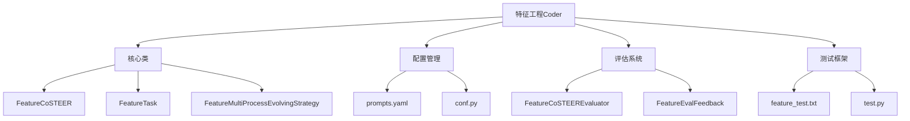
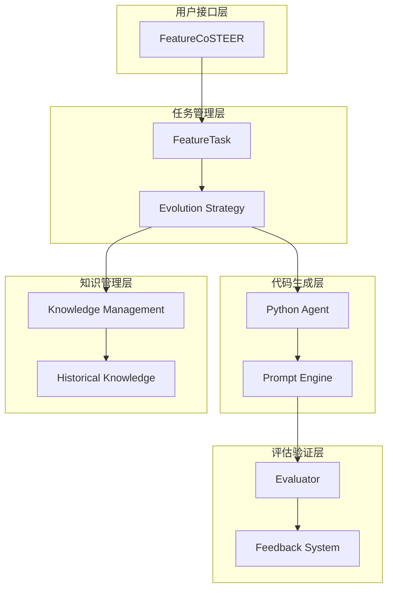
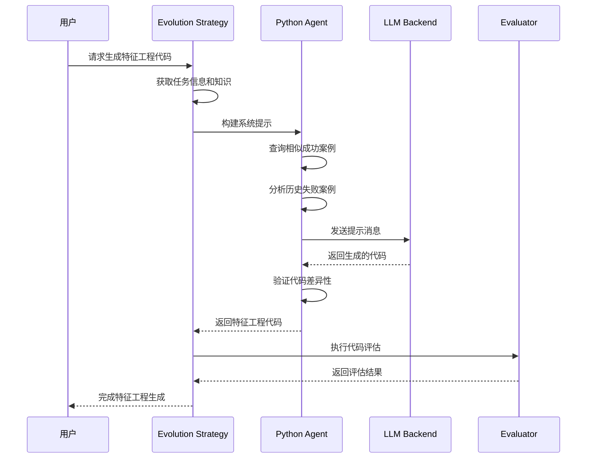
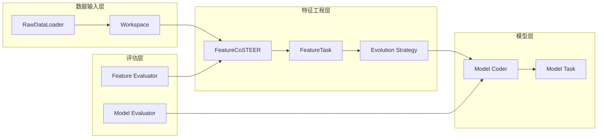
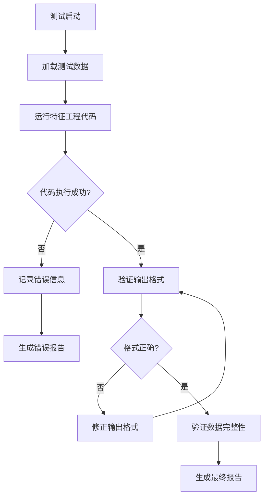

# 特征工程 Coder API 技术文档

<cite>
**本文档引用的文件**
- [__init__.py](file://rdagent/components/coder/data_science/feature/__init__.py)
- [exp.py](file://rdagent/components/coder/data_science/feature/exp.py)
- [eval.py](file://rdagent/components/coder/data_science/feature/eval.py)
- [prompts.yaml](file://rdagent/components/coder/data_science/feature/prompts.yaml)
- [test.py](file://rdagent/components/coder/data_science/feature/test.py)
- [feature_test.txt](file://rdagent/components/coder/data_science/feature/eval_tests/feature_test.txt)
- [raw_data_loader/__init__.py](file://rdagent/components/coder/data_science/raw_data_loader/__init__.py)
- [ds_costeer.py](file://rdagent/components/coder/data_science/share/ds_costeer.py)
- [conf.py](file://rdagent/app/data_science/conf.py)
</cite>

## 目录
1. [简介](#简介)
2. [项目结构](#项目结构)
3. [核心组件](#核心组件)
4. [架构概览](#架构概览)
5. [详细组件分析](#详细组件分析)
6. [数据流依赖](#数据流依赖)
7. [性能考虑](#性能考虑)
8. [故障排除指南](#故障排除指南)
9. [结论](#结论)

## 简介

特征工程Coder组件是RD-Agent数据科学框架中的核心模块，负责基于实验假设（Hypothesis）自动生成特征提取代码。该组件采用基于LLM的提示工程策略，通过CoSTEER进化算法实现特征工程方案的迭代优化。

特征工程Coder的核心功能包括：
- 基于实验假设生成特征提取代码
- 集成外部特征库和自定义变换逻辑
- 与RawDataLoader和Model Coder形成完整的数据流水线
- 提供调试和性能优化支持

## 项目结构

特征工程Coder组件在项目中的组织结构如下：

**图表来源**
- [__init__.py](file://rdagent/components/coder/data_science/feature/__init__.py#L1-L141)
- [exp.py](file://rdagent/components/coder/data_science/feature/exp.py#L1-L14)
- [eval.py](file://rdagent/components/coder/data_science/feature/eval.py#L1-L85)

**章节来源**
- [__init__.py](file://rdagent/components/coder/data_science/feature/__init__.py#L1-L141)
- [exp.py](file://rdagent/components/coder/data_science/feature/exp.py#L1-L14)

## 核心组件

### FeatureCoSTEER类

FeatureCoSTEER是特征工程Coder的主要入口点，继承自DSCoSTEER基类，实现了数据科学场景下的特征工程自动化。

主要特性：
- 基于CoSTEER进化算法的特征工程方案生成
- 支持多进程并行处理提高效率
- 集成知识管理系统避免重复错误
- 提供完整的评估反馈循环

### FeatureTask类

FeatureTask继承自CoSTEERTask，专门用于表示特征工程任务。它封装了特征工程任务的所有必要信息，包括任务描述、目标信息等。

### FeatureMultiProcessEvolvingStrategy类

该类实现了特征工程任务的多进程演化策略，包含以下关键方法：

- `implement_one_task()`: 执行单个特征工程任务的完整流程
- `assign_code_list_to_evo()`: 将生成的代码分配给进化过程

**章节来源**
- [__init__.py](file://rdagent/components/coder/data_science/feature/__init__.py#L15-L141)
- [exp.py](file://rdagent/components/coder/data_science/feature/exp.py#L10-L14)

## 架构概览

特征工程Coder的整体架构采用分层设计，确保各组件间的松耦合和高内聚：

**图表来源**
- [__init__.py](file://rdagent/components/coder/data_science/feature/__init__.py#L15-L50)
- [eval.py](file://rdagent/components/coder/data_science/feature/eval.py#L20-L60)

## 详细组件分析

### coding()方法执行流程

FeatureMultiProcessEvolvingStrategy的`implement_one_task()`方法是特征工程代码生成的核心，其执行流程如下：

**图表来源**
- [__init__.py](file://rdagent/components/coder/data_science/feature/__init__.py#L25-L95)

#### 关键步骤详解

1. **任务信息获取**：从目标任务中提取特征工程相关信息
2. **知识查询**：查询相似成功的特征工程案例和历史失败案例
3. **提示构建**：基于查询到的知识构建系统和用户提示
4. **代码生成**：调用LLM生成特征工程代码
5. **质量检查**：确保生成的代码与之前版本不同
6. **反馈循环**：通过评估器验证代码质量和效果

### LLM提示工程实现

特征工程Coder使用精心设计的提示模板来指导LLM生成高质量的特征工程代码：

#### 系统提示模板结构

系统提示包含以下关键部分：

1. **角色定位**：定义数据科学家和机器学习工程师的角色
2. **任务描述**：明确当前特征工程任务的目标
3. **竞争信息**：提供比赛或项目的背景信息
4. **相关知识**：整合成功案例和失败经验
5. **编码指南**：提供具体的编码规范和最佳实践
6. **输出格式**：规定返回结果的格式要求

#### 变量占位符和约束条件

提示模板中使用了丰富的变量占位符：

- `{{ task_desc }}`: 任务描述信息
- `{{ competition_info }}`: 竞赛或项目信息
- `{{ data_loader_code }}`: 数据加载器代码
- `{{ queried_similar_successful_knowledge }}`: 成功案例列表
- `{{ queried_former_failed_knowledge }}`: 失败案例列表

约束条件包括：
- 避免列删除的谨慎原则
- 使用joblib缓存装饰器
- 不使用logging模块，改用print函数
- 支持批处理文件路径修改

**章节来源**
- [prompts.yaml](file://rdagent/components/coder/data_science/feature/prompts.yaml#L1-L132)
- [__init__.py](file://rdagent/components/coder/data_science/feature/__init__.py#L60-L95)

### 特征工程策略

特征工程Coder支持多种特征工程策略，通过提示工程实现不同的处理方式：

#### 编码策略
- **分类特征编码**：处理类别型特征的编码转换
- **数值特征标准化**：进行特征缩放和归一化
- **时间特征提取**：从时间戳中提取有用的时序特征

#### 构造策略
- **交互特征**：创建特征间的交互项
- **多项式特征**：生成特征的多项式组合
- **统计特征**：计算特征的统计摘要

#### 选择策略
- **过滤方法**：基于统计指标选择重要特征
- **包装方法**：基于模型性能选择特征子集
- **嵌入方法**：使用降维技术提取特征

### 外部特征库集成

特征工程Coder支持与外部特征库的集成，主要通过以下方式：

1. **自定义变换器**：允许用户定义自己的特征变换逻辑
2. **第三方库集成**：支持sklearn、category_encoders等常用库
3. **缓存机制**：利用joblib缓存避免重复计算
4. **批处理支持**：支持对多个文件路径进行批量特征工程

**章节来源**
- [prompts.yaml](file://rdagent/components/coder/data_science/feature/prompts.yaml#L40-L50)

## 数据流依赖

特征工程Coder与系统其他组件形成完整的数据流水线：

**图表来源**
- [raw_data_loader/__init__.py](file://rdagent/components/coder/data_science/raw_data_loader/__init__.py#L200-L242)
- [__init__.py](file://rdagent/components/coder/data_science/feature/__init__.py#L120-L141)

### 与RawDataLoader的集成

RawDataLoader负责数据预处理和初步特征提取，其输出作为特征工程Coder的输入：

1. **数据格式标准化**：确保输入数据符合预期格式
2. **特征类型识别**：自动识别数值、类别、文本等特征类型
3. **缺失值处理**：提供基本的缺失值填充策略
4. **数据分割**：提供训练集、验证集和测试集的划分

### 与Model Coder的协作

特征工程Coder与Model Coder形成闭环反馈：

1. **特征质量评估**：Model Coder的性能反馈影响特征工程策略
2. **模型需求适配**：根据模型特点调整特征工程方案
3. **迭代优化**：基于模型表现持续改进特征工程

**章节来源**
- [raw_data_loader/__init__.py](file://rdagent/components/coder/data_science/raw_data_loader/__init__.py#L200-L242)
- [__init__.py](file://rdagent/components/coder/data_science/feature/__init__.py#L120-L141)

## 性能考虑

### 并行处理优化

特征工程Coder采用多进程并行处理策略提升性能：

- **任务并行化**：同时处理多个特征工程任务
- **资源隔离**：每个进程独立运行避免资源冲突
- **负载均衡**：动态分配任务确保系统高效利用

### 缓存策略

为了提高效率和减少重复计算：

1. **joblib缓存**：自动缓存特征工程结果
2. **知识库复用**：重用历史成功案例
3. **增量更新**：只重新计算变化的部分

### 内存管理

- **工作空间隔离**：每个任务使用独立的工作空间
- **临时文件清理**：自动清理生成的临时文件
- **内存监控**：监控内存使用防止溢出

**章节来源**
- [__init__.py](file://rdagent/components/coder/data_science/feature/__init__.py#L25-L50)
- [ds_costeer.py](file://rdagent/components/coder/data_science/share/ds_costeer.py#L1-L10)

## 故障排除指南

### 常见问题及解决方案

#### 特征生成失败

**症状**：特征工程代码生成失败或返回空结果

**排查步骤**：
1. 检查输入数据格式是否正确
2. 验证提示模板中的变量是否正确填充
3. 查看历史失败案例寻找共性问题
4. 调整LLM参数或提示内容

**解决方案**：
- 增加更多的上下文信息
- 提供更具体的任务描述
- 使用更简单的初始假设

#### 代码质量问题

**症状**：生成的特征工程代码存在语法错误或逻辑问题

**排查步骤**：
1. 运行内置测试脚本验证代码完整性
2. 检查数据类型和形状匹配
3. 验证特征工程逻辑的合理性

**解决方案**：
- 增强代码验证规则
- 提供更详细的错误反馈
- 实现代码自动修复机制

#### 性能问题

**症状**：特征工程过程耗时过长

**排查步骤**：
1. 监控内存使用情况
2. 检查是否存在无限循环
3. 分析I/O操作的瓶颈

**解决方案**：
- 实现超时控制机制
- 优化缓存策略
- 并行化处理大量数据

### 调试工具和技巧

#### 测试框架

特征工程Coder提供了完整的测试框架：

**图表来源**
- [feature_test.txt](file://rdagent/components/coder/data_science/feature/eval_tests/feature_test.txt#L50-L115)

#### 日志和监控

- **详细日志记录**：记录每个步骤的执行情况
- **性能指标监控**：跟踪执行时间和资源使用
- **错误追踪**：自动捕获和报告异常

**章节来源**
- [eval.py](file://rdagent/components/coder/data_science/feature/eval.py#L30-L85)
- [feature_test.txt](file://rdagent/components/coder/data_science/feature/eval_tests/feature_test.txt#L1-L115)

### 性能优化建议

#### 提示工程优化

1. **精简提示内容**：移除冗余信息提高响应速度
2. **结构化提示**：使用清晰的格式组织提示内容
3. **示例驱动**：提供具体的成功案例作为参考

#### 系统级优化

1. **资源配置**：合理分配CPU和内存资源
2. **网络优化**：优化LLM API调用频率
3. **存储优化**：使用高效的文件存储策略

#### 算法级优化

1. **启发式搜索**：使用智能搜索策略减少尝试次数
2. **知识引导**：基于历史知识指导新任务
3. **渐进式改进**：从简单方案开始逐步优化

**章节来源**
- [conf.py](file://rdagent/app/data_science/conf.py#L1-L207)

## 结论

特征工程Coder组件是RD-Agent框架中的关键创新，它通过LLM驱动的自动化特征工程实现了数据科学工作的智能化升级。该组件的主要优势包括：

1. **自动化程度高**：完全自动化的特征工程代码生成
2. **质量保证**：基于CoSTEER算法的迭代优化机制
3. **可扩展性强**：支持多种特征工程策略和外部库集成
4. **易于调试**：完善的测试框架和错误处理机制

未来发展方向：
- **领域特定优化**：针对不同数据类型和应用场景的专门优化
- **实时学习能力**：根据实际应用效果动态调整特征工程策略
- **可视化支持**：提供特征工程过程的可视化界面
- **社区生态建设**：建立特征工程最佳实践的共享平台

特征工程Coder不仅提高了数据科学工作的效率，更为整个领域的自动化发展奠定了坚实基础。