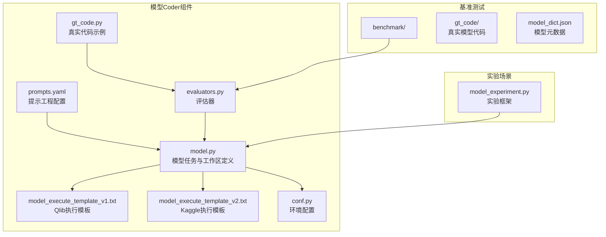
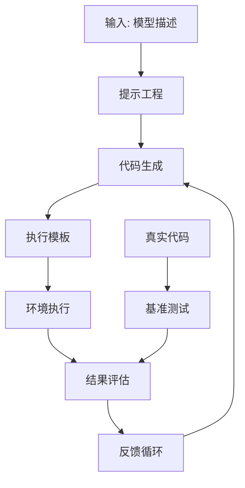
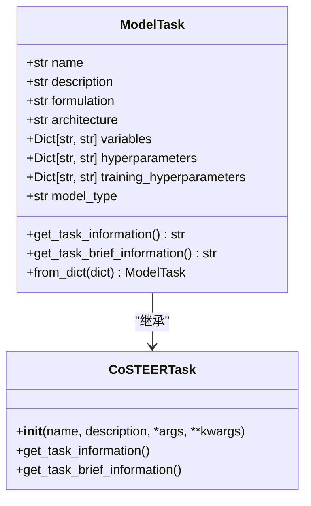
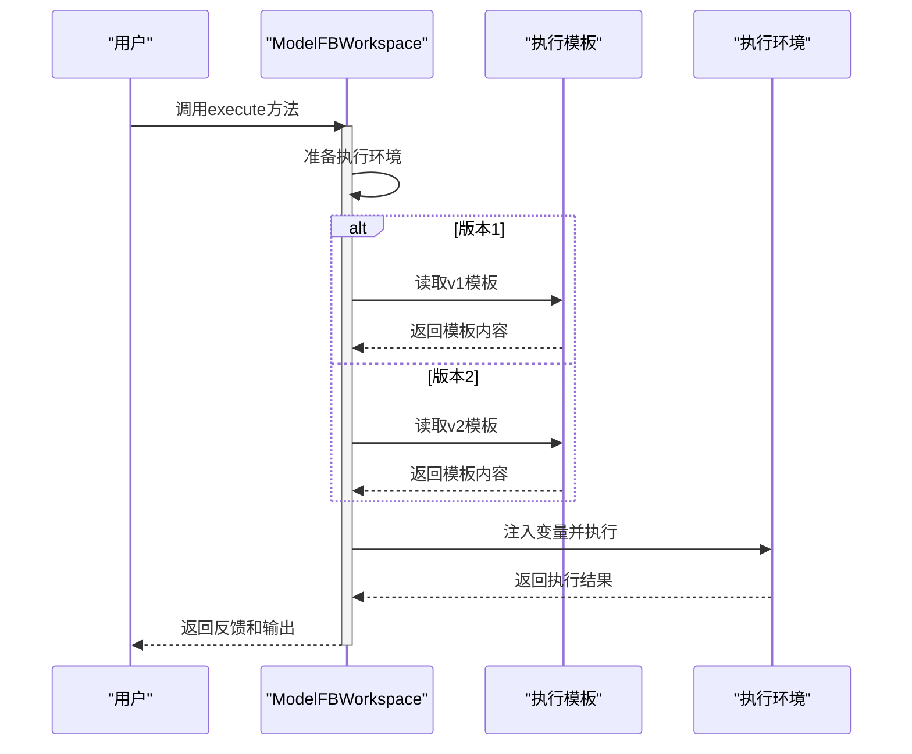
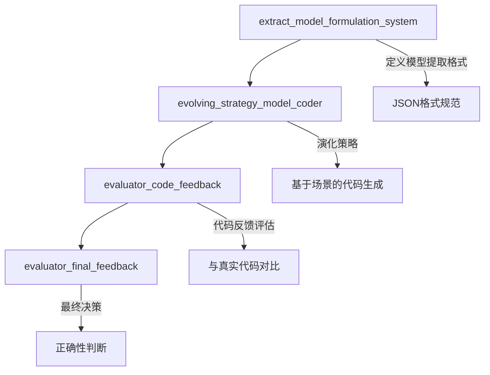
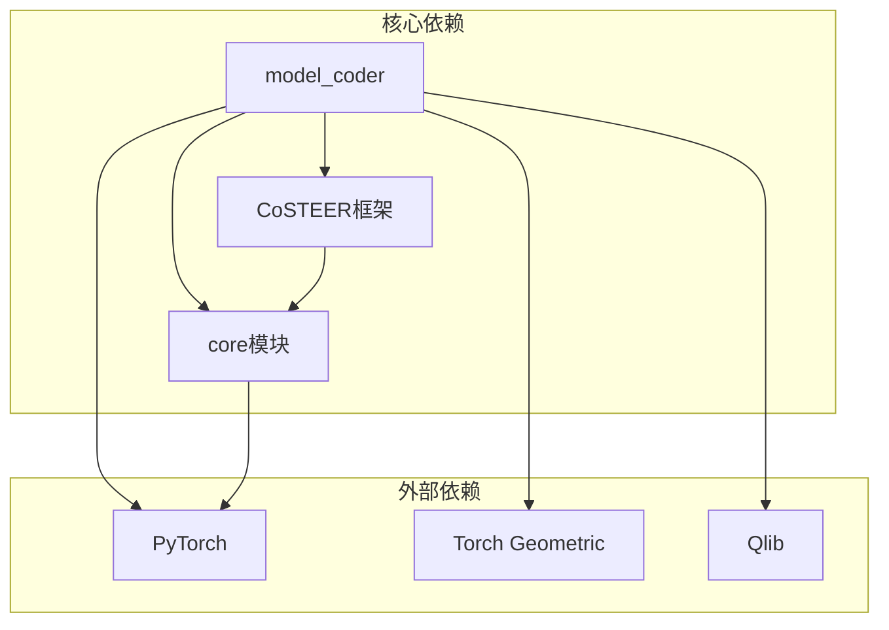

# 模型Coder API

<cite>
**本文档中引用的文件**  
- [model.py](file://rdagent/components/coder/model_coder/model.py)
- [prompts.yaml](file://rdagent/components/coder/model_coder/prompts.yaml)
- [model_execute_template_v1.txt](file://rdagent/components/coder/model_coder/model_execute_template_v1.txt)
- [model_execute_template_v2.txt](file://rdagent/components/coder/model_coder/model_execute_template_v2.txt)
- [conf.py](file://rdagent/components/coder/model_coder/conf.py)
- [evaluators.py](file://rdagent/components/coder/model_coder/evaluators.py)
- [gt_code.py](file://rdagent/components/coder/model_coder/gt_code.py)
- [model_dict.json](file://rdagent/components/coder/model_coder/benchmark/model_dict.json)
- [pmlp.py](file://rdagent/components/coder/model_coder/benchmark/gt_code/pmlp.py)
- [gpsconv.py](file://rdagent/components/coder/model_coder/benchmark/gt_code/gpsconv.py)
- [visnet.py](file://rdagent/components/coder/model_coder/benchmark/gt_code/visnet.py)
- [eval.py](file://rdagent/app/benchmark/model/eval.py)
- [model_experiment.py](file://rdagent/scenarios/qlib/experiment/model_experiment.py)
</cite>

## 目录
1. [简介](#简介)
2. [项目结构](#项目结构)
3. [核心组件](#核心组件)
4. [架构概述](#架构概述)
5. [详细组件分析](#详细组件分析)
6. [依赖分析](#依赖分析)
7. [性能考量](#性能考量)
8. [故障排除指南](#故障排除指南)
9. [结论](#结论)

## 简介
模型Coder是RD-Agent框架中的一个关键组件，专门用于在量化金融和通用建模场景下生成基于PyTorch或Qlib的深度学习模型代码。该系统通过结合提示工程、执行模板和基准测试模块，能够从简单MLP到复杂图神经网络（如GPSConv、VisNet）等多种模型架构生成高质量的代码。本文档详细说明了其接口设计、代码生成机制以及与ModelProposal和ModelRunner的集成路径。

## 项目结构
模型Coder的代码主要位于`rdagent/components/coder/model_coder/`目录下，其结构清晰地划分了不同功能模块。核心文件包括模型定义、执行模板、配置文件和评估器等。

**图源**  
- [model.py](file://rdagent/components/coder/model_coder/model.py#L1-L163)
- [conf.py](file://rdagent/components/coder/model_coder/conf.py#L1-L38)
- [model_execute_template_v1.txt](file://rdagent/components/coder/model_coder/model_execute_template_v1.txt#L1-L45)
- [model_execute_template_v2.txt](file://rdagent/components/coder/model_coder/model_execute_template_v2.txt#L1-L25)

**本节来源**  
- [model.py](file://rdagent/components/coder/model_coder/model.py#L1-L163)
- [conf.py](file://rdagent/components/coder/model_coder/conf.py#L1-L38)

## 核心组件
模型Coder的核心组件包括模型任务定义、执行模板机制、提示工程设计和评估框架。这些组件协同工作，确保生成的模型代码既符合规范又能正确执行。

**本节来源**  
- [model.py](file://rdagent/components/coder/model_coder/model.py#L1-L163)
- [prompts.yaml](file://rdagent/components/coder/model_coder/prompts.yaml#L1-L155)

## 架构概述
模型Coder采用分层架构设计，将模型生成过程分解为多个独立但相互关联的步骤。这种设计提高了系统的可维护性和扩展性。

**图源**  
- [model.py](file://rdagent/components/coder/model_coder/model.py#L1-L163)
- [prompts.yaml](file://rdagent/components/coder/model_coder/prompts.yaml#L1-L155)
- [evaluators.py](file://rdagent/components/coder/model_coder/evaluators.py#L1-L104)

## 详细组件分析

### 模型结构定义分析
模型结构定义是模型Coder的核心功能之一，它通过`ModelTask`类来封装模型的各种属性和参数。

**图源**  
- [model.py](file://rdagent/components/coder/model_coder/model.py#L10-L80)

**本节来源**  
- [model.py](file://rdagent/components/coder/model_coder/model.py#L10-L80)

### 执行模板变量替换机制
执行模板机制通过`ModelFBWorkspace.execute`方法实现，根据不同的版本选择相应的模板并进行变量替换。

**图源**  
- [model.py](file://rdagent/components/coder/model_coder/model.py#L82-L163)
- [model_execute_template_v1.txt](file://rdagent/components/coder/model_coder/model_execute_template_v1.txt#L1-L45)
- [model_execute_template_v2.txt](file://rdagent/components/coder/model_coder/model_execute_template_v2.txt#L1-L25)

**本节来源**  
- [model.py](file://rdagent/components/coder/model_coder/model.py#L82-L163)

### 提示工程设计原理
提示工程通过`prompts.yaml`文件定义，包含多个关键部分，用于指导模型代码的生成。

**图源**  
- [prompts.yaml](file://rdagent/components/coder/model_coder/prompts.yaml#L1-L155)

**本节来源**  
- [prompts.yaml](file://rdagent/components/coder/model_coder/prompts.yaml#L1-L155)

## 依赖分析
模型Coder与其他组件之间存在复杂的依赖关系，这些依赖确保了整个系统的协同工作。

**图源**  
- [model.py](file://rdagent/components/coder/model_coder/model.py#L1-L163)
- [conf.py](file://rdagent/components/coder/model_coder/conf.py#L1-L38)

**本节来源**  
- [model.py](file://rdagent/components/coder/model_coder/model.py#L1-L163)
- [conf.py](file://rdagent/components/coder/model_coder/conf.py#L1-L38)

## 性能考量
模型Coder在设计时充分考虑了性能因素，特别是在代码执行和评估方面。

**本节来源**  
- [model.py](file://rdagent/components/coder/model_coder/model.py#L82-L163)
- [evaluators.py](file://rdagent/components/coder/model_coder/evaluators.py#L1-L104)

## 故障排除指南
当模型代码生成或执行出现问题时，可以参考以下常见问题及解决方案。

**本节来源**  
- [model.py](file://rdagent/components/coder/model_coder/model.py#L82-L163)
- [evaluators.py](file://rdagent/components/coder/model_coder/evaluators.py#L1-L104)

## 结论
模型Coder通过集成先进的提示工程、灵活的执行模板和严格的评估框架，为量化金融和通用建模场景提供了强大的模型代码生成能力。其与ModelProposal和ModelRunner的无缝集成，使得整个RD-Agent系统能够高效地完成从模型设计到实现的全过程。