# Proposal组件API文档

<cite>
**本文档中引用的文件**
- [rdagent/components/proposal/prompts.yaml](file://rdagent/components/proposal/prompts.yaml)
- [rdagent/core/proposal.py](file://rdagent/core/proposal.py)
- [rdagent/scenarios/data_science/proposal/exp_gen/merge.py](file://rdagent/scenarios/data_science/proposal/exp_gen/merge.py)
- [rdagent/scenarios/data_science/proposal/exp_gen/proposal.py](file://rdagent/scenarios/data_science/proposal/exp_gen/proposal.py)
- [rdagent/scenarios/data_science/proposal/exp_gen/base.py](file://rdagent/scenarios/data_science/proposal/exp_gen/base.py)
- [rdagent/scenarios/data_science/proposal/exp_gen/diversity_strategy.py](file://rdagent/scenarios/data_science/proosal/exp_gen/diversity_strategy.py)
- [rdagent/scenarios/data_science/proposal/exp_gen/prompts.yaml](file://rdagent/scenarios/data_science/proposal/exp_gen/prompts.yaml)
- [rdagent/scenarios/data_science/proposal/exp_gen/utils.py](file://rdagent/scenarios/data_science/proposal/exp_gen/utils.py)
- [rdagent/scenarios/data_science/proposal/exp_gen/select/submit.py](file://rdagent/scenarios/data_science/proposal/exp_gen/select/submit.py)
- [rdagent/scenarios/qlib/proposal/factor_proposal.py](file://rdagent/scenarios/qlib/proposal/factor_proposal.py)
- [rdagent/scenarios/qlib/proposal/model_proposal.py](file://rdagent/scenarios/qlib/proposal/model_proposal.py)
- [rdagent/app/data_science/loop.py](file://rdagent/app/data_science/loop.py)
- [rdagent/app/qlib_rd_loop/quant.py](file://rdagent/app/qlib_rd_loop/quant.py)
- [rdagent/app/data_science/conf.py](file://rdagent/app/data_science/conf.py)
</cite>

## 目录
1. [简介](#简介)
2. [系统架构概览](#系统架构概览)
3. [核心接口与数据结构](#核心接口与数据结构)
4. [提案生成策略体系](#提案生成策略体系)
5. [数据科学场景实现](#数据科学场景实现)
6. [量化金融场景实现](#量化金融场景实现)
7. [提示工程与配置](#提示工程与配置)
8. [多样性控制机制](#多样性控制机制)
9. [提案合并与优先级调度](#提案合并与优先级调度)
10. [知识库交互](#知识库交互)
11. [性能优化与最佳实践](#性能优化与最佳实践)
12. [故障排除指南](#故障排除指南)

## 简介

Proposal组件是RD-Agent系统中负责创意生成的核心模块，作为"研究"循环驱动器，专门负责生成新的实验假设和优化方向。该组件通过智能提示工程、多策略提案生成和动态优先级调度，为数据科学和量化金融领域的自动化研发提供强大的创意引擎。

### 核心功能特性

- **智能假设生成**：基于历史实验反馈和领域知识生成创新性假设
- **多场景适配**：支持数据科学竞赛和量化金融研究两大核心场景
- **多样性控制**：通过多种策略确保提案的多样性和探索深度
- **动态优先级**：根据实验结果自动调整提案优先级和选择策略
- **知识融合**：与KnowledgeBase深度集成，实现知识的持续积累和传承

## 系统架构概览

Proposal组件采用分层架构设计，包含策略层、执行层和基础设施层，形成了完整的提案生成生态系统。

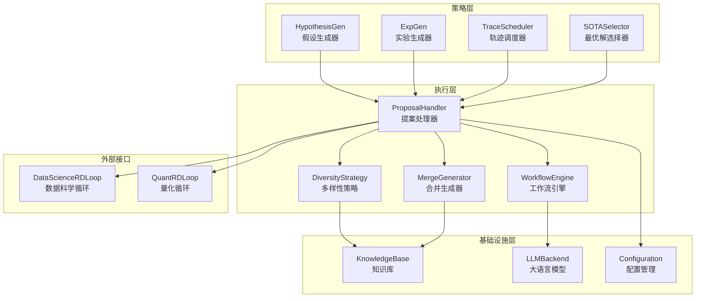

**图表来源**
- [rdagent/core/proposal.py](file://rdagent/core/proposal.py#L1-L390)
- [rdagent/scenarios/data_science/proposal/exp_gen/base.py](file://rdagent/scenarios/data_science/proposal/exp_gen/base.py#L1-L349)

## 核心接口与数据结构

### Hypothesis类

Hypothesis类是提案系统的核心数据结构，封装了假设的所有相关信息。

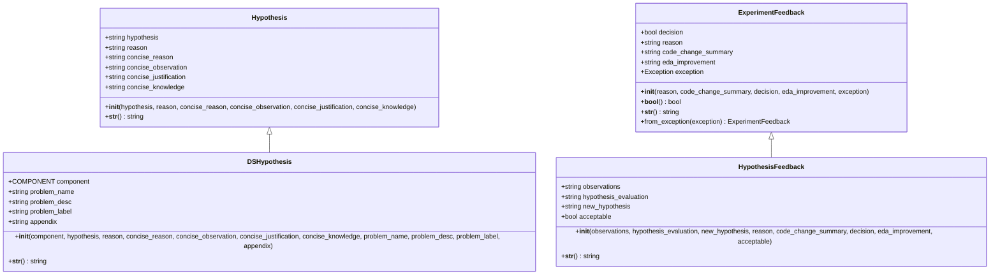

**图表来源**
- [rdagent/core/proposal.py](file://rdagent/core/proposal.py#L25-L100)
- [rdagent/scenarios/data_science/proposal/exp_gen/base.py](file://rdagent/scenarios/data_science/proposal/exp_gen/base.py#L10-L50)

### 核心抽象接口

Proposal组件定义了多个核心抽象接口，确保不同场景下的统一性和可扩展性。

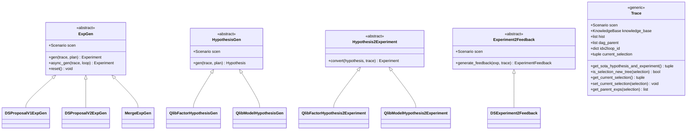

**图表来源**
- [rdagent/core/proposal.py](file://rdagent/core/proposal.py#L250-L390)

**章节来源**
- [rdagent/core/proposal.py](file://rdagent/core/proposal.py#L25-L390)
- [rdagent/scenarios/data_science/proposal/exp_gen/base.py](file://rdagent/scenarios/data_science/proposal/exp_gen/base.py#L10-L100)

## 提案生成策略体系

### 假设生成策略

Proposal组件实现了多层次的假设生成策略，从简单的启发式方法到复杂的AI驱动方案。

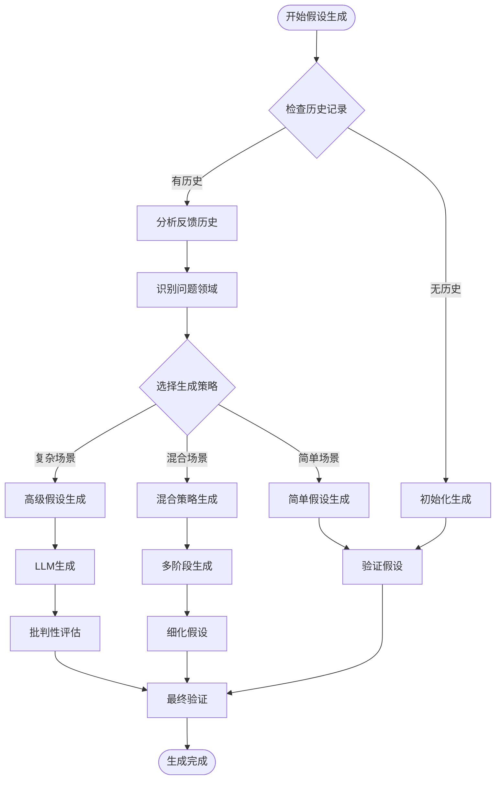

**图表来源**
- [rdagent/scenarios/data_science/proposal/exp_gen/proposal.py](file://rdagent/scenarios/data_science/proposal/exp_gen/proposal.py#L600-L800)

### 实验生成策略

实验生成策略根据当前状态和目标动态选择最适合的生成方法。

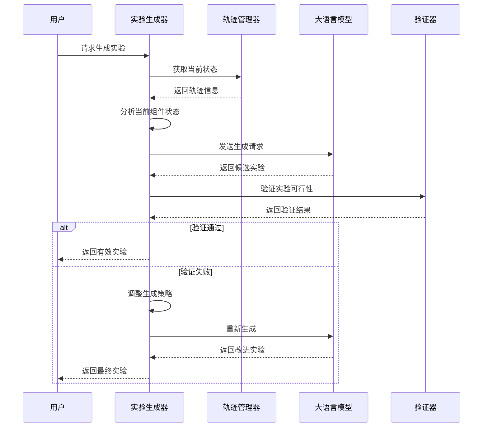

**图表来源**
- [rdagent/scenarios/data_science/proposal/exp_gen/proposal.py](file://rdagent/scenarios/data_science/proposal/exp_gen/proposal.py#L400-L600)

**章节来源**
- [rdagent/scenarios/data_science/proposal/exp_gen/proposal.py](file://rdagent/scenarios/data_science/proposal/exp_gen/proposal.py#L400-L800)

## 数据科学场景实现

### DSProposalV2ExpGen核心算法

DSProposalV2ExpGen是数据科学场景中最先进的提案生成器，采用多阶段推理和批判性思维方法。

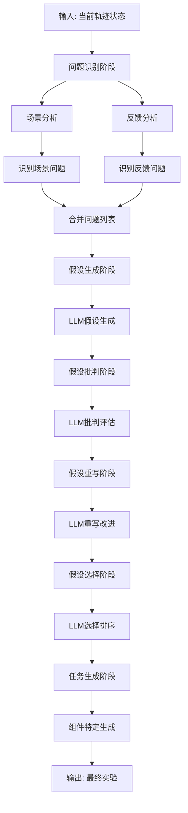

**图表来源**
- [rdagent/scenarios/data_science/proposal/exp_gen/proposal.py](file://rdagent/scenarios/data_science/proposal/exp_gen/proposal.py#L800-L1200)

### 组件分解与任务生成

数据科学场景中的提案生成遵循严格的组件分解流程，确保每个实验都有明确的目标和可执行的任务。

| 组件类型 | 描述 | 生成策略 | 输出格式 |
|---------|------|----------|----------|
| DataLoadSpec | 数据加载规范 | 基于数据特征分析 | JSON格式的加载描述 |
| FeatureEng | 特征工程 | 基于统计分析和领域知识 | 详细的特征处理计划 |
| Model | 模型构建 | 基于性能基准和算法匹配 | 完整的模型配置 |
| Ensemble | 集成方法 | 基于模型组合策略 | 集成算法和权重分配 |
| Workflow | 工作流程 | 基于最佳实践和效率优化 | 流程图和执行顺序 |

**章节来源**
- [rdagent/scenarios/data_science/proposal/exp_gen/proposal.py](file://rdagent/scenarios/data_science/proposal/exp_gen/proposal.py#L800-L1502)
- [rdagent/scenarios/data_science/proposal/exp_gen/utils.py](file://rdagent/scenarios/data_science/proposal/exp_gen/utils.py#L1-L106)

## 量化金融场景实现

### 因子提案生成

量化金融场景中的因子提案生成专注于技术指标和市场信号的创新组合。

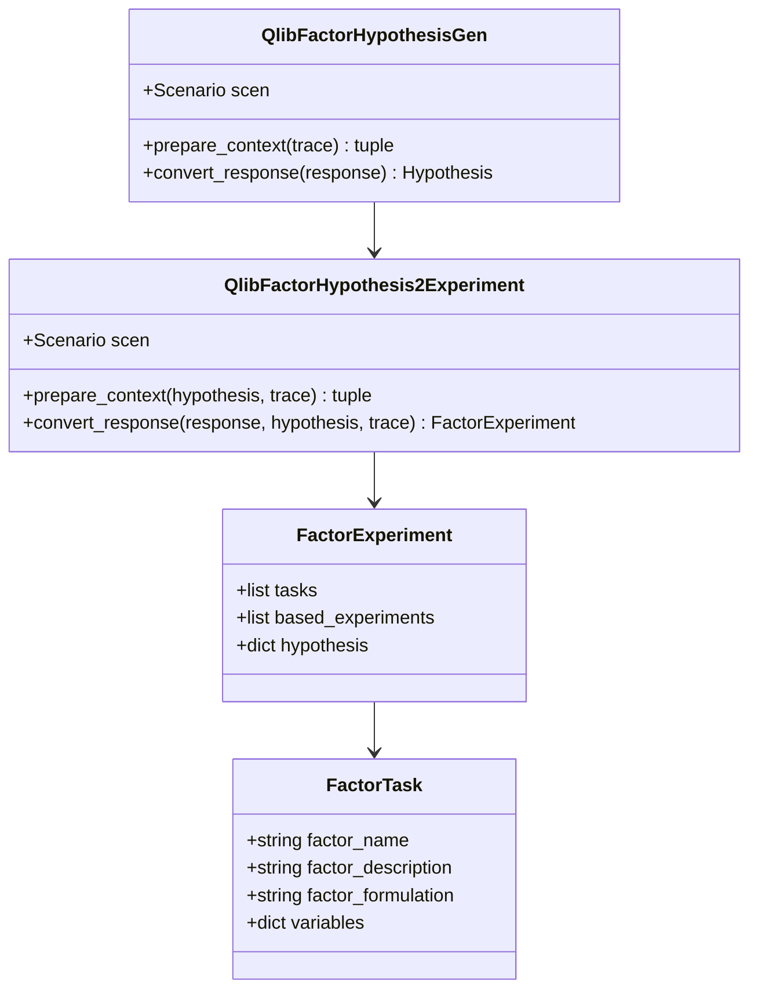

**图表来源**
- [rdagent/scenarios/qlib/proposal/factor_proposal.py](file://rdagent/scenarios/qlib/proposal/factor_proposal.py#L1-L133)

### 模型提案生成

模型提案生成针对量化金融的特殊需求，考虑时间序列特性和计算效率。

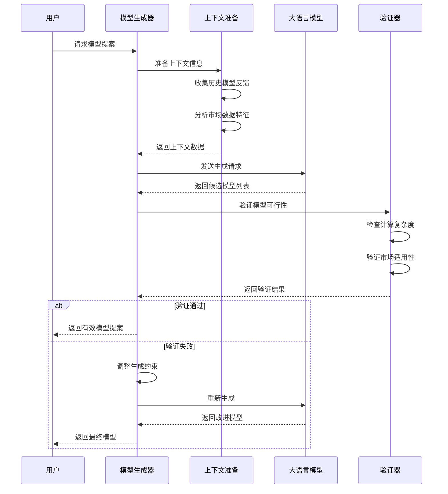

**图表来源**
- [rdagent/scenarios/qlib/proposal/model_proposal.py](file://rdagent/scenarios/qlib/proposal/model_proposal.py#L1-L160)

**章节来源**
- [rdagent/scenarios/qlib/proposal/factor_proposal.py](file://rdagent/scenarios/qlib/proposal/factor_proposal.py#L1-L133)
- [rdagent/scenarios/qlib/proposal/model_proposal.py](file://rdagent/scenarios/qlib/proposal/model_proposal.py#L1-L160)

## 提示工程与配置

### 提示模板系统

Proposal组件采用高度模块化的提示模板系统，支持动态内容注入和多语言本地化。

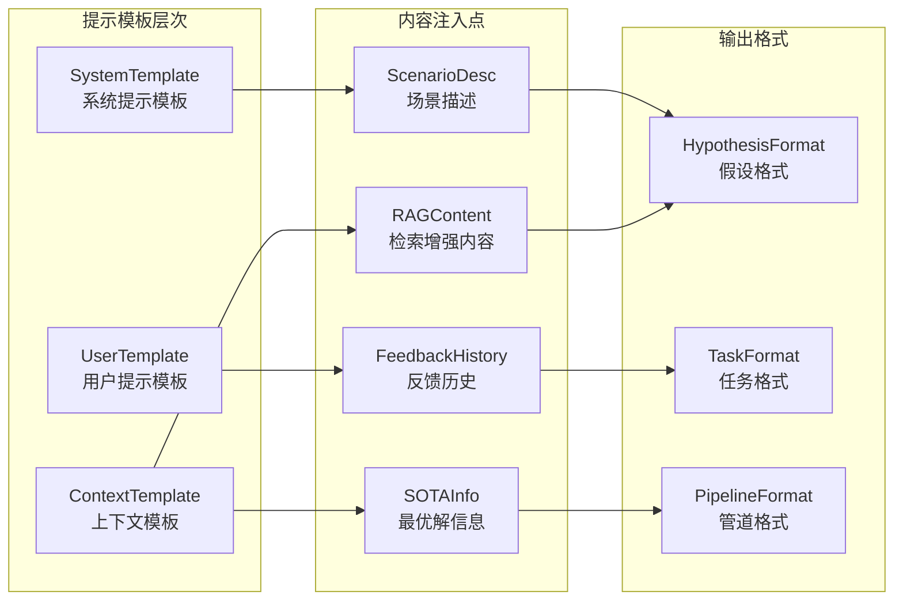

**图表来源**
- [rdagent/components/proposal/prompts.yaml](file://rdagent/components/proposal/prompts.yaml#L1-L65)
- [rdagent/scenarios/data_science/proposal/exp_gen/prompts.yaml](file://rdagent/scenarios/data_science/proposal/exp_gen/prompts.yaml#L1-L350)

### 配置参数体系

| 配置项 | 类型 | 默认值 | 描述 |
|--------|------|--------|------|
| enable_knowledge_base | bool | False | 启用知识库集成 |
| enable_research_rag | bool | False | 启用检索增强生成 |
| enable_cross_trace_diversity | bool | True | 启用跨轨迹多样性 |
| max_sota_retrieved_num | int | 10 | 最大SOTA检索数量 |
| merge_hours | float | 0 | 合并触发小时数 |
| scheduler_temperature | float | 1.0 | 调度器温度参数 |
| coding_fail_reanalyze_threshold | int | 3 | 编码失败重分析阈值 |

**章节来源**
- [rdagent/app/data_science/conf.py](file://rdagent/app/data_science/conf.py#L1-L207)
- [rdagent/components/proposal/prompts.yaml](file://rdagent/components/proposal/prompts.yaml#L1-L65)

## 多样性控制机制

### 多样性策略分类

Proposal组件提供了三种主要的多样性控制策略，每种策略适用于不同的探索场景。

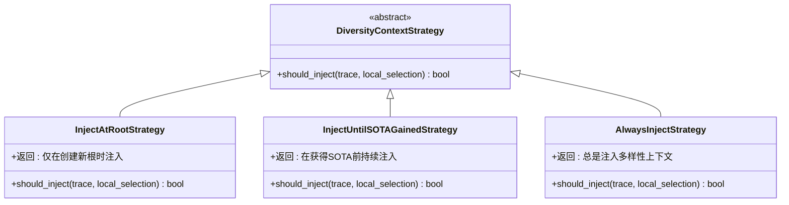

**图表来源**
- [rdagent/scenarios/data_science/proposal/exp_gen/diversity_strategy.py](file://rdagent/scenarios/data_science/proposal/exp_gen/diversity_strategy.py#L1-L69)

### 多样性注入时机

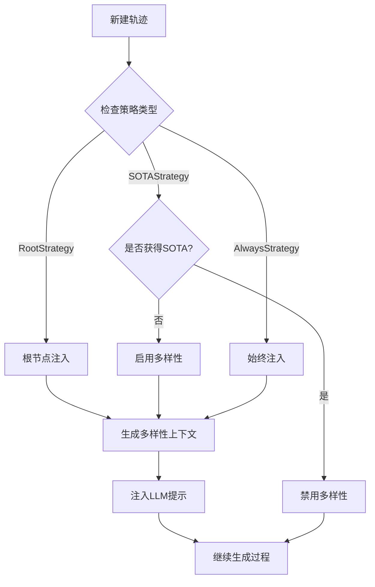

**图表来源**
- [rdagent/scenarios/data_science/proposal/exp_gen/diversity_strategy.py](file://rdagent/scenarios/data_science/proposal/exp_gen/diversity_strategy.py#L20-L69)

**章节来源**
- [rdagent/scenarios/data_science/proposal/exp_gen/diversity_strategy.py](file://rdagent/scenarios/data_science/proposal/exp_gen/diversity_strategy.py#L1-L69)

## 提案合并与优先级调度

### 合并策略架构

Proposal组件实现了复杂的提案合并机制，支持单轨迹和多轨迹的智能合并。

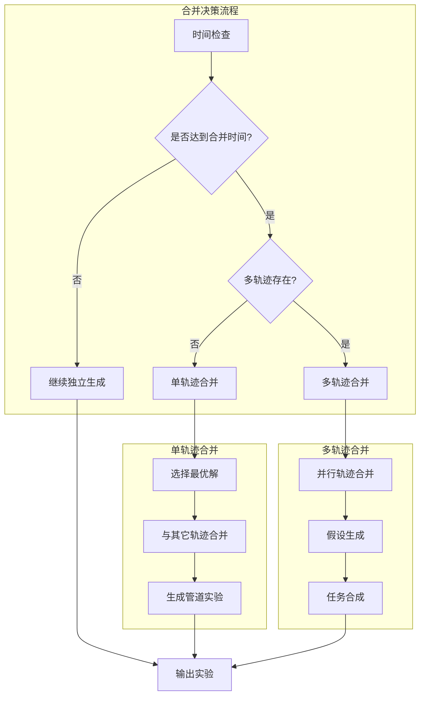

**图表来源**
- [rdagent/scenarios/data_science/proposal/exp_gen/merge.py](file://rdagent/scenarios/data_science/proposal/exp_gen/merge.py#L1-L448)

### 优先级调度机制

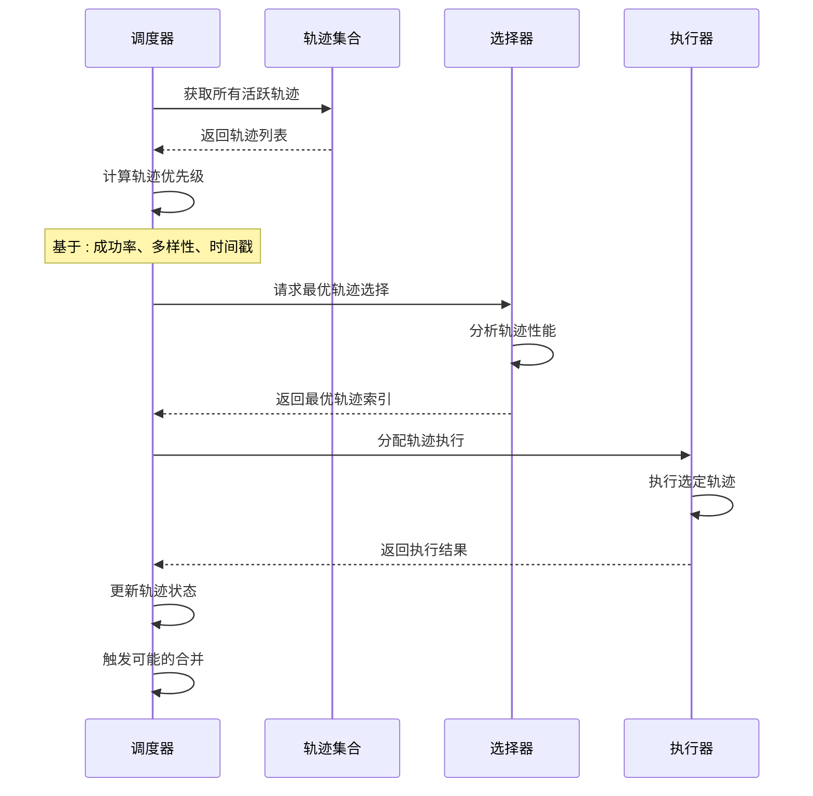

**图表来源**
- [rdagent/scenarios/data_science/proposal/exp_gen/select/submit.py](file://rdagent/scenarios/data_science/proposal/exp_gen/select/submit.py#L1-L200)

**章节来源**
- [rdagent/scenarios/data_science/proposal/exp_gen/merge.py](file://rdagent/scenarios/data_science/proposal/exp_gen/merge.py#L1-L448)
- [rdagent/scenarios/data_science/proposal/exp_gen/select/submit.py](file://rdagent/scenarios/data_science/proposal/exp_gen/select/submit.py#L1-L200)

## 知识库交互

### 知识库集成架构

Proposal组件与KnowledgeBase深度集成，实现知识的持续积累和传承。

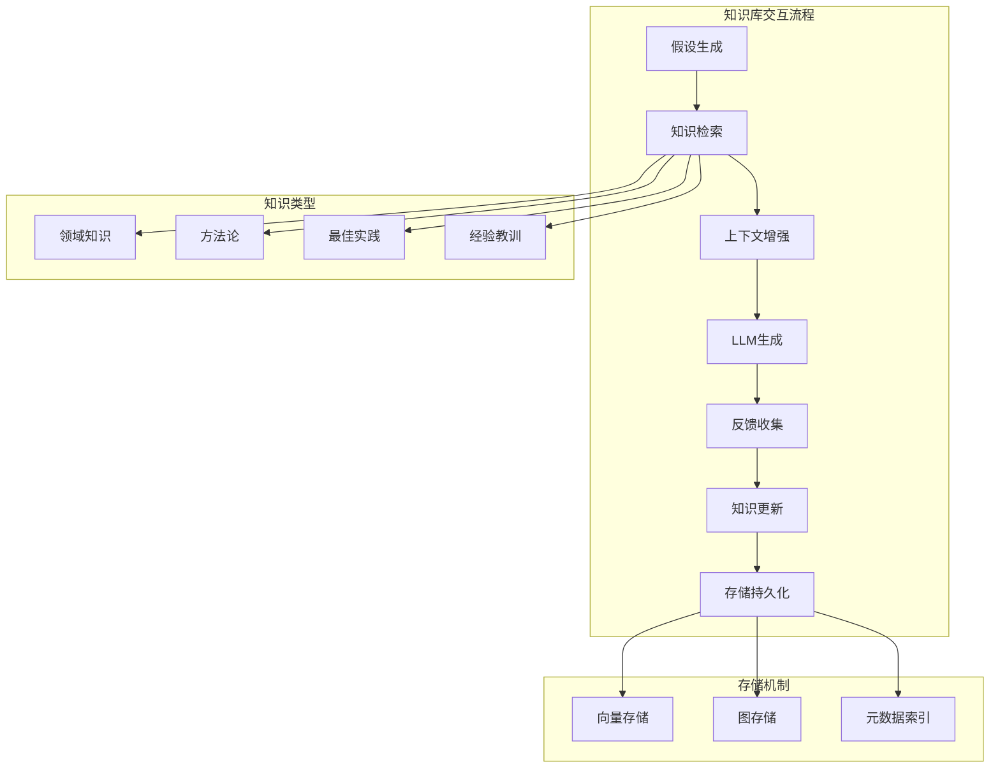

**图表来源**
- [rdagent/core/knowledge_base.py](file://rdagent/core/knowledge_base.py)

### 知识检索策略

| 检索策略 | 适用场景 | 检索范围 | 权重因子 |
|----------|----------|----------|----------|
| 相关性检索 | 新场景适应 | 全局知识库 | 0.7 |
| 时间加权检索 | 近期趋势跟踪 | 最近N条记录 | 0.3 |
| 主题聚类检索 | 类似问题解决 | 相关主题簇 | 0.5 |
| 成本效益检索 | 资源受限环境 | 高价值知识 | 0.8 |

**章节来源**
- [rdagent/core/knowledge_base.py](file://rdagent/core/knowledge_base.py)

## 性能优化与最佳实践

### 并行化策略

Proposal组件采用多层次的并行化策略，显著提升生成效率。

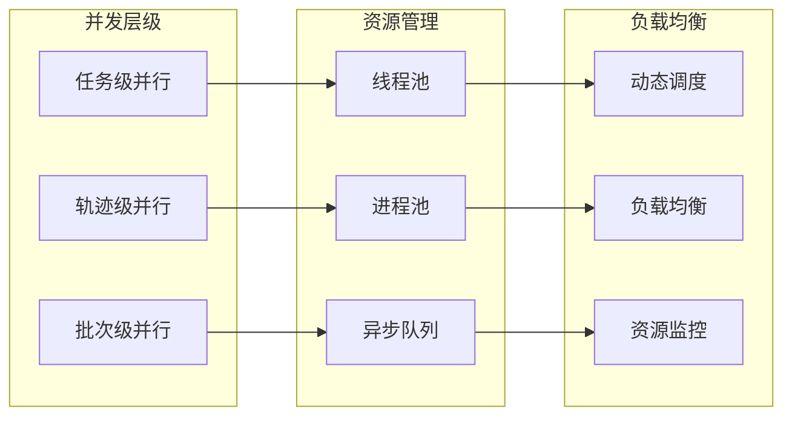

### 内存优化策略

| 优化技术 | 应用场景 | 效果 | 实现复杂度 |
|----------|----------|------|------------|
| 对象池复用 | 频繁创建的对象 | 减少GC压力 | 中等 |
| 延迟加载 | 大型知识库 | 降低内存占用 | 简单 |
| 分页检索 | 海量历史记录 | 控制内存使用 | 中等 |
| 弱引用缓存 | 临时数据存储 | 自动垃圾回收 | 复杂 |

### 错误恢复机制

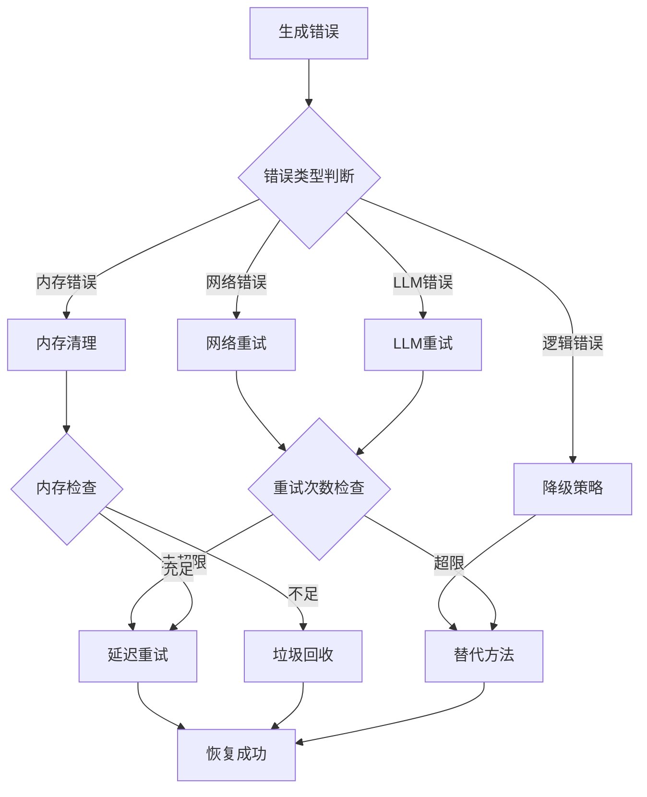

## 故障排除指南

### 常见问题诊断

| 问题症状 | 可能原因 | 解决方案 | 预防措施 |
|----------|----------|----------|----------|
| 假设生成缓慢 | LLM响应慢 | 调整超时设置 | 使用更快的模型 |
| 内存泄漏 | 对象未释放 | 启用垃圾回收 | 定期重启服务 |
| 知识库访问失败 | 网络连接问题 | 检查网络配置 | 实施连接池 |
| 合并冲突 | 并发修改 | 实施锁机制 | 优化并发策略 |

### 调试工具与技巧

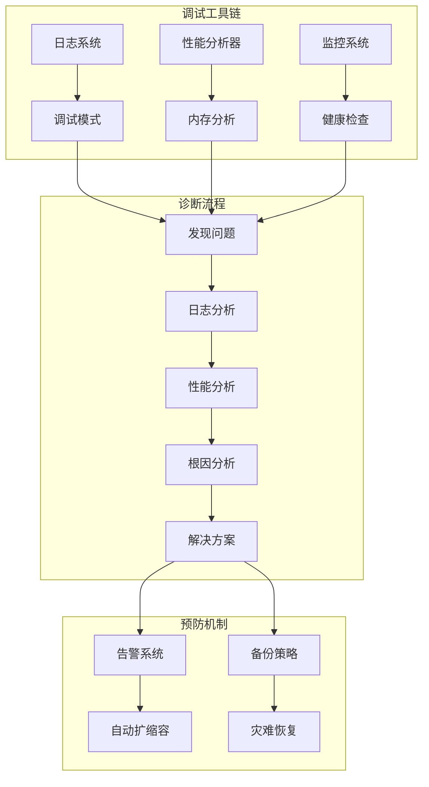

### 性能监控指标

| 监控指标 | 正常范围 | 告警阈值 | 监控频率 |
|----------|----------|----------|----------|
| 假设生成时间 | < 30秒 | > 60秒 | 实时 |
| 内存使用率 | < 80% | > 90% | 1分钟 |
| LLM调用成功率 | > 95% | < 90% | 实时 |
| 并发处理能力 | > 10实例 | < 5实例 | 5分钟 |

**章节来源**
- [rdagent/log/logger.py](file://rdagent/log/logger.py)
- [rdagent/log/timer.py](file://rdagent/log/timer.py)

## 结论

Proposal组件作为RD-Agent系统的核心创意引擎，通过精心设计的架构和丰富的策略体系，为自动化研发提供了强大而灵活的解决方案。其模块化的设计、智能的提示工程、多样性的控制机制以及高效的性能优化，使其能够适应各种复杂的研究场景，从数据科学竞赛到量化金融研究，都能提供高质量的创意支持。

随着人工智能技术的不断发展，Proposal组件将继续演进，集成更先进的AI模型、优化更多的生成策略，并扩展到更多的应用领域，为科学研究和技术创新提供持续的动力。