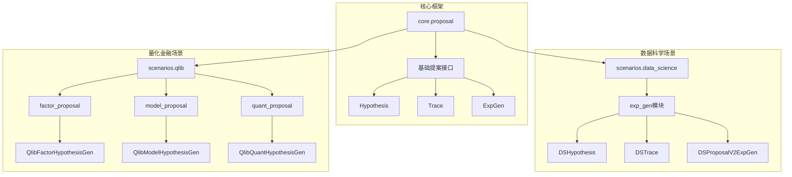
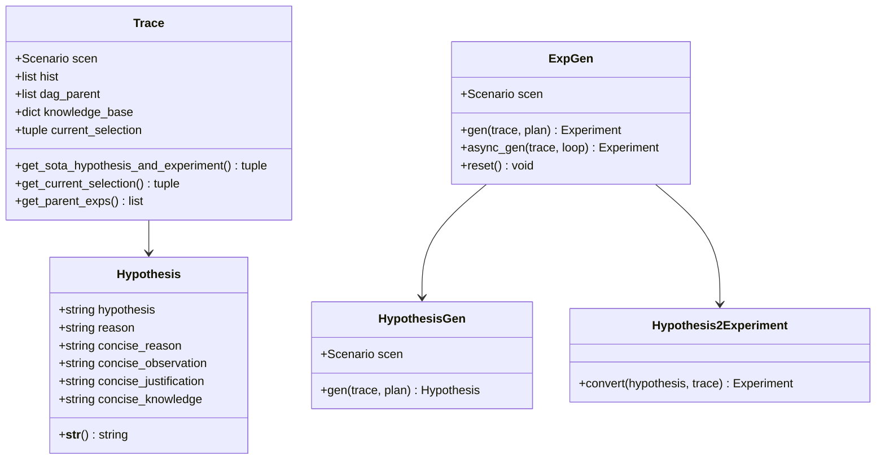
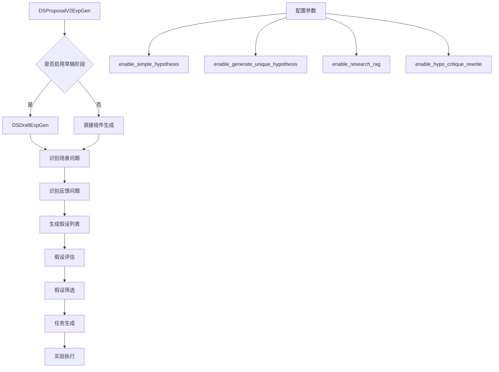
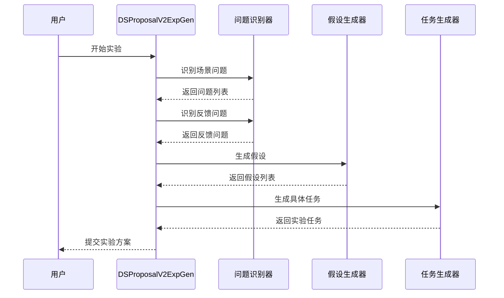
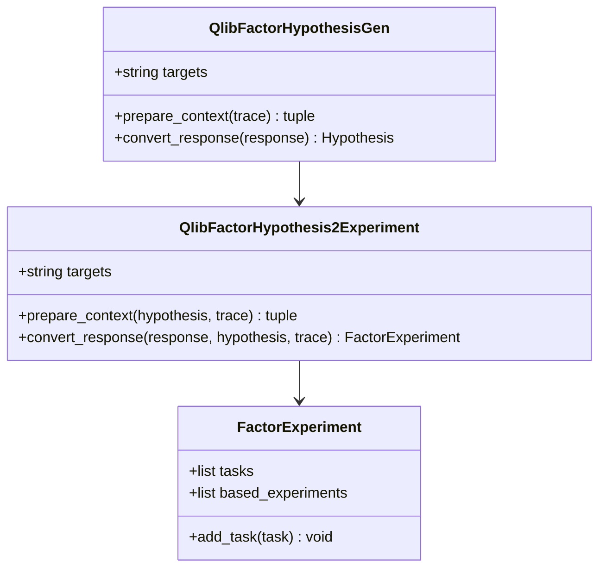
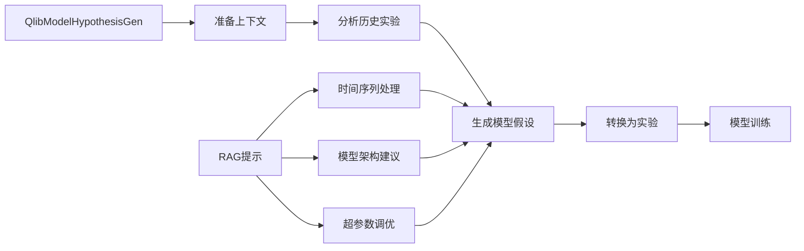
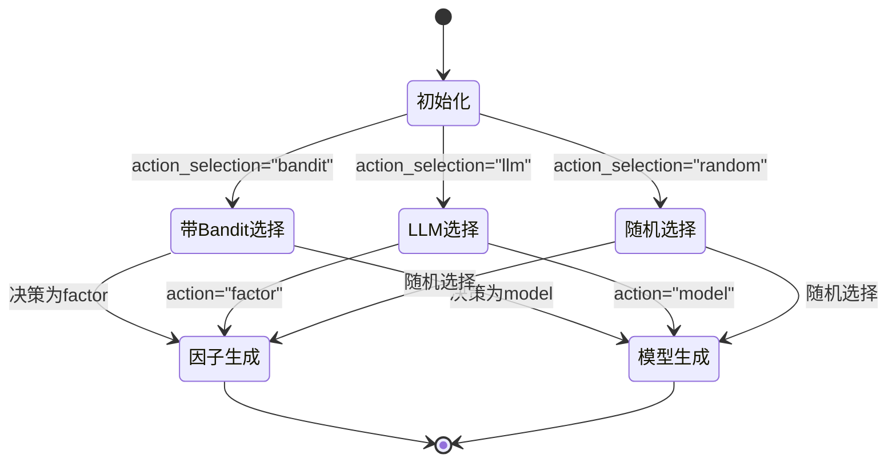
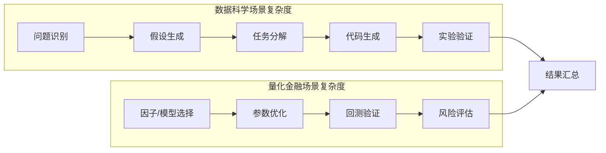
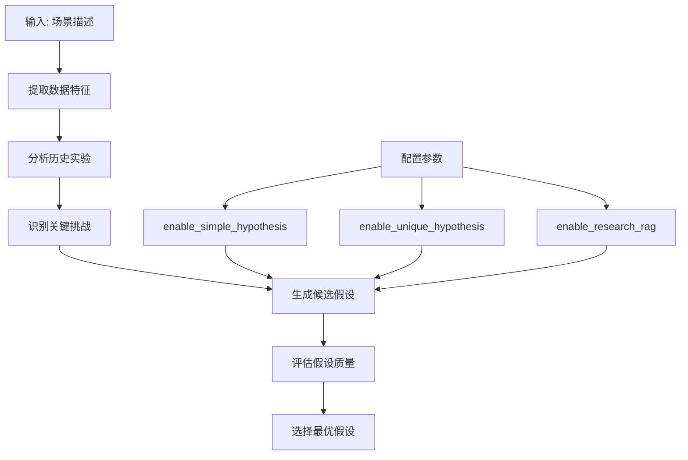
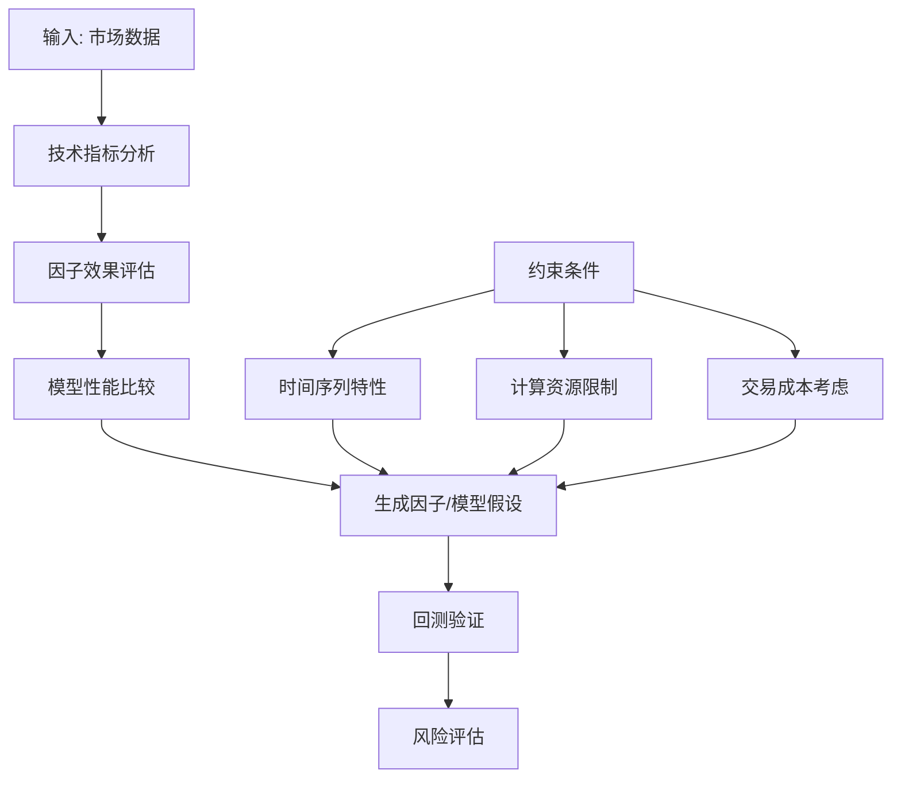

# 多场景提案策略实现差异分析

<cite>
**本文档引用的文件**
- [base.py](file://rdagent/scenarios/data_science/proposal/exp_gen/base.py)
- [factor_proposal.py](file://rdagent/scenarios/qlib/proposal/factor_proposal.py)
- [model_proposal.py](file://rdagent/scenarios/qlib/proposal/model_proposal.py)
- [quant_proposal.py](file://rdagent/scenarios/qlib/proposal/quant_proposal.py)
- [proposal.py](file://rdagent/scenarios/data_science/proposal/exp_gen/proposal.py)
- [proposal.py](file://rdagent/core/proposal.py)
- [__init__.py](file://rdagent/components/proposal/__init__.py)
- [conf.py](file://rdagent/app/data_science/conf.py)
- [conf.py](file://rdagent/app/qlib_rd_loop/conf.py)
- [prompts_v2.yaml](file://rdagent/scenarios/data_science/proposal/exp_gen/prompts_v2.yaml)
- [prompts.yaml](file://rdagent/scenarios/qlib/prompts.yaml)
</cite>

## 目录
1. [引言](#引言)
2. [项目结构概览](#项目结构概览)
3. [核心提案接口设计](#核心提案接口设计)
4. [数据科学场景提案策略](#数据科学场景提案策略)
5. [量化金融场景提案策略](#量化金融场景提案策略)
6. [场景差异对比分析](#场景差异对比分析)
7. [配置参数与启用方式](#配置参数与启用方式)
8. [定制化开发指南](#定制化开发指南)
9. [总结](#总结)

## 引言

RD-Agent是一个基于人工智能的自动化研发平台，支持多种应用场景的智能提案生成。本文档深入分析了数据科学场景（exp_gen模块）和量化金融场景（factor_proposal、model_proposal）在提案策略实现上的差异，揭示了各场景如何继承和扩展基础提案接口，实现领域特定的假设构造逻辑。

## 项目结构概览

RD-Agent采用模块化架构设计，主要包含以下核心组件：



**图表来源**
- [proposal.py](file://rdagent/core/proposal.py#L1-L50)
- [base.py](file://rdagent/scenarios/data_science/proposal/exp_gen/base.py#L1-L50)
- [factor_proposal.py](file://rdagent/scenarios/qlib/proposal/factor_proposal.py#L1-L50)

## 核心提案接口设计

### 基础提案架构

所有场景都基于统一的基础提案接口，提供了标准化的假设生成和实验执行流程：



**图表来源**
- [proposal.py](file://rdagent/core/proposal.py#L20-L100)

### 场景特定的假设类型

不同场景实现了专门的假设类型以适应领域需求：

| 场景 | 假设类型 | 特殊属性 | 应用领域 |
|------|----------|----------|----------|
| 数据科学 | DSHypothesis | component, problem_name, problem_desc | Kaggle竞赛、通用数据科学 |
| 量化因子 | QlibFactorHypothesis | 无特殊属性 | 因子研究、技术分析 |
| 量化模型 | QlibModelHypothesis | 无特殊属性 | 模型优化、策略构建 |
| 综合量化 | QlibQuantHypothesis | action | 因子vs模型选择 |

**段落来源**
- [base.py](file://rdagent/scenarios/data_science/proposal/exp_gen/base.py#L10-L40)
- [factor_proposal.py](file://rdagent/scenarios/qlib/proposal/factor_proposal.py#L10-L20)
- [model_proposal.py](file://rdagent/scenarios/qlib/proposal/model_proposal.py#L10-L20)
- [quant_proposal.py](file://rdagent/scenarios/qlib/proposal/quant_proposal.py#L20-L40)

## 数据科学场景提案策略

### 实验生成策略架构

数据科学场景采用了复杂的多层次提案生成策略，支持多种版本和配置：



**图表来源**
- [proposal.py](file://rdagent/scenarios/data_science/proposal/exp_gen/proposal.py#L1290-L1350)

### 组件化提案生成

数据科学场景实现了严格的组件化提案生成机制：



**图表来源**
- [proposal.py](file://rdagent/scenarios/data_science/proposal/exp_gen/proposal.py#L1350-L1450)

### 配置驱动的提案版本

数据科学场景支持多种提案生成版本，通过配置参数控制：

| 版本 | 特点 | 启用条件 | 性能特点 |
|------|------|----------|----------|
| v1 | 基础组件生成 | 默认启用 | 稳定可靠，适合初学者 |
| v2 | 增强问题识别 | enable_multi_version_exp_gen=True | 智能度高，问题导向 |
| v3 | 多版本混合 | enable_multi_version_exp_gen=True | 动态适配，性能最优 |

**段落来源**
- [conf.py](file://rdagent/app/data_science/conf.py#L150-L160)

## 量化金融场景提案策略

### 因子提案策略

量化金融场景的因子提案策略专注于技术分析和市场因子挖掘：



**图表来源**
- [factor_proposal.py](file://rdagent/scenarios/qlib/proposal/factor_proposal.py#L15-L50)

### 模型提案策略

模型提案策略关注于量化投资中的算法模型优化：



**图表来源**
- [model_proposal.py](file://rdagent/scenarios/qlib/proposal/model_proposal.py#L15-L80)

### 综合量化策略

综合量化场景实现了因子与模型的选择决策机制：



**图表来源**
- [quant_proposal.py](file://rdagent/scenarios/qlib/proposal/quant_proposal.py#L40-L120)

## 场景差异对比分析

### 假设构造逻辑差异

| 对比维度 | 数据科学场景 | 量化金融场景 | 设计考量 |
|----------|--------------|--------------|----------|
| 假设粒度 | 组件级假设 | 因子/模型假设 | 数据科学需要更细粒度控制 |
| 上下文信息 | 多轮迭代历史 | 当前最佳表现 | 量化场景更关注相对表现 |
| 评估标准 | 多样化指标 | IC、收益等金融指标 | 不同领域的评价体系 |
| 创新要求 | 高创新性 | 技术有效性优先 | 金融场景风险控制优先 |

### 实现复杂度对比



**图表来源**
- [proposal.py](file://rdagent/scenarios/data_science/proposal/exp_gen/proposal.py#L1-L100)
- [factor_proposal.py](file://rdagent/scenarios/qlib/proposal/factor_proposal.py#L1-L50)
- [model_proposal.py](file://rdagent/scenarios/qlib/proposal/model_proposal.py#L1-L50)

### 特征工程提案模式

数据科学场景的特征工程提案具有以下特点：

1. **多版本支持**：支持v1、v2、v3三个版本的特征工程提案
2. **组件化设计**：严格遵循DataLoadSpec→FeatureEng→Model→Ensemble→Workflow的顺序
3. **智能问题识别**：基于场景分析和反馈历史识别关键挑战
4. **多样化策略**：支持简单假设、唯一假设、研究RAG等多种生成策略

### 模型架构提案模式

量化金融场景的模型架构提案强调：

1. **时间序列友好**：优先考虑GRU、LSTM等适合时间序列的架构
2. **资源约束考虑**：根据训练数据规模（约478,000样本）设计合理的超参数
3. **渐进式复杂度**：从简单架构开始，逐步增加复杂度
4. **创新导向**：鼓励探索类比AI会议级别的创新结构

### 量化因子提案模式

因子提案的独特之处在于：

1. **简单优先原则**：初始阶段优先考虑简单、易实现且有效的因子
2. **复杂度递增**：随着实验积累，逐步引入机器学习因子等复杂方法
3. **组合策略**：避免过早组合复杂因子，先验证单个因子的有效性
4. **库化管理**：已超越SOTA的因子自动纳入因子库，避免重复实现

**段落来源**
- [prompts.yaml](file://rdagent/scenarios/qlib/prompts.yaml#L100-L150)

## 配置参数与启用方式

### 数据科学场景配置

数据科学场景提供了丰富的配置选项：

| 参数名称 | 类型 | 默认值 | 作用描述 |
|----------|------|--------|----------|
| enable_simple_hypothesis | bool | False | 是否生成简化的假设 |
| enable_generate_unique_hypothesis | bool | False | 是否生成独特的假设 |
| enable_research_rag | bool | False | 是否启用研究RAG |
| enable_hypo_critique_rewrite | bool | False | 是否启用假设批评重写 |
| coder_on_whole_pipeline | bool | True | 是否对整个管道进行编码 |
| enable_multi_version_exp_gen | bool | False | 是否启用多版本提案生成 |

**段落来源**
- [conf.py](file://rdagent/app/data_science/conf.py#L170-L200)

### 量化金融场景配置

量化金融场景的配置更加专业化：

| 参数名称 | 类型 | 默认值 | 作用描述 |
|----------|------|--------|----------|
| action_selection | str | "bandit" | 动作选择策略 |
| evolving_n | int | 10 | 进化次数 |
| report_result_json_file_path | str | "git_ignore_folder/report_list.json" | 报告结果文件路径 |
| max_factors_per_exp | int | 10000 | 每次实验最大因子数 |

**段落来源**
- [conf.py](file://rdagent/app/qlib_rd_loop/conf.py#L80-L120)

### 启用方式示例

#### 数据科学场景启用增强功能

```yaml
# data_science_config.yaml
ds_rd_setting:
  enable_simple_hypothesis: true
  enable_generate_unique_hypothesis: true
  enable_research_rag: true
  enable_hypo_critique_rewrite: true
  coder_on_whole_pipeline: true
```

#### 量化金融场景启用带Bandit选择

```yaml
# qlib_config.yaml
quant_prop_setting:
  action_selection: "bandit"
  evolving_n: 15
```

## 定制化开发指南

### 新场景提案策略开发步骤

1. **继承基础接口**
   ```python
   class CustomHypothesisGen(HypothesisGen):
       def __init__(self, scen: Scenario):
           super().__init__(scen)
           self.targets = "custom_domain"
   ```

2. **实现上下文准备**
   ```python
   def prepare_context(self, trace: Trace) -> Tuple[dict, bool]:
       # 准备领域特定的上下文信息
       context_dict = {
           "domain_specific_info": self.extract_domain_info(trace),
           "historical_performance": self.analyze_history(trace),
           "current_constraints": self.check_constraints(trace)
       }
       return context_dict, True
   ```

3. **定义响应转换**
   ```python
   def convert_response(self, response: str) -> Hypothesis:
       # 解析LLM响应并创建假设对象
       response_dict = json.loads(response)
       return CustomHypothesis(
           hypothesis=response_dict.get("hypothesis"),
           reason=response_dict.get("reason"),
           # 其他字段...
       )
   ```

### 领域特定的假设构造逻辑

#### 数据科学场景的假设构造



#### 量化金融场景的假设构造



### 扩展基础提案接口

开发者可以通过以下方式扩展基础提案接口：

1. **自定义假设类型**
   ```python
   class CustomHypothesis(Hypothesis):
       def __init__(self, hypothesis: str, reason: str, domain_specific_field: str):
           super().__init__(hypothesis, reason, ...)
           self.domain_specific_field = domain_specific_field
   ```

2. **实现新的提案版本**
   ```python
   class CustomExpGen(ExpGen):
       def gen(self, trace: Trace, plan: ExperimentPlan | None = None) -> Experiment:
           # 实现自定义的提案生成逻辑
           pass
   ```

3. **集成外部知识源**
   ```python
   def prepare_context(self, trace: Trace) -> Tuple[dict, bool]:
       # 集成外部知识库
       external_knowledge = self.query_external_knowledge(trace)
       context_dict = {
           "external_knowledge": external_knowledge,
           "trace_context": self.extract_trace_context(trace)
       }
       return context_dict, True
   ```

## 总结

RD-Agent的多场景提案策略展现了人工智能在不同专业领域应用的深度思考和精心设计。通过对比分析数据科学场景的exp_gen模块和量化金融场景的factor_proposal、model_proposal模块，我们可以看到：

1. **领域专业化**：每个场景都针对特定领域的特点进行了深度定制，数据科学注重组件化和创新性，量化金融强调技术有效性和风险管理。

2. **架构一致性**：尽管实现细节不同，但都遵循统一的基础提案接口设计，确保了系统的可扩展性和维护性。

3. **智能化程度**：从简单的规则匹配到复杂的多版本混合策略，体现了AI系统在不同成熟度阶段的演进路径。

4. **配置灵活性**：丰富的配置选项使得系统能够适应不同的使用场景和用户需求。

5. **持续改进**：通过假设批评重写、多样性注入等机制，系统具备了自我优化的能力。

这些设计原则和实现模式为开发者在新领域定制提案逻辑提供了宝贵的参考，展示了如何在保持系统稳定性的同时，实现领域特定的功能增强。