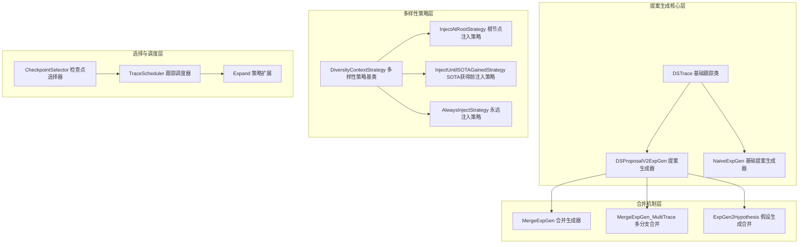
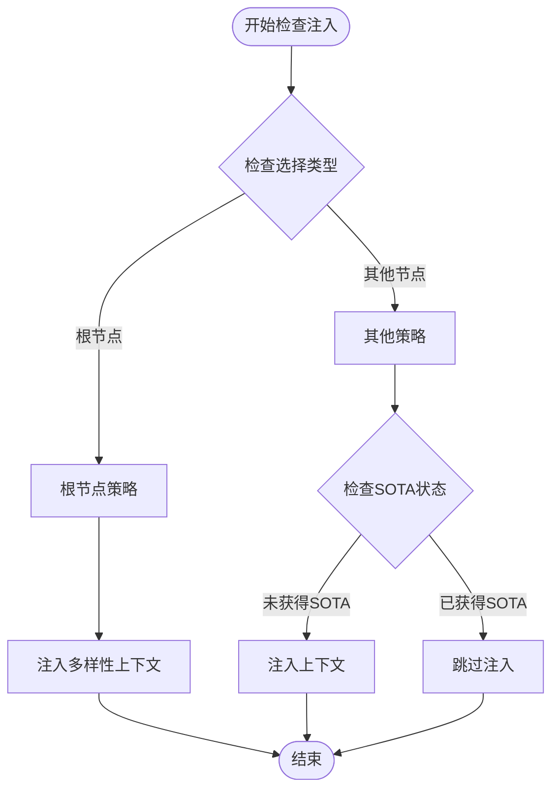
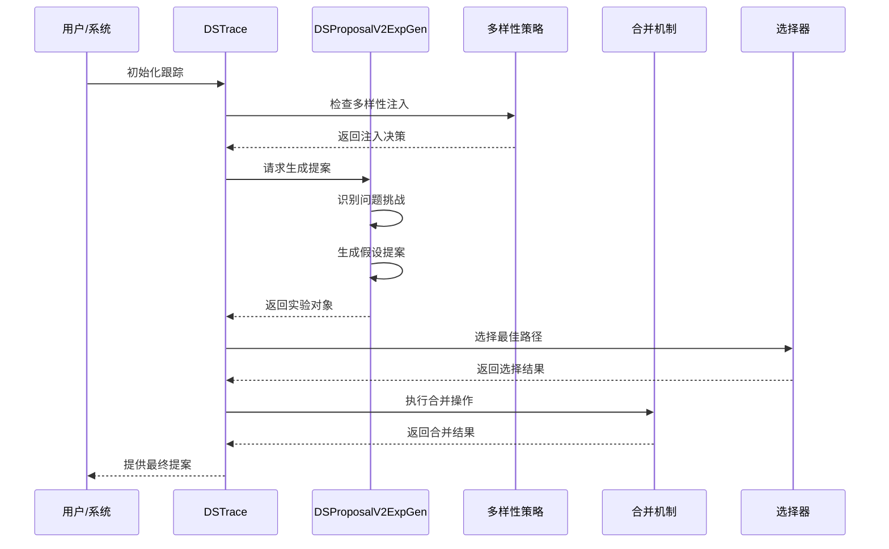
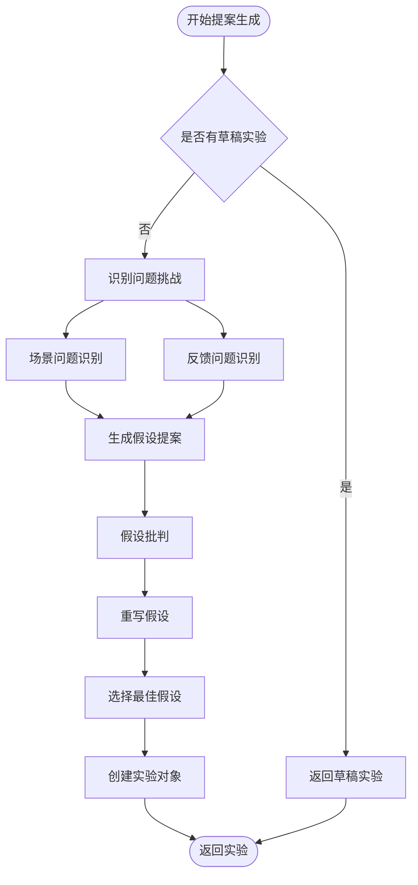
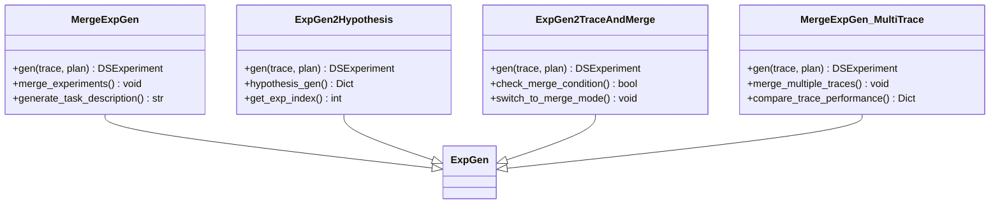
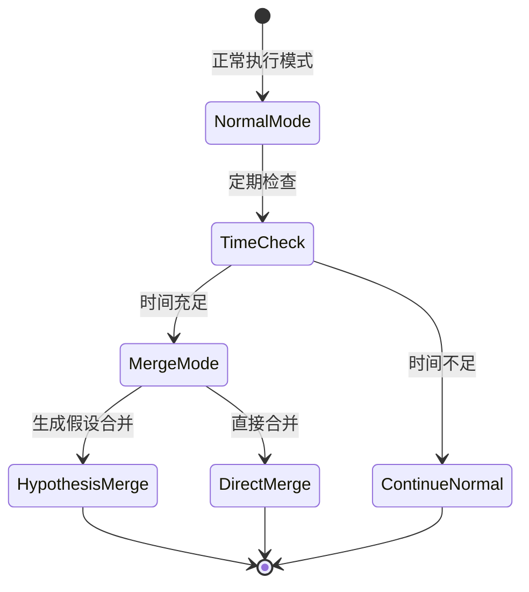
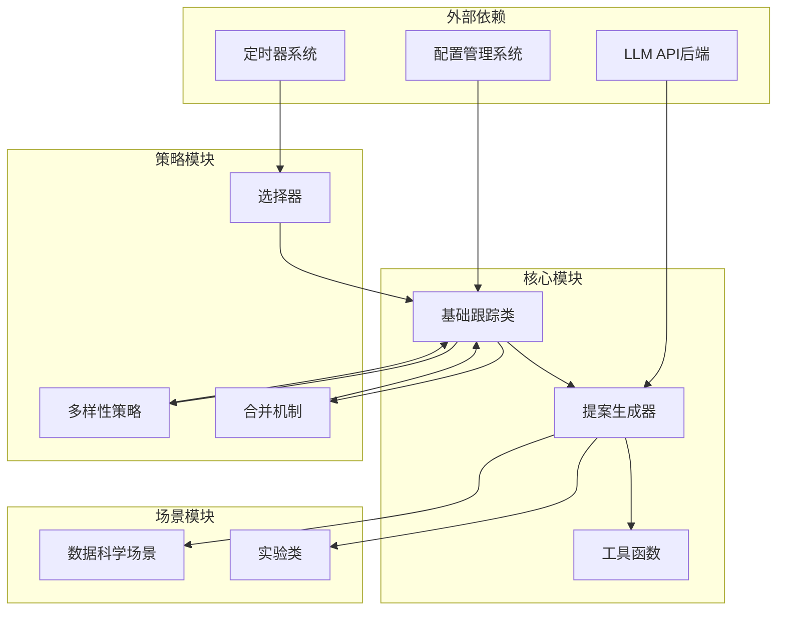

# 数据科学场景提案策略

<cite>
**本文档引用的文件**
- [base.py](file://rdagent/scenarios/data_science/proposal/exp_gen/base.py)
- [diversity_strategy.py](file://rdagent/scenarios/data_science/proposal/exp_gen/diversity_strategy.py)
- [merge.py](file://rdagent/scenarios/data_science/proposal/exp_gen/merge.py)
- [proposal.py](file://rdagent/scenarios/data_science/proposal/exp_gen/proposal.py)
- [utils.py](file://rdagent/scenarios/data_science/proposal/exp_gen/utils.py)
- [conf.py](file://rdagent/app/data_science/conf.py)
- [naive.py](file://rdagent/scenarios/data_science/proposal/exp_gen/naive.py)
- [expand.py](file://rdagent/scenarios/data_science/proposal/exp_gen/select/expand.py)
- [scen/__init__.py](file://rdagent/scenarios/data_science/scen/__init__.py)
- [experiment.py](file://rdagent/scenarios/data_science/experiment/experiment.py)
</cite>

## 目录
1. [引言](#引言)
2. [项目结构概览](#项目结构概览)
3. [核心组件分析](#核心组件分析)
4. [架构概览](#架构概览)
5. [详细组件分析](#详细组件分析)
6. [依赖关系分析](#依赖关系分析)
7. [性能考虑](#性能考虑)
8. [故障排除指南](#故障排除指南)
9. [结论](#结论)

## 引言

exp_gen模块是RD-Agent数据科学场景下的核心提案生成系统，专门设计用于在Kaggle竞赛等通用数据科学任务中生成创新性的实验假设。该模块通过基于多样性策略和提案合并的创新构造逻辑，实现了从问题识别到实验设计的完整自动化流程。

该系统的核心优势在于：
- **多样化策略**：通过多种多样性注入策略避免陷入局部最优解
- **智能合并机制**：支持多分支实验结果的智能融合与优化
- **通用性设计**：适用于各种数据科学场景，包括特征工程、模型架构和集成策略
- **可扩展架构**：提供丰富的配置参数和扩展接口

## 项目结构概览

exp_gen模块采用分层架构设计，主要包含以下核心层次：

**图表来源**
- [base.py](file://rdagent/scenarios/data_science/proposal/exp_gen/base.py#L1-L50)
- [proposal.py](file://rdagent/scenarios/data_science/proposal/exp_gen/proposal.py#L1-L100)
- [diversity_strategy.py](file://rdagent/scenarios/data_science/proposal/exp_gen/diversity_strategy.py#L1-L69)

**章节来源**
- [base.py](file://rdagent/scenarios/data_science/proposal/exp_gen/base.py#L1-L349)
- [proposal.py](file://rdagent/scenarios/data_science/proposal/exp_gen/proposal.py#L1-L799)

## 核心组件分析

### DSTrace - 数据科学跟踪类

DSTrace是整个提案生成系统的核心基础类，继承自通用的Trace类，专门为数据科学场景设计。它维护实验历史、管理分支结构，并提供多样化的查询和操作方法。

#### 主要功能特性

1. **实验历史管理**：通过`hist`列表维护完整的实验历史记录
2. **分支结构控制**：使用`dag_parent`数组构建有向无环图的父节点关系
3. **状态同步机制**：通过`sync_dag_parent_and_hist`方法确保父子关系一致性
4. **多样性注入控制**：通过`should_inject_diversity`方法决定是否注入多样性上下文

#### 关键方法解析

- **`register_uncommitted_exp`**：注册未提交的实验，支持临时存储和后续验证
- **`get_leaves`**：获取当前跟踪中的叶子节点索引，用于分支选择
- **`get_sibling_exps`**：获取当前选择的兄弟实验，支持并行比较
- **`next_incomplete_component`**：确定下一个需要完成的组件类型

**章节来源**
- [base.py](file://rdagent/scenarios/data_science/proposal/exp_gen/base.py#L50-L200)

### 多样性策略系统

多样性策略系统通过不同的注入策略来避免算法陷入局部最优，提高探索效率。

#### 策略类型对比

| 策略名称 | 注入条件 | 适用场景 | 性能特点 |
|---------|---------|---------|---------|
| `InjectAtRootStrategy` | 仅在新建子跟踪时 | 初始探索阶段 | 高效但可能错过中间机会 |
| `InjectUntilSOTAGainedStrategy` | 当前子跟踪未获得SOTA时 | 持续改进阶段 | 平衡探索与利用 |
| `AlwaysInjectStrategy` | 总是注入 | 充分探索阶段 | 最大化多样性但可能冗余 |

#### 实现机制

**图表来源**
- [diversity_strategy.py](file://rdagent/scenarios/data_science/proposal/exp_gen/diversity_strategy.py#L15-L69)

**章节来源**
- [diversity_strategy.py](file://rdagent/scenarios/data_science/proposal/exp_gen/diversity_strategy.py#L1-L69)

## 架构概览

exp_gen模块采用多层架构设计，从底层的基础跟踪到顶层的智能决策，形成了完整的提案生成流水线。

**图表来源**
- [base.py](file://rdagent/scenarios/data_science/proposal/exp_gen/base.py#L100-L200)
- [proposal.py](file://rdagent/scenarios/data_science/proposal/exp_gen/proposal.py#L200-L400)

## 详细组件分析

### DSProposalV2ExpGen - 高级提案生成器

DSProposalV2ExpGen是系统的核心组件，负责从问题识别到实验设计的完整流程。

#### 工作流程

**图表来源**
- [proposal.py](file://rdagent/scenarios/data_science/proposal/exp_gen/proposal.py#L400-L600)

#### 核心算法

1. **问题识别算法**：
   - 使用响应式模式处理不同类型的挑战
   - 支持场景驱动和反馈驱动的问题识别
   - 权重计算确保问题优先级的合理性

2. **假设生成算法**：
   - 基于问题-解决方案对的匹配机制
   - 集成知识库和RAG检索增强
   - 多轮迭代优化假设质量

3. **评估与选择算法**：
   - 多维度评分体系（对齐度、影响度、新颖性等）
   - LLM辅助的选择机制
   - 可选的用户交互式选择

**章节来源**
- [proposal.py](file://rdagent/scenarios/data_science/proposal/exp_gen/proposal.py#L400-L800)

### 合并机制详解

合并机制是exp_gen模块的重要创新，支持多分支实验结果的智能融合。

#### 合并策略分类

**图表来源**
- [merge.py](file://rdagent/scenarios/data_science/proposal/exp_gen/merge.py#L20-L100)

#### 合并执行流程

1. **条件检测**：检查剩余时间是否满足合并要求
2. **实验选择**：从多个分支中选择最佳实验进行合并
3. **假设生成**：基于合并实验的历史生成新的假设
4. **代码融合**：智能合并不同分支的代码实现
5. **验证测试**：确保合并后的实验具有更好的性能表现

**章节来源**
- [merge.py](file://rdagent/scenarios/data_science/proposal/exp_gen/merge.py#L1-L448)

### 选择与调度系统

选择与调度系统负责管理多分支实验的并发执行和资源分配。

#### 检查点选择器类型

| 选择器类型 | 策略描述 | 适用场景 | 优势 |
|-----------|---------|---------|------|
| `LatestCKPSelector` | 继续最新实验 | 稳定进展 | 简单高效 |
| `LimitTimeCKPSelector` | 基于时间限制 | 时间敏感任务 | 时间利用率高 |
| `SOTAJumpCKPSelector` | 基于SOTA跳跃 | 进展缓慢时 | 避免停滞 |
| `BackJumpCKPSelector` | 回退跳跃策略 | 复杂优化问题 | 平衡探索与利用 |

#### 调度策略

**图表来源**
- [expand.py](file://rdagent/scenarios/data_science/proposal/exp_gen/select/expand.py#L1-L100)

**章节来源**
- [expand.py](file://rdagent/scenarios/data_science/proposal/exp_gen/select/expand.py#L1-L245)

## 依赖关系分析

exp_gen模块的依赖关系体现了其模块化设计和可扩展性。

**图表来源**
- [base.py](file://rdagent/scenarios/data_science/proposal/exp_gen/base.py#L1-L20)
- [proposal.py](file://rdagent/scenarios/data_science/proposal/exp_gen/proposal.py#L1-L50)

**章节来源**
- [base.py](file://rdagent/scenarios/data_science/proposal/exp_gen/base.py#L1-L50)
- [proposal.py](file://rdagent/scenarios/data_science/proposal/exp_gen/proposal.py#L1-L100)

## 性能考虑

### 时间复杂度分析

1. **提案生成**：O(n × m)，其中n为问题数量，m为假设生成复杂度
2. **多样性注入**：O(k)，k为当前跟踪深度
3. **合并操作**：O(p × q)，p和q分别为参与合并的实验数量
4. **选择策略**：O(r)，r为候选实验数量

### 内存优化策略

- **增量式历史记录**：只保留必要的实验历史信息
- **懒加载机制**：按需加载大型数据集和模型
- **缓存策略**：缓存频繁访问的假设和评估结果
- **垃圾回收**：及时清理不再需要的中间结果

### 可扩展性设计

- **插件化架构**：支持自定义策略和算法
- **配置驱动**：通过配置文件调整行为参数
- **异步处理**：支持并行实验生成和评估
- **分布式支持**：可扩展到多节点环境

## 故障排除指南

### 常见问题及解决方案

#### 1. 多样性注入失效

**症状**：系统始终不注入多样性上下文
**原因**：多样性策略配置错误或条件不满足
**解决方案**：
- 检查`DS_RD_SETTING.enable_cross_trace_diversity`设置
- 验证策略类的正确导入路径
- 确认当前选择符合注入条件

#### 2. 合并失败

**症状**：合并操作抛出异常或产生无效结果
**原因**：实验兼容性问题或代码冲突
**解决方案**：
- 检查实验的组件兼容性
- 验证代码合并的可行性
- 调整合并阈值参数

#### 3. 假设生成质量低

**症状**：生成的假设缺乏创新性或实用性
**原因**：知识库不足或提示模板不当
**解决方案**：
- 增强知识库内容和覆盖范围
- 优化假设生成的提示模板
- 调整评估标准和筛选条件

**章节来源**
- [diversity_strategy.py](file://rdagent/scenarios/data_science/proposal/exp_gen/diversity_strategy.py#L1-L69)
- [merge.py](file://rdagent/scenarios/data_science/proposal/exp_gen/merge.py#L1-L100)

## 结论

exp_gen模块代表了数据科学实验自动化的前沿技术，通过创新的多样性策略和提案合并机制，实现了高效的实验生成和优化。其核心优势包括：

1. **智能化程度高**：基于LLM的智能问题识别和假设生成
2. **灵活性强**：支持多种策略组合和自定义扩展
3. **可扩展性好**：模块化设计便于功能增强和维护
4. **实用性突出**：已在多个Kaggle竞赛中证明其价值

该系统为数据科学家提供了强大的自动化实验生成工具，显著提升了实验效率和创新性。随着AI技术的不断发展，exp_gen模块将继续演进，为更复杂的科学发现任务提供支持。

未来的改进方向包括：
- 增强多模态数据处理能力
- 改进跨域知识迁移机制
- 优化大规模实验的并行处理
- 加强人类专家的交互式参与