# 量化因子提案策略

<cite>
**本文档引用的文件**
- [factor.py](file://rdagent/app/qlib_rd_loop/factor.py)
- [factor_proposal.py](file://rdagent/scenarios/qlib/proposal/factor_proposal.py)
- [bandit.py](file://rdagent/scenarios/qlib/proposal/bandit.py)
- [quant.py](file://rdagent/app/qlib_rd_loop/quant.py)
- [factor.py](file://rdagent/components/coder/factor_coder/factor.py)
- [factor_experiment.py](file://rdagent/scenarios/qlib/experiment/factor_experiment.py)
- [conf.py](file://rdagent/app/qlib_rd_loop/conf.py)
- [quant_experiment.py](file://rdagent/scenarios/qlib/experiment/quant_experiment.py)
- [quant_proposal.py](file://rdagent/scenarios/qlib/proposal/quant_proposal.py)
- [prompts.yaml](file://rdagent/scenarios/qlib/prompts.yaml)
</cite>

## 目录
1. [引言](#引言)
2. [项目结构概览](#项目结构概览)
3. [核心组件分析](#核心组件分析)
4. [架构概览](#架构概览)
5. [详细组件分析](#详细组件分析)
6. [多臂老虎机算法实现](#多臂老虎机算法实现)
7. [因子提案流程](#因子提案流程)
8. [Qlib框架集成](#qlib框架集成)
9. [配置参数与优化](#配置参数与优化)
10. [性能调优建议](#性能调优建议)
11. [故障排除指南](#故障排除指南)
12. [总结](#总结)

## 引言

量化因子提案策略是基于强化学习和多臂老虎机（Multi-Armed Bandit）算法的自动化量化交易因子生成系统。该系统通过智能探索与利用机制，在因子开发和模型训练之间进行动态平衡，实现量化策略的持续优化。系统结合了金融领域知识（如技术指标、市场情绪）和机器学习技术，能够自动生成、验证和优化可执行的因子假设。

## 项目结构概览

该系统采用模块化设计，主要包含以下核心模块：

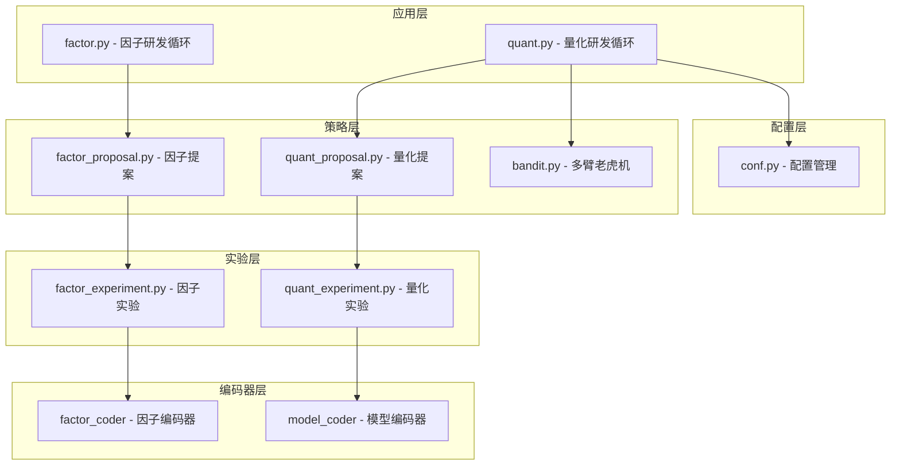

**图表来源**
- [factor.py](file://rdagent/app/qlib_rd_loop/factor.py#L1-L61)
- [quant.py](file://rdagent/app/qlib_rd_loop/quant.py#L1-L144)
- [factor_proposal.py](file://rdagent/scenarios/qlib/proposal/factor_proposal.py#L1-L133)
- [quant_proposal.py](file://rdagent/scenarios/qlib/proposal/quant_proposal.py#L1-L180)

## 核心组件分析

### 因子提案生成器

因子提案生成器负责从历史实验反馈中提取模式，生成新的因子假设。它采用迭代式学习机制，通过分析过往实验结果来指导下一轮因子开发。

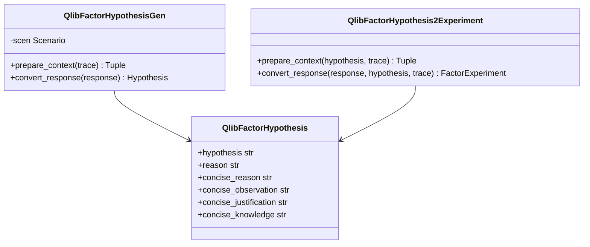

**图表来源**
- [factor_proposal.py](file://rdagent/scenarios/qlib/proposal/factor_proposal.py#L15-L133)

### 量化提案控制器

量化提案控制器集成了多臂老虎机算法，用于在因子开发和模型训练之间进行智能决策。

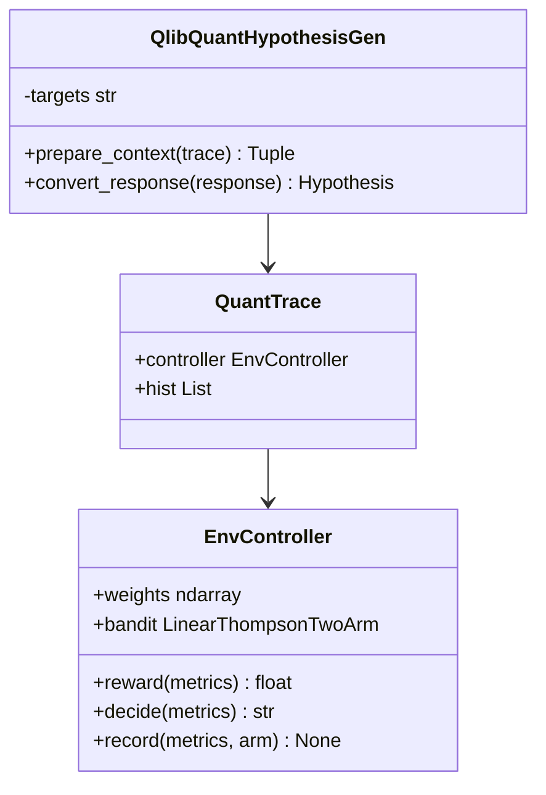

**图表来源**
- [quant_proposal.py](file://rdagent/scenarios/qlib/proposal/quant_proposal.py#L15-L180)
- [bandit.py](file://rdagent/scenarios/qlib/proposal/bandit.py#L75-L110)

**章节来源**
- [factor_proposal.py](file://rdagent/scenarios/qlib/proposal/factor_proposal.py#L1-L133)
- [quant_proposal.py](file://rdagent/scenarios/qlib/proposal/quant_proposal.py#L1-L180)

## 架构概览

系统采用分层架构设计，实现了从概念生成到实验验证的完整闭环：

```mermaid
sequenceDiagram
participant User as 用户
participant Loop as 研发循环
participant Gen as 假设生成器
participant Exp as 实验生成器
participant Runner as 实验运行器
participant Bandit as 多臂老虎机
participant Qlib as Qlib框架
User->>Loop : 启动研发循环
Loop->>Gen : 生成新假设
Gen->>Exp : 转换为实验任务
Exp->>Runner : 执行实验
Runner->>Qlib : 运行回测
Qlib-->>Runner : 返回结果
Runner->>Bandit : 更新性能指标
Bandit->>Loop : 决定下一步行动
Loop->>Loop : 迭代优化
```

**图表来源**
- [quant.py](file://rdagent/app/qlib_rd_loop/quant.py#L50-L144)
- [bandit.py](file://rdagent/scenarios/qlib/proposal/bandit.py#L75-L110)

## 详细组件分析

### 因子任务管理

因子任务是系统的基本工作单元，包含了因子的完整描述信息：

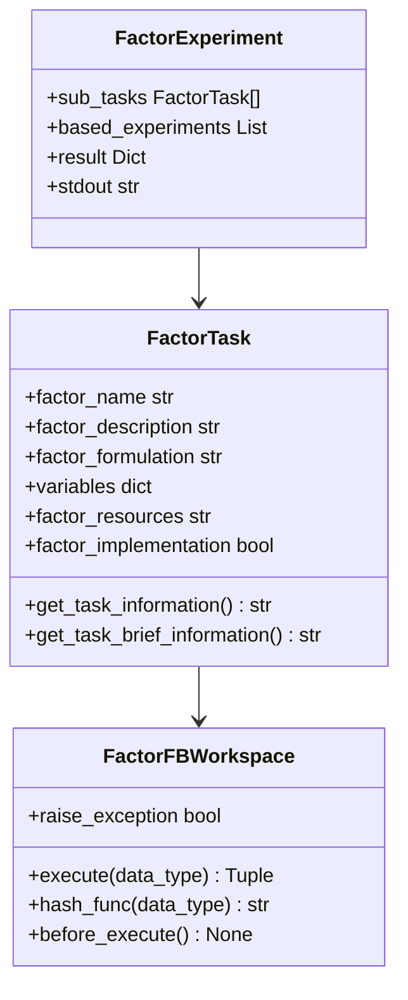

**图表来源**
- [factor.py](file://rdagent/components/coder/factor_coder/factor.py#L15-L232)

### 性能指标提取

系统通过Metrics类提取关键的量化性能指标：

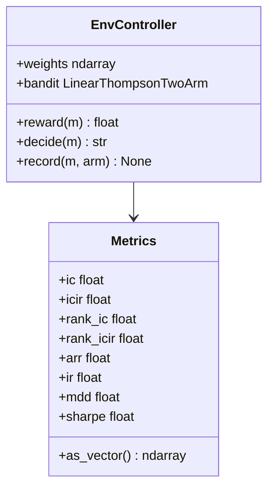

**图表来源**
- [bandit.py](file://rdagent/scenarios/qlib/proposal/bandit.py#L8-L35)

**章节来源**
- [factor.py](file://rdagent/components/coder/factor_coder/factor.py#L1-L232)
- [bandit.py](file://rdagent/scenarios/qlib/proposal/bandit.py#L1-L110)

## 多臂老虎机算法实现

### Thompson采样算法

系统采用线性Thompson采样算法来解决多臂老虎机问题：

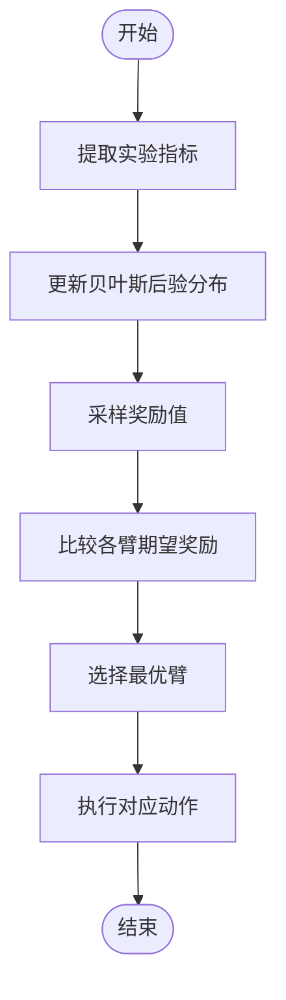

**图表来源**
- [bandit.py](file://rdagent/scenarios/qlib/proposal/bandit.py#L46-L110)

### 算法核心参数

| 参数 | 类型 | 默认值 | 说明 |
|------|------|--------|------|
| dim | int | 8 | 性能指标维度 |
| prior_var | float | 1.0 | 先验方差 |
| noise_var | float | 1.0 | 噪声方差 |
| weights | Tuple[float, ...] | (0.1, 0.1, 0.05, 0.05, 0.25, 0.15, 0.1, 0.2) | 性能指标权重 |

### 推荐权重配置

系统使用以下权重向量来平衡不同性能指标：

- IC (Information Coefficient): 0.1
- ICIR (Information Coefficient Information Ratio): 0.1  
- Rank IC: 0.05
- Rank ICIR: 0.05
- Annualized Return: 0.25
- Information Ratio: 0.15
- Maximum Drawdown: 0.1 (取负值)
- Sharpe Ratio: 0.2

**章节来源**
- [bandit.py](file://rdagent/scenarios/qlib/proposal/bandit.py#L1-L110)

## 因子提案流程

### 假设生成阶段

系统通过分析历史实验数据生成新的因子假设：

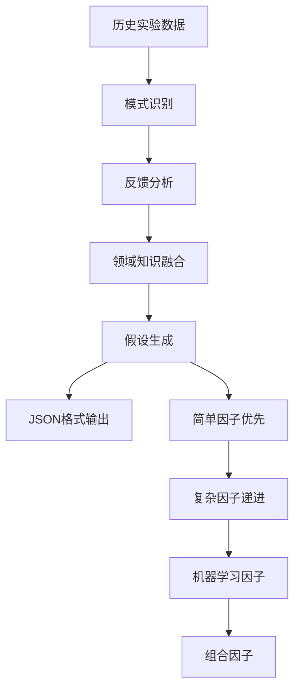

**图表来源**
- [factor_proposal.py](file://rdagent/scenarios/qlib/proposal/factor_proposal.py#L15-L50)

### 实验转换阶段

生成的假设被转换为具体的实验任务：

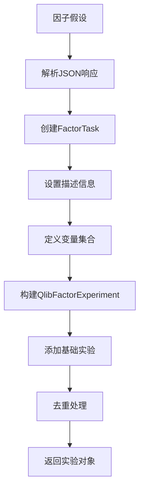

**图表来源**
- [factor_proposal.py](file://rdagent/scenarios/qlib/proposal/factor_proposal.py#L85-L133)

### 有效性验证流程

系统通过多层次验证确保因子质量：

| 验证层级 | 验证内容 | 验证方法 |
|----------|----------|----------|
| 形式验证 | JSON格式正确性 | 解析器检查 |
| 逻辑验证 | 假设合理性 | LLM推理 |
| 技术验证 | 因子可行性 | 数据分析 |
| 性能验证 | 收益潜力 | 回测模拟 |

**章节来源**
- [factor_proposal.py](file://rdagent/scenarios/qlib/proposal/factor_proposal.py#L1-L133)

## Qlib框架集成

### 数据接口规范

系统与Qlib框架建立了标准化的数据接口：

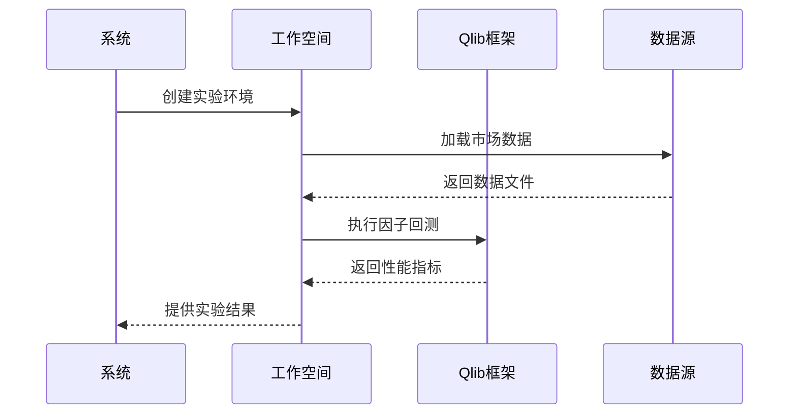

**图表来源**
- [factor_experiment.py](file://rdagent/scenarios/qlib/experiment/factor_experiment.py#L15-L91)

### 回测集成方式

系统支持多种回测配置：

| 配置类型 | 文件名 | 用途 |
|----------|--------|------|
| 基准配置 | conf_baseline.yaml | 单因子测试 |
| 组合配置 | conf_combined_factors.yaml | 因子组合测试 |
| SOTA配置 | conf_combined_factors_sota_model.yaml | 最优模型对比 |

### 因子表达式构造

系统支持多种因子表达式类型：

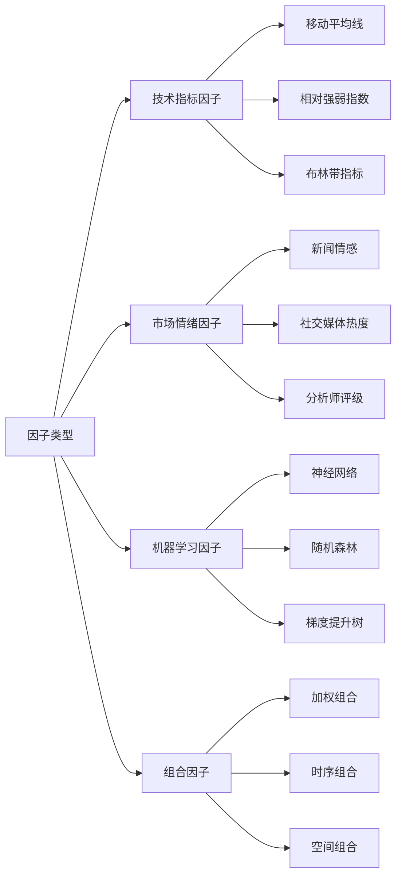

**章节来源**
- [factor_experiment.py](file://rdagent/scenarios/qlib/experiment/factor_experiment.py#L1-L91)
- [quant_experiment.py](file://rdagent/scenarios/qlib/experiment/quant_experiment.py#L1-L203)

## 配置参数与优化

### 关键配置参数

系统提供了丰富的配置选项来控制研发行为：

| 配置类别 | 参数名称 | 默认值 | 说明 |
|----------|----------|--------|------|
| 基础设置 | evolving_n | 10 | 进化轮次 |
| 场景配置 | scen | QlibFactorScenario | 场景类 |
| 假设生成 | hypothesis_gen | QlibFactorHypothesisGen | 假设生成器 |
| 实验转换 | hypothesis2experiment | QlibFactorHypothesis2Experiment | 实验转换器 |
| 编码器 | coder | QlibFactorCoSTEER | 因子编码器 |
| 运行器 | runner | QlibFactorRunner | 实验运行器 |
| 总结器 | summarizer | QlibFactorExperiment2Feedback | 结果总结器 |

### 风险控制机制

系统内置了多重风险控制措施：

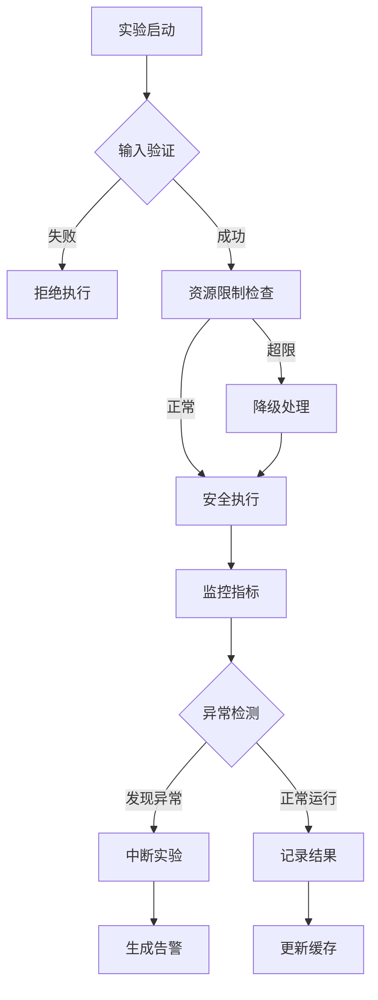

### 性能调优建议

#### 并行执行优化

- 设置最大并行度：`RD_AGENT_SETTINGS.get_max_parallel()`
- 使用异步执行：`asyncio.run()`模式
- 实现任务队列管理

#### 内存管理优化

- 启用结果缓存：`cache_with_pickle`装饰器
- 实现增量计算：避免重复处理
- 及时释放资源：`FileLock`机制

#### 计算效率优化

- 使用向量化操作：NumPy数组处理
- 实现批处理：减少I/O开销
- 启用GPU加速：支持CUDA运算

**章节来源**
- [conf.py](file://rdagent/app/qlib_rd_loop/conf.py#L1-L121)

## 性能调优建议

### 多臂老虎机参数调优

#### 探索-利用平衡

通过调整先验方差和噪声方差来控制探索程度：

```python
# 推荐参数配置
prior_var = 10.0  # 较大的先验方差促进探索
noise_var = 0.5   # 较小的噪声方差提高稳定性
```

#### 权重向量优化

根据具体业务需求调整性能指标权重：

```python
# 高风险偏好场景
weights = (0.05, 0.05, 0.05, 0.05, 0.3, 0.2, 0.1, 0.2)

# 保守场景
weights = (0.2, 0.2, 0.1, 0.1, 0.15, 0.1, 0.1, 0.15)
```

### 因子开发策略优化

#### 渐进式复杂度提升

系统采用渐进式策略来平衡创新性和可行性：

1. **第一阶段（简单因子）**：1-2个简单技术指标
2. **第二阶段（中等复杂度）**：组合多个简单因子
3. **第三阶段（高复杂度）**：机器学习模型因子
4. **第四阶段（创新因子）**：跨领域知识融合

#### 领域知识融合

- **技术指标**：结合经典技术分析理论
- **市场微观结构**：考虑成交量、买卖价差等微观特征
- **宏观经济因素**：纳入利率、通胀等宏观指标
- **行为金融学**：捕捉市场非理性行为模式

### 实验设计优化

#### 控制变量法

每次实验只改变一个关键变量，确保结果的可解释性：

```python
# 示例：时间窗口长度的影响
experiments = [
    {"time_window": 5},
    {"time_window": 10}, 
    {"time_window": 20},
    {"time_window": 30}
]
```

#### 对照组设计

为每个实验设置适当的对照组：

- **基准因子**：使用已知有效的因子作为对照
- **随机因子**：生成随机因子验证统计显著性
- **零因子**：不使用任何因子的基准表现

## 故障排除指南

### 常见错误及解决方案

#### 因子提取失败

**错误现象**：`FactorEmptyError: Factor extraction failed.`

**可能原因**：
- 因子代码语法错误
- 输入数据格式不正确
- 计算过程中出现异常

**解决方案**：
1. 检查因子代码的语法正确性
2. 验证输入数据的完整性
3. 添加异常处理和日志记录
4. 使用调试模式逐步排查

#### 多臂老虎机收敛缓慢

**错误现象**：算法长时间无法确定最优策略

**可能原因**：
- 权重向量设置不合理
- 性能指标波动过大
- 探索参数设置不当

**解决方案**：
1. 调整权重向量，增加重要指标的权重
2. 平滑性能指标，减少噪声影响
3. 增加探索时间，允许更多尝试
4. 实现自适应参数调整机制

#### 实验执行超时

**错误现象**：实验执行超过设定的时间限制

**可能原因**：
- 因子计算过于复杂
- 数据量过大
- 系统资源不足

**解决方案**：
1. 优化因子计算逻辑，减少计算复杂度
2. 实现数据分块处理
3. 增加系统资源分配
4. 设置合理的超时阈值

### 调试工具和技巧

#### 日志分析

系统提供了详细的日志记录功能：

```python
# 启用详细日志
logger.setLevel(logging.DEBUG)

# 记录关键信息
logger.log_object(exp, tag="experiment_result")
logger.log_object(feedback, tag="feedback")
```

#### 性能监控

监控关键性能指标：

- 实验执行时间
- 内存使用情况
- CPU利用率
- 网络I/O状态

#### 实验验证

建立实验验证机制：

1. **单元测试**：验证单个因子的功能正确性
2. **集成测试**：测试因子组合的效果
3. **回归测试**：确保新版本不破坏现有功能
4. **压力测试**：验证系统在高负载下的稳定性

**章节来源**
- [factor.py](file://rdagent/app/qlib_rd_loop/factor.py#L15-L61)
- [bandit.py](file://rdagent/scenarios/qlib/proposal/bandit.py#L46-L110)

## 总结

量化因子提案策略是一个高度集成的自动化系统，通过多臂老虎机算法实现了因子开发和模型训练之间的智能平衡。系统的主要优势包括：

### 技术创新点

1. **智能决策机制**：基于Thompson采样的多臂老虎机算法，有效平衡探索与利用
2. **渐进式开发策略**：从简单到复杂的因子生成路径，降低开发风险
3. **领域知识融合**：结合金融专业知识和机器学习技术
4. **闭环优化系统**：完整的从假设生成到实验验证的迭代流程

### 应用价值

1. **提高研发效率**：自动化程度高，减少人工干预
2. **降低开发成本**：通过智能搜索减少无效尝试
3. **提升因子质量**：基于历史数据的持续优化
4. **增强创新能力**：鼓励探索新的因子方向

### 发展前景

随着人工智能技术的发展，该系统可以在以下方面进一步优化：

1. **更先进的算法**：引入深度强化学习等更高级的决策算法
2. **更大规模数据**：支持更多市场和资产类别的因子开发
3. **实时优化能力**：实现实时的因子性能监控和调整
4. **跨市场应用**：扩展到全球各个主要金融市场

该系统为量化金融领域的研究者和从业者提供了一个强大的工具，有助于推动量化投资策略的创新发展。