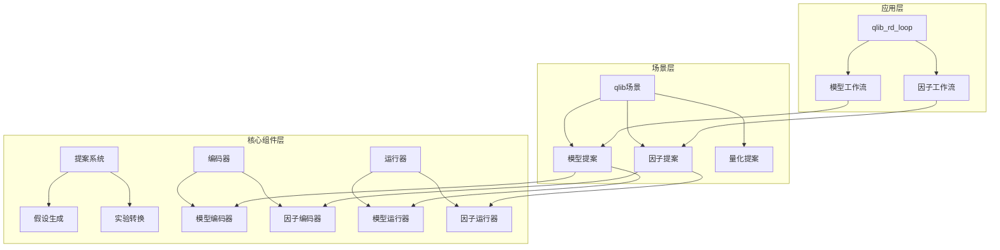
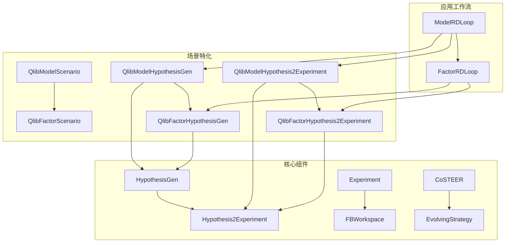
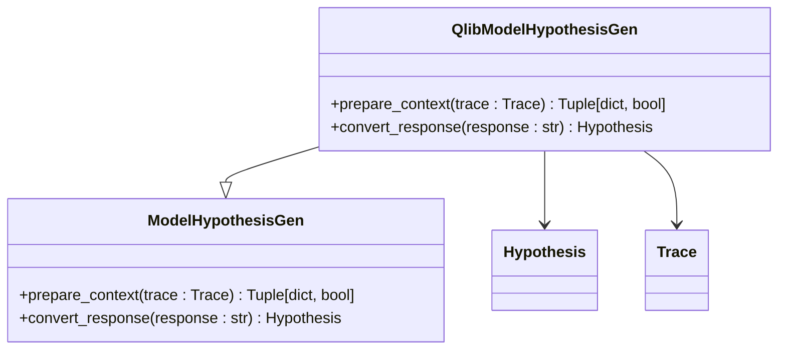
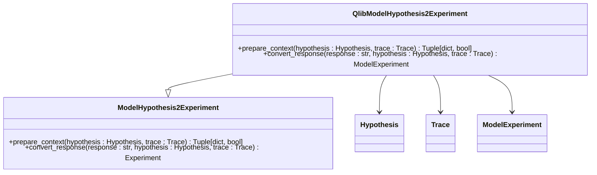
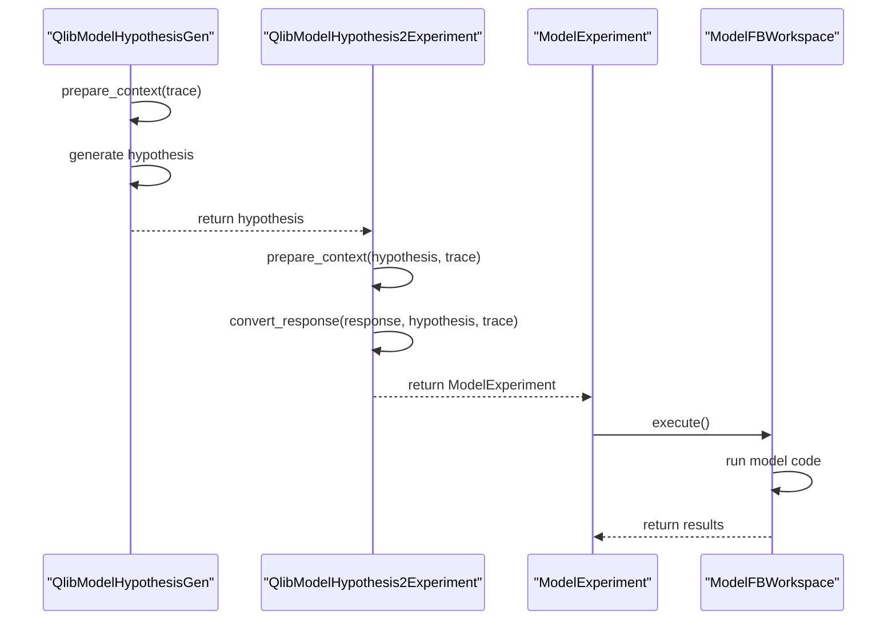
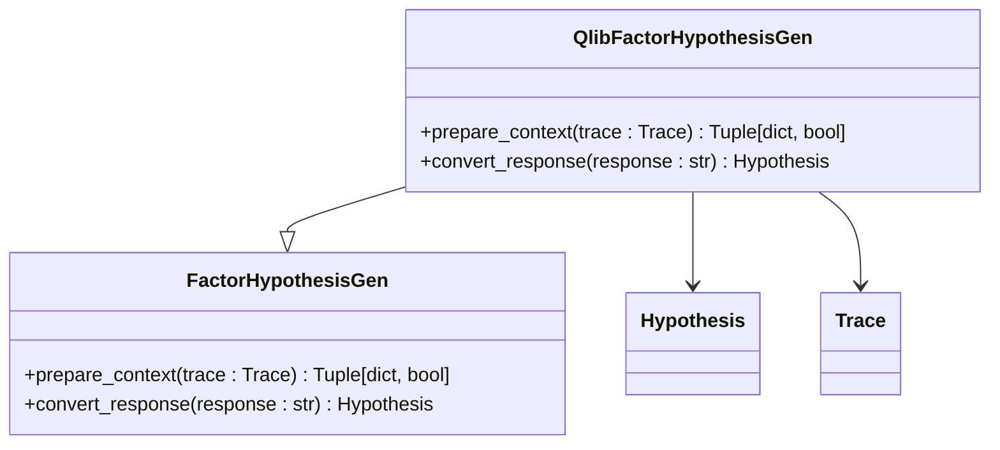
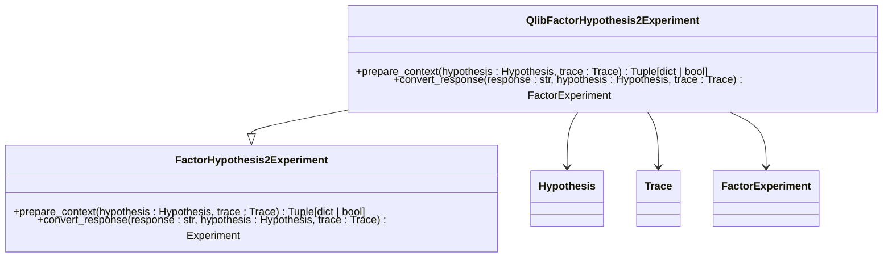
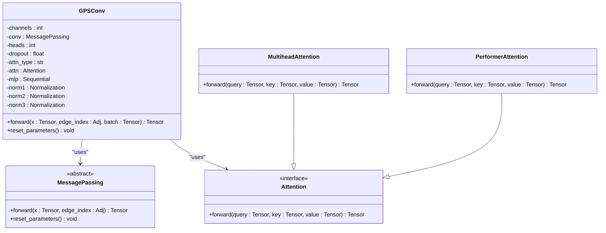
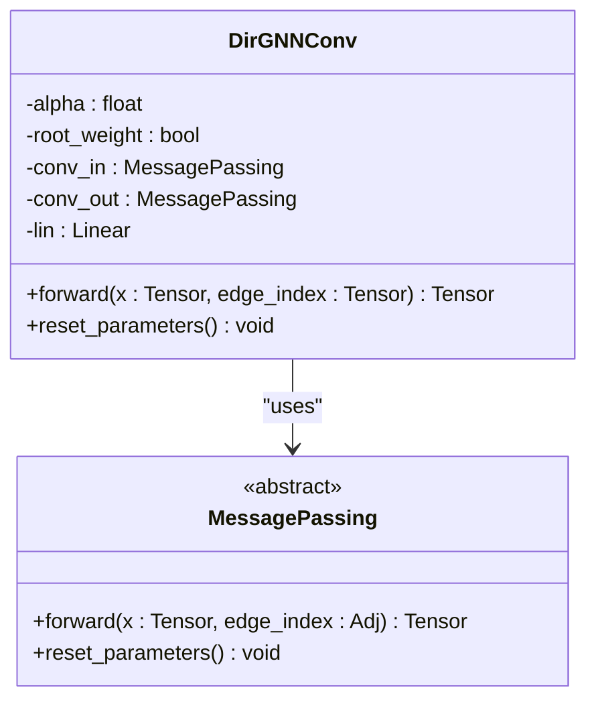
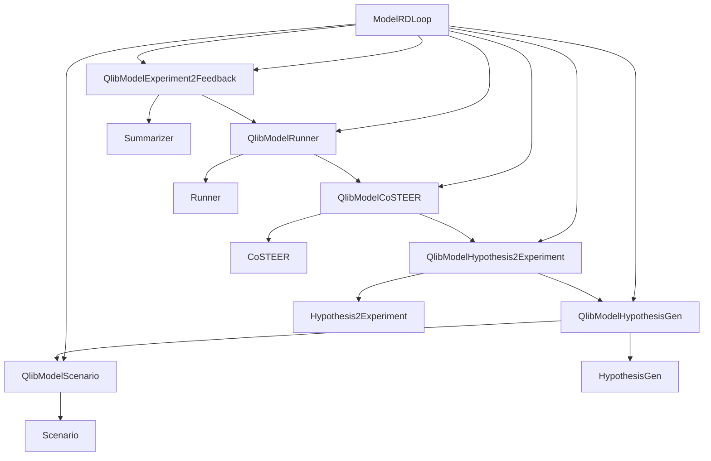

# 量化模型提案策略

<cite>
**本文档引用的文件**
- [model_proposal.py](file://rdagent/scenarios/qlib/proposal/model_proposal.py)
- [factor_proposal.py](file://rdagent/scenarios/qlib/proposal/factor_proposal.py)
- [model.py](file://rdagent/components/coder/model_coder/model.py)
- [factor.py](file://rdagent/components/coder/factor_coder/factor.py)
- [model_experiment.py](file://rdagent/scenarios/qlib/experiment/model_experiment.py)
- [factor_experiment.py](file://rdagent/scenarios/qlib/experiment/factor_experiment.py)
- [conf.py](file://rdagent/app/qlib_rd_loop/conf.py)
- [gpsconv.py](file://rdagent/components/coder/model_coder/benchmark/gt_code/gpsconv.py)
- [dirgnn.py](file://rdagent/components/coder/model_coder/benchmark/gt_code/dirgnn.py)
</cite>

## 目录
1. [引言](#引言)
2. [项目结构](#项目结构)
3. [核心组件](#核心组件)
4. [架构概述](#架构概述)
5. [详细组件分析](#详细组件分析)
6. [依赖分析](#依赖分析)
7. [性能考量](#性能考量)
8. [故障排除指南](#故障排除指南)
9. [结论](#结论)

## 引言
本文档详细阐述了量化金融场景中模型提案（model_proposal）的实现原理。重点说明如何生成深度学习模型架构（如DGN、GPSConv）和传统机器学习模型的提案，解释其与因子提案的协同优化机制。通过代码示例展示模型超参数搜索、架构变异和性能评估的闭环流程。分析该策略如何集成Qlib的模型训练与回测系统，实现端到端的自动化优化。文档化模型提案的配置选项、计算资源需求和收敛性控制，为构建高性能量化交易系统提供技术参考。

## 项目结构
本项目采用模块化设计，主要分为核心组件、场景实现和应用工作流三个层次。核心组件提供基础的提案生成、实验执行和反馈机制；场景实现层针对量化金融场景进行特化；应用工作流层则提供完整的自动化研发循环。

**图示来源**
- [model_proposal.py](file://rdagent/scenarios/qlib/proposal/model_proposal.py)
- [factor_proposal.py](file://rdagent/scenarios/qlib/proposal/factor_proposal.py)
- [model.py](file://rdagent/components/coder/model_coder/model.py)
- [factor.py](file://rdagent/components/coder/factor_coder/factor.py)

**章节来源**
- [model_proposal.py](file://rdagent/scenarios/qlib/proposal/model_proposal.py)
- [factor_proposal.py](file://rdagent/scenarios/qlib/proposal/factor_proposal.py)

## 核心组件
量化模型提案系统的核心组件包括假设生成器（HypothesisGen）、实验转换器（Hypothesis2Experiment）和执行反馈工作区（FBWorkspace）。这些组件协同工作，实现从假设到实验再到反馈的完整闭环。

**章节来源**
- [model_proposal.py](file://rdagent/scenarios/qlib/proposal/model_proposal.py)
- [factor_proposal.py](file://rdagent/scenarios/qlib/proposal/factor_proposal.py)
- [model.py](file://rdagent/components/coder/model_coder/model.py)

## 架构概述
系统采用分层架构设计，从上至下分为应用工作流、场景特化和核心组件三个层次。这种设计实现了关注点分离，使得系统既具有通用性又能够针对特定场景进行优化。

**图示来源**
- [model_proposal.py](file://rdagent/scenarios/qlib/proposal/model_proposal.py)
- [factor_proposal.py](file://rdagent/scenarios/qlib/proposal/factor_proposal.py)
- [model_experiment.py](file://rdagent/scenarios/qlib/experiment/model_experiment.py)
- [factor_experiment.py](file://rdagent/scenarios/qlib/experiment/factor_experiment.py)

## 详细组件分析

### 模型提案分析
模型提案组件负责生成和优化深度学习模型架构。它通过假设生成和实验转换两个主要步骤来实现模型的迭代优化。

#### 模型假设生成

**图示来源**
- [model_proposal.py](file://rdagent/scenarios/qlib/proposal/model_proposal.py#L1-L159)

#### 模型实验转换

**图示来源**
- [model_proposal.py](file://rdagent/scenarios/qlib/proposal/model_proposal.py#L1-L159)

#### 模型执行流程

**图示来源**
- [model_proposal.py](file://rdagent/scenarios/qlib/proposal/model_proposal.py#L1-L159)
- [model.py](file://rdagent/components/coder/model_coder/model.py#L1-L163)

### 因子提案分析
因子提案组件与模型提案组件具有相似的架构，但针对因子生成进行了特化。

#### 因子假设生成

**图示来源**
- [factor_proposal.py](file://rdagent/scenarios/qlib/proposal/factor_proposal.py#L1-L132)

#### 因子实验转换

**图示来源**
- [factor_proposal.py](file://rdagent/scenarios/qlib/proposal/factor_proposal.py#L1-L132)

### 深度学习模型架构分析
系统支持多种深度学习模型架构，包括GPSConv和DirGNN等先进的图神经网络架构。

#### GPSConv模型架构

**图示来源**
- [gpsconv.py](file://rdagent/components/coder/model_coder/benchmark/gt_code/gpsconv.py#L1-L198)

#### DirGNN模型架构

**图示来源**
- [dirgnn.py](file://rdagent/components/coder/model_coder/benchmark/gt_code/dirgnn.py#L1-L89)

**章节来源**
- [model_proposal.py](file://rdagent/scenarios/qlib/proposal/model_proposal.py)
- [factor_proposal.py](file://rdagent/scenarios/qlib/proposal/factor_proposal.py)
- [model.py](file://rdagent/components/coder/model_coder/model.py)
- [factor.py](file://rdagent/components/coder/factor_coder/factor.py)
- [gpsconv.py](file://rdagent/components/coder/model_coder/benchmark/gt_code/gpsconv.py)
- [dirgnn.py](file://rdagent/components/coder/model_coder/benchmark/gt_code/dirgnn.py)

## 依赖分析
系统各组件之间存在清晰的依赖关系，形成了一个完整的自动化研发闭环。

**图示来源**
- [conf.py](file://rdagent/app/qlib_rd_loop/conf.py#L1-L120)
- [model_proposal.py](file://rdagent/scenarios/qlib/proposal/model_proposal.py)
- [model_experiment.py](file://rdagent/scenarios/qlib/experiment/model_experiment.py)

**章节来源**
- [conf.py](file://rdagent/app/qlib_rd_loop/conf.py#L1-L120)

## 性能考量
系统在设计时充分考虑了性能优化，主要体现在以下几个方面：

1. **缓存机制**：使用`@cache_with_pickle`装饰器对执行结果进行缓存，避免重复计算
2. **并行执行**：支持多进程演化策略，可以并行执行多个实验
3. **资源控制**：通过配置文件控制计算资源使用，避免资源耗尽
4. **超时机制**：为每个执行步骤设置超时，防止长时间运行

系统还提供了详细的配置选项来控制性能相关参数，如`file_based_execution_timeout`和`running_timeout_period`等。

## 故障排除指南
在使用量化模型提案系统时，可能会遇到以下常见问题：

1. **模型执行失败**：检查模型代码是否符合Qlib接口规范，确保`model_cls`变量正确导出
2. **因子生成失败**：验证因子代码是否能正确生成`result.h5`输出文件
3. **环境配置错误**：确认conda环境或Docker容器配置正确
4. **资源不足**：调整`batch_size`和`num_features`等参数以适应可用资源

系统提供了详细的错误反馈机制，包括执行日志和异常信息，帮助用户快速定位和解决问题。

**章节来源**
- [model.py](file://rdagent/components/coder/model_coder/model.py#L1-L163)
- [factor.py](file://rdagent/components/coder/factor_coder/factor.py#L1-L231)

## 结论
量化模型提案系统通过创新的假设生成和实验转换机制，实现了深度学习模型和传统机器学习模型的自动化优化。系统不仅支持先进的图神经网络架构如GPSConv和DirGNN，还能够与因子提案系统协同工作，实现全面的量化策略优化。通过集成Qlib的模型训练与回测系统，该策略实现了端到端的自动化研发流程，为构建高性能量化交易系统提供了强大的技术支持。未来的工作可以进一步优化模型架构搜索算法，提高搜索效率和模型性能。