# 提案合并与调度系统技术文档

<cite>
**本文档引用的文件**
- [merge.py](file://rdagent/scenarios/data_science/proposal/exp_gen/merge.py)
- [merge.yaml](file://rdagent/scenarios/data_science/proposal/exp_gen/merge.yaml)
- [trace_scheduler.py](file://rdagent/scenarios/data_science/proposal/exp_gen/trace_scheduler.py)
- [base.py](file://rdagent/scenarios/data_science/proposal/exp_gen/base.py)
- [utils.py](file://rdagent/scenarios/data_science/proposal/exp_gen/utils.py)
- [naive.py](file://rdagent/scenarios/data_science/proposal/exp_gen/naive.py)
- [conf.py](file://rdagent/app/data_science/conf.py)
- [README.md](file://rdagent/scenarios/data_science/proposal/exp_gen/README.md)
</cite>

## 目录
1. [引言](#引言)
2. [系统架构概览](#系统架构概览)
3. [提案融合算法](#提案融合算法)
4. [执行调度器](#执行调度器)
5. [配置参数与调优](#配置参数与调优)
6. [时序流程分析](#时序流程分析)
7. [冲突解决与资源管理](#冲突解决与资源管理)
8. [性能优化策略](#性能优化策略)
9. [故障排除指南](#故障排除指南)
10. [总结](#总结)

## 引言

RD-Agent的提案合并与调度系统是一个复杂而精密的多智能体优化框架，专门设计用于在数据科学竞赛场景中自动优化解决方案。该系统通过融合多个独立探索轨迹中的优秀解决方案，实现了基于反馈闭环的动态优先级调整和智能调度决策。

系统的核心创新在于：
- 基于相似度的聚类合并算法
- 多维度优先级加权整合策略
- 智能执行队列管理系统
- 动态时间窗口的合并触发机制

## 系统架构概览

提案合并与调度系统采用分层架构设计，包含以下核心组件：

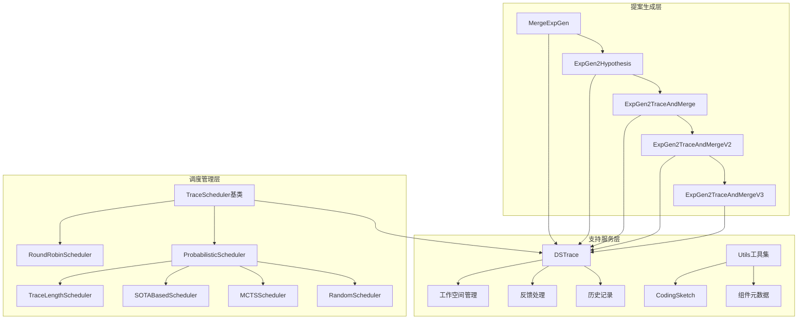

**图表来源**
- [merge.py](file://rdagent/scenarios/data_science/proposal/exp_gen/merge.py#L1-L448)
- [trace_scheduler.py](file://rdagent/scenarios/data_science/proposal/exp_gen/trace_scheduler.py#L1-L444)
- [base.py](file://rdagent/scenarios/data_science/proposal/exp_gen/base.py#L1-L349)

**章节来源**
- [merge.py](file://rdagent/scenarios/data_science/proposal/exp_gen/merge.py#L1-L50)
- [trace_scheduler.py](file://rdagent/scenarios/data_science/proposal/exp_gen/trace_scheduler.py#L1-L50)

## 提案融合算法

### 核心融合策略

提案融合算法是系统的核心，负责将多个独立轨迹中的优秀解决方案进行智能整合。主要包含以下几种融合模式：

#### 1. 基础合并策略（MergeExpGen）

基础合并策略通过比较当前最优解和待合并解之间的差异，生成融合任务：

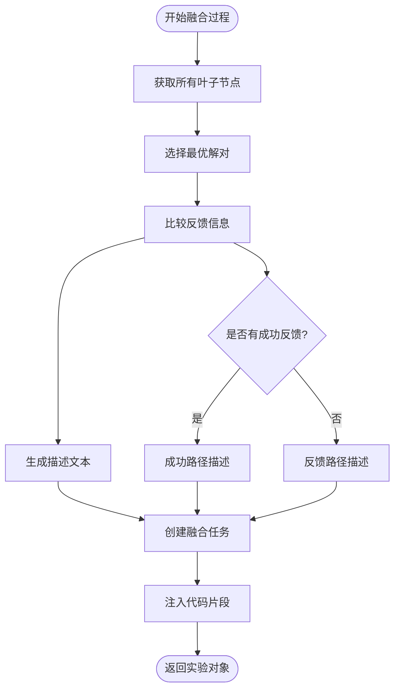

**图表来源**
- [merge.py](file://rdagent/scenarios/data_science/proposal/exp_gen/merge.py#L20-L80)

#### 2. 智能假设生成（ExpGen2Hypothesis）

智能假设生成模块通过LLM分析多个轨迹的历史反馈，提出可测试的优化假设：

| 组件类型 | 评估维度 | 权重分配 | 阈值标准 |
|---------|---------|---------|---------|
| Problem-Hypothesis Alignment | 问题-假设匹配度 | 25% | ≥7/10 |
| Expected Impact | 预期改进幅度 | 20% | ≥6/10 |
| Novelty | 创新程度 | 15% | ≥5/10 |
| Feasibility | 实现难度 | 20% | ≥6/10 |
| Risk-Reward Balance | 探索-利用平衡 | 20% | ≥7/10 |

#### 3. 多轨迹融合（MergeExpGen_MultiTrace）

多轨迹融合支持同时合并多个不同轨迹的解决方案：

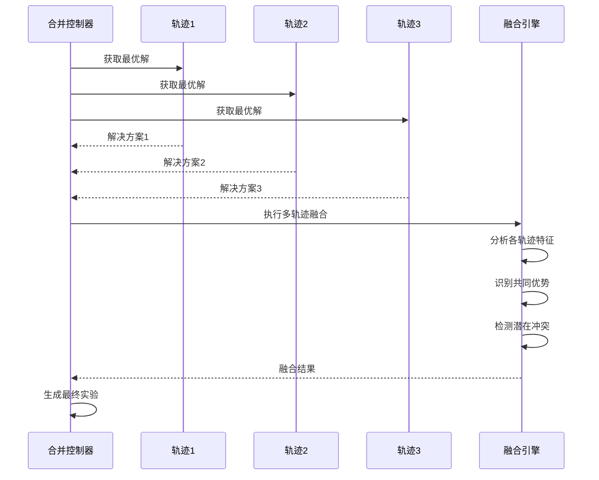

**图表来源**
- [merge.py](file://rdagent/scenarios/data_science/proposal/exp_gen/merge.py#L280-L350)

**章节来源**
- [merge.py](file://rdagent/scenarios/data_science/proposal/exp_gen/merge.py#L20-L150)
- [merge.yaml](file://rdagent/scenarios/data_science/proposal/exp_gen/merge.yaml#L1-L122)

## 执行调度器

### 调度器架构设计

执行调度器采用策略模式设计，支持多种调度策略的动态切换：

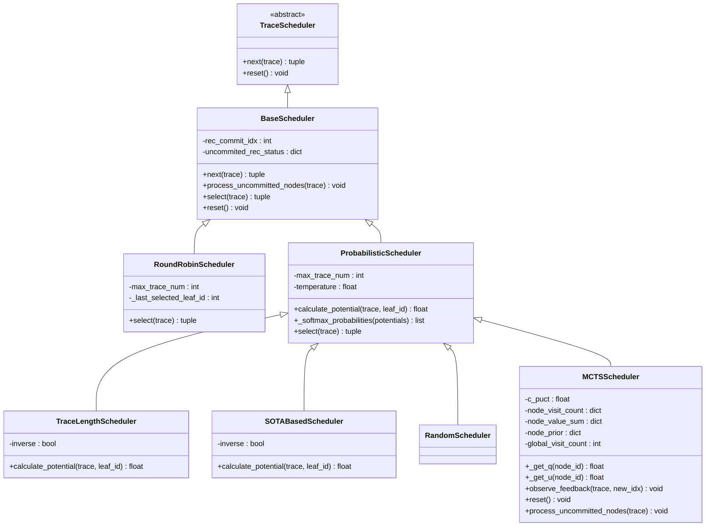

**图表来源**
- [trace_scheduler.py](file://rdagent/scenarios/data_science/proposal/exp_gen/trace_scheduler.py#L15-L100)

### 动态优先级调整机制

#### MCTS风格调度器（MCTSScheduler）

MCTS调度器实现了PUCT（Posterior Upper Confidence bounds applied to Trees）算法的核心思想：

**PUCT公式：**
```
U(s,a) = Q(s,a) + c_puct × P(s,a) × √(N(s)) / (1 + N(s,a))
```

其中：
- Q(s,a)：平均奖励值（访问次数加权）
- P(s,a)：先验概率（来自潜在函数）
- N(s)：节点总访问次数
- N(s,a)：动作a的访问次数
- c_puct：探索常数

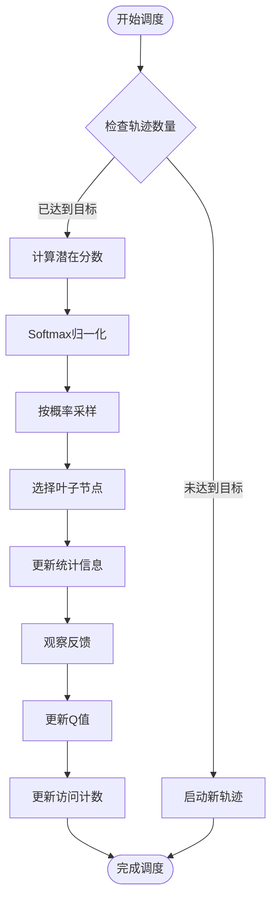

**图表来源**
- [trace_scheduler.py](file://rdagent/scenarios/data_science/proposal/exp_gen/trace_scheduler.py#L335-L444)

#### 时间窗口调度策略

系统支持基于时间窗口的智能调度决策：

| 时间阶段 | 调度策略 | 合并触发条件 | 超时设置 |
|---------|---------|-------------|---------|
| 初期探索 | RoundRobin | ≤ max_trace_num | 1小时 |
| 中期优化 | Probabilistic | remain_time ≥ merge_hours | 2小时 |
| 最终融合 | MCTS | remain_time < merge_hours | 4小时 |

**章节来源**
- [trace_scheduler.py](file://rdagent/scenarios/data_science/proposal/exp_gen/trace_scheduler.py#L15-L200)
- [conf.py](file://rdagent/app/data_science/conf.py#L100-L150)

## 配置参数与调优

### 核心配置参数

系统提供了丰富的配置参数来控制合并与调度行为：

#### 合并相关配置

| 参数名 | 类型 | 默认值 | 描述 | 调优建议 |
|-------|------|-------|------|---------|
| `merge_hours` | float | 0 | 触发合并的时间阈值（小时） | 根据竞赛时长设置，通常为总时长的70-80% |
| `ratio_merge_or_ensemble` | int | 70 | 合并与集成的比例阈值 | 平衡探索与利用，建议70-80% |
| `max_sota_retrieved_num` | int | 10 | 单次检索的最大SOTA实验数 | 避免超出LLM上下文窗口，建议10-20 |
| `enable_multi_version_exp_gen` | bool | False | 启用多版本实验生成器 | 大型竞赛推荐启用 |

#### 调度器配置

| 参数名 | 类型 | 默认值 | 描述 | 调优建议 |
|-------|------|-------|------|---------|
| `max_trace_num` | int | 1 | 最大并行轨迹数 | 小竞赛：1-2，中等竞赛：3-5，大型竞赛：5-10 |
| `scheduler_temperature` | float | 1.0 | 调度器温度参数 | 高温度促进探索，低温度促进利用 |
| `scheduler_c_puct` | float | 1.0 | MCTS探索常数 | 0.5-2.0，根据竞赛稳定性调整 |
| `enable_score_reward` | bool | False | 启用分数奖励机制 | 推荐启用，提高调度质量 |

#### 性能调优参数

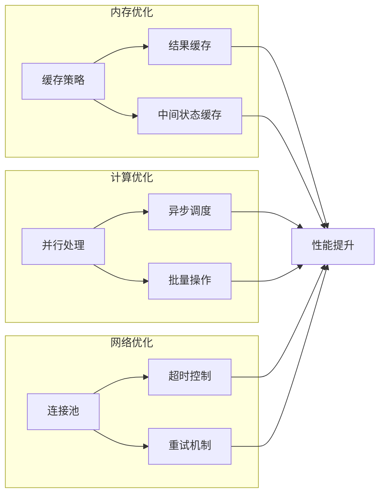

**图表来源**
- [conf.py](file://rdagent/app/data_science/conf.py#L150-L200)

**章节来源**
- [conf.py](file://rdagent/app/data_science/conf.py#L1-L200)
- [merge.yaml](file://rdagent/scenarios/data_science/proposal/exp_gen/merge.yaml#L1-L122)

## 时序流程分析

### 完整执行流程

从提案生成到最终提交的完整时序流程：

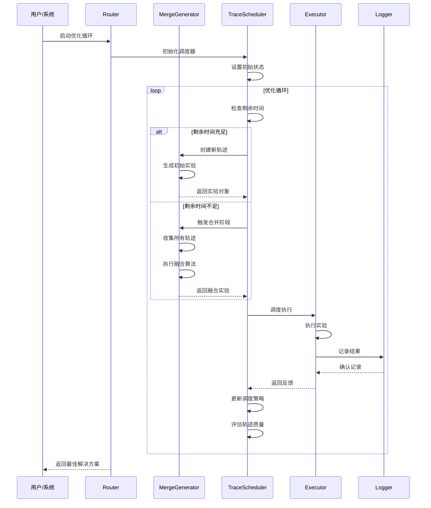

**图表来源**
- [merge.py](file://rdagent/scenarios/data_science/proposal/exp_gen/merge.py#L200-L300)
- [trace_scheduler.py](file://rdagent/scenarios/data_science/proposal/exp_gen/trace_scheduler.py#L50-L150)

### 关键决策点

#### 1. 合并触发时机判断

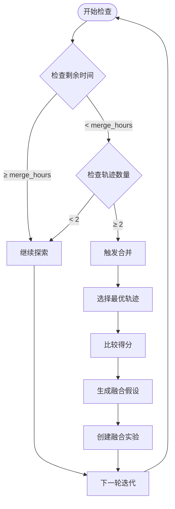

**图表来源**
- [merge.py](file://rdagent/scenarios/data_science/proposal/exp_gen/merge.py#L220-L280)

#### 2. 调度策略切换

系统根据优化阶段自动切换调度策略：

| 阶段 | 时间范围 | 主要策略 | 切换条件 |
|------|---------|---------|---------|
| 初期 | 0-20% | RoundRobin | 达到最大轨迹数 |
| 探索 | 20-60% | Probabilistic | 剩余时间充足 |
| 优化 | 60-80% | MCTS | 剩余时间不足 |
| 融合 | 80-100% | MCTS+启发式 | 触发合并条件 |

**章节来源**
- [merge.py](file://rdagent/scenarios/data_science/proposal/exp_gen/merge.py#L200-L448)
- [trace_scheduler.py](file://rdagent/scenarios/data_science/proposal/exp_gen/trace_scheduler.py#L335-L444)

## 冲突解决与资源管理

### 提案冲突检测

系统实现了多层次的冲突检测机制：

#### 1. 轨迹冲突识别

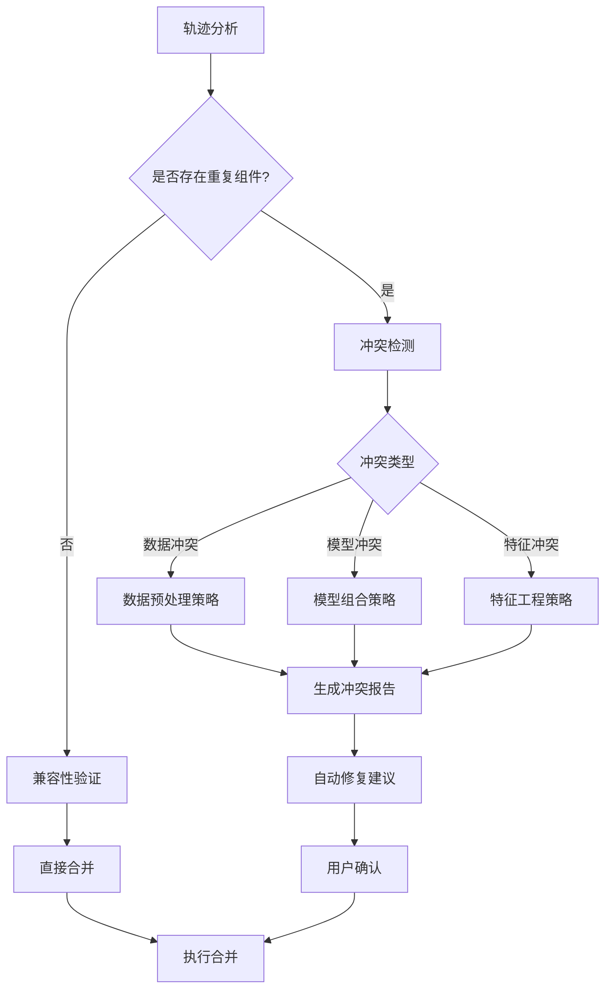

#### 2. 资源竞争解决

| 资源类型 | 竞争检测 | 解决策略 | 优先级规则 |
|---------|---------|---------|-----------|
| 计算资源 | GPU/CPU使用率监控 | 动态负载均衡 | 先到先得 |
| 存储空间 | 磁盘使用量跟踪 | 清理过期文件 | 最近最少使用 |
| 内存占用 | 内存使用率监控 | 压缩缓存数据 | 最大可用空间 |
| 网络带宽 | 网络流量监控 | 限流控制 | 关键任务优先 |

### 自动化冲突解决

系统提供多种自动化冲突解决策略：

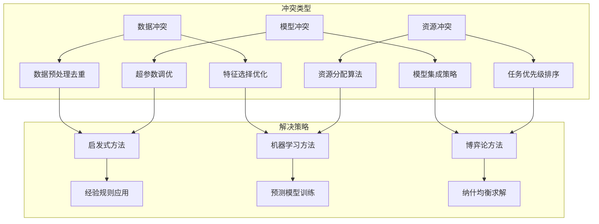

**章节来源**
- [base.py](file://rdagent/scenarios/data_science/proposal/exp_gen/base.py#L100-L200)
- [utils.py](file://rdagent/scenarios/data_science/proposal/exp_gen/utils.py#L1-L106)

## 性能优化策略

### 计算性能优化

#### 1. 并行化策略

系统采用多层次并行化策略：

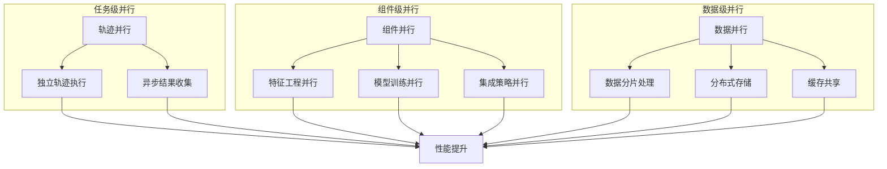

#### 2. 缓存优化策略

| 缓存层级 | 缓存内容 | 生命周期 | 清理策略 |
|---------|---------|---------|---------|
| L1缓存 | 频繁访问的实验结果 | 会话期间 | LRU淘汰 |
| L2缓存 | 中等频率的中间结果 | 日周期 | 基于访问频率 |
| L3缓存 | 历史实验数据 | 永久保存 | 基于重要性评分 |
| 磁盘缓存 | 大型数据集副本 | 可配置 | 基于存储空间 |

### 内存管理优化

#### 内存使用监控

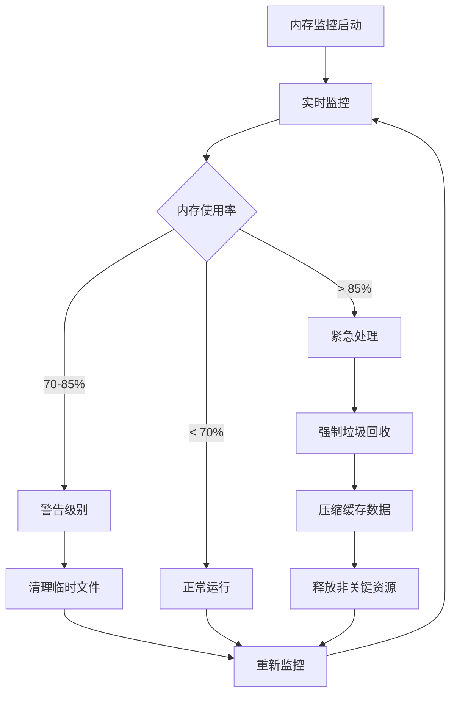

**章节来源**
- [trace_scheduler.py](file://rdagent/scenarios/data_science/proposal/exp_gen/trace_scheduler.py#L350-L444)
- [utils.py](file://rdagent/scenarios/data_science/proposal/exp_gen/utils.py#L80-L106)

## 故障排除指南

### 常见问题诊断

#### 1. 合并失败问题

**症状**：融合实验无法正常执行
**可能原因**：
- 轨迹间存在严重冲突
- LLM上下文窗口溢出
- 资源限制导致超时

**解决方案**：
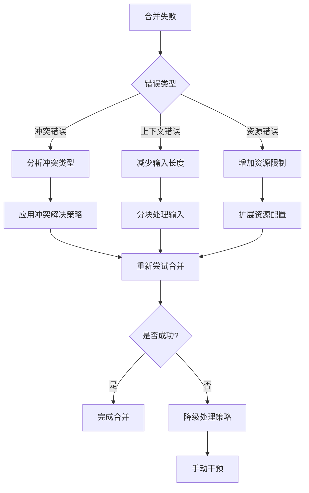

#### 2. 调度器异常

**症状**：调度器无法正常选择轨迹
**诊断步骤**：
1. 检查轨迹状态完整性
2. 验证调度器配置参数
3. 分析潜在函数计算结果
4. 检查并发访问冲突

#### 3. 性能问题排查

| 问题类型 | 检查项目 | 优化措施 | 预期效果 |
|---------|---------|---------|---------|
| 内存泄漏 | 对象引用追踪 | 强制垃圾回收 | 内存使用稳定 |
| CPU瓶颈 | 进程CPU使用率 | 任务并行化 | 处理速度提升 |
| I/O阻塞 | 文件读写性能 | 异步I/O操作 | 响应时间改善 |
| 网络延迟 | API调用响应时间 | 连接池优化 | 网络效率提升 |

### 监控与告警

系统提供全面的监控和告警机制：

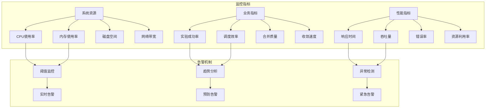

**章节来源**
- [base.py](file://rdagent/scenarios/data_science/proposal/exp_gen/base.py#L250-L349)
- [trace_scheduler.py](file://rdagent/scenarios/data_science/proposal/exp_gen/trace_scheduler.py#L400-L444)

## 总结

RD-Agent的提案合并与调度系统代表了自动化数据科学优化领域的前沿技术。通过精心设计的融合算法、智能调度策略和完善的冲突解决机制，该系统能够有效应对复杂的数据科学竞赛挑战。

### 核心优势

1. **智能化融合**：基于LLM的假设生成和多维度评估，确保融合质量
2. **动态调度**：自适应的调度策略切换，最大化利用有限时间
3. **鲁棒性强**：完善的冲突检测和自动解决机制
4. **可扩展性好**：模块化设计支持多种策略组合

### 应用前景

该系统不仅适用于Kaggle竞赛场景，还可扩展应用于：
- 企业级数据科学项目优化
- 自动化机器学习平台
- 科研项目的算法对比研究
- 工业界的大规模优化任务

随着人工智能技术的不断发展，提案合并与调度系统将在自动化优化领域发挥越来越重要的作用，为数据科学工作者提供强大的智能辅助工具。