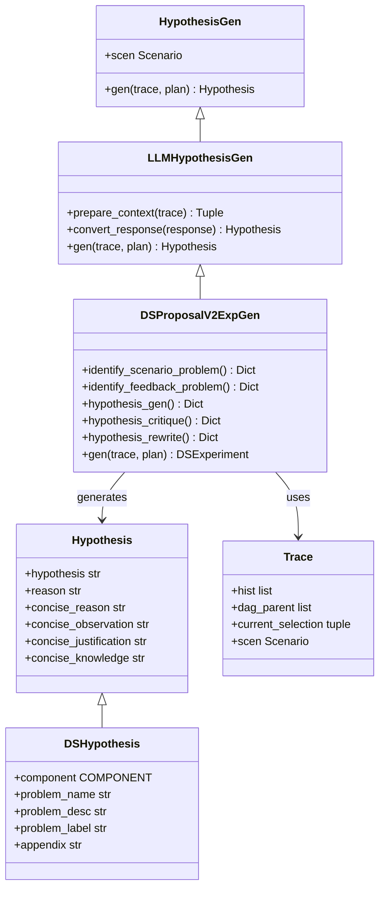
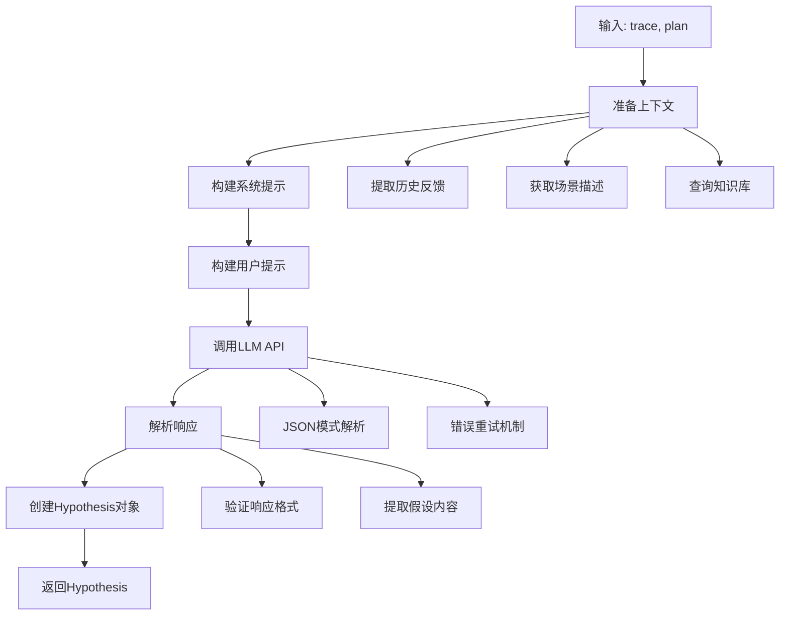
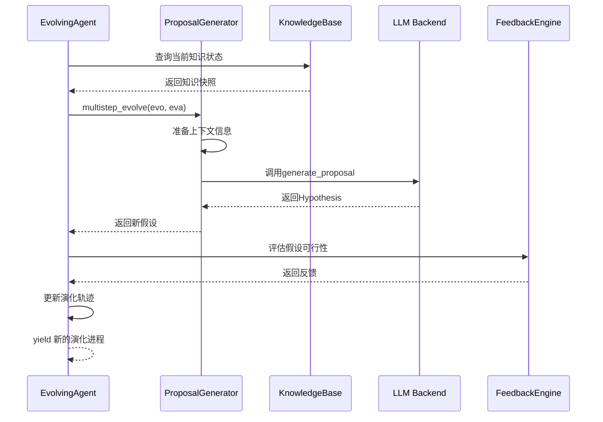
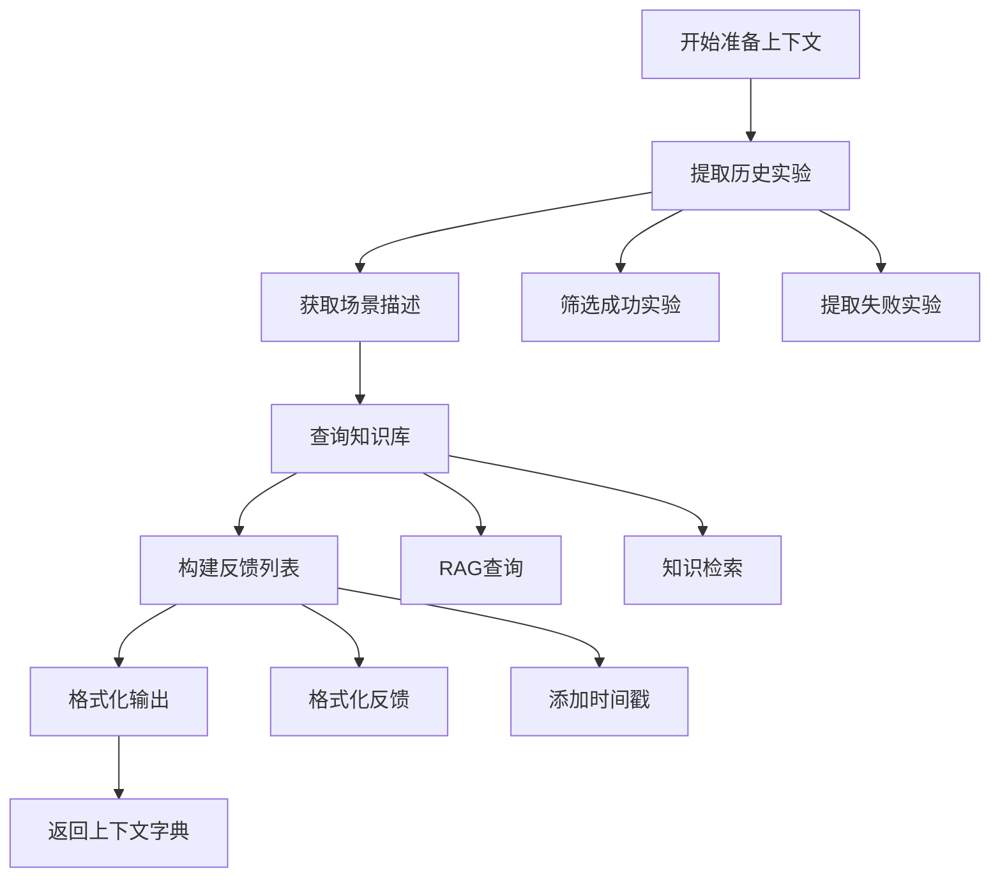
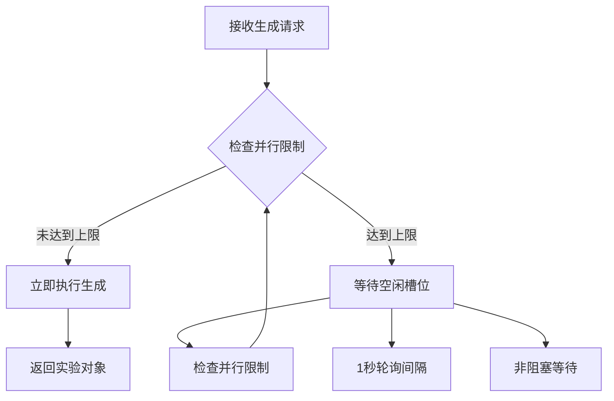
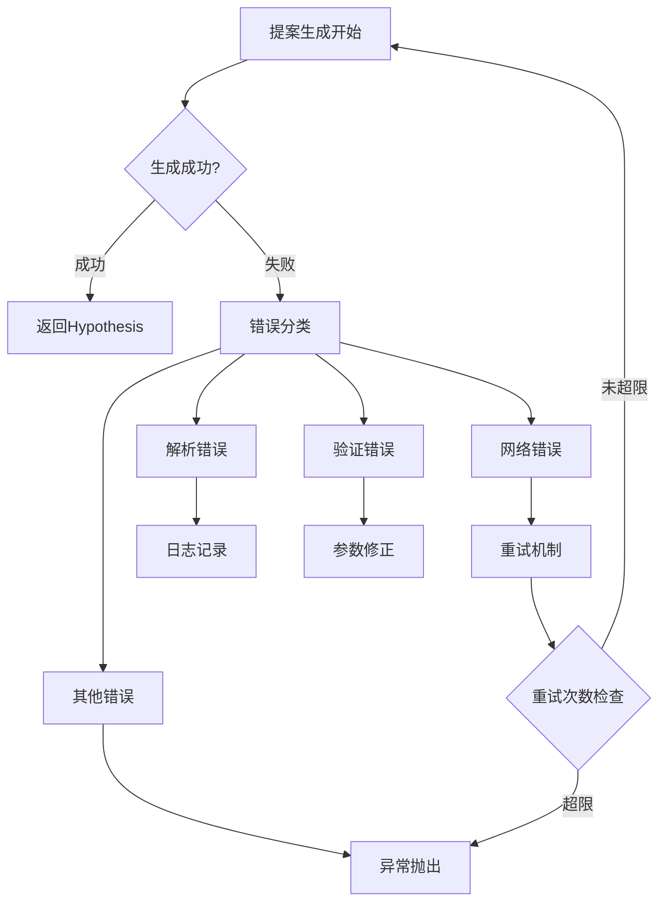
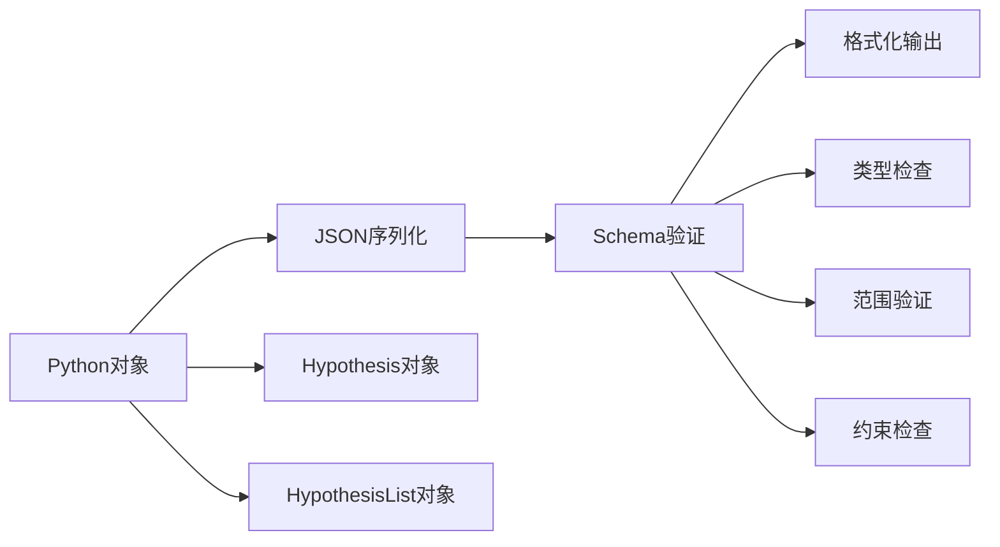

# 核心提案接口

<cite>
**本文档引用的文件**
- [rdagent/core/proposal.py](file://rdagent/core/proposal.py)
- [rdagent/scenarios/data_science/proposal/exp_gen/proposal.py](file://rdagent/scenarios/data_science/proposal/exp_gen/proposal.py)
- [rdagent/scenarios/data_science/proposal/exp_gen/base.py](file://rdagent/scenarios/data_science/proposal/exp_gen/base.py)
- [rdagent/components/proposal/__init__.py](file://rdagent/components/proposal/__init__.py)
- [rdagent/core/evolving_agent.py](file://rdagent/core/evolving_agent.py)
- [rdagent/core/evolving_framework.py](file://rdagent/core/evolving_framework.py)
- [rdagent/scenarios/data_science/proposal/exp_gen/prompts_v2.yaml](file://rdagent/scenarios/data_science/proposal/exp_gen/prompts_v2.yaml)
</cite>

## 目录
1. [简介](#简介)
2. [核心接口架构](#核心接口架构)
3. [Hypothesis对象模型](#hypothesis对象模型)
4. [generate_proposal方法详解](#generate_proposal方法详解)
5. [EvolvingAgent交互时序](#evolvingagent交互时序)
6. [提案生成器初始化](#提案生成器初始化)
7. [提案队列处理机制](#提案队列处理机制)
8. [异常处理模式](#异常处理模式)
9. [序列化与数据模型](#序列化与数据模型)
10. [技术参考指南](#技术参考指南)

## 简介

Proposal组件是RD-Agent系统中R&D双循环架构中的关键"研究"驱动器，负责生成创新性的假设（Hypothesis）以指导实验设计。该组件通过LLM驱动的方式，结合场景上下文、知识状态和历史反馈，生成具有挑战性和可行性的研究假设。

核心功能包括：
- 基于多维度问题识别的假设生成
- 与EvolvingAgent的深度集成
- 支持多种场景和任务类型
- 完整的异常处理和重试机制
- 可扩展的提示模板系统

## 核心接口架构



**图表来源**
- [rdagent/core/proposal.py](file://rdagent/core/proposal.py#L23-L51)
- [rdagent/scenarios/data_science/proposal/exp_gen/proposal.py](file://rdagent/scenarios/data_science/proposal/exp_gen/proposal.py#L484-L517)
- [rdagent/scenarios/data_science/proposal/exp_gen/base.py](file://rdagent/scenarios/data_science/proposal/exp_gen/base.py#L10-L35)

## Hypothesis对象模型

### 基础Hypothesis结构

Hypothesis是提案系统的核心数据模型，包含以下字段：

| 字段名 | 类型 | 描述 | 约束条件 |
|--------|------|------|----------|
| hypothesis | str | 具体的假设陈述 | 必填，清晰明确的测试性假设 |
| reason | str | 假设提出的理由 | 必填，详细的背景分析 |
| concise_reason | str | 简洁的假设理由 | 必填，不超过100字符 |
| concise_observation | str | 简洁的观察结果 | 必填，关键发现摘要 |
| concise_justification | str | 简洁的合理性说明 | 必填，支持假设的关键点 |
| concise_knowledge | str | 简洁的知识总结 | 必填，相关领域知识 |

### DSHypothesis扩展模型

针对数据科学场景的DSHypothesis增加了额外字段：

| 字段名 | 类型 | 描述 | 默认值 |
|--------|------|------|--------|
| component | COMPONENT | 关联的组件类型 | - |
| problem_name | str | 目标问题名称 | None |
| problem_desc | str | 问题描述 | None |
| problem_label | str | 问题标签 | "FEEDBACK_PROBLEM" |
| appendix | str | 附加信息 | None |

**章节来源**
- [rdagent/core/proosal.py](file://rdagent/core/proposal.py#L23-L51)
- [rdagent/scenarios/data_science/proposal/exp_gen/base.py](file://rdagent/scenarios/data_science/proposal/exp_gen/base.py#L10-L35)

## generate_proposal方法详解

### 方法签名与调用协议

```python
def gen(self, trace: Trace, plan: ExperimentPlan | None = None) -> Hypothesis
```

### 输入参数详解

#### trace参数（场景上下文）
- **类型**: `Trace` 或其子类（如`DSTrace`）
- **作用**: 提供当前实验历史、反馈记录和知识状态
- **关键属性**:
  - `hist`: 实验和反馈的历史记录列表
  - `dag_parent`: 有向无环图的父节点关系
  - `current_selection`: 当前选择的节点索引
  - `scen`: 场景描述和约束条件

#### plan参数（知识状态）
- **类型**: `ExperimentPlan | None`
- **作用**: 实验计划信息，可选参数
- **用途**: 指导实验生成过程，包含阶段规划和资源分配

### 返回值结构

方法返回一个`Hypothesis`对象，包含完整的假设信息：



**图表来源**
- [rdagent/components/proposal/__init__.py](file://rdagent/components/proposal/__init__.py#L25-L74)
- [rdagent/scenarios/data_science/proposal/exp_gen/proposal.py](file://rdagent/scenarios/data_science/proposal/exp_gen/proposal.py#L629-L656)

### 调用示例

以下是典型的`generate_proposal`调用流程：

```python
# 初始化提案生成器
proposal_generator = DSProposalV2ExpGen(scenario)

# 准备跟踪对象
trace = DSTrace(scenario, knowledge_base)

# 生成假设
hypothesis = proposal_generator.gen(
    trace=trace,
    plan=experiment_plan
)

# 使用假设进行实验设计
experiment = hypothesis2experiment.convert(hypothesis, trace)
```

**章节来源**
- [rdagent/scenarios/data_science/proposal/exp_gen/proposal.py](file://rdagent/scenarios/data_science/proposal/exp_gen/proposal.py#L484-L517)
- [rdagent/components/proposal/__init__.py](file://rdagent/components/proposal/__init__.py#L25-L74)

## EvolvingAgent交互时序

### R&D双循环集成机制



**图表来源**
- [rdagent/core/evolving_agent.py](file://rdagent/core/evolving_agent.py#L70-L115)
- [rdagent/core/evolving_framework.py](file://rdagent/core/evolving_framework.py#L50-L70)

### 时序关键步骤

1. **知识查询阶段**: EvolvingAgent首先查询当前的知识状态
2. **假设生成阶段**: 调用`generate_proposal`方法生成新的假设
3. **反馈评估阶段**: 对生成的假设进行可行性评估
4. **轨迹更新阶段**: 更新演化轨迹和知识库
5. **进程控制阶段**: 通过yield机制控制演化流程

**章节来源**
- [rdagent/core/evolving_agent.py](file://rdagent/core/evolving_agent.py#L70-L115)

## 提案生成器初始化

### 基础初始化流程

```python
# 方式1: 使用默认配置
proposal_gen = DSProposalV2ExpGen(scenario)

# 方式2: 自定义配置
proposal_gen = DSProposalV2ExpGen(
    supports_response_schema=True,
    enable_research_rag=True,
    enable_diversity_injection=True
)
```

### 配置参数详解

| 参数名 | 类型 | 默认值 | 描述 |
|--------|------|--------|------|
| supports_response_schema | bool | APIBackend().supports_response_schema() | 是否支持响应模式 |
| enable_research_rag | bool | DS_RD_SETTING.enable_research_rag | 是否启用检索增强生成 |
| enable_diversity_injection | bool | DS_RD_SETTING.enable_cross_trace_diversity | 是否启用多样性注入 |
| enable_generate_unique_hypothesis | bool | DS_RD_SETTING.enable_generate_unique_hypothesis | 是否生成唯一假设 |

### 上下文准备机制

提案生成器通过`prepare_context`方法准备生成上下文：



**图表来源**
- [rdagent/scenarios/data_science/proposal/exp_gen/proposal.py](file://rdagent/scenarios/data_science/proposal/exp_gen/proposal.py#L519-L580)

**章节来源**
- [rdagent/scenarios/data_science/proposal/exp_gen/proposal.py](file://rdagent/scenarios/data_science/proposal/exp_gen/proposal.py#L484-L517)

## 提案队列处理机制

### 异步生成队列

系统支持异步的提案生成队列管理：

```python
async def async_gen(self, trace: Trace, loop: LoopBase) -> Experiment:
    while True:
        if loop.get_unfinished_loop_cnt(loop.loop_idx) < RD_AGENT_SETTINGS.get_max_parallel():
            return self.gen(trace)
        await asyncio.sleep(1)
```

### 并行处理策略



**图表来源**
- [rdagent/core/proposal.py](file://rdagent/core/proposal.py#L323-L365)

### 队列管理特性

- **动态负载均衡**: 根据系统负载动态调整并发度
- **资源保护**: 防止系统资源耗尽
- **优雅降级**: 在高负载情况下逐步降低生成频率
- **状态同步**: 维护全局生成状态的一致性

**章节来源**
- [rdagent/core/proposal.py](file://rdagent/core/proposal.py#L323-L365)

## 异常处理模式

### 错误分类与处理



**图表来源**
- [rdagent/scenarios/data_science/proposal/exp_gen/proposal.py](file://rdagent/scenarios/data_science/proposal/exp_gen/proposal.py#L683-L717)

### 重试机制配置

系统采用指数退避的重试策略：

| 错误类型 | 初始重试次数 | 最大重试次数 | 退避策略 |
|----------|--------------|--------------|----------|
| 网络超时 | 3 | 5 | 指数退避 |
| 解析失败 | 2 | 3 | 线性递增 |
| 验证错误 | 1 | 1 | 单次重试 |
| 其他异常 | 0 | 0 | 直接抛出 |

### 异常恢复流程

```python
@wait_retry(retry_n=5, transform_args_fn=_append_retry)
def hypothesis_gen(...):
    # 主要逻辑
    pass
```

**章节来源**
- [rdagent/scenarios/data_science/proposal/exp_gen/proposal.py](file://rdagent/scenarios/data_science/proposal/exp_gen/proposal.py#L683-L717)

## 序列化与数据模型

### JSON Schema定义

系统支持完整的JSON Schema验证：

```yaml
# HypothesisList Schema
{
  "type": "object",
  "properties": {
    "deduplicated_challenges": {
      "type": "array",
      "items": {"type": "string"}
    },
    "hypotheses": {
      "type": "array",
      "items": {
        "$ref": "#/definitions/HypothesisDetail"
      }
    }
  }
}
```

### 数据验证规则

| 字段 | 验证规则 | 错误处理 |
|------|----------|----------|
| hypothesis | 非空字符串，长度<1000字符 | 抛出ValueError |
| component | 枚举值：DataLoadSpec/FeatureEng/Model/Ensemble/Workflow | 验证枚举值 |
| evaluation | 包含所有评分维度 | 数值范围检查(1-10) |
| problem_name | 唯一标识符 | 去重处理 |

### 序列化格式



**图表来源**
- [rdagent/scenarios/data_science/proposal/exp_gen/proposal.py](file://rdagent/scenarios/data_science/proposal/exp_gen/proposal.py#L683-L717)

**章节来源**
- [rdagent/scenarios/data_science/proposal/exp_gen/proposal.py](file://rdagent/scenarios/data_science/proposal/exp_gen/proposal.py#L683-L717)

## 技术参考指南

### 接口集成最佳实践

#### 1. 初始化配置
```python
# 推荐的初始化方式
proposal_config = {
    "supports_response_schema": True,
    "enable_research_rag": True,
    "enable_diversity_injection": True
}

generator = DSProposalV2ExpGen(scenario, **proposal_config)
```

#### 2. 错误处理
```python
try:
    hypothesis = generator.gen(trace, plan)
except ValueError as e:
    logger.error(f"Hypothesis generation failed: {e}")
    # 处理特定错误类型
except Exception as e:
    logger.exception("Unexpected error in hypothesis generation")
    # 通用错误处理
```

#### 3. 性能优化
```python
# 批量处理提高效率
async def batch_generate_hypotheses(traces: List[DSTrace]):
    tasks = [generator.async_gen(trace, loop) for trace in traces]
    results = await asyncio.gather(*tasks, return_exceptions=True)
    return results
```

### 开发者工具

#### 调试辅助函数
```python
def debug_hypothesis_generation(generator, trace, plan):
    """调试假设生成过程"""
    context = generator.prepare_context(trace)
    print(f"Context keys: {list(context.keys())}")
    print(f"System prompt length: {len(generator.system_prompt)}")
    print(f"User prompt length: {len(generator.user_prompt)}")
```

#### 性能监控
```python
@RD_Agent_TIMER_wrapper
def monitor_hypothesis_performance(generator, trace, plan):
    """监控假设生成性能"""
    start_time = time.time()
    hypothesis = generator.gen(trace, plan)
    duration = time.time() - start_time
    logger.info(f"Hypothesis generation took {duration:.2f} seconds")
    return hypothesis
```

### 故障排除指南

#### 常见问题与解决方案

| 问题症状 | 可能原因 | 解决方案 |
|----------|----------|----------|
| 假设生成失败 | API连接超时 | 检查网络连接，增加重试次数 |
| 响应格式错误 | LLM输出不规范 | 调整提示模板，启用JSON模式 |
| 内存不足 | 并发度过高 | 降低max_parallel设置 |
| 知识检索失败 | RAG服务不可用 | 启用本地缓存，降级处理 |

#### 性能调优建议

1. **合理设置并发度**: 根据系统资源调整`max_parallel`参数
2. **优化提示模板**: 减少不必要的上下文信息
3. **启用缓存机制**: 缓存重复的查询结果
4. **监控资源使用**: 定期检查内存和CPU使用情况

**章节来源**
- [rdagent/scenarios/data_science/proposal/exp_gen/proposal.py](file://rdagent/scenarios/data_science/proposal/exp_gen/proposal.py#L484-L517)
- [rdagent/components/proposal/__init__.py](file://rdagent/components/proposal/__init__.py#L25-L74)