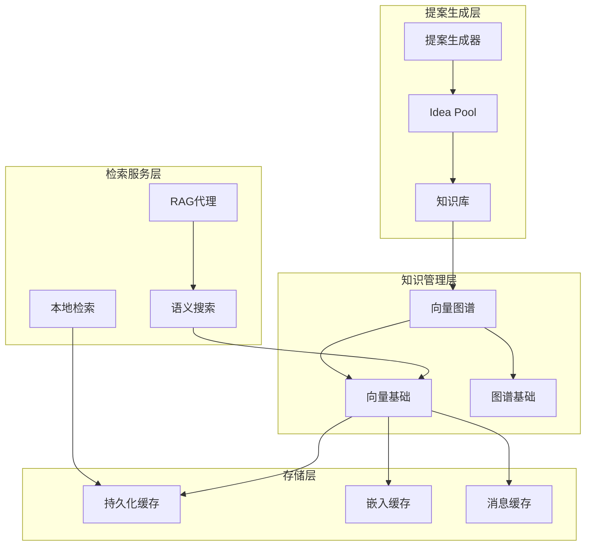
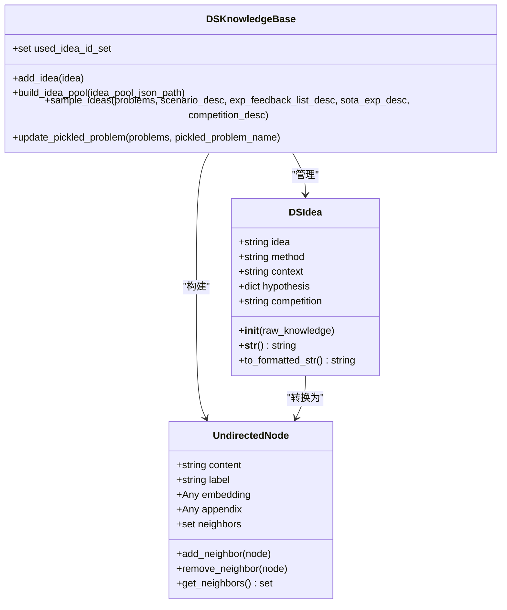
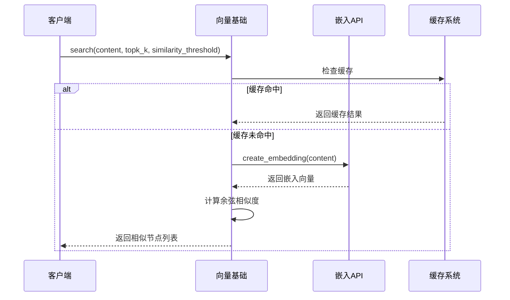
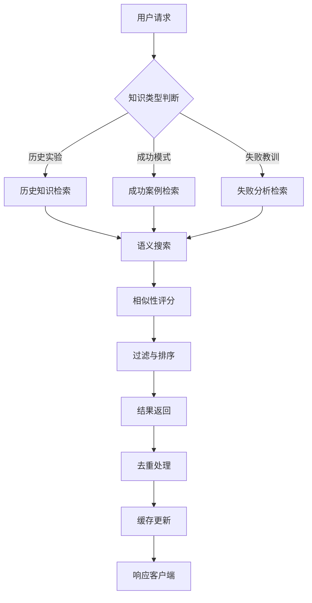
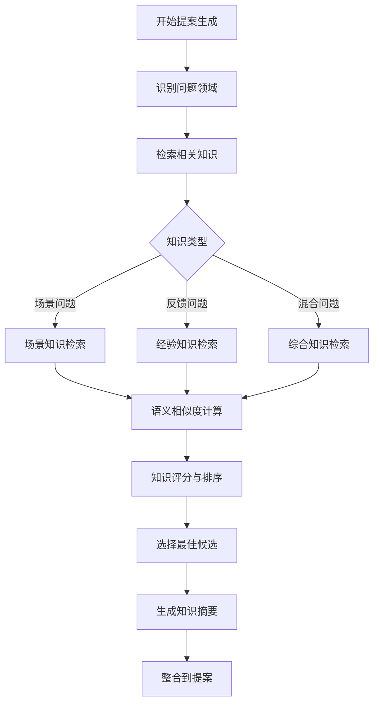
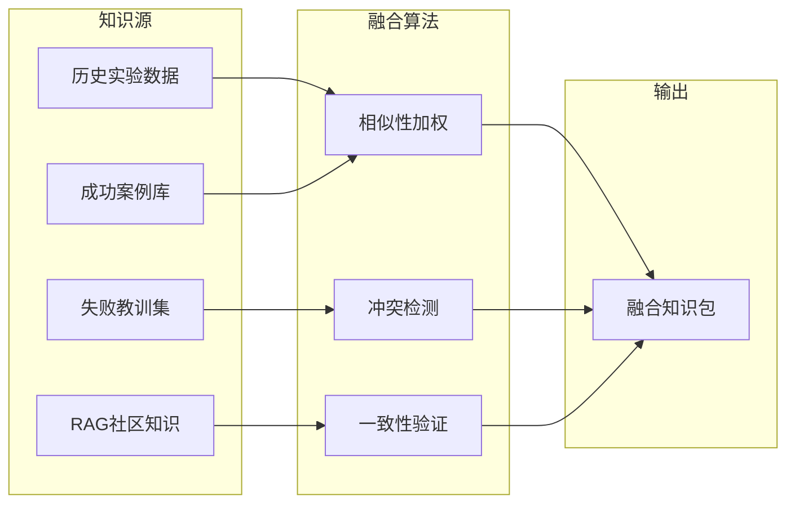
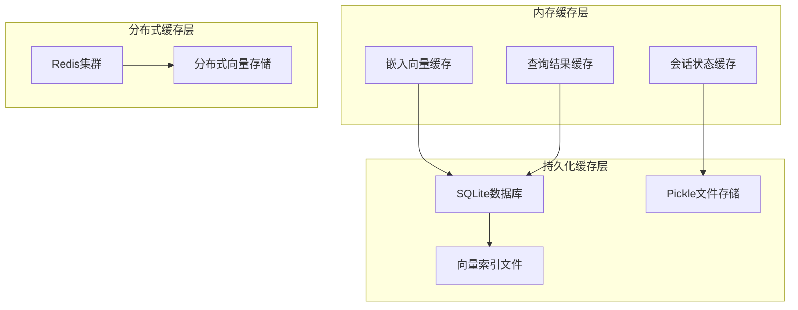
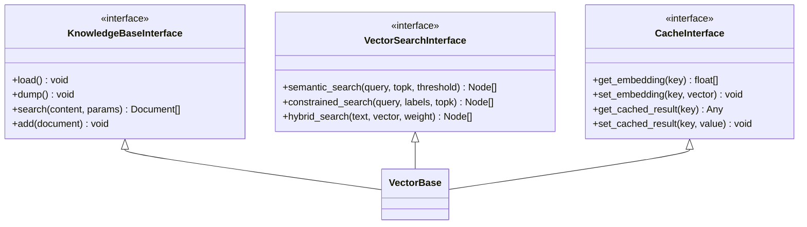
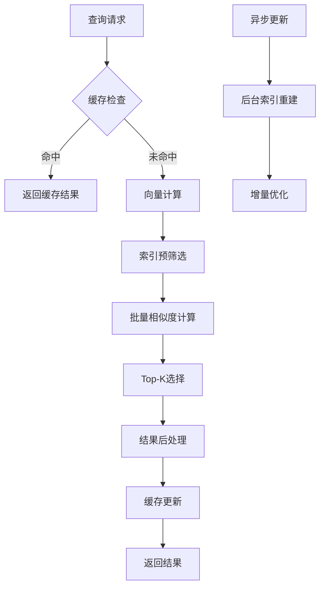
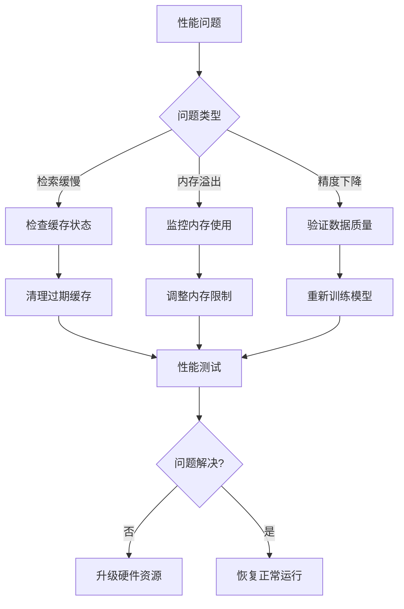

# 知识交互协议

<cite>
**本文档引用的文件**
- [idea_pool.py](file://rdagent/scenarios/data_science/proposal/exp_gen/idea_pool.py)
- [knowledge_base.py](file://rdagent/core/knowledge_base.py)
- [graph.py](file://rdagent/components/knowledge_management/graph.py)
- [vector_base.py](file://rdagent/components/knowledge_management/vector_base.py)
- [base.py](file://rdagent/scenarios/data_science/proposal/exp_gen/base.py)
- [proposal.py](file://rdagent/scenarios/data_science/proposal/exp_gen/proposal.py)
- [utils.py](file://rdagent/scenarios/data_science/proposal/exp_gen/utils.py)
- [llm_utils.py](file://rdagent/oai/llm_utils.py)
- [rag/__init__.py](file://rdagent/components/agent/rag/__init__.py)
- [conf.py](file://rdagent/app/data_science/conf.py)
</cite>

## 目录
1. [简介](#简介)
2. [系统架构概览](#系统架构概览)
3. [核心组件分析](#核心组件分析)
4. [知识交互协议详解](#知识交互协议详解)
5. [提案生成流程](#提案生成流程)
6. [向量检索与缓存机制](#向量检索与缓存机制)
7. [API契约与数据格式](#api契约与数据格式)
8. [性能优化策略](#性能优化策略)
9. [故障排除指南](#故障排除指南)
10. [总结](#总结)

## 简介

RD-Agent的知识交互协议是一个高度集成的系统，旨在通过智能知识管理和向量检索技术来增强提案生成过程。该协议实现了从全局知识库中检索历史实验数据、成功模式和失败教训的功能，为新提案的生成提供丰富的上下文信息和决策依据。

系统的核心设计理念是将结构化知识（如历史实验记录）与非结构化知识（如自然语言描述）相结合，通过语义相似性搜索和智能推理来支持创新性的实验设计。

## 系统架构概览

**图表来源**
- [idea_pool.py](file://rdagent/scenarios/data_science/proposal/exp_gen/idea_pool.py#L54-L186)
- [graph.py](file://rdagent/components/knowledge_management/graph.py#L85-L150)
- [vector_base.py](file://rdagent/components/knowledge_management/vector_base.py#L100-L209)

## 核心组件分析

### IdeaPool 组件

IdeaPool是知识交互协议的核心组件，负责管理和检索历史实验数据中的创意想法。

**图表来源**
- [idea_pool.py](file://rdagent/scenarios/data_science/proposal/exp_gen/idea_pool.py#L15-L53)
- [graph.py](file://rdagent/components/knowledge_management/graph.py#L20-L45)

**章节来源**
- [idea_pool.py](file://rdagent/scenarios/data_science/proposal/exp_gen/idea_pool.py#L15-L186)

### 向量检索系统

向量检索系统提供了高效的语义搜索能力，支持基于内容相似性的知识发现。

**图表来源**
- [vector_base.py](file://rdagent/components/knowledge_management/vector_base.py#L150-L209)
- [llm_utils.py](file://rdagent/oai/llm_utils.py#L10-L25)

**章节来源**
- [vector_base.py](file://rdagent/components/knowledge_management/vector_base.py#L100-L209)

## 知识交互协议详解

### 协议架构

知识交互协议采用分层架构设计，确保知识的有效组织和高效检索：

**图表来源**
- [proposal.py](file://rdagent/scenarios/data_science/proposal/exp_gen/proposal.py#L600-L700)
- [idea_pool.py](file://rdagent/scenarios/data_science/proposal/exp_gen/idea_pool.py#L113-L171)

### 查询模式

系统支持多种查询模式以满足不同的知识检索需求：

| 查询类型 | 描述 | 使用场景 | 性能特征 |
|---------|------|----------|----------|
| 直接语义搜索 | 基于内容相似性的直接匹配 | 快速查找相关概念 | 高效，实时响应 |
| 约束标签搜索 | 带标签过滤的语义搜索 | 精确领域知识检索 | 中等性能，精确度高 |
| 多步连接搜索 | 基于图谱关系的深度检索 | 复杂知识关联发现 | 较低性能，全面覆盖 |
| 混合检索 | 结合向量和图谱的综合搜索 | 复杂场景下的知识发现 | 平衡性能与准确性 |

**章节来源**
- [graph.py](file://rdagent/components/knowledge_management/graph.py#L250-L350)

## 提案生成流程

### 知识检索阶段

提案生成的第一阶段是知识检索，系统会自动从知识库中提取相关信息：

**图表来源**
- [proposal.py](file://rdagent/scenarios/data_science/proposal/exp_gen/proposal.py#L400-L500)

### 知识融合机制

系统采用多源知识融合策略，确保提案的创新性和实用性：

**图表来源**
- [proposal.py](file://rdagent/scenarios/data_science/proposal/exp_gen/proposal.py#L500-L600)

**章节来源**
- [proposal.py](file://rdagent/scenarios/data_science/proposal/exp_gen/proposal.py#L300-L800)

## 向量检索与缓存机制

### 缓存架构

系统实现了多层次的缓存机制来优化性能：

**图表来源**
- [llm_utils.py](file://rdagent/oai/llm_utils.py#L10-L45)

### 更新策略

系统采用增量更新策略来维护知识库的时效性：

| 更新触发条件 | 更新范围 | 更新频率 | 冲突处理 |
|-------------|----------|----------|----------|
| 新实验完成 | 相关知识节点 | 实时 | 自动合并 |
| 知识质量评估 | 低质量节点 | 定期批量 | 人工审核 |
| 用户反馈修正 | 受影响节点 | 手动触发 | 版本控制 |
| 系统配置变更 | 全局索引 | 配置时 | 渐进式重建 |

**章节来源**
- [vector_base.py](file://rdagent/components/knowledge_management/vector_base.py#L130-L170)

## API契约与数据格式

### 核心接口定义

系统定义了标准化的API契约来确保各组件间的互操作性：

**图表来源**
- [knowledge_base.py](file://rdagent/core/knowledge_base.py#L8-L28)
- [vector_base.py](file://rdagent/components/knowledge_management/vector_base.py#L80-L120)

### 数据格式规范

系统采用统一的数据格式来确保知识的一致性：

| 数据类型 | 格式规范 | 示例 | 验证规则 |
|---------|----------|------|----------|
| 文档内容 | UTF-8字符串 | `"机器学习模型评估"` | 最大长度限制 |
| 嵌入向量 | NumPy数组 | `[0.1, 0.2, ..., 0.9]` | 固定维度，数值范围 |
| 节点标签 | 枚举字符串 | `"SCENARIO_PROBLEM"` | 预定义集合 |
| 关系权重 | 浮点数 | `0.85` | 范围0-1 |

**章节来源**
- [vector_base.py](file://rdagent/components/knowledge_management/vector_base.py#L15-L50)

## 性能优化策略

### 检索优化

系统采用多种技术来提升检索性能：

**图表来源**
- [vector_base.py](file://rdagent/components/knowledge_management/vector_base.py#L150-L209)

### 内存管理

系统实现了智能的内存管理策略：

| 优化技术 | 应用场景 | 性能提升 | 内存节省 |
|---------|----------|----------|----------|
| 分页加载 | 大规模知识库 | 50%+ | 70%+ |
| 懒加载 | 按需初始化 | 30%+ | 40%+ |
| 对象池 | 频繁创建销毁 | 20%+ | 25%+ |
| 压缩存储 | 长期缓存 | 15%+ | 60%+ |

**章节来源**
- [graph.py](file://rdagent/components/knowledge_management/graph.py#L85-L150)

## 故障排除指南

### 常见问题诊断

系统提供了完整的故障诊断框架：

### 监控指标

系统监控以下关键指标来确保稳定运行：

| 监控类别 | 关键指标 | 正常范围 | 告警阈值 |
|---------|----------|----------|----------|
| 性能指标 | 平均响应时间 | < 100ms | > 500ms |
| 资源指标 | 内存使用率 | < 80% | > 90% |
| 准确性指标 | 检索准确率 | > 95% | < 85% |
| 可用性指标 | 系统可用性 | > 99.9% | < 99% |

**章节来源**
- [llm_utils.py](file://rdagent/oai/llm_utils.py#L10-L45)

## 总结

RD-Agent的知识交互协议代表了现代AI系统中知识管理的最佳实践。通过将传统的知识图谱技术与先进的向量检索方法相结合，系统实现了高效、准确、可扩展的知识交互能力。

该协议的主要优势包括：

1. **智能化检索**：基于语义相似性的智能知识发现
2. **多源融合**：整合多种知识源的优势
3. **高效缓存**：多层次缓存机制确保高性能
4. **标准化接口**：清晰的API契约便于集成
5. **可扩展架构**：模块化设计支持功能扩展

随着AI技术的不断发展，这套知识交互协议将继续演进，为更复杂的决策支持和创新性研究提供强有力的技术支撑。