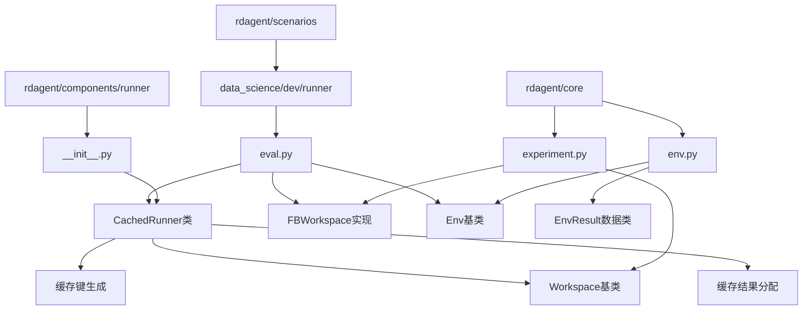
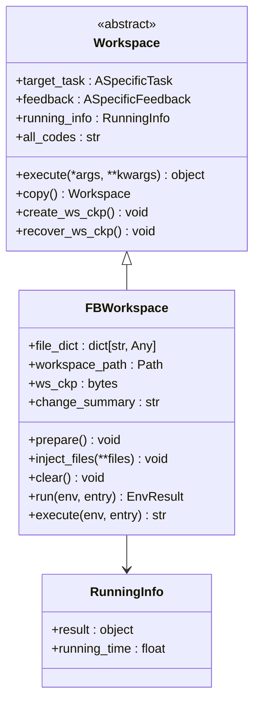
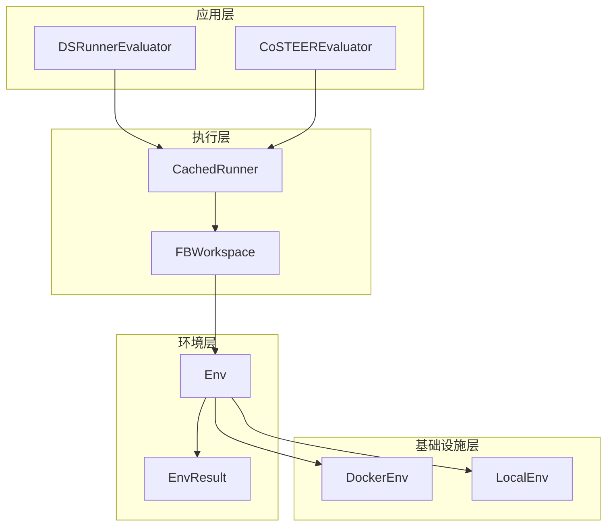
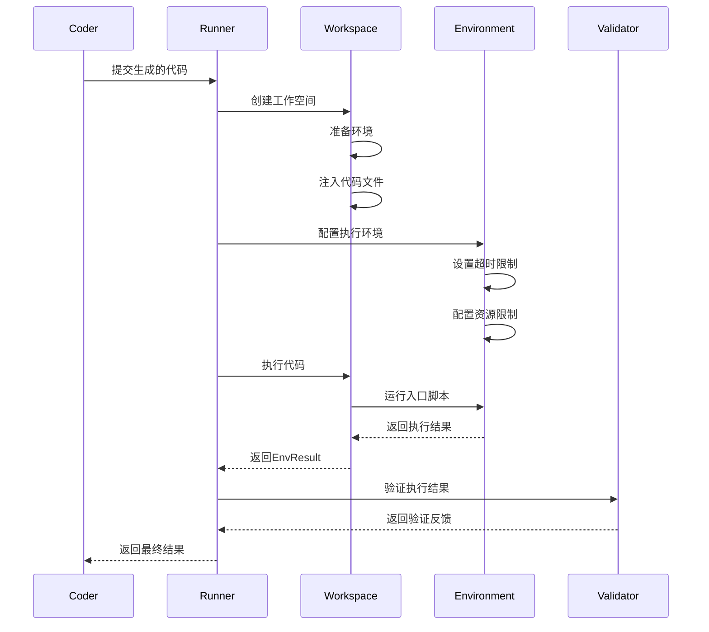
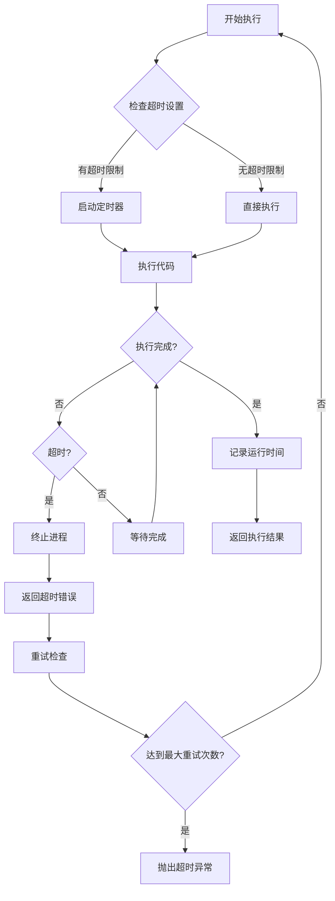
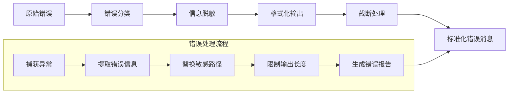
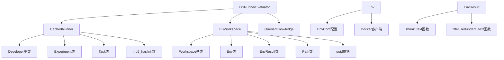
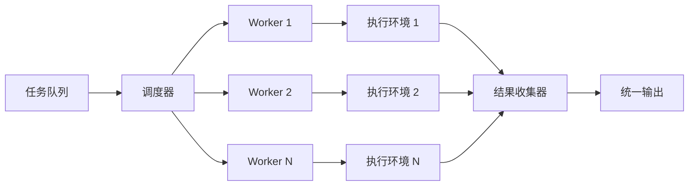

# Runner组件API

<cite>
**本文档中引用的文件**
- [rdagent/components/runner/__init__.py](file://rdagent/components/runner/__init__.py)
- [rdagent/core/experiment.py](file://rdagent/core/experiment.py)
- [rdagent/scenarios/data_science/dev/runner/eval.py](file://rdagent/scenarios/data_science/dev/runner/eval.py)
- [rdagent/utils/env.py](file://rdagent/utils/env.py)
- [rdagent/components/coder/data_science/share/eval.py](file://rdagent/components/coder/data_science/share/eval.py)
- [rdagent/components/coder/factor_coder/factor.py](file://rdagent/components/coder/factor_coder/factor.py)
- [rdagent/scenarios/shared/get_runtime_info.py](file://rdagent/scenarios/shared/get_runtime_info.py)
</cite>

## 目录
1. [简介](#简介)
2. [项目结构](#项目结构)
3. [核心组件](#核心组件)
4. [架构概览](#架构概览)
5. [详细组件分析](#详细组件分析)
6. [依赖关系分析](#依赖关系分析)
7. [性能考虑](#性能考虑)
8. [故障排除指南](#故障排除指南)
9. [结论](#结论)

## 简介

Runner组件是RD-Agent框架中的核心执行引擎，负责管理代码沙箱环境、执行生成的代码并捕获执行结果。该组件作为Coder组件与评估系统的桥梁，提供了标准化的代码执行接口和结果反馈机制。

Runner组件的主要职责包括：
- 沙箱环境管理与隔离
- 代码执行与监控
- 执行结果捕获与格式化
- 异常处理与错误报告
- 性能指标收集
- 与评估系统的集成

## 项目结构

Runner组件在项目中的组织结构如下：



**图表来源**
- [rdagent/components/runner/__init__.py](file://rdagent/components/runner/__init__.py#L1-L21)
- [rdagent/core/experiment.py](file://rdagent/core/experiment.py#L1-L50)
- [rdagent/utils/env.py](file://rdagent/utils/env.py#L1-L50)

**章节来源**
- [rdagent/components/runner/__init__.py](file://rdagent/components/runner/__init__.py#L1-L21)
- [rdagent/core/experiment.py](file://rdagent/core/experiment.py#L1-L100)

## 核心组件

### CachedRunner类

CachedRunner是Runner组件的核心实现，继承自Developer抽象基类，提供了代码执行的缓存机制和结果管理功能。

#### 主要特性

1. **缓存机制**：通过任务信息生成MD5哈希作为缓存键
2. **结果管理**：支持缓存结果的分配和恢复
3. **任务跟踪**：维护基于实验和子任务的任务信息链

#### 接口定义

```python
class CachedRunner(Developer[ASpecificExp]):
    def get_cache_key(self, exp: Experiment) -> str:
        """
        为实验生成缓存键
        
        参数:
            exp: 实验对象
            
        返回:
            str: 基于任务信息的MD5哈希字符串
        """
        
    def assign_cached_result(self, exp: Experiment, cached_res: Experiment) -> Experiment:
        """
        将缓存结果分配给实验对象
        
        参数:
            exp: 目标实验对象
            cached_res: 缓存的实验结果
            
        返回:
            Experiment: 更新后的实验对象
        """
```

**章节来源**
- [rdagent/components/runner/__init__.py](file://rdagent/components/runner/__init__.py#L5-L19)

### Workspace执行环境

Workspace是Runner组件的核心执行环境，提供了代码注入、执行和结果捕获的功能。

#### FBWorkspace实现

FBWorkspace是Workspace接口的具体实现，基于文件系统的工作空间管理：



**图表来源**
- [rdagent/core/experiment.py](file://rdagent/core/experiment.py#L87-L164)
- [rdagent/core/experiment.py](file://rdagent/core/experiment.py#L165-L250)

**章节来源**
- [rdagent/core/experiment.py](file://rdagent/core/experiment.py#L87-L250)

## 架构概览

Runner组件的整体架构采用分层设计，确保了模块间的松耦合和高内聚：



**图表来源**
- [rdagent/scenarios/data_science/dev/runner/eval.py](file://rdagent/scenarios/data_science/dev/runner/eval.py#L50-L100)
- [rdagent/components/runner/__init__.py](file://rdagent/components/runner/__init__.py#L5-L19)
- [rdagent/utils/env.py](file://rdagent/utils/env.py#L150-L200)

## 详细组件分析

### 执行流程分析

Runner组件的执行流程遵循标准化的模式，确保了代码执行的一致性和可预测性：



**图表来源**
- [rdagent/core/experiment.py](file://rdagent/core/experiment.py#L283-L314)
- [rdagent/scenarios/data_science/dev/runner/eval.py](file://rdagent/scenarios/data_science/dev/runner/eval.py#L80-L120)

### 环境管理机制

Runner组件支持多种执行环境，包括本地环境和Docker容器环境：

#### EnvResult数据结构

EnvResult类封装了执行环境的返回结果，包含了完整的执行信息：

```python
@dataclass
class EnvResult:
    """
    环境执行结果的数据类
    
    包含标准输出、退出代码和运行时间
    """
    stdout: str          # 标准输出内容
    exit_code: int       # 退出代码
    running_time: float  # 运行时间（秒）
    
    def get_truncated_stdout(self) -> str:
        """
        获取截断的标准输出
        
        返回:
            str: 截断后的标准输出文本
        """
```

#### 超时与重试机制

Runner组件实现了智能的超时控制和重试机制：



**图表来源**
- [rdagent/utils/env.py](file://rdagent/utils/env.py#L241-L270)

**章节来源**
- [rdagent/utils/env.py](file://rdagent/utils/env.py#L150-L270)

### 错误处理与异常管理

Runner组件提供了完善的错误处理机制，能够捕获和处理各种类型的执行错误：

#### 异常类型与处理策略

1. **运行时异常**：代码执行过程中发生的异常
2. **超时异常**：超过设定时间限制的情况
3. **资源不足异常**：内存或CPU资源不足
4. **权限异常**：文件访问或系统调用权限问题

#### 错误信息标准化



**图表来源**
- [rdagent/components/coder/factor_coder/factor.py](file://rdagent/components/coder/factor_coder/factor.py#L159-L208)

**章节来源**
- [rdagent/components/coder/factor_coder/factor.py](file://rdagent/components/coder/factor_coder/factor.py#L159-L208)

### 结果反馈与评估

Runner组件不仅执行代码，还负责收集执行结果并提供给评估系统：

#### 执行结果结构

```python
@dataclass
class DSRunnerFeedback:
    """
    数据科学Runner反馈类
    
    继承自CoSTEERSingleFeedback，提供专门的数据科学评估反馈
    """
    acceptable: bool | None = None              # 是否可接受
    hyperparameter_tuning_decision: bool | None = None  # 超参数调优决策
    hyperparameter_tuning_suggestion: str | None = None  # 超参数调优建议
    score: str | None = None                    # 执行分数
    
    def is_acceptable(self) -> bool:
        """
        判断执行是否可接受
        
        返回:
            bool: 可接受状态
        """
```

#### 评估指标收集

Runner组件会自动收集以下评估指标：

1. **执行状态**：成功/失败标志
2. **性能指标**：运行时间、内存使用
3. **输出质量**：生成文件的数量和质量
4. **错误信息**：详细的错误描述和堆栈跟踪

**章节来源**
- [rdagent/scenarios/data_science/dev/runner/eval.py](file://rdagent/scenarios/data_science/dev/runner/eval.py#L25-L70)

## 依赖关系分析

Runner组件的依赖关系体现了其作为框架核心组件的重要地位：



**图表来源**
- [rdagent/components/runner/__init__.py](file://rdagent/components/runner/__init__.py#L1-L5)
- [rdagent/core/experiment.py](file://rdagent/core/experiment.py#L1-L30)
- [rdagent/utils/env.py](file://rdagent/utils/env.py#L1-L30)

**章节来源**
- [rdagent/components/runner/__init__.py](file://rdagent/components/runner/__init__.py#L1-L21)
- [rdagent/core/experiment.py](file://rdagent/core/experiment.py#L1-L100)

## 性能考虑

Runner组件在设计时充分考虑了性能优化，采用了多种策略来提高执行效率：

### 缓存策略

1. **任务级缓存**：基于任务信息的MD5哈希缓存
2. **增量更新**：只缓存发生变化的部分
3. **内存管理**：及时清理不需要的缓存数据

### 并发执行

Runner组件支持并发执行多个任务，提高了整体吞吐量：



### 资源优化

1. **内存使用**：及时释放不需要的临时文件
2. **磁盘I/O**：最小化文件读写操作
3. **网络通信**：减少不必要的网络请求

## 故障排除指南

### 常见问题与解决方案

#### 执行超时问题

**症状**：代码执行超过设定时间限制

**原因分析**：
- 代码逻辑复杂度高
- 外部依赖响应慢
- 资源竞争

**解决方案**：
1. 增加超时时间限制
2. 优化代码逻辑
3. 使用异步执行

#### 内存不足问题

**症状**：执行过程中出现内存溢出

**原因分析**：
- 数据集过大
- 算法复杂度高
- 内存泄漏

**解决方案**：
1. 分块处理大数据
2. 使用更高效的算法
3. 定期清理内存

#### 权限问题

**症状**：无法访问某些文件或目录

**原因分析**：
- 文件权限设置不当
- 用户权限不足
- 安全策略限制

**解决方案**：
1. 调整文件权限
2. 使用适当的用户身份
3. 配置安全策略

**章节来源**
- [rdagent/components/coder/factor_coder/factor.py](file://rdagent/components/coder/factor_coder/factor.py#L184-L208)

## 结论

Runner组件作为RD-Agent框架的核心执行引擎，提供了完整而强大的代码执行能力。其设计充分体现了现代软件架构的最佳实践：

### 主要优势

1. **模块化设计**：清晰的接口定义和职责分离
2. **可扩展性**：支持多种执行后端和环境配置
3. **可靠性**：完善的错误处理和恢复机制
4. **性能优化**：智能缓存和资源管理
5. **标准化**：统一的接口规范和结果格式

### 设计意图

Runner组件的设计体现了对扩展性的深刻理解。通过抽象的接口设计，它为未来的扩展预留了充足的空间：

- **Docker容器支持**：通过Env接口抽象，可以轻松集成Docker执行环境
- **远程执行节点**：支持分布式执行架构
- **Kaggle API集成**：为竞赛场景提供专门的执行环境
- **自定义执行器**：允许开发者实现特定需求的执行器

### 未来发展方向

1. **多语言支持**：扩展对其他编程语言的支持
2. **实时监控**：提供更详细的执行过程监控
3. **智能调度**：基于资源使用情况的智能任务调度
4. **云原生支持**：更好的云平台集成能力

Runner组件的成功实现为RD-Agent框架奠定了坚实的基础，使其能够在复杂的机器学习和数据科学场景中发挥重要作用。