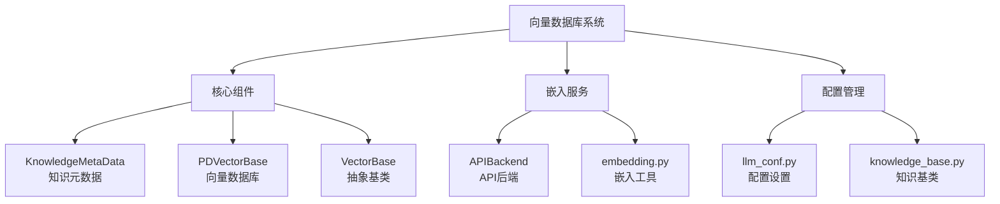
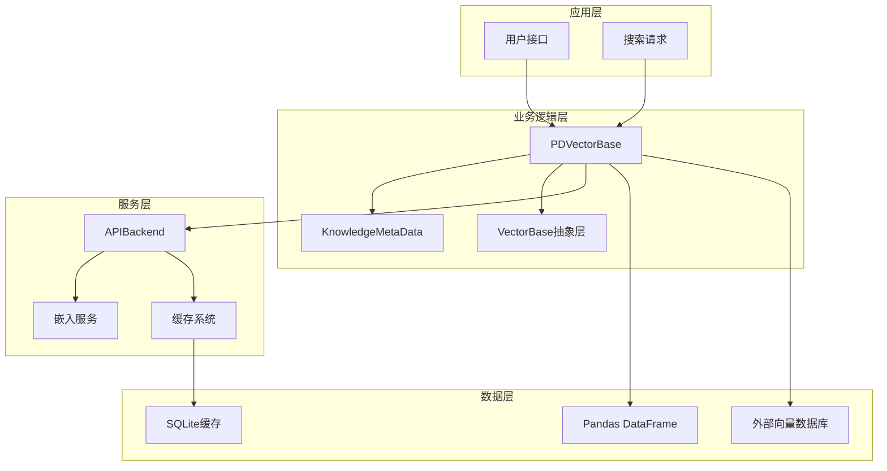
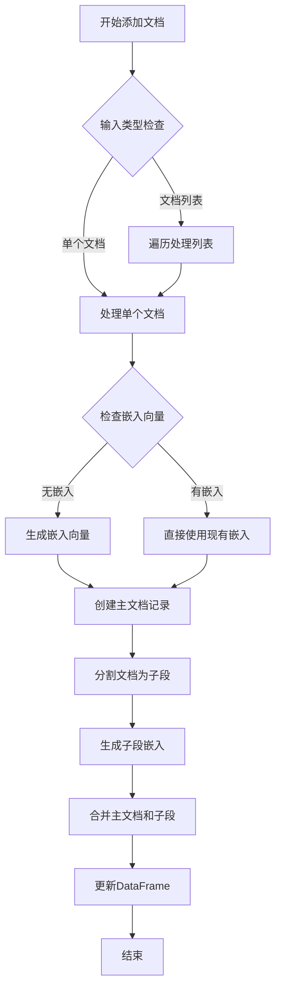
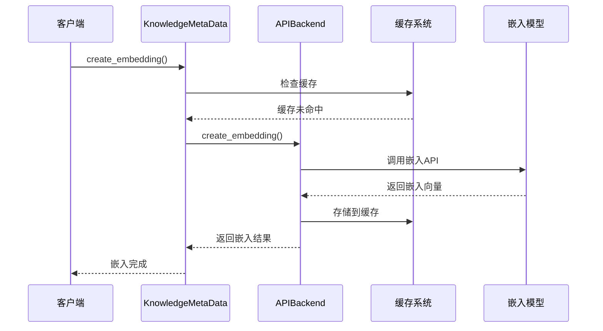
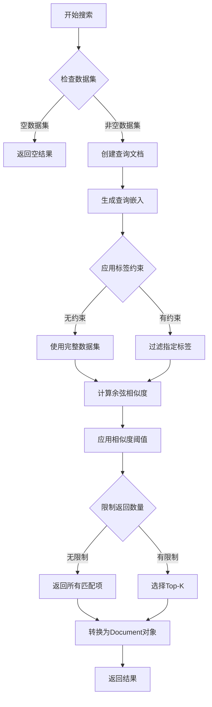
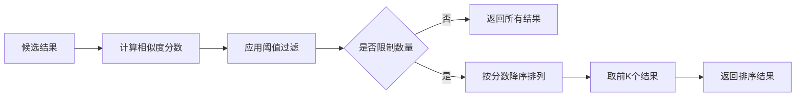
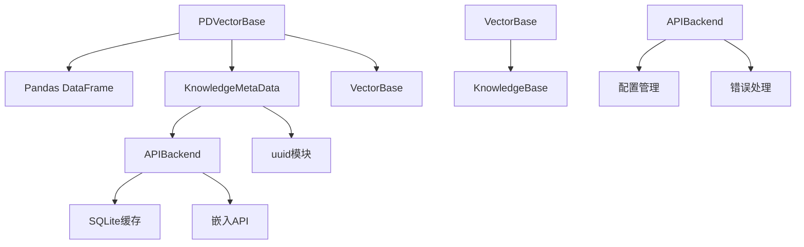
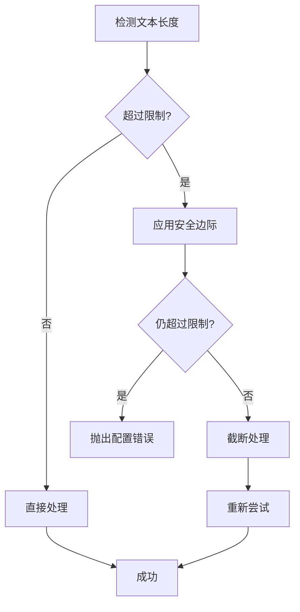

# 向量数据库API文档

<cite>
**本文档中引用的文件**
- [vector_base.py](file://rdagent/components/knowledge_management/vector_base.py)
- [base.py](file://rdagent/oai/backend/base.py)
- [embedding.py](file://rdagent/oai/utils/embedding.py)
- [llm_conf.py](file://rdagent/oai/llm_conf.py)
- [knowledge_base.py](file://rdagent/core/knowledge_base.py)
</cite>

## 目录
1. [简介](#简介)
2. [项目结构](#项目结构)
3. [核心组件](#核心组件)
4. [架构概览](#架构概览)
5. [详细组件分析](#详细组件分析)
6. [依赖关系分析](#依赖关系分析)
7. [性能考虑](#性能考虑)
8. [故障排除指南](#故障排除指南)
9. [结论](#结论)

## 简介

PDVectorBase是一个基于Pandas数据结构的向量数据库实现，专门用于知识管理的语义检索系统。该系统通过向量化技术实现文档的语义相似度匹配，支持文档分块处理、嵌入生成、相似度计算和智能过滤等功能。系统采用余弦距离作为相似度度量标准，提供了完整的知识检索解决方案。

## 项目结构

向量数据库系统的核心文件组织如下：



**图表来源**
- [vector_base.py](file://rdagent/components/knowledge_management/vector_base.py#L1-L209)
- [base.py](file://rdagent/oai/backend/base.py#L1-L711)

**章节来源**
- [vector_base.py](file://rdagent/components/knowledge_management/vector_base.py#L1-L209)
- [knowledge_base.py](file://rdagent/core/knowledge_base.py#L1-L28)

## 核心组件

### KnowledgeMetaData类

KnowledgeMetaData是系统的核心数据结构，负责封装文档的所有相关信息：

- **内容管理**: 存储原始文本内容和分块后的子段
- **标签系统**: 支持文档分类和过滤
- **嵌入向量**: 存储文本的向量化表示
- **唯一标识**: 基于UUID的文档唯一性保证

### PDVectorBase类

PDVectorBase是基于Pandas DataFrame的向量数据库实现：

- **数据存储**: 使用DataFrame存储文档的ID、标签、内容和嵌入向量
- **内存管理**: 提供高效的内存操作接口
- **查询优化**: 支持多种查询条件和过滤机制

**章节来源**
- [vector_base.py](file://rdagent/components/knowledge_management/vector_base.py#L11-L209)

## 架构概览

系统采用分层架构设计，确保了良好的可扩展性和维护性：



**图表来源**
- [vector_base.py](file://rdagent/components/knowledge_management/vector_base.py#L85-L209)
- [base.py](file://rdagent/oai/backend/base.py#L300-L711)

## 详细组件分析

### add()方法实现

add()方法负责将文档添加到向量数据库中，实现了完整的文档处理流程：



**图表来源**
- [vector_base.py](file://rdagent/components/knowledge_management/vector_base.py#L105-L145)

#### 文档分块机制

系统采用滑动窗口方式进行文档分块：

- **分块大小**: 默认1000字符，可根据需要调整
- **重叠处理**: 支持重叠分块以保持上下文连续性
- **批量嵌入**: 使用批量处理提高效率

#### 嵌入生成流程



**图表来源**
- [vector_base.py](file://rdagent/components/knowledge_management/vector_base.py#L39-L47)
- [base.py](file://rdagent/oai/backend/base.py#L654-L684)

**章节来源**
- [vector_base.py](file://rdagent/components/knowledge_management/vector_base.py#L105-L145)

### search()方法实现

search()方法提供了强大的语义检索功能，支持多种过滤和排序机制：



**图表来源**
- [vector_base.py](file://rdagent/components/knowledge_management/vector_base.py#L147-L209)

#### 相似度计算原理

系统使用余弦距离作为相似度度量标准：

- **余弦距离公式**: `1 - cosine_similarity(embedding1, embedding2)`
- **相似度范围**: 0（完全不相似）到1（完全相似）
- **阈值过滤**: 支持设置最小相似度阈值

#### Top-K排序机制



**图表来源**
- [vector_base.py](file://rdagent/components/knowledge_management/vector_base.py#L185-L200)

**章节来源**
- [vector_base.py](file://rdagent/components/knowledge_management/vector_base.py#L147-L209)

### 知识元数据管理

KnowledgeMetaData类提供了完整的文档生命周期管理：

#### 内容处理功能

- **split_into_trunk()**: 将长文档分割为可管理的子段
- **create_embedding()**: 生成文档的向量表示
- **from_dict()**: 从字典加载元数据

#### 批量处理优化

系统针对大量文档处理进行了优化：

- **批量大小**: 默认16个文档/批次
- **并行处理**: 支持多线程嵌入生成
- **内存管理**: 避免内存溢出的策略

**章节来源**
- [vector_base.py](file://rdagent/components/knowledge_management/vector_base.py#L11-L82)

### 配置系统

系统提供了灵活的配置选项：

| 配置项 | 默认值 | 描述 |
|--------|--------|------|
| embedding_model | text-embedding-3-small | 嵌入模型名称 |
| embedding_max_length | 8192 | 最大文本长度 |
| embedding_max_str_num | 50 | 单次最大请求数 |
| use_embedding_cache | False | 是否启用嵌入缓存 |
| max_retry | 10 | 最大重试次数 |

**章节来源**
- [llm_conf.py](file://rdagent/oai/llm_conf.py#L1-L133)

## 依赖关系分析

系统的依赖关系展现了清晰的分层架构：



**图表来源**
- [vector_base.py](file://rdagent/components/knowledge_management/vector_base.py#L1-L10)
- [base.py](file://rdagent/oai/backend/base.py#L1-L20)

**章节来源**
- [vector_base.py](file://rdagent/components/knowledge_management/vector_base.py#L1-L10)
- [knowledge_base.py](file://rdagent/core/knowledge_base.py#L1-L28)

## 性能考虑

### 大规模向量计算优化

系统在处理大规模数据时采用了多种优化策略：

1. **内存管理**: 使用Pandas的高效数据结构
2. **批处理**: 默认16个文档的批量处理
3. **缓存机制**: 嵌入结果缓存减少重复计算
4. **索引优化**: DataFrame的内置索引支持快速查询

### 性能瓶颈分析

主要性能瓶颈及解决方案：

- **嵌入生成延迟**: 通过批量处理和缓存缓解
- **内存占用**: 分块处理避免大文档内存溢出
- **相似度计算**: Pandas向量化操作优化

### 外部向量数据库集成

对于更大规模的应用，可以考虑以下替代方案：

1. **FAISS**: Facebook开发的高性能向量检索库
2. **Milvus**: 云原生向量数据库
3. **Weaviate**: 开源向量搜索引擎

## 故障排除指南

### 常见异常场景

#### 空数据集搜索

当向量数据库为空时，系统会优雅地返回空结果：

```python
# 检查数据集状态
if not self.vector_df.shape[0]:
    return [], []
```

#### 嵌入服务不可用

系统具备完善的错误处理机制：

- **重试机制**: 最多重试10次
- **超时处理**: 连续超时达到限制时抛出异常
- **内容策略**: 自动截断过长文本

#### 文本过长处理



**图表来源**
- [base.py](file://rdagent/oai/backend/base.py#L482-L503)
- [embedding.py](file://rdagent/oai/utils/embedding.py#L60-L134)

**章节来源**
- [vector_base.py](file://rdagent/components/knowledge_management/vector_base.py#L158-L165)
- [base.py](file://rdagent/oai/backend/base.py#L482-L503)

### 配置优化建议

1. **缓存配置**: 对于频繁查询场景，启用嵌入缓存
2. **批处理调优**: 根据硬件资源调整批量大小
3. **模型选择**: 根据精度要求选择合适的嵌入模型

## 结论

PDVectorBase向量数据库系统提供了一个完整、高效的语义检索解决方案。通过基于Pandas的数据结构设计、智能的文档分块处理、灵活的过滤机制和完善的错误处理，系统能够满足各种知识管理场景的需求。

系统的主要优势包括：
- **易用性**: 简洁的API设计和直观的操作方式
- **可扩展性**: 清晰的架构便于功能扩展
- **可靠性**: 完善的错误处理和重试机制
- **性能**: 针对大规模数据的优化设计

对于未来的改进方向，可以考虑集成更专业的向量数据库、实现分布式部署和增强实时更新能力。