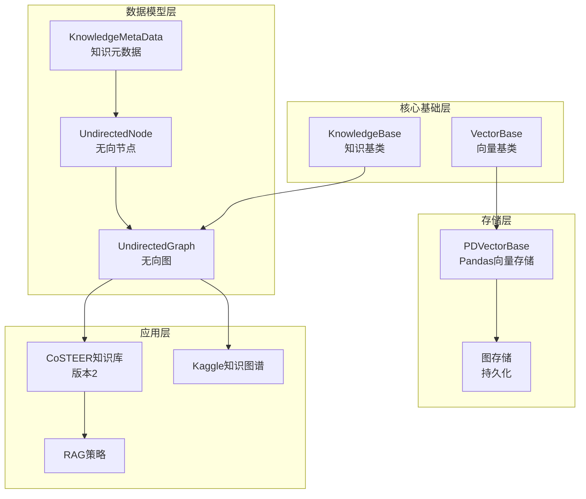
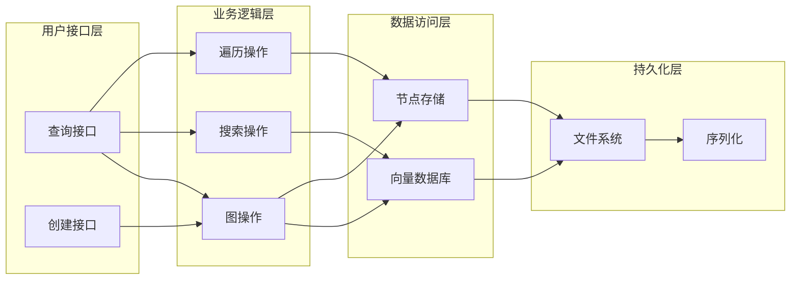
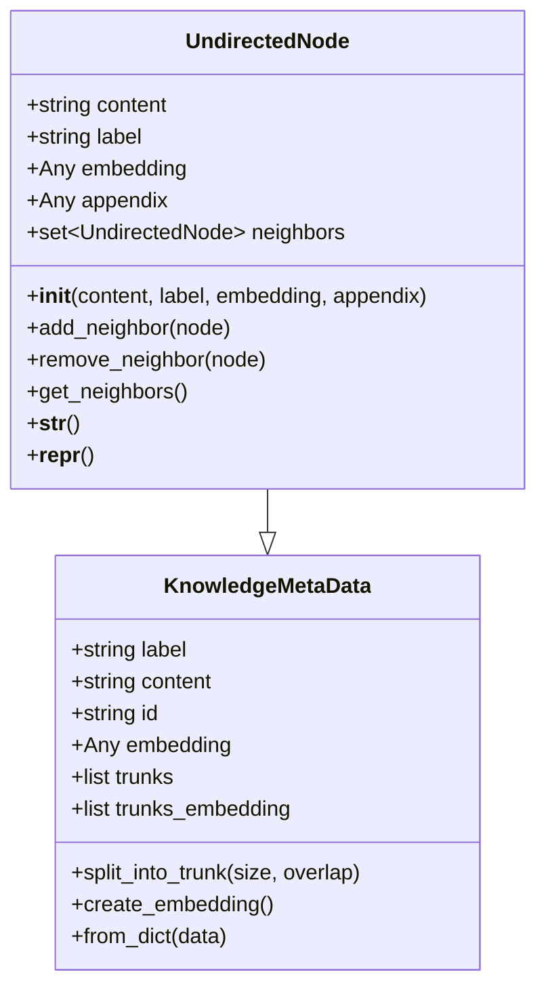
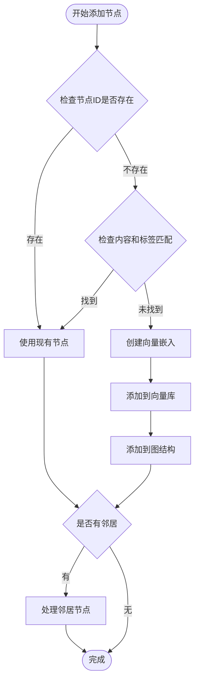
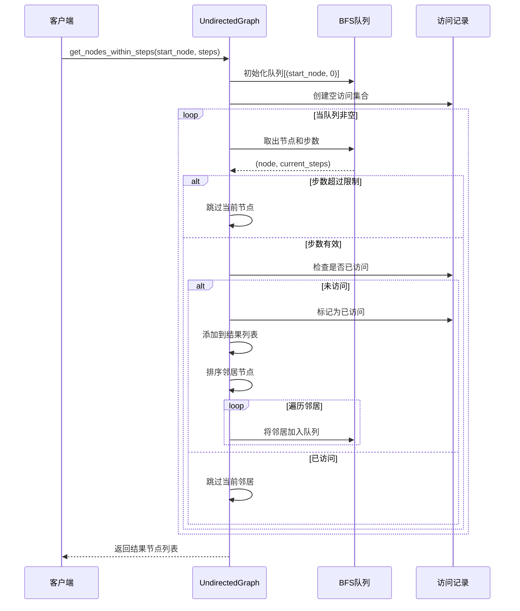
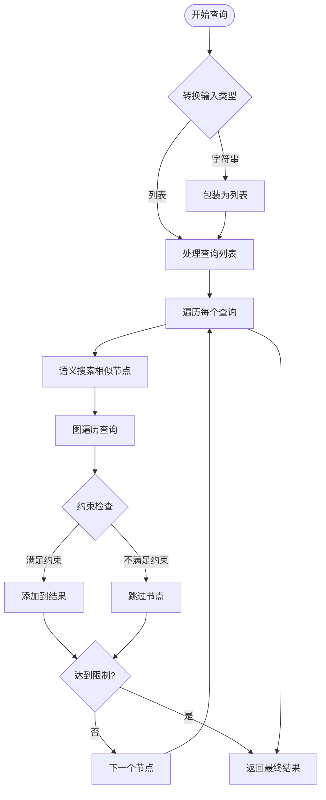
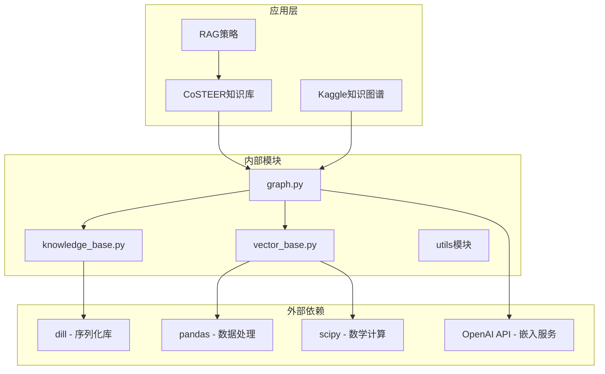

# 图谱存储API详细文档

<cite>
**本文档中引用的文件**
- [graph.py](file://rdagent/components/knowledge_management/graph.py)
- [knowledge_base.py](file://rdagent/core/knowledge_base.py)
- [vector_base.py](file://rdagent/components/knowledge_management/vector_base.py)
- [knowledge_management.py](file://rdagent/components/coder/CoSTEER/knowledge_management.py)
- [extract_knowledge.py](file://rdagent/scenarios/kaggle/knowledge_management/extract_knowledge.py)
- [kaggle_graph.py](file://rdagent/scenarios/kaggle/knowledge_management/graph.py)
</cite>

## 目录
1. [简介](#简介)
2. [项目结构](#项目结构)
3. [核心组件](#核心组件)
4. [架构概览](#架构概览)
5. [详细组件分析](#详细组件分析)
6. [依赖关系分析](#依赖关系分析)
7. [性能考虑](#性能考虑)
8. [故障排除指南](#故障排除指南)
9. [结论](#结论)

## 简介

图谱存储系统是RD-Agent项目中的核心知识管理系统，基于UndirectedGraph类构建了一个强大的知识图谱存储和查询引擎。该系统实现了知识的持久化存储、语义搜索、图遍历等功能，为各种场景下的知识管理和智能决策提供了坚实的基础。

系统的主要特点包括：
- 基于无向图的知识表示和存储
- 向量嵌入驱动的语义搜索
- 深度优先和广度优先的图遍历算法
- 多层次的知识查询和过滤机制
- 完整的持久化和恢复功能

## 项目结构

图谱存储系统采用分层架构设计，主要包含以下模块：

**图表来源**
- [knowledge_base.py](file://rdagent/core/knowledge_base.py#L1-L28)
- [vector_base.py](file://rdagent/components/knowledge_management/vector_base.py#L1-L50)
- [graph.py](file://rdagent/components/knowledge_management/graph.py#L1-L50)

## 核心组件

### KnowledgeBase基类

KnowledgeBase是整个知识管理系统的基础抽象类，提供了持久化存储的核心功能：

- **初始化机制**：支持从指定路径加载已存在的知识库
- **持久化功能**：自动序列化和反序列化知识库状态
- **路径管理**：统一的文件路径处理和目录创建

### UndirectedNode节点类

UndirectedNode是知识图谱中的基本单元，具有以下属性和功能：

- **内容属性**：`content`（字符串内容）、`label`（节点标签）、`embedding`（向量嵌入）
- **邻居关系**：`neighbors`集合维护无向连接关系
- **附加信息**：`appendix`字段存储额外的元数据
- **关系管理**：`add_neighbor()`和`remove_neighbor()`方法管理节点间的连接

### UndirectedGraph图类

UndirectedGraph是知识图谱的核心实现，继承自KnowledgeBase并扩展了图特有的功能：

- **节点管理**：`add_node()`添加节点和邻居关系
- **查询功能**：`semantic_search()`语义搜索和`get_nodes_within_steps()`图遍历
- **向量存储**：集成PDVectorBase进行向量相似度计算
- **约束查询**：支持标签过滤和距离约束的复杂查询

**章节来源**
- [knowledge_base.py](file://rdagent/core/knowledge_base.py#L1-L28)
- [graph.py](file://rdagent/components/knowledge_management/graph.py#L20-L80)

## 架构概览

图谱存储系统采用多层架构，实现了知识的分层管理和高效查询：

**图表来源**
- [graph.py](file://rdagent/components/knowledge_management/graph.py#L80-L150)
- [vector_base.py](file://rdagent/components/knowledge_management/vector_base.py#L80-L150)

## 详细组件分析

### 节点属性结构分析

UndirectedNode的属性设计体现了知识图谱的语义特征：

**图表来源**
- [graph.py](file://rdagent/components/knowledge_management/graph.py#L20-L50)
- [vector_base.py](file://rdagent/components/knowledge_management/vector_base.py#L15-L50)

#### 内容属性（content）
- **类型**：字符串
- **用途**：存储节点的具体内容信息
- **验证**：运行时断言确保类型正确性

#### 标签属性（label）
- **类型**：字符串
- **用途**：对节点进行分类和标记
- **应用场景**：支持按标签过滤和查询

#### 嵌入属性（embedding）
- **类型**：任意可序列化对象
- **用途**：存储向量表示，用于语义相似度计算
- **生成**：通过APIBackend自动创建

#### 附加信息（appendix）
- **类型**：任意对象
- **用途**：存储额外的元数据信息
- **灵活性**：支持各种类型的扩展数据

### 图的增删查改操作

#### 添加节点（add_node）

`add_node()`方法实现了智能的节点添加逻辑：

**图表来源**
- [graph.py](file://rdagent/components/knowledge_management/graph.py#L115-L180)

#### 获取节点（get_node）

支持通过节点ID快速定位节点，时间复杂度O(1)。

#### 图遍历算法

`get_nodes_within_steps()`实现了基于广度优先搜索的图遍历：

**图表来源**
- [graph.py](file://rdagent/components/knowledge_management/graph.py#L196-L230)

### 语义搜索与图查询融合

#### query_by_content方法

`query_by_content()`展示了语义搜索与图遍历的完美结合：

**图表来源**
- [graph.py](file://rdagent/components/knowledge_management/graph.py#L355-L420)

#### 向量相似度计算

系统使用余弦相似度计算节点间的语义相似性：

- **相似度公式**：`similarity = 1 - cosine_distance(embedding1, embedding2)`
- **阈值过滤**：支持设置最小相似度阈值
- **Top-K选择**：可限制返回的最相似节点数量

### 错误处理和边界条件

#### 空图查询处理

当图为空时，系统提供优雅的错误处理：

- **向量搜索**：返回空列表而非抛出异常
- **图遍历**：立即返回空结果集
- **日志记录**：记录警告信息便于调试

#### 高相似度阈值处理

当设置过高相似度阈值时：

- **语义搜索**：返回相似度低于阈值的结果
- **图查询**：根据约束条件过滤结果
- **性能优化**：提前终止搜索过程

**章节来源**
- [graph.py](file://rdagent/components/knowledge_management/graph.py#L115-L498)

## 依赖关系分析

图谱存储系统的依赖关系体现了清晰的分层架构：

**图表来源**
- [graph.py](file://rdagent/components/knowledge_management/graph.py#L1-L20)
- [vector_base.py](file://rdagent/components/knowledge_management/vector_base.py#L1-L20)

### 核心依赖说明

#### 序列化依赖（dill）
- **用途**：替代pickle进行复杂对象的序列化
- **优势**：支持更多Python对象类型
- **安全性**：需要谨慎处理不可信的数据源

#### 数据处理依赖（pandas）
- **用途**：向量数据库的底层存储
- **优势**：高效的内存管理和查询性能
- **扩展性**：支持大规模数据集

#### 数学计算依赖（scipy）
- **用途**：余弦相似度计算
- **优势**：数值稳定性好
- **精度**：浮点运算精度高

#### AI服务依赖（OpenAI API）
- **用途**：文本向量化服务
- **优势**：高质量的预训练模型
- **成本**：按Token计费，需控制调用频率

**章节来源**
- [knowledge_base.py](file://rdagent/core/knowledge_base.py#L1-L28)
- [vector_base.py](file://rdagent/components/knowledge_management/vector_base.py#L1-L50)

## 性能考虑

### 图遍历算法优化

#### BFS队列管理
- **确定性排序**：邻居节点按内容排序确保结果一致性
- **访问去重**：使用集合记录访问过的节点避免重复处理
- **步数限制**：通过步数参数控制搜索深度，防止无限递归

#### 向量搜索优化
- **批量处理**：每次最多处理16个文本的嵌入计算
- **缓存机制**：相同内容的节点共享嵌入向量
- **索引优化**：Pandas DataFrame提供高效的向量查找

### 内存管理策略

#### 节点生命周期管理
- **延迟加载**：仅在需要时创建节点的嵌入向量
- **垃圾回收**：定期清理不再使用的节点引用
- **内存监控**：大型知识图谱的内存使用情况跟踪

#### 向量存储优化
- **稀疏表示**：对于大文本内容使用分块嵌入
- **压缩存储**：向量数据的适当压缩以节省空间
- **增量更新**：支持知识库的增量修改和保存

### 查询性能优化

#### 索引策略
- **标签索引**：按节点标签建立快速查询索引
- **内容索引**：基于向量相似度的内容索引
- **复合索引**：支持多条件组合查询

#### 缓存机制
- **查询缓存**：缓存频繁查询的结果
- **嵌入缓存**：避免重复的向量计算
- **结果缓存**：缓存复杂的图遍历结果

## 故障排除指南

### 常见问题及解决方案

#### 知识库加载失败
**症状**：启动时无法加载已有的知识库文件
**原因**：文件损坏、权限不足、格式不兼容
**解决方案**：
1. 检查文件路径和权限
2. 验证文件格式的完整性
3. 尝试重新初始化知识库

#### 向量计算超时
**症状**：语义搜索响应缓慢或超时
**原因**：网络连接问题、API配额限制、文本过长
**解决方案**：
1. 检查网络连接状态
2. 分割长文本为多个短片段
3. 实现重试机制和超时处理

#### 内存溢出错误
**症状**：处理大型知识图谱时出现内存不足
**原因**：节点过多、向量维度过大、内存泄漏
**解决方案**：
1. 实现分批处理机制
2. 优化节点数据结构
3. 定期清理无用引用

#### 查询结果不准确
**症状**：语义搜索返回的相关性较低
**原因**：嵌入质量差、相似度阈值不当、标签不准确
**解决方案**：
1. 调整相似度阈值参数
2. 改进节点标签的准确性
3. 使用更高质量的嵌入模型

### 调试技巧

#### 日志分析
- **启用详细日志**：设置适当的日志级别
- **跟踪执行流程**：记录关键函数的调用路径
- **监控性能指标**：记录查询时间和内存使用

#### 数据验证
- **节点完整性检查**：验证所有节点的属性完整性
- **图结构验证**：检查节点间的连接关系
- **向量质量评估**：验证嵌入向量的有效性

**章节来源**
- [graph.py](file://rdagent/components/knowledge_management/graph.py#L115-L180)
- [vector_base.py](file://rdagent/components/knowledge_management/vector_base.py#L150-L209)

## 结论

图谱存储系统为RD-Agent项目提供了强大而灵活的知识管理基础设施。通过UndirectedGraph类为核心的知识图谱实现，系统成功地将传统的图数据结构与现代的向量嵌入技术相结合，实现了语义搜索、图遍历、智能查询等多种高级功能。

### 主要优势

1. **架构清晰**：分层设计使得系统易于理解和维护
2. **功能完整**：涵盖了知识存储的各个方面需求
3. **性能优异**：优化的算法和数据结构确保了良好的查询性能
4. **扩展性强**：模块化设计支持功能的灵活扩展

### 应用价值

该系统在多个场景中展现出显著的应用价值：
- **CoSTEER知识库**：支持智能代码生成和错误分析
- **Kaggle知识图谱**：整合竞赛经验形成结构化知识
- **RAG策略**：为检索增强生成提供高质量的知识源

### 发展方向

未来可以考虑的改进方向包括：
- **分布式存储**：支持更大规模的知识图谱
- **实时更新**：支持知识的动态添加和修改
- **多模态支持**：扩展到图像、音频等其他类型的数据
- **推理能力**：集成图神经网络等先进的推理算法

通过持续的优化和扩展，图谱存储系统将继续为RD-Agent项目的智能化发展提供强有力的支持。