# 知识管理组件API

<cite>
**本文档中引用的文件**
- [graph.py](file://rdagent/components/knowledge_management/graph.py)
- [vector_base.py](file://rdagent/components/knowledge_management/vector_base.py)
- [knowledge_base.py](file://rdagent/core/knowledge_base.py)
- [knowledge_management.py](file://rdagent/components/coder/CoSTEER/knowledge_management.py)
- [idea_pool.py](file://rdagent/scenarios/data_science/proposal/exp_gen/idea_pool.py)
- [extract_knowledge.py](file://rdagent/scenarios/data_science/knowledge_management/extract_knowledge.py)
</cite>

## 目录
1. [简介](#简介)
2. [项目结构](#项目结构)
3. [核心组件](#核心组件)
4. [架构概览](#架构概览)
5. [详细组件分析](#详细组件分析)
6. [依赖关系分析](#依赖关系分析)
7. [性能考虑](#性能考虑)
8. [故障排除指南](#故障排除指南)
9. [结论](#结论)

## 简介

知识管理组件是RD-Agent框架中的核心模块，提供了双模存储接口，支持图谱（Graph）和向量数据库（Vector Base）两种存储模式。该组件作为长期记忆系统，为跨实验的知识积累与检索增强生成（RAG）提供基础支撑。

### 主要特性

- **双模存储架构**：同时支持图谱存储和向量数据库存储
- **智能检索机制**：基于语义相似性的混合检索策略
- **灵活的节点类型**：支持多种节点类型（如Experiment、Hypothesis、CodeSnippet）
- **可扩展的架构**：模块化设计，易于扩展和定制
- **高性能优化**：批处理嵌入计算和缓存机制

## 项目结构

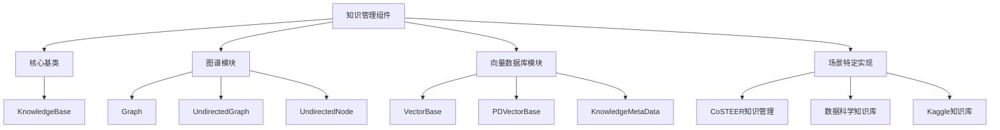

**图表来源**
- [knowledge_base.py](file://rdagent/core/knowledge_base.py#L1-L28)
- [graph.py](file://rdagent/components/knowledge_management/graph.py#L1-L50)
- [vector_base.py](file://rdagent/components/knowledge_management/vector_base.py#L1-L50)

**章节来源**
- [knowledge_base.py](file://rdagent/core/knowledge_base.py#L1-L28)
- [graph.py](file://rdagent/components/knowledge_management/graph.py#L1-L498)
- [vector_base.py](file://rdagent/components/knowledge_management/vector_base.py#L1-L209)

## 核心组件

### KnowledgeBase基类

所有知识管理组件的基础抽象类，提供持久化存储和加载功能。

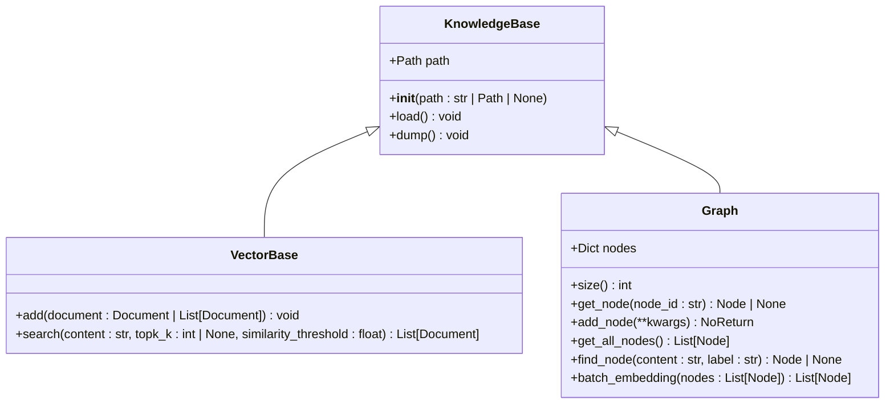

**图表来源**
- [knowledge_base.py](file://rdagent/core/knowledge_base.py#L7-L27)
- [vector_base.py](file://rdagent/components/knowledge_management/vector_base.py#L77-L134)
- [graph.py](file://rdagent/components/knowledge_management/graph.py#L52-L115)

### 图谱结构设计

图谱模块实现了无向图结构，支持复杂的节点关系和查询操作。

#### 节点类型定义

| 节点类型 | 标签 | 描述 | 示例 |
|---------|------|------|------|
| Experiment | "experiment" | 实验节点 | 不同的实验方法和参数组合 |
| Hypothesis | "hypothesis" | 假设节点 | 数据科学假设和理论 |
| CodeSnippet | "code" | 代码片段节点 | 可复用的代码段和模板 |
| TaskDescription | "task_description" | 任务描述节点 | 具体的任务要求和目标 |
| Component | "component" | 组件节点 | 可重用的算法和工具组件 |

#### 关系定义

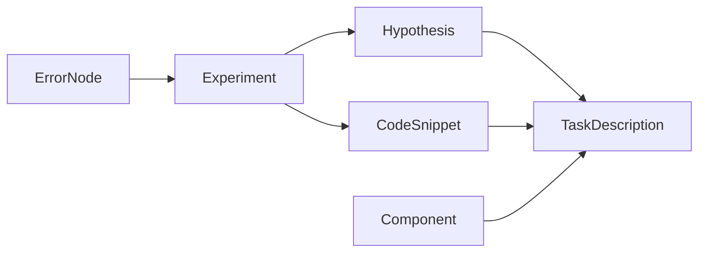

**图表来源**
- [knowledge_management.py](file://rdagent/components/coder/CoSTEER/knowledge_management.py#L762-L790)
- [idea_pool.py](file://rdagent/scenarios/data_science/proposal/exp_gen/idea_pool.py#L54-L86)

**章节来源**
- [graph.py](file://rdagent/components/knowledge_management/graph.py#L15-L115)
- [knowledge_management.py](file://rdagent/components/coder/CoSTEER/knowledge_management.py#L762-L790)

## 架构概览

知识管理组件采用分层架构设计，从底层的数据存储到上层的应用接口，形成了完整的知识管理系统。

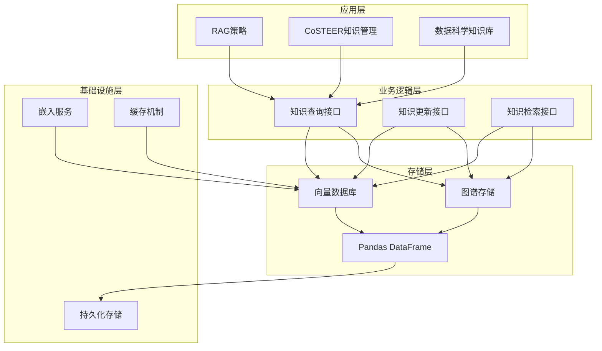

**图表来源**
- [knowledge_management.py](file://rdagent/components/coder/CoSTEER/knowledge_management.py#L1-L50)
- [graph.py](file://rdagent/components/knowledge_management/graph.py#L1-L50)
- [vector_base.py](file://rdagent/components/knowledge_management/vector_base.py#L1-L50)

## 详细组件分析

### 向量数据库模块

向量数据库模块负责处理语义相似性搜索和嵌入计算。

#### KnowledgeMetaData类

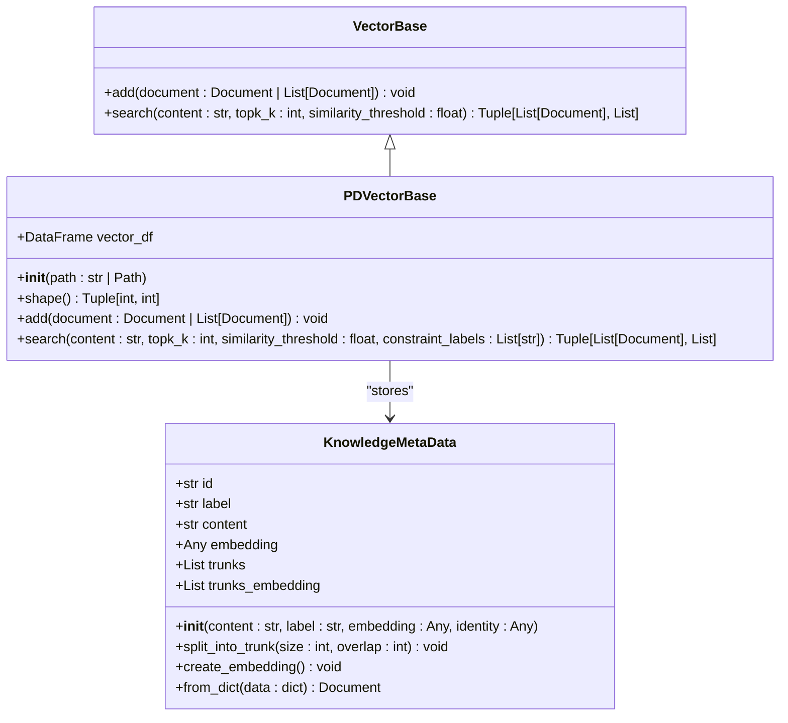

**图表来源**
- [vector_base.py](file://rdagent/components/knowledge_management/vector_base.py#L10-L83)
- [vector_base.py](file://rdagent/components/knowledge_management/vector_base.py#L85-L209)

#### 嵌入机制

向量数据库采用OpenAI API进行嵌入计算，支持批量处理以提高效率：

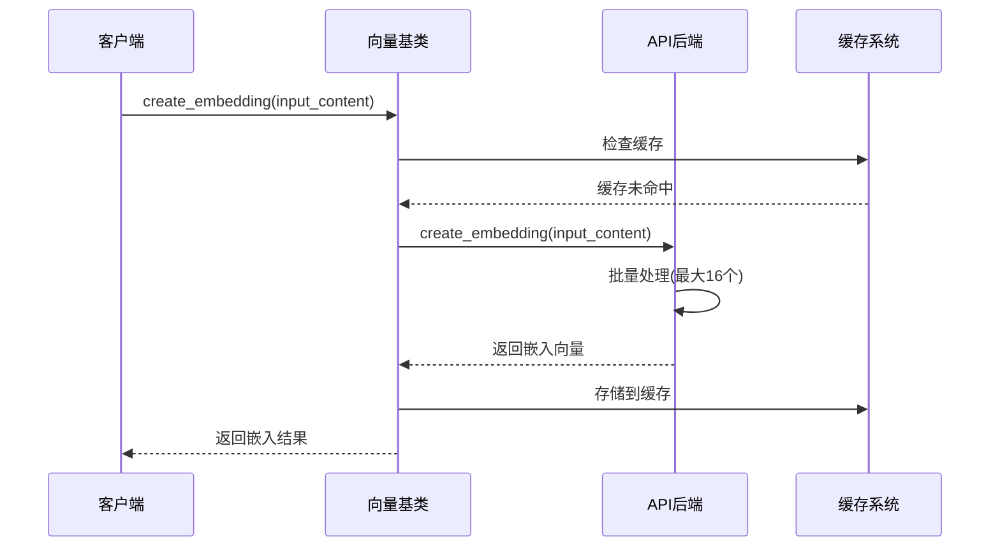

**图表来源**
- [vector_base.py](file://rdagent/components/knowledge_management/vector_base.py#L37-L83)
- [graph.py](file://rdagent/components/knowledge_management/graph.py#L76-L115)

#### 相似性检索API

向量数据库提供灵活的相似性搜索功能：

| 参数 | 类型 | 默认值 | 描述 |
|------|------|--------|------|
| content | str | 必需 | 查询内容 |
| topk_k | int \| None | None | 返回的最相似结果数量 |
| similarity_threshold | float | 0.0 | 最小相似度阈值 |
| constraint_labels | List[str] \| None | None | 标签约束条件 |

**章节来源**
- [vector_base.py](file://rdagent/components/knowledge_management/vector_base.py#L131-L209)

### 图谱模块

图谱模块实现了复杂的节点关系管理和路径查询功能。

#### UndirectedNode类

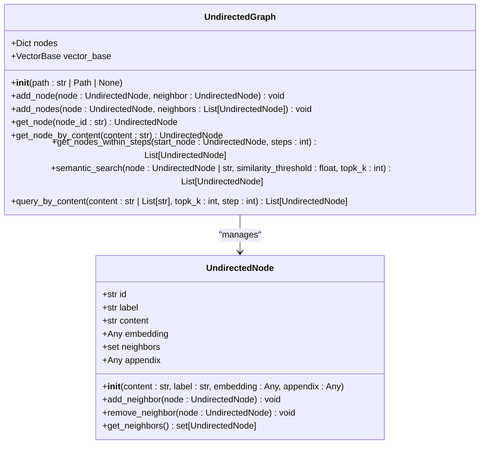

**图表来源**
- [graph.py](file://rdagent/components/knowledge_management/graph.py#L15-L115)
- [graph.py](file://rdagent/components/knowledge_management/graph.py#L117-L498)

#### 图查询接口

图谱模块提供多层次的查询接口：

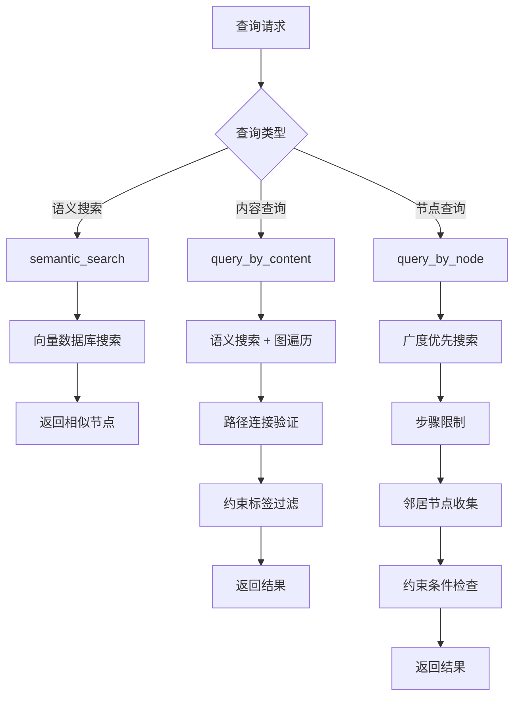

**图表来源**
- [graph.py](file://rdagent/components/knowledge_management/graph.py#L268-L498)

**章节来源**
- [graph.py](file://rdagent/components/knowledge_management/graph.py#L117-L498)

### KnowledgeBase类协调机制

KnowledgeBase类作为协调器，统一管理两种存储模式的接口。

#### 统一接口设计

| 方法 | 功能 | 图谱模式 | 向量数据库模式 |
|------|------|----------|----------------|
| `add()` | 添加知识 | 添加节点和边 | 添加文档记录 |
| `retrieve()` | 检索知识 | 图谱查询 | 向量搜索 |
| `update()` | 更新知识 | 修改节点属性 | 替换文档内容 |

#### 协调流程

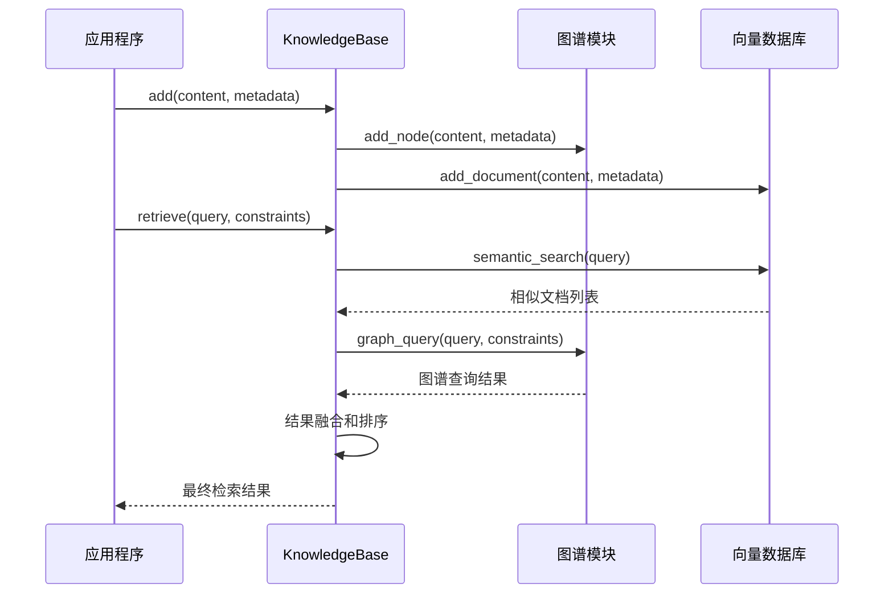

**图表来源**
- [knowledge_base.py](file://rdagent/core/knowledge_base.py#L7-L27)
- [knowledge_management.py](file://rdagent/components/coder/CoSTEER/knowledge_management.py#L762-L790)

**章节来源**
- [knowledge_base.py](file://rdagent/core/knowledge_base.py#L1-L28)
- [knowledge_management.py](file://rdagent/components/coder/CoSTEER/knowledge_management.py#L762-L790)

### 场景特定实现

#### CoSTEER知识管理

CoSTEER（Collaborative Software Testing and Evolutionary Research）项目中的知识管理实现。

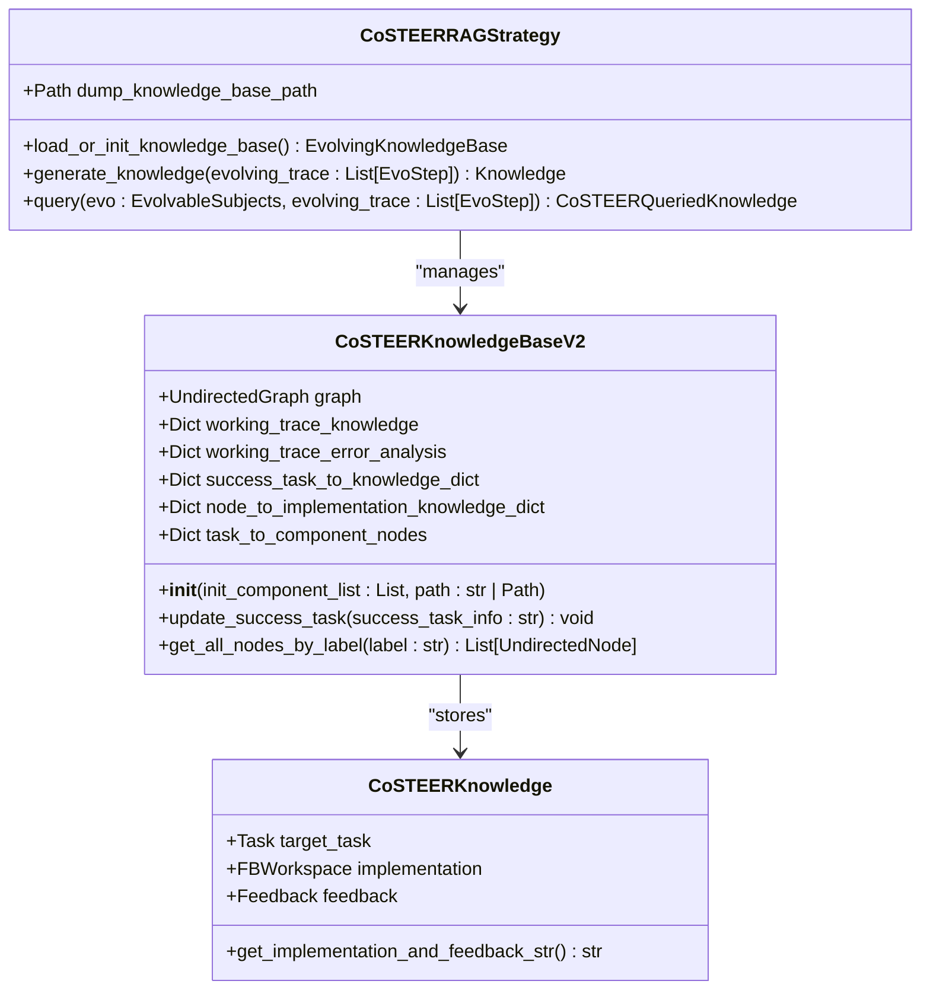

**图表来源**
- [knowledge_management.py](file://rdagent/components/coder/CoSTEER/knowledge_management.py#L33-L47)
- [knowledge_management.py](file://rdagent/components/coder/CoSTEER/knowledge_management.py#L762-L790)
- [knowledge_management.py](file://rdagent/components/coder/CoSTEER/knowledge_management.py#L45-L73)

#### 数据科学知识库

数据科学场景下的专门知识库实现。

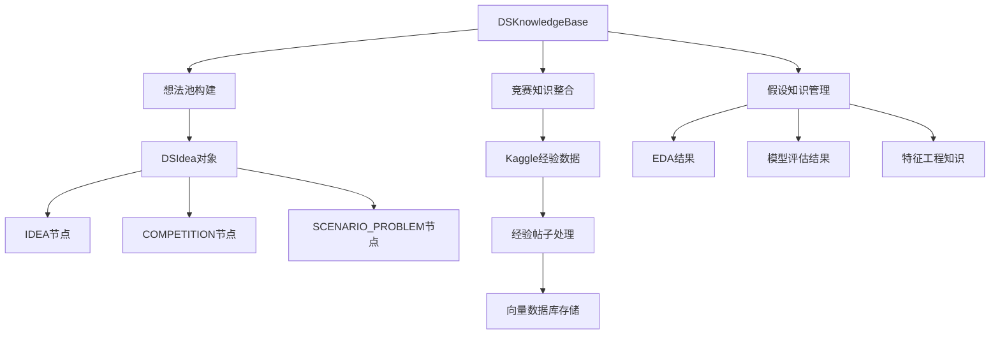

**图表来源**
- [idea_pool.py](file://rdagent/scenarios/data_science/proposal/exp_gen/idea_pool.py#L54-L86)

**章节来源**
- [knowledge_management.py](file://rdagent/components/coder/CoSTEER/knowledge_management.py#L33-L47)
- [idea_pool.py](file://rdagent/scenarios/data_science/proposal/exp_gen/idea_pool.py#L54-L86)

## 依赖关系分析

知识管理组件的依赖关系体现了清晰的分层架构。

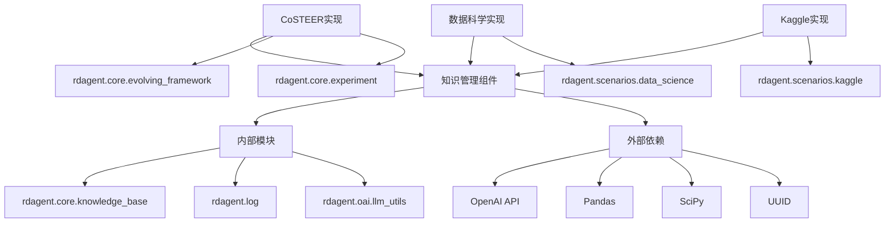

**图表来源**
- [graph.py](file://rdagent/components/knowledge_management/graph.py#L1-L15)
- [vector_base.py](file://rdagent/components/knowledge_management/vector_base.py#L1-L15)
- [knowledge_management.py](file://rdagent/components/coder/CoSTEER/knowledge_management.py#L1-L25)

**章节来源**
- [graph.py](file://rdagent/components/knowledge_management/graph.py#L1-L15)
- [vector_base.py](file://rdagent/components/knowledge_management/vector_base.py#L1-L15)
- [knowledge_management.py](file://rdagent/components/coder/CoSTEER/knowledge_management.py#L1-L25)

## 性能考虑

### 嵌入计算优化

1. **批量处理**：每次最多处理16个文本，平衡API限制和性能
2. **缓存机制**：重复内容使用缓存避免重复计算
3. **异步处理**：支持并发嵌入计算

### 内存管理

1. **分页加载**：大型知识库支持分页加载
2. **惰性求值**：按需加载和计算
3. **垃圾回收**：定期清理无用的临时对象

### 查询优化

1. **索引策略**：基于标签的快速过滤
2. **相似度预计算**：常用查询结果缓存
3. **剪枝算法**：早期终止不满足条件的搜索

## 故障排除指南

### 常见问题及解决方案

#### 嵌入计算失败

**问题**：OpenAI API调用失败或超时
**解决方案**：
- 检查API密钥配置
- 验证网络连接
- 实现重试机制和指数退避

#### 内存不足

**问题**：大规模知识库导致内存溢出
**解决方案**：
- 使用分页加载
- 启用磁盘缓存
- 优化数据结构

#### 查询性能差

**问题**：复杂查询响应时间过长
**解决方案**：
- 添加查询缓存
- 优化索引策略
- 减少不必要的相似度计算

**章节来源**
- [vector_base.py](file://rdagent/components/knowledge_management/vector_base.py#L37-L83)
- [graph.py](file://rdagent/components/knowledge_management/graph.py#L76-L115)

## 结论

RD-Agent的知识管理组件通过双模存储架构，成功地将传统的图谱存储和现代的向量数据库相结合，为复杂的知识管理需求提供了强大的解决方案。

### 主要优势

1. **灵活性**：支持多种节点类型和关系模式
2. **可扩展性**：模块化设计便于功能扩展
3. **性能**：优化的查询算法和缓存机制
4. **可靠性**：完善的错误处理和持久化机制

### 应用前景

该组件不仅适用于当前的CoSTEER和数据科学场景，还可以扩展到其他需要知识管理的领域，如智能问答系统、推荐引擎和自动化决策支持系统。

通过持续的优化和功能增强，知识管理组件将继续为RD-Agent框架提供坚实的知识基础，推动人工智能在科学研究和软件开发领域的应用发展。