# 组件系统API

<cite>
**本文档中引用的文件**
- [CoSTEER/__init__.py](file://rdagent\components\coder\CoSTEER\__init__.py)
- [CoSTEER/config.py](file://rdagent\components\coder\CoSTEER\config.py)
- [CoSTEER/evaluators.py](file://rdagent\components\coder\CoSTEER\evaluators.py)
- [CoSTEER/evolvable_subjects.py](file://rdagent\components\coder\CoSTEER\evolvable_subjects.py)
- [CoSTEER/task.py](file://rdagent\components\coder\CoSTEER\task.py)
- [factor_coder/__init__.py](file://rdagent\components\coder\factor_coder\__init__.py)
- [model_coder/__init__.py](file://rdagent\components\coder\model_coder\__init__.py)
- [runner/__init__.py](file://rdagent\components\runner\__init__.py)
- [proposal/__init__.py](file://rdagent\components\proposal\__init__.py)
- [knowledge_management/vector_base.py](file://rdagent\components\knowledge_management\vector_base.py)
- [knowledge_management/graph.py](file://rdagent\components\knowledge_management\graph.py)
- [data_science/pipeline/__init__.py](file://rdagent\components\coder\data_science\pipeline\__init__.py)
- [data_science/model/__init__.py](file://rdagent\components\coder\data_science\model\__init__.py)
- [data_science/feature/__init__.py](file://rdagent\components\coder\data_science\feature\__init__.py)
- [data_science/ensemble/__init__.py](file://rdagent\components\coder\data_science\ensemble\__init__.py)
</cite>

## 目录
1. [引言](#引言)
2. [Coder组件族](#coder组件族)
3. [Runner组件](#runner组件)
4. [Proposal组件](#proposal组件)
5. [KnowledgeManagement组件](#knowledgemanagement组件)
6. [组件间依赖关系与数据交换](#组件间依赖关系与数据交换)
7. [实际调用示例](#实际调用示例)
8. [结论](#结论)

## 引言
本文档详细说明了RD-Agent系统中components包内所有可复用组件的公共接口。重点介绍基于CoSTEER框架的Coder组件族（包括数据科学Coder、因子Coder、模型Coder）的代码生成流程、配置选项与扩展点；Runner组件的执行环境管理与结果捕获机制；Proposal组件的创意生成策略与多样性控制；以及KnowledgeManagement组件的向量数据库与图谱存储接口。文档为每个组件提供基类定义、抽象方法要求、默认实现和配置参数说明，并包含实际调用示例，展示如何在不同场景下组合使用这些组件。

## Coder组件族

### CoSTEER框架
CoSTEER框架是所有Coder组件的基础，提供了一个基于反馈的迭代式代码生成和演化框架。它继承自`Developer`基类，并实现了`develop`方法来驱动代码的演化过程。

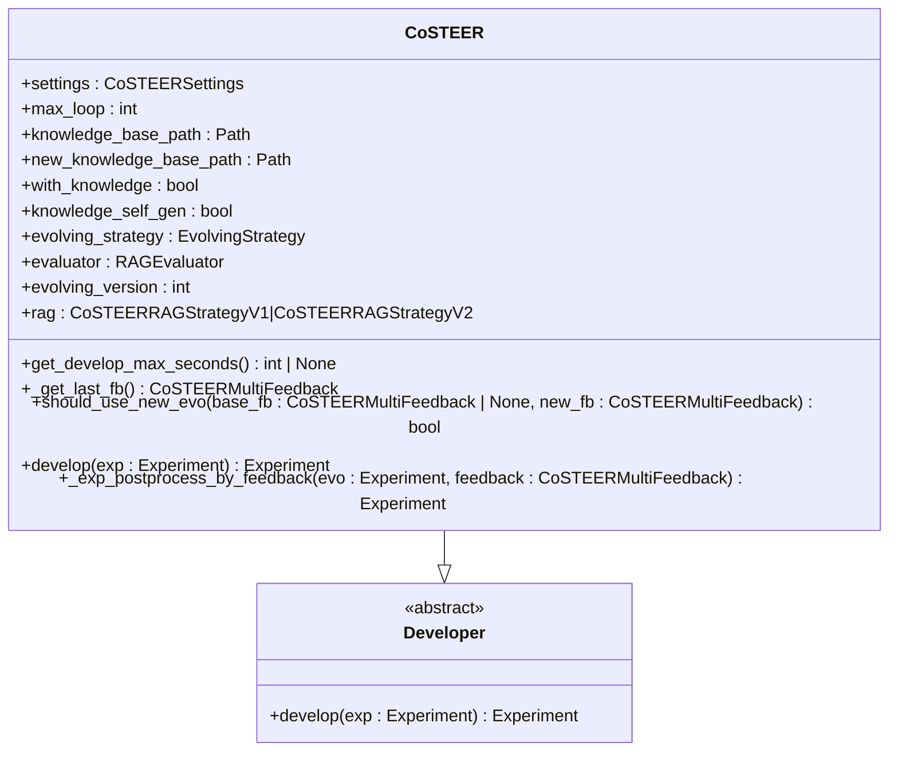

**图源**
- [CoSTEER/__init__.py](file://rdagent\components\coder\CoSTEER\__init__.py#L25-L176)

**节源**
- [CoSTEER/__init__.py](file://rdagent\components\coder\CoSTEER\__init__.py#L25-L176)

### 配置选项
CoSTEER框架的配置通过`CoSTEERSettings`类管理，支持环境变量前缀"CoSTEER_"。主要配置参数包括：

| 配置项 | 类型 | 默认值 | 说明 |
|-------|------|-------|------|
| coder_use_cache | bool | False | 是否使用缓存 |
| max_loop | int | 10 | 任务实现的最大循环次数 |
| fail_task_trial_limit | int | 20 | 失败任务的重试限制 |
| knowledge_base_path | str | None | 知识库路径 |
| new_knowledge_base_path | str | None | 新知识库路径 |
| enable_filelock | bool | False | 是否启用文件锁 |
| filelock_path | str | None | 文件锁路径 |

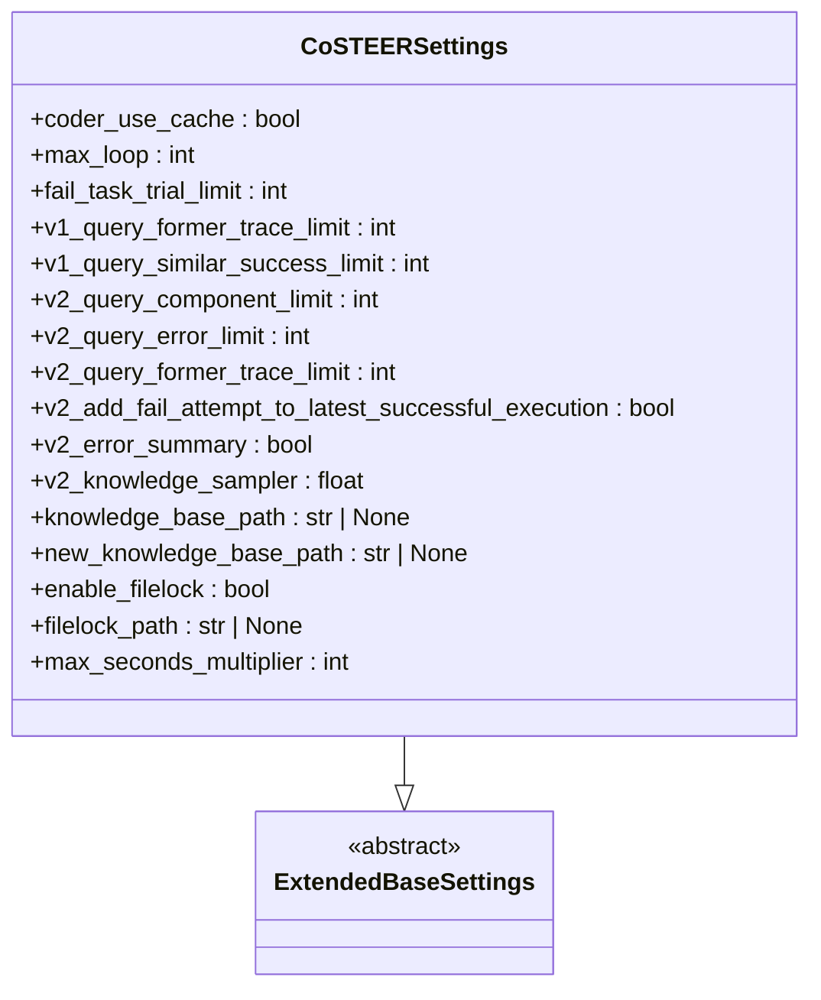

**图源**
- [CoSTEER/config.py](file://rdagent\components\coder\CoSTEER\config.py#L4-L42)

**节源**
- [CoSTEER/config.py](file://rdagent\components\coder\CoSTEER\config.py#L4-L42)

### 代码生成流程
CoSTEER框架的代码生成流程基于反馈驱动的演化策略。`develop`方法是核心入口，它通过`RAGEvoAgent`执行多步演化，每一步都由`evolving_strategy`生成新代码，并由`evaluator`评估结果。

```mermaid
sequenceDiagram
participant Developer as "Developer"
participant CoSTEER as "CoSTEER"
participant EvolveAgent as "RAGEvoAgent"
participant Strategy as "EvolvingStrategy"
participant Evaluator as "RAGEvaluator"
Developer->>CoSTEER : develop(exp)
CoSTEER->>CoSTEER : 初始化中间项
CoSTEER->>EvolveAgent : 创建RAGEvoAgent实例
loop 演化循环
EvolveAgent->>Strategy : implement_one_task()
Strategy-->>EvolveAgent : 返回代码
EvolveAgent->>Evaluator : 评估代码
Evaluator-->>EvolveAgent : 返回反馈
EvolveAgent->>CoSTEER : 更新演化轨迹
alt 达到最大时间限制
CoSTEER->>CoSTEER : 停止演化
break
end
end
CoSTEER->>CoSTEER : 回退到最佳解决方案
CoSTEER->>CoSTEER : 后处理反馈
CoSTEER-->>Developer : 返回演化后的实验
```

**图源**
- [CoSTEER/__init__.py](file://rdagent\components\coder\CoSTEER\__init__.py#L75-L176)

**节源**
- [CoSTEER/__init__.py](file://rdagent\components\coder\CoSTEER\__init__.py#L75-L176)

### 扩展点
CoSTEER框架提供了多个扩展点，允许子类自定义行为：

1. `get_develop_max_seconds()`：获取开发任务的最大秒数
2. `should_use_new_evo()`：决定是否使用新的演化反馈
3. `_exp_postprocess_by_feedback()`：根据反馈对实验进行后处理

### 数据科学Coder
数据科学Coder组件族包括数据加载、特征工程、模型构建和集成学习等子组件，均基于CoSTEER框架实现。

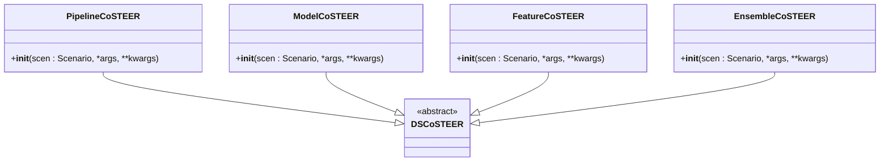

**图源**
- [data_science/pipeline/__init__.py](file://rdagent\components\coder\data_science\pipeline\__init__.py#L100-L165)
- [data_science/model/__init__.py](file://rdagent\components\coder\data_science\model\__init__.py#L150-L173)
- [data_science/feature/__init__.py](file://rdagent\components\coder\data_science\feature\__init__.py#L117-L140)
- [data_science/ensemble/__init__.py](file://rdagent\components\coder\data_science\ensemble\__init__.py#L141-L164)

**节源**
- [data_science/pipeline/__init__.py](file://rdagent\components\coder\data_science\pipeline\__init__.py#L100-L165)
- [data_science/model/__init__.py](file://rdagent\components\coder\data_science\model\__init__.py#L150-L173)
- [data_science/feature/__init__.py](file://rdagent\components\coder\data_science\feature\__init__.py#L117-L140)
- [data_science/ensemble/__init__.py](file://rdagent\components\coder\data_science\ensemble\__init__.py#L141-L164)

### 因子Coder
因子Coder组件`FactorCoSTEER`专门用于因子生成和优化，继承自`CoSTEER`基类。

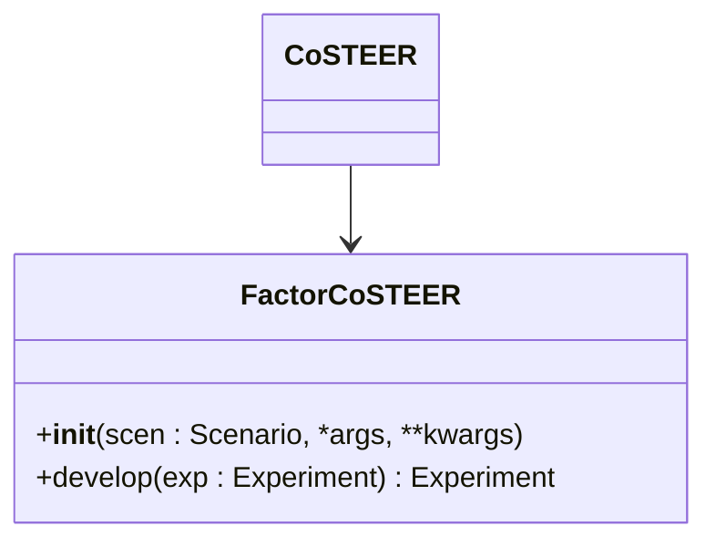

**图源**
- [factor_coder/__init__.py](file://rdagent\components\coder\factor_coder\__init__.py#L10-L32)

**节源**
- [factor_coder/__init__.py](file://rdagent\components\coder\factor_coder\__init__.py#L10-L32)

### 模型Coder
模型Coder组件`ModelCoSTEER`专门用于模型生成和优化，继承自`CoSTEER`基类。

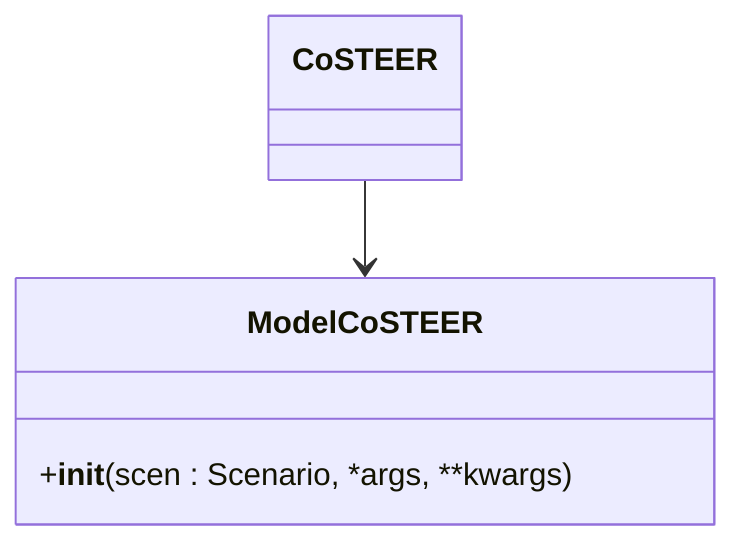

**图源**
- [model_coder/__init__.py](file://rdagent\components\coder\model_coder\__init__.py#L10-L21)

**节源**
- [model_coder/__init__.py](file://rdagent\components\coder\model_coder\__init__.py#L10-L21)

## Runner组件

### 执行环境管理
Runner组件`CachedRunner`负责管理代码执行环境和结果缓存，继承自`Developer`基类。

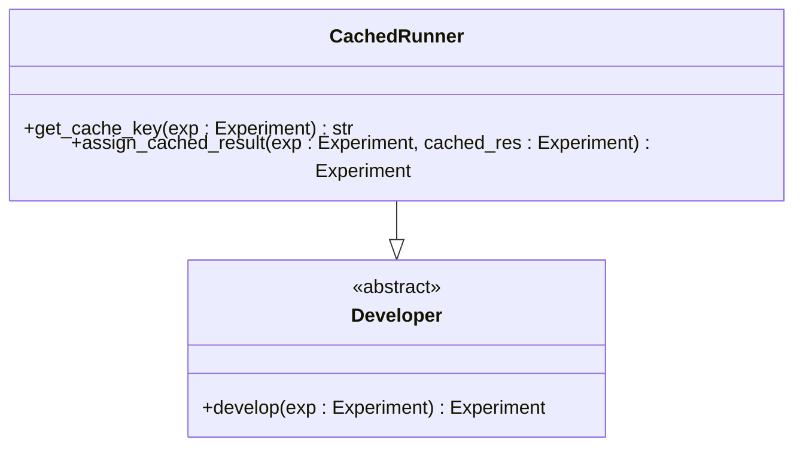

**图源**
- [runner/__init__.py](file://rdagent\components\runner\__init__.py#L4-L20)

**节源**
- [runner/__init__.py](file://rdagent\components\runner\__init__.py#L4-L20)

### 结果捕获机制
`CachedRunner`通过`get_cache_key`方法生成实验的缓存键，该键基于实验任务的信息。`assign_cached_result`方法将缓存结果分配给当前实验。

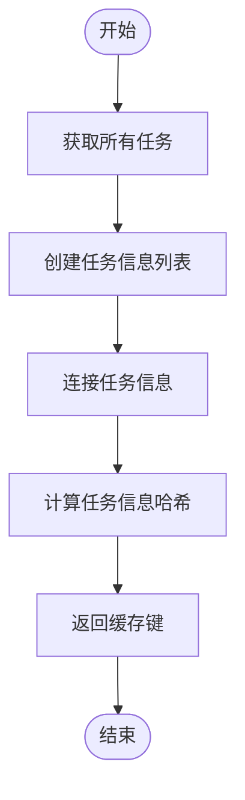

**图源**
- [runner/__init__.py](file://rdagent\components\runner\__init__.py#L6-L12)

**节源**
- [runner/__init__.py](file://rdagent\components\runner\__init__.py#L6-L12)

## Proposal组件

### 创意生成策略
Proposal组件提供基于LLM的假设生成和实验转换功能，支持因子、模型和联合场景。

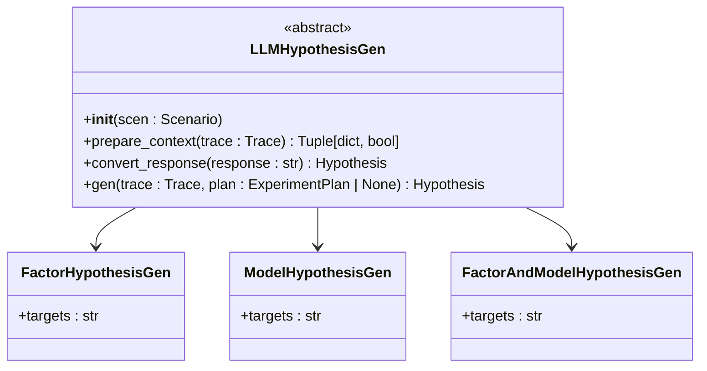

**图源**
- [proposal/__init__.py](file://rdagent\components\proposal\__init__.py#L15-L50)

**节源**
- [proposal/__init__.py](file://rdagent\components\proposal\__init__.py#L15-L50)

### 多样性控制
`LLMHypothesis2Experiment`类负责将假设转换为具体实验，支持重试机制以确保生成质量。

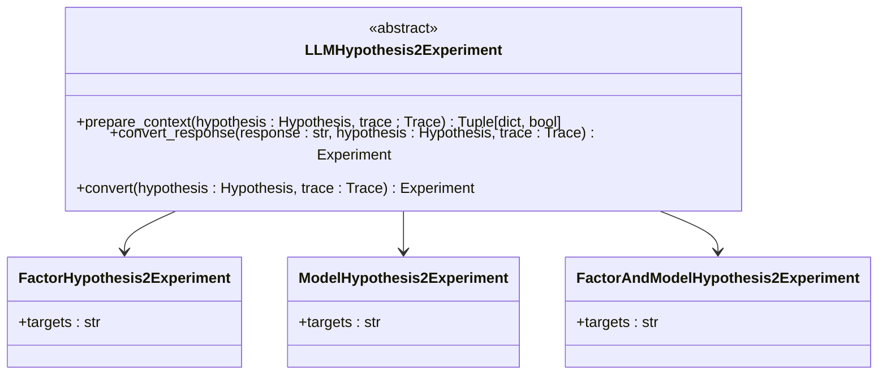

**图源**
- [proposal/__init__.py](file://rdagent\components\proposal\__init__.py#L70-L110)

**节源**
- [proposal/__init__.py](file://rdagent\components\proposal\__init__.py#L70-L110)

## KnowledgeManagement组件

### 向量数据库
`VectorBase`和`PDVectorBase`类提供了向量存储和查询功能，基于Pandas实现。

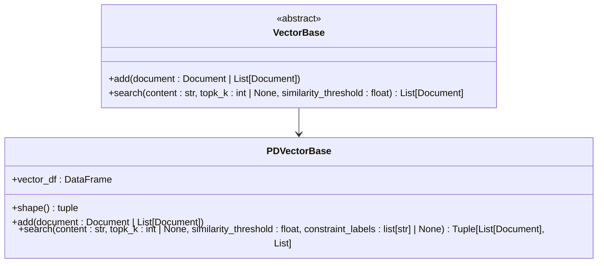

**图源**
- [knowledge_management/vector_base.py](file://rdagent\components\knowledge_management\vector_base.py#L80-L208)

**节源**
- [knowledge_management/vector_base.py](file://rdagent\components\knowledge_management\vector_base.py#L80-L208)

### 图谱存储
`Graph`和`UndirectedGraph`类提供了知识图谱的存储和查询功能，支持语义搜索和图遍历。

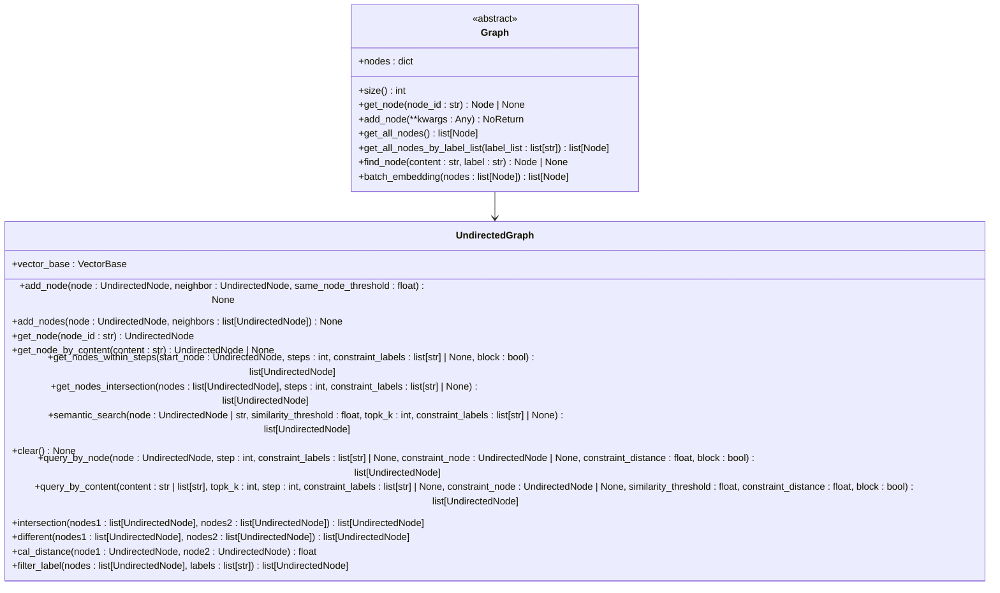

**图源**
- [knowledge_management/graph.py](file://rdagent\components\knowledge_management\graph.py#L100-L497)

**节源**
- [knowledge_management/graph.py](file://rdagent\components\knowledge_management\graph.py#L100-L497)

## 组件间依赖关系与数据交换

### 依赖关系
各组件之间存在明确的依赖关系，形成一个完整的自动化机器学习流水线。

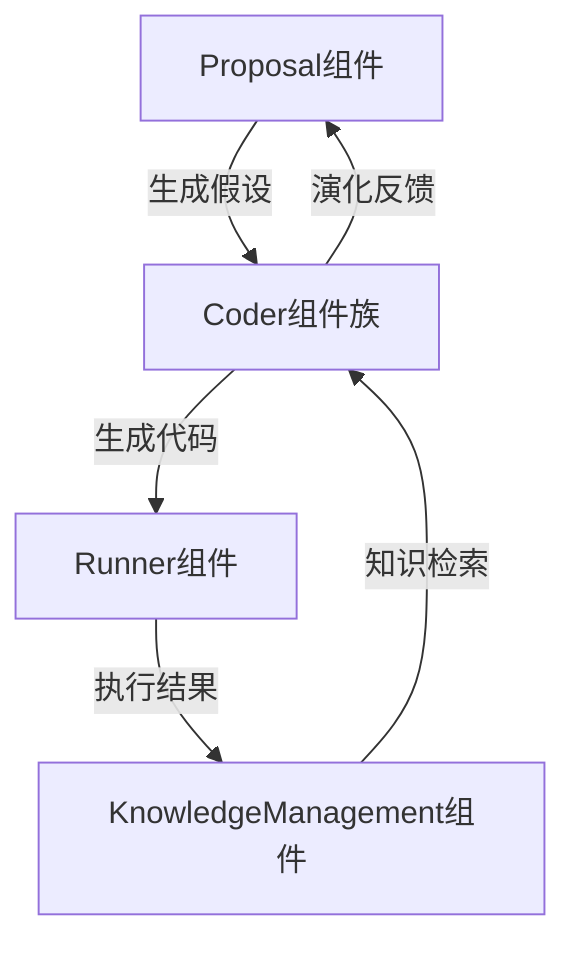

**图源**
- [CoSTEER/__init__.py](file://rdagent\components\coder\CoSTEER\__init__.py)
- [proposal/__init__.py](file://rdagent\components\proposal\__init__.py)
- [runner/__init__.py](file://rdagent\components\runner\__init__.py)
- [knowledge_management/vector_base.py](file://rdagent\components\knowledge_management\vector_base.py)
- [knowledge_management/graph.py](file://rdagent\components\knowledge_management\graph.py)

**节源**
- [CoSTEER/__init__.py](file://rdagent\components\coder\CoSTEER\__init__.py)
- [proposal/__init__.py](file://rdagent\components\proposal\__init__.py)
- [runner/__init__.py](file://rdagent\components\runner\__init__.py)
- [knowledge_management/vector_base.py](file://rdagent\components\knowledge_management\vector_base.py)
- [knowledge_management/graph.py](file://rdagent\components\knowledge_management\graph.py)

### 数据交换格式
组件间通过标准化的数据结构进行信息交换，主要包括：

1. `Experiment`：实验对象，包含任务列表和工作空间
2. `Feedback`：反馈对象，包含执行、返回值和代码反馈
3. `Document`：文档对象，用于知识存储和检索
4. `Node`：图节点对象，用于知识图谱

## 实际调用示例

### 数据科学场景
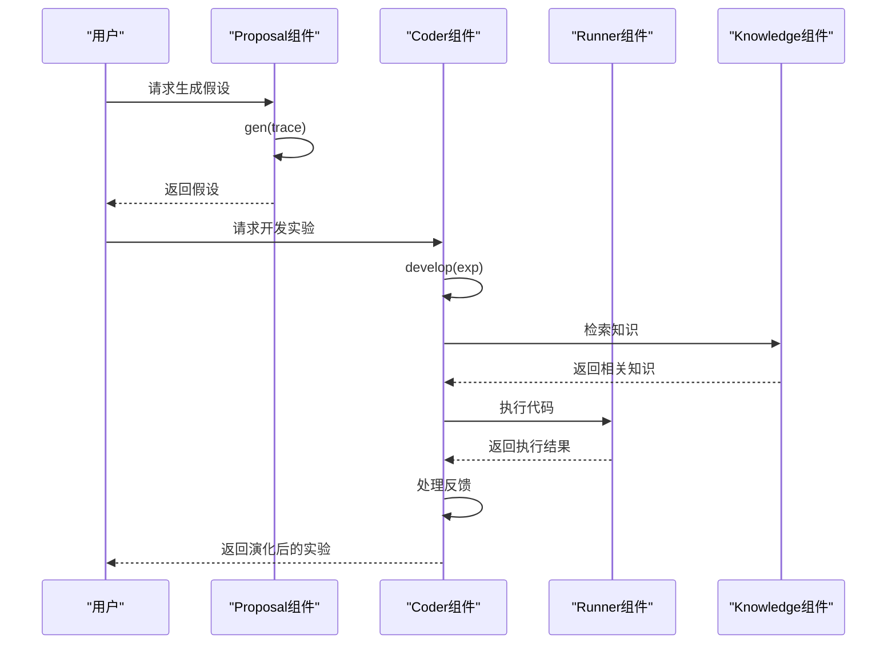

**图源**
- [data_science/pipeline/__init__.py](file://rdagent\components\coder\data_science\pipeline\__init__.py)
- [data_science/model/__init__.py](file://rdagent\components\coder\data_science\model\__init__.py)
- [data_science/feature/__init__.py](file://rdagent\components\coder\data_science\feature\__init__.py)
- [data_science/ensemble/__init__.py](file://rdagent\components\coder\data_science\ensemble\__init__.py)

**节源**
- [data_science/pipeline/__init__.py](file://rdagent\components\coder\data_science\pipeline\__init__.py)
- [data_science/model/__init__.py](file://rdagent\components\coder\data_science\model\__init__.py)
- [data_science/feature/__init__.py](file://rdagent\components\coder\data_science\feature\__init__.py)
- [data_science/ensemble/__init__.py](file://rdagent\components\coder\data_science\ensemble\__init__.py)

### 因子分析场景
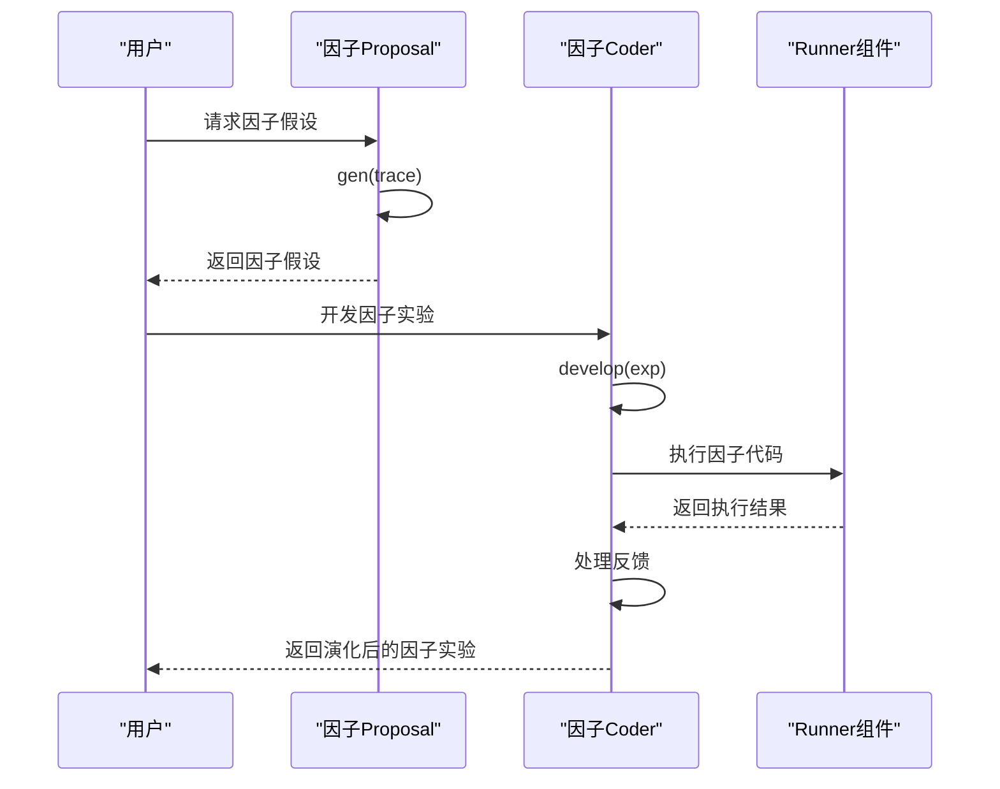

**图源**
- [factor_coder/__init__.py](file://rdagent\components\coder\factor_coder\__init__.py)

**节源**
- [factor_coder/__init__.py](file://rdagent\components\coder\factor_coder\__init__.py)

## 结论
本文档全面介绍了RD-Agent系统中components包的可复用组件API。CoSTEER框架为代码生成提供了强大的迭代演化能力，支持多种数据科学场景的定制化需求。Runner组件确保了执行环境的稳定性和结果的可复现性。Proposal组件通过LLM驱动的假设生成，实现了创意的自动化探索。KnowledgeManagement组件则通过向量数据库和知识图谱，实现了知识的有效存储和智能检索。这些组件协同工作，形成了一个完整的自动化机器学习研发流水线。