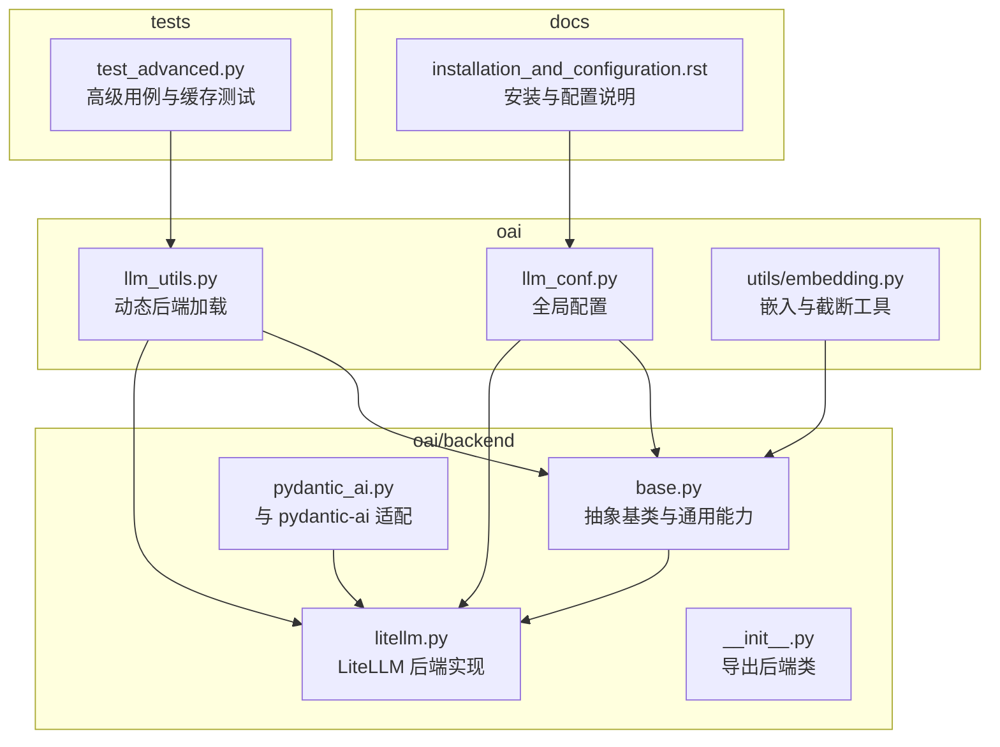
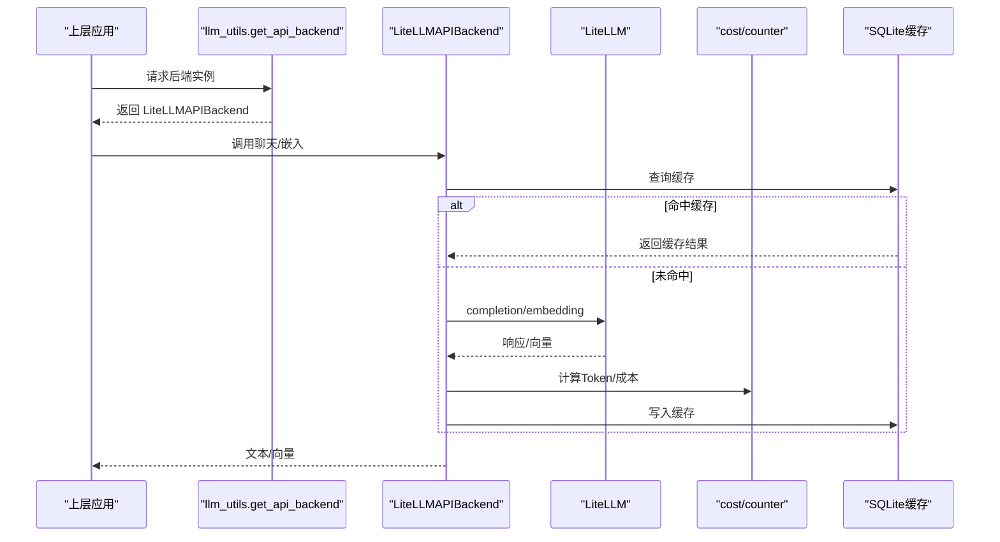
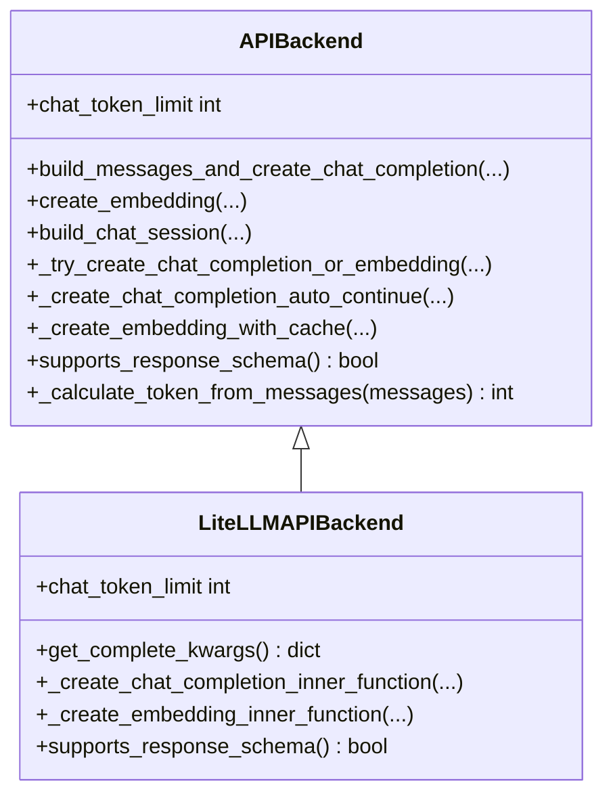
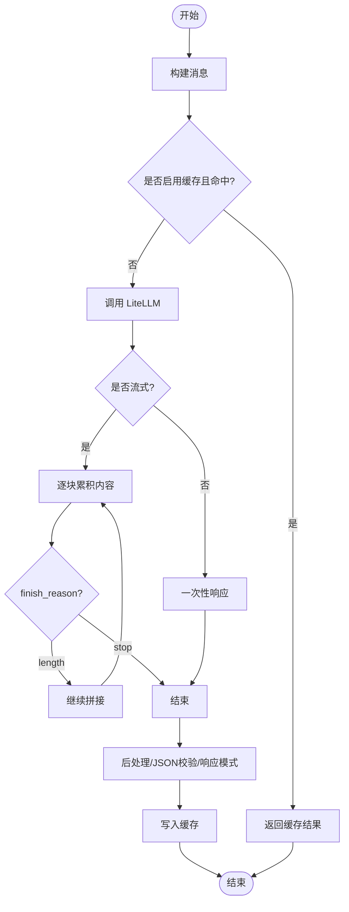
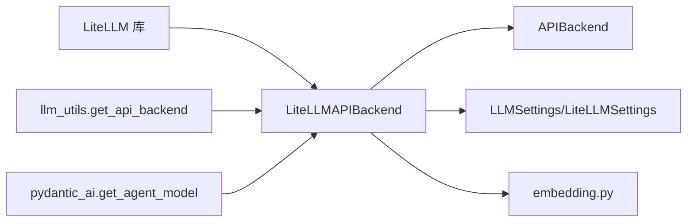

# LiteLLM 后端集成

<cite>
**本文引用的文件**
- [litellm.py](file://rdagent/oai/backend/litellm.py)
- [base.py](file://rdagent/oai/backend/base.py)
- [llm_conf.py](file://rdagent/oai/llm_conf.py)
- [llm_utils.py](file://rdagent/oai/llm_utils.py)
- [__init__.py](file://rdagent/oai/backend/__init__.py)
- [embedding.py](file://rdagent/oai/utils/embedding.py)
- [pydantic_ai.py](file://rdagent/oai/backend/pydantic_ai.py)
- [installation_and_configuration.rst](file://docs/installation_and_configuration.rst)
- [test_advanced.py](file://test/oai/test_advanced.py)
</cite>

## 目录
1. [简介](#简介)
2. [项目结构](#项目结构)
3. [核心组件](#核心组件)
4. [架构总览](#架构总览)
5. [组件详解](#组件详解)
6. [依赖关系分析](#依赖关系分析)
7. [性能与成本特性](#性能与成本特性)
8. [故障排查](#故障排查)
9. [结论](#结论)
10. [附录](#附录)

## 简介
本文件面向 RD-Agent 的 LiteLLM 后端集成，系统性梳理了统一 LLM 后端抽象、LiteLLM 实现、配置体系、缓存与重试、成本与 Token 统计、以及与上层应用的对接方式。目标读者既包括需要快速上手的使用者，也包括希望深入理解实现细节的开发者。

## 项目结构
LiteLLM 后端位于 oai/backend 子模块，配合通用的 API 抽象、配置与工具模块共同构成统一的 LLM 访问层。

图表来源
- [litellm.py](file://rdagent/oai/backend/litellm.py#L1-L120)
- [base.py](file://rdagent/oai/backend/base.py#L290-L711)
- [llm_conf.py](file://rdagent/oai/llm_conf.py#L1-L133)
- [llm_utils.py](file://rdagent/oai/llm_utils.py#L82-L126)
- [__init__.py](file://rdagent/oai/backend/__init__.py#L1-L3)
- [embedding.py](file://rdagent/oai/utils/embedding.py#L1-L135)
- [pydantic_ai.py](file://rdagent/oai/backend/pydantic_ai.py#L1-L63)
- [installation_and_configuration.rst](file://docs/installation_and_configuration.rst#L22-L167)
- [test_advanced.py](file://test/oai/test_advanced.py#L1-L163)

章节来源
- [litellm.py](file://rdagent/oai/backend/litellm.py#L1-L120)
- [base.py](file://rdagent/oai/backend/base.py#L290-L711)
- [llm_conf.py](file://rdagent/oai/llm_conf.py#L1-L133)
- [llm_utils.py](file://rdagent/oai/llm_utils.py#L82-L126)
- [__init__.py](file://rdagent/oai/backend/__init__.py#L1-L3)
- [embedding.py](file://rdagent/oai/utils/embedding.py#L1-L135)
- [pydantic_ai.py](file://rdagent/oai/backend/pydantic_ai.py#L1-L63)
- [installation_and_configuration.rst](file://docs/installation_and_configuration.rst#L22-L167)
- [test_advanced.py](file://test/oai/test_advanced.py#L1-L163)

## 核心组件
- 抽象后端 APIBackend：定义统一的消息构建、缓存、重试、嵌入、聊天完成等接口，并提供会话与缓存能力。
- LiteLLMAPIBackend：基于 LiteLLM 的具体实现，封装 completion/embedding/token_counter/cost 等调用，支持响应模式、流式输出、成本统计与 Token 限额推导。
- 配置系统 LLMSettings/LiteLLMSettings：集中管理模型、温度、最大输出、流式、缓存、重试、成本追踪、响应模式开关、模型映射等。
- 工具链 llm_utils：动态按配置加载后端实例；embedding 相似度计算工具。
- 嵌入截断 embedding.py：根据模型最大 Token 限制进行安全截断，避免超出上下文长度。
- 适配器 pydantic_ai：将 LiteLLM 与 pydantic-ai 模型桥接，按当前模型推导 Provider 环境变量前缀并注入。

章节来源
- [base.py](file://rdagent/oai/backend/base.py#L290-L711)
- [litellm.py](file://rdagent/oai/backend/litellm.py#L72-L300)
- [llm_conf.py](file://rdagent/oai/llm_conf.py#L1-L133)
- [llm_utils.py](file://rdagent/oai/llm_utils.py#L82-L126)
- [embedding.py](file://rdagent/oai/utils/embedding.py#L1-L135)
- [pydantic_ai.py](file://rdagent/oai/backend/pydantic_ai.py#L1-L63)

## 架构总览
LiteLLM 后端在 RD-Agent 中承担“统一 LLM 接口”的角色，向上提供一致的聊天与嵌入调用，向下通过 LiteLLM 统一不同 Provider 的 API，同时内置缓存、重试、成本与 Token 统计、响应模式支持等能力。

图表来源
- [llm_utils.py](file://rdagent/oai/llm_utils.py#L82-L126)
- [base.py](file://rdagent/oai/backend/base.py#L457-L711)
- [litellm.py](file://rdagent/oai/backend/litellm.py#L181-L275)
- [embedding.py](file://rdagent/oai/utils/embedding.py#L1-L135)

## 组件详解

### LiteLLMAPIBackend 类
- 继承自 APIBackend，实现 LiteLLM 的具体调用流程。
- 关键职责
  - 统一聊天完成调用：支持流式与非流式，记录日志，解析 finish_reason，支持响应模式。
  - 统一嵌入调用：批量获取向量，支持缓存与日志。
  - Token 计数与成本统计：使用 LiteLLM 的 token_counter/completion_cost，记录 prompt/completion/cost/累计成本。
  - 模型能力检测：supports_response_schema 与 get_model_info 推导上下文限额。
  - 配置读取：从 LLMSettings/LiteLLMSettings 读取模型、温度、最大输出、流式、响应模式开关、模型映射等。
- 异常与重试
  - 通过 APIBackend 的重试循环处理超时、限流、内容策略违规等，必要时自动截断嵌入文本。
- 日志与可观测性
  - 丰富的日志标签与对象日志，便于调试与审计。

图表来源
- [base.py](file://rdagent/oai/backend/base.py#L290-L711)
- [litellm.py](file://rdagent/oai/backend/litellm.py#L143-L300)

章节来源
- [litellm.py](file://rdagent/oai/backend/litellm.py#L72-L300)
- [base.py](file://rdagent/oai/backend/base.py#L457-L711)

### APIBackend 抽象与通用能力
- 会话 ChatSession：维护对话历史，构建消息，记录到 SQLite 缓存。
- 缓存与重试：支持聊天与嵌入缓存，统一异常捕获与重试等待，速率限制与超时处理，内容策略违规检测。
- JSON 解析与格式校验：支持多种 JSON 提取策略，必要时自动追加提示词。
- Token 估算：提供消息 Token 计数入口，供上层做上下文窗口规划。

图表来源
- [base.py](file://rdagent/oai/backend/base.py#L457-L711)

章节来源
- [base.py](file://rdagent/oai/backend/base.py#L290-L711)

### 配置系统 LLMSettings 与 LiteLLMSettings
- 默认后端指向 LiteLLMAPIBackend，便于开箱即用。
- 关键配置项
  - 模型与推理参数：chat_model、embedding_model、chat_temperature、chat_max_tokens、reasoning_effort、enable_response_schema、chat_stream。
  - 缓存与重试：use_chat_cache/dump_chat_cache/use_embedding_cache/dump_embedding_cache、max_retry、retry_wait_seconds、prompt_cache_path。
  - 系统提示与角色：default_system_prompt、system_prompt_role。
  - 超时与违规阈值：timeout_fail_limit、violation_fail_limit。
  - 模型映射：chat_model_map，按日志标签切换不同模型/温度/最大输出/推理努力。
  - LiteLLMSettings：继承 LLMSettings，环境变量前缀为 LITELLM_，便于通过环境变量覆盖。
- 配置来源
  - 优先级：显式传参 > LLMSettings > 环境变量（含 LITELLM_ 前缀）。

章节来源
- [llm_conf.py](file://rdagent/oai/llm_conf.py#L1-L133)
- [litellm.py](file://rdagent/oai/backend/litellm.py#L59-L70)

### 动态后端加载与工具
- llm_utils.get_api_backend：根据 LLM_SETTINGS.backend 动态导入并实例化后端类，支持别名 APIBackend。
- calculate_embedding_distance_between_str_list：批量获取向量并计算余弦相似度矩阵，用于 RAG/检索等场景。

章节来源
- [llm_utils.py](file://rdagent/oai/llm_utils.py#L82-L126)

### 嵌入截断与 Token 限制
- get_embedding_max_tokens：三段回退策略获取模型最大 Token 限制。
- trim_text_for_embedding：基于 encode/decode 的精确截断，保留安全余量。
- truncate_content_list：对内容列表进行批量截断。

章节来源
- [embedding.py](file://rdagent/oai/utils/embedding.py#L1-L135)

### 与 pydantic-ai 适配
- pydantic_ai.get_agent_model：从当前 LiteLLM 后端推导 Provider 环境变量前缀，组装 OpenAIChatModel，便于在 pydantic-ai 场景中复用同一套模型配置。

章节来源
- [pydantic_ai.py](file://rdagent/oai/backend/pydantic_ai.py#L1-L63)

## 依赖关系分析
- LiteLLMAPIBackend 依赖 LiteLLM 的 completion/embedding/token_counter/completion_cost/supports_response_schema/get_model_info。
- 与 APIBackend 的组合关系：LiteLLMAPIBackend 复用 APIBackend 的缓存、重试、消息构建、会话管理等通用能力。
- 与配置系统的耦合：通过 LLMSettings/LiteLLMSettings 读取模型、温度、最大输出、响应模式、流式、缓存、重试等参数。
- 与工具模块的协作：llm_utils 动态加载后端；embedding.py 提供嵌入截断；pydantic_ai 提供外部框架适配。

图表来源
- [litellm.py](file://rdagent/oai/backend/litellm.py#L29-L40)
- [base.py](file://rdagent/oai/backend/base.py#L290-L711)
- [llm_conf.py](file://rdagent/oai/llm_conf.py#L1-L133)
- [llm_utils.py](file://rdagent/oai/llm_utils.py#L82-L126)
- [embedding.py](file://rdagent/oai/utils/embedding.py#L1-L135)
- [pydantic_ai.py](file://rdagent/oai/backend/pydantic_ai.py#L1-L63)

章节来源
- [litellm.py](file://rdagent/oai/backend/litellm.py#L29-L40)
- [base.py](file://rdagent/oai/backend/base.py#L290-L711)
- [llm_utils.py](file://rdagent/oai/llm_utils.py#L82-L126)
- [embedding.py](file://rdagent/oai/utils/embedding.py#L1-L135)
- [pydantic_ai.py](file://rdagent/oai/backend/pydantic_ai.py#L1-L63)

## 性能与成本特性
- Token 与成本统计
  - LiteLLMAPIBackend 在每次聊天完成后调用 token_counter 计算 prompt/completion Token 数，并使用 completion_cost 计算单次成本与累计成本，同时记录到日志对象，便于审计与预算控制。
- 上下文窗口估算
  - 通过 get_model_info 获取模型最大输入/输出 Token，推导可用输入 Token 限额，辅助上层做上下文规划。
- 嵌入截断与批量处理
  - 对过长文本进行安全截断，避免超出模型上下文；嵌入调用支持分批与缓存，减少重复请求。
- 缓存与重试
  - 聊天与嵌入缓存可显著降低重复请求；统一重试逻辑应对网络波动、限流与超时；内容策略违规与超时次数阈值保护系统稳定性。
- 流式输出
  - 支持流式聊天，逐块累积内容并记录日志，适合长输出与实时反馈场景。

章节来源
- [litellm.py](file://rdagent/oai/backend/litellm.py#L114-L179)
- [litellm.py](file://rdagent/oai/backend/litellm.py#L249-L275)
- [base.py](file://rdagent/oai/backend/base.py#L457-L711)
- [embedding.py](file://rdagent/oai/utils/embedding.py#L63-L135)

## 故障排查
- 常见问题定位
  - 响应模式不生效：检查 enable_response_schema 与模型是否支持 response_schema。
  - 嵌入超长报错：确认模型最大 Token 限制，使用 truncate_content_list 或调整 LLM_SETTINGS.embedding_max_length。
  - 速率限制/超时：查看 retry_wait_seconds、max_retry、timeout_fail_limit；必要时降低并发或提高等待时间。
  - 内容策略违规：当出现策略违规错误时，超过 violation_fail_limit 将抛出 PolicyError，需调整提示词或策略。
- 调试建议
  - 开启日志标签 llm_messages/token_cost/debug_llm/debug_litellm_token，结合对象日志定位问题。
  - 使用会话 ChatSession 与 SQLite 历史缓存，复现多轮对话问题。
- 单元测试参考
  - test_advanced.py 展示了缓存、多进程一致性、多轮对话等高级行为，可作为集成测试的参考。

章节来源
- [base.py](file://rdagent/oai/backend/base.py#L457-L711)
- [test_advanced.py](file://test/oai/test_advanced.py#L1-L163)

## 结论
LiteLLM 后端在 RD-Agent 中提供了统一、可扩展、可观测的 LLM 访问层。通过抽象基类与具体实现分离、完善的配置与工具链、以及内置的缓存、重试、成本与 Token 统计，开发者可以以最小成本接入多种 Provider，并在复杂场景中保持稳定与高效。

## 附录

### 安装与配置要点
- 选择后端：默认后端为 LiteLLMAPIBackend，可通过 LLM_SETTINGS.backend 或环境变量切换。
- 模型与 API 基座：支持统一或分离的 Chat/Embedding 基座，遵循 LiteLLM 的命名约定（如 azure/<deployment>）。
- 环境变量：使用 LITELLM_ 前缀的 LiteLLMSettings 可通过环境变量覆盖；常见示例包括 OPENAI/AZURE/LITELLM_PROXY 等 Provider 的 API Key 与 Base URL。
- Azure OpenAI 示例：按照官方 LiteLLM 文档配置 AZURE_API_KEY、AZURE_API_BASE、AZURE_API_VERSION，并将 CHAT_MODEL 设为 azure/<deployment>。
- 嵌入模型示例：部分 Provider 需要使用 litellm_proxy 前缀，示例见文档。

章节来源
- [installation_and_configuration.rst](file://docs/installation_and_configuration.rst#L22-L167)
- [llm_conf.py](file://rdagent/oai/llm_conf.py#L1-L133)