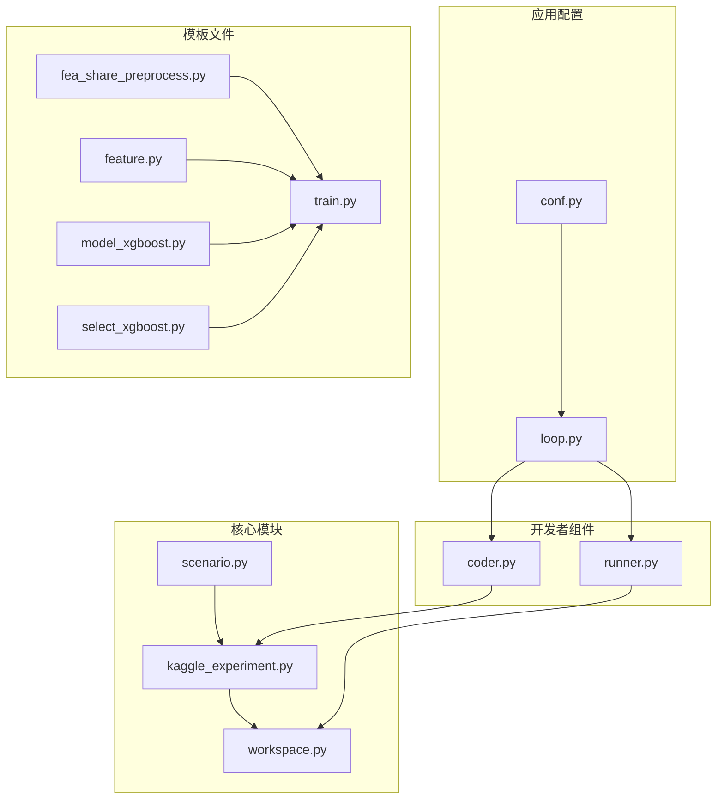
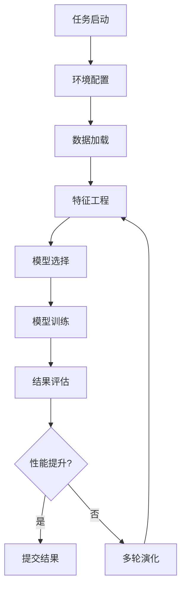
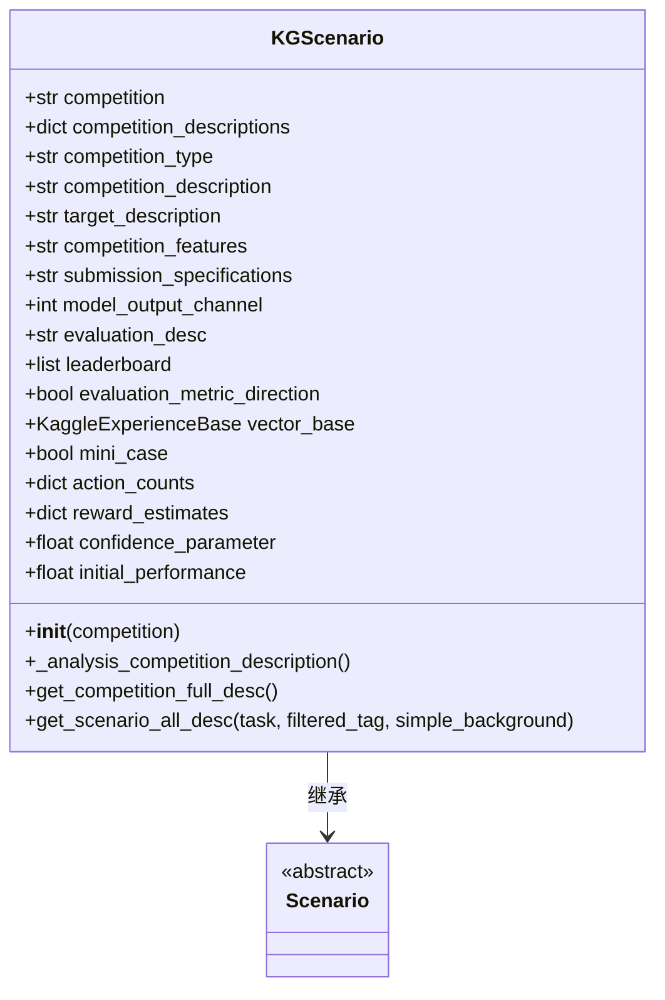
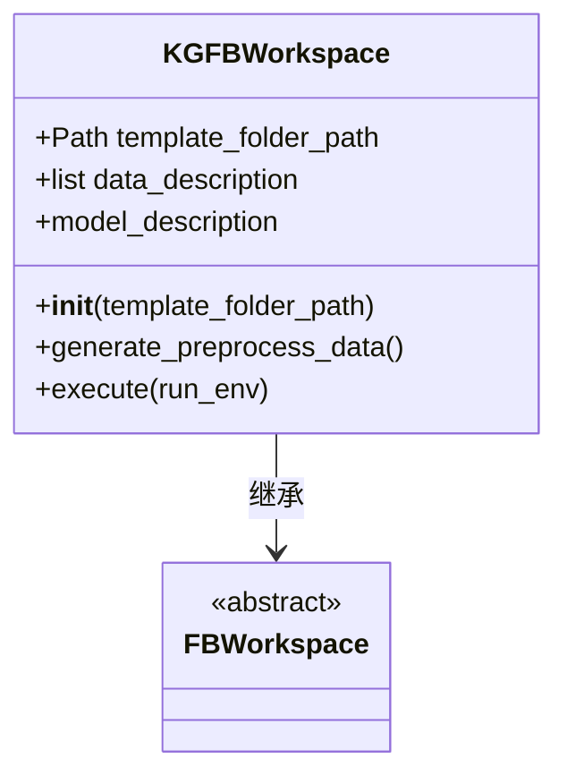
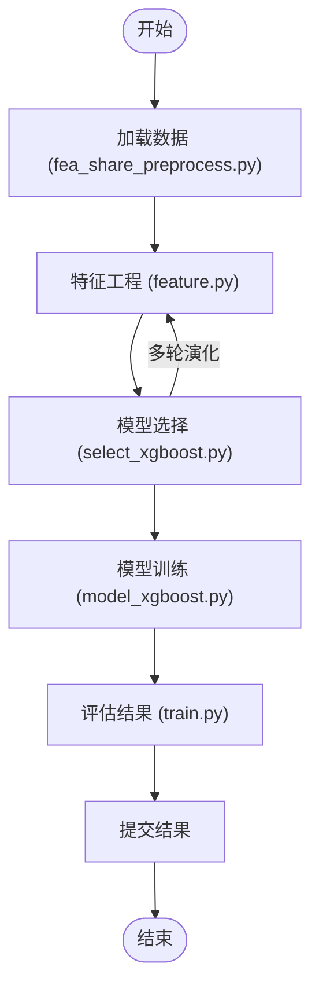
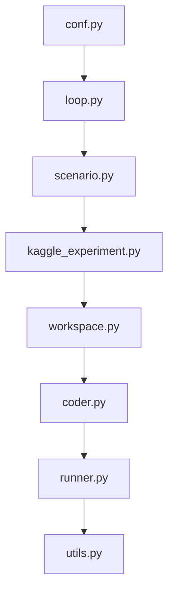

# Kaggle竞赛

<cite>
**本文档中引用的文件**   
- [kaggle_experiment.py](file://rdagent/scenarios/kaggle/experiment/kaggle_experiment.py)
- [scenario.py](file://rdagent/scenarios/kaggle/experiment/scenario.py)
- [workspace.py](file://rdagent/scenarios/kaggle/experiment/workspace.py)
- [conf.py](file://rdagent/app/kaggle/conf.py)
- [loop.py](file://rdagent/app/kaggle/loop.py)
- [coder.py](file://rdagent/scenarios/kaggle/developer/coder.py)
- [runner.py](file://rdagent/scenarios/kaggle/developer/runner.py)
- [fea_share_preprocess.py](file://rdagent/scenarios/kaggle/experiment/templates/playground-series-s4e9/fea_share_preprocess.py)
- [train.py](file://rdagent/scenarios/kaggle/experiment/templates/playground-series-s4e9/train.py)
- [feature.py](file://rdagent/scenarios/kaggle/experiment/templates/playground-series-s4e9/feature/feature.py)
- [model_xgboost.py](file://rdagent/scenarios/kaggle/experiment/templates/playground-series-s4e9/model/model_xgboost.py)
- [select_xgboost.py](file://rdagent/scenarios/kaggle/experiment/templates/playground-series-s4e9/model/select_xgboost.py)
- [utils.py](file://rdagent/scenarios/kaggle/experiment/utils.py)
</cite>

## 目录
1. [简介](#简介)
2. [项目结构](#项目结构)
3. [核心组件](#核心组件)
4. [架构概述](#架构概述)
5. [详细组件分析](#详细组件分析)
6. [依赖分析](#依赖分析)
7. [性能考虑](#性能考虑)
8. [故障排除指南](#故障排除指南)
9. [结论](#结论)

## 简介
RD-Agent是一个自动化参与Kaggle数据科学竞赛的系统，通过继承`Scenario`基类实现Kaggle特有的工作流。系统利用`kaggle_experiment.py`中的`KaggleExperiment`类管理竞赛任务，并通过`workspace.py`构建和维护执行环境。自动化流程从数据加载（`fea_share_preprocess.py`）开始，经过特征工程（`feature.py`），到模型选择与训练（`select_xgboost.py`等模板）。系统利用预定义的模型模板（如XGBoost、LightGBM、RandomForest）进行快速实验迭代。本文档以`playground-series-s4e9`为例，详细说明完整工作流，涵盖环境配置、任务启动、多轮演化和结果提交。

## 项目结构



**图源**
- [kaggle_experiment.py](file://rdagent/scenarios/kaggle/experiment/kaggle_experiment.py)
- [workspace.py](file://rdagent/scenarios/kaggle/experiment/workspace.py)
- [conf.py](file://rdagent/app/kaggle/conf.py)

**节源**
- [kaggle_experiment.py](file://rdagent/scenarios/kaggle/experiment/kaggle_experiment.py)
- [workspace.py](file://rdagent/scenarios/kaggle/experiment/workspace.py)
- [conf.py](file://rdagent/app/kaggle/conf.py)

## 核心组件

系统的核心组件包括`KGScenario`类，它继承自`Scenario`基类，用于定制Kaggle特有的工作流。`KaggleExperiment`类管理竞赛任务，而`KGFBWorkspace`类构建和维护执行环境。自动化流程从数据加载开始，经过特征工程，到模型选择与训练。系统利用预定义的模型模板进行快速实验迭代。

**节源**
- [scenario.py](file://rdagent/scenarios/kaggle/experiment/scenario.py)
- [kaggle_experiment.py](file://rdagent/scenarios/kaggle/experiment/kaggle_experiment.py)
- [workspace.py](file://rdagent/scenarios/kaggle/experiment/workspace.py)

## 架构概述



**图源**
- [loop.py](file://rdagent/app/kaggle/loop.py)
- [workspace.py](file://rdagent/scenarios/kaggle/experiment/workspace.py)

## 详细组件分析

### Kaggle场景实现机制



**图源**
- [scenario.py](file://rdagent/scenarios/kaggle/experiment/scenario.py)

**节源**
- [scenario.py](file://rdagent/scenarios/kaggle/experiment/scenario.py)

### 实验管理与工作空间



**图源**
- [workspace.py](file://rdagent/scenarios/kaggle/experiment/workspace.py)

**节源**
- [workspace.py](file://rdagent/scenarios/kaggle/experiment/workspace.py)

### 自动化流程分析

```mermaid
sequenceDiagram
participant 用户
participant Loop as KaggleRDLoop
participant Scenario as KGScenario
participant Coder as KGModelFeatureSelectionCoder
participant Runner as KGModelRunner
participant Workspace as KGFBWorkspace
用户->>Loop : 启动任务
Loop->>Scenario : 初始化场景
Scenario->>Scenario : 分析竞赛描述
Loop->>Coder : 开发代码
Coder->>Coder : 生成特征选择代码
Coder->>Loop : 返回实验
Loop->>Runner : 运行实验
Runner->>Workspace : 执行工作空间
Workspace->>Workspace : 加载数据
Workspace->>Workspace : 训练模型
Workspace->>Workspace : 生成结果
Runner->>Loop : 返回结果
Loop->>用户 : 显示结果
```

**图源**
- [loop.py](file://rdagent/app/kaggle/loop.py)
- [coder.py](file://rdagent/scenarios/kaggle/developer/coder.py)
- [runner.py](file://rdagent/scenarios/kaggle/developer/runner.py)

**节源**
- [loop.py](file://rdagent/app/kaggle/loop.py)
- [coder.py](file://rdagent/scenarios/kaggle/developer/coder.py)
- [runner.py](file://rdagent/scenarios/kaggle/developer/runner.py)

### 模型模板与实验迭代



**图源**
- [fea_share_preprocess.py](file://rdagent/scenarios/kaggle/experiment/templates/playground-series-s4e9/fea_share_preprocess.py)
- [train.py](file://rdagent/scenarios/kaggle/experiment/templates/playground-series-s4e9/train.py)

**节源**
- [fea_share_preprocess.py](file://rdagent/scenarios/kaggle/experiment/templates/playground-series-s4e9/fea_share_preprocess.py)
- [train.py](file://rdagent/scenarios/kaggle/experiment/templates/playground-series-s4e9/train.py)

## 依赖分析



**图源**
- [conf.py](file://rdagent/app/kaggle/conf.py)
- [loop.py](file://rdagent/app/kaggle/loop.py)

**节源**
- [conf.py](file://rdagent/app/kaggle/conf.py)
- [loop.py](file://rdagent/app/kaggle/loop.py)

## 性能考虑

系统通过缓存机制优化性能，`KGCachedRunner`类实现了结果缓存功能，避免重复计算。配置项`evolving_n`控制演化轮数，`auto_submit`控制是否自动提交结果。处理Kaggle API限流的策略包括：使用`if_action_choosing_based_on_UCB`基于UCB算法的决策机制，以及通过`time_ratio_limit_to_enable_hyperparameter_tuning`控制超参数调优的时间比例。

## 故障排除指南

常见问题包括数据加载失败、模型训练失败和结果提交失败。解决方案包括检查数据路径配置、确保模型代码正确实现接口、验证Kaggle API凭据。调试时可查看日志文件，重点关注`rdagent_logger`输出的错误信息。

**节源**
- [runner.py](file://rdagent/scenarios/kaggle/developer/runner.py)
- [loop.py](file://rdagent/app/kaggle/loop.py)

## 结论

RD-Agent通过系统化的架构设计，实现了Kaggle竞赛的自动化参与。从`KGScenario`的场景定制，到`KaggleExperiment`的任务管理，再到`KGFBWorkspace`的环境维护，形成了完整的自动化流程。系统利用预定义模板和多轮演化机制，能够高效地进行特征工程和模型迭代。通过合理的配置和优化，可以在Kaggle竞赛中取得优异的成绩。