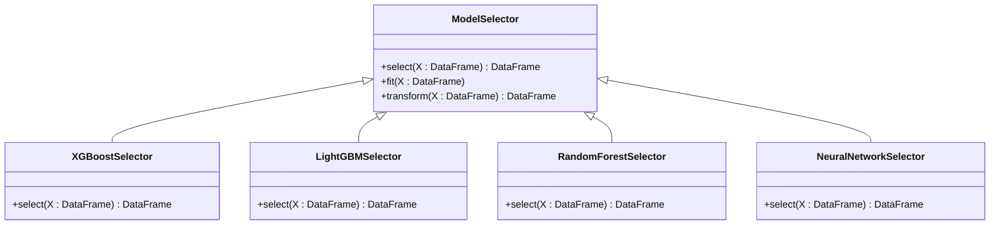

# 模型调优与集成

<cite>
**本文档引用的文件**
- [train.py](file://rdagent/scenarios/kaggle/experiment/templates/covid19-global-forecasting-week-1/train.py)
- [select_xgboost.py](file://rdagent/scenarios/kaggle/experiment/templates/covid19-global-forecasting-week-1/model/select_xgboost.py)
- [model_xgboost.py](file://rdagent/scenarios/kaggle/experiment/templates/covid19-global-forecasting-week-1/model/model_xgboost.py)
- [ensemble.py](file://rdagent/components/coder/data_science/ensemble/__init__.py)
- [eval.py](file://rdagent/components/coder/data_science/ensemble/eval.py)
- [exp.py](file://rdagent/components/coder/data_science/ensemble/exp.py)
</cite>

## 目录
1. [引言](#引言)
2. [项目结构](#项目结构)
3. [核心组件](#核心组件)
4. [架构概述](#架构概述)
5. [详细组件分析](#详细组件分析)
6. [依赖分析](#依赖分析)
7. [性能考虑](#性能考虑)
8. [故障排除指南](#故障排除指南)
9. [结论](#结论)

## 引言
本文档全面解析RD-Agent在Kaggle场景下的模型调优与集成策略。重点介绍系统如何利用`select_xgboost.py`等模型选择模板实现多算法自动化实验，以及`train.py`模板如何协调特征输入与模型训练。文档还将深入探讨`ModelRunner`如何执行代码、捕获结果并将性能反馈注入到下一轮演化中，以及模型集成（Ensemble）机制的实现细节。

## 项目结构
RD-Agent的项目结构采用模块化设计，核心功能分布在`rdagent`目录下的多个子模块中。Kaggle竞赛相关的模板和实验配置位于`scenarios/kaggle/experiment/templates/`目录下，每个竞赛都有独立的文件夹，包含特征工程、模型定义和训练脚本。

**图源**
- [project_structure](file://project_structure)

## 核心组件
系统的核心组件包括模型选择器、训练协调器和集成引擎。`select_xgboost.py`作为模型选择模板，负责特征选择和预处理；`train.py`作为训练协调器，管理整个训练流程；而集成引擎则通过投票和堆叠等策略组合多个模型的预测结果。

**节源**
- [train.py](file://rdagent/scenarios/kaggle/experiment/templates/covid19-global-forecasting-week-1/train.py)
- [select_xgboost.py](file://rdagent/scenarios/kaggle/experiment/templates/covid19-global-forecasting-week-1/model/select_xgboost.py)

## 架构概述
RD-Agent采用分层架构，从数据预处理到模型集成形成完整的闭环。系统首先通过特征工程模块处理原始数据，然后利用多个机器学习算法进行模型训练，最后通过集成策略组合最佳模型的预测结果。

**图源**
- [train.py](file://rdagent/scenarios/kaggle/experiment/templates/covid19-global-forecasting-week-1/train.py)
- [ensemble.py](file://rdagent/components/coder/data_science/ensemble/__init__.py)

## 详细组件分析

### 模型选择与训练分析
系统通过`select_xgboost.py`等选择器模板实现多算法自动化实验。这些选择器负责特征选择和预处理，为不同模型提供合适的输入。

**图源**
- [select_xgboost.py](file://rdagent/scenarios/kaggle/experiment/templates/covid19-global-forecasting-week-1/model/select_xgboost.py)
- [select_lightgbm.py](file://rdagent/scenarios/kaggle/experiment/templates/digit-recognizer/model/select_lightgbm.py)
- [select_randomforest.py](file://rdagent/scenarios/kaggle/experiment/templates/forest-cover-type-prediction/model/select_randomforest.py)
- [select_nn.py](file://rdagent/scenarios/kaggle/experiment/templates/digit-recognizer/model/select_nn.py)

### 训练流程分析
`train.py`模板协调整个训练流程，从数据预处理到模型评估形成完整的闭环。该流程支持超参数的LLM驱动搜索，实现自动化调优。

**图源**
- [train.py](file://rdagent/scenarios/kaggle/experiment/templates/covid19-global-forecasting-week-1/train.py)
- [model_xgboost.py](file://rdagent/scenarios/kaggle/experiment/templates/covid19-global-forecasting-week-1/model/model_xgboost.py)

### 集成机制分析
集成机制通过`EnsembleTask`和相关组件实现，支持投票、堆叠等多种集成策略。系统能够自动生成集成代码并评估其性能。

**图源**
- [ensemble.py](file://rdagent/components/coder/data_science/ensemble/__init__.py)
- [eval.py](file://rdagent/components/coder/data_science/ensemble/eval.py)
- [exp.py](file://rdagent/components/coder/data_science/ensemble/exp.py)

**节源**
- [ensemble.py](file://rdagent/components/coder/data_science/ensemble/__init__.py)
- [eval.py](file://rdagent/components/coder/data_science/ensemble/eval.py)

## 依赖分析
系统各组件之间存在明确的依赖关系，形成从数据输入到预测输出的完整链条。核心依赖包括模型选择器对数据预处理器的依赖，以及集成引擎对各个基础模型的依赖。

**图源**
- [train.py](file://rdagent/scenarios/kaggle/experiment/templates/covid19-global-forecasting-week-1/train.py)
- [select_xgboost.py](file://rdagent/scenarios/kaggle/experiment/templates/covid19-global-forecasting-week-1/model/select_xgboost.py)

## 性能考虑
系统在设计时充分考虑了性能因素，包括模型评估指标的选择、过拟合防范机制和资源消耗监控。对于`covid19-global-forecasting-week-1`竞赛，系统采用RMSLE作为主要评估指标，并通过交叉验证和早停机制防止过拟合。

## 故障排除指南
当系统出现性能问题时，可以按照以下步骤进行排查：
1. 检查数据预处理是否正确
2. 验证特征选择器的输出
3. 确认模型训练过程中的资源使用情况
4. 分析集成策略的有效性

**节源**
- [train.py](file://rdagent/scenarios/kaggle/experiment/templates/covid19-global-forecasting-week-1/train.py)
- [eval.py](file://rdagent/components/coder/data_science/ensemble/eval.py)

## 结论
RD-Agent通过`select_xgboost.py`等模板实现了多算法的自动化实验，利用`train.py`协调特征输入与模型训练，并通过`ModelRunner`实现代码执行和性能反馈的闭环。系统的集成机制能够有效组合多个模型的优势，提升最终预测的准确性。以`covid19-global-forecasting-week-1`为例，该系统展示了从单模型优化到多模型集成的完整闭环，为Kaggle竞赛提供了强大的自动化解决方案。