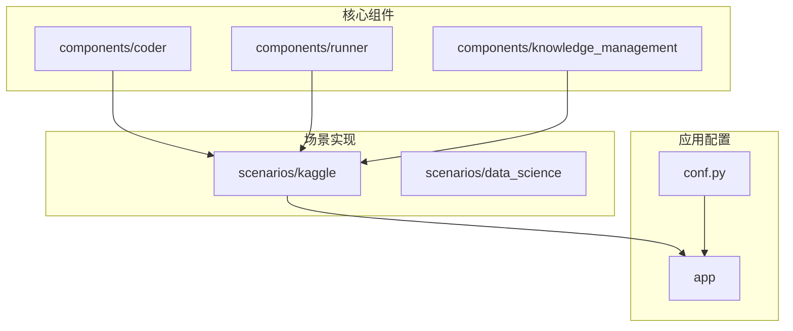
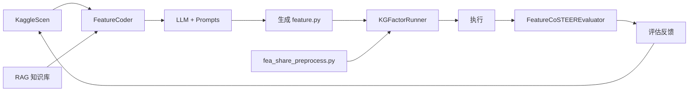
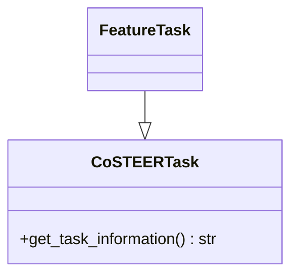
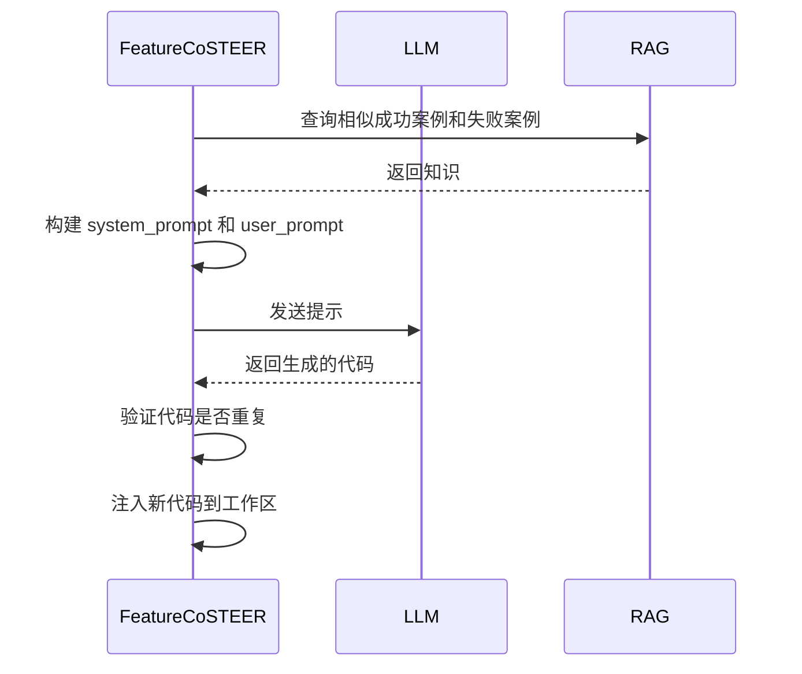
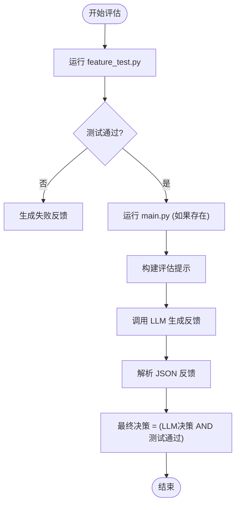
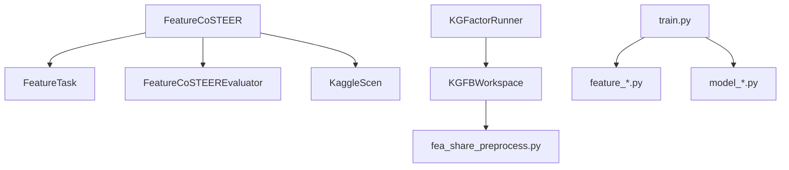

# 特征工程自动化

<cite>
**本文档中引用的文件**  
- [feature.py](file://rdagent/scenarios/kaggle/experiment/templates/playground-series-s4e9/feature/feature.py)
- [fea_share_preprocess.py](file://rdagent/scenarios/kaggle/experiment/templates/playground-series-s4e9/fea_share_preprocess.py)
- [prompts.yaml](file://rdagent/components/coder/data_science/feature/prompts.yaml)
- [__init__.py](file://rdagent/components/coder/data_science/feature/__init__.py)
- [exp.py](file://rdagent/components/coder/data_science/feature/exp.py)
- [eval.py](file://rdagent/components/coder/data_science/feature/eval.py)
- [scenario.py](file://rdagent/scenarios/kaggle/experiment/scenario.py)
- [workspace.py](file://rdagent/scenarios/kaggle/experiment/workspace.py)
- [coder.py](file://rdagent/scenarios/kaggle/developer/coder.py)
- [runner.py](file://rdagent/scenarios/kaggle/developer/runner.py)
- [train.py](file://rdagent/scenarios/kaggle/experiment/templates/playground-series-s4e9/train.py)
</cite>

## 目录
1. [引言](#引言)
2. [项目结构](#项目结构)
3. [核心组件](#核心组件)
4. [架构概述](#架构概述)
5. [详细组件分析](#详细组件分析)
6. [依赖分析](#依赖分析)
7. [性能考量](#性能考量)
8. [故障排除指南](#故障排除指南)
9. [结论](#结论)

## 引言
RD-Agent 是一个自动化机器学习研究与开发系统，专为在 Kaggle 竞赛中实现特征工程自动化而设计。该系统通过结合大语言模型（LLM）提示、RAG（检索增强生成）知识库和迭代式代码生成框架，实现了从原始数据到创新性特征集的自动化生成与评估。本文档深入探讨了 `feature.py` 模板文件如何作为代码生成的蓝图，`fea_share_preprocess.py` 中定义的共享预处理逻辑如何被复用，以及 `KaggleScen` 场景如何驱动 `FeatureCoder` 组件生成创新性特征。通过 `playground-series-s4e9` 实例，展示了系统如何从原始数据出发，迭代生成并评估特征集。

## 项目结构
RD-Agent 的项目结构遵循模块化设计，核心功能分布在 `rdagent` 目录下。`components` 目录包含可复用的组件，如 `coder`（代码生成器）、`runner`（执行器）和 `knowledge_management`（知识管理）。`scenarios` 目录定义了特定场景的实现，其中 `kaggle` 子目录包含了针对 Kaggle 竞赛的完整自动化流程。`app` 目录则包含了应用级别的配置和入口点。

**图源**
- [__init__.py](file://rdagent/components/coder/data_science/feature/__init__.py)
- [scenario.py](file://rdagent/scenarios/kaggle/experiment/scenario.py)

**本节来源**
- [__init__.py](file://rdagent/components/coder/data_science/feature/__init__.py)
- [scenario.py](file://rdagent/scenarios/kaggle/experiment/scenario.py)

## 核心组件
RD-Agent 的特征工程自动化核心由 `FeatureTask`、`FeatureCoSTEER` 和 `FeatureCoSTEEREvaluator` 三个核心组件构成。`FeatureTask` 定义了特征工程任务的抽象，`FeatureCoSTEER` 是负责生成和演化特征代码的主控器，而 `FeatureCoSTEEREvaluator` 则负责对生成的代码进行评估和反馈。

**本节来源**
- [exp.py](file://rdagent/components/coder/data_science/feature/exp.py)
- [__init__.py](file://rdagent/components/coder/data_science/feature/__init__.py)
- [eval.py](file://rdagent/components/coder/data_science/feature/eval.py)

## 架构概述
RD-Agent 的特征工程自动化架构是一个闭环的迭代系统。`KaggleScen` 场景类作为系统的驱动核心，它从 Kaggle 竞赛中获取背景信息、数据描述和评估指标。`FeatureCoder` 组件（即 `KGFactorCoSTEER`）在 `KaggleScen` 的驱动下，利用 `prompts.yaml` 中定义的 LLM 提示，结合 RAG 知识库中的历史成功和失败经验，生成新的特征工程代码。生成的代码由 `KGFactorRunner` 执行，并通过 `FeatureCoSTEEREvaluator` 进行评估，评估结果反馈给 `KaggleScen`，用于指导下一轮的代码生成。

**图源**
- [scenario.py](file://rdagent/scenarios/kaggle/experiment/scenario.py)
- [coder.py](file://rdagent/scenarios/kaggle/developer/coder.py)
- [runner.py](file://rdagent/scenarios/kaggle/developer/runner.py)

## 详细组件分析

### FeatureTask 分析
`FeatureTask` 是特征工程任务的基类，它继承自 `CoSTEERTask`。该类本身不包含具体逻辑，而是作为一个类型标记，用于在系统中区分不同的任务类型。其主要作用是通过 `get_task_information()` 方法提供任务的描述性信息，这些信息被用于 LLM 提示和 RAG 检索。

**图源**
- [exp.py](file://rdagent/components/coder/data_science/feature/exp.py)

**本节来源**
- [exp.py](file://rdagent/components/coder/data_science/feature/exp.py)

### FeatureCoSTEER 分析
`FeatureCoSTEER` 是特征工程代码生成的核心控制器。它继承自 `DSCoSTEER`，并实现了 `MultiProcessEvolvingStrategy` 策略。其 `implement_one_task` 方法是代码生成的关键，它构建了包含竞赛信息、任务描述、数据加载代码、RAG 检索到的成功/失败案例以及代码规范的完整 LLM 提示，然后调用 LLM 生成新的 `feature.py` 代码。

#### 序列图

**图源**
- [__init__.py](file://rdagent/components/coder/data_science/feature/__init__.py)
- [prompts.yaml](file://rdagent/components/coder/data_science/feature/prompts.yaml)

**本节来源**
- [__init__.py](file://rdagent/components/coder/data_science/feature/__init__.py)

### 特征有效性评估分析
特征有效性评估由 `FeatureCoSTEEREvaluator` 负责。它首先在隔离的环境中运行一个测试脚本 (`feature_test.py`) 来验证生成的 `feature.py` 代码是否能正确执行。如果主工作流 (`main.py`) 存在，它还会执行整个工作流以获取更全面的输出。最后，它将测试结果、代码本身和工作流输出作为上下文，通过一个专门的 LLM 提示 (`feature_eval`) 来生成结构化的评估反馈，包括执行情况、返回值检查、代码质量和最终决策。

**图源**
- [eval.py](file://rdagent/components/coder/data_science/feature/eval.py)
- [prompts.yaml](file://rdagent/components/coder/data_science/feature/prompts.yaml)

**本节来源**
- [eval.py](file://rdagent/components/coder/data_science/feature/eval.py)

## 依赖分析
系统各组件之间存在紧密的依赖关系。`FeatureCoSTEER` 依赖于 `FeatureTask` 来定义任务，依赖于 `FeatureCoSTEEREvaluator` 来评估结果，并依赖于 `KaggleScen` 提供的场景信息。`KGFactorRunner` 依赖于 `KGFBWorkspace` 来管理代码和数据，并依赖于 `fea_share_preprocess.py` 提供的预处理逻辑。`train.py` 脚本则依赖于所有生成的 `feature_*.py` 和 `model_*.py` 文件来完成最终的训练和预测。

**图源**
- [__init__.py](file://rdagent/components/coder/data_science/feature/__init__.py)
- [runner.py](file://rdagent/scenarios/kaggle/developer/runner.py)
- [workspace.py](file://rdagent/scenarios/kaggle/experiment/workspace.py)
- [train.py](file://rdagent/scenarios/kaggle/experiment/templates/playground-series-s4e9/train.py)

**本节来源**
- [__init__.py](file://rdagent/components/coder/data_science/feature/__init__.py)
- [runner.py](file://rdagent/scenarios/kaggle/developer/runner.py)

## 性能考量
为了优化性能，系统采用了多种策略。首先，使用 `joblib.Memory` 装饰器对特征工程函数进行缓存，避免重复计算。其次，`KGFactorRunner` 使用 `@cache_with_pickle` 装饰器对整个实验的执行结果进行缓存，防止重复运行相同的代码。此外，系统通过 RAG 知识库避免了重复无效的特征尝试，节省了计算资源。然而，潜在的计算瓶颈在于 LLM 调用和 Docker 环境的启动开销，以及特征爆炸问题——即生成过多特征导致内存和计算时间急剧增加。

**本节来源**
- [prompts.yaml](file://rdagent/components/coder/data_science/feature/prompts.yaml)
- [runner.py](file://rdagent/scenarios/kaggle/developer/runner.py)

## 故障排除指南
当特征工程自动化流程失败时，应首先检查 `FeatureCoSTEEREvaluator` 生成的评估反馈。如果 `execution` 字段报告错误，说明生成的代码存在语法或运行时错误，需要检查 LLM 提示和生成逻辑。如果 `return_checking` 字段发现问题，说明特征转换的逻辑有误。如果 `final_decision` 为 `false`，但前几项检查通过，则可能是工作流执行失败。此外，应检查 RAG 知识库是否有效，以及 Docker 环境是否配置正确。

**本节来源**
- [eval.py](file://rdagent/components/coder/data_science/feature/eval.py)
- [runner.py](file://rdagent/scenarios/kaggle/developer/runner.py)

## 结论
RD-Agent 通过一个精心设计的闭环系统，成功实现了 Kaggle 竞赛中的特征工程自动化。该系统以 `feature.py` 为代码生成蓝图，以 `fea_share_preprocess.py` 为共享预处理逻辑，以 `KaggleScen` 为驱动核心，结合 LLM 提示和 RAG 知识库，能够迭代地生成、评估和优化特征。通过 `playground-series-s4e9` 实例，我们看到了系统如何从原始数据出发，逐步构建出有效的特征集。未来的工作可以集中在优化 RAG 检索策略、改进特征有效性评估的精确度，以及开发更智能的特征组合和降维算法，以进一步提升自动化水平和模型性能。