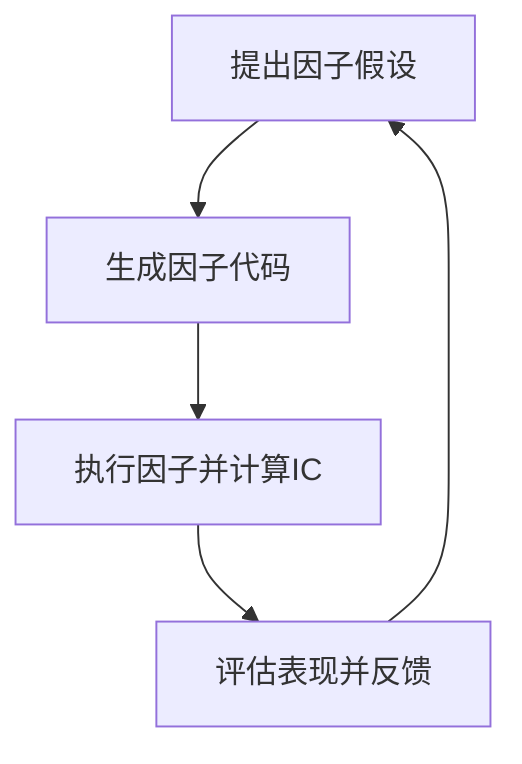
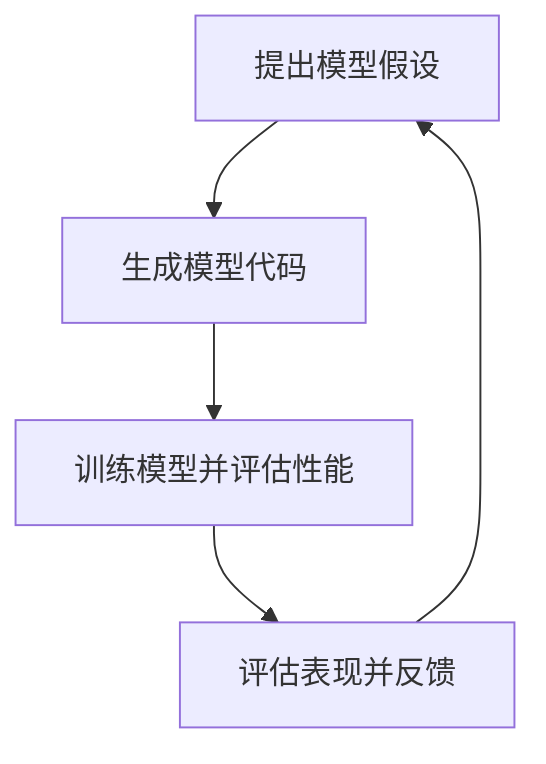
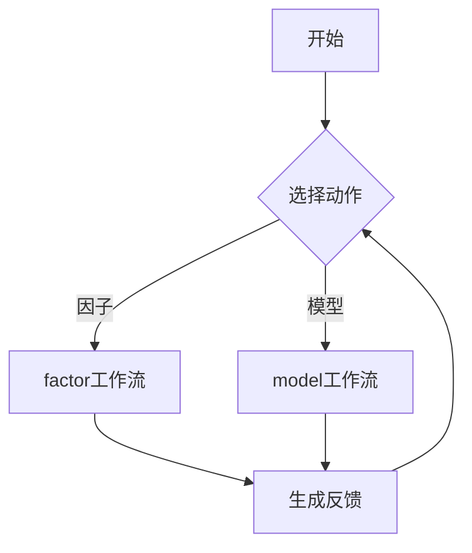
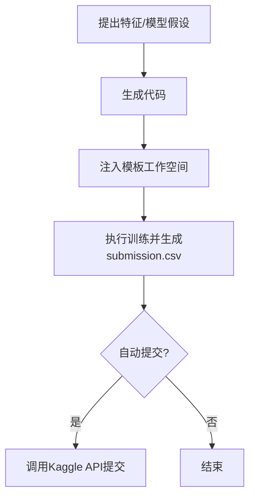
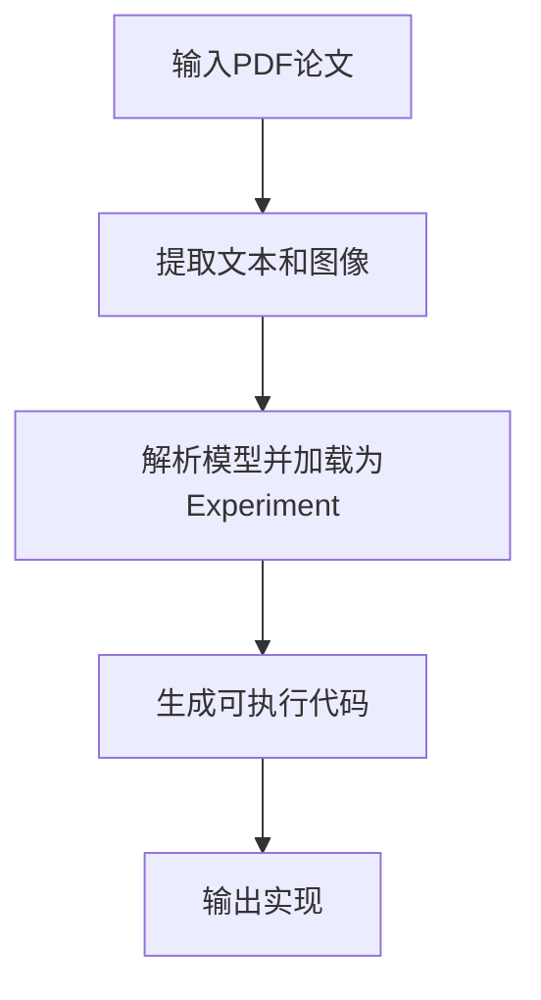

# 场景应用

<cite>
**本文档中引用的文件**  
- [factor.py](file://rdagent/app/qlib_rd_loop/factor.py)
- [model.py](file://rdagent/app/qlib_rd_loop/model.py)
- [quant.py](file://rdagent/app/qlib_rd_loop/quant.py)
- [factor_proposal.py](file://rdagent/scenarios/qlib/proposal/factor_proposal.py)
- [model_proposal.py](file://rdagent/scenarios/qlib/proposal/model_proposal.py)
- [loop.py](file://rdagent/app/kaggle/loop.py)
- [general_model.py](file://rdagent/app/general_model/general_model.py)
- [conf.py](file://rdagent/app/qlib_rd_loop/conf.py)
- [conf.py](file://rdagent/app/kaggle/conf.py)
- [coder.py](file://rdagent/scenarios/kaggle/developer/coder.py)
- [runner.py](file://rdagent/scenarios/kaggle/developer/runner.py)
- [prompts.yaml](file://rdagent/scenarios/qlib/prompts.yaml)
- [prompts.yaml](file://rdagent/scenarios/kaggle/prompts.yaml)
- [prompts.yaml](file://rdagent/scenarios/general_model/prompts.yaml)
</cite>

## 目录
1. [量化金融（Qlib）](#量化金融qilib)
2. [Kaggle竞赛](#kaggle竞赛)
3. [通用模型实现](#通用模型实现)

## 量化金融（Qlib）

RD-Agent为量化金融领域提供了三个核心命令：`fin_factor`、`fin_model`和`fin_quant`，分别对应因子研究、模型研究以及因子与模型联合研究三种场景。

### fin_factor、fin_model与fin_quant命令的区别

这三个命令分别启动不同的研发循环（RD Loop），其核心区别在于研究目标和工作流的组成。

**fin_factor** 命令用于专注于因子发现。它通过`FactorRDLoop`类执行，其工作流主要包括：
- **提出（Propose）**：生成关于新因子的假设。
- **编码（Coding）**：将假设转化为可执行的因子代码。
- **运行（Running）**：在Qlib框架下执行因子并计算其IC（信息系数）等指标。
- **反馈（Feedback）**：评估因子表现并生成反馈以指导下一轮迭代。

**Diagram sources**
- [factor.py](file://rdagent/app/qlib_rd_loop/factor.py#L1-L60)

**Section sources**
- [factor.py](file://rdagent/app/qlib_rd_loop/factor.py#L1-L60)
- [conf.py](file://rdagent/app/qlib_rd_loop/conf.py#L1-L30)

**fin_model** 命令则专注于量化模型的开发。它通过`ModelRDLoop`类执行，其工作流与`fin_factor`类似，但目标是构建预测模型：
- **提出（Propose）**：生成关于新模型架构或超参数的假设。
- **编码（Coding）**：将假设转化为可训练的模型代码。
- **运行（Running）**：训练模型并评估其在验证集上的表现。
- **反馈（Feedback）**：根据模型性能生成反馈。

**Diagram sources**
- [model.py](file://rdagent/app/qlib_rd_loop/model.py#L1-L43)

**Section sources**
- [model.py](file://rdagent/app/qlib_rd_loop/model.py#L1-L43)
- [conf.py](file://rdagent/app/qlib_rd_loop/conf.py#L31-L60)

**fin_quant** 命令是前两者的集成，通过`QuantRDLoop`类实现。它采用一种**交替或基于策略选择**（如bandit算法）的方式，在因子研究和模型研究之间动态切换。该命令的工作流会根据当前选择的动作（action）来决定是执行因子流程还是模型流程，从而实现一个更全面的量化研究闭环。

**Diagram sources**
- [quant.py](file://rdagent/app/qlib_rd_loop/quant.py#L1-L143)

**Section sources**
- [quant.py](file://rdagent/app/qlib_rd_loop/quant.py#L1-L143)
- [conf.py](file://rdagent/app/qlib_rd_loop/conf.py#L61-L120)

### factor_proposal.py与model_proposal.py的工作机制

`factor_proposal.py`和`model_proposal.py`是生成因子和模型代码的核心模块，它们遵循“假设生成（Hypothesis Generation）”到“实验生成（Experiment Generation）”的两步流程。

**factor_proposal.py** 的工作流程如下：
1.  **假设生成（QlibFactorHypothesisGen）**：该类根据当前的研究历史（trace）和场景描述，生成关于新因子的假设。它会考虑历史假设的反馈，并根据研究轮次调整策略（例如，初期尝试简单因子，后期尝试机器学习因子）。
2.  **实验生成（QlibFactorHypothesis2Experiment）**：该类将上一步生成的假设转化为具体的`FactorExperiment`。它会解析LLM的响应，提取因子名称、描述、公式和变量，创建`FactorTask`，并确保不重复实现已有的因子。

**Section sources**
- [factor_proposal.py](file://rdagent/scenarios/qlib/proposal/factor_proposal.py#L1-L132)
- [prompts.yaml](file://rdagent/scenarios/qlib/prompts.yaml)

**model_proposal.py** 的工作流程与前者类似，但更侧重于模型：
1.  **假设生成（QlibModelHypothesisGen）**：生成关于新模型的假设。它会特别关注SOTA（当前最优）模型的历史反馈，并遵循特定的领域知识（如建议使用GRU/LSTM处理时序数据，控制模型大小以适应数据集规模）。
2.  **实验生成（QlibModelHypothesis2Experiment）**：将模型假设转化为`QlibModelExperiment`。它会解析响应中的模型架构、超参数、训练超参数等信息，并创建`ModelTask`。

**Section sources**
- [model_proposal.py](file://rdagent/scenarios/qlib/proposal/model_proposal.py#L1-L159)
- [prompts.yaml](file://rdagent/scenarios/qlib/prompts.yaml)

## Kaggle竞赛

`KaggleScen`场景通过`KaggleRDLoop`实现了高度自动化的Kaggle竞赛参与流程。其核心是利用预定义的模板和自动化工作流，覆盖从数据加载到模型提交的完整生命周期。

### 模板与自动化流程

该流程的关键在于**模板化工作空间**和**多阶段自动化**。

1.  **模板化（Templating）**：系统为不同的Kaggle竞赛（如`playground-series-s4e9`）提供了预定义的代码模板。这些模板位于`rdagent/scenarios/kaggle/experiment/templates`目录下，包含了数据加载、特征工程、模型定义和训练脚本的基本结构。
2.  **自动化流程（Automated Workflow）**：`KaggleRDLoop`的工作流如下：
    - **提出（Propose）**：`KGHypothesisGen`生成关于特征工程或模型改进的假设。
    - **编码（Coding）**：根据假设，使用`KGFactorCoSTEER`或`KGModelCoSTEER`等开发者组件生成代码。例如，`KGModelFeatureSelectionCoder`会根据LLM的决策，自动生成特征选择代码。
    - **运行（Running）**：`KGFactorRunner`和`KGModelRunner`负责执行代码。`KGModelRunner`会将生成的模型代码注入到模板工作空间中，并执行整个训练流程。
    - **自动提交（Auto Submission）**：如果配置了`auto_submit`，系统会调用Kaggle API，将生成的`submission.csv`文件自动提交到竞赛平台，实现端到端的无人干预。

**Diagram sources**
- [loop.py](file://rdagent/app/kaggle/loop.py#L1-L139)
- [coder.py](file://rdagent/scenarios/kaggle/developer/coder.py#L1-L70)
- [runner.py](file://rdagent/scenarios/kaggle/developer/runner.py#L1-L131)

**Section sources**
- [loop.py](file://rdagent/app/kaggle/loop.py#L1-L139)
- [conf.py](file://rdagent/app/kaggle/conf.py#L1-L96)
- [coder.py](file://rdagent/scenarios/kaggle/developer/coder.py#L1-L70)
- [runner.py](file://rdagent/scenarios/kaggle/developer/runner.py#L1-L131)

## 通用模型实现

`general_model.py`场景旨在实现从学术论文到可执行代码的自动化转换，是RD-Agent作为“研究助手”的核心体现。

### general_model.py的工作流程

该模块通过`extract_models_and_implement`函数实现端到端的模型解析与生成。

1.  **场景初始化**：创建`GeneralModelScenario`，定义通用模型实现的上下文。
2.  **文档读取**：使用`document_reader`组件从输入的PDF论文中提取文本和图像（如第一页截图）。
3.  **实验加载**：`ModelExperimentLoaderFromPDFfiles`负责解析PDF内容，识别论文中描述的模型架构、公式和算法，并将其加载为一个`ModelExperiment`对象。
4.  **代码生成**：最后，`QlibModelCoSTEER`（一个基于CoSTEER框架的开发者）接手，将抽象的`ModelExperiment`发展（develop）为包含完整可执行代码的具体实现。

此流程将复杂的论文内容解析与代码生成任务解耦，使得系统可以专注于将已结构化的模型描述转化为高质量的代码。

**Diagram sources**
- [general_model.py](file://rdagent/app/general_model/general_model.py#L1-L45)

**Section sources**
- [general_model.py](file://rdagent/app/general_model/general_model.py#L1-L45)
- [prompts.yaml](file://rdagent/scenarios/general_model/prompts.yaml)