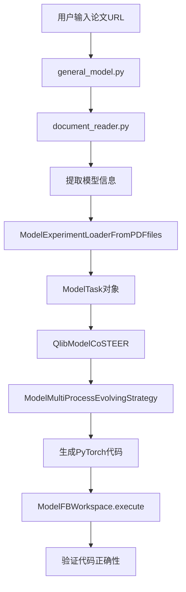
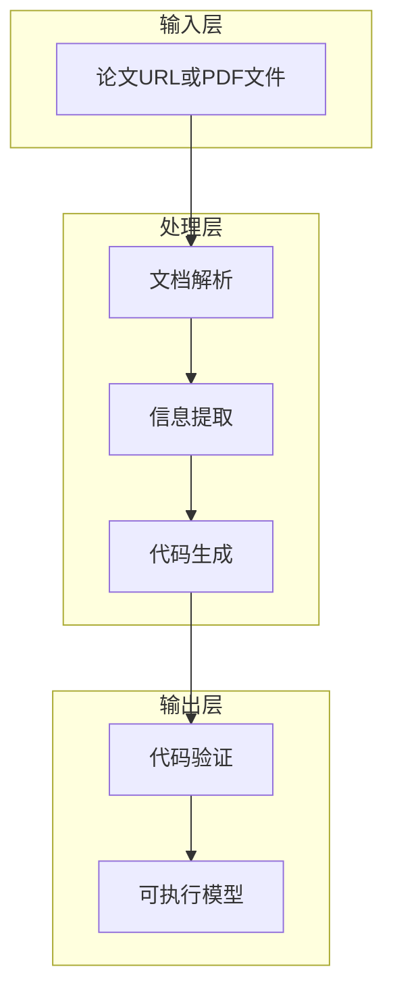
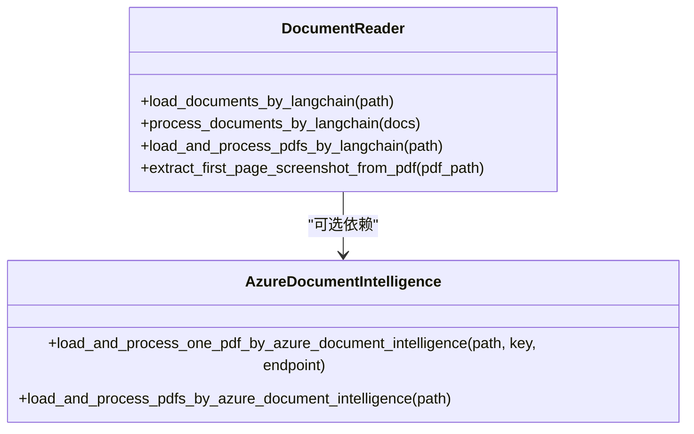
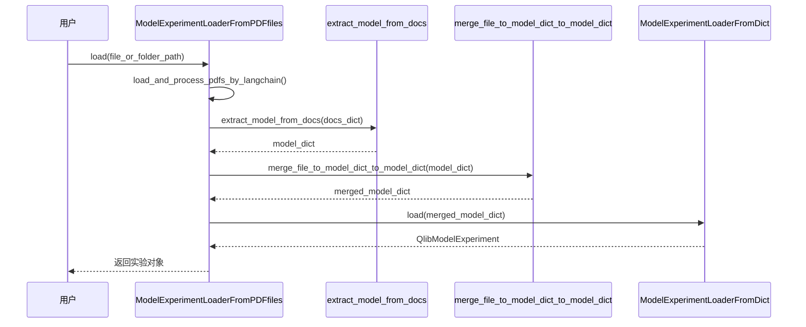
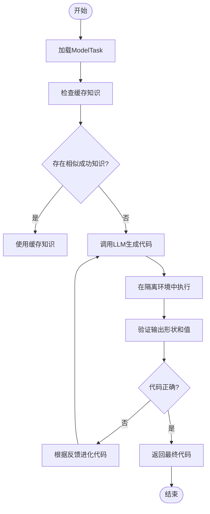
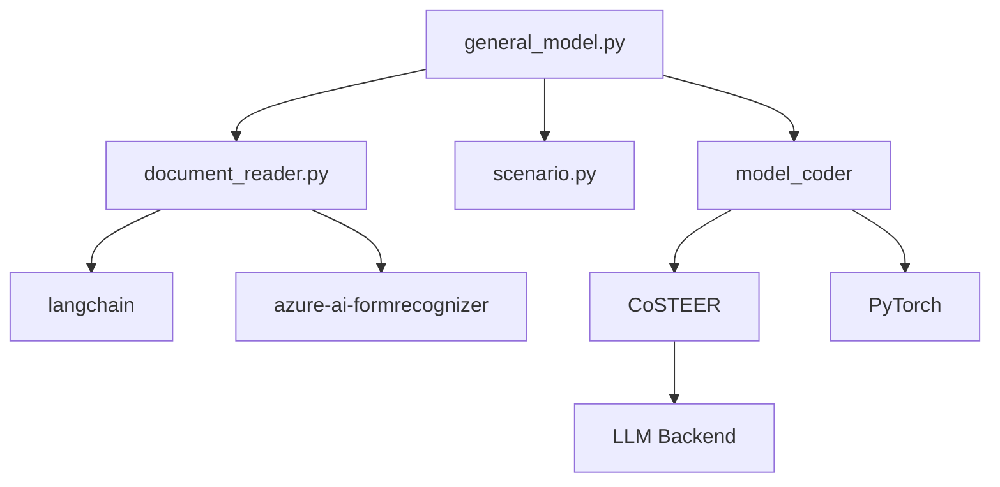

# 通用模型实现

<cite>
**本文档中引用的文件**  
- [general_model.py](file://rdagent/app/general_model/general_model.py)
- [document_reader.py](file://rdagent/components/document_reader/document_reader.py)
- [model.py](file://rdagent/components/coder/model_coder/model.py)
- [scenario.py](file://rdagent/scenarios/general_model/scenario.py)
- [task_loader.py](file://rdagent/components/coder/model_coder/task_loader.py)
- [evolving_strategy.py](file://rdagent/components/coder/model_coder/evolving_strategy.py)
- [evaluators.py](file://rdagent/components/coder/model_coder/evaluators.py)
- [conf.py](file://rdagent/components/coder/model_coder/conf.py)
- [prompts.yaml](file://rdagent/scenarios/general_model/prompts.yaml)
</cite>

## 目录
1. [简介](#简介)
2. [项目结构](#项目结构)
3. [核心组件](#核心组件)
4. [架构概述](#架构概述)
5. [详细组件分析](#详细组件分析)
6. [依赖分析](#依赖分析)
7. [性能考虑](#性能考虑)
8. [故障排除指南](#故障排除指南)
9. [结论](#结论)

## 简介
本文档详细介绍了`general_model`功能如何实现从学术论文到可执行代码的自动化转换。当用户通过`rdagent general_model <paper_url>`命令启动流程后，系统首先利用`document_reader.py`解析PDF或arXiv链接，提取论文中的模型架构、数学公式和实验设置；然后`general_model.py`将这些信息转化为`ModelExperiment`对象；最后由`model_coder/model.py`中的`ModelCoder`生成具体的PyTorch或TensorFlow实现代码。文档深入分析了代码生成过程中的关键挑战，如模糊描述处理、超参数推断及框架兼容性问题，并提供了一个从Transformer论文到生成可运行代码的完整案例。

## 项目结构
该功能主要分布在`rdagent/app/general_model/`和`rdagent/components/`目录下，涉及文档读取、模型编码、任务加载等多个模块。核心文件包括`general_model.py`作为入口点，`document_reader.py`负责文档解析，`model_coder/model.py`负责代码生成。

**图示来源**
- [general_model.py](file://rdagent/app/general_model/general_model.py#L1-L45)
- [document_reader.py](file://rdagent/components/document_reader/document_reader.py#L1-L121)
- [model.py](file://rdagent/components/coder/model_coder/model.py#L1-L163)

**节来源**
- [general_model.py](file://rdagent/app/general_model/general_model.py#L1-L45)
- [document_reader.py](file://rdagent/components/document_reader/document_reader.py#L1-L121)

## 核心组件
`general_model`功能的核心在于三个主要组件：文档读取器（Document Reader）、模型实验加载器（Model Experiment Loader）和模型编码器（Model Coder）。文档读取器使用LangChain和Azure Document Intelligence服务来解析PDF内容；模型实验加载器将提取的信息转换为结构化任务；模型编码器则基于这些任务生成可执行的深度学习代码。

**节来源**
- [document_reader.py](file://rdagent/components/document_reader/document_reader.py#L1-L121)
- [task_loader.py](file://rdagent/components/coder/model_coder/task_loader.py#L1-L127)
- [model.py](file://rdagent/components/coder/model_coder/model.py#L1-L163)

## 架构概述
整个系统采用分层架构设计，分为输入层、处理层和输出层。输入层接收论文URL或本地PDF路径；处理层包含文档解析、信息提取和代码生成三个阶段；输出层负责验证生成代码的正确性和可执行性。

**图示来源**
- [general_model.py](file://rdagent/app/general_model/general_model.py#L1-L45)
- [scenario.py](file://rdagent/scenarios/general_model/scenario.py#L1-L55)

## 详细组件分析

### 文档读取器分析
文档读取器模块负责从PDF或arXiv链接中提取文本内容。它支持两种解析方式：基于LangChain的本地解析和基于Azure Document Intelligence的云端解析。

#### 类图

**图示来源**
- [document_reader.py](file://rdagent/components/document_reader/document_reader.py#L1-L121)

### 模型任务加载器分析
模型任务加载器负责将提取的文档内容转换为结构化的`ModelTask`对象，并最终构建成`QlibModelExperiment`。

#### 序列图

**图示来源**
- [task_loader.py](file://rdagent/components/coder/model_coder/task_loader.py#L98-L127)

### 模型编码器分析
模型编码器是整个系统的核心，负责将`ModelTask`转换为实际的PyTorch代码。它采用CoSTEER框架进行多轮演化式代码生成。

#### 流程图

**图示来源**
- [evolving_strategy.py](file://rdagent/components/coder/model_coder/evolving_strategy.py#L1-L89)
- [evaluators.py](file://rdagent/components/coder/model_coder/evaluators.py#L1-L104)

**节来源**
- [evolving_strategy.py](file://rdagent/components/coder/model_coder/evolving_strategy.py#L1-L89)
- [evaluators.py](file://rdagent/components/coder/model_coder/evaluators.py#L1-L104)

## 依赖分析
系统依赖多个外部库和服务，包括LangChain用于文档加载、Azure AI Form Recognizer用于高级文档解析、PyTorch用于模型执行验证等。内部模块间通过清晰的接口进行通信，确保了高内聚低耦合的设计原则。

**图示来源**
- [general_model.py](file://rdagent/app/general_model/general_model.py#L1-L45)
- [document_reader.py](file://rdagent/components/document_reader/document_reader.py#L1-L121)
- [model.py](file://rdagent/components/coder/model_coder/model.py#L1-L163)

**节来源**
- [general_model.py](file://rdagent/app/general_model/general_model.py#L1-L45)
- [document_reader.py](file://rdagent/components/document_reader/document_reader.py#L1-L121)
- [model.py](file://rdagent/components/coder/model_coder/model.py#L1-L163)

## 性能考虑
系统在设计时充分考虑了性能因素。文档解析阶段支持并行处理多个PDF文件；代码生成阶段采用缓存机制避免重复计算；执行验证阶段使用Docker或Conda隔离环境以保证一致性。此外，通过限制LLM请求长度和设置重试机制提高了鲁棒性。

## 故障排除指南
常见问题包括文档解析失败、代码生成错误和执行环境异常。对于解析失败，可检查PDF格式或切换解析引擎；对于代码错误，系统会自动进行多轮修正；环境问题通常可通过重新配置Docker/Conda解决。日志记录功能帮助追踪每一步的操作详情。

**节来源**
- [document_reader.py](file://rdagent/components/document_reader/document_reader.py#L1-L121)
- [conf.py](file://rdagent/components/coder/model_coder/conf.py#L1-L38)
- [model.py](file://rdagent/components/coder/model_coder/model.py#L1-L163)

## 结论
`general_model`功能实现了从学术论文到可执行代码的端到端自动化转换。通过结合先进的文档解析技术和基于LLM的代码生成方法，系统能够准确理解复杂的研究内容并生成高质量的实现代码。未来工作将扩展支持更多深度学习框架，并增强对模糊描述的推理能力。