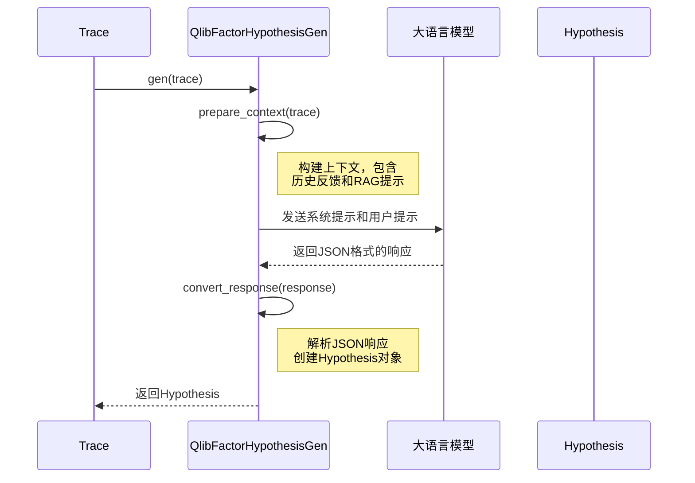
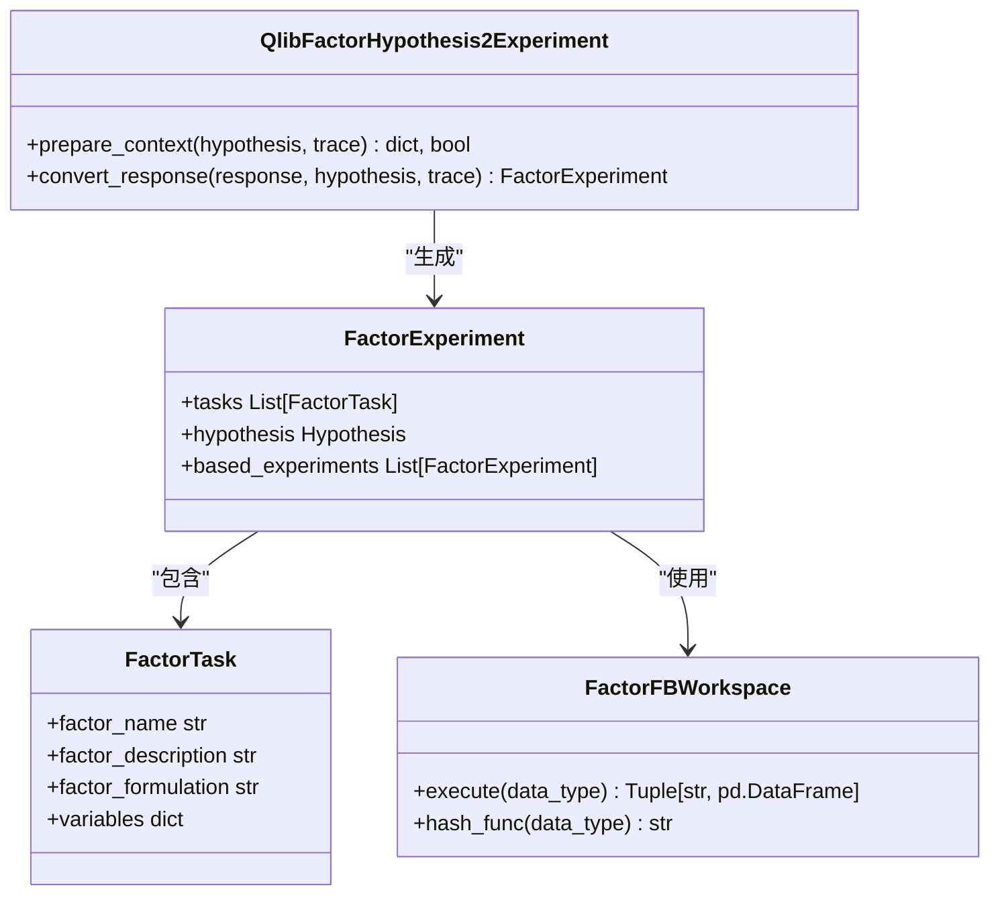
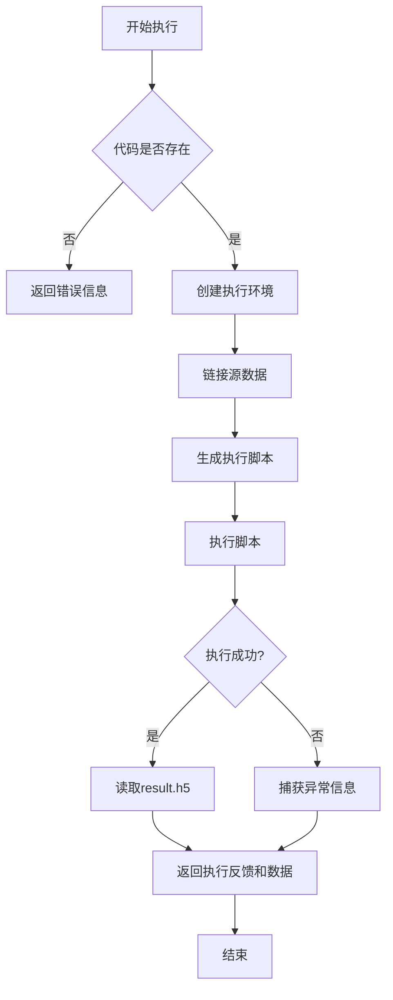

# 因子演化

<cite>
**本文档中引用的文件**  
- [factor_proposal.py](file://rdagent/scenarios/qlib/proposal/factor_proposal.py)
- [factor_coder.py](file://rdagent/scenarios/qlib/developer/factor_coder.py)
- [factor.py](file://rdagent/components/coder/factor_coder/factor.py)
- [factor_experiment.py](file://rdagent/scenarios/qlib/experiment/factor_experiment.py)
- [factor_execution_template.txt](file://rdagent/components/coder/factor_coder/factor_execution_template.txt)
- [config.py](file://rdagent/components/coder/factor_coder/config.py)
- [workspace.py](file://rdagent/scenarios/qlib/experiment/workspace.py)
- [prompts.yaml](file://rdagent/scenarios/qlib/prompts.yaml)
</cite>

## 目录
1. [引言](#引言)
2. [因子假设生成流程](#因子假设生成流程)
3. [因子逻辑到代码的转换](#因子逻辑到代码的转换)
4. [因子实验结构与执行环境](#因子实验结构与执行环境)
5. [端到端示例：从假设到评估](#端到端示例从假设到评估)
6. [过拟合检测与RAG知识库复用](#过拟合检测与rag知识库复用)
7. [结论](#结论)

## 引言

RD-Agent在量化金融领域实现了自动化因子演化流程，通过系统化的假设生成、代码实现和实验评估机制，持续优化投资策略。该系统基于Qlib框架，结合大语言模型（LLM）和自动化执行环境，构建了一个闭环的因子研发工作流。整个流程从生成初始因子假设开始，经过逻辑到代码的转换，最终在Docker隔离环境中执行并评估因子表现。本文件将深入解析这一完整流程，重点关注`factor_proposal.py`中的`FactorProposal`类如何驱动因子创新，以及各组件之间的协同机制。

## 因子假设生成流程

因子假设生成是RD-Agent因子演化流程的起点，由`factor_proposal.py`中的`QlibFactorHypothesisGen`类负责实现。该类继承自`LLMHypothesisGen`，利用大语言模型根据历史实验反馈和场景描述生成新的因子假设。

`QlibFactorHypothesisGen`的`prepare_context`方法构建了生成假设所需的上下文信息，包括历史假设与反馈、最后的假设与反馈，以及基于迭代次数的RAG（检索增强生成）提示。在前15轮迭代中，系统鼓励尝试简单且快速实现的因子；之后则引导模型探索能实现高信息系数（IC）的复杂因子，如基于机器学习的因子。

**图示来源**
- [factor_proposal.py](file://rdagent/scenarios/qlib/proposal/factor_proposal.py#L34-L57)

**本节来源**
- [factor_proposal.py](file://rdagent/scenarios/qlib/proposal/factor_proposal.py#L1-L132)

## 因子逻辑到代码的转换

从因子逻辑到可执行Python代码的转换过程由`factor_coder.py`模块实现。该过程的核心是`QlibFactorHypothesis2Experiment`类，它继承自`LLMHypothesis2Experiment`，负责将`Hypothesis`对象转换为`QlibFactorExperiment`对象。

转换过程首先通过`prepare_context`方法准备上下文，将目标假设、场景描述和历史反馈等信息组织成适合大语言模型处理的格式。然后，系统提示和用户提示被发送给大语言模型，要求其根据`factor_experiment_output_format`中定义的JSON模式生成具体的因子实现方案。

**图示来源**
- [factor_proposal.py](file://rdagent/scenarios/qlib/proposal/factor_proposal.py#L59-L132)
- [factor.py](file://rdagent/components/coder/factor_coder/factor.py#L1-L232)

**本节来源**
- [factor_proposal.py](file://rdagent/scenarios/qlib/proposal/factor_proposal.py#L59-L132)
- [factor_coder.py](file://rdagent/scenarios/qlib/developer/factor_coder.py)

## 因子实验结构与执行环境

`factor_experiment.py`文件定义了因子实验的核心结构`QlibFactorExperiment`，它继承自`FactorExperiment`，并集成了`QlibFBWorkspace`作为实验工作空间。`QlibFBWorkspace`封装了在特定环境中执行因子代码的逻辑。

实验执行的关键在于`factor_execution_template.txt`模板文件。当`FactorFBWorkspace`的`execute`方法被调用时，系统会创建一个临时的Python脚本，该脚本导入用户生成的`factor.py`文件，并执行特征工程类的`fit`和`transform`方法，最终将结果保存为`result.h5`文件。此过程在由`get_factor_env`配置的隔离环境中运行，确保了实验的可重复性和安全性。

**图示来源**
- [factor_experiment.py](file://rdagent/scenarios/qlib/experiment/factor_experiment.py#L1-L90)
- [workspace.py](file://rdagent/scenarios/qlib/experiment/workspace.py#L1-L59)
- [factor_execution_template.txt](file://rdagent/components/coder/factor_coder/factor_execution_template.txt#L1-L16)

**本节来源**
- [factor_experiment.py](file://rdagent/scenarios/qlib/experiment/factor_experiment.py#L1-L90)
- [workspace.py](file://rdagent/scenarios/qlib/experiment/workspace.py#L1-L59)
- [config.py](file://rdagent/components/coder/factor_coder/config.py#L1-L49)

## 端到端示例：从假设到评估

一个完整的因子演化端到端示例如下：首先，`QlibFactorHypothesisGen`根据`prompts.yaml`中的`factor_hypothesis_specification`规则生成一个假设，例如提出一个基于动量的简单因子。接着，`QlibFactorHypothesis2Experiment`将此假设转换为具体的`FactorTask`，包含因子名称、描述、公式和变量。

然后，系统调用`factor_coder`组件，利用大语言模型将`FactorTask`中的逻辑转换为符合Qlib规范的Python代码，并写入`factor.py`文件。最后，`QlibFactorExperiment`通过`QlibFBWorkspace`在Docker或Conda环境中执行该代码。执行过程使用`factor_execution_template.txt`作为模板，加载验证数据，实例化特征工程类，并将生成的因子值保存到`result.h5`。

评估结果通过`QlibFBWorkspace`的`execute`方法返回，包括执行日志和因子值数据框。这些结果随后被用于生成反馈，决定该因子是否成为新的SOTA（业界最佳），并指导下一轮的假设生成。

**本节来源**
- [factor_proposal.py](file://rdagent/scenarios/qlib/proposal/factor_proposal.py)
- [factor_coder.py](file://rdagent/scenarios/qlib/developer/factor_coder.py)
- [factor_experiment.py](file://rdagent/scenarios/qlib/experiment/factor_experiment.py)

## 过拟合检测与RAG知识库复用

RD-Agent通过多种机制来检测和缓解因子过拟合问题。首先，系统通过严格的回测分析来评估因子表现，重点关注信息系数（IC）和年化超额收益率等关键指标。如果新因子在验证集上的表现显著优于训练集，或与SOTA结果存在巨大差距，则可能提示过拟合风险。

其次，系统利用RAG（检索增强生成）知识库来复用历史有效因子模式。`QlibFactorHypothesisGen`中的RAG提示会根据迭代次数动态调整，引导模型在早期探索简单因子，在后期探索复杂因子。更重要的是，所有已验证有效的SOTA因子都会被纳入因子库，并在后续的每次回测中自动组合使用。这确保了新提出的因子必须在现有SOTA因子的基础上带来真正的增量价值，从而有效防止了对历史数据的过度拟合。

**本节来源**
- [factor_proposal.py](file://rdagent/scenarios/qlib/proposal/factor_proposal.py#L45-L50)
- [prompts.yaml](file://rdagent/scenarios/qlib/prompts.yaml#L94-L111)

## 结论

RD-Agent构建了一个高度自动化的量化因子演化系统，实现了从假设生成、代码实现到实验评估的完整闭环。该系统通过精心设计的提示工程（prompt engineering）和模块化架构，有效地引导大语言模型在量化金融领域进行创新。其核心优势在于将复杂的金融知识（如因子类型、回测指标）编码到提示模板中，并通过RAG机制和SOTA因子库的持续积累，确保了研发过程的稳健性和可持续性。未来的工作可以进一步优化执行环境的性能，并探索更复杂的因子组合与集成策略。