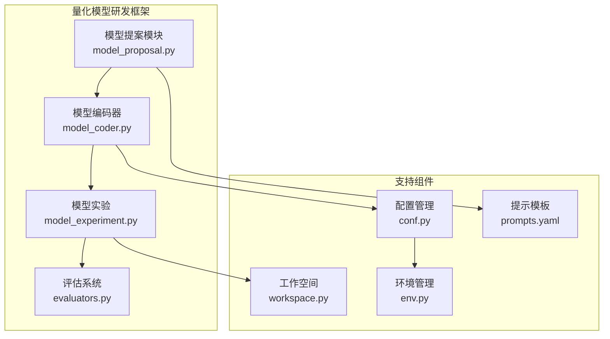
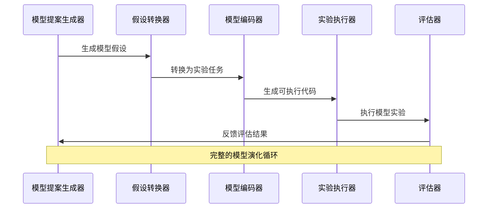
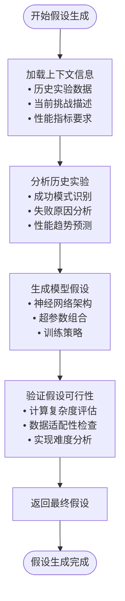
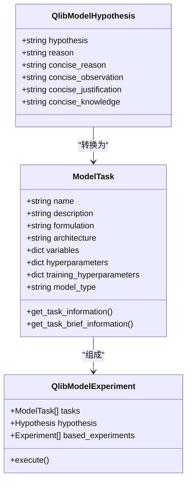
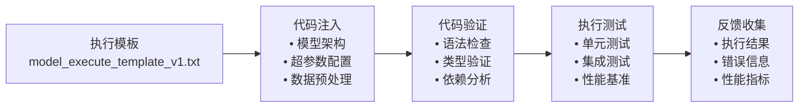
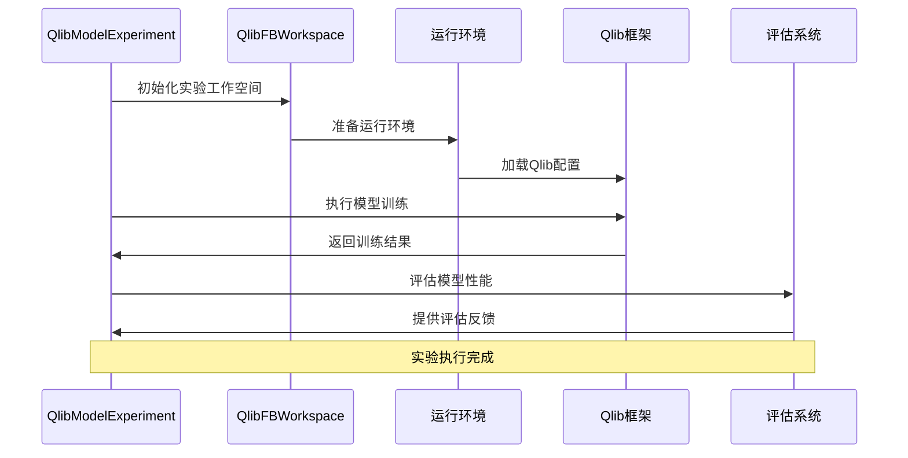
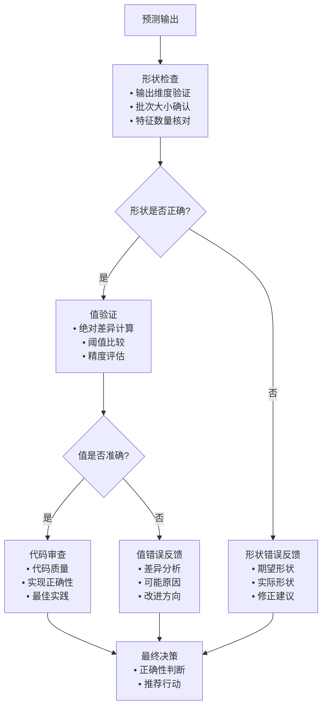
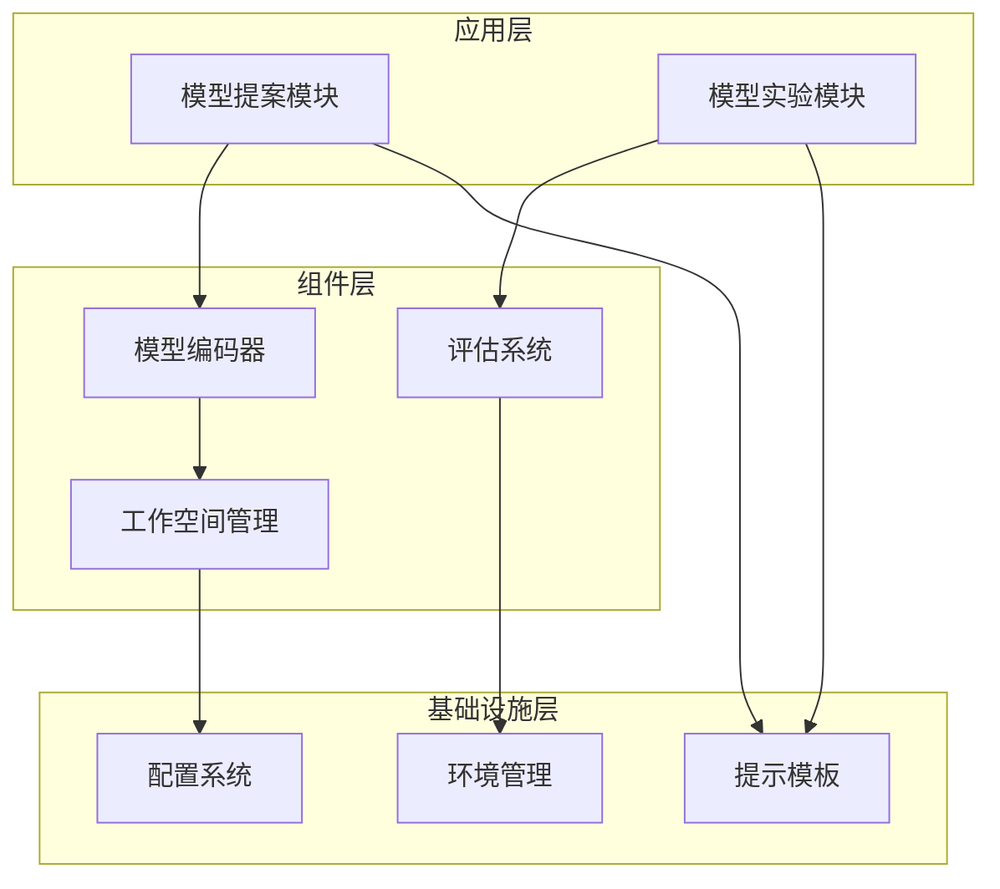

# 模型演化

<cite>
**本文档引用的文件**
- [model_proposal.py](file://rdagent/scenarios/qlib/proposal/model_proposal.py)
- [model.py](file://rdagent/components/coder/model_coder/model.py)
- [model_experiment.py](file://rdagent/scenarios/qlib/experiment/model_experiment.py)
- [model_execute_template_v1.txt](file://rdagent/components/coder/model_coder/model_execute_template_v1.txt)
- [conf.py](file://rdagent/components/coder/model_coder/conf.py)
- [workspace.py](file://rdagent/scenarios/qlib/experiment/workspace.py)
- [evaluators.py](file://rdagent/components/coder/model_coder/evaluators.py)
- [eva_utils.py](file://rdagent/components/coder/model_coder/eva_utils.py)
- [prompts.yaml](file://rdagent/components/coder/model_coder/prompts.yaml)
- [env.py](file://rdagent/utils/env.py)
</cite>

## 目录
1. [引言](#引言)
2. [项目结构概览](#项目结构概览)
3. [核心组件分析](#核心组件分析)
4. [架构概览](#架构概览)
5. [详细组件分析](#详细组件分析)
6. [依赖关系分析](#依赖关系分析)
7. [性能考虑](#性能考虑)
8. [故障排除指南](#故障排除指南)
9. [结论](#结论)

## 引言

RD-Agent是一个先进的量化模型自动化研发平台，专门针对金融量化投资场景设计。该系统通过智能代理技术实现了从模型假设生成到性能评估的完整自动化流程，显著提升了量化模型研发的效率和质量。本文档深入分析了RD-Agent在模型演化过程中的核心实现机制，重点关注`model_proposal.py`中`ModelProposal`类的工作原理、`Hypothesis2Experiment`的转换逻辑，以及`model_coder.py`如何将抽象的模型假设转化为可执行的训练代码。

## 项目结构概览

RD-Agent采用模块化架构设计，主要包含以下核心模块：

**图表来源**
- [model_proposal.py](file://rdagent/scenarios/qlib/proposal/model_proposal.py#L1-L160)
- [model.py](file://rdagent/components/coder/model_coder/model.py#L1-L164)
- [model_experiment.py](file://rdagent/scenarios/qlib/experiment/model_experiment.py#L1-L83)

## 核心组件分析

### 模型提案生成器（ModelHypothesisGen）

`ModelHypothesisGen`是模型演化的核心驱动器，负责根据历史实验反馈生成新的模型假设。该组件通过深度学习提示工程，能够理解复杂的量化金融场景，并生成具有创新性的模型架构建议。

**章节来源**
- [model_proposal.py](file://rdagent/scenarios/qlib/proposal/model_proposal.py#L15-L160)

### 假设到实验转换器（Hypothesis2Experiment）

`Hypothesis2Experiment`组件实现了从抽象模型假设到具体可执行实验的转换过程。该组件不仅需要理解模型的理论架构，还要将其转化为符合Qlib框架规范的可执行代码。

**章节来源**
- [model_proposal.py](file://rdagent/scenarios/qlib/proposal/model_proposal.py#L72-L158)

### 模型任务定义

`ModelTask`类定义了量化模型的基本属性和行为，包括模型架构、超参数配置、训练策略等关键要素。每个模型任务都包含了完整的建模信息，为后续的代码生成和实验执行提供了标准化的数据结构。

**章节来源**
- [model.py](file://rdagent/components/coder/model_coder/model.py#L12-L60)

## 架构概览

RD-Agent的模型演化架构采用了分层设计，确保了系统的可扩展性和维护性：

**图表来源**
- [model_proposal.py](file://rdagent/scenarios/qlib/proposal/model_proposal.py#L72-L158)
- [model.py](file://rdagent/components/coder/model_coder/model.py#L62-L164)

## 详细组件分析

### ModelProposal类工作原理

`ModelProposal`类是量化模型自动研发的核心组件，其工作原理体现了智能代理在复杂决策场景中的应用：

#### 模型结构假设生成

**图表来源**
- [model_proposal.py](file://rdagent/scenarios/qlib/proposal/model_proposal.py#L15-L60)

#### Hypothesis2Experiment转换逻辑

该转换过程涉及多个层次的信息映射和格式化：

**图表来源**
- [model_proposal.py](file://rdagent/scenarios/qlib/proposal/model_proposal.py#L72-L158)
- [model.py](file://rdagent/components/coder/model_coder/model.py#L12-L60)

**章节来源**
- [model_proposal.py](file://rdagent/scenarios/qlib/proposal/model_proposal.py#L72-L158)

### ModelCoder代码生成机制

`model_coder.py`模块负责将抽象的模型假设转化为基于Qlib框架的可执行训练代码。该过程通过模板引擎和动态代码注入实现：

#### 模板系统使用

系统使用`model_execute_template_v1.txt`作为基础模板，该模板定义了模型执行的标准流程：

**图表来源**
- [model_execute_template_v1.txt](file://rdagent/components/coder/model_coder/model_execute_template_v1.txt#L1-L45)
- [model.py](file://rdagent/components/coder/model_coder/model.py#L62-L164)

**章节来源**
- [model.py](file://rdagent/components/coder/model_coder/model.py#L62-L164)
- [model_execute_template_v1.txt](file://rdagent/components/coder/model_coder/model_execute_template_v1.txt#L1-L45)

### ModelExperiment实验执行流程

`model_experiment.py`模块定义了量化模型实验的完整执行流程，包括实验准备、执行监控和结果评估：

**图表来源**
- [model_experiment.py](file://rdagent/scenarios/qlib/experiment/model_experiment.py#L13-L83)
- [workspace.py](file://rdagent/scenarios/qlib/experiment/workspace.py#L15-L60)

**章节来源**
- [model_experiment.py](file://rdagent/scenarios/qlib/experiment/model_experiment.py#L13-L83)
- [workspace.py](file://rdagent/scenarios/qlib/experiment/workspace.py#L15-L60)

### 评估指标计算和结果反馈机制

评估系统通过多层次的反馈机制确保模型质量：

#### 形状验证评估

**图表来源**
- [eva_utils.py](file://rdagent/components/coder/model_coder/eva_utils.py#L15-L66)
- [evaluators.py](file://rdagent/components/coder/model_coder/evaluators.py#L25-L104)

**章节来源**
- [eva_utils.py](file://rdagent/components/coder/model_coder/eva_utils.py#L15-L66)
- [evaluators.py](file://rdagent/components/coder/model_coder/evaluators.py#L25-L104)

## 依赖关系分析

RD-Agent的模型演化系统具有清晰的依赖层次结构：

**图表来源**
- [model_proposal.py](file://rdagent/scenarios/qlib/proposal/model_proposal.py#L1-L15)
- [model.py](file://rdagent/components/coder/model_coder/model.py#L1-L15)
- [conf.py](file://rdagent/components/coder/model_coder/conf.py#L1-L39)

**章节来源**
- [model_proposal.py](file://rdagent/scenarios/qlib/proposal/model_proposal.py#L1-L15)
- [model.py](file://rdagent/components/coder/model_coder/model.py#L1-L15)
- [conf.py](file://rdagent/components/coder/model_coder/conf.py#L1-L39)

## 性能考虑

### 计算资源优化

RD-Agent在模型演化过程中实施了多项资源优化策略：

1. **缓存机制**：通过`cache_with_pickle`装饰器实现实验结果的智能缓存
2. **并行执行**：支持多进程并行实验执行以提高效率
3. **资源限制**：通过环境配置控制单个实验的资源消耗
4. **增量学习**：利用历史实验结果指导新假设的生成

### 训练稳定性处理

系统通过多种机制确保训练过程的稳定性：

- **早期停止**：自动检测训练收敛并提前终止
- **正则化**：集成L1/L2正则化防止过拟合
- **学习率调度**：动态调整学习率优化训练过程
- **梯度裁剪**：防止梯度爆炸问题

## 故障排除指南

### 常见问题及解决方案

#### 模型执行失败

当模型执行失败时，系统会提供详细的诊断信息：
- **内存不足**：调整批次大小或模型复杂度
- **数值不稳定**：检查初始化参数和激活函数
- **数据格式错误**：验证输入数据的形状和类型

#### 性能评估异常

性能评估过程中可能遇到的问题：
- **输出形状不匹配**：检查模型输出层设置
- **精度不足**：调整数值精度或重新训练
- **评估指标异常**：验证评估代码的正确性

**章节来源**
- [eva_utils.py](file://rdagent/components/coder/model_coder/eva_utils.py#L15-L66)
- [evaluators.py](file://rdagent/components/coder/model_coder/evaluators.py#L25-L104)

## 结论

RD-Agent的模型演化机制代表了人工智能在量化金融领域的前沿应用。通过智能代理技术、自动化代码生成和系统化的评估体系，该平台实现了从模型假设到实际部署的完整闭环。系统的核心优势包括：

1. **智能化程度高**：基于深度学习的假设生成和优化
2. **自动化程度深**：从代码生成到实验执行的全自动化流程
3. **评估体系完善**：多层次的质量保证和反馈机制
4. **扩展性强**：模块化设计支持功能扩展和定制

该系统为量化金融领域的研究者和从业者提供了一个强大的工具，显著提升了模型研发的效率和质量，推动了量化投资技术的发展。