# 联合演化

<cite>
**本文档引用的文件**
- [quant.py](file://rdagent/app/qlib_rd_loop/quant.py)
- [quant_experiment.py](file://rdagent/scenarios/qlib/experiment/quant_experiment.py)
- [conf.py](file://rdagent/app/qlib_rd_loop/conf.py)
- [quant_proposal.py](file://rdagent/scenarios/qlib/proposal/quant_proposal.py)
- [rd_loop.py](file://rdagent/components/workflow/rd_loop.py)
- [bandit.py](file://rdagent/scenarios/qlib/proposal/bandit.py)
- [evolving_framework.py](file://rdagent/core/evolving_framework.py)
- [cli.py](file://rdagent/app/cli.py)
- [factor.py](file://rdagent/app/qlib_rd_loop/factor.py)
- [model.py](file://rdagent/app/qlib_rd_loop/model.py)
- [utils.py](file://rdagent/scenarios/qlib/experiment/utils.py)
</cite>

## 目录
1. [引言](#引言)
2. [系统架构概览](#系统架构概览)
3. [QuantRDLoop核心类分析](#quantrdloop核心类分析)
4. [QuantTrace历史跟踪机制](#quanttrace历史跟踪机制)
5. [QuantProposal智能切换策略](#quantproposal智能切换策略)
6. [联合实验结构与评估逻辑](#联合实验结构与评估逻辑)
7. [端到端工作流程](#端到端工作流程)
8. [控制流与状态机](#控制流与状态机)
9. [优势与挑战](#优势与挑战)
10. [总结](#总结)

## 引言

RD-Agent的联合演化功能是一个创新的自动化研发平台，专门针对量化金融领域的因子开发和模型构建。该系统通过`QuantRDLoop`类实现了因子与模型之间的智能协作，利用`QuantTrace`类跟踪历史决策，并通过多种策略（带宽、LLM、随机）在因子和模型之间进行动态切换，从而实现高效的联合演化。

## 系统架构概览

RD-Agent的联合演化系统采用分层架构设计，包含以下核心组件：

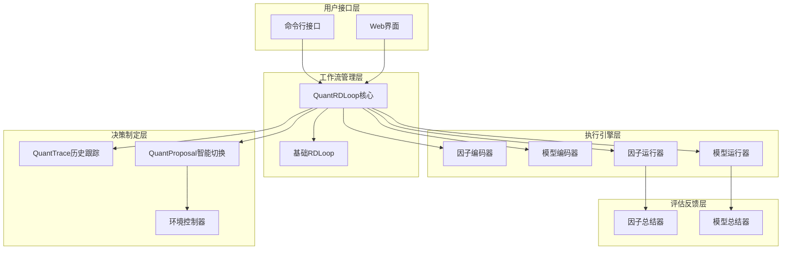

**图表来源**
- [quant.py](file://rdagent/app/qlib_rd_loop/quant.py#L1-L144)
- [rd_loop.py](file://rdagent/components/workflow/rd_loop.py#L1-L93)

## QuantRDLoop核心类分析

`QuantRDLoop`是联合演化系统的核心控制器，继承自基础的`RDLoop`类，专门负责协调因子和模型的迭代优化。

### 类结构与初始化

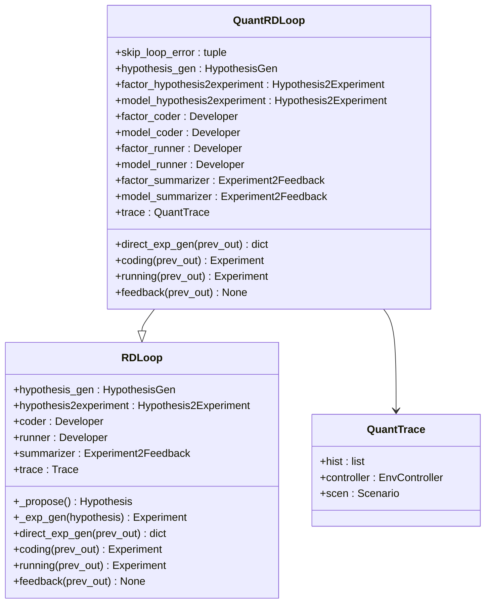

**图表来源**
- [quant.py](file://rdagent/app/qlib_rd_loop/quant.py#L20-L60)
- [rd_loop.py](file://rdagent/components/workflow/rd_loop.py#L25-L50)

### 四阶段演化循环

`QuantRDLoop`实现了经典的四阶段演化循环，每个阶段都有明确的职责分工：

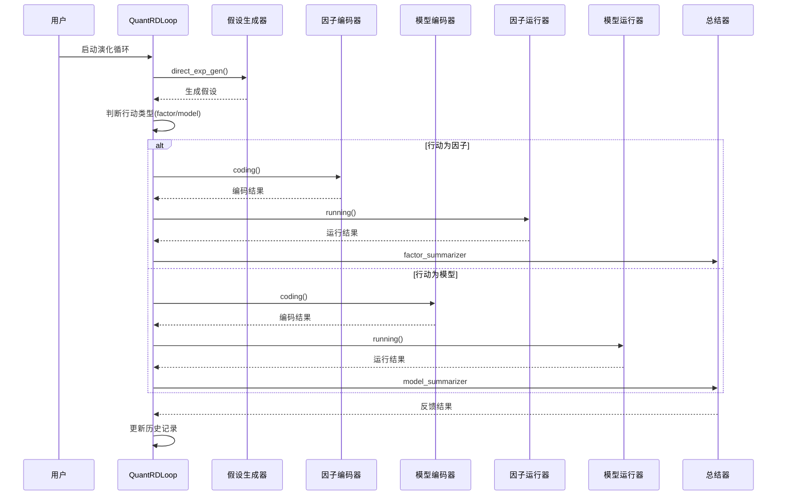

**图表来源**
- [quant.py](file://rdagent/app/qlib_rd_loop/quant.py#L64-L100)
- [rd_loop.py](file://rdagent/components/workflow/rd_loop.py#L50-L93)

**章节来源**
- [quant.py](file://rdagent/app/qlib_rd_loop/quant.py#L20-L144)
- [rd_loop.py](file://rdagent/components/workflow/rd_loop.py#L25-L93)

## QuantTrace历史跟踪机制

`QuantTrace`类是联合演化系统的历史跟踪核心，负责记录每次实验的结果和相应的决策，为后续的智能切换提供数据支持。

### 历史记录结构

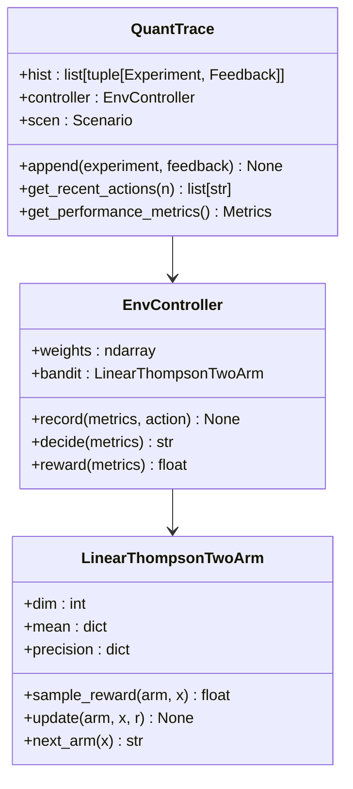

**图表来源**
- [quant_proposal.py](file://rdagent/scenarios/qlib/proposal/quant_proposal.py#L15-L19)
- [bandit.py](file://rdagent/scenarios/qlib/proposal/bandit.py#L89-L109)

### 性能指标提取

系统通过`extract_metrics_from_experiment`函数从实验结果中提取关键性能指标：

| 指标名称 | 描述 | 计算方式 |
|---------|------|----------|
| IC | 信息系数 | 因子收益与目标收益的相关性 |
| ICIR | IC信息比率 | IC除以IC的标准差 |
| Rank IC | 排序信息系数 | 因子收益排名与目标收益排名的相关性 |
| Rank ICIR | 排序IC信息比率 | Rank IC除以Rank IC的标准差 |
| ARR | 年化超额收益 | 1天超额收益的年化值 |
| IR | 信息比率 | 1天超额收益除以波动率 |
| MDD | 最大回撤 | 最大回撤百分比（取负值） |
| Sharpe | 夏普比率 | 年化超额收益除以最大回撤 |

**章节来源**
- [quant_proposal.py](file://rdagent/scenarios/qlib/proposal/quant_proposal.py#L15-L180)
- [bandit.py](file://rdagent/scenarios/qlib/proposal/bandit.py#L25-L46)

## QuantProposal智能切换策略

`QlibQuantHypothesisGen`类实现了智能的行动选择策略，能够在因子开发和模型构建之间进行动态切换。

### 多策略切换机制

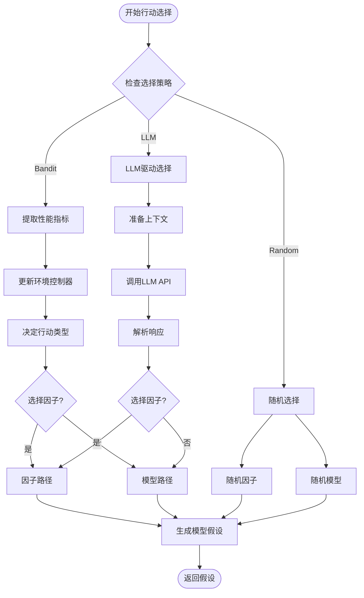

**图表来源**
- [quant_proposal.py](file://rdagent/scenarios/qlib/proposal/quant_proposal.py#L49-L120)

### 带宽策略详解

带宽策略使用线性汤普森采样算法，在因子和模型之间进行最优选择：

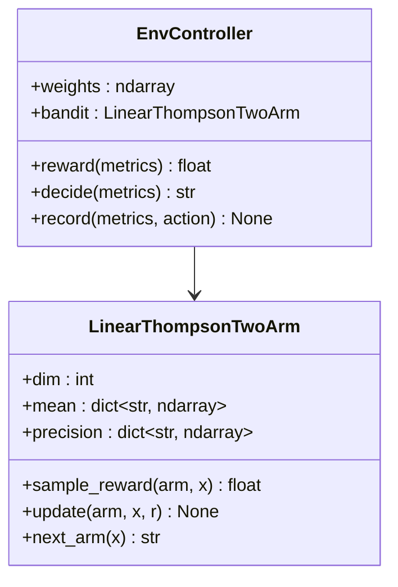

**图表来源**
- [bandit.py](file://rdagent/scenarios/qlib/proposal/bandit.py#L89-L109)

**章节来源**
- [quant_proposal.py](file://rdagent/scenarios/qlib/proposal/quant_proposal.py#L49-L180)
- [bandit.py](file://rdagent/scenarios/qlib/proposal/bandit.py#L89-L110)

## 联合实验结构与评估逻辑

`QlibQuantScenario`类定义了联合实验的完整结构，包含了因子和模型实验的统一框架。

### 实验场景设计

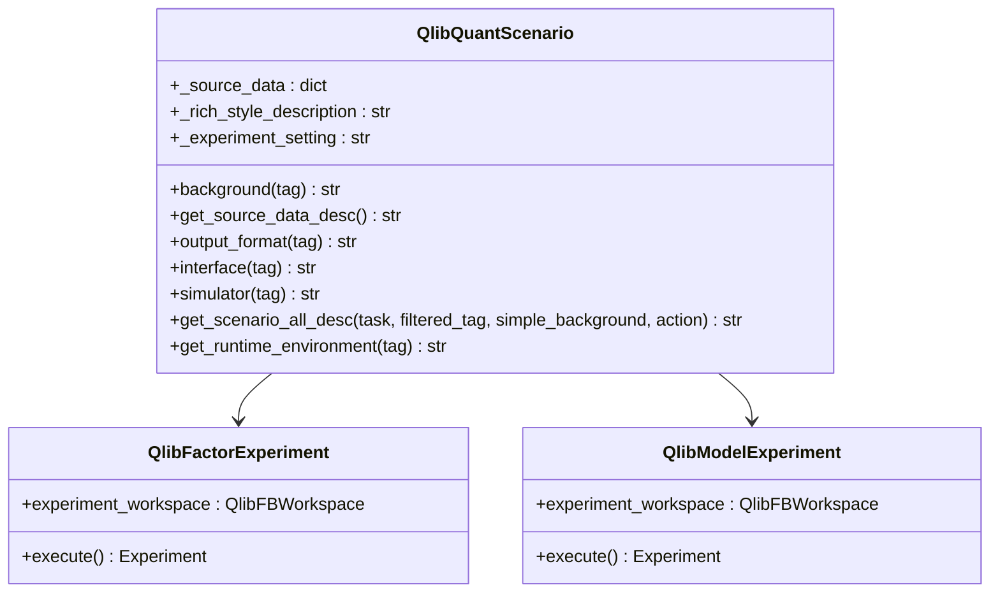

**图表来源**
- [quant_experiment.py](file://rdagent/scenarios/qlib/experiment/quant_experiment.py#L35-L203)

### 数据准备与验证

系统提供了完整的数据准备流程，确保实验环境的一致性和可重复性：

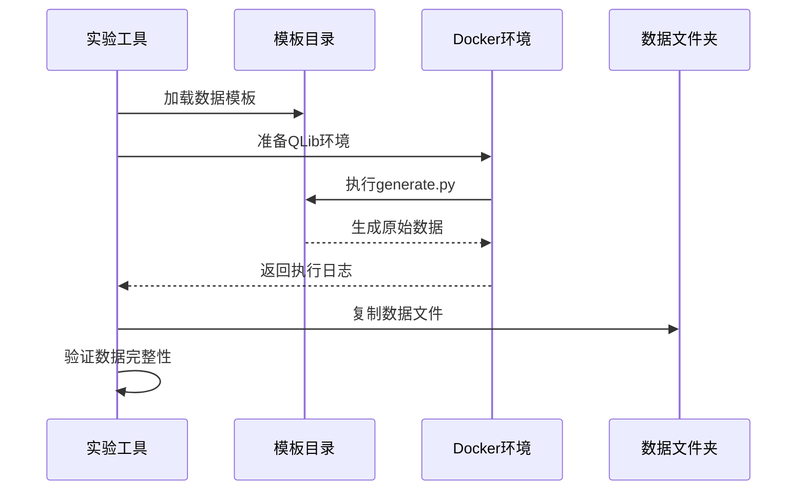

**图表来源**
- [utils.py](file://rdagent/scenarios/qlib/experiment/utils.py#L10-L40)

**章节来源**
- [quant_experiment.py](file://rdagent/scenarios/qlib/experiment/quant_experiment.py#L35-L203)
- [utils.py](file://rdagent/scenarios/qlib/experiment/utils.py#L10-L183)

## 端到端工作流程

### 配置QUANT_PROP_SETTING参数

系统通过`QUANT_PROP_SETTING`配置对象管理所有参数设置：

| 参数类别 | 关键参数 | 默认值 | 描述 |
|---------|----------|--------|------|
| 场景配置 | scen | QlibQuantScenario | 实验场景类 |
| 假设生成 | quant_hypothesis_gen | QlibQuantHypothesisGen | 量化假设生成器 |
| 实验转换 | factor_hypothesis2experiment | QlibFactorHypothesis2Experiment | 因子实验转换器 |
| 实验转换 | model_hypothesis2experiment | QlibModelHypothesis2Experiment | 模型实验转换器 |
| 编码器 | factor_coder | QlibFactorCoSTEER | 因子编码器 |
| 编码器 | model_coder | QlibModelCoSTEER | 模型编码器 |
| 运行器 | factor_runner | QlibFactorRunner | 因子运行器 |
| 运行器 | model_runner | QlibModelRunner | 模型运行器 |
| 总结器 | factor_summarizer | QlibFactorExperiment2Feedback | 因子总结器 |
| 总结器 | model_summarizer | QlibModelExperiment2Feedback | 模型总结器 |
| 演化次数 | evolving_n | 10 | 演化轮次 |
| 动作选择 | action_selection | bandit | 动作选择策略 |

### 启动main函数

系统提供统一的入口点，支持多种启动方式：

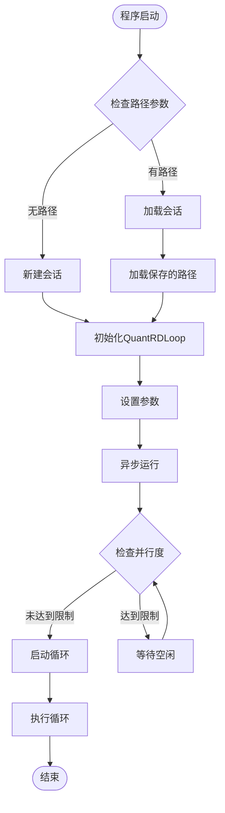

**图表来源**
- [quant.py](file://rdagent/app/qlib_rd_loop/quant.py#L102-L144)
- [cli.py](file://rdagent/app/cli.py#L40-L88)

### 监控演化过程

系统提供了多种监控和可视化工具：

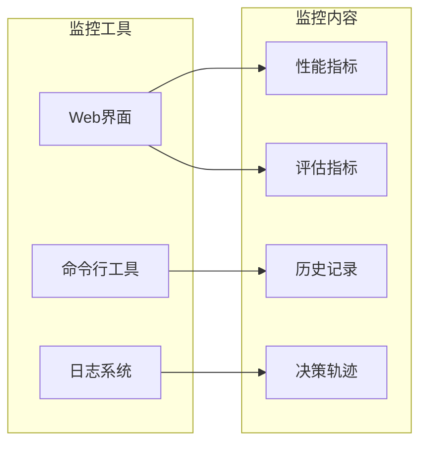

**章节来源**
- [conf.py](file://rdagent/app/qlib_rd_loop/conf.py#L119-L121)
- [quant.py](file://rdagent/app/qlib_rd_loop/quant.py#L102-L144)
- [cli.py](file://rdagent/app/cli.py#L40-L88)

## 控制流与状态机

### 状态机图示

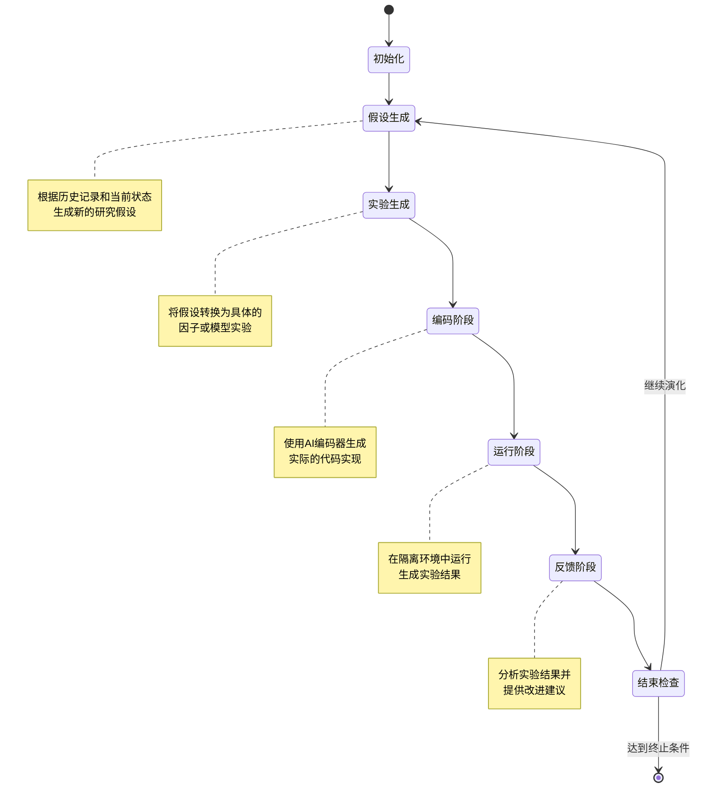

**图表来源**
- [quant.py](file://rdagent/app/qlib_rd_loop/quant.py#L64-L100)
- [rd_loop.py](file://rdagent/components/workflow/rd_loop.py#L50-L93)

### CLI集成与命令行操作

系统通过`fire.Fire(main)`实现了简洁的命令行接口：

```mermaid
flowchart TD
FireMain[fire.Fire(main)] --> ParseArgs[解析命令行参数]
ParseArgs --> PathCheck{检查路径参数}
PathCheck --> |None| NewLoop[创建新循环]
PathCheck --> |存在| LoadLoop[加载现有循环]
NewLoop --> ConfigLoop[配置循环参数]
LoadLoop --> RestoreState[恢复状态]
ConfigLoop --> AsyncRun[异步运行循环]
RestoreState --> AsyncRun
AsyncRun --> MonitorProgress[监控进度]
MonitorProgress --> UpdateState[更新状态]
UpdateState --> CheckComplete{是否完成?}
CheckComplete --> |否| ContinueLoop[继续循环]
CheckComplete --> |是| SaveState[保存状态]
ContinueLoop --> MonitorProgress
SaveState --> End[结束]
```

**图表来源**
- [quant.py](file://rdagent/app/qlib_rd_loop/quant.py#L102-L144)
- [cli.py](file://rdagent/app/cli.py#L40-L88)

**章节来源**
- [quant.py](file://rdagent/app/qlib_rd_loop/quant.py#L102-L144)
- [rd_loop.py](file://rdagent/components/workflow/rd_loop.py#L50-L93)

## 优势与挑战

### 主要优势

1. **智能协作机制**
   - 因子与模型之间的互补性利用
   - 自适应的行动选择策略
   - 基于性能反馈的动态调整

2. **高效探索能力**
   - 多策略动作选择（带宽、LLM、随机）
   - 智能的历史决策跟踪
   - 知识积累与传承机制

3. **可扩展架构**
   - 模块化设计便于扩展
   - 统一的实验框架
   - 支持多种评估指标

4. **自动化程度高**
   - 完整的端到端工作流
   - 自动化测试与验证
   - 智能错误处理与恢复

### 潜在风险

1. **双重过拟合风险**
   - 因子与模型可能相互依赖
   - 验证集污染问题
   - 过度优化特定指标

2. **计算资源消耗**
   - 并行实验的资源需求
   - 长时间演化的时间成本
   - 环境配置的复杂性

3. **策略稳定性**
   - 带宽策略的收敛性
   - LLM选择的不确定性
   - 随机策略的不可预测性

4. **知识管理挑战**
   - 历史数据的有效利用
   - 知识表示的学习难度
   - 长期演化的稳定性

### 非线性交互效应

联合演化系统能够发现传统方法难以捕捉的非线性交互效应：

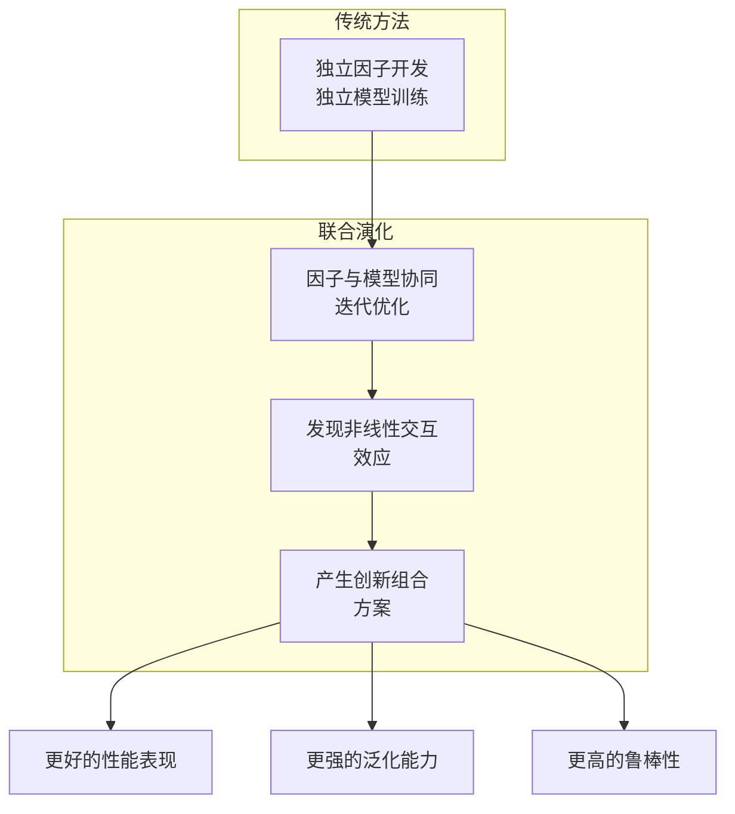

**图表来源**
- [quant_proposal.py](file://rdagent/scenarios/qlib/proposal/quant_proposal.py#L75-L120)

## 总结

RD-Agent的联合演化功能代表了自动化研发领域的重要突破。通过`QuantRDLoop`类的精密设计，系统实现了因子与模型之间的智能协作，利用`QuantTrace`类的全面历史跟踪，以及多种策略的动态切换机制，为量化金融领域的自动研发提供了强大而灵活的解决方案。

该系统的主要贡献包括：

1. **创新的联合演化范式**：首次在量化金融领域实现因子与模型的深度协同
2. **智能决策机制**：基于性能反馈的自适应行动选择策略
3. **完整的自动化流程**：从假设生成到实验验证的全闭环自动化
4. **强大的监控体系**：多维度的性能监控和演化追踪

尽管面临双重过拟合等挑战，该系统通过精心设计的架构和策略，有效平衡了探索与利用的关系，为自动化研发的发展开辟了新的方向。随着技术的不断进步，这种联合演化模式有望在更多领域发挥重要作用，推动人工智能在科学研究和工程应用中的深度融合。