# 量化金融

<cite>
**本文档引用的文件**
- [cli.py](file://rdagent/app/cli.py)
- [factor.py](file://rdagent/app/qlib_rd_loop/factor.py)
- [model.py](file://rdagent/app/qlib_rd_loop/model.py)
- [quant.py](file://rdagent/app/qlib_rd_loop/quant.py)
- [conf.py](file://rdagent/app/qlib_rd_loop/conf.py)
- [factor_proposal.py](file://rdagent/scenarios/qlib/proposal/factor_proposal.py)
- [model_proposal.py](file://rdagent/scenarios/qlib/proposal/model_proposal.py)
- [quant_proposal.py](file://rdagent/scenarios/qlib/proposal/quant_proposal.py)
- [quant_experiment.py](file://rdagent/scenarios/qlib/experiment/quant_experiment.py)
- [factor.py](file://rdagent/components/coder/factor_coder/factor.py)
- [model.py](file://rdagent/components/coder/model_coder/model.py)
- [rd_loop.py](file://rdagent/components/workflow/rd_loop.py)
- [prompts.yaml](file://rdagent/scenarios/qlib/prompts.yaml)
</cite>

## 目录
1. [简介](#简介)
2. [项目架构概览](#项目架构概览)
3. [核心CLI命令详解](#核心cli命令详解)
4. [因子开发系统](#因子开发系统)
5. [模型开发系统](#模型开发系统)
6. [联合演化系统](#联合演化系统)
7. [工作流程分析](#工作流程分析)
8. [配置管理](#配置管理)
9. [端到端工作流示例](#端到端工作流示例)
10. [常见问题与解决方案](#常见问题与解决方案)
11. [总结](#总结)

## 简介

RD-Agent是一个基于Qlib框架的量化金融自动化研发平台，专门用于因子与模型的自动化设计、实现和优化。该系统通过三个核心CLI命令实现了不同层次的自动化研发能力：

- **`fin_factor`**: 专注于因子挖掘与优化
- **`fin_model`**: 专注于模型结构搜索与调优
- **`fin_quant`**: 实现因子与模型的联合演化

系统采用迭代式研发模式，通过假设生成、实验设计、代码实现、运行验证和反馈优化的完整闭环，持续提升量化投资策略的效果。

## 项目架构概览

RD-Agent在量化金融领域的架构设计体现了模块化和可扩展性的原则：

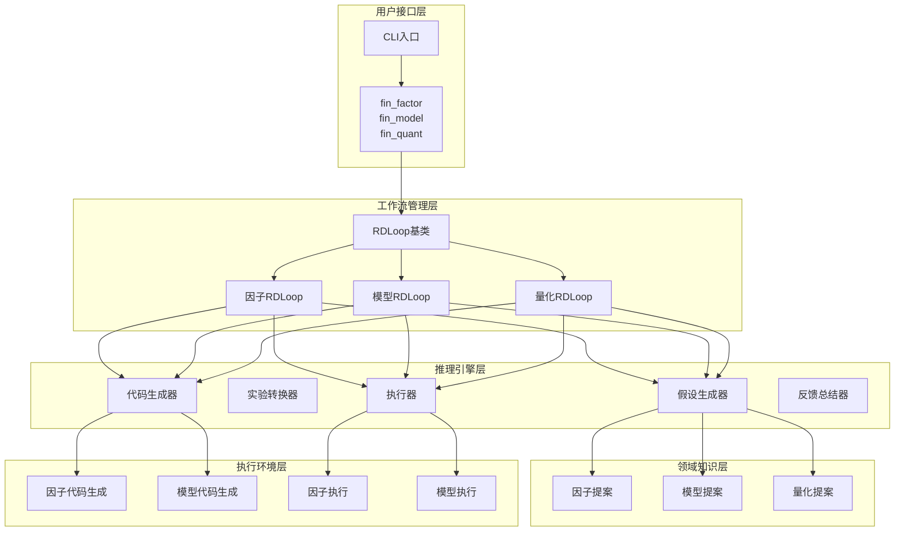

**图表来源**
- [cli.py](file://rdagent/app/cli.py#L33-L86)
- [rd_loop.py](file://rdagent/components/workflow/rd_loop.py#L25-L92)

## 核心CLI命令详解

### fin_factor：因子自动化研发

`fin_factor`命令专注于因子的自动挖掘和优化，是量化投资中最基础也是最重要的组件。

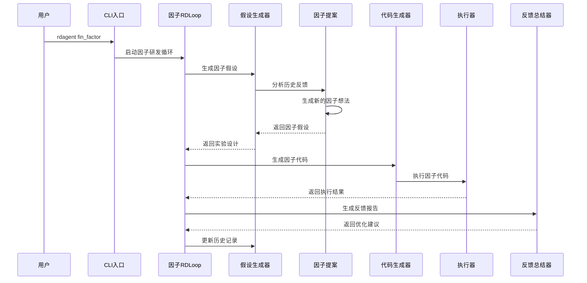

**图表来源**
- [factor.py](file://rdagent/app/qlib_rd_loop/factor.py#L15-L60)
- [rd_loop.py](file://rdagent/components/workflow/rd_loop.py#L45-L92)

**段落来源**
- [factor.py](file://rdagent/app/qlib_rd_loop/factor.py#L1-L61)

### fin_model：模型自动化研发

`fin_model`命令专注于模型结构的自动搜索和参数优化，是量化策略的核心计算引擎。

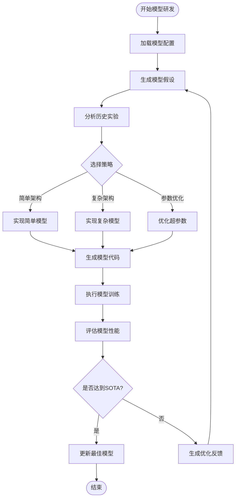

**图表来源**
- [model.py](file://rdagent/app/qlib_rd_loop/model.py#L10-L43)
- [model_proposal.py](file://rdagent/scenarios/qlib/proposal/model_proposal.py#L15-L159)

**段落来源**
- [model.py](file://rdagent/app/qlib_rd_loop/model.py#L1-L44)

### fin_quant：联合演化研发

`fin_quant`命令实现了因子与模型的联合演化，通过智能决策机制在因子和模型之间动态切换，最大化整体投资效果。

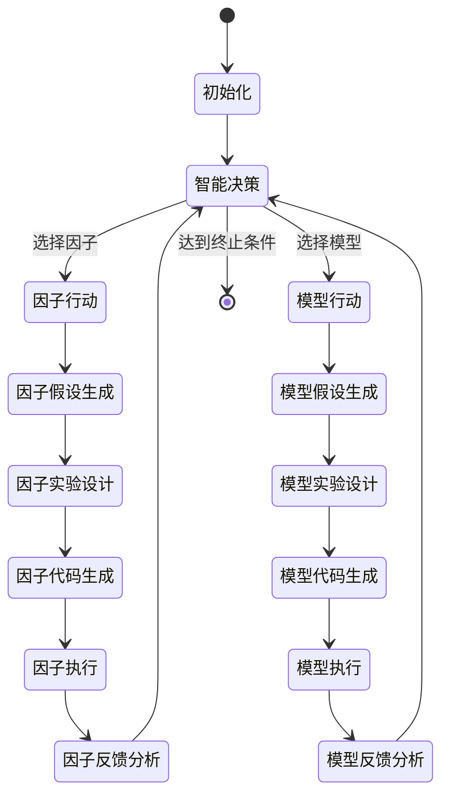

**图表来源**
- [quant.py](file://rdagent/app/qlib_rd_loop/quant.py#L25-L143)
- [quant_proposal.py](file://rdagent/scenarios/qlib/proposal/quant_proposal.py#L40-L179)

**段落来源**
- [quant.py](file://rdagent/app/qlib_rd_loop/quant.py#L1-L144)

## 因子开发系统

### FactorProposal类：因子假设生成

`FactorProposal`系统通过分析历史实验和市场数据，自动生成创新的因子假设。

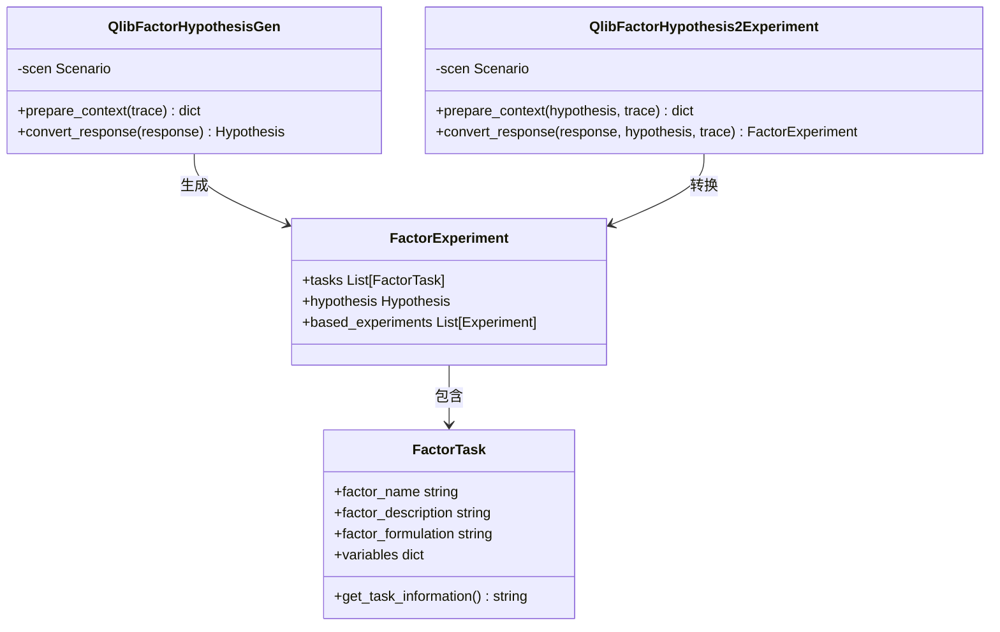

**图表来源**
- [factor_proposal.py](file://rdagent/scenarios/qlib/proposal/factor_proposal.py#L12-L132)
- [factor.py](file://rdagent/components/coder/factor_coder/factor.py#L15-L231)

### 因子代码生成与执行

因子系统的代码生成过程涉及复杂的模板处理和执行环境管理：

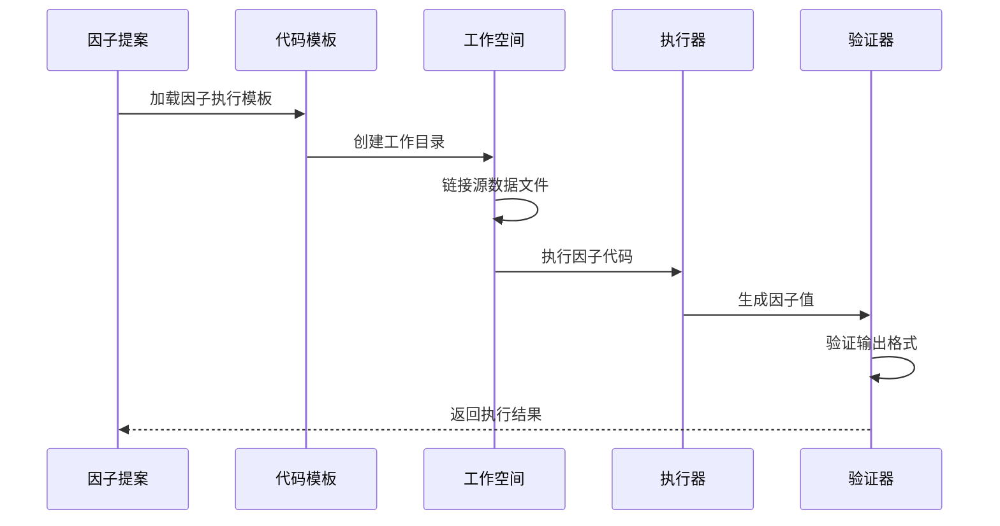

**图表来源**
- [factor.py](file://rdagent/components/coder/factor_coder/factor.py#L80-L231)

**段落来源**
- [factor_proposal.py](file://rdagent/scenarios/qlib/proposal/factor_proposal.py#L1-L133)
- [factor.py](file://rdagent/components/coder/factor_coder/factor.py#L1-L232)

## 模型开发系统

### ModelProposal类：模型假设生成

模型系统采用多层次的假设生成策略，结合历史最佳实践和当前实验结果：

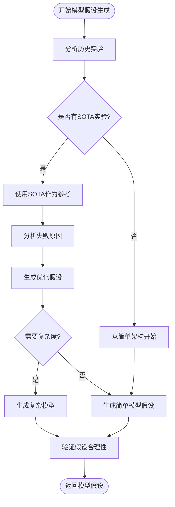

**图表来源**
- [model_proposal.py](file://rdagent/scenarios/qlib/proposal/model_proposal.py#L15-L159)

### 模型代码生成与训练

模型系统的执行环境支持多种部署方式，包括Docker和Conda环境：

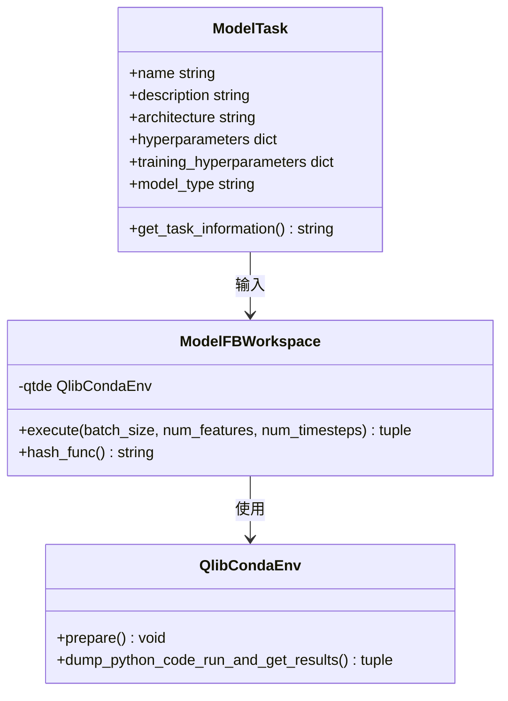

**图表来源**
- [model.py](file://rdagent/components/coder/model_coder/model.py#L15-L163)

**段落来源**
- [model_proposal.py](file://rdagent/scenarios/qlib/proposal/model_proposal.py#L1-L160)
- [model.py](file://rdagent/components/coder/model_coder/model.py#L1-L164)

## 联合演化系统

### QuantRDLoop：联合演化循环

`QuantRDLoop`实现了因子与模型的智能协调机制，通过多策略动作选择实现最优的研发路径：

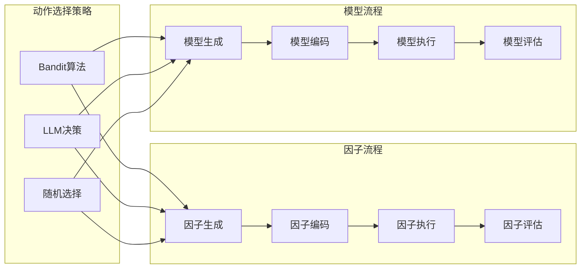

**图表来源**
- [quant.py](file://rdagent/app/qlib_rd_loop/quant.py#L25-L143)
- [quant_proposal.py](file://rdagent/scenarios/qlib/proposal/quant_proposal.py#L40-L179)

### 智能动作选择机制

量化系统支持三种动作选择策略，每种都有其特定的应用场景：

| 策略类型 | 描述 | 适用场景 | 优势 |
|---------|------|----------|------|
| Bandit算法 | 基于历史表现的强化学习选择 | 长期迭代研发 | 自适应学习，逐步优化 |
| LLM决策 | 大语言模型的综合判断 | 复杂场景分析 | 全局视角，逻辑推理能力强 |
| 随机选择 | 均匀随机的动作选择 | 探索初期或测试阶段 | 简单高效，避免偏差 |

**段落来源**
- [quant.py](file://rdagent/app/qlib_rd_loop/quant.py#L1-L144)
- [quant_proposal.py](file://rdagent/scenarios/qlib/proposal/quant_proposal.py#L1-L180)

## 工作流程分析

### RDLoop基类：统一的工作流框架

所有量化研发循环都继承自`RDLoop`基类，提供了标准化的工作流程：

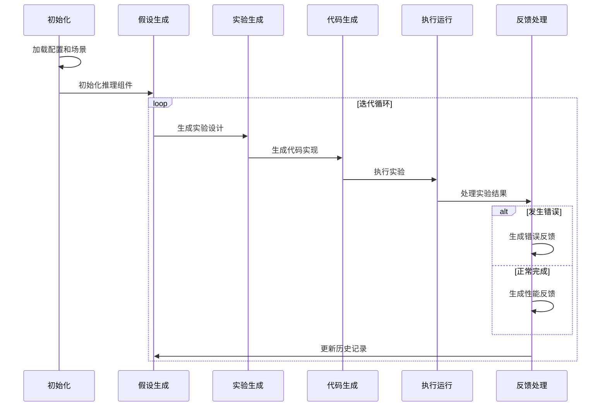

**图表来源**
- [rd_loop.py](file://rdagent/components/workflow/rd_loop.py#L25-L92)

### 异步执行机制

系统采用异步编程模型，支持并行执行多个实验以提高效率：

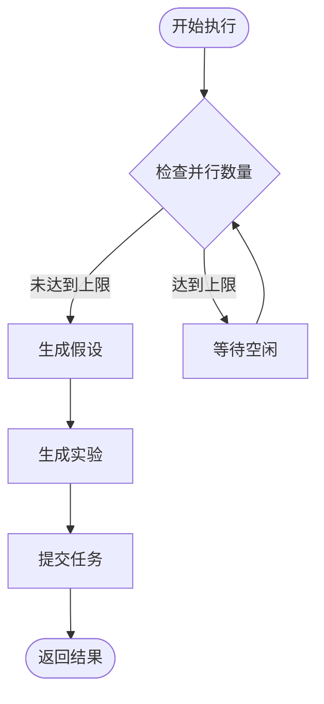

**图表来源**
- [rd_loop.py](file://rdagent/components/workflow/rd_loop.py#L55-L70)

**段落来源**
- [rd_loop.py](file://rdagent/components/workflow/rd_loop.py#L1-L93)

## 配置管理

### 配置文件结构

RD-Agent使用分层配置系统，支持不同场景下的定制化需求：

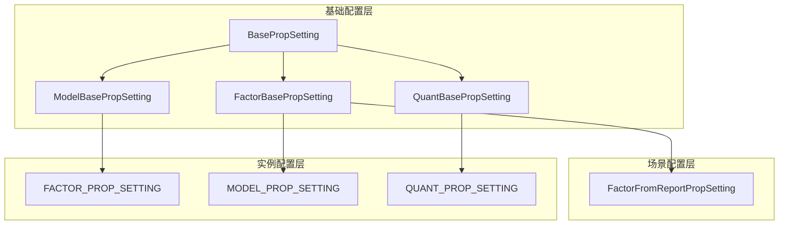

**图表来源**
- [conf.py](file://rdagent/app/qlib_rd_loop/conf.py#L80-L120)

### 关键配置参数

| 配置项 | 功能描述 | 默认值 | 说明 |
|--------|----------|--------|------|
| `scen` | 场景类路径 | 必填 | 定义具体的研究场景 |
| `hypothesis_gen` | 假设生成器类 | 必填 | 控制假设生成逻辑 |
| `coder` | 代码生成器类 | 必填 | 负责代码实现 |
| `runner` | 执行器类 | 必填 | 负责实验运行 |
| `summarizer` | 反馈总结器类 | 必填 | 生成实验反馈 |
| `evolving_n` | 进化次数 | 10 | 最大迭代轮次 |

**段落来源**
- [conf.py](file://rdagent/app/qlib_rd_loop/conf.py#L1-L121)

## 端到端工作流示例

### 启动命令示例

以下是一个完整的量化研发工作流示例：

```bash
# 1. 启动联合演化研发
rdagent fin_quant --loop-n 20 --all-duration "2h"

# 2. 继续之前的会话
rdagent fin_quant /path/to/session/1/0_propose --step-n 5

# 3. 因子专项研发
rdagent fin_factor --loop-n 15 --all-duration "1h30m"

# 4. 模型专项研发  
rdagent fin_model --loop-n 10 --all-duration "1h"
```

### 配置文件设置

创建`.env`配置文件：

```bash
# Qlib量化配置
QLIB_QUANT_ACTION_SELECTION=bandit
QLIB_QUANT_MAX_PARALLEL=4
QLIB_QUANT_EVOLVING_N=15

# 因子研发配置
QLIB_FACTOR_EVOLVING_N=10
QLIB_FACTOR_HYPOTHESIS_SPECIFICATION="1-5 factors per generation, simple first"

# 模型研发配置
QLIB_MODEL_EVOLVING_N=8
QLIB_MODEL_RAG="GRU/LSTM suitable for time series, control model size"
```

### 知识库更新流程

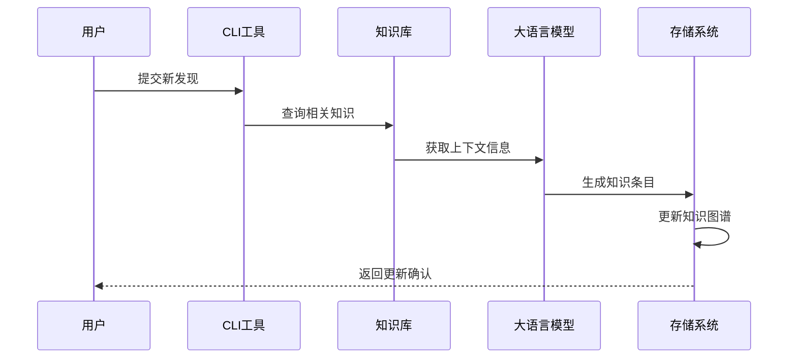

### Docker执行环境

系统支持容器化执行，确保环境一致性：

```yaml
# docker-compose.yml
version: '3.8'
services:
  rdagent:
    image: rdagent:latest
    volumes:
      - ./data:/app/data
      - ./logs:/app/logs
    environment:
      - PYTHONPATH=/app
      - QLIB_CONFIG=/app/config/qlib.yaml
    command: ["python", "-m", "rdagent.app.cli", "fin_quant"]
```

## 常见问题与解决方案

### 因子过拟合问题

因子过拟合是量化金融中的常见挑战，系统提供了多层次的防护机制：

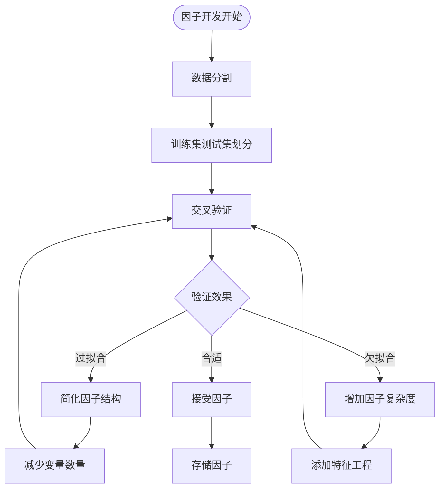

**解决方案策略**：

1. **时间序列验证**：使用滚动窗口验证防止时序过拟合
2. **样本外测试**：预留独立的测试集进行最终验证
3. **统计显著性检验**：确保因子收益的统计显著性
4. **多重检验校正**：对大量因子进行Bonferroni校正

### 计算资源优化

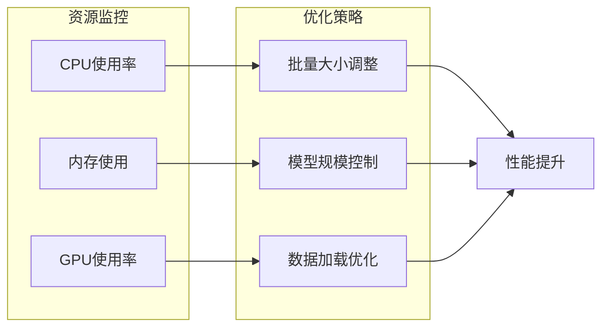

### 并发执行管理

系统通过智能的任务调度避免资源竞争：

| 参数 | 默认值 | 说明 | 调优建议 |
|------|--------|------|----------|
| `max_parallel` | 4 | 最大并发任务数 | 根据硬件配置调整 |
| `timeout` | 3600s | 单个任务超时时间 | 复杂模型可适当延长 |
| `retry_count` | 3 | 失败重试次数 | 网络不稳定时增加 |

**段落来源**
- [prompts.yaml](file://rdagent/scenarios/qlib/prompts.yaml#L1-L199)

## 总结

RD-Agent在量化金融领域的应用展现了人工智能驱动的自动化研发的强大潜力。通过`fin_factor`、`fin_model`和`fin_quant`三个CLI命令，系统实现了从单一维度到跨维度的完整研发覆盖：

1. **专业化分工**：每个命令专注于特定的研发领域，确保深度优化
2. **智能协同**：联合演化系统能够动态平衡因子和模型的发展
3. **标准化流程**：统一的工作流框架保证了研发的一致性和可重复性
4. **灵活配置**：分层配置系统支持多样化的应用场景
5. **质量保障**：多层次的质量控制确保研发成果的有效性

该系统不仅提高了量化金融研发的效率，更重要的是建立了一个可持续的知识积累和迭代优化机制，为量化投资策略的创新发展提供了强有力的技术支撑。随着AI技术的不断发展，这种自动化研发模式将在量化金融领域发挥越来越重要的作用。