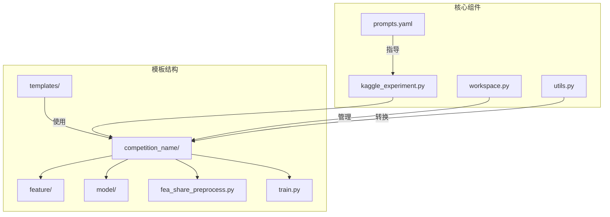
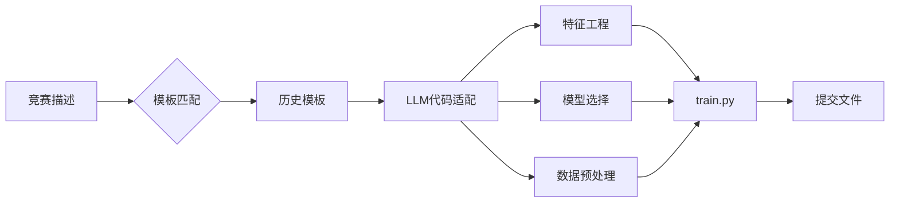
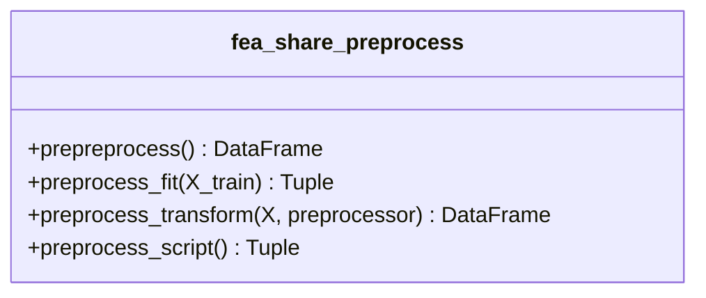
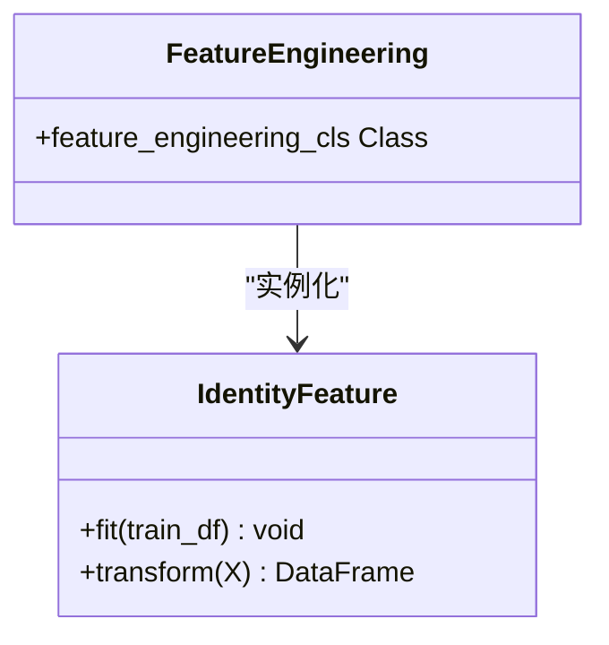
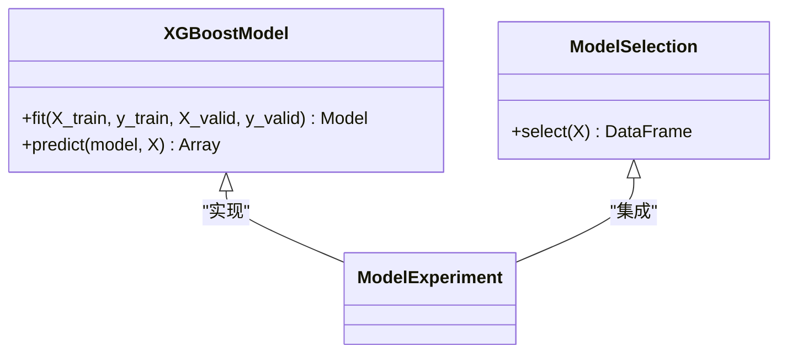
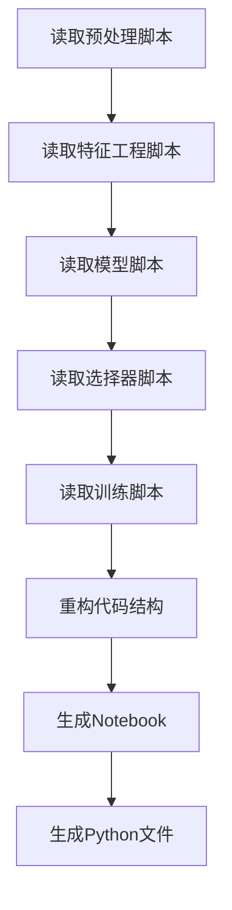
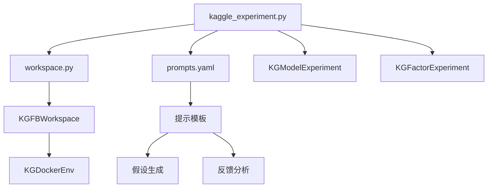

# Kaggle竞赛助手

<cite>
**本文档中引用的文件**  
- [kaggle_experiment.py](file://rdagent/scenarios/kaggle/experiment/kaggle_experiment.py)
- [workspace.py](file://rdagent/scenarios/kaggle/experiment/workspace.py)
- [utils.py](file://rdagent/scenarios/kaggle/experiment/utils.py)
- [prompts.yaml](file://rdagent/scenarios/kaggle/prompts.yaml)
- [fea_share_preprocess.py](file://rdagent/scenarios/kaggle/experiment/templates/playground-series-s4e9/fea_share_preprocess.py)
- [train.py](file://rdagent/scenarios/kaggle/experiment/templates/playground-series-s4e9/train.py)
- [feature.py](file://rdagent/scenarios/kaggle/experiment/templates/playground-series-s4e9/feature/feature.py)
- [model_xgboost.py](file://rdagent/scenarios/kaggle/experiment/templates/playground-series-s4e9/model/model_xgboost.py)
- [tpl_ex/aerial-cactus-identification](file://rdagent/scenarios/kaggle/tpl_ex/aerial-cactus-identification)
</cite>

## 目录
1. [简介](#简介)
2. [项目结构](#项目结构)
3. [核心组件](#核心组件)
4. [架构概述](#架构概述)
5. [详细组件分析](#详细组件分析)
6. [依赖分析](#依赖分析)
7. [性能考虑](#性能考虑)
8. [故障排除指南](#故障排除指南)
9. [结论](#结论)

## 简介
本文档详细说明了Kaggle竞赛助手如何利用历史解决方案模板实现快速启动。系统通过分析`tpl_ex`目录中的竞赛模板（如playground-series-s4e9），提取数据预处理、特征工程和模型选择的标准化实现。`kaggle_experiment.py`模块根据新竞赛任务匹配最相似的历史模板，并通过LLM进行代码适配与优化。结合`prompts.yaml`中的提示工程策略，系统能够引导模型生成符合Kaggle评分机制的提交代码。文档提供了从竞赛描述解析到最终提交文件生成的全流程示例，并讨论了模板复用的局限性及应对策略。

## 项目结构
Kaggle竞赛助手的项目结构设计旨在实现知识的可转移性和模块化复用。核心模板位于`rdagent/scenarios/kaggle/experiment/templates`目录下，每个竞赛都有独立的子目录，包含标准化的组件结构。

**图源**
- [kaggle_experiment.py](file://rdagent/scenarios/kaggle/experiment/kaggle_experiment.py)
- [workspace.py](file://rdagent/scenarios/kaggle/experiment/workspace.py)

**本节来源**
- [kaggle_experiment.py](file://rdagent/scenarios/kaggle/experiment/kaggle_experiment.py)
- [workspace.py](file://rdagent/scenarios/kaggle/experiment/workspace.py)

## 核心组件
系统的核心组件包括模板匹配引擎、工作区管理器和代码生成器。`KGModelExperiment`和`KGFactorExperiment`类继承自通用实验框架，通过模板路径初始化工作区，实现了竞赛特定的实验配置。`KGFBWorkspace`类负责管理文件注入、数据预处理和代码执行，确保实验环境的一致性。

**本节来源**
- [kaggle_experiment.py](file://rdagent/scenarios/kaggle/experiment/kaggle_experiment.py#L1-L82)
- [workspace.py](file://rdagent/scenarios/kaggle/experiment/workspace.py#L1-L97)

## 架构概述
系统采用模块化架构，将数据科学竞赛的解决方案分解为可复用的组件。通过模板继承机制，新竞赛可以快速获得经过验证的基线实现。LLM在提示工程的指导下，对模板代码进行智能适配，生成针对特定问题的优化方案。

**图源**
- [kaggle_experiment.py](file://rdagent/scenarios/kaggle/experiment/kaggle_experiment.py)
- [utils.py](file://rdagent/scenarios/kaggle/experiment/utils.py)

## 详细组件分析

### 模板结构分析
`tpl_ex`目录中的竞赛模板遵循标准化结构，确保知识的可转移性。以`playground-series-s4e9`为例，模板包含数据预处理、特征工程、模型实现和训练流程四个核心组件。

#### 数据预处理组件

**图源**
- [fea_share_preprocess.py](file://rdagent/scenarios/kaggle/experiment/templates/playground-series-s4e9/fea_share_preprocess.py#L1-L80)

#### 特征工程组件

**图源**
- [feature.py](file://rdagent/scenarios/kaggle/experiment/templates/playground-series-s4e9/feature/feature.py#L1-L23)

#### 模型组件

**图源**
- [model_xgboost.py](file://rdagent/scenarios/kaggle/experiment/templates/playground-series-s4e9/model/model_xgboost.py#L1-L31)

### 代码生成流程
系统通过`python_files_to_notebook`函数将分散的Python文件合并为Jupyter笔记本，实现代码的集成和可读性提升。

**图源**
- [utils.py](file://rdagent/scenarios/kaggle/experiment/utils.py#L1-L95)

**本节来源**
- [fea_share_preprocess.py](file://rdagent/scenarios/kaggle/experiment/templates/playground-series-s4e9/fea_share_preprocess.py)
- [feature.py](file://rdagent/scenarios/kaggle/experiment/templates/playground-series-s4e9/feature/feature.py)
- [model_xgboost.py](file://rdagent/scenarios/kaggle/experiment/templates/playground-series-s4e9/model/model_xgboost.py)
- [utils.py](file://rdagent/scenarios/kaggle/experiment/utils.py)

## 依赖分析
系统依赖关系清晰，核心模块之间通过接口进行通信。模板匹配基于竞赛名称配置，代码生成依赖于LLM的提示工程策略。

**图源**
- [kaggle_experiment.py](file://rdagent/scenarios/kaggle/experiment/kaggle_experiment.py)
- [workspace.py](file://rdagent/scenarios/kaggle/experiment/workspace.py)
- [prompts.yaml](file://rdagent/scenarios/kaggle/prompts.yaml)

**本节来源**
- [kaggle_experiment.py](file://rdagent/scenarios/kaggle/experiment/kaggle_experiment.py)
- [workspace.py](file://rdagent/scenarios/kaggle/experiment/workspace.py)
- [prompts.yaml](file://rdagent/scenarios/kaggle/prompts.yaml)

## 性能考虑
系统在设计时考虑了多个性能优化点。通过Docker环境隔离确保实验可重复性，使用pickle缓存预处理数据避免重复计算，以及并行执行多个模型的训练和评估。

## 故障排除指南
常见问题包括模板路径错误、Docker环境配置问题和LLM响应格式不符合预期。建议检查竞赛名称配置、确保Docker服务正常运行，并验证提示模板的JSON格式正确性。

**本节来源**
- [workspace.py](file://rdagent/scenarios/kaggle/experiment/workspace.py#L1-L97)
- [kaggle_experiment.py](file://rdagent/scenarios/kaggle/experiment/kaggle_experiment.py#L1-L82)

## 结论
Kaggle竞赛助手通过标准化模板和LLM驱动的代码适配，实现了竞赛解决方案的快速启动。系统架构支持知识的持续积累和复用，通过模块化设计确保了灵活性和可扩展性。未来可进一步优化模板匹配算法，提高LLM代码生成的准确性和效率。