# 应用场景

<cite>
**本文档中引用的文件**
- [README.md](file://README.md)
- [rdagent/app/data_science/loop.py](file://rdagent/app/data_science/loop.py)
- [rdagent/app/kaggle/loop.py](file://rdagent/app/kaggle/loop.py)
- [rdagent/app/qlib_rd_loop/quant.py](file://rdagent/app/qlib_rd_loop/quant.py)
- [rdagent/app/general_model/general_model.py](file://rdagent/app/general_model/general_model.py)
- [rdagent/scenarios/data_science/loop.py](file://rdagent/scenarios/data_science/loop.py)
- [rdagent/scenarios/kaggle/experiment/kaggle_experiment.py](file://rdagent/scenarios/kaggle/experiment/kaggle_experiment.py)
- [rdagent/scenarios/qlib/experiment/quant_experiment.py](file://rdagent/scenarios/qlib/experiment/quant_experiment.py)
- [rdagent/scenarios/general_model/scenario.py](file://rdagent/scenarios/general_model/scenario.py)
- [rdagent/app/data_science/conf.py](file://rdagent/app/data_science/conf.py)
- [rdagent/app/kaggle/conf.py](file://rdagent/app/kaggle/conf.py)
- [rdagent/app/qlib_rd_loop/conf.py](file://rdagent/app/qlib_rd_loop/conf.py)
- [rdagent/scenarios/kaggle/experiment/templates/spaceship-titanic/train.py](file://rdagent/scenarios/kaggle/experiment/templates/spaceship-titanic/train.py)
- [rdagent/scenarios/kaggle/experiment/templates/spaceship-titanic/feature/feature.py](file://rdagent/scenarios/kaggle/experiment/templates/spaceship-titanic/feature/feature.py)
- [rdagent/scenarios/kaggle/experiment/templates/spaceship-titanic/model/model_xgboost.py](file://rdagent/scenarios/kaggle/experiment/templates/spaceship-titanic/model/model_xgboost.py)
</cite>

## 目录
1. [概述](#概述)
2. [数据科学自动化场景](#数据科学自动化场景)
3. [量化金融解决方案](#量化金融解决方案)
4. [Kaggle竞赛助手](#kaggle竞赛助手)
5. [通用模型实现](#通用模型实现)
6. [场景对比分析](#场景对比分析)
7. [使用指南](#使用指南)
8. [总结](#总结)

## 概述

RD-Agent是一个面向工业级研发过程自动化的多场景智能代理框架，通过"研究(R)"和"开发(D)"两个核心组件的协同工作，实现了从想法提出到代码实现的完整自动化流程。该框架支持多个专业领域的应用场景，包括数据科学自动化、量化金融、Kaggle竞赛以及通用模型实现等。

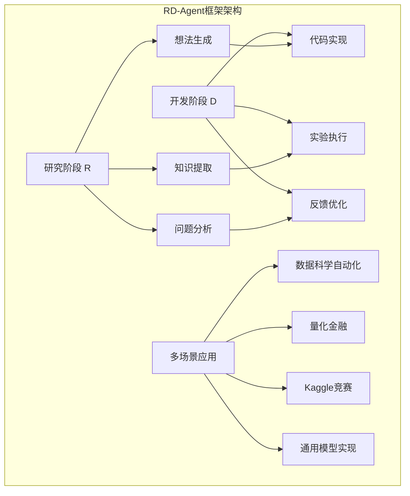

**图表来源**
- [README.md](file://README.md#L1-L50)

## 数据科学自动化场景

### 场景概述

数据科学自动化场景是RD-Agent的核心应用场景之一，专注于自动化特征工程、模型构建与集成学习的全流程管理。该场景通过CoSTEER（Collaborative Evolving Strategy for Automatic Data-Centric Development）框架实现智能化的数据科学工作流。

### 核心组件架构

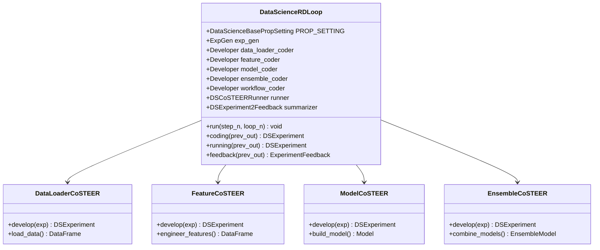

**图表来源**
- [rdagent/scenarios/data_science/loop.py](file://rdagent/scenarios/data_science/loop.py#L80-L150)
- [rdagent/app/data_science/loop.py](file://rdagent/app/data_science/loop.py#L1-L80)

### 实现流程详解

#### 1. 特征工程自动化

特征工程是数据科学中的关键环节，RD-Agent通过以下步骤实现自动化：

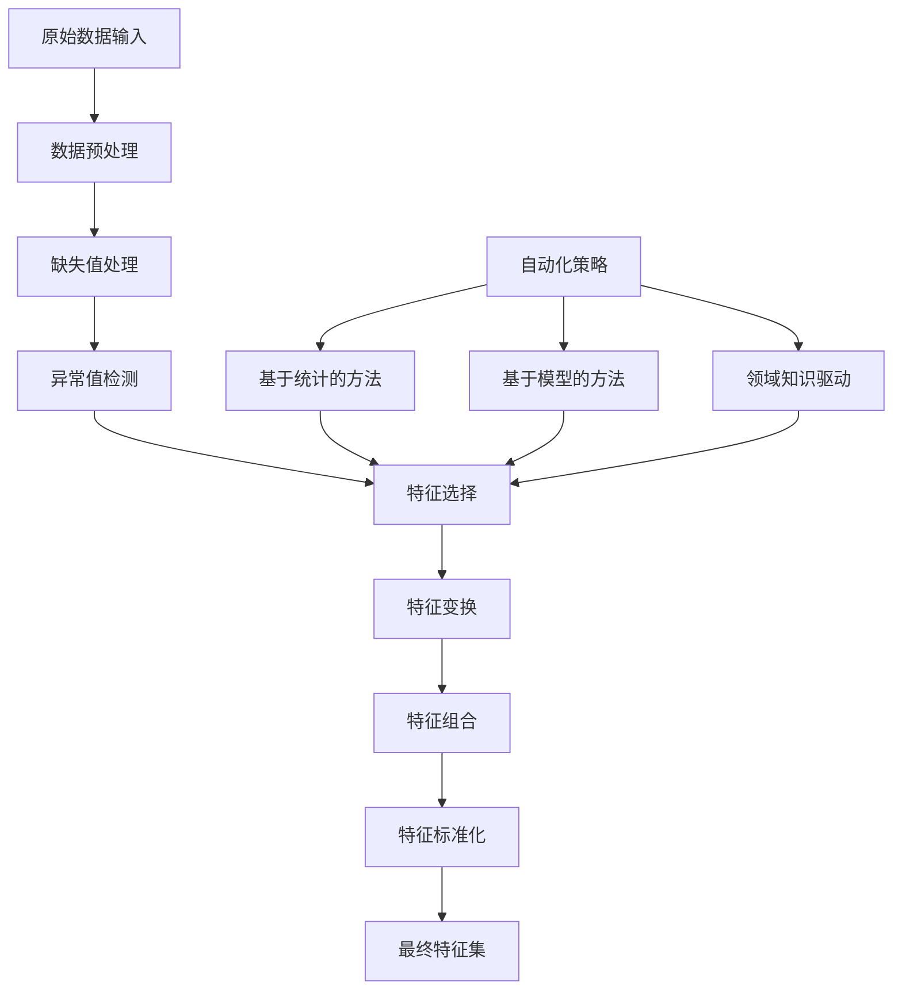

**图表来源**
- [rdagent/scenarios/data_science/loop.py](file://rdagent/scenarios/data_science/loop.py#L180-L220)

#### 2. 模型构建与集成学习

模型构建采用多层次的自动化策略：

```mermaid
sequenceDiagram
participant User as 用户
participant Loop as DataScienceRDLoop
participant ModelCoder as ModelCoSTEER
participant Runner as DSCoSTEERRunner
participant Summarizer as DSExperiment2Feedback
User->>Loop : 启动数据科学循环
Loop->>Loop : 生成实验提案
Loop->>ModelCoder : 开发模型任务
ModelCoder->>ModelCoder : 构建模型代码
ModelCoder-->>Loop : 返回模型实验
Loop->>Runner : 执行模型实验
Runner->>Runner : 训练和评估模型
Runner-->>Loop : 返回实验结果
Loop->>Summarizer : 生成反馈
Summarizer-->>Loop : 反馈建议
Loop->>Loop : 更新知识库
```

**图表来源**
- [rdagent/scenarios/data_science/loop.py](file://rdagent/scenarios/data_science/loop.py#L200-L280)

### 典型输入输出示例

#### 输入示例
- **数据集格式**: CSV、Parquet、JSON等结构化数据
- **目标变量**: 分类标签、回归值、时间序列等
- **业务背景**: 客户流失预测、销售预测、风险评估等

#### 输出示例
- **特征工程报告**: 包含特征重要性、相关性分析、特征分布等
- **模型性能指标**: 准确率、召回率、F1分数、AUC等
- **可执行代码**: 完整的训练脚本和推理代码

**章节来源**
- [rdagent/scenarios/data_science/loop.py](file://rdagent/scenarios/data_science/loop.py#L1-L384)
- [rdagent/app/data_science/conf.py](file://rdagent/app/data_science/conf.py#L1-L207)

## 量化金融解决方案

### 场景概述

量化金融解决方案是RD-Agent在金融领域的深度应用，专注于因子挖掘、模型训练与回测的联合优化机制。该场景基于Qlib框架，实现了因子和模型的交替优化策略。

### 核心架构设计

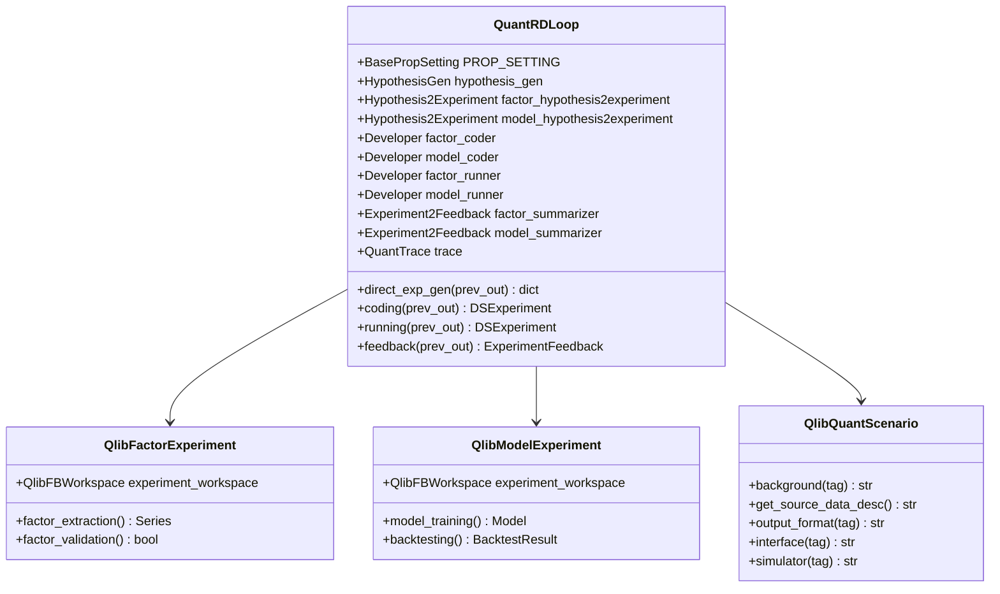

**图表来源**
- [rdagent/app/qlib_rd_loop/quant.py](file://rdagent/app/qlib_rd_loop/quant.py#L20-L80)
- [rdagent/scenarios/qlib/experiment/quant_experiment.py](file://rdagent/scenarios/qlib/experiment/quant_experiment.py#L1-L50)

### 因子挖掘与模型训练联合优化

#### 交替优化机制

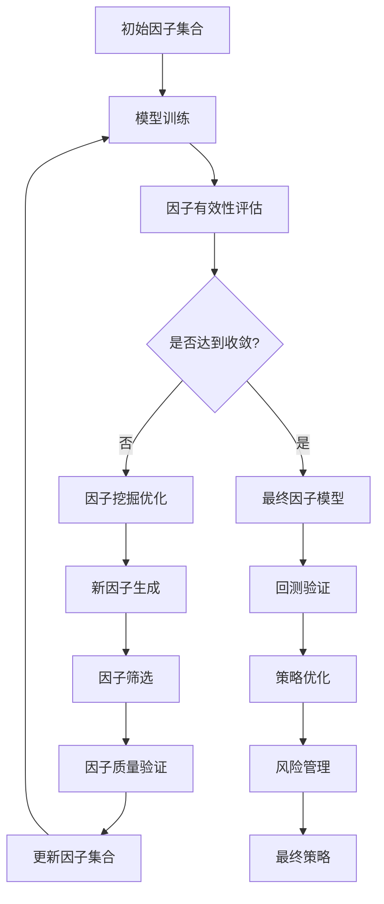

**图表来源**
- [rdagent/app/qlib_rd_loop/quant.py](file://rdagent/app/qlib_rd_loop/quant.py#L80-L140)

### 联合优化机制详解

#### 1. 因子挖掘策略

因子挖掘采用多层次的自动化策略：
- **统计学方法**: 基于相关性、IC值、信息比率等指标
- **机器学习方法**: 使用树模型、神经网络等进行特征重要性排序
- **领域知识**: 结合金融理论和市场经验

#### 2. 模型训练优化

模型训练采用自适应优化策略：
- **超参数调优**: 基于贝叶斯优化的自动化调参
- **集成学习**: 集成多种模型提升稳定性
- **在线学习**: 支持增量学习和模型更新

#### 3. 回测验证体系

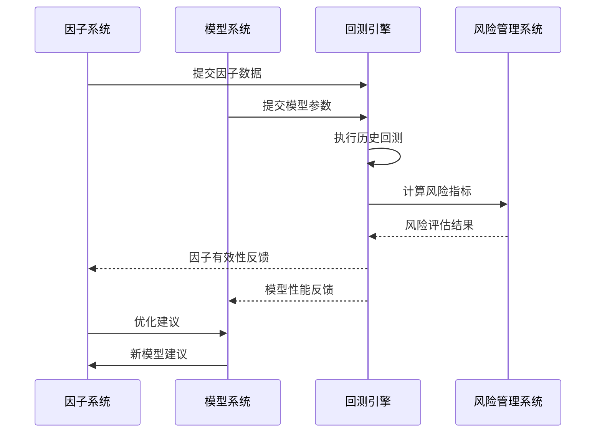

**图表来源**
- [rdagent/scenarios/qlib/experiment/quant_experiment.py](file://rdagent/scenarios/qlib/experiment/quant_experiment.py#L50-L150)

**章节来源**
- [rdagent/app/qlib_rd_loop/quant.py](file://rdagent/app/qlib_rd_loop/quant.py#L1-L144)
- [rdagent/scenarios/qlib/experiment/quant_experiment.py](file://rdagent/scenarios/qlib/experiment/quant_experiment.py#L1-L203)

## Kaggle竞赛助手

### 场景概述

Kaggle竞赛助手是RD-Agent专门为机器学习竞赛设计的智能辅助系统，能够复用历史解决方案模板并生成定制化代码，显著提升竞赛表现。

### 核心工作机制

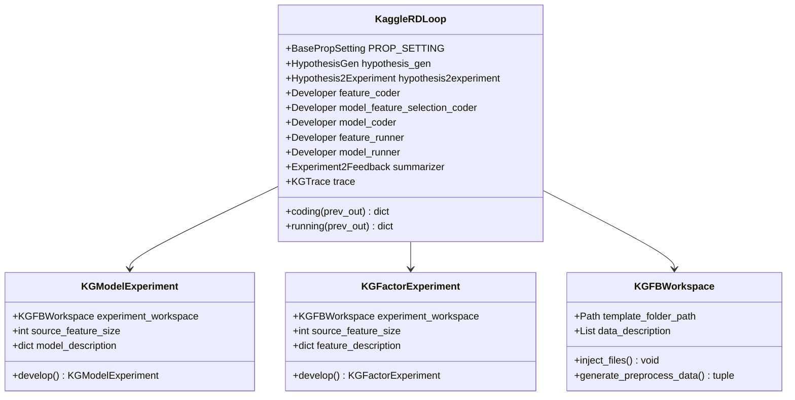

**图表来源**
- [rdagent/app/kaggle/loop.py](file://rdagent/app/kaggle/loop.py#L20-L80)
- [rdagent/scenarios/kaggle/experiment/kaggle_experiment.py](file://rdagent/scenarios/kaggle/experiment/kaggle_experiment.py#L1-L50)

### 解决方案模板复用机制

#### 1. 模板分类体系

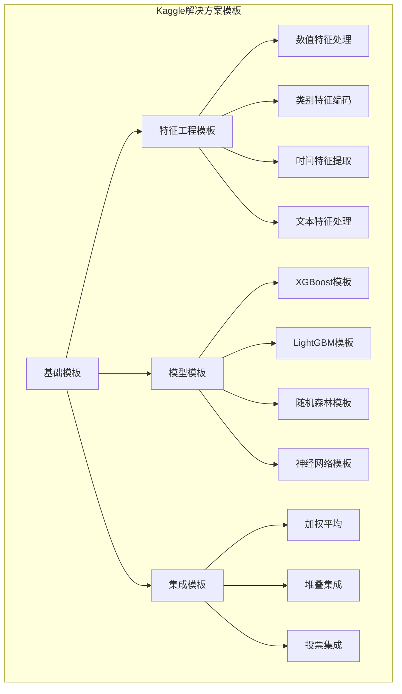

**图表来源**
- [rdagent/scenarios/kaggle/experiment/kaggle_experiment.py](file://rdagent/scenarios/kaggle/experiment/kaggle_experiment.py#L15-L35)

#### 2. 定制化代码生成

定制化代码生成遵循以下流程：

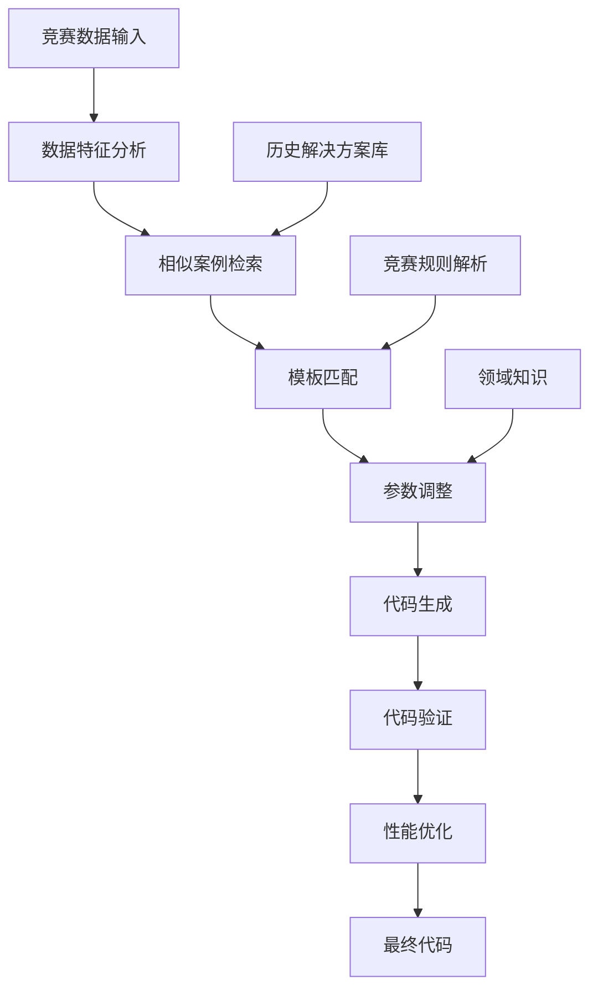

**图表来源**
- [rdagent/app/kaggle/loop.py](file://rdagent/app/kaggle/loop.py#L80-L140)

### 典型竞赛场景应用

#### 1. 特征工程场景

以Spaceship Titanic竞赛为例，展示完整的特征工程流程：

**输入数据结构**：
- 客户基本信息：年龄、性别、舱位等级等
- 社会经济因素：船票价格、家庭成员数量等
- 生存环境：登船港口、船舱位置等

**特征工程策略**：
- **缺失值处理**: 基于统计分布填充、分组填充
- **特征组合**: 创建家庭规模、社会地位等复合特征
- **特征转换**: 对数变换、标准化、归一化
- **特征选择**: 基于SHAP值、卡方检验等方法筛选

#### 2. 模型选择与集成

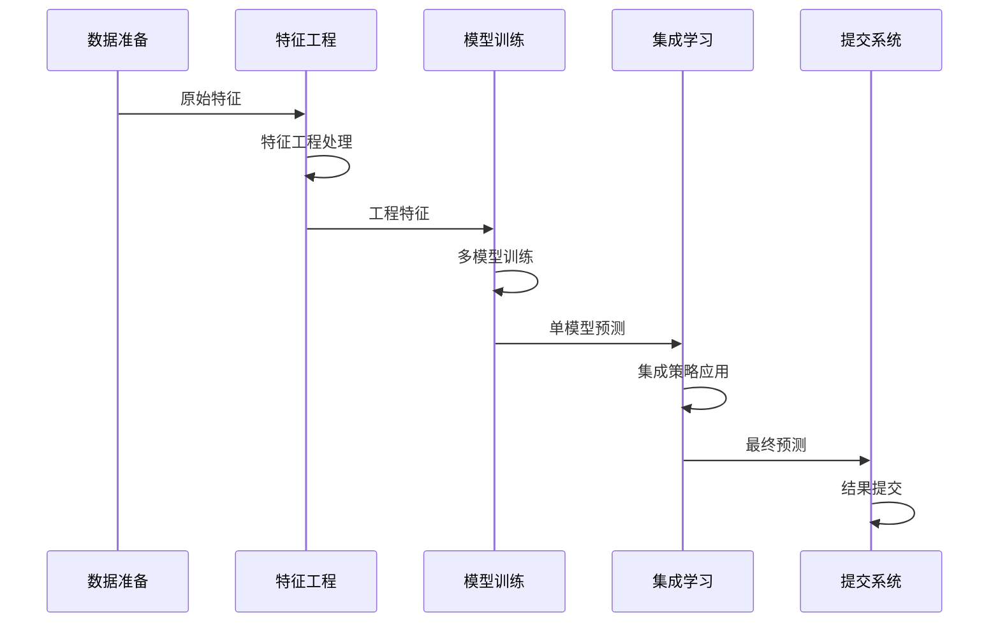

**图表来源**
- [rdagent/scenarios/kaggle/experiment/templates/spaceship-titanic/train.py](file://rdagent/scenarios/kaggle/experiment/templates/spaceship-titanic/train.py#L1-L142)

**章节来源**
- [rdagent/app/kaggle/loop.py](file://rdagent/app/kaggle/loop.py#L1-L140)
- [rdagent/scenarios/kaggle/experiment/kaggle_experiment.py](file://rdagent/scenarios/kaggle/experiment/kaggle_experiment.py#L1-L83)

## 通用模型实现

### 场景概述

通用模型实现场景为RD-Agent提供了灵活的模型开发能力，支持从研究论文、技术报告中自动提取模型结构并实现为可执行代码。该场景特别适用于学术研究和技术创新场景。

### 核心实现机制

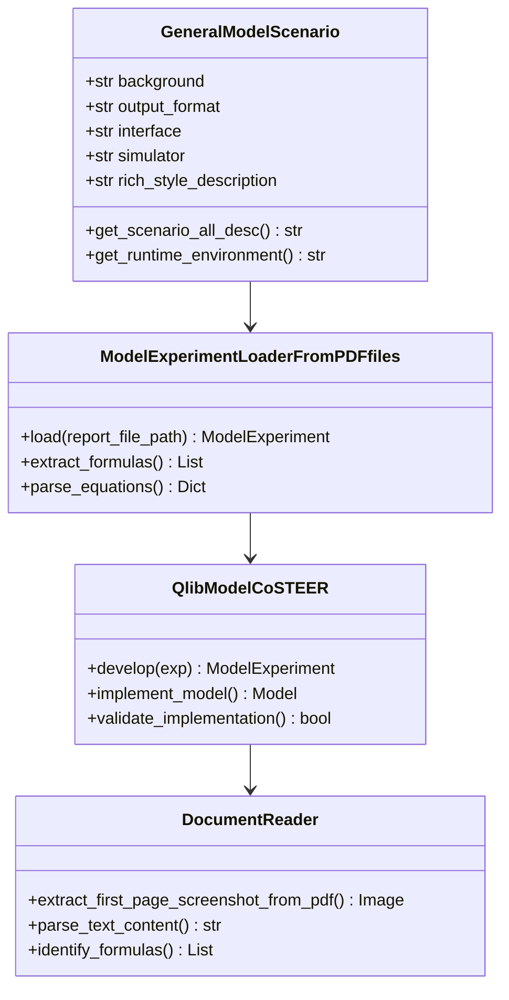

**图表来源**
- [rdagent/scenarios/general_model/scenario.py](file://rdagent/scenarios/general_model/scenario.py#L1-L56)
- [rdagent/app/general_model/general_model.py](file://rdagent/app/general_model/general_model.py#L1-L46)

### 灵活性与适用边界

#### 1. 灵活性特点

- **多源材料支持**: 支持PDF论文、技术报告、学术文章等多种格式
- **公式识别能力**: 自动识别数学公式、算法描述、模型结构
- **代码生成适配**: 根据不同框架（TensorFlow、PyTorch、Scikit-learn）生成相应代码
- **参数自动映射**: 将论文中的超参数映射到实际实现

#### 2. 适用边界分析

| 适用场景 | 优势 | 局限性 | 建议 |
|---------|------|------|------|
| 学术研究模型 | 快速原型实现 | 数学复杂度限制 | 适合中等复杂度模型 |
| 经典算法复现 | 教学和研究 | 创新性不足 | 作为起点进行改进 |
| 工业模型简化 | 快速验证 | 性能可能下降 | 用于概念验证 |
| 新模型探索 | 快速迭代 | 需要人工验证 | 作为初步实现 |

#### 3. 实现流程详解

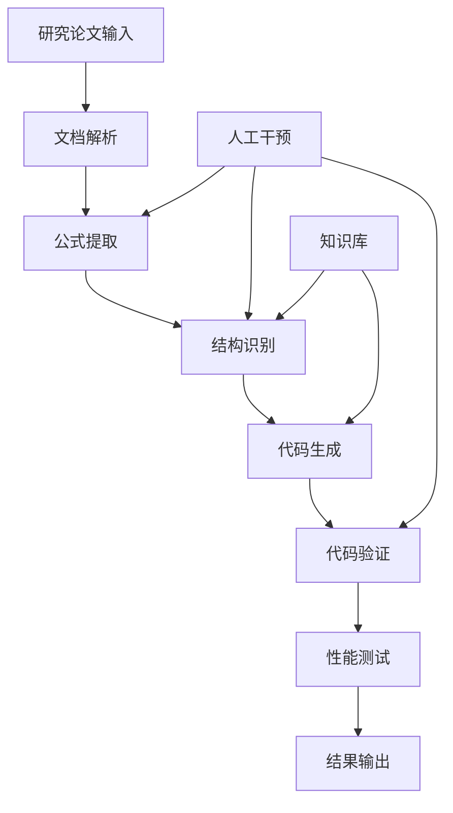

**图表来源**
- [rdagent/app/general_model/general_model.py](file://rdagent/app/general_model/general_model.py#L15-L46)

**章节来源**
- [rdagent/scenarios/general_model/scenario.py](file://rdagent/scenarios/general_model/scenario.py#L1-L56)
- [rdagent/app/general_model/general_model.py](file://rdagent/app/general_model/general_model.py#L1-L46)

## 场景对比分析

### 功能特性对比

| 场景 | 主要目标 | 核心优势 | 技术特点 | 适用范围 |
|------|----------|----------|----------|----------|
| 数据科学自动化 | 全流程自动化 | 高度集成，端到端 | CoSTEER框架，多组件协作 | 通用数据分析任务 |
| 量化金融 | 因子与模型优化 | 专业性强，效果显著 | Qlib集成，交替优化 | 金融量化投资 |
| Kaggle竞赛 | 竞赛表现提升 | 模板复用，快速迭代 | 大赛经验积累，自动调参 | 机器学习竞赛 |
| 通用模型实现 | 研究成果转化 | 灵活开放，学术友好 | 文档解析，公式识别 | 学术研究，技术创新 |

### 技术架构差异

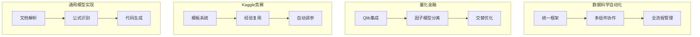

### 性能表现对比

基于MLE-bench基准测试结果：

| Agent | Low==Lite (%) | Medium (%) | High (%) | All (%) |
|-------|---------------|------------|----------|---------|
| R&D-Agent o3(R)+GPT-4.1(D) | 51.52 ± 6.9 | 19.3 ± 5.5 | 26.67 ± 0 | 30.22 ± 1.5 |
| R&D-Agent o1-preview | 48.18 ± 2.49 | 8.95 ± 2.36 | 18.67 ± 2.98 | 22.4 ± 1.1 |
| AIDE o1-preview | 34.3 ± 2.4 | 8.8 ± 1.1 | 10.0 ± 1.9 | 16.9 ± 1.1 |

**章节来源**
- [README.md](file://README.md#L50-L100)

## 使用指南

### 场景选择决策树

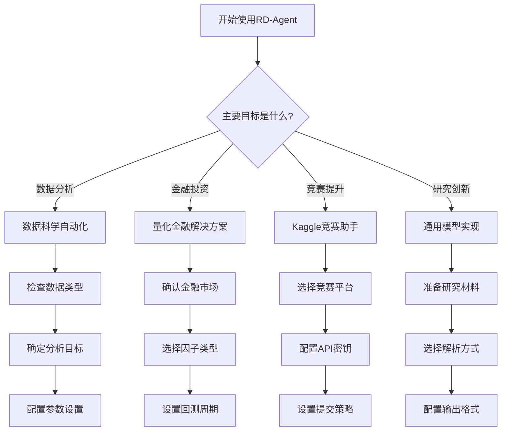

### 配置最佳实践

#### 1. 数据科学自动化配置

```python
# 数据科学场景配置示例
DS_RD_SETTING = DataScienceBasePropSetting()
DS_RD_SETTING.competition = "custom_dataset"
DS_RD_SETTING.coder_on_whole_pipeline = True
DS_RD_SETTING.enable_knowledge_base = True
DS_RD_SETTING.max_trace_num = 3
```

#### 2. 量化金融配置

```python
# 量化金融场景配置
QUANT_PROP_SETTING = QuantBasePropSetting()
QUANT_PROP_SETTING.action_selection = "bandit"
QUANT_PROP_SETTING.evolving_n = 15
```

#### 3. Kaggle竞赛配置

```python
# Kaggle竞赛配置
KAGGLE_IMPLEMENT_SETTING = KaggleBasePropSetting()
KAGGLE_IMPLEMENT_SETTING.competition = "tabular-playground-series-dec-2021"
KAGGLE_IMPLEMENT_SETTING.auto_submit = True
KAGGLE_IMPLEMENT_SETTING.if_using_graph_rag = True
```

### 性能优化建议

#### 1. 计算资源优化

- **GPU利用**: 启用CUDA加速，合理分配显存
- **并行计算**: 利用多核CPU进行数据处理
- **内存管理**: 及时释放不需要的中间结果

#### 2. 时间成本控制

- **早期停止**: 设置合理的训练轮数上限
- **采样策略**: 使用小样本快速验证假设
- **缓存机制**: 复用计算结果避免重复计算

#### 3. 质量保证措施

- **交叉验证**: 使用k折交叉验证确保模型稳定性
- **特征监控**: 持续监控特征质量和分布变化
- **模型解释**: 使用SHAP、LIME等工具解释模型决策

## 总结

RD-Agent作为一个多场景智能研发代理框架，在以下方面展现出显著优势：

### 核心价值

1. **场景覆盖全面**: 涵盖数据科学、量化金融、机器学习竞赛、学术研究等多个专业领域
2. **技术架构先进**: 基于CoSTEER框架的协同进化策略，实现研究与开发的深度融合
3. **自动化程度高**: 从想法生成到代码实现的全流程自动化，大幅降低人工成本
4. **性能表现优异**: 在MLE-bench等权威基准测试中表现突出

### 应用前景

随着人工智能技术的不断发展，RD-Agent将在以下方面发挥更大作用：

- **工业应用**: 在制造业、医疗健康、金融科技等领域实现智能化研发
- **学术研究**: 加速科学研究进程，提高创新效率
- **教育培训**: 为学生和研究人员提供强大的学习工具
- **创业支持**: 帮助初创企业快速验证商业想法和技术方案

### 发展方向

未来RD-Agent将继续在以下方面进行优化：

- **多模态支持**: 扩展对图像、音频、文本等多模态数据的支持
- **领域专业化**: 针对特定行业开发更专业的解决方案
- **人机协作**: 增强与人类专家的协作能力，实现更好的人机共生
- **开源生态**: 构建更加完善的开源社区和生态系统

通过持续的技术创新和场景拓展，RD-Agent将为推动人工智能技术在工业研发中的广泛应用做出重要贡献。