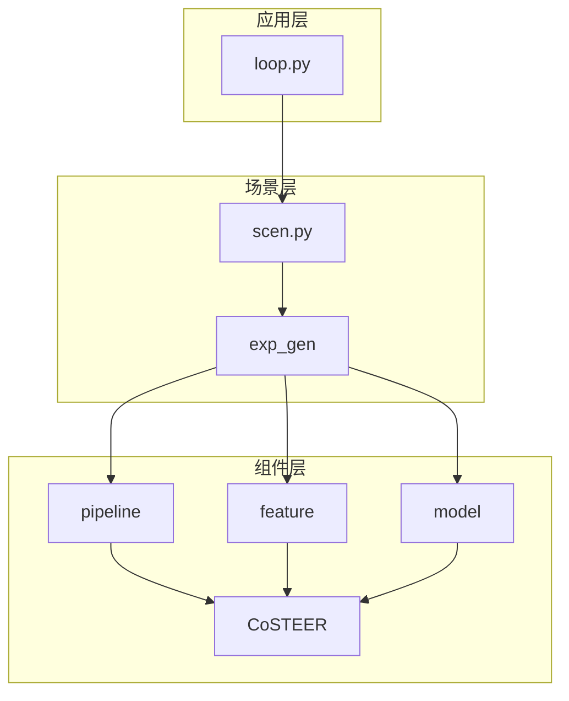
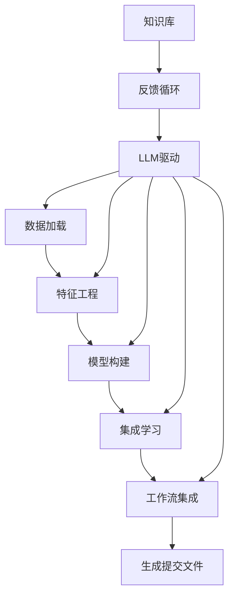
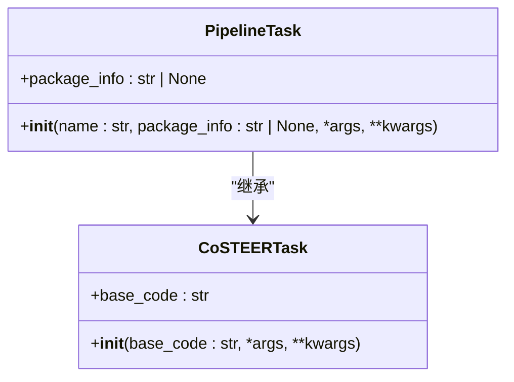
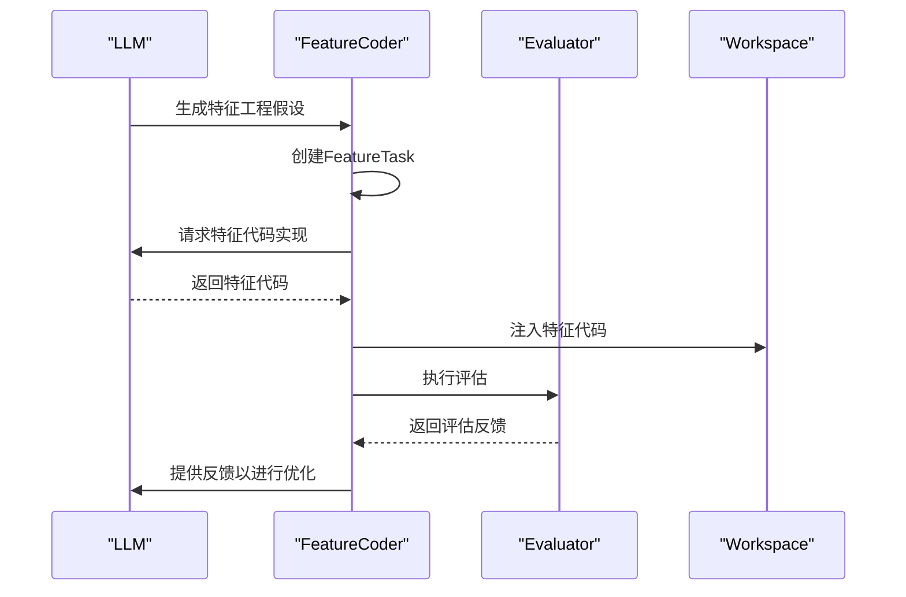
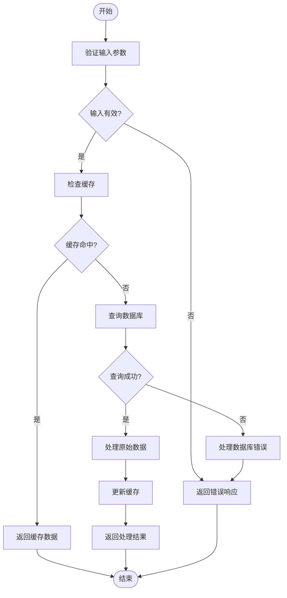
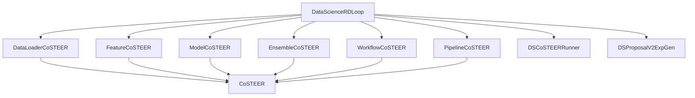

# 数据科学自动化

<cite>
**本文档中引用的文件**  
- [loop.py](file://rdagent/app/data_science/loop.py)
- [exp.py](file://rdagent/components/coder/data_science/pipeline/exp.py)
- [exp.py](file://rdagent/components/coder/data_science/feature/exp.py)
- [exp.py](file://rdagent/components/coder/data_science/model/exp.py)
- [scen.py](file://rdagent/app/finetune/llm/scen.py)
- [task.py](file://rdagent/components/coder/CoSTEER/task.py)
- [loop.py](file://rdagent/scenarios/data_science/loop.py)
- [conf.py](file://rdagent/components/coder/data_science/conf.py)
- [base.py](file://rdagent/scenarios/data_science/proposal/exp_gen/base.py)
- [config.py](file://rdagent/components/coder/CoSTEER/config.py)
- [eval.py](file://rdagent/components/coder/data_science/feature/eval.py)
- [eval.py](file://rdagent/components/coder/data_science/model/eval.py)
- [prompts_v2.yaml](file://rdagent/scenarios/data_science/proposal/exp_gen/prompts_v2.yaml)
- [share.yaml](file://rdagent/scenarios/data_science/share.yaml)
</cite>

## 目录
1. [引言](#引言)
2. [项目结构](#项目结构)
3. [核心组件](#核心组件)
4. [架构概述](#架构概述)
5. [详细组件分析](#详细组件分析)
6. [依赖分析](#依赖分析)
7. [性能考虑](#性能考虑)
8. [故障排除指南](#故障排除指南)
9. [结论](#结论)

## 引言
本文档深入讲解数据科学自动化场景的完整实现流程，详细说明从原始数据加载、特征工程生成、模型构建到集成学习的端到端自动化机制。重点解析`pipeline`、`feature`、`model`三个核心模块的协同工作原理，结合`exp.py`中的实验生成逻辑，阐述如何通过LLM驱动代码演化。提供典型工作流示例，展示输入任务描述后系统自动生成特征代码和模型代码的过程。解释该场景下CoSTEER框架如何进行多轮优化，并引用`scen.py`中的场景配置说明参数调优策略。针对常见失败模式（如过拟合、特征泄露）提供诊断建议和改进方案。

## 项目结构
本项目采用分层架构设计，主要分为应用层、组件层和场景层。应用层提供数据科学自动化的核心入口，组件层实现具体的编码、执行和评估功能，场景层定义特定任务的上下文和配置。

**图示来源**
- [loop.py](file://rdagent/app/data_science/loop.py)
- [scen.py](file://rdagent/app/finetune/llm/scen.py)
- [base.py](file://rdagent/scenarios/data_science/proposal/exp_gen/base.py)

**章节来源**
- [loop.py](file://rdagent/app/data_science/loop.py#L1-L80)
- [scen.py](file://rdagent/app/finetune/llm/scen.py#L1-L87)

## 核心组件
系统的核心组件包括`pipeline`、`feature`、`model`和`ensemble`，它们分别负责数据流水线的集成、特征工程、模型构建和集成学习。这些组件通过`CoSTEER`框架进行协调，实现端到端的自动化机器学习流程。

**章节来源**
- [exp.py](file://rdagent/components/coder/data_science/pipeline/exp.py#L1-L9)
- [exp.py](file://rdagent/components/coder/data_science/feature/exp.py#L1-L14)
- [exp.py](file://rdagent/components/coder/data_science/model/exp.py#L1-L22)
- [task.py](file://rdagent/components/coder/CoSTEER/task.py#L1-L10)

## 架构概述
系统采用基于LLM的自动化研发框架，通过多轮迭代优化机器学习流水线。整个流程从数据加载开始，经过特征工程、模型构建、集成学习，最终生成提交文件。每个组件都有专门的编码器（Coder）负责代码生成和优化。

**图示来源**
- [loop.py](file://rdagent/scenarios/data_science/loop.py#L1-L383)
- [base.py](file://rdagent/scenarios/data_science/proposal/exp_gen/base.py#L1-L348)

## 详细组件分析

### Pipeline组件分析
Pipeline组件负责整合所有数据科学流水线的组件，确保从数据加载到最终输出的完整流程。它通过`PipelineTask`类表示具体的任务，继承自`CoSTEERTask`。

#### 对于面向对象的组件：

**图示来源**
- [exp.py](file://rdagent/components/coder/data_science/pipeline/exp.py#L1-L9)
- [task.py](file://rdagent/components/coder/CoSTEER/task.py#L1-L10)

### Feature组件分析
Feature组件专注于将原始数据转换为适合模型消费的有意义特征。它通过`FeatureTask`类表示特征工程任务，同样继承自`CoSTEERTask`。

#### 对于API/服务组件：

**图示来源**
- [exp.py](file://rdagent/components/coder/data_science/feature/exp.py#L1-L14)
- [eval.py](file://rdagent/components/coder/data_science/feature/eval.py#L1-L84)

### Model组件分析
Model组件负责模型构建、调优或移除。它通过`ModelTask`类表示模型任务，包含任务描述和名称等信息。

#### 对于复杂逻辑组件：

**图示来源**
- [exp.py](file://rdagent/components/coder/data_science/model/exp.py#L1-L22)
- [eval.py](file://rdagent/components/coder/data_science/model/eval.py#L1-L123)

**章节来源**
- [exp.py](file://rdagent/components/coder/data_science/model/exp.py#L1-L22)
- [eval.py](file://rdagent/components/coder/data_science/model/eval.py#L1-L123)

## 依赖分析
系统各组件之间存在明确的依赖关系，通过`CoSTEER`框架进行协调。`DataScienceRDLoop`作为主循环控制器，协调各个编码器的工作。

**图示来源**
- [loop.py](file://rdagent/scenarios/data_science/loop.py#L1-L383)
- [config.py](file://rdagent/components/coder/CoSTEER/config.py#L1-L42)

**章节来源**
- [loop.py](file://rdagent/scenarios/data_science/loop.py#L1-L383)
- [config.py](file://rdagent/components/coder/CoSTEER/config.py#L1-L42)

## 性能考虑
系统在设计时考虑了多种性能优化策略，包括缓存机制、并行执行和超时管理。通过`DSCoderCoSTEERSettings`配置类可以调整最大循环次数、失败任务重试限制等参数。

**章节来源**
- [conf.py](file://rdagent/components/coder/data_science/conf.py#L1-L87)
- [config.py](file://rdagent/components/coder/CoSTEER/config.py#L1-L42)

## 故障排除指南
针对常见的失败模式，系统提供了相应的诊断和改进方案：

1. **过拟合问题**：通过交叉验证和正则化技术来缓解，确保特征工程不会引入数据泄露。
2. **特征泄露**：在特征工程阶段严格检查是否使用了测试集信息来转换训练数据。
3. **超时错误**：系统会自动增加超时时间，通过`increase_timeout()`方法逐步调整。
4. **连续错误**：当连续出现错误达到阈值时，系统会重新分析比赛描述，尝试新的解决方案。

**章节来源**
- [loop.py](file://rdagent/scenarios/data_science/loop.py#L1-L383)
- [base.py](file://rdagent/scenarios/data_science/proposal/exp_gen/base.py#L1-L348)

## 结论
本文档详细介绍了数据科学自动化系统的实现机制，展示了如何通过LLM驱动的CoSTEER框架实现从数据加载到模型集成的端到端自动化。系统通过`pipeline`、`feature`、`model`三个核心模块的协同工作，结合多轮优化和反馈循环，能够自动生成高质量的机器学习解决方案。通过合理的参数配置和错误处理机制，系统能够在各种数据科学场景中稳定运行并持续优化。