# 通用模型实现

<cite>
**本文档引用的文件**
- [general_model.py](file://rdagent/app/general_model/general_model.py)
- [prompts.yaml](file://rdagent/scenarios/general_model/prompts.yaml)
- [scenario.py](file://rdagent/scenarios/general_model/scenario.py)
- [prompt.yaml](file://rdagent/components/coder/model_coder/one_shot/prompt.yaml)
- [gt_code.py](file://rdagent/components/coder/model_coder/gt_code.py)
- [model.py](file://rdagent/components/coder/model_coder/model.py)
- [task_loader.py](file://rdagent/components/coder/model_coder/task_loader.py)
- [visnet.py](file://rdagent/components/coder/model_coder/benchmark/gt_code/visnet.py)
- [conf.py](file://rdagent/components/coder/model_coder/conf.py)
- [kaggle_scenario.py](file://rdagent/scenarios/kaggle/experiment/scenario.py)
- [kaggle_conf.py](file://rdagent/app/kaggle/conf.py)
- [scenario.py](file://rdagent/core/scenario.py)
</cite>

## 目录
1. [引言](#引言)
2. [项目结构概览](#项目结构概览)
3. [核心组件分析](#核心组件分析)
4. [架构概览](#架构概览)
5. [详细组件分析](#详细组件分析)
6. [一次性提示设计](#一次性提示设计)
7. [参考实现机制](#参考实现机制)
8. [模型类型支持范围](#模型类型支持范围)
9. [与专用场景的差异](#与专用场景的差异)
10. [灵活性与自动化程度权衡](#灵活性与自动化程度权衡)
11. [总结](#总结)

## 引言

通用模型实现场景是RD-Agent框架中的一个重要组成部分，它提供了一个灵活且全面的框架来集成因子驱动、模型驱动和图驱动的方法。该场景特别适用于从学术论文或技术报告中自动提取和实现机器学习模型，支持用户自定义模型结构和训练流程，为非标准化的机器学习任务提供了强大的解决方案。

## 项目结构概览

通用模型实现场景的核心文件组织如下：

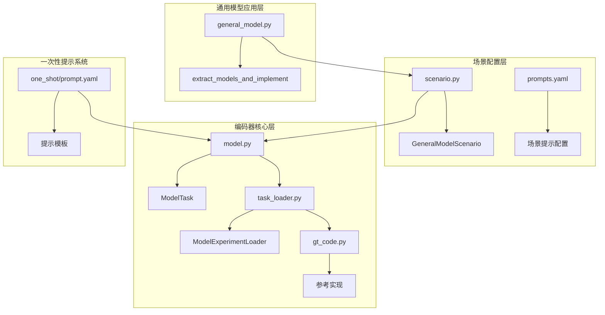

**图表来源**
- [general_model.py](file://rdagent/app/general_model/general_model.py#L1-L46)
- [scenario.py](file://rdagent/scenarios/general_model/scenario.py#L1-L56)
- [model.py](file://rdagent/components/coder/model_coder/model.py#L1-L164)

**章节来源**
- [general_model.py](file://rdagent/app/general_model/general_model.py#L1-L46)
- [scenario.py](file://rdagent/scenarios/general_model/scenario.py#L1-L56)

## 核心组件分析

### 通用模型场景类

GeneralModelScenario类是整个通用模型实现场景的核心，继承自基础Scenario类，提供了专门针对模型研究和开发的场景配置。

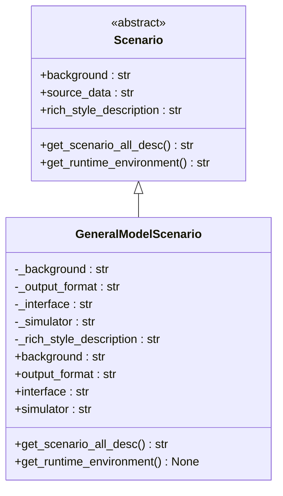

**图表来源**
- [scenario.py](file://rdagent/scenarios/general_model/scenario.py#L7-L56)
- [scenario.py](file://rdagent/core/scenario.py#L6-L65)

### 模型任务管理

ModelTask类负责管理单个模型任务的所有相关信息，包括架构、超参数、变量等。

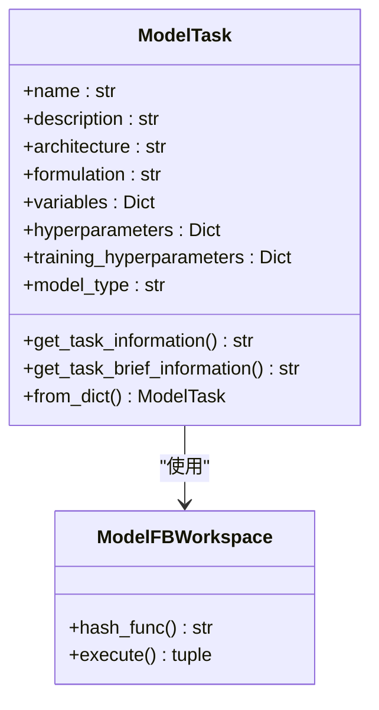

**图表来源**
- [model.py](file://rdagent/components/coder/model_coder/model.py#L13-L164)

**章节来源**
- [model.py](file://rdagent/components/coder/model_coder/model.py#L13-L164)
- [scenario.py](file://rdagent/scenarios/general_model/scenario.py#L7-L56)

## 架构概览

通用模型实现场景采用分层架构设计，从上到下包括应用接口层、场景配置层、编码器核心层和基础设施层。

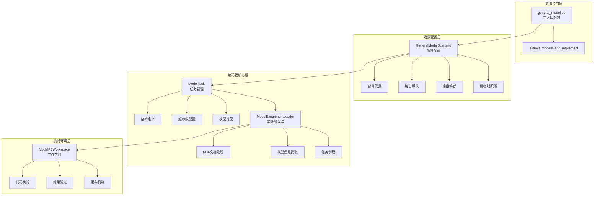

**图表来源**
- [general_model.py](file://rdagent/app/general_model/general_model.py#L10-L46)
- [model.py](file://rdagent/components/coder/model_coder/model.py#L50-L164)
- [task_loader.py](file://rdagent/components/coder/model_coder/task_loader.py#L90-L129)

## 详细组件分析

### 文档处理与模型提取

系统通过PDF文档处理模块自动从学术论文中提取模型信息：

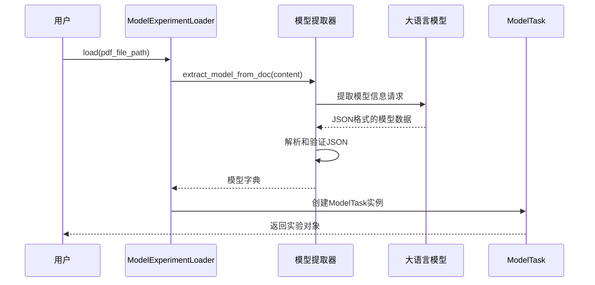

**图表来源**
- [task_loader.py](file://rdagent/components/coder/model_coder/task_loader.py#L15-L129)

### 代码生成与验证流程

系统实现了完整的代码生成和验证流程，确保生成的模型代码符合预期：

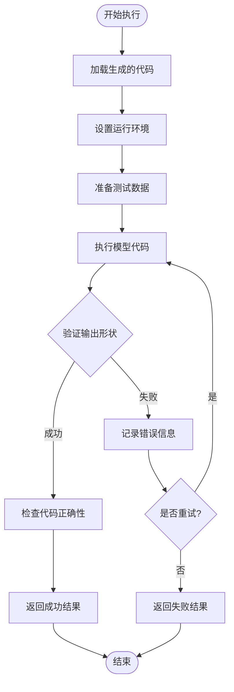

**图表来源**
- [model.py](file://rdagent/components/coder/model_coder/model.py#L80-L164)

**章节来源**
- [task_loader.py](file://rdagent/components/coder/model_coder/task_loader.py#L15-L129)
- [model.py](file://rdagent/components/coder/model_coder/model.py#L80-L164)

## 一次性提示设计

一次性提示设计是通用模型实现场景的重要创新，它通过精心设计的提示模板引导LLM准确理解复杂的模型架构需求。

### 提示模板结构

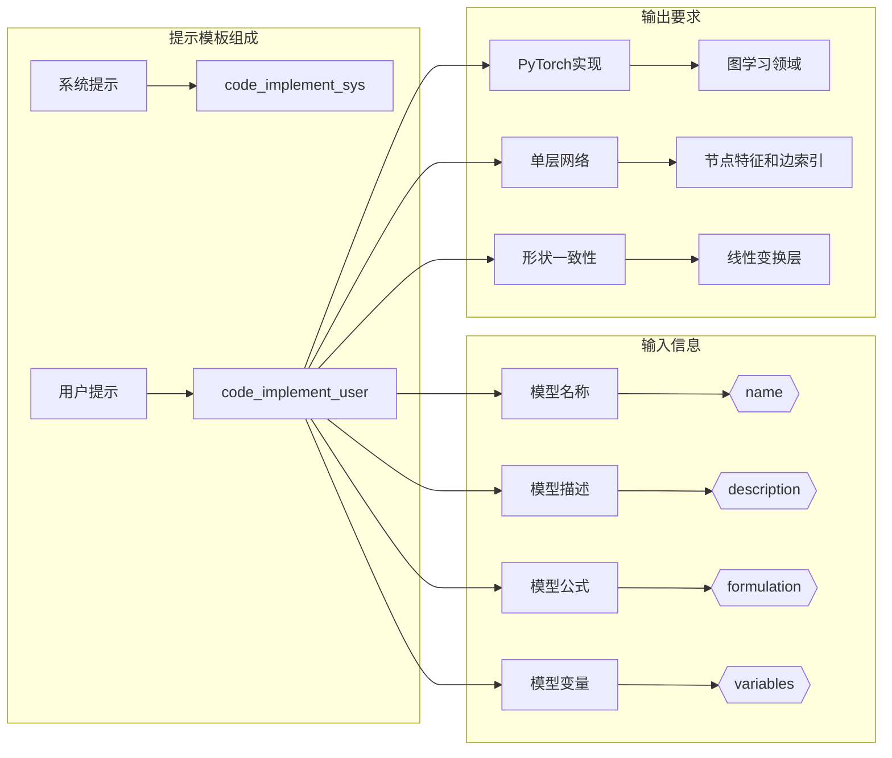

**图表来源**
- [prompt.yaml](file://rdagent/components/coder/model_coder/one_shot/prompt.yaml#L1-L28)

### 设计原则与优势

一次性提示设计遵循以下核心原则：

1. **明确性原则**：提供清晰的任务描述和期望输出
2. **约束性原则**：严格限制输入格式和输出要求
3. **完整性原则**：涵盖所有必要的上下文信息
4. **可执行性原则**：确保生成的代码可以直接运行

**章节来源**
- [prompt.yaml](file://rdagent/components/coder/model_coder/one_shot/prompt.yaml#L1-L28)

## 参考实现机制

参考实现机制通过提供高质量的基准代码，确保生成的模型代码质量和正确性。

### 基准模型库

系统内置了多个高质量的基准模型实现，特别是图神经网络相关的模型：

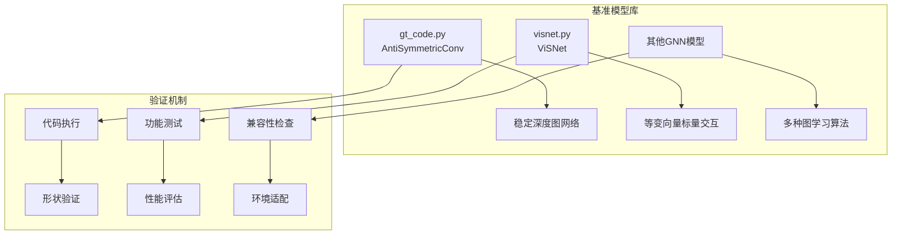

**图表来源**
- [gt_code.py](file://rdagent/components/coder/model_coder/gt_code.py#L1-L137)
- [visnet.py](file://rdagent/components/coder/model_coder/benchmark/gt_code/visnet.py#L1-L799)

### 验证流程

参考实现机制包含严格的验证流程：

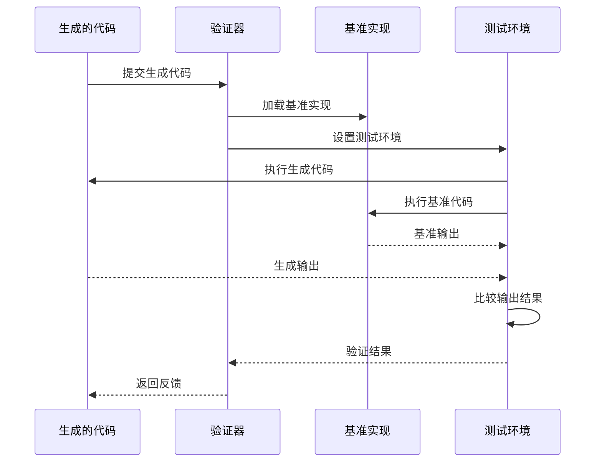

**图表来源**
- [model.py](file://rdagent/components/coder/model_coder/model.py#L80-L164)

**章节来源**
- [gt_code.py](file://rdagent/components/coder/model_coder/gt_code.py#L1-L137)
- [visnet.py](file://rdagent/components/coder/model_coder/benchmark/gt_code/visnet.py#L1-L799)

## 模型类型支持范围

通用模型实现场景支持广泛的模型类型，涵盖了现代机器学习和深度学习的主要范式。

### 支持的模型架构

| 模型类型 | 输入格式 | 主要特点 | 应用场景 |
|---------|---------|---------|---------|
| 图神经网络(GNN) | 节点特征+边索引 | 图结构建模 | 分子性质预测、社交网络分析 |
| 时间序列模型 | (batch_size, num_features, num_timesteps) | 序列模式识别 | 金融时间序列、传感器数据分析 |
| 表格数据模型 | (batch_size, num_features) | 特征工程友好 | 结构化数据预测、分类任务 |
| 等变图神经网络 | 几何特征+拓扑结构 | 几何不变性 | 分子建模、物理系统模拟 |

### 具体实现示例

系统支持多种具体的模型实现，展示了其广泛的适用性：

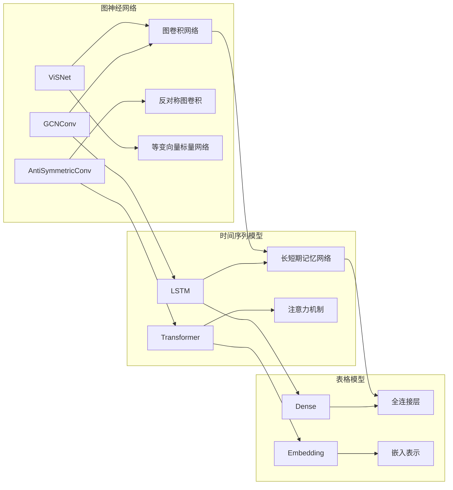

**图表来源**
- [gt_code.py](file://rdagent/components/coder/model_coder/gt_code.py#L15-L137)
- [visnet.py](file://rdagent/components/coder/model_coder/benchmark/gt_code/visnet.py#L799-L1192)

**章节来源**
- [prompts.yaml](file://rdagent/scenarios/general_model/prompts.yaml#L1-L90)
- [model.py](file://rdagent/components/coder/model_coder/model.py#L13-L50)

## 与专用场景的差异

通用模型实现场景与专用场景（如Kaggle竞赛）在设计理念、自动化程度和适用范围等方面存在显著差异。

### 场景对比分析

| 对比维度 | 通用模型场景 | Kaggle竞赛场景 |
|---------|-------------|---------------|
| 自动化程度 | 中等 | 高度自动化 |
| 灵活性 | 高度灵活 | 有限制的灵活性 |
| 输入来源 | 学术论文、技术报告 | 结构化数据集 |
| 输出目标 | 模型实现 | 竞赛排名 |
| 验证方式 | 代码正确性验证 | 性能指标评估 |
| 开发周期 | 研究导向 | 快速迭代 |

### 架构差异

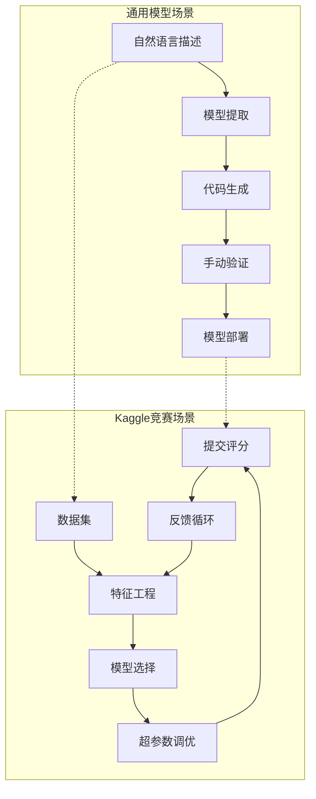

**图表来源**
- [scenario.py](file://rdagent/scenarios/general_model/scenario.py#L1-L56)
- [kaggle_scenario.py](file://rdagent/scenarios/kaggle/experiment/scenario.py#L1-L271)

### 设计理念差异

通用模型场景更注重：
- **研究导向**：支持探索性的模型研究
- **灵活性优先**：允许用户自定义各种参数
- **质量保证**：通过参考实现确保代码质量
- **知识传承**：从学术文献中提取有价值的信息

Kaggle竞赛场景则更关注：
- **性能导向**：以竞赛成绩为主要目标
- **快速迭代**：高效的特征和模型优化流程
- **自动化程度高**：减少人工干预
- **实用性强**：直接解决实际问题

**章节来源**
- [scenario.py](file://rdagent/scenarios/general_model/scenario.py#L1-L56)
- [kaggle_scenario.py](file://rdagent/scenarios/kaggle/experiment/scenario.py#L1-L271)

## 灵活性与自动化程度权衡

通用模型实现场景在灵活性与自动化程度之间找到了平衡点，既保持了足够的灵活性以适应各种研究需求，又提供了适度的自动化来提高效率。

### 权衡策略

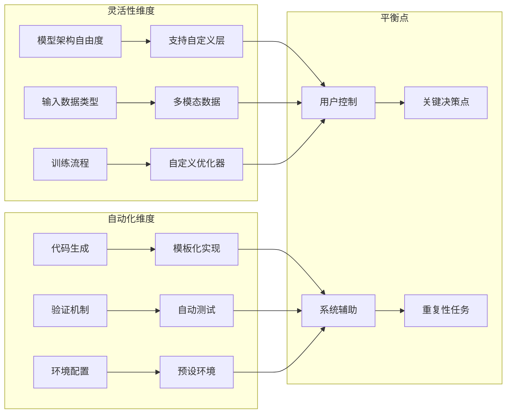

### 使用场景建议

根据不同的使用需求，推荐以下使用策略：

| 使用场景 | 推荐策略 | 关键考虑因素 |
|---------|---------|-------------|
| 学术研究 | 高灵活性配置 | 模型创新、理论验证 |
| 工业应用 | 平衡灵活性与稳定性 | 可靠性、可维护性 |
| 快速原型 | 中等灵活性配置 | 开发速度、成本控制 |
| 教学演示 | 低灵活性配置 | 易于理解和修改 |

### 配置优化建议

为了最大化通用模型实现场景的价值，建议：

1. **合理设置自动化程度**：根据项目需求调整自动化水平
2. **充分利用参考实现**：利用现有的高质量基准代码
3. **建立验证流程**：确保生成代码的质量和正确性
4. **持续优化提示模板**：根据具体需求定制提示内容

**章节来源**
- [conf.py](file://rdagent/components/coder/model_coder/conf.py#L1-L39)
- [prompts.yaml](file://rdagent/scenarios/general_model/prompts.yaml#L1-L90)

## 总结

通用模型实现场景代表了RD-Agent框架在灵活性与自动化之间的精妙平衡。通过其独特的设计理念和实现机制，该场景能够：

1. **处理非标准化任务**：支持从自然语言描述到代码实现的完整转换
2. **提供高度灵活性**：允许用户自定义模型结构和训练流程
3. **确保代码质量**：通过参考实现和验证机制保证生成代码的正确性
4. **支持广泛模型类型**：涵盖GNN、VisNet等多种先进的机器学习架构
5. **促进知识传承**：从学术文献中提取有价值的研究成果

与专用场景相比，通用模型场景更适合研究导向的应用，为机器学习领域的创新提供了强有力的支持。在灵活性与自动化程度之间，该场景通过合理的配置选项和验证机制，为用户提供了最佳的使用体验。

这种设计不仅体现了现代AI工具的发展趋势，也为未来的机器学习研究和应用开辟了新的可能性。随着技术的不断发展，通用模型实现场景有望在更多领域发挥重要作用，成为连接理论研究与实际应用的重要桥梁。