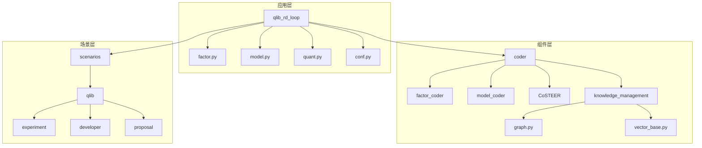
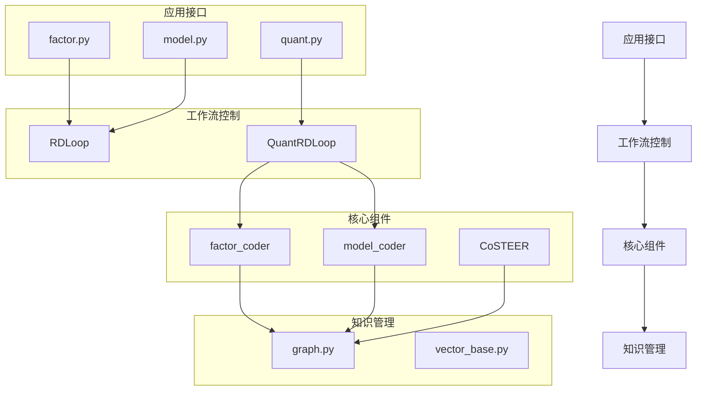
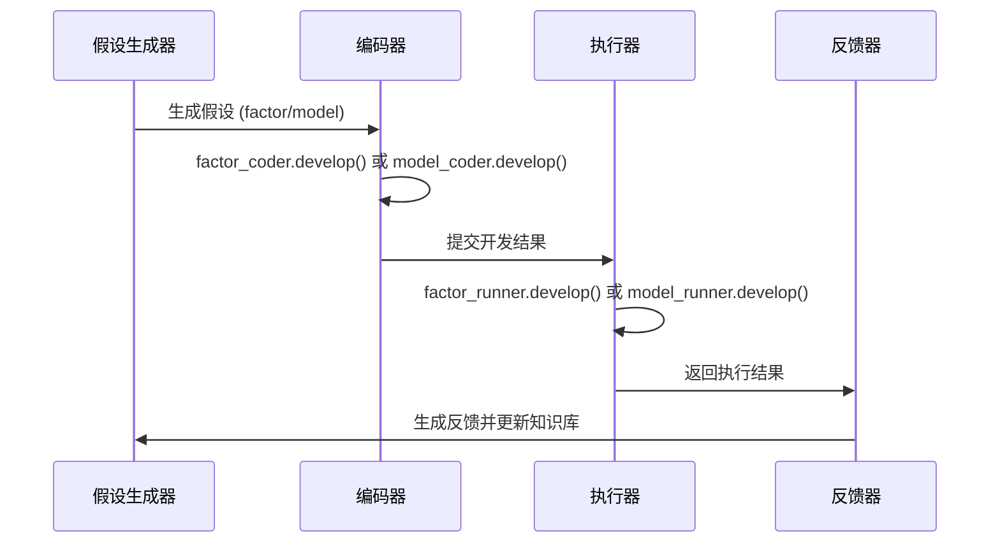
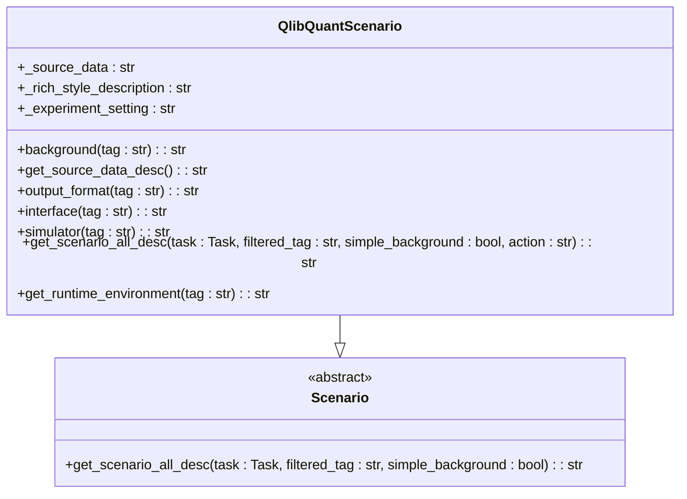
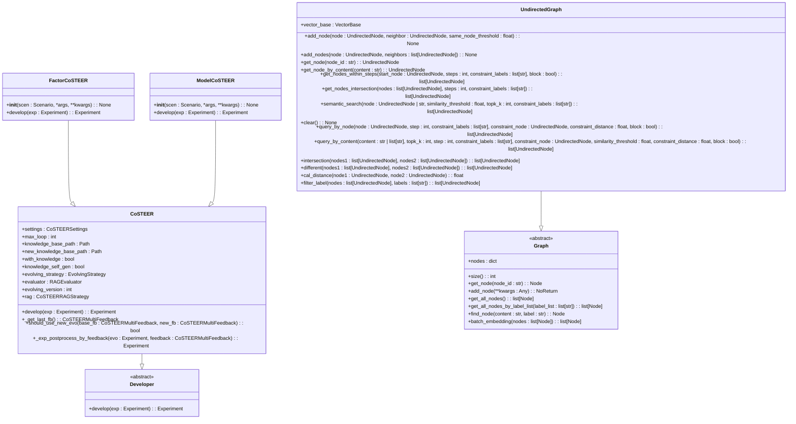
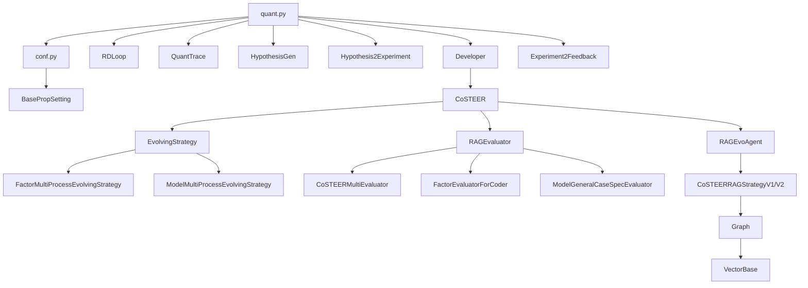

# 量化金融解决方案

<cite>
**本文档引用的文件**  
- [factor.py](file://rdagent/app/qlib_rd_loop/factor.py)
- [model.py](file://rdagent/app/qlib_rd_loop/model.py)
- [quant.py](file://rdagent/app/qlib_rd_loop/quant.py)
- [conf.py](file://rdagent/app/qlib_rd_loop/conf.py)
- [factor_experiment.py](file://rdagent/scenarios/qlib/experiment/factor_experiment.py)
- [model_experiment.py](file://rdagent/scenarios/qlib/experiment/model_experiment.py)
- [quant_experiment.py](file://rdagent/scenarios/qlib/experiment/quant_experiment.py)
- [factor_coder.py](file://rdagent/scenarios/qlib/developer/factor_coder.py)
- [model_coder.py](file://rdagent/scenarios/qlib/developer/model_coder.py)
- [quant_proposal.py](file://rdagent/scenarios/qlib/proposal/quant_proposal.py)
- [CoSTEER/__init__.py](file://rdagent/components/coder/CoSTEER/__init__.py)
- [graph.py](file://rdagent/components/knowledge_management/graph.py)
</cite>

## 目录
1. [引言](#引言)
2. [项目结构](#项目结构)
3. [核心组件](#核心组件)
4. [架构概述](#架构概述)
5. [详细组件分析](#详细组件分析)
6. [依赖分析](#依赖分析)
7. [性能考量](#性能考量)
8. [故障排除指南](#故障排除指南)
9. [结论](#结论)

## 引言
本文档全面阐述了量化金融场景下的因子挖掘与模型训练联合优化机制。系统性地说明了`factor_coder`如何根据金融数据生成技术指标因子，`model_coder`如何构建预测模型，以及两者在`qlib_rd_loop`中如何协同迭代。深入解析了`factor_experiment.py`和`model_experiment.py`中的回测流程与评估指标，展示了从因子提出到组合优化的完整闭环。结合`scen.py`中的场景定义，阐明了多因子融合策略与风险控制机制。提供了实际因子代码生成示例，并解释了如何通过知识库积累有效因子模式。针对高频交易延迟、过拟合等专业问题给出了调优建议。

## 项目结构
该量化金融解决方案采用模块化架构，核心功能围绕因子挖掘、模型训练和联合优化三大工作流展开。项目结构清晰地分离了应用层、组件层和场景层，实现了高内聚低耦合的设计原则。

**图源**  
- [factor.py](file://rdagent/app/qlib_rd_loop/factor.py)
- [model.py](file://rdagent/app/qlib_rd_loop/model.py)
- [quant.py](file://rdagent/app/qlib_rd_loop/quant.py)
- [graph.py](file://rdagent/components/knowledge_management/graph.py)

**章节源**  
- [factor.py](file://rdagent/app/qlib_rd_loop/factor.py)
- [model.py](file://rdagent/app/qlib_rd_loop/model.py)
- [quant.py](file://rdagent/app/qlib_rd_loop/quant.py)

## 核心组件
本解决方案的核心组件包括因子工作流、模型工作流和联合优化工作流。`factor.py`实现了因子研发的自动化循环，通过`FactorRDLoop`类继承`RDLoop`基类，处理因子提取的完整生命周期。`model.py`提供了类似的模型研发循环，使用`ModelRDLoop`类管理模型的开发过程。`quant.py`是整个系统的核心，通过`QuantRDLoop`类实现了因子与模型的联合优化，协调`factor_coder`和`model_coder`的协同工作。

**章节源**  
- [factor.py](file://rdagent/app/qlib_rd_loop/factor.py#L1-L60)
- [model.py](file://rdagent/app/qlib_rd_loop/model.py#L1-L43)
- [quant.py](file://rdagent/app/qlib_rd_loop/quant.py#L1-L143)

## 架构概述
该量化金融解决方案采用分层架构设计，实现了从假设生成到实验反馈的完整研发闭环。系统架构分为四个主要层次：应用接口层、工作流控制层、核心组件层和知识管理层。

**图源**  
- [quant.py](file://rdagent/app/qlib_rd_loop/quant.py#L1-L143)
- [CoSTEER/__init__.py](file://rdagent/components/coder/CoSTEER/__init__.py#L1-L176)
- [graph.py](file://rdagent/components/knowledge_management/graph.py#L1-L497)

## 详细组件分析

### 因子与模型联合优化机制分析
`QuantRDLoop`类是实现因子与模型联合优化的核心。它通过`direct_exp_gen`方法生成假设，根据`action_selection`策略决定是进行因子开发还是模型开发。系统支持多种策略选择，包括bandit算法、LLM决策和随机选择。

**图源**  
- [quant.py](file://rdagent/app/qlib_rd_loop/quant.py#L1-L143)
- [conf.py](file://rdagent/app/qlib_rd_loop/conf.py#L1-L120)

**章节源**  
- [quant.py](file://rdagent/app/qlib_rd_loop/quant.py#L1-L143)
- [conf.py](file://rdagent/app/qlib_rd_loop/conf.py#L1-L120)

### 场景定义与实验管理分析
`QlibQuantScenario`类定义了量化金融场景的完整上下文，包括数据源、接口规范、输出格式和模拟器信息。该类通过`get_scenario_all_desc`方法为不同阶段提供定制化的场景描述，确保因子和模型开发遵循统一的标准。

**图源**  
- [quant_experiment.py](file://rdagent/scenarios/qlib/experiment/quant_experiment.py#L1-L202)
- [factor_experiment.py](file://rdagent/scenarios/qlib/experiment/factor_experiment.py#L1-L90)
- [model_experiment.py](file://rdagent/scenarios/qlib/experiment/model_experiment.py#L1-L82)

**章节源**  
- [quant_experiment.py](file://rdagent/scenarios/qlib/experiment/quant_experiment.py#L1-L202)

### CoSTEER框架与知识管理分析
CoSTEER框架是本解决方案的核心编码引擎，采用`CoSTEER`基类和特定领域的子类（如`FactorCoSTEER`和`ModelCoSTEER`）实现。该框架集成了知识管理功能，通过`CoSTEERRAGStrategyV1/V2`实现基于知识库的检索增强生成。

**图源**  
- [CoSTEER/__init__.py](file://rdagent/components/coder/CoSTEER/__init__.py#L1-L176)
- [graph.py](file://rdagent/components/knowledge_management/graph.py#L1-L497)
- [factor_coder.py](file://rdagent/scenarios/qlib/developer/factor_coder.py#L1-L2)
- [model_coder.py](file://rdagent/scenarios/qlib/developer/model_coder.py#L1-L2)

**章节源**  
- [CoSTEER/__init__.py](file://rdagent/components/coder/CoSTEER/__init__.py#L1-L176)
- [graph.py](file://rdagent/components/knowledge_management/graph.py#L1-L497)

## 依赖分析
该解决方案的依赖关系清晰地展示了各组件之间的协作模式。核心依赖包括`rdagent.core`基础组件、`rdagent.components.coder`编码引擎和`rdagent.scenarios.qlib`量化金融场景实现。

**图源**  
- [quant.py](file://rdagent/app/qlib_rd_loop/quant.py#L1-L143)
- [conf.py](file://rdagent/app/qlib_rd_loop/conf.py#L1-L120)
- [CoSTEER/__init__.py](file://rdagent/components/coder/CoSTEER/__init__.py#L1-L176)
- [graph.py](file://rdagent/components/knowledge_management/graph.py#L1-L497)

**章节源**  
- [quant.py](file://rdagent/app/qlib_rd_loop/quant.py#L1-L143)
- [conf.py](file://rdagent/app/qlib_rd_loop/conf.py#L1-L120)

## 性能考量
在量化金融场景下，系统性能主要受以下几个因素影响：因子计算效率、模型训练速度、知识库检索性能和并行处理能力。CoSTEER框架通过`MultiProcessEvolvingStrategy`实现了多进程演化策略，有效提升了计算效率。知识管理组件采用向量数据库和图数据库相结合的方式，平衡了语义搜索的准确性和关系查询的效率。系统还通过`get_develop_max_seconds`方法实现了超时控制，防止长时间运行的任务影响整体性能。

## 故障排除指南
针对量化金融研发中常见的问题，系统提供了相应的故障排除机制。对于因子提取失败，系统会抛出`FactorEmptyError`异常；对于模型生成失败，则会抛出`ModelEmptyError`异常。在CoSTEER框架中，`CoderError`用于处理编码过程中的各种错误。知识管理组件通过`semantic_search`和`query_by_content`方法提供了灵活的查询接口，帮助开发者快速定位相关知识。系统还通过日志记录和反馈机制，为问题诊断提供了详细的上下文信息。

**章节源**  
- [quant.py](file://rdagent/app/qlib_rd_loop/quant.py#L1-L143)
- [CoSTEER/__init__.py](file://rdagent/components/coder/CoSTEER/__init__.py#L1-L176)
- [graph.py](file://rdagent/components/knowledge_management/graph.py#L1-L497)

## 结论
本文档全面阐述了量化金融场景下的因子挖掘与模型训练联合优化机制。通过`factor_coder`和`model_coder`的协同工作，结合`qlib_rd_loop`中的迭代优化流程，实现了从因子提出到组合优化的完整闭环。系统通过`factor_experiment.py`和`model_experiment.py`中的回测流程与评估指标，确保了研发过程的科学性和有效性。`scen.py`中的场景定义为多因子融合策略与风险控制机制提供了坚实的基础。知识库的积累和利用机制，使得有效因子模式能够被持续积累和复用。针对高频交易延迟、过拟合等专业问题，系统通过并行处理、超时控制和知识管理等机制提供了有效的调优方案。整体架构设计合理，组件职责清晰，为量化金融研发提供了强大的自动化支持。