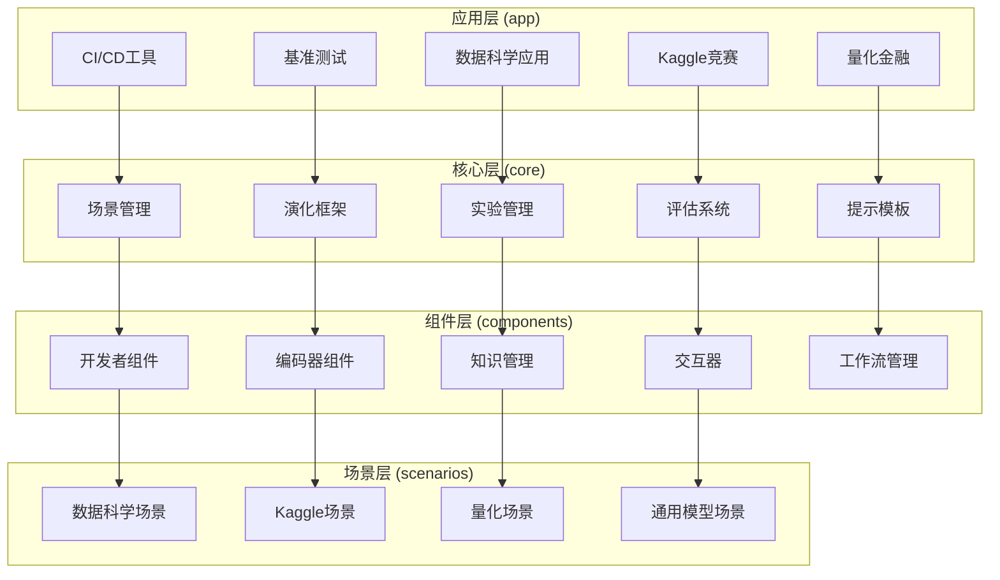
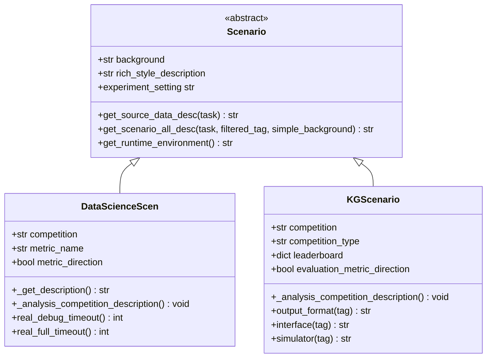
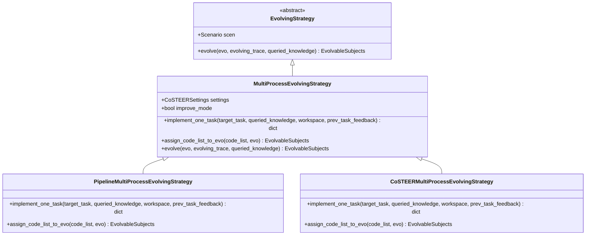
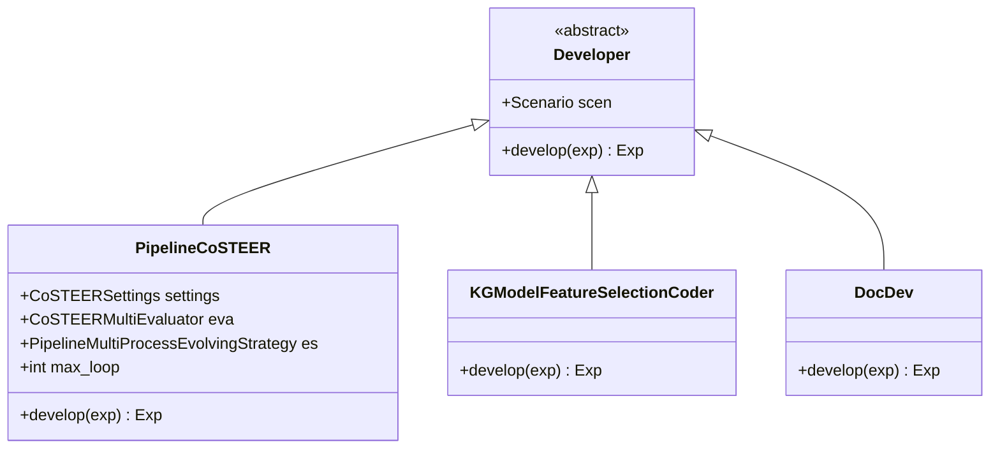
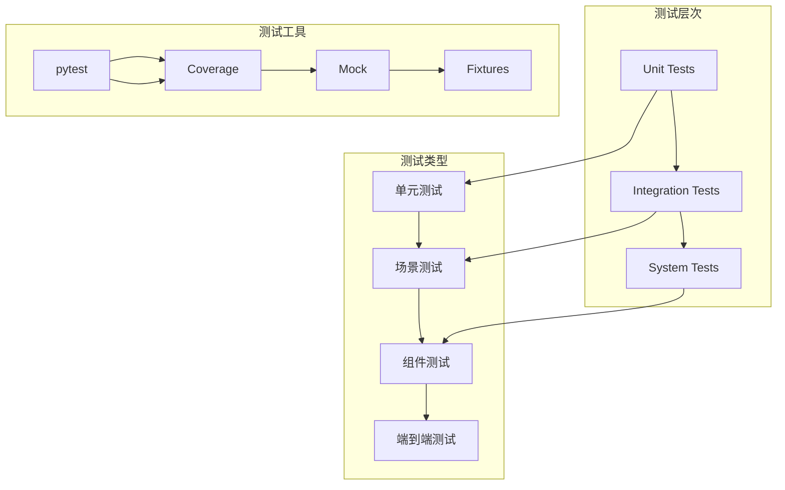

# 开发者指南

<cite>
**本文档中引用的文件**
- [CONTRIBUTING.md](file://CONTRIBUTING.md)
- [README.md](file://README.md)
- [pyproject.toml](file://pyproject.toml)
- [Makefile](file://Makefile)
- [rdagent/core/scenario.py](file://rdagent/core/scenario.py)
- [rdagent/core/evolving_framework.py](file://rdagent/core/evolving_framework.py)
- [rdagent/core/developer.py](file://rdagent/core/developer.py)
- [rdagent/components/coder/CoSTEER/evolving_strategy.py](file://rdagent/components/coder/CoSTEER/evolving_strategy.py)
- [rdagent/components/coder/data_science/pipeline/__init__.py](file://rdagent/components/coder/data_science/pipeline/__init__.py)
- [rdagent/scenarios/data_science/scen/__init__.py](file://rdagent/scenarios/data_science/scen/__init__.py)
- [rdagent/scenarios/kaggle/experiment/scenario.py](file://rdagent/scenarios/kaggle/experiment/scenario.py)
- [test/utils/test_agent_infra.py](file://test/utils/test_agent_infra.py)
- [test/README.md](file://test/README.md)
</cite>

## 目录
1. [简介](#简介)
2. [项目结构概览](#项目结构概览)
3. [贡献流程](#贡献流程)
4. [代码风格与规范](#代码风格与规范)
5. [添加新场景（Scenario）](#添加新场景scenario)
6. [扩展演化策略](#扩展演化策略)
7. [创建新的编码器](#创建新的编码器)
8. [测试指南](#测试指南)
9. [开发环境设置](#开发环境设置)
10. [常见问题解答](#常见问题解答)

## 简介

RD-Agent是一个面向数据驱动研发自动化的智能代理框架，旨在通过人工智能技术自动化工业研发过程中的关键环节。本指南将帮助您了解如何为这个开源项目做出贡献，无论是添加新功能、修复bug还是改进文档。

### 核心特性
- **多场景支持**：支持量化交易、数据科学竞赛、医疗预测等多种应用场景
- **自主演化能力**：具备自我学习和改进的研发能力
- **模块化设计**：清晰的组件分离，便于扩展和维护
- **丰富的测试覆盖**：完善的测试框架确保代码质量

## 项目结构概览

RD-Agent采用分层架构设计，主要包含以下核心模块：



**图表来源**
- [rdagent/core/scenario.py](file://rdagent/core/scenario.py#L1-L65)
- [rdagent/core/evolving_framework.py](file://rdagent/core/evolving_framework.py#L1-L128)

**章节来源**
- [README.md](file://README.md#L1-L100)

## 贡献流程

### 1. 准备工作

#### 1.1 Fork仓库
首先在GitHub上Fork主仓库到您的个人账户。

#### 1.2 克隆代码
```bash
git clone https://github.com/your-username/RD-Agent.git
cd RD-Agent
```

#### 1.3 创建开发分支
```bash
git checkout -b feature/your-feature-name
```

### 2. 开发流程

#### 2.1 设置开发环境
```bash
make dev
```

这将安装所有必要的依赖项，包括：
- 核心包（`rdagent`）
- 文档构建工具
- 代码检查工具
- 测试框架
- 包构建工具

#### 2.2 编写代码
遵循项目的代码风格和架构规范进行开发。

#### 2.3 运行测试
```bash
make test
```

#### 2.4 提交更改
```bash
git add .
git commit -m "描述性提交信息"
git push origin feature/your-feature-name
```

### 3. Pull Request流程

1. **创建Pull Request**：在GitHub上创建PR，填写详细的描述
2. **代码审查**：维护者会审查您的代码
3. **修改反馈**：根据审查意见进行必要的修改
4. **合并**：通过审查后，代码将被合并到主分支

**章节来源**
- [CONTRIBUTING.md](file://CONTRIBUTING.md#L1-L51)
- [Makefile](file://Makefile#L80-L100)

## 代码风格与规范

### 1. 代码格式化

#### 1.1 使用Ruff进行代码检查
```bash
make lint
```

#### 1.2 自动修复格式问题
```bash
make auto-lint
```

#### 1.3 配置要求
- 行长度：120字符
- 导入排序：使用isort
- 代码格式：使用black
- 类型检查：使用mypy

### 2. 命名约定

#### 2.1 文件命名
- 使用小写字母和下划线：`my_component.py`
- 场景文件：`scenario.py`
- 测试文件：`test_*.py`

#### 2.2 变量和函数命名
- 使用snake_case：`my_function`, `my_variable`
- 私有成员：前缀下划线：`_private_method`
- 常量：全大写：`MAX_VALUE`

#### 2.3 类命名
- 使用PascalCase：`MyClass`, `DataLoader`

### 3. 文档规范

#### 3.1 Docstring格式
```python
def my_function(param1: str, param2: int) -> bool:
    """简短描述函数功能。
    
    详细描述函数的行为、参数和返回值。
    
    Args:
        param1: 参数1的描述
        param2: 参数2的描述
        
    Returns:
        返回值的描述
        
    Raises:
        ExceptionType: 描述可能抛出的异常
    """
```

#### 3.2 注释规范
- 使用英文注释
- 对复杂逻辑进行解释
- 避免过度注释

**章节来源**
- [pyproject.toml](file://pyproject.toml#L60-L120)
- [Makefile](file://Makefile#L120-L180)

## 添加新场景（Scenario）

场景（Scenario）是RD-Agent的核心概念之一，代表特定的应用领域和任务类型。以下是添加新场景的完整指南。

### 1. 场景架构概述



**图表来源**
- [rdagent/core/scenario.py](file://rdagent/core/scenario.py#L5-L65)
- [rdagent/scenarios/data_science/scen/__init__.py](file://rdagent/scenarios/data_science/scen/__init__.py#L15-L290)
- [rdagent/scenarios/kaggle/experiment/scenario.py](file://rdagent/scenarios/kaggle/experiment/scenario.py#L20-L282)

### 2. 创建新场景步骤

#### 2.1 在`scenarios/`目录下创建新模块

假设我们要创建一个新的医疗预测场景：

```bash
mkdir -p rdagent/scenarios/medical_prediction
touch rdagent/scenarios/medical_prediction/scenario.py
touch rdagent/scenarios/medical_prediction/__init__.py
```

#### 2.2 实现场景类

```python
from rdagent.core.scenario import Scenario
from rdagent.core.experiment import Task

class MedicalPredictionScenario(Scenario):
    """医疗预测场景"""
    
    def __init__(self, dataset_path: str):
        super().__init__()
        self.dataset_path = dataset_path
        self._background = self._initialize_background()
        self._rich_style_description = self._initialize_description()
        
    @property
    def background(self) -> str:
        return self._background
        
    @property
    def rich_style_description(self) -> str:
        return self._rich_style_description
        
    def get_source_data_desc(self, task: Task | None = None) -> str:
        """获取数据源描述"""
        return f"医疗数据集路径: {self.dataset_path}\n" \
               f"数据格式: CSV\n" \
               f"样本数量: {self._get_sample_count()}\n" \
               f"特征数量: {self._get_feature_count()}"
               
    def get_scenario_all_desc(self, 
                             task: Task | None = None,
                             filtered_tag: str | None = None,
                             simple_background: bool | None = None) -> str:
        """获取完整的场景描述"""
        base_desc = f"医疗预测场景\n" \
                   f"背景: {self.background}\n" \
                   f"数据源: {self.get_source_data_desc(task)}"
                   
        if filtered_tag == "hypothesis_and_experiment":
            return base_desc
            
        return base_desc + f"\n评估指标: {self._get_evaluation_metric()}"
        
    def get_runtime_environment(self) -> str:
        """获取运行环境信息"""
        return "Python 3.10+\n" \
               "依赖包: numpy, pandas, scikit-learn\n" \
               "GPU支持: 可选"
               
    def _initialize_background(self) -> str:
        """初始化背景信息"""
        return "本场景专注于医疗数据的预测分析，目标是建立准确的疾病诊断模型。"
        
    def _initialize_description(self) -> str:
        """初始化富文本描述"""
        return "### 医疗预测场景\n" \
               "#### 概述\n" \
               "这是一个基于医疗数据的预测场景，旨在开发准确的疾病诊断模型。"
```

#### 2.3 实现场景配置

创建配置文件：

```python
# rdagent/scenarios/medical_prediction/conf.py
from dataclasses import dataclass
from typing import Optional

@dataclass
class MedicalPredictionSettings:
    """医疗预测场景配置"""
    
    # 数据相关配置
    dataset_path: str = "./data/medical_dataset"
    test_size: float = 0.2
    random_state: int = 42
    
    # 模型相关配置
    max_depth: Optional[int] = None
    n_estimators: int = 100
    learning_rate: float = 0.1
    
    # 训练相关配置
    max_iterations: int = 10
    timeout_seconds: int = 3600
```

#### 2.4 添加提示模板

在`prompts.yaml`中定义场景相关的提示词：

```yaml
# rdagent/scenarios/medical_prediction/prompts.yaml
medical_background:
  system: |
    你是一个医疗数据分析专家，正在处理医疗预测任务。
    你的任务是分析医疗数据并提出有效的预测模型。
    
  user: |
    医疗数据集信息:
    {dataset_info}
    
    请分析数据并提出初步的建模思路。
```

#### 2.5 实现场景测试

```python
# test/scenarios/test_medical_prediction.py
import unittest
from rdagent.scenarios.medical_prediction.scenario import MedicalPredictionScenario

class TestMedicalPredictionScenario(unittest.TestCase):
    
    def setUp(self):
        self.scenario = MedicalPredictionScenario("./test_data")
        
    def test_background(self):
        self.assertIsInstance(self.scenario.background, str)
        self.assertGreater(len(self.scenario.background), 0)
        
    def test_rich_style_description(self):
        self.assertIsInstance(self.scenario.rich_style_description, str)
        self.assertIn("医疗预测场景", self.scenario.rich_style_description)
        
    def test_get_source_data_desc(self):
        desc = self.scenario.get_source_data_desc()
        self.assertIn("医疗数据集路径", desc)
        self.assertIn("CSV", desc)
```

### 3. 场景集成

#### 3.1 注册场景

在主配置文件中注册新场景：

```python
# rdagent/app/cli.py
from rdagent.scenarios.medical_prediction.scenario import MedicalPredictionScenario

# 在命令行接口中添加新场景
@app.command()
def medical_prediction(dataset_path: str = "./data/medical_dataset"):
    """运行医疗预测场景"""
    scenario = MedicalPredictionScenario(dataset_path)
    # 启动场景执行流程
```

#### 3.2 验证场景功能

```bash
# 运行场景测试
pytest test/scenarios/test_medical_prediction.py

# 运行场景集成测试
pytest test/integration/test_medical_prediction_integration.py
```

**章节来源**
- [rdagent/core/scenario.py](file://rdagent/core/scenario.py#L1-L65)
- [rdagent/scenarios/data_science/scen/__init__.py](file://rdagent/scenarios/data_science/scen/__init__.py#L15-L100)
- [rdagent/scenarios/kaggle/experiment/scenario.py](file://rdagent/scenarios/kaggle/experiment/scenario.py#L20-L100)

## 扩展演化策略

演化策略（EvolvingStrategy）定义了如何对可演化对象进行迭代改进的过程。这是RD-Agent核心的自我改进机制。

### 1. 演化策略架构



**图表来源**
- [rdagent/core/evolving_framework.py](file://rdagent/core/evolving_framework.py#L50-L128)
- [rdagent/components/coder/CoSTEER/evolving_strategy.py](file://rdagent/components/coder/CoSTEER/evolving_strategy.py#L15-L135)

### 2. 创建自定义演化策略

#### 2.1 继承基础演化策略

```python
from rdagent.core.evolving_framework import EvolvingStrategy, EvoStep
from rdagent.core.experiment import FBWorkspace, Task
from rdagent.components.coder.CoSTEER.evolvable_subjects import EvolvingItem
from rdagent.components.coder.CoSTEER.knowledge_management import CoSTEERQueriedKnowledge

class CustomEvolvingStrategy(EvolvingStrategy):
    """自定义演化策略示例"""
    
    def __init__(self, scen, custom_param: str = "default"):
        super().__init__(scen)
        self.custom_param = custom_param
        self.iteration_count = 0
        
    def evolve(self, 
              evo: EvolvingItem,
              evolving_trace: list[EvoStep] = None,
              queried_knowledge: CoSTEERQueriedKnowledge = None,
              **kwargs) -> EvolvingItem:
        """执行演化步骤"""
        self.iteration_count += 1
        
        # 1. 分析当前状态
        current_performance = self._analyze_current_performance(evo)
        previous_feedback = self._extract_previous_feedback(evolving_trace)
        
        # 2. 基于知识库查询相关信息
        if queried_knowledge:
            relevant_knowledge = queried_knowledge.get_relevant_knowledge(evo)
        else:
            relevant_knowledge = None
            
        # 3. 应用演化规则
        new_evo = self._apply_evolution_rules(evo, current_performance, 
                                            previous_feedback, relevant_knowledge)
                                            
        # 4. 更新演化历史
        evolving_trace.append(EvoStep(
            evolvable_subjects=new_evo,
            queried_knowledge=queried_knowledge,
            feedback=current_performance
        ))
        
        return new_evo
        
    def _analyze_current_performance(self, evo: EvolvingItem) -> dict:
        """分析当前性能"""
        # 实现性能分析逻辑
        return {"accuracy": 0.85, "iteration": self.iteration_count}
        
    def _extract_previous_feedback(self, evolving_trace: list[EvoStep]) -> dict:
        """提取之前的反馈"""
        if not evolving_trace:
            return {}
            
        last_step = evolving_trace[-1]
        if last_step.feedback:
            return last_step.feedback.to_dict()
        return {}
        
    def _apply_evolution_rules(self, evo: EvolvingItem, 
                              performance: dict, 
                              feedback: dict, 
                              knowledge: dict) -> EvolvingItem:
        """应用演化规则生成新的演化对象"""
        # 实现具体的演化逻辑
        new_evo = evo.clone()
        
        # 示例：基于性能调整参数
        if performance.get("accuracy", 0) < 0.9:
            new_evo.adjust_parameters({"learning_rate": 0.01})
            
        return new_evo
```

#### 2.2 实现任务级演化策略

```python
class TaskLevelEvolvingStrategy(MultiProcessEvolvingStrategy):
    """基于任务级别的演化策略"""
    
    def implement_one_task(self, 
                          target_task: Task,
                          queried_knowledge: CoSTEERQueriedKnowledge = None,
                          workspace: FBWorkspace = None,
                          prev_task_feedback: CoSTEERSingleFeedback = None) -> dict:
        """实现单个任务"""
        
        # 1. 分析任务复杂度
        task_complexity = self._assess_task_complexity(target_task)
        
        # 2. 获取相关知识
        relevant_knowledge = self._get_relevant_knowledge(target_task, queried_knowledge)
        
        # 3. 生成解决方案
        solution = self._generate_solution(target_task, task_complexity, 
                                         relevant_knowledge, prev_task_feedback)
                                         
        # 4. 验证解决方案
        validation_result = self._validate_solution(solution, target_task)
        
        if not validation_result["passed"]:
            # 如果验证失败，尝试改进
            improved_solution = self._improve_solution(solution, validation_result)
            return {"main.py": improved_solution}
            
        return {"main.py": solution}
        
    def _assess_task_complexity(self, task: Task) -> str:
        """评估任务复杂度"""
        complexity_map = {
            "simple": ["数据清洗", "基本统计"],
            "medium": ["特征工程", "简单模型"],
            "complex": ["深度学习", "复杂算法"]
        }
        
        for level, keywords in complexity_map.items():
            if any(keyword in task.description for keyword in keywords):
                return level
                
        return "unknown"
        
    def _get_relevant_knowledge(self, task: Task, 
                               knowledge: CoSTEERQueriedKnowledge) -> dict:
        """获取相关知识"""
        if not knowledge:
            return {}
            
        return knowledge.search_relevant_knowledge(task.description)
        
    def _generate_solution(self, task: Task, complexity: str, 
                          knowledge: dict, feedback: CoSTEERSingleFeedback) -> str:
        """生成解决方案"""
        # 实现具体的解决方案生成逻辑
        return f"# 任务: {task.description}\n# 复杂度: {complexity}\n# 解决方案..."
        
    def _validate_solution(self, solution: str, task: Task) -> dict:
        """验证解决方案"""
        # 实现验证逻辑
        return {"passed": True, "issues": []}
        
    def _improve_solution(self, solution: str, validation_result: dict) -> str:
        """改进解决方案"""
        # 实现改进逻辑
        return solution + "\n# 改进后的版本..."
```

#### 2.3 集成演化策略

```python
# 在场景中使用自定义演化策略
from rdagent.scenarios.data_science.scen import DataScienceScen
from rdagent.components.coder.data_science.pipeline import PipelineCoSTEER

class EnhancedDataScienceScen(DataScienceScen):
    """增强的数据科学场景"""
    
    def __init__(self, competition: str):
        super().__init__(competition)
        
        # 替换默认的演化策略
        self.custom_evolution_strategy = TaskLevelEvolvingStrategy(
            self, 
            custom_param="enhanced"
        )
        
    def evolve_experiment(self, experiment):
        """使用自定义演化策略演化实验"""
        return self.custom_evolution_strategy.evolve(experiment)
```

### 3. 演化策略测试

```python
# test/strategies/test_custom_evolution.py
import unittest
from rdagent.core.evolving_framework import EvoStep
from rdagent.components.coder.CoSTEER.evolvable_subjects import EvolvingItem
from rdagent.scenarios.data_science.scen import DataScienceScen

class TestCustomEvolvingStrategy(unittest.TestCase):
    
    def setUp(self):
        self.scenario = DataScienceScen("test-competition")
        self.strategy = TaskLevelEvolvingStrategy(self.scenario)
        self.evo_item = EvolvingItem()
        
    def test_evolution_process(self):
        # 创建模拟的演化轨迹
        evolving_trace = [
            EvoStep(
                evolvable_subjects=self.evo_item,
                feedback={"accuracy": 0.7}
            )
        ]
        
        # 执行演化
        new_evo = self.strategy.evolve(
            self.evo_item,
            evolving_trace=evolving_trace
        )
        
        self.assertIsNotNone(new_evo)
        self.assertNotEqual(id(self.evo_item), id(new_evo))
        
    def test_task_implementation(self):
        # 创建模拟任务
        mock_task = MockTask("测试任务")
        
        # 实现任务
        result = self.strategy.implement_one_task(
            target_task=mock_task,
            workspace=MockWorkspace()
        )
        
        self.assertIn("main.py", result)
        self.assertGreater(len(result["main.py"]), 0)
```

**章节来源**
- [rdagent/core/evolving_framework.py](file://rdagent/core/evolving_framework.py#L50-L128)
- [rdagent/components/coder/CoSTEER/evolving_strategy.py](file://rdagent/components/coder/CoSTEER/evolving_strategy.py#L15-L135)

## 创建新的编码器

编码器（Coder）负责将抽象的概念转化为可执行的代码。RD-Agent提供了多种编码器实现方式。

### 1. 编码器架构



**图表来源**
- [rdagent/core/developer.py](file://rdagent/core/developer.py#L10-L35)
- [rdagent/components/coder/data_science/pipeline/__init__.py](file://rdagent/components/coder/data_science/pipeline/__init__.py#L100-L166)

### 2. 实现自定义编码器

#### 2.1 基础编码器实现

```python
from rdagent.core.developer import Developer
from rdagent.core.experiment import ASpecificExp
from rdagent.core.scenario import Scenario
from rdagent.oai.llm_utils import APIBackend
from rdagent.utils.agent.ret import PythonAgentOut
from rdagent.utils.agent.tpl import T

class CustomCoder(Developer[ASpecificExp]):
    """自定义编码器示例"""
    
    def __init__(self, scen: Scenario, 
                 model_name: str = "gpt-4",
                 temperature: float = 0.7):
        super().__init__(scen)
        self.model_name = model_name
        self.temperature = temperature
        self.api_backend = APIBackend()
        
    def develop(self, exp: ASpecificExp) -> ASpecificExp:
        """开发实验"""
        # 1. 获取场景描述
        scenario_desc = self.scen.get_scenario_all_desc()
        
        # 2. 获取实验信息
        exp_info = self._extract_experiment_info(exp)
        
        # 3. 构建提示词
        system_prompt = T("custom_coder.prompts:system").r(
            scenario_description=scenario_desc,
            experiment_info=exp_info
        )
        
        user_prompt = T("custom_coder.prompts:user").r(
            task_description=exp.task_description,
            previous_attempts=exp.previous_attempts
        )
        
        # 4. 调用LLM生成代码
        response = self.api_backend.build_messages_and_create_chat_completion(
            user_prompt=user_prompt,
            system_prompt=system_prompt,
            model=self.model_name,
            temperature=self.temperature
        )
        
        # 5. 提取代码
        code = PythonAgentOut.extract_output(response)
        
        # 6. 验证和保存代码
        if self._validate_code(code):
            exp.code = code
            exp.status = "completed"
        else:
            exp.status = "failed"
            exp.error_message = "代码验证失败"
            
        return exp
        
    def _extract_experiment_info(self, exp: ASpecificExp) -> dict:
        """提取实验信息"""
        return {
            "task_description": exp.task_description,
            "previous_attempts": len(exp.previous_attempts),
            "current_status": exp.status
        }
        
    def _validate_code(self, code: str) -> bool:
        """验证生成的代码"""
        # 实现代码验证逻辑
        try:
            # 简单语法检查
            compile(code, '<string>', 'exec')
            return True
        except SyntaxError:
            return False
```

#### 2.2 特定领域的编码器

```python
class MedicalDataProcessorCoder(CustomCoder):
    """医疗数据处理器编码器"""
    
    def __init__(self, scen: Scenario):
        super().__init__(scen, model_name="gpt-4-medical")
        
    def develop(self, exp: ASpecificExp) -> ASpecificExp:
        """开发医疗数据处理实验"""
        # 1. 特殊化的场景分析
        medical_context = self._analyze_medical_context(exp)
        
        # 2. 医疗领域专用提示词
        system_prompt = T("medical_coder.prompts:system").r(
            medical_context=medical_context,
            scenario_description=self.scen.get_scenario_all_desc()
        )
        
        user_prompt = T("medical_coder.prompts:user").r(
            task_description=exp.task_description,
            patient_data_info=self._extract_patient_data_info(exp)
        )
        
        # 3. 生成医疗专用代码
        response = self.api_backend.build_messages_and_create_chat_completion(
            user_prompt=user_prompt,
            system_prompt=system_prompt,
            model=self.model_name,
            temperature=self.temperature
        )
        
        code = self._post_process_medical_code(PythonAgentOut.extract_output(response))
        
        if self._validate_medical_code(code):
            exp.code = code
            exp.status = "completed"
        else:
            exp.status = "failed"
            
        return exp
        
    def _analyze_medical_context(self, exp: ASpecificExp) -> dict:
        """分析医疗上下文"""
        # 实现医疗上下文分析
        return {
            "domain": "医疗健康",
            "patient_population": "成人患者",
            "data_types": ["电子病历", "影像数据", "实验室结果"],
            "regulatory_requirements": ["HIPAA合规", "FDA批准"]
        }
        
    def _extract_patient_data_info(self, exp: ASpecificExp) -> dict:
        """提取患者数据信息"""
        # 实现患者数据信息提取
        return {
            "age_distribution": "18-65岁",
            "gender_ratio": "男女各半",
            "ethnicity": "多样种族"
        }
        
    def _post_process_medical_code(self, code: str) -> str:
        """后处理医疗代码"""
        # 添加医疗领域特定的注释和验证
        return f"# 医疗数据处理代码\n# 符合HIPAA和FDA标准\n{code}"
        
    def _validate_medical_code(self, code: str) -> bool:
        """验证医疗代码"""
        # 实现医疗代码验证
        return self._validate_code(code) and self._check_medical_compliance(code)
        
    def _check_medical_compliance(self, code: str) -> bool:
        """检查医疗合规性"""
        # 实现合规性检查
        compliance_checks = [
            "HIPAA" in code,
            "FDA" in code,
            "临床试验" not in code or "IRB" in code
        ]
        return all(compliance_checks)
```

#### 2.3 并行编码器

```python
class ParallelCoder(CustomCoder):
    """支持并行编码的编码器"""
    
    def __init__(self, scen: Scenario, num_workers: int = 4):
        super().__init__(scen)
        self.num_workers = num_workers
        self.worker_pool = self._create_worker_pool()
        
    def develop(self, exp: ASpecificExp) -> ASpecificExp:
        """并行开发实验"""
        # 1. 将实验分解为子任务
        sub_tasks = self._split_into_subtasks(exp)
        
        # 2. 并行处理子任务
        with ThreadPoolExecutor(max_workers=self.num_workers) as executor:
            futures = []
            for i, sub_task in enumerate(sub_tasks):
                future = executor.submit(self._process_subtask, sub_task, i)
                futures.append(future)
                
            # 收集结果
            results = [future.result() for future in futures]
            
        # 3. 合并结果
        merged_code = self._merge_subtask_results(results)
        
        # 4. 最终验证
        if self._validate_code(merged_code):
            exp.code = merged_code
            exp.status = "completed"
        else:
            exp.status = "failed"
            
        return exp
        
    def _split_into_subtasks(self, exp: ASpecificExp) -> list:
        """将实验分解为子任务"""
        # 实现任务分解逻辑
        return [
            {"id": 1, "description": "数据预处理", "priority": "high"},
            {"id": 2, "description": "特征工程", "priority": "high"},
            {"id": 3, "description": "模型训练", "priority": "medium"},
            {"id": 4, "description": "模型评估", "priority": "low"}
        ]
        
    def _process_subtask(self, sub_task: dict, worker_id: int) -> dict:
        """处理子任务"""
        system_prompt = T("parallel_coder.prompts:subtask_system").r(
            sub_task=sub_task,
            worker_id=worker_id
        )
        
        user_prompt = T("parallel_coder.prompts:subtask_user").r(
            task_description=sub_task["description"]
        )
        
        response = self.api_backend.build_messages_and_create_chat_completion(
            user_prompt=user_prompt,
            system_prompt=system_prompt,
            model=self.model_name,
            temperature=self.temperature
        )
        
        return {
            "sub_task_id": sub_task["id"],
            "code": PythonAgentOut.extract_output(response),
            "worker_id": worker_id
        }
        
    def _merge_subtask_results(self, results: list) -> str:
        """合并子任务结果"""
        # 实现结果合并逻辑
        merged_code = ""
        for result in sorted(results, key=lambda x: x["sub_task_id"]):
            merged_code += f"# 子任务 {result['sub_task_id']} 结果\n{result['code']}\n\n"
            
        return merged_code
```

### 3. 编码器测试

```python
# test/coders/test_custom_coder.py
import unittest
from unittest.mock import Mock, patch
from rdagent.core.experiment import MockExperiment
from rdagent.scenarios.data_science.scen import DataScienceScen
from rdagent.coders.custom_coder import CustomCoder

class TestCustomCoder(unittest.TestCase):
    
    def setUp(self):
        self.scenario = DataScienceScen("test-competition")
        self.coder = CustomCoder(self.scenario)
        self.mock_exp = MockExperiment()
        
    @patch('rdagent.oai.llm_utils.APIBackend')
    def test_code_generation(self, mock_api):
        """测试代码生成"""
        # 设置模拟响应
        mock_response = "def test_function():\n    return 'success'"
        mock_api.return_value.build_messages_and_create_chat_completion.return_value = mock_response
        
        # 执行编码
        result = self.coder.develop(self.mock_exp)
        
        # 验证结果
        self.assertEqual(result.status, "completed")
        self.assertEqual(result.code, mock_response)
        self.assertTrue(mock_api.return_value.build_messages_and_create_chat_completion.called)
        
    def test_code_validation(self):
        """测试代码验证"""
        valid_code = "def test():\n    return True"
        invalid_code = "def test():\nreturn True"  # 缺少缩进
        
        self.assertTrue(self.coder._validate_code(valid_code))
        self.assertFalse(self.coder._validate_code(invalid_code))
        
    def test_medical_compliance(self):
        """测试医疗合规性验证"""
        compliant_code = "# HIPAA合规的医疗代码\n# FDA批准\nmedical_function()"
        non_compliant_code = "medical_function()"
        
        self.assertTrue(self.coder._validate_medical_code(compliant_code))
        self.assertFalse(self.coder._validate_medical_code(non_compliant_code))
```

**章节来源**
- [rdagent/core/developer.py](file://rdagent/core/developer.py#L10-L35)
- [rdagent/components/coder/data_science/pipeline/__init__.py](file://rdagent/components/coder/data_science/pipeline/__init__.py#L100-L166)

## 测试指南

RD-Agent提供了完善的测试框架，确保代码质量和功能正确性。

### 1. 测试架构



**图表来源**
- [test/utils/test_agent_infra.py](file://test/utils/test_agent_infra.py#L1-L36)
- [test/README.md](file://test/README.md#L1-L50)

### 2. 测试环境设置

#### 2.1 安装测试依赖
```bash
# 安装测试所需的包
pip install -e .[test]

# 或使用make命令
make dev-test
```

#### 2.2 运行测试
```bash
# 运行所有测试
make test

# 运行特定测试
pytest test/utils/test_agent_infra.py

# 运行带覆盖率的测试
pytest --cov=rdagent test/
```

### 3. 编写测试

#### 3.1 单元测试示例

```python
# test/utils/test_custom_module.py
import unittest
from unittest.mock import patch, MagicMock
from rdagent.utils.custom_module import CustomUtility

class TestCustomUtility(unittest.TestCase):
    
    def setUp(self):
        """测试初始化"""
        self.utility = CustomUtility(config={"test_mode": True})
        
    def test_basic_functionality(self):
        """测试基本功能"""
        result = self.utility.process_data([1, 2, 3])
        self.assertEqual(result, [2, 4, 6])
        
    def test_error_handling(self):
        """测试错误处理"""
        with self.assertRaises(ValueError):
            self.utility.process_data([])
            
    @patch('rdagent.utils.custom_module.requests.get')
    def test_network_request(self, mock_get):
        """测试网络请求"""
        # 设置模拟响应
        mock_response = MagicMock()
        mock_response.json.return_value = {"status": "success"}
        mock_get.return_value = mock_response
        
        result = self.utility.fetch_remote_data("http://test.com")
        self.assertEqual(result, {"status": "success"})
        
    def tearDown(self):
        """测试清理"""
        del self.utility
```

#### 3.2 场景测试示例

```python
# test/scenarios/test_scenario.py
import unittest
from rdagent.scenarios.data_science.scen import DataScienceScen
from rdagent.core.scenario import Scenario

class TestDataScienceScenario(unittest.TestCase):
    
    def setUp(self):
        self.scenario = DataScienceScen("test-competition")
        
    def test_scenario_initialization(self):
        """测试场景初始化"""
        self.assertIsInstance(self.scenario, Scenario)
        self.assertEqual(self.scenario.competition, "test-competition")
        
    def test_background_generation(self):
        """测试背景生成"""
        background = self.scenario.background
        self.assertIsInstance(background, str)
        self.assertGreater(len(background), 0)
        
    def test_data_description(self):
        """测试数据描述生成"""
        desc = self.scenario.get_source_data_desc()
        self.assertIn("数据集路径", desc)
        self.assertIn("CSV", desc)
        
    def test_runtime_environment(self):
        """测试运行环境"""
        env_info = self.scenario.get_runtime_environment()
        self.assertIn("Python", env_info)
        self.assertIn("依赖包", env_info)
```

#### 3.3 集成测试示例

```python
# test/integration/test_end_to_end.py
import unittest
from rdagent.scenarios.data_science.scen import DataScienceScen
from rdagent.components.coder.data_science.pipeline import PipelineCoSTEER
from rdagent.core.experiment import Experiment

class TestEndToEndIntegration(unittest.TestCase):
    
    def setUp(self):
        self.scenario = DataScienceScen("test-competition")
        self.coder = PipelineCoSTEER(self.scenario)
        
    def test_full_pipeline(self):
        """测试完整管道"""
        # 1. 创建实验
        experiment = Experiment(
            task_description="测试任务",
            scenario=self.scenario
        )
        
        # 2. 开发实验
        developed_exp = self.coder.develop(experiment)
        
        # 3. 验证结果
        self.assertEqual(developed_exp.status, "completed")
        self.assertIn("def", developed_exp.code)
        
        # 4. 执行实验
        result = self._execute_experiment(developed_exp)
        
        # 5. 验证执行结果
        self.assertTrue(result["success"])
        self.assertGreater(result["score"], 0)
        
    def _execute_experiment(self, exp):
        """执行实验"""
        # 实现实验执行逻辑
        return {"success": True, "score": 0.85, "output": "测试结果"}
        
    @classmethod
    def tearDownClass(cls):
        """清理资源"""
        # 清理临时文件等
        pass
```

### 4. 测试最佳实践

#### 4.1 测试组织
```python
# test/目录结构建议
test/
├── utils/           # 工具函数测试
├── scenarios/       # 场景测试
├── components/      # 组件测试
├── integration/     # 集成测试
├── fixtures/        # 测试夹具
└── conftest.py      # pytest配置
```

#### 4.2 测试数据管理
```python
# test/fixtures/test_data.py
import pytest
import pandas as pd
import numpy as np

@pytest.fixture
def sample_dataframe():
    """提供测试用的样本数据框"""
    return pd.DataFrame({
        'feature1': np.random.randn(100),
        'feature2': np.random.randint(0, 10, 100),
        'target': np.random.choice(['A', 'B'], 100)
    })

@pytest.fixture
def mock_scenario():
    """提供模拟场景"""
    from rdagent.scenarios.data_science.scen import DataScienceScen
    return DataScienceScen("test-competition")
```

#### 4.3 异步测试
```python
# test/utils/test_async_functions.py
import asyncio
import pytest

class TestAsyncFunctions:
    
    @pytest.mark.asyncio
    async def test_async_operation(self):
        """测试异步操作"""
        result = await self.async_function()
        assert result is not None
        
    def async_function(self):
        """模拟异步函数"""
        async def inner():
            await asyncio.sleep(0.1)
            return "async_result"
        return inner()
```

**章节来源**
- [test/utils/test_agent_infra.py](file://test/utils/test_agent_infra.py#L1-L36)
- [test/README.md](file://test/README.md#L1-L50)
- [Makefile](file://Makefile#L150-L180)

## 开发环境设置

### 1. 系统要求

#### 1.1 操作系统
- **Linux**：推荐使用（完全支持）
- **macOS**：部分功能支持
- **Windows**：通过WSL支持

#### 1.2 Python版本
- Python 3.10（推荐）
- Python 3.11（推荐）

#### 1.3 其他依赖
- Docker（用于容器化场景）
- Git（版本控制）

### 2. 环境搭建

#### 2.1 克隆仓库
```bash
git clone https://github.com/microsoft/RD-Agent.git
cd RD-Agent
```

#### 2.2 创建虚拟环境
```bash
# 使用conda
conda create -n rdagent python=3.10
conda activate rdagent

# 或使用venv
python -m venv rdagent_env
source rdagent_env/bin/activate  # Linux/Mac
# rdagent_env\Scripts\activate  # Windows
```

#### 2.3 安装依赖
```bash
# 开发模式安装
make dev

# 或手动安装
pip install -e .[docs,lint,package,test]
```

#### 2.4 配置环境变量
```bash
# 创建.env文件
cat > .env << EOF
# LLM配置
CHAT_MODEL=gpt-4
EMBEDDING_MODEL=text-embedding-3-small
OPENAI_API_KEY=your_api_key_here

# 数据路径配置
DS_LOCAL_DATA_PATH=./data
EOF
```

### 3. 开发工具配置

#### 3.1 代码检查工具
```bash
# 安装pre-commit钩子
pre-commit install

# 手动运行检查
make lint
```

#### 3.2 文档生成
```bash
# 生成文档
make docs-gen

# 自动构建文档（实时更新）
make docs-autobuild
```

#### 3.3 测试配置
```bash
# 运行测试
make test

# 运行离线测试
make test-offline

# 生成覆盖率报告
pytest --cov=rdagent --cov-report=html
```

### 4. 调试技巧

#### 4.1 日志配置
```python
# 在代码中添加调试日志
import logging
logger = logging.getLogger(__name__)

logger.debug("调试信息")
logger.info("一般信息")
logger.warning("警告信息")
logger.error("错误信息")
```

#### 4.2 性能分析
```bash
# 使用cProfile分析性能
python -m cProfile -o profile.stats your_script.py

# 使用snakeviz可视化
snakeviz profile.stats
```

#### 4.3 内存监控
```python
# 监控内存使用
import psutil
import os

def memory_usage():
    process = psutil.Process(os.getpid())
    return process.memory_info().rss / 1024 / 1024  # MB
```

**章节来源**
- [Makefile](file://Makefile#L80-L120)
- [pyproject.toml](file://pyproject.toml#L90-L125)

## 常见问题解答

### 1. 如何解决依赖冲突？

**问题**：安装依赖时出现版本冲突。

**解决方案**：
```bash
# 清理环境
make clean

# 重新生成约束文件
make constraints

# 重新安装
make dev
```

### 2. 如何添加新的LLM提供商？

**问题**：需要支持新的大型语言模型提供商。

**解决方案**：
1. 修改`rdagent/oai/backend/`目录下的相应文件
2. 更新`rdagent/oai/llm_conf.py`中的配置
3. 添加相应的提示模板
4. 编写测试用例

### 3. 如何优化性能？

**问题**：某些场景运行缓慢。

**解决方案**：
```python
# 启用缓存
export RDAGENT_CACHE_ENABLED=true

# 调整并发数
export RDAGENT_MULTI_PROC_N=4

# 使用本地模型
export RDAGENT_LOCAL_MODEL=true
```

### 4. 如何贡献文档？

**问题**：想为项目贡献文档但不知道从哪里开始。

**解决方案**：
1. 查看现有的文档结构
2. 使用reStructuredText或Markdown格式
3. 确保文档与代码同步更新
4. 使用文档生成工具验证

### 5. 如何处理CI失败？

**问题**：Pull Request的CI检查失败。

**解决方案**：
```bash
# 本地运行相同的检查
make lint
make test
make docs-gen

# 修复格式问题
make auto-lint
```

### 6. 如何调试复杂场景？

**问题**：复杂的场景难以调试。

**解决方案**：
```python
# 启用详细日志
import logging
logging.basicConfig(level=logging.DEBUG)

# 使用断点调试
import pdb; pdb.set_trace()

# 分步测试
def debug_scenario(scenario):
    print(f"背景: {scenario.background}")
    print(f"数据描述: {scenario.get_source_data_desc()}")
    # 继续调试其他部分
```

### 7. 如何扩展知识管理系统？

**问题**：需要更强大的知识管理功能。

**解决方案**：
1. 继承`EvolvingKnowledgeBase`类
2. 实现自定义的查询和存储逻辑
3. 集成向量数据库或图数据库
4. 添加知识图谱功能

### 8. 如何处理大规模数据？

**问题**：场景涉及大量数据处理。

**解决方案**：
```python
# 使用流式处理
def stream_process_data(data_path):
    with open(data_path, 'r') as f:
        for line in f:
            yield process_line(line)

# 使用分布式处理
from multiprocessing import Pool
with Pool(processes=4) as pool:
    results = pool.map(process_chunk, data_chunks)
```

**章节来源**
- [CONTRIBUTING.md](file://CONTRIBUTING.md#L42-L51)
- [Makefile](file://Makefile#L120-L180)

## 结论

本开发者指南涵盖了为RD-Agent项目贡献所需的所有关键信息。通过遵循这些指导原则，您可以：

- **有效贡献**：按照项目规范进行代码贡献
- **快速上手**：利用现有的架构和工具
- **持续改进**：基于反馈不断优化代码
- **社区协作**：与其他开发者共同推进项目发展

我们鼓励所有开发者积极参与到RD-Agent的建设中来，无论是通过添加新场景、改进现有功能，还是完善测试和文档。每个贡献都将为这个重要的研究项目带来价值。

如果您在阅读过程中遇到任何问题，欢迎通过GitHub Issues或Discord社区寻求帮助。我们期待看到您的创新想法和优秀代码！